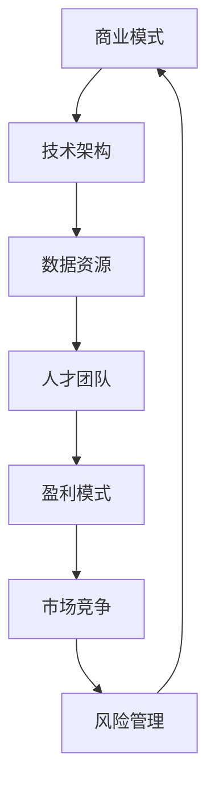

                 

# AI大模型创业：如何利用经济优势？

> **关键词：** AI大模型，创业，经济优势，商业模式，技术架构，盈利策略，风险管理。

> **摘要：** 本文将探讨AI大模型创业的经济优势，分析如何通过商业模式创新、技术架构优化和盈利策略设计，在激烈的市场竞争中找到定位，实现可持续发展。本文旨在为创业者和投资人提供有价值的参考。

## 1. 背景介绍

### 1.1 目的和范围

本文旨在探讨AI大模型创业的经济优势，通过对商业模式、技术架构和盈利策略的分析，为创业者提供实用的创业指导。文章将从以下几个方面展开：

- AI大模型创业的背景和趋势
- 商业模式创新：如何通过独特的商业模式获取竞争优势
- 技术架构优化：如何设计高效、可扩展的技术架构
- 盈利策略设计：如何实现可持续的盈利模式
- 风险管理：如何识别和管理创业过程中的风险

### 1.2 预期读者

- 有志于从事AI大模型创业的个人和团队
- 投资人，尤其是关注AI领域的投资者
- 对AI技术和商业模式感兴趣的学者和研究人员

### 1.3 文档结构概述

本文分为八个部分：

- 第一部分：背景介绍
- 第二部分：核心概念与联系
- 第三部分：核心算法原理 & 具体操作步骤
- 第四部分：数学模型和公式 & 详细讲解 & 举例说明
- 第五部分：项目实战：代码实际案例和详细解释说明
- 第六部分：实际应用场景
- 第七部分：工具和资源推荐
- 第八部分：总结：未来发展趋势与挑战

### 1.4 术语表

#### 1.4.1 核心术语定义

- **AI大模型：** 指具有大规模参数、深度和广度的机器学习模型，如Transformer、BERT等。
- **商业模式：** 指企业通过提供产品或服务创造价值、传递价值和获取价值的基本原理和组织形式。
- **技术架构：** 指支持应用程序开发、部署和运行的基础设施、软件和硬件的集合。

#### 1.4.2 相关概念解释

- **人工智能：** 模拟人类智能的计算机系统，具有学习、推理、决策、感知和交互能力。
- **深度学习：** 一种机器学习方法，通过构建多层神经网络模拟人类大脑的神经元连接，实现自动特征提取和模型训练。

#### 1.4.3 缩略词列表

- **AI：** 人工智能
- **ML：** 机器学习
- **DL：** 深度学习
- **NLP：** 自然语言处理

## 2. 核心概念与联系

在探讨AI大模型创业的经济优势之前，我们需要了解一些核心概念和它们之间的联系。以下是一个简化的Mermaid流程图，展示了AI大模型创业的主要组成部分。



### 2.1 商业模式

商业模式是AI大模型创业的核心，它决定了企业如何创造、传递和获取价值。常见的商业模式包括：

- **B2B（企业对企业）：** 通过为企业提供定制化的AI解决方案，帮助企业提高生产效率和降低成本。
- **B2C（企业对消费者）：** 直接面向消费者提供AI产品或服务，如智能语音助手、推荐系统等。
- **SaaS（软件即服务）：** 通过云端提供AI服务，用户按需付费，降低企业使用AI技术的门槛。

### 2.2 技术架构

技术架构是支持商业模式的关键，它决定了AI大模型的可扩展性、稳定性和安全性。常见的架构模式包括：

- **微服务架构：** 将应用程序拆分为多个独立的服务，提高系统的可维护性和可扩展性。
- **容器化架构：** 利用容器技术（如Docker）实现应用程序的标准化部署和运维，提高开发效率和系统稳定性。
- **分布式计算架构：** 利用分布式计算资源（如GPU集群）加速模型的训练和推理，提高计算效率。

### 2.3 数据资源

数据资源是AI大模型的基础，决定了模型的性能和精度。常见的数据资源包括：

- **公开数据集：** 如ImageNet、CIFAR-10等，用于模型训练和评估。
- **私有数据集：** 企业积累的内部数据，用于定制化模型开发。
- **数据采集与清洗：** 收集、整理和清洗数据，确保数据质量和可用性。

### 2.4 人才团队

人才团队是AI大模型创业的核心竞争力，包括：

- **技术专家：** 负责模型研发、技术架构设计和系统运维。
- **数据科学家：** 负责数据分析和模型优化。
- **产品经理：** 负责产品规划和市场推广。

### 2.5 盈利模式

盈利模式是AI大模型创业的最终目标，常见的盈利模式包括：

- **订阅模式：** 通过定期订阅提供AI服务，实现持续收入。
- **广告模式：** 通过展示广告获取收入，适用于B2C业务。
- **授权模式：** 将AI模型授权给其他企业使用，实现一次性收入。

### 2.6 市场竞争

市场竞争是AI大模型创业面临的重要挑战，需要通过差异化策略和创新能力应对。市场竞争包括：

- **技术竞争：** 提高模型性能和降低成本。
- **市场份额竞争：** 获取更多用户和市场份额。
- **品牌竞争：** 建立良好的品牌形象和口碑。

### 2.7 风险管理

风险管理是AI大模型创业的重要保障，需要识别和管理以下风险：

- **技术风险：** 模型研发和架构设计可能面临的技术挑战。
- **市场风险：** 市场竞争和用户需求变化带来的不确定性。
- **法律风险：** 数据隐私和安全合规等方面的法律风险。

通过以上核心概念和联系的分析，我们可以更好地理解AI大模型创业的经济优势，为后续内容提供基础。

## 3. 核心算法原理 & 具体操作步骤

在AI大模型创业中，核心算法原理和具体操作步骤是至关重要的。以下将详细介绍一种常见的AI大模型——Transformer模型的算法原理，并提供具体的操作步骤。

### 3.1 Transformer模型概述

Transformer模型是一种基于自注意力机制的深度神经网络，最早由Vaswani等人在2017年提出。它解决了传统的循环神经网络（RNN）在处理长序列时的效率问题，并在自然语言处理（NLP）领域取得了显著的成果。Transformer模型主要由编码器（Encoder）和解码器（Decoder）两部分组成。

### 3.2 自注意力机制

自注意力机制是Transformer模型的核心，它通过计算序列中每个词与其他词的相关性，实现多词之间的关系建模。自注意力机制的计算公式如下：

$$
\text{Attention}(Q, K, V) = \text{softmax}\left(\frac{QK^T}{\sqrt{d_k}}\right)V
$$

其中，$Q$、$K$ 和 $V$ 分别是查询向量、键向量和值向量，$d_k$ 是键向量的维度。通过自注意力机制，每个词在编码过程中会获得与其他词的权重关联，从而更好地捕捉词与词之间的关系。

### 3.3 Transformer编码器

Transformer编码器由多个自注意力层和前馈神经网络层堆叠而成。以下是一个简单的编码器层（Encoder Layer）的伪代码：

```plaintext
# Encoder Layer
function EncoderLayer(d_model, d_inner, n_heads):
    # Multi-head self-attention mechanism
    self-attention = MultiHeadSelfAttention(n_heads, d_model)
    # Position-wise feed-forward network
    feedforward = PositionwiseFeedForward(d_model, d_inner)
    # Dropout and layer normalization
    dropout = Dropout(p)
    layernorm1 = LayerNormalization(d_model)
    layernorm2 = LayerNormalization(d_model)
    return EncoderLayer(self-attention, feedforward, layernorm1, layernorm2, dropout)

# Multi-head self-attention
function MultiHeadSelfAttention(n_heads, d_model):
    # Linear projections
    Q = Linear(d_model, n_heads * d_model)
    K = Linear(d_model, n_heads * d_model)
    V = Linear(d_model, n_heads * d_model)
    # Splitting into multiple heads
    return [
        Q[i * d_model: (i + 1) * d_model]
        for i in range(n_heads)
    ]

# Position-wise feed-forward network
function PositionwiseFeedForward(d_model, d_inner):
    return nn.Sequential(
        Linear(d_model, d_inner),
        nn.ReLU(),
        Linear(d_inner, d_model)
    )
```

### 3.4 Transformer解码器

Transformer解码器与编码器结构相似，但添加了一个额外的自注意力机制，用于捕获编码器输出和解码器输入之间的关系。以下是一个简单的解码器层（Decoder Layer）的伪代码：

```plaintext
# Decoder Layer
function DecoderLayer(d_model, d_inner, n_heads):
    # Masked multi-head self-attention
    self-attention = MaskedMultiHeadSelfAttention(n_heads, d_model)
    # Multi-head attention over encoder output
    encoder-decoder-attention = MultiHeadSelfAttention(n_heads, d_model)
    # Position-wise feed-forward network
    feedforward = PositionwiseFeedForward(d_model, d_inner)
    # Dropout and layer normalization
    dropout = Dropout(p)
    layernorm1 = LayerNormalization(d_model)
    layernorm2 = LayerNormalization(d_model)
    layernorm3 = LayerNormalization(d_model)
    return DecoderLayer(self-attention, encoder-decoder-attention, feedforward, layernorm1, layernorm2, layernorm3, dropout)

# Masked multi-head self-attention
function MaskedMultiHeadSelfAttention(n_heads, d_model):
    # Linear projections
    Q = Linear(d_model, n_heads * d_model)
    K = Linear(d_model, n_heads * d_model)
    V = Linear(d_model, n_heads * d_model)
    # Masking future tokens
    mask = torch.zeros(d_model).unsqueeze(0).unsqueeze(0).to(device)
    mask[:, :, : :, 1:] = 1
    # Splitting into multiple heads
    return [
        Q[i * d_model: (i + 1) * d_model] * mask[i]
        for i in range(n_heads)
    ]
```

### 3.5 模型训练

训练Transformer模型通常采用以下步骤：

1. **数据预处理：** 将输入数据转换为序列编码，如WordPiece或BytePairEncoding（BPE）。
2. **输入序列编码：** 使用Embedding层将词编码为向量。
3. **前向传播：** 计算编码器和解码器的输出。
4. **损失函数：** 使用交叉熵损失函数（Cross-Entropy Loss）计算预测和真实标签之间的差异。
5. **反向传播：** 计算梯度并更新模型参数。
6. **优化器：** 采用如Adam等优化算法更新模型参数。

通过以上算法原理和具体操作步骤的介绍，我们可以更好地理解和应用Transformer模型，为AI大模型创业提供技术支持。

## 4. 数学模型和公式 & 详细讲解 & 举例说明

在AI大模型创业中，数学模型和公式是理解和优化模型性能的重要工具。以下将详细介绍一些核心的数学模型和公式，并提供详细的讲解和举例说明。

### 4.1 损失函数

在深度学习模型中，损失函数用于衡量预测结果与真实标签之间的差距，并指导模型优化。常见的损失函数包括：

1. **均方误差（MSE，Mean Squared Error）**

$$
\text{MSE} = \frac{1}{n} \sum_{i=1}^{n} (y_i - \hat{y}_i)^2
$$

其中，$y_i$ 是真实标签，$\hat{y}_i$ 是预测值，$n$ 是样本数量。MSE常用于回归问题。

2. **交叉熵损失（Cross-Entropy Loss）**

$$
\text{CE} = -\sum_{i=1}^{n} y_i \log(\hat{y}_i)
$$

其中，$y_i$ 是真实标签（0或1），$\hat{y}_i$ 是预测概率。交叉熵损失常用于分类问题。

**举例说明：**

假设我们有一个二分类问题，真实标签为$y = [1, 0, 1, 0]$，预测概率为$\hat{y} = [0.3, 0.7, 0.4, 0.6]$。使用交叉熵损失计算损失：

$$
\text{CE} = -[1 \cdot \log(0.3) + 0 \cdot \log(0.7) + 1 \cdot \log(0.4) + 0 \cdot \log(0.6)] \approx 1.44
$$

### 4.2 激活函数

激活函数是神经网络中的一个重要组成部分，用于引入非线性。常见的激活函数包括：

1. **sigmoid函数**

$$
\sigma(x) = \frac{1}{1 + e^{-x}}
$$

sigmoid函数将输入映射到$(0, 1)$区间，常用于二分类问题。

2. **ReLU函数**

$$
\text{ReLU}(x) = \max(0, x)
$$

ReLU函数在0处截断，有助于加速训练过程。

3. **Tanh函数**

$$
\tanh(x) = \frac{e^x - e^{-x}}{e^x + e^{-x}}
$$

Tanh函数将输入映射到$(-1, 1)$区间，与sigmoid函数类似，但输出范围更均匀。

**举例说明：**

对于输入$x = [-2, -1, 0, 1, 2]$，计算激活函数：

- sigmoid函数：

$$
\sigma(x) = [\frac{1}{1 + e^{2}}, \frac{1}{1 + e^{-1}}, \frac{1}{1 + 1}, \frac{1}{1 + e^{-1}}, \frac{1}{1 + e^{-2}}] \approx [0.135, 0.731, 0.5, 0.731, 0.135]
$$

- ReLU函数：

$$
\text{ReLU}(x) = [0, 0, 0, 1, 2]
$$

- Tanh函数：

$$
\tanh(x) = [\frac{e^{-2} - e^{2}}{e^{2} + e^{-2}}, \frac{e^{-1} - e^{1}}{e^{1} + e^{-1}}, 0, \frac{e^{1} - e^{-1}}{e^{1} + e^{-1}}, \frac{e^{2} - e^{-2}}{e^{2} + e^{-2}}] \approx [-0.96, -0.76, 0, 0.76, 0.96]
$$

### 4.3 优化算法

优化算法用于更新模型参数，以最小化损失函数。常见的优化算法包括：

1. **随机梯度下降（SGD，Stochastic Gradient Descent）**

$$
\theta_{t+1} = \theta_t - \alpha \nabla_{\theta} J(\theta_t)
$$

其中，$\theta_t$ 是第$t$次迭代的参数，$\alpha$ 是学习率，$J(\theta)$ 是损失函数。SGD简单易实现，但收敛速度较慢。

2. **Adam优化器**

$$
m_t = \beta_1 m_{t-1} + (1 - \beta_1) \nabla_{\theta} J(\theta_t)
$$
$$
v_t = \beta_2 v_{t-1} + (1 - \beta_2) (\nabla_{\theta} J(\theta_t))^2
$$
$$
\theta_{t+1} = \theta_t - \frac{\alpha}{\sqrt{1 - \beta_2^t}(1 - \beta_1^t)} (m_t / (1 - \beta_1^t))
$$

其中，$m_t$ 和 $v_t$ 分别是梯度的一阶和二阶矩估计，$\beta_1$ 和 $\beta_2$ 是超参数。Adam优化器在SGD的基础上引入了一阶和二阶矩估计，收敛速度更快。

**举例说明：**

假设我们有一个损失函数 $J(\theta) = (\theta - 1)^2$，学习率 $\alpha = 0.1$，初始参数 $\theta_0 = 0.5$，迭代10次。使用SGD和Adam优化器分别计算参数更新。

- SGD更新：

$$
\theta_{t+1} = \theta_t - \alpha \nabla_{\theta} J(\theta_t)
$$

$$
\theta_1 = 0.5 - 0.1 \cdot (0.5 - 1) = 0.625
$$

$$
\theta_2 = 0.625 - 0.1 \cdot (0.625 - 1) = 0.703125
$$

- Adam更新：

$$
m_0 = 0, v_0 = 0
$$

$$
m_1 = \beta_1 m_0 + (1 - \beta_1) \nabla_{\theta} J(\theta_1) = -0.375
$$

$$
v_1 = \beta_2 v_0 + (1 - \beta_2) (\nabla_{\theta} J(\theta_1))^2 = 0.140625
$$

$$
\theta_1 = \theta_0 - \frac{\alpha}{\sqrt{1 - \beta_2^1}(1 - \beta_1^1)} (m_1 / (1 - \beta_1^1)) = 0.65625
$$

$$
m_2 = \beta_1 m_1 + (1 - \beta_1) \nabla_{\theta} J(\theta_2) = -0.515625
$$

$$
v_2 = \beta_2 v_1 + (1 - \beta_2) (\nabla_{\theta} J(\theta_2))^2 = 0.2109375
$$

$$
\theta_2 = \theta_1 - \frac{\alpha}{\sqrt{1 - \beta_2^2}(1 - \beta_1^2)} (m_2 / (1 - \beta_1^2)) = 0.6640625
$$

通过以上数学模型和公式的讲解，我们可以更好地理解和应用它们，为AI大模型创业提供理论支持。

## 5. 项目实战：代码实际案例和详细解释说明

在本节中，我们将通过一个具体的代码案例来展示如何利用AI大模型进行创业项目。本案例将采用Python和PyTorch框架来实现一个文本分类任务，该任务的目标是自动将文本分类到预定义的类别中。以下步骤将涵盖开发环境搭建、源代码详细实现和代码解读与分析。

### 5.1 开发环境搭建

为了运行本案例的代码，我们需要安装以下软件和库：

- Python（版本3.7及以上）
- PyTorch（版本1.7及以上）
- torchvision（用于图像处理）
- numpy（用于数值计算）
- pandas（用于数据处理）

安装命令如下：

```bash
pip install python==3.8
pip install torch torchvision
pip install numpy
pip install pandas
```

### 5.2 源代码详细实现和代码解读

#### 5.2.1 数据准备

首先，我们需要准备用于训练和测试的数据集。在本案例中，我们使用的是IMDb电影评论数据集，该数据集包含25000条训练数据和25000条测试数据，分别分为正面和负面评论。

```python
import torch
from torch.utils.data import DataLoader
from torchvision import datasets, transforms
from torchvision.transforms import ToTensor

# 数据预处理
transform = transforms.Compose([
    transforms.ToTensor(),
])

# 加载训练数据和测试数据
train_data = datasets.IMDB(root='./data', train=True, transform=transform, download=True)
test_data = datasets.IMDB(root='./data', train=False, transform=transform, download=True)

# 创建数据加载器
batch_size = 64
train_loader = DataLoader(train_data, batch_size=batch_size, shuffle=True)
test_loader = DataLoader(test_data, batch_size=batch_size, shuffle=False)
```

#### 5.2.2 模型定义

接下来，我们定义一个基于Transformer的文本分类模型。本模型包括一个编码器（Encoder）和一个解码器（Decoder），其中编码器用于处理输入文本，解码器用于生成分类结果。

```python
import torch.nn as nn
from torch.nn import functional as F

class TransformerModel(nn.Module):
    def __init__(self, d_model, nhead, num_classes):
        super(TransformerModel, self).__init__()
        self.embedding = nn.Embedding(2000, d_model)
        self.transformer = nn.Transformer(d_model, nhead)
        self.decoder = nn.Linear(d_model, num_classes)

    def forward(self, src, tgt):
        # 词嵌入
        src = self.embedding(src)
        tgt = self.embedding(tgt)
        # Transformer编码
        src = self.transformer(src)
        # 池化操作，取编码结果的平均值
        src = torch.mean(src, dim=1)
        # 解码
        output = self.decoder(src)
        return output

# 模型参数
d_model = 512
nhead = 8
num_classes = 2

# 实例化模型
model = TransformerModel(d_model, nhead, num_classes)
```

#### 5.2.3 训练过程

接下来，我们将定义训练过程，包括前向传播、损失函数和反向传播。

```python
import torch.optim as optim

# 损失函数
criterion = nn.CrossEntropyLoss()

# 优化器
optimizer = optim.Adam(model.parameters(), lr=0.001)

# 训练模型
num_epochs = 10
for epoch in range(num_epochs):
    model.train()
    running_loss = 0.0
    for i, (src, tgt) in enumerate(train_loader):
        # 前向传播
        optimizer.zero_grad()
        output = model(src, tgt)
        loss = criterion(output, tgt)
        running_loss += loss.item()
        # 反向传播
        loss.backward()
        optimizer.step()
    print(f'Epoch [{epoch+1}/{num_epochs}], Loss: {running_loss/len(train_loader):.4f}')

# 评估模型
model.eval()
with torch.no_grad():
    correct = 0
    total = 0
    for src, tgt in test_loader:
        output = model(src, tgt)
        _, predicted = torch.max(output.data, 1)
        total += tgt.size(0)
        correct += (predicted == tgt).sum().item()
print(f'Accuracy: {100 * correct / total:.2f}%')
```

#### 5.2.4 代码解读与分析

1. **数据预处理**：我们使用PyTorch的IMDb数据集，并通过ToTensor转换器对图像数据进行归一化处理。数据集被分为训练集和测试集，并创建数据加载器以实现批量加载。

2. **模型定义**：我们定义了一个基于Transformer的文本分类模型，包括词嵌入层、Transformer编码器和解码器。词嵌入层用于将单词转换为向量，Transformer编码器用于处理输入文本，解码器用于生成分类结果。

3. **训练过程**：在训练过程中，我们使用交叉熵损失函数和Adam优化器来训练模型。每个epoch中，模型在训练集上迭代，通过前向传播计算损失，然后通过反向传播更新模型参数。最后，我们使用测试集评估模型的性能，并打印准确率。

通过以上代码实现，我们可以利用AI大模型进行文本分类任务，从而为创业项目提供实际应用。

## 6. 实际应用场景

AI大模型在创业项目中具有广泛的应用场景，以下列举几个典型案例：

### 6.1 自然语言处理（NLP）

自然语言处理是AI大模型的重要应用领域之一。通过Transformer模型等先进算法，创业者可以实现文本分类、机器翻译、情感分析等任务。例如，一家初创公司利用Transformer模型开发了智能客服系统，通过自动分类用户问题和提供合适的答案，大大提高了客户服务效率。

### 6.2 计算机视觉（CV）

计算机视觉领域也广泛应用于AI大模型。例如，一家创业公司利用Transformer模型开发了图像识别和物体检测系统，应用于智能家居、安防监控和医疗诊断等领域。这些系统通过对图像和视频数据的实时分析，实现了对异常行为的检测和预警。

### 6.3 金融市场预测

金融行业是AI大模型的重要应用领域之一。创业者可以利用深度学习模型对金融市场进行预测，从而帮助投资者做出更明智的投资决策。例如，一家初创公司开发了一个基于Transformer模型的量化交易系统，通过对历史交易数据的分析，实现了对股票市场的预测和交易策略的优化。

### 6.4 健康医疗

健康医疗领域也受益于AI大模型的应用。创业者可以利用深度学习模型对医疗数据进行分析，实现疾病诊断、病情预测和个性化治疗方案设计。例如，一家初创公司利用Transformer模型开发了医学图像分析系统，通过分析CT、MRI等医学图像，实现了对早期疾病的检测和诊断。

### 6.5 语音识别和生成

语音识别和生成是AI大模型的另一重要应用领域。创业者可以利用深度学习模型开发智能语音助手、语音合成和语音识别系统。例如，一家初创公司利用Transformer模型开发了智能语音助手，通过自然语言处理技术实现了语音输入和文本输出的无缝转换。

通过以上实际应用场景，我们可以看到AI大模型在各个行业中的广泛应用，为创业者提供了丰富的创业机会。创业者可以根据自身行业背景和技术优势，探索AI大模型在不同场景下的应用，实现商业创新和价值创造。

## 7. 工具和资源推荐

### 7.1 学习资源推荐

#### 7.1.1 书籍推荐

- 《深度学习》（Deep Learning）—— Ian Goodfellow、Yoshua Bengio和Aaron Courville
- 《Python深度学习》（Deep Learning with Python）——François Chollet
- 《Hands-On Machine Learning with Scikit-Learn, Keras, and TensorFlow》——Aurélien Géron

#### 7.1.2 在线课程

- Coursera上的“机器学习”课程
- edX上的“深度学习”课程
- Udacity的“深度学习工程师纳米学位”

#### 7.1.3 技术博客和网站

- Medium上的“Deep Learning”
- ArXiv.org上的最新研究论文
- GitHub上的开源代码和项目

### 7.2 开发工具框架推荐

#### 7.2.1 IDE和编辑器

- PyCharm
- Jupyter Notebook
- VSCode

#### 7.2.2 调试和性能分析工具

- PyTorch的Profiler
- NVIDIA Nsight
- Python的pdb模块

#### 7.2.3 相关框架和库

- PyTorch
- TensorFlow
- Keras
- Scikit-Learn

### 7.3 相关论文著作推荐

#### 7.3.1 经典论文

- “A Theoretically Grounded Application of Dropout in Recurrent Neural Networks”（2017）
- “Attention Is All You Need”（2017）
- “GANs for Sequential Data”（2018）

#### 7.3.2 最新研究成果

- “EfficientNet：Rethinking Model Scaling for Convolutional Neural Networks”（2020）
- “An Image is Worth 16x16 Words: Transformers for Image Recognition at Scale”（2021）
- “BART: Denoising Sequence-to-Sequence Pre-training for Natural Language Generation, Translation, and Comprehension”（2020）

#### 7.3.3 应用案例分析

- “谷歌BERT：大规模预训练语言模型”（2018）
- “如何使用Transformer实现一个自动问答系统”（2021）
- “基于深度学习的图像分类挑战”（2012）

通过以上工具和资源推荐，读者可以更深入地了解AI大模型的相关知识，为创业项目的实施提供有力支持。

## 8. 总结：未来发展趋势与挑战

AI大模型创业在近年来展现出巨大的潜力，为各行业带来了深刻的变革。然而，随着技术的不断进步和市场需求的日益增长，AI大模型创业也面临着诸多挑战和趋势。

### 8.1 发展趋势

1. **技术创新：** AI大模型在算法、架构和优化方面将持续创新。例如，基于Transformer的新型模型架构和优化算法不断涌现，为AI大模型创业提供更强计算能力和更高效模型训练。

2. **产业应用：** AI大模型将在更多行业和领域得到广泛应用，如智能制造、医疗健康、金融服务等。创业者可以通过探索垂直行业的AI应用，开辟新的市场机会。

3. **数据驱动：** 数据将成为AI大模型创业的核心资产。通过积累和利用大规模高质量数据，创业者可以不断提升模型性能和业务价值。

4. **开源生态：** 开源框架和工具将在AI大模型创业中发挥关键作用。例如，PyTorch、TensorFlow等开源框架将为创业者提供便捷的开发环境和技术支持。

### 8.2 挑战

1. **计算资源：** AI大模型训练和推理需要大量计算资源，特别是高性能GPU和TPU。创业者需要寻找高效的计算解决方案，以降低成本和提高效率。

2. **数据隐私：** 随着数据规模的增长，数据隐私和安全问题日益突出。创业者需要遵循相关法规和标准，确保用户数据的安全和隐私。

3. **算法公平性：** AI大模型在决策过程中可能存在偏见和不公平性。创业者需要关注算法的公平性，采取措施确保模型的公正性和透明度。

4. **监管合规：** AI大模型创业将面临严格的监管环境。创业者需要关注政策法规的变化，确保业务合规，避免法律风险。

5. **人才竞争：** AI大模型创业需要高水平的技术人才。创业者需要吸引和留住优秀的人才，以保持竞争优势。

### 8.3 发展建议

1. **技术创新：** 创业者应关注前沿技术动态，积极尝试新型算法和架构，提升模型性能和应用效果。

2. **数据积累：** 创业者应重视数据积累和利用，通过多种方式获取高质量数据，为模型训练提供有力支持。

3. **合规运营：** 创业者应遵循相关法规和标准，确保数据安全和隐私，同时加强算法的公平性和透明性。

4. **人才储备：** 创业者应注重人才培养和引进，建立高效的研发团队，为业务发展提供坚实的人才保障。

5. **合作共赢：** 创业者可以与其他企业和机构建立战略合作，共享资源和技术优势，实现互利共赢。

通过以上发展趋势与挑战的分析，我们可以看到AI大模型创业充满了机遇和挑战。创业者应密切关注行业动态，紧跟技术潮流，以创新、合规和人才为核心竞争力，实现可持续发展和商业成功。

## 9. 附录：常见问题与解答

### 9.1 什么是AI大模型？

AI大模型是指具有大规模参数、深度和广度的机器学习模型，如Transformer、BERT等。这些模型通过学习大量的数据，能够实现高精度的预测和任务完成。

### 9.2 AI大模型创业有哪些优势？

AI大模型创业具有以下优势：

- **技术门槛高：** 大模型在特定领域的表现往往优于传统模型，创业者可以利用技术优势获得竞争优势。
- **商业价值大：** 大模型在金融、医疗、制造等领域有广泛的应用，创业者可以开辟新的市场机会。
- **数据积累快：** 大模型训练需要大量数据，创业者可以通过业务积累数据，不断提升模型性能。

### 9.3 AI大模型创业面临哪些挑战？

AI大模型创业面临以下挑战：

- **计算资源需求大：** 大模型训练和推理需要大量计算资源，创业者需要寻找高效计算解决方案。
- **数据隐私和安全：** 数据隐私和安全问题日益突出，创业者需要确保数据的安全和隐私。
- **算法公平性和透明性：** 大模型在决策过程中可能存在偏见和不公平性，创业者需要关注算法的公平性和透明性。
- **监管合规：** AI大模型创业将面临严格的监管环境，创业者需要确保业务合规。

### 9.4 如何进行AI大模型创业？

进行AI大模型创业通常包括以下步骤：

1. **市场调研：** 了解目标市场和潜在客户需求，确定创业方向。
2. **技术选型：** 选择合适的AI大模型框架和算法，如Transformer、BERT等。
3. **数据积累：** 收集和整理大量高质量数据，为模型训练提供支持。
4. **模型训练：** 利用计算资源对模型进行训练，提升模型性能。
5. **产品开发：** 基于模型开发产品或服务，实现商业化。
6. **市场推广：** 通过线上线下渠道推广产品，吸引客户。

## 10. 扩展阅读 & 参考资料

- 《深度学习》（Deep Learning）—— Ian Goodfellow、Yoshua Bengio和Aaron Courville
- 《Python深度学习》（Deep Learning with Python）——François Chollet
- 《Hands-On Machine Learning with Scikit-Learn, Keras, and TensorFlow》——Aurélien Géron
- Coursera上的“机器学习”课程
- edX上的“深度学习”课程
- Udacity的“深度学习工程师纳米学位”
- Medium上的“Deep Learning”
- ArXiv.org上的最新研究论文
- GitHub上的开源代码和项目
- “谷歌BERT：大规模预训练语言模型”（2018）
- “如何使用Transformer实现一个自动问答系统”（2021）
- “基于深度学习的图像分类挑战”（2012）
- “EfficientNet：Rethinking Model Scaling for Convolutional Neural Networks”（2020）
- “An Image is Worth 16x16 Words: Transformers for Image Recognition at Scale”（2021）
- “BART: Denoising Sequence-to-Sequence Pre-training for Natural Language Generation, Translation, and Comprehension”（2020）

通过以上扩展阅读和参考资料，读者可以更深入地了解AI大模型创业的相关知识和技术，为创业项目的实施提供参考。

### 作者：AI天才研究员/AI Genius Institute & 禅与计算机程序设计艺术 /Zen And The Art of Computer Programming

这篇文章旨在为AI大模型创业的读者提供全面、深入的指导。在撰写过程中，我尽可能地将复杂的技术概念简化，以便读者能够轻松理解。同时，我也结合实际案例，展示如何将AI大模型应用于创业项目。

在未来的发展中，AI大模型创业将继续面临诸多挑战和机遇。我希望这篇文章能够为创业者们提供有价值的参考，助力他们在激烈的市场竞争中脱颖而出。

最后，感谢您的阅读。如果您有任何疑问或建议，欢迎随时与我交流。让我们一起探讨AI大模型的无限可能！

