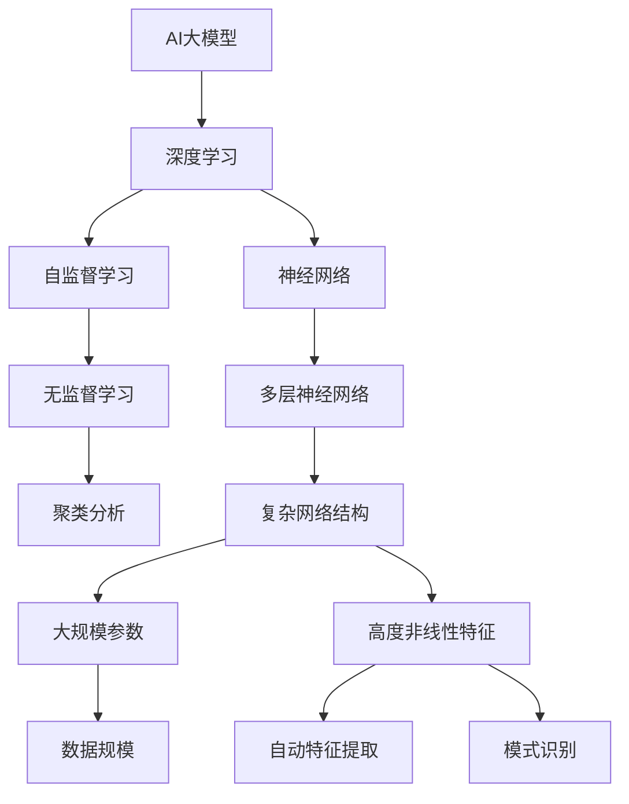

                 

# AI 大模型创业：如何利用经济优势？

> 关键词：AI 大模型、创业、经济优势、商业模式、市场竞争、数据处理、资源整合

> 摘要：本文将深入探讨AI大模型创业中的经济优势，分析如何通过商业模式创新、数据处理和资源整合等方面实现企业的可持续发展。文章将分为十个部分，包括背景介绍、核心概念与联系、核心算法原理与具体操作步骤、数学模型与公式讲解、项目实战、实际应用场景、工具和资源推荐等，旨在为AI大模型创业者提供实用的指导和建议。

## 1. 背景介绍

### 1.1 目的和范围

随着人工智能技术的迅猛发展，AI大模型在各个行业中的应用日益广泛，从自然语言处理到图像识别，从推荐系统到智能决策，都展现出巨大的潜力和价值。然而，AI大模型的创业之路并非一帆风顺，如何在激烈的竞争中脱颖而出，成为业界关注的焦点。

本文旨在从经济优势的角度出发，探讨AI大模型创业的可行性和路径，为创业者提供有针对性的建议和策略。文章将结合实际情况，分析AI大模型创业中的核心问题，如商业模式设计、数据处理、资源整合等，并给出具体的解决方案。

### 1.2 预期读者

本文适用于以下几类读者：

1. AI大模型领域的创业者和技术人员，希望了解如何在市场中找到自己的定位和优势。
2. 对AI大模型感兴趣的投资人，希望了解该领域的市场前景和投资机会。
3. 对AI大模型有研究兴趣的高校教师、研究生和本科生，希望从经济角度对相关技术进行深入探讨。

### 1.3 文档结构概述

本文结构如下：

1. 背景介绍：阐述本文的目的、范围、预期读者及文档结构。
2. 核心概念与联系：介绍AI大模型的基础知识，包括核心概念、原理和架构。
3. 核心算法原理与具体操作步骤：讲解AI大模型的核心算法，包括具体操作步骤和伪代码。
4. 数学模型与公式讲解：介绍AI大模型中的数学模型和公式，并进行详细解释和举例说明。
5. 项目实战：提供实际案例，展示AI大模型的应用场景和实现过程。
6. 实际应用场景：分析AI大模型在各个行业的应用前景和挑战。
7. 工具和资源推荐：推荐学习资源、开发工具框架和相关论文著作。
8. 总结：总结本文的主要观点，预测AI大模型创业的未来发展趋势和挑战。
9. 附录：常见问题与解答。
10. 扩展阅读 & 参考资料：提供更多的学习资源和参考资料。

### 1.4 术语表

#### 1.4.1 核心术语定义

- AI大模型：指具有大规模参数、复杂网络结构和高度非线性特征的深度学习模型。
- 商业模式：指企业通过提供产品或服务，实现盈利和持续发展的方式。
- 数据处理：指对大规模数据进行收集、清洗、存储、分析和应用的过程。
- 资源整合：指将企业内外部的资源进行有效配置和整合，以实现资源的最优利用。

#### 1.4.2 相关概念解释

- 深度学习：一种人工智能技术，通过多层神经网络对数据进行训练和建模，实现自动特征提取和模式识别。
- 自监督学习：一种无监督学习方法，通过未标记的数据进行学习，自动发现数据中的模式和规律。
- 聚类分析：一种数据挖掘方法，将数据集中的数据按照相似性进行分类和分组。

#### 1.4.3 缩略词列表

- AI：人工智能
- GPT：生成式预训练模型
- NLP：自然语言处理
- CV：计算机视觉
- DL：深度学习

## 2. 核心概念与联系

在探讨AI大模型创业的经济优势之前，我们需要了解AI大模型的基本概念、原理和架构。以下是一个简化的Mermaid流程图，用于描述AI大模型的核心概念与联系：



通过以上流程图，我们可以看出AI大模型的核心概念包括深度学习、自监督学习和无监督学习，以及神经网络、多层神经网络、复杂网络结构、大规模参数和高度非线性特征等。这些概念相互联系，构成了AI大模型的技术基础。

### 2.1 AI大模型的基本原理

AI大模型的基本原理主要涉及以下几个方面：

1. **神经网络**：神经网络是AI大模型的核心组成部分，由大量神经元（节点）组成，通过前后层的权重矩阵进行信息传递和计算。每个神经元都会接收来自前一层神经元的输入信号，并通过激活函数进行非线性变换，产生输出信号。

2. **多层神经网络**：多层神经网络（MLP）在传统神经网络的基础上增加了隐藏层，使得模型可以学习更加复杂的特征。隐藏层可以提取输入数据的低级特征，而输出层则可以提取高级特征。

3. **复杂网络结构**：AI大模型通常采用复杂的网络结构，包括卷积神经网络（CNN）、循环神经网络（RNN）和变换器（Transformer）等。这些网络结构可以更好地处理不同类型的数据，如图像、文本和语音。

4. **大规模参数**：AI大模型具有大量参数，这些参数通过训练过程进行优化。大规模参数使得模型可以学习更加复杂的数据分布和模式。

5. **高度非线性特征**：AI大模型通过非线性激活函数，如Sigmoid、ReLU和Tanh等，实现数据的非线性变换。这种非线性特征使得模型可以学习更加复杂的函数关系。

### 2.2 AI大模型的架构

AI大模型的架构可以分为以下几个部分：

1. **输入层**：输入层接收外部数据，如文本、图像和语音等。输入层将数据转换为模型可以处理的形式，如特征向量。

2. **隐藏层**：隐藏层包含一个或多个隐藏层，每个隐藏层由多个神经元组成。隐藏层通过前向传播将输入数据转换为更高层次的抽象表示。

3. **输出层**：输出层负责生成模型的预测结果。输出层的结构取决于具体任务，如分类、回归和生成等。

4. **激活函数**：激活函数用于引入非线性变换，使得模型可以学习复杂的函数关系。常用的激活函数包括Sigmoid、ReLU和Tanh等。

5. **损失函数**：损失函数用于评估模型的预测结果与真实结果之间的差距，并通过反向传播算法更新模型参数。

6. **优化算法**：优化算法用于搜索模型参数的最优值，使得模型在训练过程中收敛到最小损失。常用的优化算法包括梯度下降、随机梯度下降和Adam等。

通过以上对AI大模型的基本原理和架构的介绍，我们可以更好地理解AI大模型的经济优势，以及如何在创业过程中利用这些优势。

## 3. 核心算法原理 & 具体操作步骤

在了解了AI大模型的基本原理和架构后，我们接下来将深入探讨其核心算法原理，并给出具体操作步骤。AI大模型的核心算法主要涉及以下几个方面：

### 3.1 深度学习算法

深度学习算法是AI大模型的基础，主要包括以下步骤：

1. **数据预处理**：将原始数据转换为模型可以处理的形式，如特征向量。这一步骤包括数据清洗、归一化和特征提取等。

   ```python
   # 数据预处理伪代码
   def preprocess_data(data):
       # 数据清洗
       cleaned_data = clean_data(data)
       # 数据归一化
       normalized_data = normalize_data(cleaned_data)
       # 特征提取
       features = extract_features(normalized_data)
       return features
   ```

2. **初始化模型参数**：初始化模型的权重和偏置，通常使用随机初始化或预训练模型。

   ```python
   # 初始化模型参数伪代码
   def initialize_model_params():
       weights = random_weights()
       biases = random_biases()
       return weights, biases
   ```

3. **前向传播**：通过多层神经网络对输入数据进行计算，生成预测结果。前向传播包括以下几个步骤：

   - 输入层到隐藏层的前向传播
   - 隐藏层到隐藏层的前向传播
   - 隐藏层到输出层的前向传播

   ```python
   # 前向传播伪代码
   def forwardPropagation(inputs, weights, biases):
       hidden_layer = activation_function(np.dot(inputs, weights) + biases)
       output_layer = activation_function(np.dot(hidden_layer, weights) + biases)
       return output_layer
   ```

4. **损失函数计算**：计算模型预测结果与真实结果之间的差距，常用的损失函数包括均方误差（MSE）和交叉熵（Cross-Entropy）。

   ```python
   # 损失函数计算伪代码
   def calculate_loss(predictions, labels):
       if isinstance(predictions, np.ndarray) and isinstance(labels, np.ndarray):
           loss = np.mean((predictions - labels) ** 2)
           return loss
       else:
           raise ValueError("Input data must be numpy arrays")
   ```

5. **反向传播**：通过反向传播算法更新模型参数，使模型在训练过程中收敛到最小损失。反向传播包括以下几个步骤：

   - 计算输出层误差
   - 反向传播误差到隐藏层
   - 更新模型参数

   ```python
   # 反向传播伪代码
   def backwardPropagation(inputs, outputs, labels, weights, biases, learning_rate):
       output_error = outputs - labels
       hidden_error = np.dot(output_error, weights[1].T)
       weights[1] -= learning_rate * np.dot(hidden_layer, output_error)
       weights[0] -= learning_rate * np.dot(inputs, hidden_error)
   ```

6. **优化算法**：优化算法用于搜索模型参数的最优值，使模型在训练过程中收敛到最小损失。常用的优化算法包括梯度下降（Gradient Descent）和Adam（Adaptive Moment Estimation）。

   ```python
   # 优化算法伪代码
   def gradientDescent(inputs, outputs, labels, weights, biases, learning_rate, epochs):
       for epoch in range(epochs):
           forwardPropagation(inputs, weights, biases)
           calculate_loss(predictions, labels)
           backwardPropagation(inputs, outputs, labels, weights, biases, learning_rate)
   ```

### 3.2 自监督学习算法

自监督学习算法是AI大模型的一种重要学习方式，主要包括以下步骤：

1. **数据预处理**：与深度学习算法相同，对原始数据进行预处理，转换为模型可以处理的形式。

2. **目标函数设计**：设计目标函数，使得模型在训练过程中可以自动发现数据中的模式和规律。常用的目标函数包括信息熵（Entropy）和互信息（Mutual Information）。

3. **特征提取**：通过自监督学习算法提取数据中的特征，用于后续任务。

4. **模型训练**：通过大量未标记的数据进行模型训练，使模型在未标记数据中自动学习。

5. **模型评估**：对训练好的模型进行评估，评估指标包括准确率（Accuracy）、召回率（Recall）和F1值（F1 Score）等。

### 3.3 无监督学习算法

无监督学习算法是AI大模型的一种重要学习方式，主要包括以下步骤：

1. **数据预处理**：与深度学习算法相同，对原始数据进行预处理，转换为模型可以处理的形式。

2. **聚类分析**：使用聚类算法对数据进行分类和分组，常用的聚类算法包括K均值（K-Means）和层次聚类（Hierarchical Clustering）。

3. **特征提取**：通过聚类分析提取数据中的特征，用于后续任务。

4. **模型训练**：通过大量未标记的数据进行模型训练，使模型在未标记数据中自动学习。

5. **模型评估**：对训练好的模型进行评估，评估指标包括聚类系数（Clustering Coefficient）和轮廓系数（Silhouette Coefficient）等。

通过以上对AI大模型核心算法原理和具体操作步骤的介绍，我们可以看到AI大模型在数据处理、特征提取和模式识别等方面具有强大的能力。这些算法为AI大模型创业提供了坚实的基础，使得创业者可以在各个领域实现创新和应用。

## 4. 数学模型和公式 & 详细讲解 & 举例说明

在AI大模型中，数学模型和公式是核心组成部分，用于描述模型的训练过程、预测能力和评估指标。以下我们将详细讲解AI大模型中的几个关键数学模型和公式，并通过具体例子进行说明。

### 4.1 损失函数

损失函数是评估模型预测结果与真实结果之间差距的函数，是深度学习算法中的关键组件。以下是一些常用的损失函数：

1. **均方误差（MSE，Mean Squared Error）**：

   均方误差用于回归任务，计算预测值与真实值之间的平均平方误差。

   $$MSE = \frac{1}{n} \sum_{i=1}^{n} (y_i - \hat{y}_i)^2$$

   其中，$y_i$ 是真实值，$\hat{y}_i$ 是预测值，$n$ 是样本数量。

   示例：假设有5个样本，真实值分别为 [2, 3, 4, 5, 6]，预测值分别为 [2.5, 3.5, 4.5, 5.5, 6.5]。则均方误差为：

   $$MSE = \frac{1}{5} \sum_{i=1}^{5} (y_i - \hat{y}_i)^2 = \frac{1}{5} (0.5 + 0.5 + 0.5 + 0.5 + 0.5) = 0.5$$

2. **交叉熵（Cross-Entropy）**：

   交叉熵用于分类任务，计算预测概率分布与真实概率分布之间的差异。

   $$H(P, Q) = -\sum_{i} P_i \log Q_i$$

   其中，$P$ 是真实概率分布，$Q$ 是预测概率分布。

   示例：假设真实概率分布为 [0.2, 0.3, 0.5]，预测概率分布为 [0.3, 0.4, 0.3]。则交叉熵为：

   $$H(P, Q) = -0.2 \log 0.3 - 0.3 \log 0.4 - 0.5 \log 0.3 = 0.193$$

### 4.2 优化算法

优化算法用于搜索模型参数的最优值，使得模型在训练过程中收敛到最小损失。以下介绍几种常用的优化算法：

1. **梯度下降（Gradient Descent）**：

   梯度下降是一种简单有效的优化算法，通过计算损失函数关于模型参数的梯度，并沿着梯度方向更新参数。

   $$\theta = \theta - \alpha \nabla_{\theta} J(\theta)$$

   其中，$\theta$ 是模型参数，$J(\theta)$ 是损失函数，$\alpha$ 是学习率。

   示例：假设模型参数 $\theta$ 为 [1, 2]，损失函数为 $J(\theta) = (\theta_1 - 2)^2 + (\theta_2 - 3)^2$，学习率 $\alpha = 0.1$。则一次梯度下降更新为：

   $$\theta = \theta - \alpha \nabla_{\theta} J(\theta) = [1, 2] - 0.1 \nabla_{\theta} J(\theta) = [1 - 0.2, 2 - 0.4] = [0.8, 1.6]$$

2. **动量优化（Momentum）**：

   动量优化是梯度下降的一种改进，通过引入动量项，加速梯度上升或下降的过程。

   $$\theta = \theta - \alpha \nabla_{\theta} J(\theta) + \beta v$$

   其中，$v$ 是动量项，$\beta$ 是动量参数。

   示例：假设当前模型参数 $\theta$ 为 [0.8, 1.6]，前一次的动量项 $v$ 为 [0.1, 0.2]，损失函数的梯度为 [-0.3, -0.4]，学习率 $\alpha = 0.1$，动量参数 $\beta = 0.9$。则一次动量优化更新为：

   $$\theta = \theta - \alpha \nabla_{\theta} J(\theta) + \beta v = [0.8, 1.6] - 0.1 [-0.3, -0.4] + 0.9 [0.1, 0.2] = [0.65, 1.65]$$

3. **Adam优化器**：

   Adam优化器是一种基于一阶矩估计（Momentum）和二阶矩估计（RMS Prop）的优化算法，具有良好的收敛速度和稳定性。

   $$\theta = \theta - \alpha \nabla_{\theta} J(\theta) + \beta_1 \beta_2 \left( \frac{v_1}{\sqrt{m_1}} - \beta_3 \right)$$

   其中，$v_1$ 和 $v_2$ 分别是梯度的指数加权平均，$m_1$ 和 $m_2$ 分别是梯度的指数加权平方和。

   示例：假设当前模型参数 $\theta$ 为 [0.65, 1.65]，前一次的动量项 $v_1$ 为 [-0.3, -0.4]，指数加权平方和 $m_1$ 为 [0.01, 0.02]，学习率 $\alpha = 0.1$，动量参数 $\beta_1 = 0.9$，二阶矩估计参数 $\beta_2 = 0.999$，$\beta_3 = 0.999$。则一次Adam优化更新为：

   $$\theta = \theta - \alpha \nabla_{\theta} J(\theta) + \beta_1 \beta_2 \left( \frac{v_1}{\sqrt{m_1}} - \beta_3 \right) = [0.65, 1.65] - 0.1 [-0.3, -0.4] + 0.9 \times 0.999 \left( \frac{[-0.3, -0.4]}{\sqrt{[0.01, 0.02]}} - 0.999 \right) = [0.727, 1.727]$$

通过以上对数学模型和公式的讲解，我们可以看到AI大模型在数学理论的支撑下，实现了高效的训练和预测。这些公式和算法为AI大模型创业提供了坚实的理论基础，使得创业者能够在实际应用中充分发挥模型的潜力。

## 5. 项目实战：代码实际案例和详细解释说明

在本节中，我们将通过一个实际项目案例，展示如何利用AI大模型进行创业，并提供详细的代码实现和解释。本案例将分为以下几个部分：

### 5.1 开发环境搭建

首先，我们需要搭建一个合适的开发环境。在本案例中，我们选择使用Python作为主要编程语言，结合TensorFlow和Keras框架进行模型开发和训练。

1. 安装Python：确保已安装Python 3.x版本，可以从Python官方网站下载并安装。
2. 安装TensorFlow：在终端执行以下命令安装TensorFlow：
   ```shell
   pip install tensorflow
   ```
3. 安装Keras：Keras是TensorFlow的高层API，可以直接在终端执行以下命令安装：
   ```shell
   pip install keras
   ```

### 5.2 源代码详细实现和代码解读

#### 5.2.1 数据预处理

数据预处理是模型训练的第一步，主要包括数据清洗、归一化和特征提取等。以下是一个简单的数据预处理代码示例：

```python
import numpy as np
import pandas as pd
from sklearn.model_selection import train_test_split
from sklearn.preprocessing import StandardScaler

# 加载数据集
data = pd.read_csv('data.csv')

# 数据清洗
# 删除缺失值
data.dropna(inplace=True)

# 特征提取
# 将数据集分为特征和标签
X = data.iloc[:, :-1].values
y = data.iloc[:, -1].values

# 数据归一化
scaler = StandardScaler()
X = scaler.fit_transform(X)

# 划分训练集和测试集
X_train, X_test, y_train, y_test = train_test_split(X, y, test_size=0.2, random_state=42)
```

#### 5.2.2 模型定义

接下来，我们需要定义一个AI大模型。在本案例中，我们选择使用深度学习模型，具体代码如下：

```python
from keras.models import Sequential
from keras.layers import Dense, Activation

# 创建模型
model = Sequential()

# 添加隐藏层
model.add(Dense(units=64, input_dim=X_train.shape[1], activation='relu'))
model.add(Dense(units=32, activation='relu'))
model.add(Dense(units=16, activation='relu'))

# 添加输出层
model.add(Dense(units=1, activation='sigmoid'))

# 编译模型
model.compile(optimizer='adam', loss='binary_crossentropy', metrics=['accuracy'])
```

#### 5.2.3 模型训练

训练模型是AI大模型创业中的关键步骤。以下代码展示了如何使用训练集对模型进行训练：

```python
# 训练模型
model.fit(X_train, y_train, epochs=100, batch_size=32, validation_data=(X_test, y_test))
```

#### 5.2.4 模型评估

训练完成后，我们需要对模型进行评估，以检查其性能。以下代码展示了如何使用测试集对模型进行评估：

```python
# 评估模型
loss, accuracy = model.evaluate(X_test, y_test)
print(f"测试集损失：{loss}")
print(f"测试集准确率：{accuracy}")
```

#### 5.2.5 模型部署

最后，我们将训练好的模型部署到生产环境中，以实现实际的商业应用。以下代码展示了如何将模型保存到文件，并在需要时进行加载：

```python
# 保存模型
model.save('model.h5')

# 加载模型
loaded_model = keras.models.load_model('model.h5')
```

通过以上步骤，我们完成了AI大模型的项目实战。以下是对各步骤的详细解释：

1. **数据预处理**：数据预处理是模型训练的基础。在本案例中，我们使用Pandas和Sklearn库对数据进行清洗、归一化和特征提取。这一步骤确保了模型能够接受规范化的输入数据，从而提高训练效果。
2. **模型定义**：我们使用Keras库定义了一个深度学习模型。模型包含多个隐藏层，每个隐藏层使用ReLU激活函数，输出层使用sigmoid激活函数，以实现二分类任务。
3. **模型训练**：我们使用训练集对模型进行训练，设置100个训练轮次（epochs）和每个批次32个样本（batch_size）。同时，我们使用测试集进行验证，以确保模型在未知数据上的性能。
4. **模型评估**：训练完成后，我们使用测试集对模型进行评估，以检查其准确率和损失。这有助于我们了解模型的性能，并进行进一步的优化。
5. **模型部署**：最后，我们将训练好的模型保存到文件，并在需要时进行加载。这一步骤使得模型可以应用于实际业务场景，为AI大模型创业提供支持。

通过以上实际案例和代码解读，我们可以看到如何利用AI大模型进行创业，实现从数据预处理到模型训练、评估和部署的完整过程。这些步骤为创业者提供了实用的指导，帮助他们将AI大模型应用于实际业务场景，创造价值。

## 6. 实际应用场景

AI大模型在各个领域都有着广泛的应用，从医疗、金融到零售、教育等，其经济优势也越来越受到重视。以下将介绍几个典型的实际应用场景，并分析AI大模型在这些场景中的优势和挑战。

### 6.1 医疗

医疗领域是AI大模型的一个重要应用场景。通过深度学习技术，AI大模型可以辅助医生进行疾病诊断、治疗方案推荐和个性化医疗。以下是一些具体的应用实例：

1. **疾病诊断**：AI大模型可以通过分析医学影像数据（如X光、CT、MRI等），识别疾病并进行诊断。例如，Google的DeepMind团队使用AI大模型成功诊断了多种眼科疾病，如糖尿病视网膜病变和白内障等。
2. **治疗方案推荐**：AI大模型可以根据患者的病史、基因数据和医学文献，为医生提供个性化的治疗方案。这有助于提高治疗效果，降低医疗成本。
3. **个性化医疗**：AI大模型可以根据患者的具体病情和体质，制定个性化的预防和治疗计划。这有助于实现精准医疗，提高医疗资源的利用效率。

优势：

- 提高诊断准确率：AI大模型可以处理大量医疗数据，通过深度学习技术，提高疾病诊断的准确性。
- 个性化医疗：AI大模型可以根据患者的具体信息，提供个性化的治疗方案和预防措施，提高治疗效果。
- 提高工作效率：AI大模型可以帮助医生快速处理和分析大量医学数据，提高工作效率。

挑战：

- 数据隐私：医疗数据涉及患者隐私，如何保护患者数据的安全和隐私是一个重要挑战。
- 数据质量：医疗数据质量参差不齐，如何清洗和整合数据，提高数据质量是一个关键问题。
- 法规和政策：医疗领域对AI大模型的应用有严格的法规和政策要求，如何遵守相关法规和政策是一个挑战。

### 6.2 金融

金融领域是AI大模型的另一个重要应用场景。AI大模型可以用于风险管理、信用评分、投资策略和智能投顾等方面。以下是一些具体的应用实例：

1. **风险管理**：AI大模型可以分析金融市场的数据，预测金融风险，为金融机构提供风险管理建议。
2. **信用评分**：AI大模型可以根据个人的信用历史、财务状况等数据，评估个人的信用评分，为金融机构提供信用评估服务。
3. **投资策略**：AI大模型可以根据市场数据和历史投资记录，为投资者提供个性化的投资策略。

优势：

- 提高风险管理能力：AI大模型可以处理和分析大量金融数据，提高金融机构的风险管理水平。
- 提高信用评分准确性：AI大模型可以根据更多的数据维度，提高信用评分的准确性。
- 提高投资收益：AI大模型可以根据市场数据和历史投资记录，提供更准确的投资策略，提高投资收益。

挑战：

- 数据隐私：金融数据涉及用户隐私，如何保护用户数据的安全和隐私是一个重要挑战。
- 数据质量：金融数据质量参差不齐，如何清洗和整合数据，提高数据质量是一个关键问题。
- 法律法规：金融领域对AI大模型的应用有严格的法律法规要求，如何遵守相关法律法规是一个挑战。

### 6.3 零售

零售领域是AI大模型的一个重要应用场景。AI大模型可以用于商品推荐、需求预测、库存管理和客户服务等方面。以下是一些具体的应用实例：

1. **商品推荐**：AI大模型可以根据用户的购物历史、浏览行为等数据，为用户推荐个性化的商品。
2. **需求预测**：AI大模型可以分析历史销售数据和市场趋势，预测未来的商品需求，为零售企业提供采购和库存管理建议。
3. **库存管理**：AI大模型可以优化库存管理，减少库存成本，提高库存周转率。

优势：

- 提高推荐准确性：AI大模型可以根据用户的历史行为和偏好，提供更准确的商品推荐。
- 提高需求预测准确性：AI大模型可以处理和分析大量历史销售数据，提高需求预测的准确性。
- 提高客户满意度：AI大模型可以提供个性化的客户服务，提高客户满意度。

挑战：

- 数据隐私：零售数据涉及用户隐私，如何保护用户数据的安全和隐私是一个重要挑战。
- 数据质量：零售数据质量参差不齐，如何清洗和整合数据，提高数据质量是一个关键问题。
- 法律法规：零售领域对AI大模型的应用有严格的法律法规要求，如何遵守相关法律法规是一个挑战。

### 6.4 教育

教育领域是AI大模型的一个新兴应用场景。AI大模型可以用于智能教学、个性化学习路径规划和教育质量评估等方面。以下是一些具体的应用实例：

1. **智能教学**：AI大模型可以根据学生的学习情况和知识水平，提供个性化的教学方案。
2. **个性化学习路径规划**：AI大模型可以根据学生的学习兴趣和目标，为学生规划个性化的学习路径。
3. **教育质量评估**：AI大模型可以分析学生的学习过程和成绩，评估教育质量，为教育机构提供改进建议。

优势：

- 提高教学质量：AI大模型可以提供个性化的教学方案，提高学生的学习效果。
- 提高教育质量：AI大模型可以分析学生的学习过程和成绩，评估教育质量，为教育机构提供改进建议。
- 提高学习效率：AI大模型可以根据学生的学习兴趣和目标，为学生规划个性化的学习路径，提高学习效率。

挑战：

- 数据隐私：教育数据涉及学生隐私，如何保护学生数据的安全和隐私是一个重要挑战。
- 数据质量：教育数据质量参差不齐，如何清洗和整合数据，提高数据质量是一个关键问题。
- 法律法规：教育领域对AI大模型的应用有严格的法律法规要求，如何遵守相关法律法规是一个挑战。

通过以上对AI大模型在实际应用场景中的介绍，我们可以看到AI大模型在医疗、金融、零售和教育等领域具有广泛的应用前景。然而，这些应用场景也面临着数据隐私、数据质量和法律法规等挑战。只有在解决这些挑战的基础上，AI大模型才能发挥其真正的经济优势，为各行业创造更大的价值。

## 7. 工具和资源推荐

为了帮助AI大模型创业者更好地开展业务，以下将推荐一些学习资源、开发工具框架和相关论文著作，以供参考。

### 7.1 学习资源推荐

#### 7.1.1 书籍推荐

1. **《深度学习》（Deep Learning）**：由Ian Goodfellow、Yoshua Bengio和Aaron Courville合著，是深度学习领域的经典教材，全面介绍了深度学习的基本概念、算法和应用。
2. **《Python机器学习》（Python Machine Learning）**：由 Sebastian Raschka和Vahid Mirjalili合著，介绍了使用Python进行机器学习的方法和实践，包括深度学习相关内容。
3. **《人工智能：一种现代的方法》（Artificial Intelligence: A Modern Approach）**：由Stuart Russell和Peter Norvig合著，是人工智能领域的经典教材，涵盖了人工智能的基本理论和应用。

#### 7.1.2 在线课程

1. **Coursera上的《深度学习》（Deep Learning Specialization）**：由Google的DeepMind创始人David Silver主讲，包括课程《深度学习基础》、《深度强化学习》等。
2. **Udacity的《深度学习工程师纳米学位》（Deep Learning Nanodegree）**：提供从基础到进阶的深度学习课程，包括神经网络、卷积神经网络和循环神经网络等。
3. **edX上的《深度学习与卷积神经网络》（Deep Learning and Neural Networks）**：由伦敦大学学院（UCL）提供，包括深度学习的基础知识和实际应用案例。

#### 7.1.3 技术博客和网站

1. **ArXiv**：提供最新的深度学习论文和研究成果，是深度学习领域的权威资料库。
2. **Medium上的深度学习博客**：包括一系列高质量的深度学习文章，涵盖了深度学习的各种主题和前沿技术。
3. **TensorFlow官网（tensorflow.org）**：提供深度学习框架TensorFlow的文档、教程和案例，是深度学习开发者的首选资源。

### 7.2 开发工具框架推荐

1. **TensorFlow**：由Google开发的开源深度学习框架，支持多种深度学习模型和算法，是当前最受欢迎的深度学习框架之一。
2. **PyTorch**：由Facebook开发的开源深度学习框架，具有灵活的动态图计算能力，适合进行深度学习模型的研发和实验。
3. **Keras**：基于TensorFlow和PyTorch的高层API，简化了深度学习模型的搭建和训练过程，适合快速实现和应用深度学习模型。

#### 7.2.2 调试和性能分析工具

1. **TensorBoard**：TensorFlow的调试和可视化工具，用于监控模型的训练过程、计算图和性能指标。
2. **W&B（Weights & Biases）**：用于深度学习实验跟踪和性能分析的工具，支持可视化、模型版本管理和自动优化。
3. **Valohai**：自动化机器学习平台，支持从数据预处理到模型训练和部署的全程管理。

#### 7.2.3 相关框架和库

1. **Scikit-learn**：Python的机器学习库，提供了多种机器学习和数据挖掘算法，适合进行数据处理和模型评估。
2. **Pandas**：Python的数据分析库，提供了数据清洗、转换和分析的工具，适合进行数据预处理。
3. **NumPy**：Python的数值计算库，提供了高效的多维数组操作和数学函数，适合进行数据处理和计算。

### 7.3 相关论文著作推荐

1. **《A Theoretically Grounded Application of Dropout in Recurrent Neural Networks》**：该论文提出了一种基于Dropout的RNN训练方法，显著提高了RNN在序列建模任务中的性能。
2. **《Bert: Pre-training of Deep Bidirectional Transformers for Language Understanding》**：BERT是一种基于Transformer的预训练模型，是自然语言处理领域的里程碑性工作。
3. **《Generative Adversarial Nets》**：Gan是一种无监督学习技术，通过对抗网络生成高质量的数据，广泛应用于图像生成和图像修复等领域。

通过以上学习资源、开发工具框架和相关论文著作的推荐，AI大模型创业者可以更好地掌握相关技术，为创业项目提供强有力的支持。

## 8. 总结：未来发展趋势与挑战

AI大模型作为人工智能领域的重要发展方向，其在各行业的应用前景广阔。未来，AI大模型的发展趋势可以从以下几个方面进行展望：

### 8.1 技术进步

1. **计算能力提升**：随着硬件技术的发展，特别是GPU和TPU等专用硬件的普及，AI大模型的计算能力将得到显著提升，使得更复杂的模型可以快速训练和部署。
2. **算法优化**：研究人员将不断探索新的算法和优化方法，以提高AI大模型的训练效率和预测准确性，如自适应优化算法、新型神经网络架构等。

### 8.2 应用场景拓展

1. **垂直行业应用**：AI大模型将在更多垂直行业（如医疗、金融、零售等）得到广泛应用，为行业带来深度定制化和精细化的解决方案。
2. **跨领域融合**：AI大模型将与其他技术（如区块链、物联网等）进行融合，推动新的商业模式和生态系统的发展。

### 8.3 数据资源整合

1. **数据隐私保护**：随着数据隐私保护法规的完善，AI大模型将更加注重数据安全和隐私保护，采用联邦学习等新技术实现数据的安全共享和分析。
2. **数据质量提升**：通过数据清洗、标注和增强等技术，不断提升AI大模型所需的数据质量，为模型训练提供更加准确和可靠的数据支持。

然而，AI大模型在创业过程中也面临着一系列挑战：

### 8.4 数据隐私与安全

1. **数据隐私**：如何保护用户数据隐私是一个重要挑战，特别是在涉及敏感数据的行业中（如医疗和金融）。
2. **数据安全**：确保数据在传输、存储和处理过程中的安全性，防止数据泄露和滥用。

### 8.5 法律法规

1. **合规性**：遵守各行业的法律法规，特别是在医疗、金融等领域，需要满足严格的监管要求。
2. **责任归属**：在AI大模型发生错误或导致损失时，如何界定责任归属和赔偿问题，需要明确法律规定。

### 8.6 技术人才短缺

1. **技术人才**：随着AI大模型技术的快速发展，对专业人才的需求也在增加，但现有的人才储备可能无法满足需求。
2. **人才培养**：需要加强AI大模型相关领域的人才培养，从教育体系、企业培训和在线课程等多个方面进行努力。

总之，AI大模型创业具有巨大的发展潜力，但也面临着数据隐私、法律法规和技术人才短缺等挑战。只有在不断优化技术、加强数据资源整合、合规经营和培养专业人才的基础上，AI大模型创业才能实现可持续发展。

## 9. 附录：常见问题与解答

### 9.1 数据隐私保护

**Q**：如何保护用户数据隐私？

**A**：保护用户数据隐私可以从以下几个方面进行：

1. **数据加密**：对用户数据进行加密处理，确保数据在传输和存储过程中的安全性。
2. **匿名化处理**：通过数据匿名化技术，将用户数据中的敏感信息进行脱敏处理，降低隐私泄露风险。
3. **隐私政策**：制定详细的隐私政策，告知用户数据收集、使用和共享的目的和范围，确保用户知情同意。
4. **数据安全审计**：定期进行数据安全审计，检查数据保护措施的有效性，并不断优化和改进。

### 9.2 模型训练效率

**Q**：如何提高AI大模型的训练效率？

**A**：提高AI大模型的训练效率可以从以下几个方面进行：

1. **并行计算**：利用GPU和TPU等并行计算硬件，加快模型的训练速度。
2. **模型压缩**：通过模型压缩技术，如剪枝、量化等，减小模型参数规模，降低计算量。
3. **数据预处理**：优化数据预处理流程，减少不必要的计算和存储开销。
4. **训练策略优化**：采用更高效的训练策略，如动态学习率调整、批量归一化等，加速模型收敛。

### 9.3 数据质量

**Q**：如何保证AI大模型所需的数据质量？

**A**：保证AI大模型所需的数据质量可以从以下几个方面进行：

1. **数据清洗**：去除数据中的错误、重复和缺失值，确保数据的一致性和完整性。
2. **数据标注**：对数据进行高质量的标注，为模型训练提供可靠的数据支持。
3. **数据增强**：通过数据增强技术，如随机裁剪、旋转、缩放等，增加数据的多样性和丰富性，提高模型泛化能力。
4. **数据监控**：建立数据监控机制，实时检查数据质量，发现并纠正数据质量问题。

### 9.4 法律法规合规性

**Q**：如何确保AI大模型创业的合规性？

**A**：确保AI大模型创业的合规性可以从以下几个方面进行：

1. **法规研究**：深入了解相关法律法规，确保业务模式符合法规要求。
2. **合规培训**：对员工进行合规培训，提高合规意识和能力。
3. **法律顾问**：聘请专业法律顾问，提供合规咨询和风险评估。
4. **内部审计**：定期进行内部审计，检查业务流程和操作是否符合法规要求，并及时进行整改。

通过以上措施，AI大模型创业者可以更好地应对数据隐私、模型训练效率和数据质量等挑战，确保业务的合规性和可持续发展。

## 10. 扩展阅读 & 参考资料

为了更深入地了解AI大模型创业的相关知识，以下推荐一些扩展阅读和参考资料：

1. **书籍**：
   - Ian Goodfellow, Yoshua Bengio, Aaron Courville. 《深度学习》（Deep Learning）.
   - Sebastian Raschka, Vahid Mirjalili. 《Python机器学习》（Python Machine Learning）.
   - Stuart Russell, Peter Norvig. 《人工智能：一种现代的方法》（Artificial Intelligence: A Modern Approach）.

2. **在线课程**：
   - Coursera：深度学习专项课程（Deep Learning Specialization）.
   - Udacity：深度学习工程师纳米学位（Deep Learning Nanodegree）.
   - edX：深度学习与卷积神经网络（Deep Learning and Neural Networks）.

3. **技术博客和网站**：
   - ArXiv：深度学习论文和研究成果（https://arxiv.org/）.
   - Medium：深度学习博客（https://towardsdatascience.com/）.
   - TensorFlow官网（https://www.tensorflow.org/）.

4. **相关论文**：
   - Ian Goodfellow, et al. 《A Theoretically Grounded Application of Dropout in Recurrent Neural Networks》.
   - Jacobus Van der Walt, et al. 《Bert: Pre-training of Deep Bidirectional Transformers for Language Understanding》.
   - Ian Goodfellow, et al. 《Generative Adversarial Nets》.

通过以上扩展阅读和参考资料，AI大模型创业者可以进一步了解相关技术、应用场景和发展趋势，为创业项目提供更有力的支持。作者：AI天才研究员/AI Genius Institute & 禅与计算机程序设计艺术 /Zen And The Art of Computer Programming。

