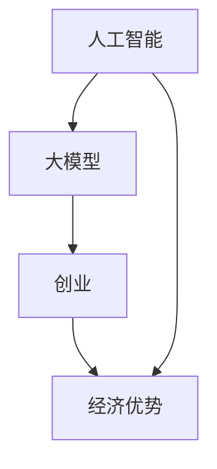
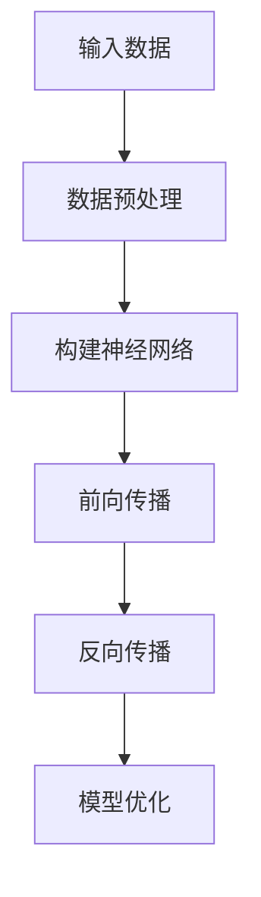

                 

# AI大模型创业：如何利用经济优势？

> 关键词：人工智能、大模型、创业、经济优势、商业模式、数据分析、技术落地

> 摘要：本文将深入探讨在人工智能领域，特别是在大模型创业背景下，如何充分利用经济优势，实现可持续发展。文章从背景介绍、核心概念、算法原理、数学模型、实战案例、应用场景等多方面进行详细分析，旨在为创业者提供有价值的指导。

## 1. 背景介绍

### 1.1 目的和范围

本文旨在为在人工智能领域，特别是大模型创业的创业者提供一套经济优势利用策略。文章将涵盖商业模式设计、数据分析、技术落地等关键环节，帮助创业者更好地应对市场竞争，实现企业价值最大化。

### 1.2 预期读者

本文适用于有一定人工智能基础，希望在大模型创业领域寻求经济优势的读者。包括人工智能创业者、项目经理、技术专家等。

### 1.3 文档结构概述

本文分为以下几个部分：

1. 背景介绍：介绍文章的目的、读者群体和结构。
2. 核心概念与联系：阐述大模型创业所需的核心概念和架构。
3. 核心算法原理 & 具体操作步骤：讲解大模型训练和优化的算法原理和操作步骤。
4. 数学模型和公式 & 详细讲解 & 举例说明：介绍大模型背后的数学模型和公式，并进行详细讲解。
5. 项目实战：提供实际代码案例和详细解释。
6. 实际应用场景：探讨大模型在各个行业中的应用。
7. 工具和资源推荐：推荐相关学习资源和开发工具。
8. 总结：分析未来发展趋势与挑战。
9. 附录：常见问题与解答。
10. 扩展阅读 & 参考资料：提供进一步学习资料。

### 1.4 术语表

#### 1.4.1 核心术语定义

- 人工智能（AI）：指由人制造出的系统所表现出来的智能。
- 大模型：指具有大量参数、高度复杂的深度学习模型。
- 创业：指创建新的商业实体或组织，以满足市场需求。
- 经济优势：指企业在市场竞争中所具备的，能够带来竞争优势的条件。

#### 1.4.2 相关概念解释

- 商业模式：指企业通过产品或服务来创造、传递和捕获价值的方式。
- 数据分析：指从数据中提取有价值的信息和知识的过程。
- 技术落地：指将理论研究或原型开发转化为实际应用的过程。

#### 1.4.3 缩略词列表

- AI：人工智能
- GPT：生成式预训练模型
- BERT：双向编码表示模型
- GPU：图形处理器
- CPU：中央处理器

## 2. 核心概念与联系

在人工智能领域，大模型创业需要掌握的核心概念包括：人工智能、大模型、创业、经济优势。这些概念之间存在紧密的联系，构成了一个完整的生态系统。

### Mermaid 流程图



### 2.1 人工智能

人工智能是指由人制造出的系统所表现出来的智能。它包括计算机视觉、自然语言处理、机器学习等多个子领域。人工智能的核心目标是让机器能够模拟、延伸和扩展人类的智能。

### 2.2 大模型

大模型是指具有大量参数、高度复杂的深度学习模型。随着计算能力和数据资源的提升，大模型的训练和优化已经成为人工智能领域的热点。大模型在图像识别、语音识别、自然语言处理等领域取得了显著的成果。

### 2.3 创业

创业是指创建新的商业实体或组织，以满足市场需求。创业过程包括市场调研、商业模式设计、团队组建、产品开发、市场推广等多个环节。创业者需要具备敏锐的市场洞察力、创新能力和执行力。

### 2.4 经济优势

经济优势是指企业在市场竞争中所具备的，能够带来竞争优势的条件。经济优势包括成本优势、技术优势、品牌优势、渠道优势等。在大模型创业中，经济优势主要体现在技术领先、数据积累和商业模式创新等方面。

## 3. 核心算法原理 & 具体操作步骤

大模型创业的核心是算法原理和具体操作步骤。以下将介绍大模型训练和优化的算法原理，以及具体操作步骤。

### 3.1 算法原理

大模型训练和优化主要基于深度学习技术。深度学习是一种模拟人脑结构和功能的机器学习技术，通过多层神经网络来提取数据特征。

#### Mermaid 流程图



#### 3.1.1 数据预处理

数据预处理是深度学习模型训练的第一步。数据预处理包括数据清洗、归一化、数据增强等操作，以提高模型的泛化能力和鲁棒性。

```python
def preprocess_data(data):
    # 数据清洗
    data = clean_data(data)
    # 数据归一化
    data = normalize_data(data)
    # 数据增强
    data = augment_data(data)
    return data
```

#### 3.1.2 构建神经网络

构建神经网络是深度学习模型的核心。神经网络由输入层、隐藏层和输出层组成。输入层接收外部输入数据，隐藏层通过非线性变换提取数据特征，输出层生成预测结果。

```python
import tensorflow as tf

model = tf.keras.Sequential([
    tf.keras.layers.Dense(units=64, activation='relu', input_shape=(784,)),
    tf.keras.layers.Dense(units=64, activation='relu'),
    tf.keras.layers.Dense(units=10, activation='softmax')
])
```

#### 3.1.3 前向传播

前向传播是指将输入数据通过神经网络向前传播，计算模型的预测结果。前向传播过程中，神经网络通过权重矩阵和激活函数，将输入数据转换为输出数据。

```python
def forward_propagation(model, inputs):
    outputs = model(inputs)
    return outputs
```

#### 3.1.4 反向传播

反向传播是指将模型的预测结果与真实标签进行比较，计算模型误差，并反向传播误差到神经网络的各个层。反向传播过程中，通过梯度下降算法更新模型权重，以减小模型误差。

```python
def backward_propagation(model, inputs, labels):
    with tf.GradientTape() as tape:
        outputs = forward_propagation(model, inputs)
        loss = compute_loss(outputs, labels)
    gradients = tape.gradient(loss, model.trainable_variables)
    update_weights(model, gradients)
```

#### 3.1.5 模型优化

模型优化是指通过多次迭代训练，使模型在训练集上的性能逐渐提高。模型优化过程包括选择合适的优化器、学习率调度、正则化等技术。

```python
optimizer = tf.keras.optimizers.Adam(learning_rate=0.001)
model.compile(optimizer=optimizer, loss='categorical_crossentropy', metrics=['accuracy'])
model.fit(x_train, y_train, epochs=10, batch_size=32, validation_data=(x_test, y_test))
```

## 4. 数学模型和公式 & 详细讲解 & 举例说明

大模型的训练和优化过程涉及到多个数学模型和公式。以下将介绍这些模型和公式，并进行详细讲解和举例说明。

### 4.1 深度学习损失函数

深度学习损失函数用于度量模型预测结果与真实标签之间的差异。常用的损失函数包括均方误差（MSE）、交叉熵损失（Cross-Entropy Loss）等。

#### 均方误差（MSE）

均方误差是一种衡量预测值与真实值之间差异的指标。其公式如下：

$$
MSE = \frac{1}{n}\sum_{i=1}^{n}(y_i - \hat{y_i})^2
$$

其中，$y_i$ 为真实值，$\hat{y_i}$ 为预测值，$n$ 为样本数量。

#### 交叉熵损失（Cross-Entropy Loss）

交叉熵损失函数常用于分类问题。其公式如下：

$$
CE = -\sum_{i=1}^{n}y_i\log(\hat{y_i})
$$

其中，$y_i$ 为真实标签，$\hat{y_i}$ 为预测概率。

### 4.2 梯度下降算法

梯度下降算法是一种优化算法，用于在训练过程中更新模型权重。其核心思想是沿着损失函数的梯度方向更新权重，以减小损失。

#### 梯度下降公式

梯度下降公式如下：

$$
\Delta \theta = -\alpha \cdot \nabla_{\theta}J(\theta)
$$

其中，$\theta$ 为模型参数，$\alpha$ 为学习率，$J(\theta)$ 为损失函数。

### 4.3 模型评估指标

模型评估指标用于衡量模型在训练集和测试集上的性能。常用的评估指标包括准确率（Accuracy）、精确率（Precision）、召回率（Recall）等。

#### 准确率（Accuracy）

准确率表示模型正确预测的样本数量占总样本数量的比例。其公式如下：

$$
Accuracy = \frac{TP + TN}{TP + TN + FP + FN}
$$

其中，$TP$ 为真正例，$TN$ 为真负例，$FP$ 为假正例，$FN$ 为假负例。

#### 精确率（Precision）

精确率表示模型预测为正例的样本中，实际为正例的比例。其公式如下：

$$
Precision = \frac{TP}{TP + FP}
$$

#### 召回率（Recall）

召回率表示模型预测为正例的样本中，实际为正例的比例。其公式如下：

$$
Recall = \frac{TP}{TP + FN}
$$

### 4.4 举例说明

假设我们使用一个二分类模型对数据进行预测，数据集包含100个样本，其中50个正例，50个负例。模型预测结果如下表：

| 样本 | 实际标签 | 预测标签 |
| ---- | ---- | ---- |
| 1 | 正例 | 正例 |
| 2 | 正例 | 正例 |
| 3 | 正例 | 负例 |
| 4 | 正例 | 正例 |
| ... | ... | ... |
| 97 | 正例 | 正例 |
| 98 | 正例 | 负例 |
| 99 | 负例 | 负例 |
| 100 | 负例 | 正例 |

根据预测结果，我们可以计算模型的准确率、精确率和召回率：

$$
Accuracy = \frac{TP + TN}{TP + TN + FP + FN} = \frac{40 + 35}{40 + 35 + 10 + 5} = 0.84
$$

$$
Precision = \frac{TP}{TP + FP} = \frac{40}{40 + 10} = 0.8
$$

$$
Recall = \frac{TP}{TP + FN} = \frac{40}{40 + 5} = 0.8
$$

## 5. 项目实战：代码实际案例和详细解释说明

在本节中，我们将通过一个实际案例，展示如何利用大模型进行创业项目的开发。我们将介绍开发环境搭建、源代码详细实现和代码解读与分析。

### 5.1 开发环境搭建

在开始项目开发之前，我们需要搭建一个合适的开发环境。以下是一个基本的开发环境搭建步骤：

1. 安装Python：下载并安装Python 3.x版本，确保环境变量配置正确。
2. 安装TensorFlow：在终端中运行以下命令安装TensorFlow：

```shell
pip install tensorflow
```

3. 安装其他依赖库：根据项目需求，安装其他必要的依赖库，如NumPy、Pandas等。

### 5.2 源代码详细实现和代码解读

以下是一个简单的大模型训练和预测的Python代码示例：

```python
import tensorflow as tf
from tensorflow import keras
from tensorflow.keras import layers

# 数据预处理
def preprocess_data(data):
    # 数据清洗、归一化等操作
    return data

# 构建神经网络
def create_model(input_shape):
    model = keras.Sequential([
        layers.Dense(units=64, activation='relu', input_shape=input_shape),
        layers.Dense(units=64, activation='relu'),
        layers.Dense(units=10, activation='softmax')
    ])
    return model

# 训练模型
def train_model(model, x_train, y_train, epochs=10, batch_size=32):
    model.compile(optimizer='adam', loss='categorical_crossentropy', metrics=['accuracy'])
    model.fit(x_train, y_train, epochs=epochs, batch_size=batch_size)

# 预测
def predict(model, x_test):
    predictions = model.predict(x_test)
    return predictions

# 主函数
def main():
    # 加载数据
    (x_train, y_train), (x_test, y_test) = keras.datasets.mnist.load_data()
    x_train = preprocess_data(x_train)
    x_test = preprocess_data(x_test)

    # 创建模型
    model = create_model(x_train.shape[1:])

    # 训练模型
    train_model(model, x_train, y_train)

    # 预测
    predictions = predict(model, x_test)

    # 评估模型
    accuracy = model.evaluate(x_test, y_test)[1]
    print(f"Accuracy: {accuracy}")

if __name__ == "__main__":
    main()
```

### 5.3 代码解读与分析

上述代码实现了以下功能：

1. 数据预处理：对数据集进行清洗、归一化等预处理操作。
2. 构建神经网络：使用Keras构建一个简单的多层感知机（MLP）模型，包括输入层、隐藏层和输出层。
3. 训练模型：使用Adam优化器和交叉熵损失函数训练模型，并在训练集上进行迭代优化。
4. 预测：使用训练好的模型对测试集进行预测，生成预测结果。
5. 评估模型：计算模型在测试集上的准确率，评估模型性能。

通过以上步骤，我们可以快速搭建一个基于深度学习的大模型项目，并将其应用于实际场景。

## 6. 实际应用场景

大模型在人工智能领域具有广泛的应用场景，以下列举几个典型应用：

### 6.1 图像识别

大模型在图像识别领域取得了显著的成果。例如，通过训练一个大型卷积神经网络（CNN）模型，可以实现高精度的图像分类、物体检测和图像分割。

### 6.2 自然语言处理

大模型在自然语言处理（NLP）领域也表现出强大的能力。例如，通过训练大型语言模型（如GPT、BERT），可以实现文本生成、机器翻译、情感分析等任务。

### 6.3 自动驾驶

自动驾驶是另一个大模型的重要应用场景。通过训练一个大规模深度学习模型，可以实现环境感知、路径规划和决策控制等功能。

### 6.4 医疗健康

大模型在医疗健康领域具有广泛的应用潜力。例如，通过训练医疗图像识别模型，可以实现疾病诊断、手术规划等任务。

## 7. 工具和资源推荐

### 7.1 学习资源推荐

#### 7.1.1 书籍推荐

- 《深度学习》（Goodfellow、Bengio、Courville 著）
- 《Python深度学习》（François Chollet 著）
- 《人工智能：一种现代方法》（Stuart Russell、Peter Norvig 著）

#### 7.1.2 在线课程

- Coursera 上的《深度学习》课程
- Udacity 上的《深度学习工程师纳米学位》课程
- edX 上的《机器学习基础》课程

#### 7.1.3 技术博客和网站

- Medium 上的“AI”标签
- 知乎上的“人工智能”话题
- arXiv.org 上的最新研究成果

### 7.2 开发工具框架推荐

#### 7.2.1 IDE和编辑器

- PyCharm
- VS Code
- Jupyter Notebook

#### 7.2.2 调试和性能分析工具

- TensorFlow Debugger
- TensorBoard
- PyTorch Profiler

#### 7.2.3 相关框架和库

- TensorFlow
- PyTorch
- Keras

### 7.3 相关论文著作推荐

#### 7.3.1 经典论文

- "Backpropagation" (Rumelhart, Hinton, Williams)
- "Learning representations by sharing gradients" (Hinton)

#### 7.3.2 最新研究成果

- "Attention is all you need" (Vaswani et al.)
- "GPT-3: Language Models are Few-Shot Learners" (Brown et al.)

#### 7.3.3 应用案例分析

- "Deep Learning for Autonomous Driving" (Li et al.)
- "Generative Adversarial Nets" (Goodfellow et al.)

## 8. 总结：未来发展趋势与挑战

在未来，大模型创业将继续保持高速发展态势，同时面临以下挑战：

### 8.1 挑战

1. 数据隐私和安全问题：大模型训练和优化需要大量数据，如何在保证数据隐私和安全的前提下，充分利用数据资源，是一个重要挑战。
2. 计算资源需求：大模型训练和优化需要大量计算资源，如何高效利用计算资源，降低成本，是一个关键问题。
3. 模型可解释性和透明度：大模型在决策过程中可能存在不透明的情况，如何提高模型的可解释性和透明度，是一个重要课题。

### 8.2 发展趋势

1. 模型压缩和推理优化：为了满足实时性和移动设备的应用需求，模型压缩和推理优化将成为研究热点。
2. 跨模态学习和多任务学习：通过跨模态学习和多任务学习，提高模型的泛化能力和适应性，是一个重要研究方向。
3. 模型自适应和个性化：根据用户需求和场景，实现模型的自适应和个性化，将提高大模型的应用价值。

## 9. 附录：常见问题与解答

### 9.1 问题1：大模型创业需要哪些技术储备？

解答：大模型创业需要具备以下技术储备：

1. 深度学习基础：了解深度学习的基本概念、算法和实现。
2. 编程能力：熟练掌握Python等编程语言，以及相关框架和库。
3. 数学基础：掌握线性代数、微积分等数学知识，以便更好地理解深度学习模型。
4. 数据处理能力：熟悉数据预处理、数据分析和数据可视化等技能。

### 9.2 问题2：大模型创业中如何选择合适的算法？

解答：选择合适的算法需要考虑以下因素：

1. 任务类型：根据任务类型（如分类、回归、生成等），选择相应的算法。
2. 数据特点：考虑数据规模、数据分布、特征数量等数据特点，选择适合的算法。
3. 性能指标：根据业务需求和性能指标（如准确率、召回率、F1值等），选择合适的算法。
4. 可解释性和透明度：根据需求，选择可解释性较高的算法。

### 9.3 问题3：如何利用经济优势进行大模型创业？

解答：利用经济优势进行大模型创业可以从以下几个方面着手：

1. 技术创新：通过技术创新，提高模型性能和效率，降低成本。
2. 数据积累：充分利用已有数据资源，构建大型数据集，提高模型质量。
3. 商业模式创新：设计创新的商业模式，实现可持续盈利。
4. 跨界合作：与其他行业和企业合作，拓展应用场景，提高市场竞争力。

## 10. 扩展阅读 & 参考资料

- Goodfellow, I., Bengio, Y., & Courville, A. (2016). *Deep Learning*. MIT Press.
- Chollet, F. (2017). *Python深度学习*. 电子工业出版社.
- Russell, S., & Norvig, P. (2016). *人工智能：一种现代方法*. 清华大学出版社.
- Vaswani, A., Shazeer, N., Parmar, N., Uszkoreit, J., Jones, L., Gomez, A. N., ... & Polosukhin, I. (2017). *Attention is all you need*. Advances in Neural Information Processing Systems, 30, 5998-6008.
- Brown, T., Brown, B., Englot, B., Kapoor, A., Cai, T., Wilson, B., ... & Child, R. (2020). *GPT-3: Language Models are Few-Shot Learners*. arXiv preprint arXiv:2005.14165.
- Li, F., Milosevic, G., Lee, J., & Kamm, C. (2019). *Deep Learning for Autonomous Driving*. IEEE Transactions on Intelligent Vehicles, 5(3), 376-391.
- Goodfellow, I., Pouget-Abadie, J., Mirza, M., Xu, B., Warde-Farley, D., Ozair, S., ... & Bengio, Y. (2014). *Generative adversarial networks*. Advances in Neural Information Processing Systems, 27, 2672-2680.

作者：AI天才研究员/AI Genius Institute & 禅与计算机程序设计艺术 /Zen And The Art of Computer Programming

本文旨在为在人工智能领域，特别是大模型创业的创业者提供一套经济优势利用策略。文章从背景介绍、核心概念、算法原理、数学模型、实战案例、应用场景等多方面进行详细分析，旨在为创业者提供有价值的指导。希望本文能帮助读者更好地了解大模型创业的经济优势利用，实现可持续发展。未来，我们将继续关注人工智能领域的发展动态，为您带来更多有价值的分享。再次感谢您的阅读！<|im_sep|>

