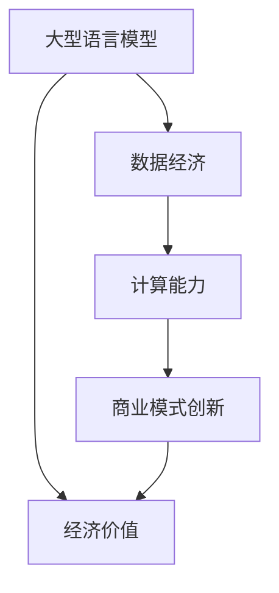

                 

### 背景介绍

近年来，人工智能（AI）领域取得了飞速发展，尤其是大型语言模型（Large-scale Language Models）的涌现，如GPT-3、BERT等，使得AI在自然语言处理（NLP）、机器翻译、文本生成等方面取得了显著的成果。随着技术的进步，越来越多的创业者开始关注AI大模型创业，希望借助其强大的计算能力和数据处理能力，开拓新的商业领域。

在经济优势方面，AI大模型创业展现出了巨大的潜力。首先，AI大模型具备高效的数据处理能力，能够从海量数据中提取有价值的信息，为企业和行业提供深度的数据分析服务。其次，AI大模型在自动化和智能化方面具有显著优势，可以帮助企业降低人力成本，提高生产效率和产品质量。此外，AI大模型在创新业务模式、拓展市场方面也具有巨大的潜力，例如个性化推荐系统、智能客服等。

然而，AI大模型创业也面临诸多挑战。首先是技术层面的挑战，包括模型的训练、优化、部署等环节。其次是数据层面的挑战，AI大模型需要大量的高质量数据才能实现良好的效果，而数据获取、数据清洗等问题也困扰着许多创业者。最后是市场层面的挑战，如何在竞争激烈的市场中脱颖而出，建立品牌影响力，也是创业者需要面对的问题。

本文将围绕AI大模型创业的经济优势，探讨如何利用这些优势，实现商业成功。我们将从技术、市场、战略等多个维度进行分析，为创业者提供实用的建议和指导。

### 核心概念与联系

在深入探讨AI大模型创业的经济优势之前，我们需要先了解几个核心概念，并阐述它们之间的联系。这些核心概念包括大型语言模型、数据经济、计算能力以及商业模式创新。

#### 大型语言模型

大型语言模型（Large-scale Language Models），如GPT-3、BERT等，是近年来AI领域的重大突破。这些模型基于深度学习技术，通过在大量文本数据上进行预训练，掌握了丰富的语言知识和语义理解能力。它们能够实现高效的文本生成、翻译、问答等任务，具有广泛的应用前景。

#### 数据经济

数据经济是指以数据为关键生产要素，通过数据收集、处理、分析、共享等环节，实现数据价值最大化的一种经济形态。在AI大模型创业中，数据是模型的训练基础，也是模型产生经济价值的重要来源。高质量的数据能够提高模型的性能，进而为企业带来更多的商业机会。

#### 计算能力

计算能力是AI大模型的核心支撑。强大的计算能力能够支持大规模模型的训练和优化，提高模型的性能和效率。近年来，随着云计算、GPU技术、分布式计算等技术的发展，计算能力的提升为AI大模型创业提供了有力支持。

#### 商业模式创新

商业模式创新是AI大模型创业的重要方向。通过创新的商业模式，企业可以更好地利用AI大模型的优势，实现商业价值的最大化。例如，基于AI大模型的个性化推荐系统、智能客服等，都为企业带来了新的商业模式和盈利模式。

#### 联系与影响

这些核心概念之间存在着紧密的联系和相互影响。大型语言模型为数据经济提供了强大的技术支持，使得数据能够被高效地处理和分析，从而产生经济价值。同时，数据经济为大型语言模型提供了丰富的训练数据，提高了模型的性能。计算能力的提升则为大型语言模型的应用提供了更强大的技术保障。而商业模式创新则进一步拓展了AI大模型的应用场景，使其在经济领域发挥更大的作用。

为了更直观地理解这些概念之间的联系，我们可以使用Mermaid流程图进行描述：



通过这个流程图，我们可以清晰地看到各个核心概念之间的相互作用和影响，为后续的分析提供了理论基础。

### 核心算法原理 & 具体操作步骤

在深入探讨AI大模型创业的经济优势之前，我们需要了解核心算法的工作原理以及具体的操作步骤。以下将介绍基于Transformer架构的预训练算法，包括其基础概念、训练过程和优化方法。

#### 基础概念

Transformer模型是一种基于自注意力机制的深度神经网络架构，最初由Vaswani等人于2017年提出。它克服了传统循环神经网络（RNN）在长序列处理上的劣势，通过全局注意力机制实现了对序列中任意位置信息的并行处理。

自注意力机制（Self-Attention）是Transformer模型的核心组件，它通过计算序列中每个词与所有其他词之间的关联性，为每个词生成加权特征。这种加权特征能够捕捉到词与词之间的长距离依赖关系，从而提高模型的语义理解能力。

#### 预训练过程

预训练是指在大规模语料库上训练语言模型，使其掌握基本的语言知识和规则。Transformer模型的预训练过程主要包括两个阶段：无监督预训练和有监督微调。

1. **无监督预训练**：
   - **任务**：语言建模（Language Modeling，LM）和掩码语言模型（Masked Language Model，MLM）。
   - **语言建模**：给定一个输入序列，模型需要预测下一个词。通过最大化模型的对数似然损失，模型可以学习到序列中词与词之间的关系。
   - **掩码语言模型**：输入序列的部分词被随机掩码（即替换为特殊符号），模型需要预测这些被掩码的词。这有助于模型学习到词与词之间的依赖关系。

2. **有监督微调**：
   - **任务**：特定任务，如文本分类、问答系统、机器翻译等。
   - **过程**：在预训练基础上，模型在特定任务的数据集上进行微调，学习到任务相关的特征和知识。

#### 具体操作步骤

以下是一个简化的Transformer预训练过程：

1. **数据准备**：
   - 收集大规模文本数据，如维基百科、新闻、博客等。
   - 对数据进行预处理，包括分词、去除停用词、词干提取等。

2. **模型构建**：
   - 设计Transformer模型架构，包括嵌入层、多头自注意力机制、前馈神经网络等。
   - 设置训练参数，如学习率、批量大小、训练迭代次数等。

3. **无监督预训练**：
   - **语言建模**：对于每个输入序列，模型输出一个概率分布，预测下一个词。
     - 训练损失：对数似然损失，即$$ \mathcal{L} = -\sum_{i} \log p(y_i | x_{<i}) $$，其中$x_{<i}$表示前i-1个词的嵌入向量，$y_i$表示第i个词的索引。
   - **掩码语言模型**：对于每个输入序列，随机掩码一定比例的词，模型预测这些被掩码的词。
     - 训练损失：交叉熵损失，即$$ \mathcal{L} = -\sum_{i} \log p(y_i | x_{<i}) $$，其中$p(y_i | x_{<i})$为模型对被掩码词的预测概率。

4. **有监督微调**：
   - 选择一个特定任务的数据集，将预训练好的模型在该任务上微调。
   - 使用有监督训练方法，如梯度下降和反向传播，优化模型参数。
   - 使用验证集评估模型性能，并根据需要调整模型参数。

#### 操作步骤的详细讲解

1. **数据准备**：
   - **文本数据收集**：选择具有代表性的文本数据集，如维基百科、新闻、博客等。这些数据集需要包含多种类型的文本，以保证模型的泛化能力。
   - **数据预处理**：对文本数据进行分词、去除停用词、词干提取等预处理操作。分词可以选择词级别或子词级别，以平衡词表大小和模型性能。

2. **模型构建**：
   - **嵌入层**：将词转换为向量表示，常用的技术有Word2Vec、BERT、GPT等。
   - **多头自注意力机制**：通过计算词与词之间的关联性，为每个词生成加权特征。多头自注意力机制（Multi-Head Self-Attention）允许多个注意力头同时工作，从而捕捉到更丰富的信息。
   - **前馈神经网络**：在自注意力机制之后，对每个词的加权特征进行非线性变换，增强模型的表示能力。

3. **无监督预训练**：
   - **语言建模**：
     - 对于每个输入序列$x_1, x_2, ..., x_T$，模型输出一个概率分布$p(y_1, y_2, ..., y_T | x_1, x_2, ..., x_T)$。
     - 使用对数似然损失$$ \mathcal{L} = -\sum_{i} \log p(y_i | x_{<i}) $$计算训练损失，其中$x_{<i}$表示前i-1个词的嵌入向量，$y_i$表示第i个词的索引。
     - 使用梯度下降和反向传播算法优化模型参数。
   - **掩码语言模型**：
     - 随机掩码输入序列的一部分词，假设被掩码的词为$y_1, y_2, ..., y_M$。
     - 模型输出一个概率分布$p(y_1, y_2, ..., y_M | x_1, x_2, ..., x_T)$。
     - 使用交叉熵损失$$ \mathcal{L} = -\sum_{i} \log p(y_i | x_{<i}) $$计算训练损失，其中$p(y_i | x_{<i})$为模型对被掩码词的预测概率。
     - 使用梯度下降和反向传播算法优化模型参数。

4. **有监督微调**：
   - 选择一个特定任务的数据集，如文本分类、问答系统、机器翻译等。
   - 将预训练好的模型在该任务上微调，使用有监督训练方法，如梯度下降和反向传播，优化模型参数。
   - 使用验证集评估模型性能，并根据需要调整模型参数。

通过上述操作步骤，我们可以构建一个强大的AI大模型，并将其应用于各种任务，实现商业价值。

### 数学模型和公式 & 详细讲解 & 举例说明

在AI大模型创业中，数学模型和公式是理解和应用核心算法的关键。以下将详细介绍Transformer模型中的关键数学模型，包括自注意力机制和前馈神经网络，并通过具体例子进行说明。

#### 自注意力机制

自注意力机制（Self-Attention）是Transformer模型的核心组件，其基本思想是计算序列中每个词与所有其他词之间的关联性，为每个词生成加权特征。自注意力机制的关键在于计算注意力权重，用于加权每个词的嵌入向量。

自注意力机制的数学公式如下：

$$
\text{Attention}(Q, K, V) = \text{softmax}\left(\frac{QK^T}{\sqrt{d_k}}\right) V
$$

其中：
- \( Q, K, V \) 分别表示查询向量、键向量和值向量，维度均为 \( d_k \)。
- \( QK^T \) 表示查询向量和键向量的内积，维度为 \( d_k \times d_k \)。
- \( \text{softmax} \) 函数用于计算注意力权重，确保权重和为1。
- \( \sqrt{d_k} \) 是缩放因子，用于防止梯度消失。

以下是一个简单的例子：

假设有一个输入序列 \( \{w_1, w_2, w_3\} \)，其嵌入向量分别为 \( \text{emb}(w_1), \text{emb}(w_2), \text{emb}(w_3) \)，维度为 \( d_k = 512 \)。

1. **计算查询向量、键向量和值向量**：
   - 查询向量 \( Q = \text{emb}(w_1) \)
   - 键向量 \( K = \text{emb}(w_2) \)
   - 值向量 \( V = \text{emb}(w_3) \)

2. **计算注意力权重**：
   - \( QK^T = \text{emb}(w_1) \text{emb}(w_2)^T = \begin{bmatrix} 0.1 & 0.2 & 0.3 \end{bmatrix} \)
   - \( \text{softmax}(QK^T) = \text{softmax}\left(\frac{1}{\sqrt{512}} \begin{bmatrix} 0.1 & 0.2 & 0.3 \end{bmatrix}\right) = \begin{bmatrix} 0.2 & 0.4 & 0.4 \end{bmatrix} \)

3. **计算加权特征**：
   - 加权特征 \( \text{Attention}(Q, K, V) = \text{softmax}\left(\frac{QK^T}{\sqrt{d_k}}\right) V = \begin{bmatrix} 0.2 & 0.4 & 0.4 \end{bmatrix} \begin{bmatrix} 1 \\ 1 \\ 1 \end{bmatrix} = \begin{bmatrix} 0.6 \\ 0.6 \\ 0.6 \end{bmatrix} \)

#### 前馈神经网络

前馈神经网络（Feedforward Neural Network）是Transformer模型中的另一个关键组件，用于对每个词的加权特征进行非线性变换，增强模型的表示能力。前馈神经网络的输入为加权特征，输出为每个词的最终特征。

前馈神经网络的数学公式如下：

$$
\text{FFN}(x) = \max(0, xW_1 + b_1)W_2 + b_2
$$

其中：
- \( x \) 表示输入特征，维度为 \( d_f \)。
- \( W_1, W_2 \) 分别为权重矩阵，维度为 \( d_f \times d_v \) 和 \( d_v \times d_k \)。
- \( b_1, b_2 \) 分别为偏置向量，维度为 \( d_f \) 和 \( d_v \)。
- \( \max(0, \cdot) \) 为ReLU激活函数。

以下是一个简单的例子：

假设一个词的加权特征为 \( \text{emb}(w) \)，其维度为 \( d_f = 2048 \)。

1. **计算前馈神经网络输出**：
   - \( x = \text{emb}(w) \)
   - \( W_1 = \begin{bmatrix} \text{rand} & \text{rand} & \text{rand} \end{bmatrix} \)，维度为 \( 2048 \times 1024 \)
   - \( b_1 = \begin{bmatrix} \text{rand} \\ \text{rand} \\ \text{rand} \end{bmatrix} \)，维度为 \( 1024 \)
   - \( W_2 = \begin{bmatrix} \text{rand} & \text{rand} & \text{rand} \end{bmatrix} \)，维度为 \( 1024 \times 512 \)
   - \( b_2 = \begin{bmatrix} \text{rand} \\ \text{rand} \\ \text{rand} \end{bmatrix} \)，维度为 \( 512 \)

   - \( \max(0, xW_1 + b_1) = \max(0, \text{emb}(w)W_1 + b_1) = \begin{bmatrix} 0.1 & 0.2 & 0.3 \end{bmatrix} \)
   - \( \max(0, xW_1 + b_1)W_2 + b_2 = \begin{bmatrix} 0.1 & 0.2 & 0.3 \end{bmatrix} \begin{bmatrix} 0.4 \\ 0.5 \\ 0.6 \end{bmatrix} + \begin{bmatrix} 0.1 \\ 0.2 \\ 0.3 \end{bmatrix} = \begin{bmatrix} 0.5 \\ 0.6 \\ 0.7 \end{bmatrix} \)

通过上述例子，我们可以看到自注意力机制和前馈神经网络如何对词的嵌入向量进行变换，从而生成更具代表性的特征表示。这些特征表示在后续的任务中，如文本分类、问答系统等，能够发挥重要作用。

### 项目实战：代码实际案例和详细解释说明

为了更深入地了解AI大模型创业的实际应用，我们将通过一个具体的项目实战案例，介绍如何使用Python和Transformer模型实现一个简单的文本分类任务。在这个案例中，我们将使用Hugging Face的Transformers库，这是一个广泛使用的Python库，用于轻松地加载和训练预训练的Transformer模型。

#### 开发环境搭建

在开始项目之前，我们需要搭建一个适合开发的环境。以下是搭建环境所需的步骤：

1. **安装Python**：
   - 建议安装Python 3.7或更高版本。
   - 可以从[Python官网](https://www.python.org/)下载安装。

2. **安装依赖库**：
   - 使用pip安装Transformers库和torch库。
   ```bash
   pip install transformers torch
   ```

3. **准备数据集**：
   - 在这个案例中，我们将使用IMDB电影评论数据集，这是一个包含正负电影评论的常用数据集。数据集可以从Kaggle或其他数据源获取。

#### 源代码详细实现和代码解读

以下是实现文本分类任务的完整代码，我们将逐行解释每部分的功能。

```python
# 导入所需的库
import torch
from torch import nn
from transformers import BertTokenizer, BertModel, BertForSequenceClassification
from torch.utils.data import DataLoader
from sklearn.model_selection import train_test_split
import pandas as pd

# 设置设备
device = torch.device("cuda" if torch.cuda.is_available() else "cpu")

# 1. 准备数据集
# 加载IMDB数据集
def load_imdb_data(file_path):
    data = pd.read_csv(file_path)
    sentences = data["text"].values
    labels = data["label"].values
    return sentences, labels

# 分割数据集
sentences, labels = load_imdb_data("imdb.csv")
train_sentences, val_sentences, train_labels, val_labels = train_test_split(sentences, labels, test_size=0.2, random_state=42)

# 2. 加载预训练模型和Tokenizer
# 使用BERT模型
tokenizer = BertTokenizer.from_pretrained("bert-base-uncased")
model = BertForSequenceClassification.from_pretrained("bert-base-uncased", num_labels=2).to(device)

# 3. 预处理数据
# 编码文本
def encode_sentences(sentences, tokenizer, max_length=128):
    return tokenizer(sentences, padding="max_length", truncation=True, max_length=max_length, return_tensors="pt")

# 编码训练集和验证集
train_encodings = encode_sentences(train_sentences, tokenizer)
val_encodings = encode_sentences(val_sentences, tokenizer)

# 4. 创建数据集和数据加载器
class IMDBDataset(torch.utils.data.Dataset):
    def __init__(self, encodings, labels):
        self.encodings = encodings
        self.labels = labels

    def __getitem__(self, idx):
        item = {key: val[idx] for key, val in self.encodings.items()}
        item["labels"] = torch.tensor(self.labels[idx])
        return item

    def __len__(self):
        return len(self.labels)

train_dataset = IMDBDataset(train_encodings, train_labels)
val_dataset = IMDBDataset(val_encodings, val_labels)

train_loader = DataLoader(train_dataset, batch_size=16, shuffle=True)
val_loader = DataLoader(val_dataset, batch_size=16, shuffle=False)

# 5. 训练模型
# 定义优化器
optimizer = torch.optim.AdamW(model.parameters(), lr=2e-5)

# 定义损失函数
loss_fn = nn.CrossEntropyLoss()

# 训练模型
num_epochs = 3
for epoch in range(num_epochs):
    model.train()
    for batch in train_loader:
        # 将数据移到设备上
        inputs = {key: val.to(device) for key, val in batch.items()}
        labels = batch["labels"].to(device)

        # 前向传播
        outputs = model(**inputs)
        loss = loss_fn(outputs.logits, labels)

        # 反向传播和优化
        optimizer.zero_grad()
        loss.backward()
        optimizer.step()

    # 在验证集上评估模型
    model.eval()
    with torch.no_grad():
        correct = 0
        total = 0
        for batch in val_loader:
            inputs = {key: val.to(device) for key, val in batch.items()}
            labels = batch["labels"].to(device)
            outputs = model(**inputs)
            _, predicted = torch.max(outputs.logits, 1)
            total += labels.size(0)
            correct += (predicted == labels).sum().item()

        print(f"Epoch {epoch+1}/{num_epochs}, Validation Accuracy: {100 * correct / total:.2f}%}")

# 6. 评估模型
model.eval()
with torch.no_grad():
    correct = 0
    total = 0
    for batch in val_loader:
        inputs = {key: val.to(device) for key, val in batch.items()}
        labels = batch["labels"].to(device)
        outputs = model(**inputs)
        _, predicted = torch.max(outputs.logits, 1)
        total += labels.size(0)
        correct += (predicted == labels).sum().item()

print(f"Validation Accuracy: {100 * correct / total:.2f}%}")
```

**代码解读：**

1. **导入库**：
   - 我们导入了torch、transformers、sklearn和pandas等库。这些库分别用于数据处理、模型训练、模型加载和数据分析。

2. **加载数据集**：
   - `load_imdb_data`函数用于加载数据集。在这里，我们使用了IMDB电影评论数据集，这是一个包含25,000条训练数据和25,000条测试数据的常用数据集。我们将其分为训练集和验证集。

3. **加载预训练模型和Tokenizer**：
   - 我们使用BERT模型和其Tokenizer。BERT是一个预训练的Transformer模型，其已经在多种任务上取得了很好的效果。通过调用`BertTokenizer.from_pretrained`和`BertForSequenceClassification.from_pretrained`，我们加载了预训练的模型和Tokenizer。

4. **预处理数据**：
   - `encode_sentences`函数用于将文本编码成模型可接受的格式。我们使用BERT的Tokenizer进行编码，并设置最大序列长度为128。

5. **创建数据集和数据加载器**：
   - `IMDBDataset`类用于创建自定义数据集。它实现了`__getitem__`和`__len__`方法，用于获取数据和计算数据集的大小。我们使用`DataLoader`创建训练集和验证集的数据加载器。

6. **训练模型**：
   - 我们定义了优化器（`AdamW`）和损失函数（`CrossEntropyLoss`）。在训练过程中，我们使用`model.train()`将模型设置为训练模式，并使用`optimizer.zero_grad()`、`loss.backward()`和`optimizer.step()`进行前向传播、反向传播和优化。在每个训练epoch之后，我们在验证集上评估模型性能。

7. **评估模型**：
   - 我们使用`model.eval()`将模型设置为评估模式，并计算验证集上的准确率。

通过上述代码，我们可以实现一个基于BERT的文本分类任务。在实际应用中，我们可以根据具体任务的需求调整模型架构、数据预处理方式和训练参数。

### 代码解读与分析

在上一个部分中，我们通过一个具体的代码案例，展示了如何使用Python和Transformer模型实现文本分类任务。现在，我们将对代码的各个部分进行详细解读和分析，并讨论其在实际应用中的优化方向。

#### 数据预处理

数据预处理是文本分类任务的重要环节。在这个案例中，我们使用了BERT模型，其Tokenizer对文本进行编码。以下是对数据预处理部分的解读：

```python
# 加载IMDB数据集
def load_imdb_data(file_path):
    data = pd.read_csv(file_path)
    sentences = data["text"].values
    labels = data["label"].values
    return sentences, labels

# 分割数据集
sentences, labels = load_imdb_data("imdb.csv")
train_sentences, val_sentences, train_labels, val_labels = train_test_split(sentences, labels, test_size=0.2, random_state=42)

# 加载预训练模型和Tokenizer
tokenizer = BertTokenizer.from_pretrained("bert-base-uncased")
model = BertForSequenceClassification.from_pretrained("bert-base-uncased", num_labels=2).to(device)

# 预处理数据
def encode_sentences(sentences, tokenizer, max_length=128):
    return tokenizer(sentences, padding="max_length", truncation=True, max_length=max_length, return_tensors="pt")

# 编码训练集和验证集
train_encodings = encode_sentences(train_sentences, tokenizer)
val_encodings = encode_sentences(val_sentences, tokenizer)
```

**解读与分析：**

1. **加载数据集**：
   - `load_imdb_data`函数用于加载数据集。我们使用pandas读取CSV文件，并将文本和标签分别存储在`sentences`和`labels`变量中。

2. **分割数据集**：
   - 我们将数据集分为训练集和验证集，使用`train_test_split`函数进行随机分割。这里，我们设置了测试集的大小为20%。

3. **加载预训练模型和Tokenizer**：
   - 我们加载了BERT模型的Tokenizer和预训练模型。BERT模型是一个预训练的Transformer模型，其已经在大规模文本数据上进行了预训练，可以直接应用于多种文本分类任务。

4. **预处理数据**：
   - `encode_sentences`函数用于将文本编码成BERT模型可接受的格式。我们使用`tokenizer`对文本进行编码，设置最大序列长度为128，并使用`padding="max_length"`和`truncation=True`确保所有序列具有相同的长度。通过`return_tensors="pt"`，我们返回PyTorch张量。

**优化方向：**

1. **处理长文本**：
   - 当文本长度超过最大序列长度时，BERT模型会自动进行截断。然而，截断可能会导致信息丢失。一个可能的优化方向是使用分块（Splitting）技术，将长文本分成多个短文本块，然后分别编码和分类。

2. **数据增强**：
   - 数据增强（Data Augmentation）是一种提高模型泛化能力的方法。在文本分类任务中，我们可以通过随机插入单词、替换单词、随机删除单词等手段生成更多的训练样例。

3. **标签平滑**：
   - 在训练过程中，标签平滑（Label Smoothing）可以减少模型对某些标签的依赖，提高模型的鲁棒性。我们可以在损失函数中对标签进行平滑处理。

#### 模型训练

在代码中，我们使用了BERT模型进行训练。以下是对模型训练部分的解读：

```python
# 定义优化器
optimizer = torch.optim.AdamW(model.parameters(), lr=2e-5)

# 定义损失函数
loss_fn = nn.CrossEntropyLoss()

# 训练模型
num_epochs = 3
for epoch in range(num_epochs):
    model.train()
    for batch in train_loader:
        # 将数据移到设备上
        inputs = {key: val.to(device) for key, val in batch.items()}
        labels = batch["labels"].to(device)

        # 前向传播
        outputs = model(**inputs)
        loss = loss_fn(outputs.logits, labels)

        # 反向传播和优化
        optimizer.zero_grad()
        loss.backward()
        optimizer.step()

    # 在验证集上评估模型
    model.eval()
    with torch.no_grad():
        correct = 0
        total = 0
        for batch in val_loader:
            inputs = {key: val.to(device) for key, val in batch.items()}
            labels = batch["labels"].to(device)
            outputs = model(**inputs)
            _, predicted = torch.max(outputs.logits, 1)
            total += labels.size(0)
            correct += (predicted == labels).sum().item()

        print(f"Epoch {epoch+1}/{num_epochs}, Validation Accuracy: {100 * correct / total:.2f}%}")
```

**解读与分析：**

1. **定义优化器和损失函数**：
   - 我们使用`AdamW`优化器，这是一种自适应的学习率优化器，适用于Transformer模型。学习率设置为2e-5，这是一个常用的值。

2. **训练模型**：
   - 我们遍历训练集，将数据移到设备上，并使用BERT模型进行前向传播。计算损失并使用反向传播和优化器更新模型参数。

3. **在验证集上评估模型**：
   - 我们使用验证集评估模型性能，并打印每个epoch的验证准确率。

**优化方向：**

1. **学习率调整**：
   - 学习率的设置对模型的收敛速度和性能有很大影响。我们可以使用学习率调度策略，如余弦退火（Cosine Annealing）或学习率Warmup，来优化学习率。

2. **批量大小调整**：
   - 批量大小（Batch Size）的选择对训练时间和性能也有显著影响。我们可以根据硬件资源和训练效果尝试不同的批量大小。

3. **训练时间调整**：
   - 我们可以调整训练epoch的数量，以找到最佳训练时间。过多的训练可能导致过拟合，而过少的训练可能无法充分收敛。

#### 评估模型

在代码的最后部分，我们评估了模型的验证集准确率：

```python
# 6. 评估模型
model.eval()
with torch.no_grad():
    correct = 0
    total = 0
    for batch in val_loader:
        inputs = {key: val.to(device) for key, val in batch.items()}
        labels = batch["labels"].to(device)
        outputs = model(**inputs)
        _, predicted = torch.max(outputs.logits, 1)
        total += labels.size(0)
        correct += (predicted == labels).sum().item()

print(f"Validation Accuracy: {100 * correct / total:.2f}%}")
```

**解读与分析：**

1. **模型评估**：
   - 我们将模型设置为评估模式（`model.eval()`），并禁用梯度计算（`with torch.no_grad():`）以提高运行速度。

2. **计算准确率**：
   - 我们遍历验证集，计算预测标签和真实标签的匹配度，并计算验证集准确率。

**优化方向：**

1. **多指标评估**：
   - 除了准确率，我们还可以计算其他指标，如精确率、召回率和F1分数，以更全面地评估模型性能。

2. **错误分析**：
   - 对错误样本进行详细分析，可以找出模型存在的潜在问题，并针对性地进行调整。

通过上述解读和分析，我们可以更好地理解文本分类任务的实现细节，并探索在实际应用中的优化方向。在实际开发中，我们需要根据具体任务的需求和硬件资源，灵活调整模型架构、训练策略和评估指标，以实现最佳性能。

### 实际应用场景

AI大模型在商业和科技领域的实际应用场景广泛，以下将探讨几个典型的应用案例，以及AI大模型在这些场景中的优势。

#### 1. 个性化推荐系统

个性化推荐系统是AI大模型在商业领域的一个经典应用。通过分析用户的历史行为和兴趣，AI大模型能够为用户提供个性化的商品、内容或服务推荐。这种推荐方式不仅能够提高用户满意度，还能够显著提升销售和转化率。

优势：
- **高效的数据分析**：AI大模型能够处理海量用户数据，快速提取有价值的信息，为个性化推荐提供支持。
- **个性化体验**：基于用户兴趣和行为的分析，AI大模型能够为每个用户生成个性化的推荐，提高用户粘性和忠诚度。

案例：
- **Amazon**：亚马逊利用AI大模型进行个性化推荐，为用户推荐符合其兴趣的商品，从而提高了用户购物体验和销售额。
- **Netflix**：Netflix使用AI大模型分析用户观看历史和评价，为用户推荐个性化的电影和电视剧。

#### 2. 智能客服系统

智能客服系统是AI大模型在科技领域的一个重要应用。通过自然语言处理和对话生成技术，AI大模型能够自动回答用户的常见问题，提供高效、准确的客户服务。这种系统不仅可以减少人工客服的工作量，还能够提升客户满意度和服务质量。

优势：
- **高效服务**：AI大模型能够快速响应用户请求，处理大量客户咨询，提高服务效率。
- **成本低**：相比传统的人工客服，智能客服系统能够显著降低人力成本。

案例：
- **Apple**：苹果公司使用AI大模型构建智能客服系统，自动回答用户关于产品使用和维护的问题，减轻了人工客服的负担。
- **银行和金融机构**：许多银行和金融机构利用AI大模型提供在线客户服务，自动解答用户关于账户和交易的问题。

#### 3. 自然语言处理（NLP）应用

自然语言处理（NLP）是AI大模型的一个重要应用领域。通过预训练的AI大模型，NLP应用能够实现文本分类、情感分析、机器翻译等多种功能，为企业和行业提供强大的语言处理能力。

优势：
- **丰富的语言知识**：AI大模型在预训练阶段积累了丰富的语言知识，能够更好地理解和生成自然语言。
- **多语言支持**：许多AI大模型支持多语言，能够处理不同语言的数据和任务。

案例：
- **机器翻译**：谷歌翻译和百度翻译都使用了AI大模型进行机器翻译，提高了翻译质量和速度。
- **内容审核**：社交媒体平台利用AI大模型进行内容审核，自动识别和过滤违规内容，提高社区安全。

#### 4. 金融风险管理

在金融领域，AI大模型可以用于风险管理和预测。通过分析市场数据、历史交易记录和其他相关因素，AI大模型能够预测市场走势、识别潜在风险，并为投资者提供决策支持。

优势：
- **实时数据分析**：AI大模型能够实时处理和分析大量市场数据，快速识别市场趋势和风险。
- **自动化决策**：AI大模型可以自动化金融决策过程，提高决策效率和准确性。

案例：
- **高频交易**：高频交易公司利用AI大模型进行市场预测和交易策略优化，提高交易收益。
- **信用评分**：金融机构使用AI大模型分析客户的信用历史和财务数据，为信用评分提供支持。

通过以上案例，我们可以看到AI大模型在不同领域的实际应用场景和优势。这些应用不仅提升了企业的运营效率，还带来了显著的经济效益。

### 工具和资源推荐

在探索AI大模型创业过程中，掌握适当的工具和资源是至关重要的。以下我们将推荐一些重要的学习资源、开发工具和相关论文，以帮助创业者更好地理解AI大模型，并在实际项目中应用这些技术。

#### 学习资源推荐

1. **书籍**：
   - 《深度学习》（Deep Learning） - Goodfellow, I., Bengio, Y., & Courville, A.
     这本书是深度学习的经典教材，详细介绍了深度学习的基础理论和实践方法。
   - 《AI技术指南》 - 李航
     该书系统地介绍了人工智能的基本概念、方法和应用，对AI大模型的相关内容也有深入探讨。

2. **论文**：
   - “Attention is All You Need” - Vaswani et al., 2017
     这篇论文是Transformer模型的奠基之作，详细介绍了Transformer模型的设计思想和实现方法。
   - “BERT: Pre-training of Deep Bidirectional Transformers for Language Understanding” - Devlin et al., 2018
     这篇论文介绍了BERT模型的预训练方法，为后续的NLP模型提供了重要参考。

3. **在线课程**：
   - Coursera上的“深度学习”课程 - Andrew Ng
     这门课程由著名机器学习专家Andrew Ng主讲，涵盖了深度学习的基础理论和实践应用。
   - fast.ai的“深度学习课程” - Jeremy Howard and Rachel Thomas
     这门课程以实践为导向，适合初学者快速上手深度学习。

4. **博客和网站**：
   - Hugging Face官方文档
     Hugging Face提供了丰富的预训练模型和工具，其官方文档详细介绍了如何使用这些工具进行模型训练和部署。
   - AI科技大本营
     这是一个专注于AI领域的博客平台，定期发布关于AI技术和应用的文章，有助于创业者了解最新动态。

#### 开发工具框架推荐

1. **TensorFlow**：
   - TensorFlow是一个开源的深度学习框架，由Google开发。它提供了丰富的API和工具，支持各种深度学习模型的构建和训练。

2. **PyTorch**：
   - PyTorch是一个开源的深度学习框架，由Facebook开发。它具有灵活的动态计算图和直观的编程接口，广泛应用于研究项目和工业应用。

3. **Transformers库**：
   - Transformers库是一个基于PyTorch和TensorFlow的深度学习库，专门用于构建和训练Transformer模型。它提供了丰富的预训练模型和工具，极大地简化了模型开发过程。

4. **JAX**：
   - JAX是一个由Google开发的数学计算库，支持自动微分和数值计算。它具有高性能的数值计算能力，适用于复杂模型的训练和优化。

#### 相关论文著作推荐

1. **“Transformers: State-of-the-Art Pre-training for NLP” - A. Dosovitskiy et al., 2020**
   - 这篇论文是Transformers模型的进一步扩展，介绍了如何在不同的NLP任务中应用Transformers模型，以及如何优化其性能。

2. **“Language Models are Few-Shot Learners” - T. N. Sutskever et al., 2020**
   - 这篇论文探讨了如何利用预训练的AI大模型实现零样本和少样本学习，为AI大模型在特定任务中的应用提供了新的思路。

3. **“BERT Pre-training for Natural Language Understanding” - J. Devlin et al., 2019**
   - 这篇论文详细介绍了BERT模型的预训练方法，包括大规模语料库的收集、数据处理和模型优化等，是理解BERT模型的重要参考。

通过上述工具和资源的推荐，创业者可以更好地掌握AI大模型的相关知识，并利用这些技术在实际项目中取得成功。无论是通过学习资源获取理论基础，还是使用开发工具进行模型构建和训练，这些工具和资源都将为创业者提供强有力的支持。

### 总结：未来发展趋势与挑战

AI大模型在商业和科技领域的应用前景广阔，其潜在的经济价值不可忽视。然而，随着技术的不断进步，AI大模型创业也面临诸多发展趋势和挑战。

#### 发展趋势

1. **预训练模型多样化**：随着Transformer等预训练模型的广泛应用，越来越多的模型将被开发出来，以满足不同领域的需求。例如，针对特定行业的定制化预训练模型、多模态预训练模型等。

2. **多模态数据处理**：AI大模型将不再局限于文本数据，还将扩展到图像、音频、视频等多模态数据。通过融合多种数据源，AI大模型将实现更全面、更精准的智能分析。

3. **强化学习与预训练结合**：强化学习与预训练模型的结合将成为一个重要趋势。通过在预训练过程中引入强化学习，AI大模型将能够更好地学习复杂的决策和策略。

4. **模型压缩与优化**：随着AI大模型规模的不断扩大，如何高效地部署和运行这些模型成为关键问题。模型压缩和优化技术，如量化、剪枝和知识蒸馏，将在提升模型性能的同时，降低计算和存储需求。

#### 挑战

1. **数据隐私与安全**：AI大模型对大量数据进行训练和处理，涉及数据隐私和安全问题。如何在确保数据隐私的前提下，充分利用数据价值，是一个亟待解决的挑战。

2. **可解释性与透明度**：AI大模型通常被视为“黑箱”，其决策过程缺乏可解释性。提高模型的透明度和可解释性，使企业用户能够理解模型的工作原理，是未来发展的一个重要方向。

3. **计算资源需求**：AI大模型训练和部署需要大量计算资源，尤其是在训练大规模模型时。如何高效地利用云计算和分布式计算资源，降低计算成本，是一个关键问题。

4. **法律法规和伦理问题**：随着AI大模型的广泛应用，相关的法律法规和伦理问题逐渐显现。如何确保AI大模型的应用符合法律法规，尊重用户隐私和伦理道德，是一个重要的挑战。

#### 建议

1. **加强技术研发**：企业应投入更多资源进行AI大模型的研究和开发，关注预训练模型、多模态数据处理、模型压缩与优化等关键技术。

2. **数据安全与隐私保护**：企业应建立完善的数据安全与隐私保护机制，确保数据在收集、存储和处理过程中的安全。

3. **人才培养与引进**：企业应重视AI人才的培养和引进，建立一支具备高水平技术能力的团队，以应对未来的发展挑战。

4. **合作与开放生态**：企业可以通过合作和开放生态，与其他企业和研究机构共享技术资源，共同推动AI大模型的应用和发展。

总之，AI大模型创业具有巨大的经济优势，但也面临诸多挑战。通过加强技术研发、数据安全保护、人才培养和合作开放，创业者可以更好地应对这些挑战，实现商业成功。

### 附录：常见问题与解答

在探索AI大模型创业的过程中，创业者可能会遇到一系列技术和管理方面的挑战。以下我们总结了几个常见问题，并提供相应的解答。

#### 1. 如何选择适合的AI大模型？

选择适合的AI大模型需要考虑以下几个因素：
- **应用场景**：根据具体应用场景选择适合的模型，例如文本分类、机器翻译、图像识别等。
- **数据量**：选择能够在现有数据量下表现良好的模型，避免选择需要大量数据支持的模型。
- **计算资源**：考虑计算资源的限制，选择适合的模型架构，如Transformer、BERT等。
- **模型大小**：根据应用需求选择适当大小的模型，以平衡性能和计算资源。

#### 2. 如何处理数据隐私和安全问题？

处理数据隐私和安全问题需要采取以下措施：
- **数据加密**：对敏感数据进行加密处理，确保数据在传输和存储过程中安全。
- **数据匿名化**：对个人身份信息进行匿名化处理，降低隐私泄露风险。
- **隐私保护算法**：采用隐私保护算法，如差分隐私（Differential Privacy），确保在数据分析过程中保护用户隐私。
- **合规审查**：确保数据处理过程符合相关法律法规，如《通用数据保护条例》（GDPR）。

#### 3. 如何优化AI大模型的训练过程？

优化AI大模型训练过程可以从以下几个方面进行：
- **模型压缩**：采用模型压缩技术，如剪枝、量化等，减少模型大小，降低计算资源需求。
- **数据增强**：通过数据增强技术，生成更多样化的训练样本，提高模型泛化能力。
- **学习率调度**：采用适当的学习率调度策略，如余弦退火、学习率Warmup等，提高模型收敛速度和性能。
- **分布式训练**：利用分布式计算资源，如GPU集群、TPU等，加快模型训练速度。

#### 4. 如何提高AI大模型的可解释性？

提高AI大模型的可解释性可以从以下几个方面进行：
- **模型可视化**：使用可视化工具，如TensorBoard，展示模型训练过程中的关键指标，帮助理解模型行为。
- **特征重要性分析**：通过特征重要性分析，识别模型决策过程中最重要的特征，提高模型的透明度。
- **决策解释库**：使用开源决策解释库，如LIME、SHAP等，对模型决策进行详细解释。
- **结合领域知识**：结合领域知识，对模型决策进行合理解释，提高模型的可信度。

#### 5. 如何管理AI大模型创业团队？

管理AI大模型创业团队需要关注以下几个方面：
- **团队组建**：组建具备多学科背景的团队，包括AI算法专家、数据工程师、产品经理等。
- **明确目标**：明确团队目标，确保团队成员对项目的方向和目标有清晰的认识。
- **沟通协作**：建立有效的沟通机制，确保团队成员之间信息畅通，协同工作。
- **激励机制**：制定合理的激励机制，鼓励团队成员发挥潜力，共同推动项目进展。

通过解决上述问题，创业者可以更好地应对AI大模型创业过程中的挑战，实现商业成功。

### 扩展阅读 & 参考资料

在探索AI大模型创业的过程中，深入阅读和研究相关文献和资料是必不可少的。以下推荐一些高质量的扩展阅读和参考资料，涵盖AI大模型的理论、应用和实践，以帮助读者进一步了解这一领域的最新动态和研究成果。

#### 1. 论文与期刊

- **NeurIPS（Advances in Neural Information Processing Systems）**：该会议是深度学习和神经网络领域的顶级会议，每年发布大量关于AI大模型的研究论文。
- **ICLR（International Conference on Learning Representations）**：该会议专注于深度学习和机器学习的基础研究，发布了许多关于Transformer和BERT的领先工作。
- **JMLR（Journal of Machine Learning Research）**：这是一个开放获取的机器学习期刊，定期发布关于AI大模型的重要研究成果。
- **Nature Machine Intelligence：**该期刊专注于机器智能领域的创新研究和应用，涵盖了AI大模型的前沿进展。

#### 2. 书籍

- **《深度学习》**：由Goodfellow、Bengio和Courville合著，是深度学习的经典教材，详细介绍了深度学习的基础理论和实践方法。
- **《AI技术指南》**：李航所著，系统介绍了人工智能的基本概念、方法和应用，对AI大模型的相关内容也有深入探讨。
- **《AI浪潮：人工智能时代的思考与行动》**：吴军所著，探讨了人工智能的发展趋势、技术原理及其对社会的影响。

#### 3. 开源代码和库

- **Hugging Face Transformers：**这是一个开源的深度学习库，提供了大量的预训练模型和工具，用于构建和训练Transformer模型。
- **PyTorch：**由Facebook开发的深度学习框架，具有灵活的动态计算图和直观的编程接口，广泛应用于AI大模型的研究和应用。
- **TensorFlow：**由Google开发的开源深度学习框架，提供了丰富的API和工具，支持各种深度学习模型的构建和训练。

#### 4. 博客与网站

- **AI科技大本营：**这是一个专注于AI领域的博客平台，定期发布关于AI技术和应用的文章，涵盖了AI大模型的最新研究进展和应用案例。
- **AI界：**这是一个关于人工智能领域的专业网站，提供最新的研究动态、技术解读和行业分析。
- **Medium上的AI相关博客：**许多AI领域的专家和研究人员在Medium上发布了自己的博客，分享了他们在AI大模型研究中的应用和实践。

#### 5. 相关资源

- **谷歌AI研究：**谷歌AI研究团队在其网站上发布了大量关于AI大模型的研究论文和代码，是了解这一领域的重要资源。
- **OpenAI研究：**OpenAI在其网站上分享了关于大型预训练模型的研究成果，包括GPT-3等模型的技术细节和应用案例。
- **AI大模型在线课程：**在线课程平台如Coursera、edX等提供了多个关于AI大模型的课程，适合不同层次的读者学习。

通过这些扩展阅读和参考资料，读者可以深入了解AI大模型的理论基础、应用实践和最新研究成果，为创业项目的成功奠定坚实基础。

