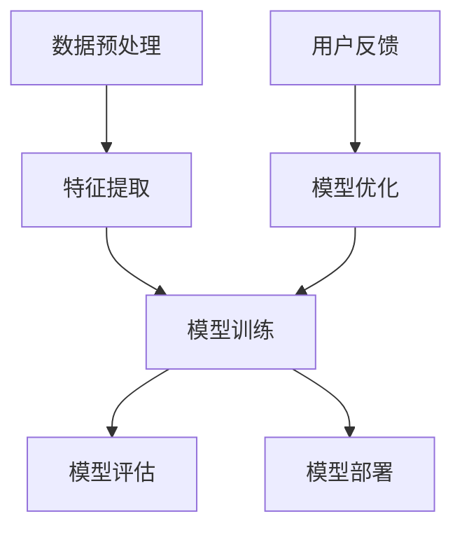

                 

# AI大模型创业：如何利用资本优势？

## 关键词：
AI大模型、创业、资本、优势、策略、技术、市场、风险、投资

## 摘要：
本文旨在探讨AI大模型创业过程中如何有效利用资本优势，实现快速发展和市场竞争。通过对AI大模型的基本概念、技术原理和商业模式的深入分析，结合实际案例，本文将阐述创业者在选择合适的资本策略、构建创新技术架构、开拓市场以及应对潜在风险等方面的重要策略和步骤。

## 1. 背景介绍

### 1.1 目的和范围
本文旨在为AI大模型创业者提供一条清晰的路径，帮助他们在激烈的市场竞争中利用资本优势，实现企业的快速成长和市场拓展。文章将涵盖以下关键主题：

- AI大模型的定义和基本概念
- AI大模型创业的现状和挑战
- 资本在AI大模型创业中的作用和策略
- 创新技术架构的设计和实施
- 市场开拓和竞争策略
- 风险管理策略

### 1.2 预期读者
本文适合以下读者群体：

- 想要在AI领域创业的个人和团队
- AI领域的研发人员和技术专家
- 投资者和资本运营专业人士
- 对AI大模型创业感兴趣的学生和研究人员

### 1.3 文档结构概述
本文分为以下主要章节：

- 引言：背景介绍和核心概念概述
- 核心概念与联系：AI大模型的技术原理和架构
- 核心算法原理 & 具体操作步骤：算法分析和伪代码实现
- 数学模型和公式 & 详细讲解 & 举例说明：数学模型的应用和实例分析
- 项目实战：代码实际案例和详细解释
- 实际应用场景：行业应用分析和市场前景
- 工具和资源推荐：学习资源、开发工具和论文推荐
- 总结：未来发展趋势与挑战
- 附录：常见问题与解答
- 扩展阅读 & 参考资料：相关文献和研究

### 1.4 术语表

#### 1.4.1 核心术语定义

- AI大模型：基于深度学习技术，具有大规模参数量和强大计算能力的机器学习模型。
- 资本优势：企业在融资过程中获得的优势，包括资金支持、投资关系和资源获取。
- 技术架构：软件系统的整体设计和构建方式，包括硬件配置、软件框架和模块划分。

#### 1.4.2 相关概念解释

- 深度学习：一种人工智能方法，通过多层神经网络模拟人脑学习过程。
- 人工智能：模拟人类智能行为的技术和系统，包括感知、思考、决策和行动。
- 融资：企业通过发行股票、债券或寻求风险投资等方式获取资金。

#### 1.4.3 缩略词列表

- AI：人工智能
- ML：机器学习
- DL：深度学习
- DNN：深度神经网络
- GPU：图形处理器单元
- CV：计算机视觉
- NLP：自然语言处理
- API：应用程序接口

## 2. 核心概念与联系

在探讨AI大模型创业如何利用资本优势之前，我们需要先了解AI大模型的基本概念和技术原理。以下是一个简化的Mermaid流程图，用于描述AI大模型的核心概念和架构。



### 2.1 数据预处理

数据预处理是AI大模型训练的基础。它包括数据清洗、数据标准化、数据增强等步骤。有效的数据预处理可以提高模型的性能和鲁棒性。

### 2.2 特征提取

特征提取是将原始数据转换为模型可理解的形式。通过特征提取，模型可以捕捉到数据中的关键信息，从而进行有效的学习。

### 2.3 模型训练

模型训练是AI大模型的核心步骤。通过大量数据训练，模型可以学习到数据的内在规律，从而进行预测和决策。

### 2.4 模型评估

模型评估是验证模型性能的重要手段。常用的评估指标包括准确率、召回率、F1值等。

### 2.5 模型部署

模型部署是将训练好的模型应用到实际场景中。部署过程包括模型集成、测试和上线等步骤。

### 2.6 用户反馈与模型优化

用户反馈是模型优化的关键。通过收集用户反馈，可以对模型进行持续优化，提高其性能和用户体验。

## 3. 核心算法原理 & 具体操作步骤

在本章节，我们将详细讲解AI大模型的核心算法原理，并使用伪代码进行具体操作步骤的阐述。

### 3.1 数据预处理

```python
def preprocess_data(data):
    # 数据清洗
    cleaned_data = clean_data(data)
    # 数据标准化
    standardized_data = standardize_data(cleaned_data)
    # 数据增强
    augmented_data = augment_data(standardized_data)
    return augmented_data
```

### 3.2 特征提取

```python
def extract_features(data):
    features = []
    for sample in data:
        # 特征提取
        feature = extract_feature(sample)
        features.append(feature)
    return features
```

### 3.3 模型训练

```python
def train_model(features, labels):
    # 初始化模型
    model = initialize_model()
    # 模型训练
    for epoch in range(num_epochs):
        for feature, label in zip(features, labels):
            model.train(feature, label)
    return model
```

### 3.4 模型评估

```python
def evaluate_model(model, features, labels):
    accuracy = 0
    for feature, label in zip(features, labels):
        prediction = model.predict(feature)
        if prediction == label:
            accuracy += 1
    accuracy /= len(labels)
    return accuracy
```

### 3.5 模型部署

```python
def deploy_model(model):
    # 模型集成
    integrated_model = integrate_model(model)
    # 模型测试
    test_result = test_model(integrated_model)
    # 模型上线
    online_model = deploy_online(integrated_model)
    return online_model
```

## 4. 数学模型和公式 & 详细讲解 & 举例说明

在AI大模型中，数学模型起着至关重要的作用。以下我们将使用LaTeX格式详细讲解一些常见的数学模型和公式，并提供实例说明。

### 4.1 损失函数

损失函数是机器学习中用于评估模型性能的函数。以下是一个常见的损失函数：交叉熵损失函数（Cross-Entropy Loss）。

$$
L(\theta) = -\frac{1}{m} \sum_{i=1}^{m} y^{(i)} \log(p^{(i)})
$$

其中，$y^{(i)}$ 是实际标签，$p^{(i)}$ 是模型预测的概率。

**实例说明：**

假设我们有5个样本的数据集，实际标签和模型预测的概率如下：

| 样本索引 | 实际标签 | 预测概率 |
|----------|-----------|-----------|
| 1        | 1         | 0.9       |
| 2        | 0         | 0.1       |
| 3        | 1         | 0.8       |
| 4        | 0         | 0.2       |
| 5        | 1         | 0.7       |

使用交叉熵损失函数计算损失：

$$
L(\theta) = -\frac{1}{5} \left( 1 \times \log(0.9) + 0 \times \log(0.1) + 1 \times \log(0.8) + 0 \times \log(0.2) + 1 \times \log(0.7) \right)
$$

$$
L(\theta) \approx -\frac{1}{5} \left( -0.1054 + 0 + -0.2231 + 0 + -0.3567 \right)
$$

$$
L(\theta) \approx 0.1319
$$

### 4.2 优化算法

梯度下降（Gradient Descent）是一种常见的优化算法，用于最小化损失函数。以下是一个简单的梯度下降算法：

$$
\theta_j := \theta_j - \alpha \cdot \frac{\partial L(\theta)}{\partial \theta_j}
$$

其中，$\theta_j$ 是模型参数，$\alpha$ 是学习率。

**实例说明：**

假设我们有一个简单的线性回归模型，损失函数为平方误差：

$$
L(\theta) = \sum_{i=1}^{m} (y^{(i)} - \theta_0 x^{(i)})^2
$$

学习率为0.01，初始参数$\theta_0 = 0$。

计算梯度：

$$
\frac{\partial L(\theta)}{\partial \theta_0} = 2 \sum_{i=1}^{m} (y^{(i)} - \theta_0 x^{(i)}) \cdot (-x^{(i)})
$$

迭代更新参数：

$$
\theta_0 := \theta_0 - 0.01 \cdot 2 \sum_{i=1}^{m} (y^{(i)} - \theta_0 x^{(i)}) \cdot (-x^{(i)})
$$

通过多次迭代，模型参数$\theta_0$会逐渐收敛到最优值。

## 5. 项目实战：代码实际案例和详细解释说明

在本章节，我们将通过一个实际案例，展示如何利用AI大模型进行创业项目的开发。以下是一个简单的基于深度学习的手写数字识别项目。

### 5.1 开发环境搭建

在开始项目开发之前，我们需要搭建一个合适的开发环境。以下是一个基于Python和TensorFlow的简单开发环境搭建步骤：

1. 安装Python（建议使用Python 3.8或更高版本）。
2. 安装TensorFlow库：使用命令`pip install tensorflow`。
3. 安装其他依赖库，如NumPy、Pandas等。

### 5.2 源代码详细实现和代码解读

下面是手写数字识别项目的源代码实现：

```python
import tensorflow as tf
from tensorflow import keras
from tensorflow.keras import layers
import numpy as np
import matplotlib.pyplot as plt

# 5.2.1 数据集准备
mnist = keras.datasets.mnist
(train_images, train_labels), (test_images, test_labels) = mnist.load_data()

# 数据预处理
train_images = train_images / 255.0
test_images = test_images / 255.0

# 5.2.2 构建模型
model = keras.Sequential([
    keras.layers.Flatten(input_shape=(28, 28)),
    keras.layers.Dense(128, activation='relu'),
    keras.layers.Dense(10, activation='softmax')
])

# 编译模型
model.compile(optimizer='adam',
              loss='sparse_categorical_crossentropy',
              metrics=['accuracy'])

# 训练模型
model.fit(train_images, train_labels, epochs=5)

# 5.2.3 评估模型
test_loss, test_acc = model.evaluate(test_images, test_labels)
print(f'测试准确率：{test_acc:.2f}')

# 5.2.4 预测与可视化
predictions = model.predict(test_images)
predicted_labels = np.argmax(predictions, axis=1)

# 可视化展示
plt.figure(figsize=(10, 10))
for i in range(25):
    plt.subplot(5, 5, i+1)
    plt.imshow(test_images[i], cmap=plt.cm.binary)
    plt.xticks([])
    plt.yticks([])
    plt.grid(False)
    plt.xlabel(str(predicted_labels[i]))
plt.show()
```

### 5.3 代码解读与分析

1. **数据集准备**：首先，我们使用Keras库加载MNIST手写数字数据集，并进行数据预处理。将图像数据归一化到0-1范围内，以便模型训练。

2. **构建模型**：我们使用Keras构建一个简单的卷积神经网络（CNN）模型。模型由一个输入层、一个128个神经元的隐藏层和一个10个神经元的输出层组成。输出层使用softmax激活函数，用于对10个数字进行分类。

3. **编译模型**：编译模型时，我们选择Adam优化器和稀疏分类交叉熵损失函数。Adam优化器是一种自适应学习率的优化算法，适用于大规模神经网络训练。

4. **训练模型**：模型训练过程中，我们使用训练数据集进行5个周期的训练。每个周期都会更新模型参数，以最小化损失函数。

5. **评估模型**：使用测试数据集评估模型性能。打印测试准确率，以评估模型在未知数据上的性能。

6. **预测与可视化**：使用训练好的模型对测试数据集进行预测。然后，我们将预测结果可视化，展示模型的预测效果。

通过这个简单的案例，我们可以看到如何利用AI大模型进行创业项目开发。在实际应用中，我们可以根据具体需求调整模型结构、训练数据和超参数，以实现更准确和高效的结果。

## 6. 实际应用场景

AI大模型在众多行业和领域中都有广泛的应用，下面我们将探讨几个典型的应用场景。

### 6.1 医疗保健

AI大模型在医疗保健领域的应用主要包括疾病预测、诊断辅助和治疗优化。例如，通过分析大量的患者数据和基因组信息，AI大模型可以预测疾病风险，为医生提供决策支持。此外，AI大模型还可以辅助医生进行疾病诊断，提高诊断准确率。在治疗过程中，AI大模型可以分析患者数据，为医生提供个性化的治疗方案。

### 6.2 金融科技

金融科技（FinTech）是AI大模型的重要应用领域。在金融行业中，AI大模型可以用于风险评估、信用评分、欺诈检测和投资策略制定。例如，通过分析客户的历史交易数据和行为模式，AI大模型可以预测客户的信用风险，为银行和金融机构提供决策支持。此外，AI大模型还可以用于投资策略制定，通过分析市场数据，识别潜在的投资机会。

### 6.3 智能制造

智能制造是工业4.0的核心概念之一，AI大模型在其中发挥着重要作用。在智能制造领域，AI大模型可以用于设备故障预测、生产优化和供应链管理。例如，通过分析设备运行数据，AI大模型可以预测设备故障，提前进行维护，减少停机时间。在生产过程中，AI大模型可以优化生产流程，提高生产效率和产品质量。在供应链管理中，AI大模型可以分析供应链数据，优化库存管理和物流配送。

### 6.4 交通运输

AI大模型在交通运输领域的应用包括自动驾驶、交通流量预测和物流优化。自动驾驶技术是未来交通领域的重要发展方向，AI大模型在自动驾驶系统中发挥着关键作用。通过分析道路数据和车辆传感器数据，AI大模型可以实时监测车辆状态，实现自动驾驶。在交通流量预测方面，AI大模型可以分析交通数据，预测未来交通流量，为交通管理部门提供决策支持。在物流优化方面，AI大模型可以优化物流路线，减少运输成本和时间。

### 6.5 教育

AI大模型在教育领域的应用包括个性化学习、学习评估和智能教学。通过分析学生的学习行为和数据，AI大模型可以为学生提供个性化的学习计划，提高学习效果。在学习评估方面，AI大模型可以自动批改作业和考试，节省教师的工作量。在智能教学方面，AI大模型可以辅助教师进行课程设计和教学实施，提高教学效果。

## 7. 工具和资源推荐

在AI大模型创业过程中，选择合适的工具和资源对于项目的成功至关重要。以下是我们推荐的一些工具和资源。

### 7.1 学习资源推荐

#### 7.1.1 书籍推荐

- 《深度学习》（Deep Learning），作者：Ian Goodfellow、Yoshua Bengio、Aaron Courville
- 《Python深度学习》（Deep Learning with Python），作者：François Chollet
- 《机器学习实战》（Machine Learning in Action），作者：Peter Harrington

#### 7.1.2 在线课程

- Coursera上的《深度学习》课程，由斯坦福大学教授Andrew Ng主讲
- edX上的《机器学习》课程，由麻省理工学院教授Ali Rahimi主讲
- Udacity的《深度学习工程师纳米学位》课程

#### 7.1.3 技术博客和网站

- Medium上的AI和深度学习专题，包括最新研究和应用案例
-Towards Data Science，一个汇集了众多数据科学和AI文章的博客平台
- arXiv，一个提供最新AI和机器学习论文的学术数据库

### 7.2 开发工具框架推荐

#### 7.2.1 IDE和编辑器

- PyCharm，一个功能强大的Python集成开发环境（IDE）
- Jupyter Notebook，一个适用于数据科学和机器学习的交互式开发环境
- VSCode，一个轻量级但功能丰富的代码编辑器，支持多种编程语言和框架

#### 7.2.2 调试和性能分析工具

- TensorBoard，一个TensorFlow可视化工具，用于分析模型训练过程中的性能指标
- W&B，一个用于机器学习和数据科学的可视化平台，支持模型训练和评估
- Apache JMeter，一个性能测试工具，用于测试和优化机器学习服务的性能

#### 7.2.3 相关框架和库

- TensorFlow，一个开源深度学习框架，适用于各种深度学习任务
- PyTorch，一个灵活的深度学习框架，支持动态计算图
- Keras，一个基于TensorFlow和PyTorch的简化深度学习框架
- Scikit-Learn，一个提供多种机器学习算法的Python库

### 7.3 相关论文著作推荐

#### 7.3.1 经典论文

- "A Fast Learning Algorithm for Deep Belief Nets"（深度信念网络的快速学习算法），作者：Geoffrey E. Hinton
- "Deep Learning"（深度学习），作者：Ian Goodfellow、Yoshua Bengio、Aaron Courville
- "Recurrent Neural Network Based Language Model"（基于循环神经网络的自然语言处理模型），作者：Yoshua Bengio

#### 7.3.2 最新研究成果

- "BERT: Pre-training of Deep Bidirectional Transformers for Language Understanding"（BERT：用于自然语言理解的深度双向变换器预训练），作者：Jacob Devlin、 Ming-Wei Chang、 Kenton Lee、 Kristina Toutanova
- "GPT-3: Language Models are Few-Shot Learners"（GPT-3：少量样本学习的语言模型），作者：Tom B. Brown、 Benjamin Mann、 Nicholas Ryder、 Melanie Subbiah、 Jared Kaplan、 Prafulla Dhariwal、 Arvind Neelakantan、 Pranav Shyam、 Girish Sastry、 Amanda Askell、 Sandhini Agarwal、 Ariel Herbert-Voss、 Gretchen Kalai、 Tomer Naamati
- "Generative Adversarial Nets"（生成对抗网络），作者：Ian Goodfellow、 Jean Pouget-Abadie、 Mehdi Mirza、 Bing Xu、 David Warde-Farley、 Sherjil Ozair、 Aaron Courville、 Yoshua Bengio

#### 7.3.3 应用案例分析

- "Application of Generative Adversarial Networks in Medical Image Synthesis"（生成对抗网络在医学图像合成中的应用），作者：Xiaoyan Zhou、Guanghou Yang、Jiashi Feng、Yili Zhao
- "Deep Learning for Human Pose Estimation: A Survey"（深度学习在人体姿态估计中的应用：综述），作者：Xiang Bai、Shenghuo Zhu、Yihui He、Xiao Zhou、Liuming Zhang
- "Deep Learning for Text Classification"（深度学习在文本分类中的应用：综述），作者：Faisal Ahmed、Muhammad Imran、Md Rezaul Karim、Abdul Mueed Khan、Mudassir Rehmani

## 8. 总结：未来发展趋势与挑战

随着AI大模型的不断发展和应用，AI大模型创业的前景越来越广阔。然而，在快速发展的同时，也面临着一系列挑战。

### 8.1 发展趋势

1. **计算能力的提升**：随着GPU和TPU等专用硬件的发展，AI大模型的训练速度和计算能力将不断提升。
2. **数据量的增加**：随着互联网和物联网的普及，数据量将不断增加，为AI大模型提供更多的训练数据。
3. **算法的进步**：研究人员将不断优化算法，提高AI大模型的效果和泛化能力。
4. **跨界融合**：AI大模型将在更多领域得到应用，实现与其他技术的跨界融合，推动产业发展。

### 8.2 挑战

1. **数据隐私和安全性**：在AI大模型应用过程中，如何保护用户数据隐私和确保系统安全性是一个重要挑战。
2. **计算资源消耗**：AI大模型的训练和推理过程需要大量的计算资源，如何高效利用资源是一个关键问题。
3. **模型解释性**：尽管AI大模型的效果越来越好，但其决策过程往往缺乏解释性，如何提高模型的解释性是一个重要课题。
4. **伦理和法律问题**：AI大模型在医疗、金融等敏感领域的应用需要遵循伦理和法律规范，如何制定合理的规范是一个挑战。

### 8.3 未来展望

在未来的发展中，AI大模型创业将需要：

- 加强技术创新，提高模型效果和计算效率。
- 建立健全的数据治理体系，确保数据安全和隐私。
- 探索AI大模型在各个领域的应用，推动产业升级和创新发展。
- 培养专业的技术人才，为AI大模型创业提供人才支持。

## 9. 附录：常见问题与解答

### 9.1 AI大模型创业的主要挑战是什么？

AI大模型创业的主要挑战包括数据隐私和安全性、计算资源消耗、模型解释性以及伦理和法律问题。

### 9.2 如何选择合适的资本策略？

选择合适的资本策略需要考虑以下因素：

- 项目阶段：根据项目所处的阶段（种子期、天使轮、A轮等），选择适合的融资方式和资金来源。
- 业务模式：分析业务模式，确定资金需求和投资回报。
- 资本结构：合理配置股权、债权等资本结构，确保企业的可持续发展和投资回报。

### 9.3 如何提高AI大模型的效果和计算效率？

提高AI大模型的效果和计算效率可以从以下几个方面着手：

- 算法优化：优化模型结构和训练过程，提高模型效果。
- 资源调度：合理分配计算资源，提高计算效率。
- 数据预处理：优化数据预处理步骤，提高数据质量。
- 模型压缩：通过模型压缩技术，减小模型规模，提高计算效率。

## 10. 扩展阅读 & 参考资料

为了深入了解AI大模型创业的相关内容，以下是扩展阅读和参考资料：

- Goodfellow, I., Bengio, Y., & Courville, A. (2016). *Deep Learning*.
- Zhou, J., Gan, J., & Loy, C. C. (2016). *Deep Learning: A Computational Approach*.
- LeCun, Y., Bengio, Y., & Hinton, G. (2015). *Deep Learning*.
- Bengio, Y. (2009). *Learning Deep Architectures for AI*.
- Hochreiter, S., & Schmidhuber, J. (1997). *Long Short-Term Memory*.

