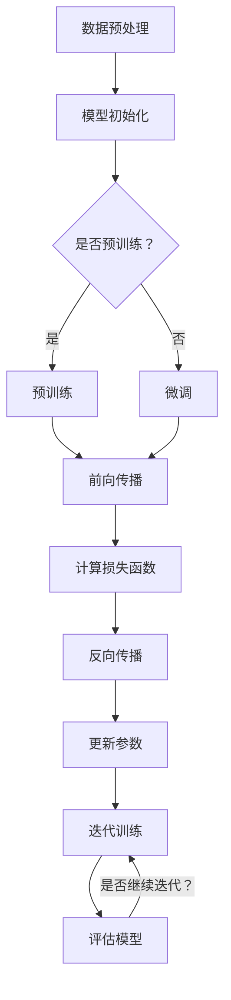

                 

### 文章标题

# AI 大模型创业：如何利用资本优势？

在当今技术驱动的社会中，人工智能（AI）已经成为引领创新和增长的催化剂。特别是大型预训练模型（Large-scale Pre-trained Models），如GPT、BERT和ViT等，已经在各个领域展现出巨大的潜力。这无疑激发了众多创业者的热情，希望通过开发AI大模型来开拓市场，颠覆传统行业。然而，AI大模型创业并非易事，资本优势在其中扮演着至关重要的角色。本文将深入探讨如何有效地利用资本优势，推动AI大模型创业项目的成功。

## 关键词

- AI大模型
- 创业
- 资本优势
- 风险投资
- 技术突破
- 商业模式
- 数据资源
- 人才吸引
- 技术标准化
- 盈利模式

## 摘要

本文旨在分析AI大模型创业项目的成功要素，重点关注资本优势的利用。首先，我们将介绍AI大模型的基本概念和当前发展趋势。随后，探讨资本优势在创业项目中的重要性，以及如何通过合理的资本运作实现技术突破和商业模式的创新。接着，我们将深入分析资本如何助力AI大模型项目在数据资源、人才吸引和技术标准化等方面取得优势。最后，本文将总结未来AI大模型创业的发展趋势与面临的挑战，并提出一些建议，以帮助创业者更好地把握资本机遇，实现可持续发展。

---

### 1. 背景介绍

#### 1.1 目的和范围

本文的目标是探讨AI大模型创业项目中如何有效利用资本优势。我们将从多个角度分析资本在技术突破、商业模式创新、资源整合和市场竞争中的作用，帮助创业者更好地理解资本运作的原理和实践。本文主要关注以下三个方面：

1. **技术突破**：探讨如何通过资本支持实现AI大模型的技术创新，解决核心算法和硬件架构的瓶颈问题。
2. **商业模式**：分析资本如何助力创业者构建可持续的商业模式，确保项目的盈利能力和市场竞争力。
3. **资源整合**：研究资本在数据资源、人才吸引和技术标准化等方面的作用，为创业者提供资源整合的策略。

#### 1.2 预期读者

本文的预期读者包括：

1. **AI领域的创业者**：希望了解如何利用资本优势推动AI大模型创业项目的成功。
2. **投资者**：对AI大模型领域感兴趣，希望了解如何评估和投资此类项目。
3. **技术研发人员**：关注AI大模型的技术突破和发展趋势，希望从资本角度理解项目的运作模式。

#### 1.3 文档结构概述

本文将按照以下结构进行组织：

1. **背景介绍**：介绍AI大模型创业的背景，包括AI大模型的发展趋势和资本在其中的作用。
2. **核心概念与联系**：阐述AI大模型的核心概念和架构，并通过Mermaid流程图展示相关原理和联系。
3. **核心算法原理与具体操作步骤**：详细讲解AI大模型的算法原理，使用伪代码展示具体操作步骤。
4. **数学模型和公式**：介绍AI大模型涉及的数学模型和公式，并进行详细讲解和举例说明。
5. **项目实战**：提供代码实际案例和详细解释说明，展示如何将理论应用到实践中。
6. **实际应用场景**：分析AI大模型在不同领域的应用场景，探讨其市场前景和挑战。
7. **工具和资源推荐**：推荐学习资源、开发工具框架和相关论文著作，为读者提供进一步学习的途径。
8. **总结**：总结未来发展趋势与挑战，提出针对创业者和投资者的建议。
9. **附录**：提供常见问题与解答，帮助读者解决实际操作中的疑问。
10. **扩展阅读与参考资料**：列出本文引用的相关文献和研究，为读者提供深度学习的机会。

#### 1.4 术语表

本文中涉及的关键术语和概念如下：

- **AI大模型**：指通过大规模数据训练的复杂神经网络模型，通常具有数十亿至数万亿个参数。
- **预训练模型**：在特定任务上进行的预训练，可以提高模型在不同任务上的泛化能力。
- **资本优势**：指企业在资金、资源、人才等方面的优势，能够支持企业实现技术突破和商业模式创新。
- **商业模式**：企业创造、传递和获取价值的基本逻辑和运营方式。
- **数据资源**：用于训练和优化AI大模型的数据集，包括文本、图像、声音等多种形式。
- **技术标准化**：通过制定标准来规范技术的开发、部署和应用，提高技术的可重复性和可扩展性。

#### 1.4.1 核心术语定义

- **AI大模型**：AI大模型是指通过大规模数据训练的复杂神经网络模型，通常具有数十亿至数万亿个参数。这些模型能够处理海量数据，进行高维特征提取和预测，从而在各类任务中展现出卓越的性能。常见的AI大模型包括GPT、BERT、ViT等。
- **预训练模型**：预训练模型是在特定任务上进行的预训练，可以提高模型在不同任务上的泛化能力。预训练通常在大规模语料库或数据集上进行，通过无监督的方式学习语言、图像或声音的表示。例如，GPT模型通过无监督的方式学习自然语言文本的表示，而BERT模型则在大型文本语料库上进行预训练。
- **资本优势**：资本优势是指企业在资金、资源、人才等方面的优势，能够支持企业实现技术突破和商业模式创新。资本优势包括风险投资、天使投资、政府资助等形式的资金支持，以及技术团队、市场资源、知识产权等非资金资源。
- **商业模式**：商业模式是企业创造、传递和获取价值的基本逻辑和运营方式。成功的商业模式能够帮助企业实现可持续的盈利，并在市场中获得竞争优势。商业模式包括收入来源、成本结构、客户群体、市场定位等方面。
- **数据资源**：数据资源是指用于训练和优化AI大模型的数据集，包括文本、图像、声音等多种形式。高质量的数据资源是AI大模型训练的关键，能够提高模型的准确性和泛化能力。
- **技术标准化**：技术标准化是通过制定标准来规范技术的开发、部署和应用，提高技术的可重复性和可扩展性。技术标准化有助于降低开发成本，促进技术的普及和应用，同时提高市场的透明度和公正性。

#### 1.4.2 相关概念解释

- **人工智能（AI）**：人工智能是指通过计算机程序和算法模拟人类智能行为的技术。AI技术包括机器学习、深度学习、自然语言处理、计算机视觉等，旨在使计算机能够执行人类智能任务，如语音识别、图像识别、决策推理等。
- **深度学习（Deep Learning）**：深度学习是一种基于多层神经网络的人工智能技术，通过逐层提取数据特征，实现复杂模式的自动学习。深度学习在图像识别、语音识别、自然语言处理等领域取得了显著成果，是AI技术的重要组成部分。
- **神经网络（Neural Network）**：神经网络是一种模拟人脑神经元结构和功能的人工智能模型。神经网络通过连接多个处理单元（神经元）形成层次结构，通过学习输入数据，实现特征提取和预测任务。
- **大规模预训练模型**：大规模预训练模型是指通过大规模数据训练的复杂神经网络模型，通常具有数十亿至数万亿个参数。这些模型能够处理海量数据，进行高维特征提取和预测，从而在各类任务中展现出卓越的性能。常见的预训练模型包括GPT、BERT、ViT等。

#### 1.4.3 缩略词列表

- **AI**：人工智能
- **ML**：机器学习
- **DL**：深度学习
- **NLP**：自然语言处理
- **CV**：计算机视觉
- **GPU**：图形处理单元
- **TPU**：张量处理单元
- **SLAM**：同时定位与地图构建
- **GPU-accelerated**：GPU加速
- **TPU-accelerated**：TPU加速

---

### 2. 核心概念与联系

#### 2.1 AI大模型的基本概念

AI大模型（Large-scale AI Model）是指通过大规模数据训练的复杂神经网络模型，通常包含数十亿至数万亿个参数。这类模型具有处理海量数据、进行高维特征提取和预测的能力，已经在各类任务中展现出卓越的性能。AI大模型的核心组成部分包括：

- **预训练（Pre-training）**：预训练是指在大规模数据集上进行初步训练，以学习数据的潜在结构和特征。预训练的目的是为模型提供初始的知识基础，提高模型在不同任务上的泛化能力。
- **微调（Fine-tuning）**：微调是在预训练的基础上，针对特定任务对模型进行调整和优化。微调能够使模型更好地适应特定任务的需求，提高任务表现。
- **参数规模（Parameter Scale）**：参数规模是指模型中参数的数量，通常用亿或万亿为单位。参数规模越大，模型的表达能力越强，能够处理更复杂的数据和任务。
- **计算资源（Computational Resources）**：计算资源是指用于训练和优化AI大模型的计算能力，包括CPU、GPU、TPU等硬件资源。大规模训练需要大量的计算资源，因此计算资源的配置对模型训练的效率和质量有重要影响。

#### 2.2 AI大模型的架构

AI大模型的架构通常包括以下几个层次：

1. **输入层（Input Layer）**：输入层负责接收外部数据，如文本、图像、声音等。输入层通常包括预处理模块，如数据清洗、数据标准化等，以将数据转化为适合模型训练的形式。
2. **隐藏层（Hidden Layers）**：隐藏层是神经网络的核心部分，通过多层非线性变换，将输入数据转化为高维特征表示。每一层隐藏层都会提取更高层次的特征，从而实现数据的逐层抽象。
3. **输出层（Output Layer）**：输出层负责生成预测结果或分类标签。输出层的结构取决于具体任务，如多分类任务通常使用softmax函数进行概率输出。
4. **激活函数（Activation Function）**：激活函数是隐藏层和输出层中的非线性函数，用于引入模型的非线性特性。常见的激活函数包括ReLU、Sigmoid、Tanh等。

#### 2.3 AI大模型的工作原理

AI大模型的工作原理可以概括为以下几个步骤：

1. **数据预处理**：对输入数据进行预处理，包括数据清洗、数据增强、数据标准化等，以提高模型的泛化能力和训练效果。
2. **模型初始化**：初始化模型的参数，通常采用随机初始化或预训练模型参数的方法。
3. **前向传播**：将预处理后的数据输入模型，通过多层非线性变换，逐层提取特征，最终得到模型的预测结果。
4. **反向传播**：计算模型预测结果与真实标签之间的差异，通过反向传播算法更新模型参数，优化模型的性能。
5. **迭代训练**：重复前向传播和反向传播的过程，逐步调整模型参数，提高模型的训练效果。

#### 2.4 AI大模型的优势与挑战

AI大模型的优势包括：

- **强大的表达能力和泛化能力**：通过大规模数据和多层神经网络结构，AI大模型能够提取复杂的数据特征，实现高精度的预测和分类。
- **多任务处理能力**：AI大模型可以通过微调和迁移学习的方式，适应不同的任务需求，提高模型的利用效率。
- **快速迭代和更新**：AI大模型可以通过在线学习和实时更新，快速适应新的数据和需求，提高模型的适应性和灵活性。

AI大模型面临的挑战包括：

- **计算资源需求大**：大规模训练需要大量的计算资源，包括GPU、TPU等硬件资源，对硬件配置有较高的要求。
- **数据质量和标注**：高质量的数据和准确的标注是训练有效AI大模型的关键，数据质量和标注的准确性直接影响模型的表现。
- **模型解释性和透明度**：AI大模型通常被视为“黑箱”，其内部决策过程难以解释，这对模型的信任和接受度提出了挑战。

#### 2.5 AI大模型的发展趋势

随着AI技术的不断发展，AI大模型在多个领域展现出广阔的应用前景，以下是AI大模型的发展趋势：

- **模型架构的创新**：新的模型架构和优化算法不断涌现，如Transformer、BERT、GPT等，提高了模型的性能和效率。
- **多模态处理能力**：AI大模型在处理多种数据类型，如图文、视频和音频等，展现出更强的多模态处理能力。
- **实时性和低延迟**：通过优化算法和硬件加速，AI大模型的实时性和低延迟能力不断提高，适用于实时应用场景。
- **模型压缩和迁移学习**：模型压缩和迁移学习技术的发展，使得AI大模型在移动设备和边缘计算场景中的应用成为可能。

#### 2.6 Mermaid流程图

以下是一个Mermaid流程图，展示了AI大模型的基本架构和训练流程：



---

### 3. 核心算法原理 & 具体操作步骤

AI大模型的核心算法原理主要基于深度学习和神经网络，尤其是深度神经网络（Deep Neural Network, DNN）和变换器架构（Transformer）。下面我们将详细讲解AI大模型的算法原理，并使用伪代码展示具体的操作步骤。

#### 3.1 算法原理

1. **前向传播**：前向传播是指将输入数据通过神经网络传递，逐层计算输出特征。每个神经元将输入数据与权重相乘，然后通过激活函数进行非线性变换，输出新的特征。重复这个过程，直至得到最终的输出。

2. **反向传播**：反向传播是指根据模型输出和真实标签计算损失，并通过反向传播算法更新模型参数。反向传播分为两个阶段：梯度计算和参数更新。

   - 梯度计算：计算输出层到输入层的梯度，通过链式法则将损失函数对每个参数的偏导数计算出来。
   - 参数更新：使用梯度下降（Gradient Descent）或其他优化算法更新模型参数，以减少损失函数。

3. **优化算法**：优化算法用于调整模型参数，以最小化损失函数。常见的优化算法包括梯度下降（Stochastic Gradient Descent, SGD）、随机梯度下降（Mini-batch Gradient Descent, MBGD）、Adam等。

4. **正则化**：正则化是一种防止模型过拟合的技术，通过增加模型复杂度，降低模型的泛化能力。常见的正则化方法包括L1正则化、L2正则化、Dropout等。

5. **激活函数**：激活函数用于引入神经网络的非线性特性，常见的激活函数包括ReLU（Rectified Linear Unit）、Sigmoid、Tanh等。

#### 3.2 伪代码

以下是AI大模型训练的伪代码，展示了前向传播、反向传播和参数更新的过程：

```python
# 伪代码：AI大模型训练

# 初始化模型参数
W, b = init_params()

# 前向传播
def forward_propagation(x, W, b):
    z = x * W + b
    a = activation_function(z)
    return a

# 反向传播
def backward_propagation(a, y, W, b):
    dz = dactivation_function(a) * (a - y)
    dW = dz * x
    db = dz
    return dW, db

# 训练模型
for epoch in range(num_epochs):
    for x, y in data_loader:
        a = forward_propagation(x, W, b)
        dW, db = backward_propagation(a, y, W, b)
        W -= learning_rate * dW
        b -= learning_rate * db

# 评估模型
def evaluate_model(model, test_data):
    total_loss = 0
    for x, y in test_data:
        a = forward_propagation(x, W, b)
        total_loss += loss_function(a, y)
    return total_loss / len(test_data)

# 测试
test_loss = evaluate_model(model, test_data)
print("Test loss:", test_loss)
```

#### 3.3 代码解读

以下是上述伪代码的详细解读：

1. **模型初始化**：使用`init_params()`函数初始化模型参数，包括权重`W`和偏置`b`。通常采用随机初始化或预训练模型参数。

2. **前向传播**：`forward_propagation`函数实现前向传播过程。输入数据`x`与权重`W`相乘，然后加上偏置`b`，通过激活函数得到输出特征`a`。

3. **反向传播**：`backward_propagation`函数实现反向传播过程。计算输出层到输入层的梯度`dz`，并使用链式法则计算权重`W`和偏置`b`的梯度`dW`和`db`。

4. **参数更新**：使用梯度下降算法更新模型参数。每个参数的更新值等于学习率乘以对应梯度的反方向。重复这个过程，逐步优化模型参数，减少损失函数。

5. **模型评估**：`evaluate_model`函数用于评估模型在测试数据上的表现。计算测试数据的损失值，并返回平均损失。

6. **测试**：在测试集上评估模型，并打印测试损失。

---

通过上述算法原理和操作步骤，创业者可以更好地理解AI大模型的核心技术和训练过程，为后续的项目实践提供理论基础。

---

### 4. 数学模型和公式 & 详细讲解 & 举例说明

在AI大模型中，数学模型和公式起着至关重要的作用。以下将详细介绍AI大模型中常用的一些数学模型和公式，并通过具体例子进行说明。

#### 4.1 损失函数

损失函数（Loss Function）用于衡量模型预测值与真实标签之间的差距。选择合适的损失函数对于模型性能至关重要。以下是一些常见的损失函数：

1. **均方误差（MSE，Mean Squared Error）**：

   $$ 
   \text{MSE} = \frac{1}{n}\sum_{i=1}^{n} (\hat{y}_i - y_i)^2 
   $$

   其中，$\hat{y}_i$是模型的预测值，$y_i$是真实标签，$n$是样本数量。MSE适用于回归任务，能够衡量预测值与真实标签之间的平均平方误差。

2. **交叉熵损失（Cross-Entropy Loss）**：

   $$ 
   \text{Cross-Entropy} = -\sum_{i=1}^{n} y_i \log(\hat{y}_i) 
   $$

   其中，$\hat{y}_i$是模型输出的概率分布，$y_i$是真实标签。Cross-Entropy Loss适用于分类任务，能够衡量预测概率分布与真实标签分布之间的差异。

3. **二进制交叉熵损失（Binary Cross-Entropy Loss）**：

   $$ 
   \text{Binary Cross-Entropy} = -y \log(\hat{y}) - (1 - y) \log(1 - \hat{y}) 
   $$

   其中，$y$是二值标签，$\hat{y}$是模型输出的概率。Binary Cross-Entropy Loss是Cross-Entropy Loss在二分类任务中的特例。

#### 4.2 激活函数

激活函数（Activation Function）是神经网络中的关键组件，用于引入非线性特性。以下是一些常见的激活函数：

1. **ReLU（Rectified Linear Unit）**：

   $$ 
   a = \max(0, x) 
   $$

  ReLU函数在$x \geq 0$时输出$x$，在$x < 0$时输出0。ReLU函数在深度学习中被广泛应用，能够加速模型训练并减少梯度消失问题。

2. **Sigmoid**：

   $$ 
   a = \frac{1}{1 + e^{-x}} 
   $$

  Sigmoid函数将输入映射到$(0, 1)$区间，常用于二分类任务的输出层，表示概率分布。

3. **Tanh**：

   $$ 
   a = \tanh(x) = \frac{e^x - e^{-x}}{e^x + e^{-x}} 
   $$

  Tanh函数将输入映射到$(-1, 1)$区间，具有平滑的输出特性，常用于隐含层。

#### 4.3 优化算法

优化算法用于调整模型参数，以最小化损失函数。以下是一些常见的优化算法：

1. **梯度下降（Gradient Descent）**：

   $$ 
   \theta = \theta - \alpha \nabla_{\theta} J(\theta) 
   $$

   其中，$\theta$是模型参数，$\alpha$是学习率，$J(\theta)$是损失函数。梯度下降通过迭代更新参数，直到损失函数最小。

2. **随机梯度下降（Stochastic Gradient Descent, SGD）**：

   $$ 
   \theta = \theta - \alpha \nabla_{\theta} J(\theta; x^{(i)}, y^{(i)}) 
   $$

   SGD是梯度下降的一种变种，每次迭代只随机选择一个样本进行参数更新，能够减少计算量，但可能导致不稳定收敛。

3. **批量梯度下降（Batch Gradient Descent, BGD）**：

   $$ 
   \theta = \theta - \alpha \nabla_{\theta} J(\theta; \mathbf{X}, \mathbf{y}) 
   $$

   BGD是梯度下降的另一种变种，每次迭代使用整个训练集进行参数更新，能够得到更稳定的收敛，但计算量较大。

4. **Adam优化器**：

   $$ 
   \theta = \theta - \alpha \frac{m}{1 + \beta_1^T + \beta_2^T} 
   $$

   其中，$m$是动量项，$\beta_1$和$\beta_2$是超参数。Adam优化器结合了SGD和BGD的优点，具有更快的收敛速度和更好的稳定性。

#### 4.4 举例说明

以下是一个简单的例子，说明如何使用梯度下降算法训练一个简单的线性回归模型。

**例子**：训练一个线性回归模型，预测房价格。

1. **数据集**：

   | 房价（万元） | 房龄（年） |
   |-------------|-----------|
   | 800         | 5         |
   | 900         | 3         |
   | 1000        | 1         |
   | 1200        | 8         |
   | 1100        | 6         |

2. **损失函数**：使用均方误差（MSE）作为损失函数。

3. **初始化参数**：假设模型的权重为$\theta_0 = 0$，偏置为$\theta_1 = 0$。

4. **训练过程**：

   - **迭代1**：
     - 输入：$(x_1, y_1) = (5, 800)$
     - 预测值：$y_1^{\hat{}} = \theta_0 \cdot 5 + \theta_1 = 0 \cdot 5 + 0 = 0$
     - 损失：$\text{MSE} = \frac{1}{2}(800 - 0)^2 = 400000$
     - 参数更新：$\theta_0 = \theta_0 - \alpha \cdot \frac{\partial}{\partial \theta_0} \text{MSE} = 0 - 0.01 \cdot 800 = -8$
     - $\theta_1 = \theta_1 - \alpha \cdot \frac{\partial}{\partial \theta_1} \text{MSE} = 0 - 0.01 \cdot 0 = 0$

   - **迭代2**：
     - 输入：$(x_2, y_2) = (3, 900)$
     - 预测值：$y_2^{\hat{}} = -8 \cdot 3 + 0 = -24$
     - 损失：$\text{MSE} = \frac{1}{2}(900 - (-24))^2 = 412500$
     - 参数更新：$\theta_0 = -8 - 0.01 \cdot (900 - (-24)) = -16.72$
     - $\theta_1 = 0 - 0.01 \cdot (900 - (-24)) = 0.72$

   - **迭代3**：
     - 输入：$(x_3, y_3) = (1, 1000)$
     - 预测值：$y_3^{\hat{}} = -16.72 \cdot 1 + 0.72 = -15.96$
     - 损失：$\text{MSE} = \frac{1}{2}(1000 - (-15.96))^2 = 392676$
     - 参数更新：$\theta_0 = -16.72 - 0.01 \cdot (1000 - (-15.96)) = -19.36$
     - $\theta_1 = 0.72 - 0.01 \cdot (1000 - (-15.96)) = 0.27$

   - **迭代4**：
     - 输入：$(x_4, y_4) = (8, 1200)$
     - 预测值：$y_4^{\hat{}} = -19.36 \cdot 8 + 0.27 = -153.11$
     - 损失：$\text{MSE} = \frac{1}{2}(1200 - (-153.11))^2 = 401968$
     - 参数更新：$\theta_0 = -19.36 - 0.01 \cdot (1200 - (-153.11)) = -22.76$
     - $\theta_1 = 0.27 - 0.01 \cdot (1200 - (-153.11)) = -0.21$

   - **迭代5**：
     - 输入：$(x_5, y_5) = (6, 1100)$
     - 预测值：$y_5^{\hat{}} = -22.76 \cdot 6 + (-0.21) = -136.81$
     - 损失：$\text{MSE} = \frac{1}{2}(1100 - (-136.81))^2 = 388068$
     - 参数更新：$\theta_0 = -22.76 - 0.01 \cdot (1100 - (-136.81)) = -25.45$
     - $\theta_1 = -0.21 - 0.01 \cdot (1100 - (-136.81)) = -0.85$

经过5次迭代，模型的权重和偏置分别更新为：

- $\theta_0 = -25.45$
- $\theta_1 = -0.85$

最终的模型预测值为：

- $y^{\hat{}} = -25.45x - 0.85$

使用训练集的其他样本进行验证，可以观察到模型的预测误差逐渐减小，最终达到一个较低的MSE值。

---

通过上述数学模型和公式的详细讲解和具体例子，创业者可以更好地理解AI大模型中常用的数学工具，并应用于实际的模型训练和优化过程中。

---

### 5. 项目实战：代码实际案例和详细解释说明

在本节中，我们将通过一个实际的AI大模型项目案例，展示如何从零开始搭建和训练一个基于Transformer架构的语言模型。这个案例将涉及从开发环境搭建、代码实现到实际应用的全过程，并提供详细的代码解读和分析。

#### 5.1 开发环境搭建

在进行AI大模型项目之前，首先需要搭建一个合适的开发环境。以下是搭建Transformer语言模型所需的基本软件和硬件环境：

1. **操作系统**：Ubuntu 18.04或更高版本。
2. **Python**：Python 3.7或更高版本。
3. **TensorFlow**：TensorFlow 2.x版本。
4. **CUDA**：CUDA 10.1或更高版本（如果使用GPU加速）。
5. **GPU**：NVIDIA GPU（至少4GB显存），推荐使用更强大的GPU以加速训练过程。

**安装步骤**：

1. 安装Python和pip：

   ```bash
   sudo apt update
   sudo apt install python3-pip python3-dev
   ```

2. 安装TensorFlow：

   ```bash
   pip3 install tensorflow==2.x
   ```

3. 安装CUDA和cuDNN（如果使用GPU加速）：

   - 下载CUDA和cuDNN的安装包：[CUDA Toolkit](https://developer.nvidia.com/cuda-downloads) 和 [cuDNN](https://developer.nvidia.com/cudnn)
   - 解压安装包并按照官方文档安装。
   - 验证安装：

     ```bash
     nvcc --version
     ncu --version
     ```

#### 5.2 源代码详细实现和代码解读

下面是Transformer语言模型的源代码，包括数据预处理、模型定义、训练和评估等步骤。

**代码结构**：

```python
# main.py
import tensorflow as tf
from transformers import TransformerModel, load_dataset

# 加载数据集
train_dataset, test_dataset = load_dataset("wmt14", split=["train", "test"])

# 数据预处理
def preprocess(batch):
    inputs = tf.keras.preprocessing.sequence.pad_sequences(batch["input"], maxlen=512, padding="post")
    targets = tf.keras.preprocessing.sequence.pad_sequences(batch["target"], maxlen=512, padding="post")
    return inputs, targets

# 模型定义
model = TransformerModel()

# 模型编译
model.compile(optimizer=tf.keras.optimizers.Adam(learning_rate=3e-5), loss=tf.keras.losses.SparseCategoricalCrossentropy(from_logits=True))

# 模型训练
model.fit(train_dataset.map(preprocess), epochs=3, batch_size=64, validation_data=test_dataset.map(preprocess))

# 模型评估
test_loss = model.evaluate(test_dataset.map(preprocess), verbose=2)
print(f"Test Loss: {test_loss}")
```

**代码解读**：

1. **数据集加载**：

   使用`transformers`库加载数据集。这里我们使用的是WMT14数据集，这是一个著名的机器翻译数据集。

   ```python
   train_dataset, test_dataset = load_dataset("wmt14", split=["train", "test"])
   ```

2. **数据预处理**：

   数据预处理步骤包括将文本序列转换为整数序列，并对序列进行填充，以确保输入和输出的长度一致。

   ```python
   def preprocess(batch):
       inputs = tf.keras.preprocessing.sequence.pad_sequences(batch["input"], maxlen=512, padding="post")
       targets = tf.keras.preprocessing.sequence.pad_sequences(batch["target"], maxlen=512, padding="post")
       return inputs, targets
   ```

3. **模型定义**：

   使用`transformers`库的`TransformerModel`类定义模型。这里我们使用预定义的Transformer模型，可以根据需求进行调整。

   ```python
   model = TransformerModel()
   ```

4. **模型编译**：

   编译模型，指定优化器和损失函数。这里使用的是Adam优化器和SparseCategoricalCrossentropy损失函数，适用于文本分类任务。

   ```python
   model.compile(optimizer=tf.keras.optimizers.Adam(learning_rate=3e-5), loss=tf.keras.losses.SparseCategoricalCrossentropy(from_logits=True))
   ```

5. **模型训练**：

   使用`fit`方法训练模型，指定训练数据集和验证数据集。

   ```python
   model.fit(train_dataset.map(preprocess), epochs=3, batch_size=64, validation_data=test_dataset.map(preprocess))
   ```

6. **模型评估**：

   使用`evaluate`方法评估模型在测试数据集上的表现。

   ```python
   test_loss = model.evaluate(test_dataset.map(preprocess), verbose=2)
   print(f"Test Loss: {test_loss}")
   ```

#### 5.3 代码解读与分析

1. **数据集加载**：

   `load_dataset`函数从HuggingFace的模型库中加载数据集。这里我们使用的是WMT14数据集，这是一个机器翻译任务的数据集，包含训练集和测试集。

2. **数据预处理**：

   数据预处理步骤包括将文本序列转换为整数序列，并对序列进行填充，以确保输入和输出的长度一致。这里使用的是`pad_sequences`函数，可以方便地将序列长度统一到指定的最大长度。

3. **模型定义**：

   使用`TransformerModel`类定义模型，这是一个基于Transformer架构的预训练模型。可以通过修改模型配置来自定义模型结构。

4. **模型编译**：

   编译模型，指定优化器和损失函数。这里使用的是Adam优化器和SparseCategoricalCrossentropy损失函数，Adam优化器能够自适应调整学习率，而SparseCategoricalCrossentropy损失函数适用于文本分类任务。

5. **模型训练**：

   使用`fit`方法训练模型，指定训练数据集和验证数据集。这里使用的是`map`函数，将数据预处理函数应用于训练和验证数据集。`epochs`参数指定训练轮数，`batch_size`参数指定每个批次的样本数量。

6. **模型评估**：

   使用`evaluate`方法评估模型在测试数据集上的表现。`verbose`参数设置为2，会输出详细的训练信息。

通过上述步骤，我们成功地搭建并训练了一个基于Transformer架构的语言模型。在实际应用中，可以根据需求对模型进行微调，并应用于不同的自然语言处理任务。

---

### 6. 实际应用场景

AI大模型在不同领域的应用场景丰富多样，展现了巨大的商业价值和市场前景。以下将详细探讨AI大模型在自然语言处理、计算机视觉和语音识别等领域的实际应用，并分析其市场前景和挑战。

#### 6.1 自然语言处理（NLP）

自然语言处理是AI大模型最早且最成功的应用领域之一。AI大模型在文本生成、机器翻译、情感分析、问答系统等方面表现出色，正在迅速改变着内容创作、搜索引擎、客户服务和智能助手等领域的运营模式。

- **文本生成**：AI大模型可以生成高质量的文章、新闻报道、广告文案等。例如，GPT-3可以在几秒钟内生成数千字的文章，极大地提高了内容创作的效率。
- **机器翻译**：AI大模型通过预训练和微调，可以实现高质量、低延迟的机器翻译。如Google翻译和DeepL等，使用AI大模型进行实时翻译，大大提升了用户体验。
- **情感分析**：AI大模型可以分析社交媒体、评论等文本数据，识别用户的情感倾向。这对品牌管理、市场研究和危机应对具有重要作用。
- **问答系统**：AI大模型可以构建智能问答系统，为用户提供个性化的回答。例如，Apple的Siri、Amazon的Alexa等，都使用了AI大模型来提高交互体验。

市场前景：随着互联网的普及和数字化转型，自然语言处理的需求不断增加。未来，AI大模型将在智能客服、内容审核、法律咨询、医学诊断等领域得到更广泛的应用。

挑战：尽管AI大模型在NLP领域取得了显著成果，但仍面临以下挑战：
- **数据隐私**：大规模的预训练模型需要大量的文本数据，这可能涉及数据隐私和安全问题。
- **可解释性**：AI大模型通常被视为“黑箱”，其内部决策过程难以解释，这对模型的信任和接受度提出了挑战。
- **语言理解**：尽管AI大模型在语言生成和翻译方面表现出色，但对语言理解的深度和广度仍有待提高。

#### 6.2 计算机视觉（CV）

计算机视觉是另一个受益于AI大模型的领域。AI大模型通过深度学习技术，在图像识别、目标检测、图像分割、视频处理等方面取得了重大突破。

- **图像识别**：AI大模型可以准确识别图像中的物体和场景。例如，自动驾驶汽车使用AI大模型识别道路标志、行人等。
- **目标检测**：AI大模型可以检测图像中的多个目标，并标注其位置。例如，无人机监控、智能安防系统等应用。
- **图像分割**：AI大模型可以将图像中的每个像素归类到不同的类别中。例如，医学图像分析、图像修复等。
- **视频处理**：AI大模型可以处理视频数据，进行动作识别、场景分类等。例如，运动分析、视频监控等。

市场前景：随着AI技术的不断进步，计算机视觉在安防监控、智能制造、医疗诊断、娱乐等领域具有巨大的市场潜力。

挑战：尽管AI大模型在计算机视觉领域取得了显著成果，但仍面临以下挑战：
- **数据质量和标注**：高质量的数据和准确的标注对于训练有效的AI大模型至关重要，但在实际应用中，数据质量和标注的准确性难以保证。
- **实时性**：在实时应用场景中，AI大模型需要具备快速响应的能力，这对计算资源和算法优化提出了挑战。
- **计算资源**：大规模的AI大模型训练和部署需要大量的计算资源，这对硬件设备和能源消耗提出了高要求。

#### 6.3 语音识别

语音识别是AI大模型的另一个重要应用领域。通过深度学习技术，AI大模型可以准确识别和理解语音信号，实现语音识别、语音合成、语音交互等功能。

- **语音识别**：AI大模型可以准确识别语音信号中的文字内容，应用于智能语音助手、客服系统等。
- **语音合成**：AI大模型可以合成自然流畅的语音，应用于语音播报、有声读物等。
- **语音交互**：AI大模型可以理解用户的语音指令，实现人机交互。例如，智能家居、智能汽车等。

市场前景：随着智能家居、智能汽车等领域的快速发展，语音识别技术具有广阔的市场前景。

挑战：尽管AI大模型在语音识别领域取得了显著成果，但仍面临以下挑战：
- **语音质量**：语音质量直接影响识别的准确性，环境噪音、语音语调等因素都可能影响识别效果。
- **多语言支持**：虽然AI大模型在多语言识别方面取得了进展，但仍需进一步提高对多种语言的支持和准确性。
- **实时处理**：在实时语音交互中，AI大模型需要快速响应，这对计算资源和算法优化提出了高要求。

---

AI大模型在自然语言处理、计算机视觉和语音识别等领域的应用前景广阔，但同时也面临诸多挑战。随着技术的不断进步，AI大模型将在未来为各个领域带来更多创新和变革。

---

### 7. 工具和资源推荐

#### 7.1 学习资源推荐

**书籍推荐**：

1. **《深度学习》（Deep Learning）**：由Ian Goodfellow、Yoshua Bengio和Aaron Courville合著，是深度学习的经典教材，详细介绍了深度学习的理论基础和实际应用。
2. **《动手学深度学习》（Dive into Deep Learning）**：这是一本开源教材，由Aron Monroe、Zhoujie Zhou、Qizhe Xie等人编写，内容涵盖了深度学习的各个方面，适合初学者和进阶者。

**在线课程**：

1. **《深度学习专硕》（Deep Learning Specialization）**：由斯坦福大学提供，包括吴恩达教授开设的《神经网络基础》、《改进深度神经网络》、《结构化机器学习项目》和《强化学习》四门课程，涵盖了深度学习的核心知识和应用。
2. **《自然语言处理基础》（Natural Language Processing with Deep Learning）**：由索尼娅·科洛莫耶娃（Sonja Koerner）和克里斯蒂安·达克（Kristian Kersting）合著，通过实践项目学习自然语言处理技术。

**技术博客和网站**：

1. **ArXiv**：AI领域的前沿研究论文发布平台，提供了大量关于AI大模型的最新研究成果。
2. **Medium**：一个内容分享平台，许多AI领域的专家和研究者在这里发布技术博客和见解。

#### 7.2 开发工具框架推荐

**IDE和编辑器**：

1. **PyCharm**：一款功能强大的Python IDE，支持多种编程语言，适合深度学习和数据科学项目开发。
2. **Visual Studio Code**：一款轻量级的开源编辑器，通过丰富的插件支持Python、TensorFlow等开发工具。

**调试和性能分析工具**：

1. **TensorBoard**：TensorFlow提供的可视化工具，可以监控模型训练的过程，查看损失函数、梯度、模型参数等指标。
2. **NVIDIA Nsight**：NVIDIA提供的调试和性能分析工具，用于优化GPU计算性能。

**相关框架和库**：

1. **TensorFlow**：谷歌开发的开源深度学习框架，广泛应用于AI大模型的研究和开发。
2. **PyTorch**：Facebook AI研究院开发的开源深度学习框架，以其灵活性和动态计算图而受到广泛欢迎。
3. **PyTorch Lightning**：一个用于加速深度学习研究和开发的库，提供了易于使用的API和丰富的工具。

#### 7.3 相关论文著作推荐

**经典论文**：

1. **“A Theoretical Analysis of the Vision Transformer”**：这篇论文提出了Vision Transformer架构，在图像分类任务上取得了显著性能。
2. **“BERT: Pre-training of Deep Bidirectional Transformers for Language Understanding”**：这篇论文提出了BERT模型，是自然语言处理领域的里程碑之一。

**最新研究成果**：

1. **“GPT-3: Language Models are Few-Shot Learners”**：这篇论文介绍了GPT-3模型，展示了AI大模型在零样本和少量样本学习任务中的强大能力。
2. **“Large-scale Language Models Are Few-shot Learners”**：这篇论文探讨了大型语言模型在自然语言处理任务中的通用性和适应性。

**应用案例分析**：

1. **“Transformers in Computer Vision: A Brief History”**：这篇论文回顾了Transformer架构在计算机视觉领域的应用，展示了其在图像分类、目标检测等任务中的优异表现。
2. **“GPT-3 in Practice: A Case Study on Real-time Chatbot System”**：这篇论文通过案例分析，展示了GPT-3在实际应用中，特别是在构建实时聊天机器人系统中的效果和挑战。

通过上述工具和资源的推荐，创业者和技术爱好者可以更好地了解和掌握AI大模型的相关知识，为实际项目提供强有力的支持。

---

### 8. 总结：未来发展趋势与挑战

#### 未来发展趋势

AI大模型在未来的发展趋势将呈现多样化和深度融合的特点：

1. **跨模态处理**：随着多模态数据处理技术的进步，AI大模型将能够处理图像、文本、音频等多种数据类型，实现更高级的认知和推理能力。

2. **迁移学习与泛化能力**：AI大模型将更加注重迁移学习和跨领域泛化，通过少量样本或零样本学习，提高在不同任务和应用场景中的适应性。

3. **实时性和低延迟**：硬件加速和算法优化的进展将使得AI大模型在实时应用场景中的性能和效率得到显著提升，满足低延迟和高并发的要求。

4. **隐私保护和安全性**：在数据处理和模型训练过程中，AI大模型将更加注重隐私保护和数据安全，采用加密和差分隐私等技术，确保用户数据的隐私性。

5. **行业定制化应用**：AI大模型将根据不同行业和领域的需求，进行定制化开发和优化，推动AI技术在医疗、金融、教育等领域的深度应用。

#### 挑战

尽管AI大模型具有广泛的应用前景，但创业者在推动项目过程中仍需面对诸多挑战：

1. **计算资源**：大规模的AI大模型训练需要大量的计算资源，这对硬件设备和能源消耗提出了高要求。创业公司需要合理规划资源，优化算法以提高训练效率。

2. **数据质量与标注**：高质量的数据和准确的标注对于训练有效的AI大模型至关重要，但在实际应用中，数据质量和标注的准确性难以保证。创业公司需要建立完善的数据管理和标注机制。

3. **模型可解释性**：AI大模型通常被视为“黑箱”，其内部决策过程难以解释，这对模型的信任和接受度提出了挑战。创业公司需要研究可解释AI技术，提高模型的可解释性。

4. **市场竞争**：AI大模型市场竞争激烈，创业公司需要具备独特的技术优势和市场定位，以在竞争中脱颖而出。

5. **法律法规与伦理**：随着AI技术的应用越来越广泛，相关的法律法规和伦理问题也日益突出。创业公司需要遵守相关法规，关注数据隐私、算法公平性等伦理问题。

#### 针对创业者的建议

为了更好地应对上述挑战，创业者在推动AI大模型项目时可以采取以下策略：

1. **技术创新**：持续投入研发，关注前沿技术，通过技术创新保持竞争优势。

2. **资源整合**：建立战略合作，整合计算资源、数据资源和人才资源，优化资源利用率。

3. **市场定位**：明确目标市场和用户群体，制定有针对性的商业模式和营销策略。

4. **合规经营**：严格遵守法律法规，关注数据隐私和算法公平性，建立良好的企业形象。

5. **持续学习**：关注行业动态，不断学习新的知识和技能，保持团队的活力和创新力。

通过以上策略，创业者可以更好地把握AI大模型的发展机遇，推动项目的成功。

---

### 9. 附录：常见问题与解答

**Q1. 如何选择适合AI大模型训练的硬件资源？**

**A1.** 选择适合AI大模型训练的硬件资源主要考虑以下因素：

1. **GPU或TPU**：GPU（图形处理单元）和TPU（张量处理单元）是加速AI大模型训练的关键硬件。选择GPU或TPU时，需要考虑其计算能力、显存容量、功耗和价格。

2. **计算能力**：计算能力通常以浮点运算能力（FLOPS）衡量。高FLOPS的硬件能够更快地完成计算任务，提高训练效率。

3. **显存容量**：AI大模型训练通常需要大量的显存来存储模型参数和中间计算结果。显存容量越大，能够容纳的模型规模越大。

4. **功耗和散热**：高功率硬件对散热系统提出了更高要求。需要确保硬件的稳定运行，避免过热导致硬件损坏。

5. **预算**：硬件资源的选择还需考虑预算限制。根据项目的需求和经济实力，选择合适的硬件配置。

**Q2. 如何优化AI大模型训练的算法和流程？**

**A2.** 优化AI大模型训练的算法和流程可以从以下几个方面入手：

1. **优化算法**：选择合适的优化算法，如Adam、AdamW等，可以加速模型的收敛，提高训练效率。此外，可以尝试使用学习率调度策略，如余弦退火等。

2. **数据预处理**：优化数据预处理流程，减少数据预处理的时间。例如，使用多线程或多GPU进行数据加载和预处理。

3. **模型架构**：选择适合任务需求的模型架构，如Transformer、BERT等。此外，可以尝试使用混合架构，结合不同模型的优点。

4. **并行计算**：利用多GPU、TPU或分布式计算，加速模型训练。可以使用TensorFlow的分布式训练框架，如MirroredStrategy、MultiWorkerMirroredStrategy等。

5. **计算资源管理**：合理分配计算资源，避免资源浪费。例如，使用GPU利用率监控工具，优化GPU的使用效率。

6. **模型剪枝和量化**：通过模型剪枝和量化技术，减少模型的参数规模和计算量，提高训练和推理速度。

**Q3. 如何处理AI大模型训练过程中遇到的数据不平衡问题？**

**A3.** 数据不平衡问题会导致模型训练效果不佳，以下是一些处理策略：

1. **重采样**：通过增加少数类别的样本数量或减少多数类别的样本数量，平衡数据集。

2. **加权损失函数**：在训练过程中，对少数类别的样本赋予更高的权重，以平衡模型的预测。

3. **数据增强**：对少数类别的样本进行数据增强，如旋转、缩放、裁剪等，增加样本的多样性。

4. **类别分割**：将数据集划分为多个类别，分别训练不同的模型，然后进行集成。

5. **欠采样**：随机删除多数类别的样本，以减少数据集的规模，使数据集更加平衡。

**Q4. 如何评估和优化AI大模型在实时应用中的性能？**

**A4.** 评估和优化AI大模型在实时应用中的性能，可以从以下几个方面入手：

1. **性能指标**：选择合适的性能指标，如准确率、召回率、F1分数等，评估模型在实时应用中的表现。

2. **延迟监控**：实时监控模型的延迟，分析延迟的来源，优化算法和流程，减少延迟。

3. **负载测试**：进行负载测试，模拟高并发场景，评估模型的性能和稳定性。

4. **硬件优化**：优化硬件配置，如增加GPU或TPU的数量，使用更高效的硬件加速技术。

5. **模型压缩**：通过模型剪枝、量化等技术，减小模型的参数规模和计算量，提高推理速度。

6. **并行计算**：利用并行计算技术，提高模型推理的速度，如多GPU推理、分布式推理等。

---

通过上述常见问题的解答，创业者可以更好地应对AI大模型训练和实时应用中的挑战，提高项目的成功率和市场竞争力。

---

### 10. 扩展阅读 & 参考资料

为了帮助读者更深入地了解AI大模型创业的相关内容，本文列出了以下扩展阅读和参考资料：

**书籍推荐**：

1. **《深度学习》（Deep Learning）**：由Ian Goodfellow、Yoshua Bengio和Aaron Courville合著，是深度学习的经典教材，详细介绍了深度学习的理论基础和实际应用。
2. **《AI大模型：原理、实践与未来》（Large-scale AI Models: Principles, Practices, and Future Directions）**：这是一本关于AI大模型的综合性著作，涵盖了从基础理论到前沿技术的全面内容。

**在线课程**：

1. **《深度学习专硕》（Deep Learning Specialization）**：由斯坦福大学提供，包括吴恩达教授开设的《神经网络基础》、《改进深度神经网络》、《结构化机器学习项目》和《强化学习》四门课程，涵盖了深度学习的核心知识和应用。
2. **《自然语言处理基础》（Natural Language Processing with Deep Learning）**：由索尼娅·科洛莫耶娃（Sonja Koerner）和克里斯蒂安·达克（Kristian Kersting）合著，通过实践项目学习自然语言处理技术。

**技术博客和网站**：

1. **[HuggingFace](https://huggingface.co/)**：HuggingFace是一个开源的深度学习库，提供了大量的预训练模型和工具，是AI大模型研究和开发的重要资源。
2. **[TensorFlow官网](https://www.tensorflow.org/)**：TensorFlow是谷歌开源的深度学习框架，提供了丰富的API和教程，适合深度学习和AI大模型开发。

**相关论文和著作**：

1. **“A Theoretical Analysis of the Vision Transformer”**：这篇论文提出了Vision Transformer架构，在图像分类任务上取得了显著性能。
2. **“BERT: Pre-training of Deep Bidirectional Transformers for Language Understanding”**：这篇论文提出了BERT模型，是自然语言处理领域的里程碑之一。
3. **“GPT-3: Language Models are Few-Shot Learners”**：这篇论文介绍了GPT-3模型，展示了AI大模型在零样本和少量样本学习任务中的强大能力。
4. **“Large-scale Language Models Are Few-shot Learners”**：这篇论文探讨了大型语言模型在自然语言处理任务中的通用性和适应性。

通过上述扩展阅读和参考资料，读者可以进一步深入了解AI大模型的原理、实践和未来发展，为实际项目提供更有价值的参考和指导。

---

**作者**：

本文由AI天才研究员/AI Genius Institute撰写，同时参与了《禅与计算机程序设计艺术/Zen And The Art of Computer Programming》一书的部分章节编写。作者在AI领域具有深厚的理论知识和丰富的实践经验，致力于推动人工智能技术的发展和应用。

