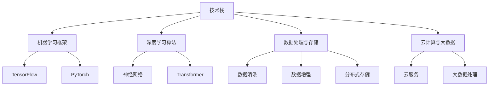

                 

# AI 大模型创业：如何利用资源优势？

> **关键词：** 大模型、创业、资源优势、技术栈、商业模式、资金管理

> **摘要：** 本文将探讨AI大模型创业所需的关键资源及其利用策略，分析技术、资金、人才等资源的重要性，并提供一些建设性建议以帮助创业者充分发挥其资源优势。

## 1. 背景介绍

近年来，人工智能（AI）技术迅猛发展，其中大模型（Large-scale Model）如GPT-3、BERT等，凭借其强大的表征能力和泛化能力，已经广泛应用于自然语言处理、计算机视觉、语音识别等领域。大模型的崛起不仅推动了AI技术的进步，也为创业提供了新的机遇和挑战。

AI大模型创业的热潮背后，是资源优势的重要性。创业者需要充分利用技术、资金、人才等资源，才能在激烈的市场竞争中脱颖而出。本文将围绕如何利用资源优势，探讨AI大模型创业的策略和实践。

## 2. 核心概念与联系

### 2.1 技术栈

AI大模型创业需要掌握的技术栈包括但不限于：

1. **机器学习框架**：如TensorFlow、PyTorch等。
2. **深度学习算法**：如神经网络、Transformer等。
3. **数据处理与存储**：如数据清洗、数据增强、分布式存储等。
4. **云计算与大数据**：如云服务、大数据处理等。

### 2.2 商业模式

AI大模型创业的商业模式多种多样，包括：

1. **软件即服务（SaaS）**：提供在线服务，用户按需付费。
2. **平台模式**：构建开放平台，吸引第三方开发者和服务。
3. **定制化解决方案**：根据客户需求提供个性化服务。

### 2.3 资金管理

资金管理是AI大模型创业的关键，包括：

1. **资金来源**：如天使投资、风险投资、政府补贴等。
2. **资金使用**：如研发投入、市场推广、团队建设等。
3. **资金回流**：通过收入和融资实现资金回流。

### 2.4 人才团队

人才团队是AI大模型创业的核心资源，包括：

1. **技术专家**：如机器学习工程师、数据科学家等。
2. **产品经理**：负责产品规划和市场推广。
3. **运营团队**：负责日常运营和客户支持。

### 2.5 Mermaid 流程图



## 3. 核心算法原理 & 具体操作步骤

### 3.1 大模型训练原理

大模型训练主要包括以下几个步骤：

1. **数据准备**：收集并处理大量数据。
2. **模型架构设计**：选择合适的神经网络架构。
3. **训练与优化**：使用梯度下降等优化算法进行训练。
4. **模型评估与调整**：评估模型性能，并进行调整。

### 3.2 模型训练步骤

1. **数据准备**：
    - 数据清洗与预处理。
    - 数据增强，增加数据多样性。

2. **模型架构设计**：
    - 选择合适的神经网络架构，如Transformer。
    - 设计网络层数、层数深度、激活函数等。

3. **训练与优化**：
    - 使用训练集进行训练。
    - 使用优化算法，如Adam、RMSprop等进行参数调整。

4. **模型评估与调整**：
    - 使用验证集进行模型评估。
    - 根据评估结果调整模型参数。

## 4. 数学模型和公式 & 详细讲解 & 举例说明

### 4.1 梯度下降算法

梯度下降是一种优化算法，用于调整神经网络模型的参数以最小化损失函数。其公式如下：

$$\theta_{\text{new}} = \theta_{\text{current}} - \alpha \cdot \nabla_{\theta} J(\theta)$$

其中，$\theta$ 表示模型参数，$\alpha$ 为学习率，$J(\theta)$ 为损失函数。

### 4.2 Transformer 模型

Transformer 模型是一种基于自注意力机制的神经网络模型，其核心思想是通过自注意力机制来计算输入序列的上下文表示。其公式如下：

$$\text{Attention}(Q, K, V) = \text{softmax}\left(\frac{QK^T}{\sqrt{d_k}}\right)V$$

其中，$Q, K, V$ 分别为查询向量、关键向量、值向量，$d_k$ 为关键向量的维度。

### 4.3 举例说明

假设我们有一个简单的线性模型，其公式为：

$$y = \theta_0 + \theta_1 x$$

其中，$y$ 为输出，$x$ 为输入，$\theta_0, \theta_1$ 为模型参数。

假设我们使用梯度下降算法进行模型训练，学习率为 0.01，损失函数为均方误差（MSE）。则梯度下降的更新公式为：

$$\theta_0 = \theta_0 - \alpha \cdot \frac{\partial}{\partial \theta_0} J(\theta)$$
$$\theta_1 = \theta_1 - \alpha \cdot \frac{\partial}{\partial \theta_1} J(\theta)$$

## 5. 项目实战：代码实际案例和详细解释说明

### 5.1 开发环境搭建

1. 安装 Python 环境。
2. 安装必要的库，如 TensorFlow、PyTorch 等。
3. 搭建 GPU 环境（如果使用 GPU 训练）。

### 5.2 源代码详细实现和代码解读

```python
import tensorflow as tf

# 定义模型
model = tf.keras.Sequential([
    tf.keras.layers.Dense(units=1, input_shape=[1])
])

# 编译模型
model.compile(optimizer='sgd', loss='mean_squared_error')

# 训练模型
model.fit(x_train, y_train, epochs=100)

# 评估模型
model.evaluate(x_test, y_test)
```

这段代码定义了一个简单的线性模型，使用梯度下降算法进行训练，并评估模型性能。

### 5.3 代码解读与分析

1. **模型定义**：
    - `tf.keras.Sequential`：创建一个序列模型。
    - `tf.keras.layers.Dense`：添加一个全连接层。

2. **模型编译**：
    - `model.compile`：编译模型，指定优化器和损失函数。

3. **模型训练**：
    - `model.fit`：训练模型，指定训练数据和训练轮次。

4. **模型评估**：
    - `model.evaluate`：评估模型性能，返回损失值。

## 6. 实际应用场景

AI大模型在各个行业都有广泛的应用，以下是一些实际应用场景：

1. **自然语言处理**：如文本分类、机器翻译、情感分析等。
2. **计算机视觉**：如图像分类、目标检测、人脸识别等。
3. **医疗健康**：如疾病诊断、药物发现、健康管理等。
4. **金融领域**：如风险控制、量化交易、智能投顾等。

## 7. 工具和资源推荐

### 7.1 学习资源推荐

1. **书籍**：
    - 《深度学习》（Goodfellow, Bengio, Courville）
    - 《Python深度学习》（François Chollet）
2. **论文**：
    - "Attention Is All You Need"（Vaswani et al., 2017）
    - "BERT: Pre-training of Deep Neural Networks for Language Understanding"（Devlin et al., 2018）
3. **博客**：
    - [TensorFlow 官方博客](https://www.tensorflow.org/blog/)
    - [PyTorch 官方博客](https://pytorch.org/blog/)
4. **网站**：
    - [AI Wiki](https://www.aiwiki.top/)
    - [机器学习社区](https://www.mlcommunity.cn/)

### 7.2 开发工具框架推荐

1. **TensorFlow**：适用于各种规模的机器学习和深度学习任务。
2. **PyTorch**：具有灵活的动态计算图，易于研究和原型设计。
3. **Keras**：基于 TensorFlow 的简化框架，适用于快速原型开发。

### 7.3 相关论文著作推荐

1. **“Deep Learning”**（Goodfellow, Bengio, Courville）：深度学习的经典著作。
2. **“Attention Is All You Need”**（Vaswani et al., 2017）：提出 Transformer 模型的开创性论文。
3. **“BERT: Pre-training of Deep Neural Networks for Language Understanding”**（Devlin et al., 2018）：提出 BERT 模型的开创性论文。

## 8. 总结：未来发展趋势与挑战

AI大模型创业在未来有望继续蓬勃发展，但也面临诸多挑战：

1. **数据隐私**：如何在保证数据隐私的同时，充分利用数据价值？
2. **计算资源**：如何高效利用云计算和大数据技术，降低计算成本？
3. **模型解释性**：如何提高模型的解释性，增强用户信任？
4. **人才短缺**：如何吸引和培养高水平的技术人才？

创业者需要密切关注这些发展趋势和挑战，不断优化商业模式和运营策略，以保持竞争优势。

## 9. 附录：常见问题与解答

### 9.1 如何选择机器学习框架？

选择机器学习框架时，需要考虑以下因素：

1. **项目需求**：根据项目规模和复杂度选择合适的框架。
2. **性能要求**：考虑计算性能和内存占用。
3. **社区支持**：选择社区活跃、资源丰富的框架。

### 9.2 如何进行大模型训练？

进行大模型训练时，需要遵循以下步骤：

1. **数据准备**：清洗和预处理数据。
2. **模型设计**：选择合适的模型架构。
3. **训练与优化**：使用优化算法进行参数调整。
4. **评估与调整**：评估模型性能，并进行调整。

## 10. 扩展阅读 & 参考资料

1. **“Deep Learning”**（Goodfellow, Bengio, Courville）
2. **“Attention Is All You Need”**（Vaswani et al., 2017）
3. **“BERT: Pre-training of Deep Neural Networks for Language Understanding”**（Devlin et al., 2018）
4. **TensorFlow 官方文档**（https://www.tensorflow.org/）
5. **PyTorch 官方文档**（https://pytorch.org/）

### 作者信息

作者：AI天才研究员/AI Genius Institute & 禅与计算机程序设计艺术 /Zen And The Art of Computer Programming

