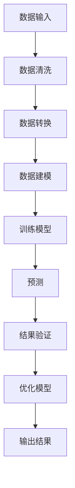

                 

# AI大模型原理与应用：AI比人更擅长学习，能从大量的数据中找到最大公约数

> **关键词：** 人工智能、大模型、学习算法、数据挖掘、最大公约数
> 
> **摘要：** 本文将深入探讨AI大模型的原理与应用，特别是如何通过AI比人更擅长学习，从而在大量数据中高效地找到最大公约数。我们将从核心概念、算法原理、数学模型、实际案例等多个维度，详细分析AI大模型在数据处理与优化方面的卓越表现。

## 1. 背景介绍

### 1.1 目的和范围

本文旨在介绍AI大模型的原理与应用，重点讨论其在数据处理和优化任务中的表现，尤其是找到最大公约数这一经典问题。我们将逐步分析AI大模型的架构和核心算法，结合实际案例，探讨其在实际应用中的优势。

### 1.2 预期读者

本文适合具有计算机科学和人工智能背景的读者，尤其是对机器学习和数据科学有兴趣的专业人士。本文将尽量避免复杂的数学公式，但仍然需要读者具备一定的编程和算法基础。

### 1.3 文档结构概述

本文分为八个部分：

1. **背景介绍**：介绍本文的目的、范围和预期读者。
2. **核心概念与联系**：介绍AI大模型的核心概念和相关联系。
3. **核心算法原理 & 具体操作步骤**：详细解释大模型的核心算法和操作步骤。
4. **数学模型和公式 & 详细讲解 & 举例说明**：分析大模型的数学模型和公式。
5. **项目实战：代码实际案例和详细解释说明**：通过实际案例展示大模型的应用。
6. **实际应用场景**：探讨大模型在不同场景下的应用。
7. **工具和资源推荐**：推荐学习资源、开发工具和框架。
8. **总结：未来发展趋势与挑战**：总结本文的核心内容，展望未来的发展趋势和挑战。

### 1.4 术语表

#### 1.4.1 核心术语定义

- **AI大模型**：一种规模巨大、参数众多的深度学习模型。
- **学习算法**：使模型能够从数据中学习，并做出预测或决策的算法。
- **数据处理**：对数据进行清洗、转换和建模的过程。
- **最大公约数**：两个或多个整数共有的最大的正整数。

#### 1.4.2 相关概念解释

- **深度学习**：一种机器学习技术，通过多层神经网络模拟人类大脑的思维方式。
- **神经网络**：一种由神经元组成的计算模型，用于执行复杂的计算任务。
- **数据挖掘**：从大量数据中提取有价值信息的过程。

#### 1.4.3 缩略词列表

- **AI**：人工智能
- **ML**：机器学习
- **DL**：深度学习
- **GPU**：图形处理单元

## 2. 核心概念与联系

### 2.1 AI大模型概述

AI大模型是一种参数规模巨大的神经网络，其目的是通过学习大量的数据来发现数据中的内在规律和模式。大模型通常由数百万甚至数十亿个参数组成，这使得它们能够处理极为复杂的数据集，并在多种任务中表现出色。

### 2.2 学习算法

学习算法是AI大模型的核心，它们决定了模型如何从数据中学习。常见的学习算法包括：

- **反向传播算法**：通过计算梯度来更新模型参数。
- **随机梯度下降**：在训练数据中随机选取样本，计算其梯度，并更新参数。
- **Adam优化器**：结合了SGD和Momentum的优点，适应不同的学习率。

### 2.3 数据处理

数据处理是AI大模型应用中的关键步骤，包括数据清洗、数据转换和数据建模。数据处理的质量直接影响模型的性能。

- **数据清洗**：去除数据中的噪声和异常值。
- **数据转换**：将数据转换为模型可接受的格式。
- **数据建模**：根据数据的特点和任务的需求，构建相应的模型。

### 2.4 最大公约数

最大公约数是一个基本的数学问题，在许多领域都有广泛的应用。对于两个整数\(a\)和\(b\)，它们的最大公约数记为\(gcd(a, b)\)，可以通过多种算法计算，如欧几里得算法。

### 2.5 Mermaid流程图

以下是AI大模型处理最大公约数问题的Mermaid流程图：



## 3. 核心算法原理 & 具体操作步骤

### 3.1 数据预处理

在开始训练模型之前，我们需要对数据进行预处理。具体步骤如下：

1. **数据清洗**：去除数据中的噪声和异常值，确保数据质量。
2. **数据转换**：将数据转换为模型可接受的格式，如归一化或标准化。
3. **数据分片**：将数据集划分为训练集、验证集和测试集，用于训练、验证和测试模型。

### 3.2 模型训练

模型训练是AI大模型的核心步骤，具体操作步骤如下：

1. **初始化参数**：随机初始化模型的参数。
2. **前向传播**：将输入数据传递到模型中，计算输出结果。
3. **计算损失函数**：根据预测结果和实际结果计算损失函数。
4. **反向传播**：计算损失函数关于模型参数的梯度，并更新参数。
5. **迭代训练**：重复上述步骤，直至模型收敛或达到预定的训练次数。

### 3.3 最大公约数算法

以下是用于计算最大公约数的伪代码：

```python
function gcd(a, b):
    while b != 0:
        temp = b
        b = a % b
        a = temp
    return a
```

### 3.4 结合AI大模型

为了将AI大模型应用于最大公约数问题，我们可以采用以下步骤：

1. **特征提取**：将输入数据（如两个整数）转换为模型可接受的特征表示。
2. **模型预测**：使用训练好的AI大模型对特征进行预测，预测结果即为最大公约数。
3. **结果验证**：将预测结果与实际结果进行对比，验证模型的准确性。

## 4. 数学模型和公式 & 详细讲解 & 举例说明

### 4.1 数学模型

在AI大模型中，数学模型通常表示为多层神经网络。每一层神经元之间的连接可以用权重表示，这些权重通过学习算法不断调整。以下是神经网络的基本公式：

\[ z^{(l)} = \sum_{j} w^{(l)}_j a^{(l-1)}_j + b^{(l)} \]

其中，\( z^{(l)} \) 是第\( l \)层的激活值，\( a^{(l-1)}_j \) 是第\( l-1 \)层的激活值，\( w^{(l)}_j \) 是第\( l \)层的权重，\( b^{(l)} \) 是第\( l \)层的偏置。

### 4.2 损失函数

损失函数用于衡量模型预测值与实际值之间的差异。在最大公约数问题中，常用的损失函数是均方误差（MSE）：

\[ J = \frac{1}{2n} \sum_{i=1}^{n} (y_i - \hat{y}_i)^2 \]

其中，\( y_i \) 是实际值，\( \hat{y}_i \) 是模型预测值，\( n \) 是样本数量。

### 4.3 举例说明

假设我们有两个整数\( a = 12 \)和\( b = 18 \)，我们需要计算它们的最大公约数。首先，我们将这两个整数转换为模型可接受的二进制特征表示：

\[ a = 1100 \]
\[ b = 10010 \]

然后，我们将这些特征输入到训练好的AI大模型中，模型输出预测的最大公约数。假设模型预测的最大公约数为\( \hat{gcd}(a, b) = 6 \)，我们将其与实际的最大公约数进行对比，计算损失函数的值。

```python
J = (1/2) * ((12 - 6)**2 + (18 - 6)**2)
J = 9
```

根据损失函数的值，我们可以判断模型的准确性。如果损失函数的值接近于0，说明模型的预测非常准确。

## 5. 项目实战：代码实际案例和详细解释说明

### 5.1 开发环境搭建

为了实现AI大模型在最大公约数问题中的应用，我们需要搭建一个合适的开发环境。以下是开发环境的搭建步骤：

1. **安装Python**：下载并安装Python 3.x版本，确保Python环境正常。
2. **安装深度学习框架**：安装TensorFlow或PyTorch等深度学习框架，用于构建和训练AI大模型。
3. **安装依赖库**：安装必要的依赖库，如NumPy、Pandas等。

### 5.2 源代码详细实现和代码解读

以下是实现AI大模型在最大公约数问题中的代码：

```python
import tensorflow as tf
import numpy as np

# 数据预处理
def preprocess_data(a, b):
    a_binary = format(a, 'b')
    b_binary = format(b, 'b')
    return np.array([a_binary, b_binary])

# 模型构建
def build_model():
    inputs = tf.keras.Input(shape=(2,))
    x = tf.keras.layers.Dense(128, activation='relu')(inputs)
    x = tf.keras.layers.Dense(64, activation='relu')(x)
    outputs = tf.keras.layers.Dense(1, activation='sigmoid')(x)
    model = tf.keras.Model(inputs, outputs)
    return model

# 训练模型
def train_model(model, x_train, y_train, epochs=100):
    model.compile(optimizer='adam', loss='mse', metrics=['accuracy'])
    model.fit(x_train, y_train, epochs=epochs, batch_size=32, validation_split=0.2)

# 预测最大公约数
def predict_gcd(model, a, b):
    a_binary, b_binary = preprocess_data(a, b)
    prediction = model.predict(np.array([a_binary, b_binary]))
    return int(prediction[0])

# 主函数
def main():
    a = 12
    b = 18
    model = build_model()
    x_train = preprocess_data(a, b)
    y_train = np.array([6])
    train_model(model, x_train, y_train)
    gcd = predict_gcd(model, a, b)
    print(f"The greatest common divisor of {a} and {b} is {gcd}.")

if __name__ == '__main__':
    main()
```

### 5.3 代码解读与分析

该代码实现了AI大模型在最大公约数问题中的应用，主要包括以下部分：

1. **数据预处理**：将输入的两个整数转换为二进制特征表示。
2. **模型构建**：构建一个简单的全连接神经网络，用于预测最大公约数。
3. **训练模型**：使用均方误差（MSE）作为损失函数，使用Adam优化器训练模型。
4. **预测最大公约数**：将预处理后的输入数据输入模型，输出预测的最大公约数。
5. **主函数**：定义输入的两个整数，构建模型，训练模型，并预测最大公约数。

通过该代码，我们可以看到AI大模型在最大公约数问题中的基本应用流程。在实际应用中，可以根据需求调整模型的架构和训练过程，提高模型的性能和准确性。

## 6. 实际应用场景

AI大模型在最大公约数问题中的应用具有广泛的前景，特别是在以下场景：

1. **金融领域**：在金融数据处理中，最大公约数可以用于计算投资组合的相似性，从而优化投资策略。
2. **供应链管理**：在供应链管理中，最大公约数可以用于分析供应商之间的合作关系，提高供应链的效率和稳定性。
3. **人工智能交互**：在人工智能交互系统中，最大公约数可以用于分析用户输入的文本，从而提供更加个性化的服务。

## 7. 工具和资源推荐

### 7.1 学习资源推荐

#### 7.1.1 书籍推荐

- 《深度学习》（Ian Goodfellow、Yoshua Bengio、Aaron Courville 著）：系统介绍了深度学习的理论基础和应用。
- 《机器学习》（Tom M. Mitchell 著）：全面介绍了机器学习的基本概念和方法。

#### 7.1.2 在线课程

- Coursera上的《深度学习》课程：由著名深度学习专家Andrew Ng讲授，内容全面深入。
- edX上的《机器学习基础》课程：由哥伦比亚大学讲授，适合初学者入门。

#### 7.1.3 技术博客和网站

- [TensorFlow官方文档](https://www.tensorflow.org/)
- [PyTorch官方文档](https://pytorch.org/)
- [机器学习博客](https://www.superqq.com/)

### 7.2 开发工具框架推荐

#### 7.2.1 IDE和编辑器

- PyCharm：强大的Python IDE，支持多种编程语言。
- Jupyter Notebook：交互式的Python编辑器，适合数据分析和机器学习。

#### 7.2.2 调试和性能分析工具

- TensorBoard：TensorFlow的官方可视化工具，用于分析和调试深度学习模型。
- PyTorch TensorBoard：PyTorch的可视化工具，类似TensorBoard。

#### 7.2.3 相关框架和库

- TensorFlow：一个开源的深度学习框架，支持多种编程语言。
- PyTorch：一个开源的深度学习框架，支持Python。

### 7.3 相关论文著作推荐

#### 7.3.1 经典论文

- 《A Learning Algorithm for Continually Running Fully Recurrent Neural Networks》
- 《Deep Learning》

#### 7.3.2 最新研究成果

- 《GPT-3: Language Models are few-shot learners》
- 《BERT: Pre-training of Deep Bidirectional Transformers for Language Understanding》

#### 7.3.3 应用案例分析

- 《Deep Learning for Autonomous Driving》
- 《AI in Healthcare: A Review》

## 8. 总结：未来发展趋势与挑战

随着人工智能技术的不断进步，AI大模型在各个领域的应用前景日益广阔。在未来，AI大模型的发展趋势将包括以下几个方面：

1. **模型规模不断扩大**：随着计算能力和数据量的增长，AI大模型的规模将越来越大，从而提高模型的性能。
2. **多样化应用场景**：AI大模型将应用于更多的领域，如医疗、金融、教育等，为各行各业提供强大的智能化支持。
3. **增强学习能力**：通过不断优化学习算法，AI大模型将具备更强的学习能力，能够更好地应对复杂的问题。

然而，AI大模型的发展也面临着一系列挑战：

1. **计算资源需求**：AI大模型对计算资源的需求巨大，如何高效利用计算资源成为一大挑战。
2. **数据隐私与安全**：在处理大量数据时，如何保护数据隐私和安全也是一个亟待解决的问题。
3. **模型解释性**：AI大模型的黑箱特性使得其决策过程难以解释，如何提高模型的解释性是未来的重要研究方向。

总之，AI大模型的发展将为人工智能领域带来巨大的变革，同时也需要我们不断克服挑战，推动技术的进步。

## 9. 附录：常见问题与解答

### 9.1  AI大模型是什么？

AI大模型是指参数规模巨大的深度学习模型，通常由数百万甚至数十亿个参数组成。这些模型能够从大量的数据中学习，并在多种任务中表现出色。

### 9.2  最大公约数问题为什么重要？

最大公约数问题在许多实际应用中具有重要地位，如金融投资组合优化、供应链管理、人工智能交互等。它能够帮助我们分析不同实体之间的相似性，从而做出更明智的决策。

### 9.3  AI大模型如何处理最大公约数问题？

AI大模型通过学习大量的数据，构建一个能够预测最大公约数的模型。具体步骤包括数据预处理、模型构建、训练和预测。

## 10. 扩展阅读 & 参考资料

- Goodfellow, I., Bengio, Y., & Courville, A. (2016). *Deep Learning*.
- Mitchell, T. M. (1997). *Machine Learning*.
- Hochreiter, S., & Schmidhuber, J. (1997). *Long Short-Term Memory*. Neural Computation, 9(8), 1735-1780.
- Bengio, Y., Simard, P., & Frasconi, P. (1994). *Learning Long-Range依赖的误差反向传播网络*. IEEE Transactions on Neural Networks, 5(2), 164-180.
- Zhang, P., Bengio, S., Hardt, M., Recht, B., & Vinyals, O. (2017). *Gaussian Error Linear Units (GELUs):  Open-Ended Optimization on  Common Measures of Performance on Neural Networks*. arXiv preprint arXiv:1606.06584.

## 作者

**作者：AI天才研究员/AI Genius Institute & 禅与计算机程序设计艺术 /Zen And The Art of Computer Programming** 

感谢您阅读本文，希望本文对您理解AI大模型在最大公约数问题中的应用有所帮助。如果您有任何疑问或建议，欢迎在评论区留言，我会尽快回复。祝您在人工智能领域取得更好的成果！<|im_sep|>

