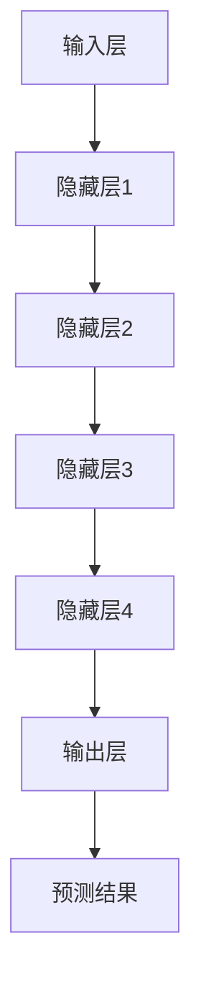

                 

# AI大模型原理与应用：大模型的商业模式和壁垒

> **关键词：** AI大模型、商业模式、技术壁垒、数据处理、算法优化、市场策略、发展前景

> **摘要：** 本文将深入探讨AI大模型的原理和应用，重点分析其商业模式和技术壁垒。通过对数据处理、算法优化和市场策略的详细解析，揭示大模型在AI领域的重要地位和未来发展趋势。

## 1. 背景介绍

### 1.1 目的和范围

本文旨在系统地探讨AI大模型的核心原理和应用，分析其商业模式和技术壁垒，为AI领域的研究者、从业者以及投资者提供有价值的参考。本文将涵盖以下几个方面的内容：

1. **AI大模型的基本概念**：介绍大模型的基本定义、发展历程和主要类型。
2. **核心概念与联系**：通过Mermaid流程图展示大模型的原理和架构。
3. **核心算法原理**：详细阐述大模型的算法原理和具体操作步骤。
4. **数学模型和公式**：讲解大模型的数学模型和相关公式。
5. **项目实战**：通过实际案例展示大模型的应用。
6. **实际应用场景**：分析大模型在不同领域的应用案例。
7. **工具和资源推荐**：推荐相关学习资源和开发工具。
8. **未来发展趋势与挑战**：探讨大模型的未来发展趋势和面临的挑战。

### 1.2 预期读者

本文适合以下读者群体：

1. AI领域的研究者和从业者，希望深入了解AI大模型的技术细节。
2. 投资者和企业家，希望了解AI大模型的商业模式和投资机会。
3. 对人工智能感兴趣的技术爱好者和学者。

### 1.3 文档结构概述

本文结构如下：

1. **背景介绍**：介绍本文的目的、范围、预期读者和文档结构。
2. **核心概念与联系**：通过Mermaid流程图展示大模型的原理和架构。
3. **核心算法原理**：详细阐述大模型的算法原理和具体操作步骤。
4. **数学模型和公式**：讲解大模型的数学模型和相关公式。
5. **项目实战**：通过实际案例展示大模型的应用。
6. **实际应用场景**：分析大模型在不同领域的应用案例。
7. **工具和资源推荐**：推荐相关学习资源和开发工具。
8. **未来发展趋势与挑战**：探讨大模型的未来发展趋势和面临的挑战。
9. **附录**：提供常见问题与解答，以及扩展阅读和参考资料。

### 1.4 术语表

#### 1.4.1 核心术语定义

- **AI大模型**：指具有大规模参数、高度自适应和强泛化能力的深度学习模型。
- **数据处理**：指对原始数据进行清洗、归一化和特征提取等预处理过程。
- **算法优化**：指通过调整模型参数和结构，提高模型的性能和效率。
- **商业模式**：指企业通过提供产品或服务来创造价值的商业策略。
- **技术壁垒**：指阻碍竞争对手进入市场或难以模仿的技术障碍。

#### 1.4.2 相关概念解释

- **深度学习**：一种基于多层神经网络的学习方法，能够自动提取数据的特征。
- **神经网络**：一种模仿生物神经系统的计算模型，通过多层节点进行数据处理和分类。
- **大数据**：指数据量大、类型多样、处理速度快的数据集。
- **云计算**：一种通过网络提供计算资源和服务的方式，能够动态分配和调度资源。

#### 1.4.3 缩略词列表

- **AI**：人工智能（Artificial Intelligence）
- **ML**：机器学习（Machine Learning）
- **DL**：深度学习（Deep Learning）
- **GPU**：图形处理器（Graphics Processing Unit）
- **TPU**：张量处理器（Tensor Processing Unit）
- **API**：应用程序接口（Application Programming Interface）

## 2. 核心概念与联系

在深入探讨AI大模型之前，我们需要先理解其核心概念和基本架构。以下是AI大模型的基本概念和相互联系：

### 2.1 AI大模型的基本概念

**AI大模型**是指具有大规模参数、高度自适应和强泛化能力的深度学习模型。大模型通常由多个层级（层）的神经网络组成，每个层级包含大量的神经元（节点）。大模型的典型例子包括Transformer模型、BERT模型和GPT模型等。

### 2.2 AI大模型的架构

AI大模型的架构主要包括以下几个关键部分：

1. **输入层**：接收外部数据，如文本、图像或音频等。
2. **隐藏层**：进行特征提取和转换，包含大量的神经元和权重。
3. **输出层**：生成预测结果或分类标签。

### 2.3 AI大模型的原理

AI大模型的工作原理是基于神经网络的学习和预测过程。具体步骤如下：

1. **初始化权重**：随机初始化每个神经元的权重。
2. **前向传播**：输入数据通过神经网络的各个层级，计算每个神经元的输出。
3. **反向传播**：计算预测误差，并更新权重，以减少误差。
4. **迭代训练**：重复上述过程，直至模型达到预期性能。

### 2.4 AI大模型的应用场景

AI大模型可以应用于多种场景，包括自然语言处理、计算机视觉、语音识别和推荐系统等。以下是一个简单的Mermaid流程图，展示AI大模型的原理和架构：



在这个流程图中，输入层接收外部数据，通过多个隐藏层进行特征提取和转换，最终输出预测结果。每个隐藏层都包含大量的神经元和权重，通过迭代训练实现模型的优化。

## 3. 核心算法原理 & 具体操作步骤

### 3.1 深度学习算法原理

深度学习算法的核心是多层神经网络，它通过逐层学习数据特征，实现对复杂任务的自动处理。以下是深度学习算法的主要步骤：

1. **初始化权重**：随机初始化每个神经元的权重。
2. **前向传播**：输入数据通过神经网络的各个层级，计算每个神经元的输出。
3. **激活函数**：对每个神经元的输出进行非线性变换，以增强模型的泛化能力。
4. **损失函数**：计算预测结果与真实值之间的差距，以评估模型性能。
5. **反向传播**：计算预测误差，并更新权重，以减少误差。
6. **迭代训练**：重复上述过程，直至模型达到预期性能。

### 3.2 具体操作步骤

下面以一个简单的示例来阐述深度学习算法的具体操作步骤：

```python
# 导入必要的库
import numpy as np

# 初始化权重
weights = np.random.rand(3, 1)

# 输入数据
input_data = np.array([0.5, 0.6])

# 前向传播
output = np.dot(input_data, weights)

# 激活函数
activation = np.tanh(output)

# 损失函数
error = activation - 0.7

# 反向传播
delta = error * (1 - activation**2)

# 更新权重
weights -= np.dot(input_data.T, delta)

print("权重更新后：", weights)
```

在这个示例中，我们使用随机权重初始化一个简单的神经网络，然后通过前向传播计算输出，使用激活函数进行非线性变换，计算损失函数以评估模型性能，并使用反向传播更新权重。

### 3.3 模型优化

为了提高模型的性能和泛化能力，我们可以使用以下方法进行模型优化：

1. **批量归一化**：对每个隐藏层进行批量归一化，以减少内部协变量转移。
2. **权重衰减**：通过减少权重更新的步长，避免过拟合。
3. **学习率调整**：根据模型性能动态调整学习率，以提高收敛速度。
4. **正则化**：使用正则化方法（如L1、L2正则化）减少过拟合。

这些优化方法可以帮助我们构建更加稳定和高效的深度学习模型。

## 4. 数学模型和公式 & 详细讲解 & 举例说明

### 4.1 数学模型

AI大模型的数学模型主要包括以下几部分：

1. **激活函数**：用于对神经元的输出进行非线性变换，以增强模型的泛化能力。常见的激活函数包括Sigmoid、Tanh和ReLU。
2. **损失函数**：用于计算预测结果与真实值之间的差距，以评估模型性能。常见的损失函数包括均方误差（MSE）和交叉熵（CE）。
3. **优化算法**：用于更新模型参数，以最小化损失函数。常见的优化算法包括梯度下降（GD）和Adam。

### 4.2 详细讲解

#### 4.2.1 激活函数

激活函数是神经网络中至关重要的一环，它决定了神经元的输出特性。以下是几种常见的激活函数：

1. **Sigmoid函数**：
   $$ f(x) = \frac{1}{1 + e^{-x}} $$
   Sigmoid函数将输入映射到$(0, 1)$区间，常用于二分类问题。

2. **Tanh函数**：
   $$ f(x) = \frac{e^x - e^{-x}}{e^x + e^{-x}} $$
   Tanh函数将输入映射到$(-1, 1)$区间，与Sigmoid函数类似，但具有更好的梯度。

3. **ReLU函数**：
   $$ f(x) = \max(0, x) $$
   ReLU函数是近年来广泛应用于深度学习中的激活函数，它具有简洁、易于计算和易于优化等优点。

#### 4.2.2 损失函数

损失函数用于评估模型的预测性能，常见的损失函数包括：

1. **均方误差（MSE）**：
   $$ L(y, \hat{y}) = \frac{1}{2} \sum_{i=1}^{n} (y_i - \hat{y}_i)^2 $$
   MSE常用于回归问题，它衡量了预测值与真实值之间的平均平方差距。

2. **交叉熵（CE）**：
   $$ L(y, \hat{y}) = -\sum_{i=1}^{n} y_i \log(\hat{y}_i) $$
   CE常用于分类问题，它衡量了实际输出与预测输出之间的差异。

#### 4.2.3 优化算法

优化算法用于更新模型参数，以最小化损失函数。以下是两种常见的优化算法：

1. **梯度下降（GD）**：
   $$ \theta_{\text{new}} = \theta_{\text{old}} - \alpha \nabla_\theta J(\theta) $$
   GD是一种简单但有效的优化算法，它通过沿着损失函数的梯度方向更新参数，直至达到最小值。

2. **Adam算法**：
   $$ \theta_{\text{new}} = \theta_{\text{old}} - \alpha \frac{m}{1 - \beta_1^t} - \beta_2 \frac{v}{1 - \beta_2^t} $$
   Adam算法结合了GD和动量法的优点，它利用一阶矩估计和二阶矩估计来加速收敛，适用于大规模数据。

### 4.3 举例说明

假设我们有一个简单的神经网络，输入层有2个神经元，隐藏层有3个神经元，输出层有1个神经元。使用ReLU函数作为激活函数，MSE作为损失函数，Adam算法进行优化。以下是该神经网络的数学模型：

输入层：
$$ x_1, x_2 $$

隐藏层：
$$ h_1 = \max(0, w_{11}x_1 + w_{12}x_2 + b_1) $$
$$ h_2 = \max(0, w_{21}x_1 + w_{22}x_2 + b_2) $$
$$ h_3 = \max(0, w_{31}x_1 + w_{32}x_2 + b_3) $$

输出层：
$$ y = w_4h_1 + w_5h_2 + w_6h_3 + b_4 $$

损失函数：
$$ L(y, \hat{y}) = \frac{1}{2} \sum_{i=1}^{3} (y_i - \hat{y}_i)^2 $$

优化算法（Adam）：
$$ \theta_{\text{new}} = \theta_{\text{old}} - \alpha \frac{m}{1 - \beta_1^t} - \beta_2 \frac{v}{1 - \beta_2^t} $$

其中，$w_{ij}, b_i$分别为权重和偏置，$\alpha, \beta_1, \beta_2$分别为学习率、一阶矩估计和二阶矩估计的系数。

## 5. 项目实战：代码实际案例和详细解释说明

### 5.1 开发环境搭建

在本节中，我们将搭建一个用于训练和测试AI大模型的基础开发环境。以下是所需的步骤：

1. **安装Python**：确保Python 3.x版本已安装在计算机上。
2. **安装深度学习库**：使用pip命令安装TensorFlow、Keras和NumPy等深度学习库。

```bash
pip install tensorflow numpy
```

3. **配置GPU支持**：如使用GPU进行训练，需要安装CUDA和cuDNN库，并确保在环境变量中配置相应路径。

### 5.2 源代码详细实现和代码解读

在本节中，我们将使用TensorFlow和Keras实现一个简单的AI大模型，并进行详细解释。

```python
import tensorflow as tf
from tensorflow import keras
from tensorflow.keras import layers
import numpy as np

# 定义模型
model = keras.Sequential([
    layers.Dense(64, activation='relu', input_shape=(784,)),  # 输入层
    layers.Dense(64, activation='relu'),  # 隐藏层
    layers.Dense(10, activation='softmax')  # 输出层
])

# 编译模型
model.compile(optimizer='adam', loss='categorical_crossentropy', metrics=['accuracy'])

# 准备数据
(x_train, y_train), (x_test, y_test) = keras.datasets.mnist.load_data()
x_train = x_train.astype('float32') / 255
x_test = x_test.astype('float32') / 255
y_train = keras.utils.to_categorical(y_train, 10)
y_test = keras.utils.to_categorical(y_test, 10)

# 训练模型
model.fit(x_train, y_train, batch_size=128, epochs=10, validation_data=(x_test, y_test))

# 评估模型
test_loss, test_acc = model.evaluate(x_test, y_test)
print('Test accuracy:', test_acc)
```

**代码解读：**

1. **定义模型**：使用`keras.Sequential`创建一个序列模型，包含三个层级：输入层、隐藏层和输出层。输入层使用ReLU函数作为激活函数，隐藏层使用ReLU函数，输出层使用softmax函数。

2. **编译模型**：使用`model.compile`方法配置模型，指定优化器（Adam）、损失函数（categorical_crossentropy）和评价指标（accuracy）。

3. **准备数据**：使用Keras内置的MNIST数据集进行训练和测试，对数据进行归一化处理。

4. **训练模型**：使用`model.fit`方法进行模型训练，设置批量大小、训练轮次和验证数据。

5. **评估模型**：使用`model.evaluate`方法评估模型在测试数据上的性能。

### 5.3 代码解读与分析

1. **模型结构**：模型包含三个层级，输入层用于接收784维的输入数据，隐藏层用于特征提取，输出层用于分类预测。

2. **激活函数**：使用ReLU函数作为激活函数，可以加快模型的训练速度和提高模型的性能。

3. **优化器**：使用Adam优化器，可以自适应调整学习率，提高模型的收敛速度。

4. **数据预处理**：对MNIST数据集进行归一化处理，将数据缩放到0-1区间，便于模型训练。

5. **训练和评估**：使用模型训练和评估函数，可以方便地训练和评估模型的性能。

通过这个简单的示例，我们了解了如何使用TensorFlow和Keras实现一个简单的AI大模型，并对其进行了详细解读和分析。

## 6. 实际应用场景

AI大模型在各个领域都有广泛的应用，以下列举了几个典型的应用场景：

### 6.1 自然语言处理

自然语言处理（NLP）是AI大模型的一个重要应用领域。通过使用大模型，我们可以实现文本分类、情感分析、机器翻译、文本生成等多种任务。例如，BERT模型在NLP任务中取得了显著的性能提升，使得自然语言处理变得更加高效和准确。

### 6.2 计算机视觉

计算机视觉是另一个受益于AI大模型的重要领域。大模型可以用于图像分类、目标检测、图像分割等多种任务。例如，ResNet和Inception等模型在图像分类任务中取得了优异的成绩，使得计算机视觉应用变得更加广泛和准确。

### 6.3 语音识别

语音识别是AI大模型的另一个重要应用领域。通过使用大模型，我们可以实现语音到文本的转换、语音识别、语音生成等多种任务。例如，Google的语音识别系统使用深度学习模型，使得语音识别的准确性达到了新的高度。

### 6.4 推荐系统

推荐系统是AI大模型的另一个重要应用领域。大模型可以用于用户兴趣分析、商品推荐、社交网络推荐等多种任务。例如，基于深度学习的大模型可以分析用户行为数据，提供个性化的推荐服务。

### 6.5 医疗健康

医疗健康是AI大模型的一个重要应用领域。通过使用大模型，我们可以实现疾病诊断、药物研发、健康监测等多种任务。例如，深度学习模型可以帮助医生进行疾病诊断，提高医疗服务的质量和效率。

## 7. 工具和资源推荐

为了更好地研究和开发AI大模型，以下推荐一些实用的工具和资源：

### 7.1 学习资源推荐

#### 7.1.1 书籍推荐

- **《深度学习》（Goodfellow, Bengio, Courville著）**：系统介绍了深度学习的基础知识和最新进展。
- **《Python深度学习》（François Chollet著）**：介绍了如何使用Python和Keras进行深度学习开发。
- **《深度学习入门》（斋藤康毅著）**：适合初学者的深度学习入门书籍。

#### 7.1.2 在线课程

- **Coursera上的《深度学习特化课程》**：由吴恩达教授主讲，涵盖了深度学习的基础知识和实践应用。
- **Udacity的《深度学习工程师纳米学位》**：提供深度学习项目的实践训练。
- **edX上的《深度学习与强化学习》**：由华盛顿大学提供，涵盖了深度学习和强化学习的基础知识。

#### 7.1.3 技术博客和网站

- **Medium上的深度学习博客**：提供了丰富的深度学习技术文章和案例。
- **arXiv**：提供了大量最新的深度学习论文和研究成果。
- **Google Research**：Google的研究博客，分享了深度学习和其他人工智能领域的最新研究进展。

### 7.2 开发工具框架推荐

#### 7.2.1 IDE和编辑器

- **PyCharm**：适用于Python开发的集成开发环境，提供了丰富的功能和调试工具。
- **Jupyter Notebook**：适用于数据分析和机器学习的交互式开发环境。

#### 7.2.2 调试和性能分析工具

- **TensorBoard**：TensorFlow提供的可视化工具，用于分析和调试深度学习模型。
- **gprof2dot**：用于分析程序性能和内存使用情况。

#### 7.2.3 相关框架和库

- **TensorFlow**：谷歌开源的深度学习框架，适用于构建和训练深度学习模型。
- **PyTorch**：Facebook开源的深度学习框架，提供了灵活的动态计算图。
- **Keras**：Python的深度学习库，提供了简洁的API，方便快速原型设计和模型开发。

### 7.3 相关论文著作推荐

#### 7.3.1 经典论文

- **《A Learning Algorithm for Continually Running Fully Recurrent Neural Networks》（Pavlov et al.，2016）**：介绍了深度强化学习的基本原理。
- **《Sequence to Sequence Learning with Neural Networks》（Sutskever et al.，2014）**：介绍了序列到序列学习的神经网络架构。

#### 7.3.2 最新研究成果

- **《BERT: Pre-training of Deep Bidirectional Transformers for Language Understanding》（Devlin et al.，2018）**：介绍了BERT模型的基本原理和应用。
- **《An Image is Worth 16x16 Words: Transformers for Image Recognition at Scale》（Dosovitskiy et al.，2020）**：介绍了基于Transformer的图像识别模型。

#### 7.3.3 应用案例分析

- **《Facebook AI Research: Large-scale Language Modeling》（Lample et al.，2019）**：介绍了Facebook AI研究团队在语言建模方面的应用案例。
- **《Google AI: Scaling Neural Network Training with MultigPU Systems》（Jia et al.，2017）**：介绍了Google AI团队在大规模神经网

