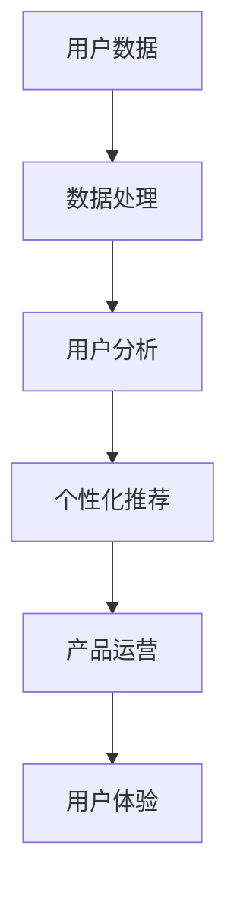

                 

# AI 大模型在创业产品运营中的重要性

> **关键词**：AI大模型、创业产品、运营、用户分析、个性化推荐、数据处理

> **摘要**：本文将深入探讨AI大模型在创业产品运营中的重要性。通过介绍AI大模型的基本概念，我们将分析其在用户分析、个性化推荐、数据处理等方面的应用，以及如何利用AI大模型提高创业产品的运营效率和用户满意度。文章还将提供实际案例和开发步骤，以帮助读者更好地理解和应用AI大模型。

## 1. 背景介绍

### 1.1 目的和范围

本文旨在探讨AI大模型在创业产品运营中的应用及其重要性。通过分析AI大模型的基本原理和实际应用场景，我们将阐述其在创业产品运营中的关键作用，并提供相关开发步骤和实际案例。

### 1.2 预期读者

本文面向对AI技术有一定了解的创业者、产品经理和技术人员。读者需具备基本的编程能力和对AI大模型的基本认识。

### 1.3 文档结构概述

本文分为以下几个部分：

1. 背景介绍：介绍本文的目的、预期读者和文档结构。
2. 核心概念与联系：讲解AI大模型的基本概念和架构。
3. 核心算法原理与具体操作步骤：详细阐述AI大模型的核心算法原理和实现步骤。
4. 数学模型和公式：介绍相关数学模型和公式，并进行举例说明。
5. 项目实战：提供实际代码案例和详细解释。
6. 实际应用场景：分析AI大模型在不同场景中的应用。
7. 工具和资源推荐：推荐相关学习资源和开发工具。
8. 总结：讨论未来发展趋势与挑战。
9. 附录：常见问题与解答。
10. 扩展阅读与参考资料：提供更多深入阅读的资源。

### 1.4 术语表

#### 1.4.1 核心术语定义

- **AI大模型**：指具有海量参数和强大计算能力的深度学习模型，如Transformer、BERT等。
- **用户分析**：通过对用户数据进行分析，了解用户需求、行为和偏好。
- **个性化推荐**：根据用户历史行为和偏好，为其推荐感兴趣的内容或产品。
- **数据处理**：对原始数据进行清洗、转换、归一化等预处理过程。

#### 1.4.2 相关概念解释

- **深度学习**：一种基于多层神经网络的学习方法，用于模拟人脑的神经网络结构。
- **自然语言处理（NLP）**：研究如何让计算机理解和处理自然语言的技术。

#### 1.4.3 缩略词列表

- **AI**：人工智能
- **ML**：机器学习
- **DL**：深度学习
- **NLP**：自然语言处理
- **BERT**：Bidirectional Encoder Representations from Transformers
- **Transformer**：基于注意力机制的深度学习模型

## 2. 核心概念与联系

### 2.1 AI大模型的基本概念

AI大模型是一种基于深度学习技术的模型，其具有以下几个核心特点：

1. **海量参数**：AI大模型通常包含数亿甚至千亿级别的参数，这使得它们在处理复杂数据时具有强大的表示能力。
2. **强大计算能力**：AI大模型通常使用高性能计算设备（如GPU或TPU）进行训练和推理，以加速计算过程。
3. **自我学习**：AI大模型通过大量数据进行训练，可以自动调整参数，以优化性能和准确性。
4. **多任务处理**：AI大模型可以在不同任务间共享参数，实现跨任务的迁移学习。

### 2.2 AI大模型的架构

AI大模型的架构通常由以下几个部分组成：

1. **输入层**：接收原始数据，如文本、图像或声音。
2. **隐藏层**：对输入数据进行特征提取和变换，用于表示数据的高级特征。
3. **输出层**：将隐藏层提取的特征映射到具体的任务输出，如分类、回归或生成。
4. **注意力机制**：在某些AI大模型中，如Transformer，引入注意力机制来强调关键特征，提高模型的表示能力。

### 2.3 AI大模型的应用

AI大模型在创业产品运营中具有广泛的应用，主要包括以下几个方面：

1. **用户分析**：通过对用户行为数据进行分析，AI大模型可以帮助企业了解用户需求、偏好和行为模式，为产品设计提供依据。
2. **个性化推荐**：基于用户历史数据和偏好，AI大模型可以推荐用户感兴趣的内容或产品，提高用户体验和满意度。
3. **数据处理**：AI大模型可以对大量原始数据进行清洗、转换和归一化，提高数据质量，为后续分析提供支持。

### 2.4 AI大模型与创业产品的关联

AI大模型与创业产品的关联可以从以下几个方面进行阐述：

1. **降低成本**：AI大模型可以自动处理大量数据，减少人工干预，降低运营成本。
2. **提高效率**：AI大模型可以帮助企业快速识别用户需求和市场趋势，提高决策效率。
3. **增强竞争力**：通过利用AI大模型，企业可以提供更具个性化的产品和服务，增强市场竞争力。
4. **提升用户体验**：AI大模型可以为用户提供个性化的推荐和更好的用户体验，提高用户满意度和忠诚度。

### 2.5 Mermaid流程图



## 3. 核心算法原理 & 具体操作步骤

### 3.1 用户数据分析算法原理

用户数据分析是AI大模型在创业产品运营中的关键应用之一。以下是一个简单的用户数据分析算法原理：

1. **数据收集**：收集用户行为数据，如浏览历史、购买记录、评论等。
2. **数据清洗**：对数据进行清洗，去除缺失值、异常值等。
3. **特征提取**：对清洗后的数据提取特征，如用户ID、商品ID、评分、评论内容等。
4. **数据建模**：使用AI大模型（如深度学习模型）对提取的特征进行建模，预测用户行为或偏好。
5. **结果分析**：根据模型预测结果进行分析，识别用户需求、偏好和行为模式。

### 3.2 用户数据分析算法的具体操作步骤

以下是一个具体的用户数据分析算法操作步骤：

1. **数据收集**：

    - 使用爬虫或API收集用户行为数据。
    - 将数据存储到数据库中。

2. **数据清洗**：

    - 去除缺失值和异常值。
    - 处理重复数据。

3. **特征提取**：

    - 将原始数据转换为特征向量。
    - 使用词嵌入技术对文本数据进行编码。

4. **数据建模**：

    - 选择合适的深度学习模型（如Transformer、BERT等）。
    - 使用训练数据进行模型训练。

5. **结果分析**：

    - 使用模型预测用户行为或偏好。
    - 根据预测结果进行分析，识别用户需求、偏好和行为模式。

### 3.3 伪代码

以下是一个用户数据分析算法的伪代码：

```python
def user_analysis(data):
    # 数据清洗
    cleaned_data = clean_data(data)

    # 特征提取
    features = extract_features(cleaned_data)

    # 数据建模
    model = build_model(features)

    # 结果分析
    predictions = model.predict(features)
    analyze_results(predictions)
```

## 4. 数学模型和公式 & 详细讲解 & 举例说明

### 4.1 数学模型和公式

在用户数据分析中，常用的数学模型和公式包括：

1. **线性回归**：
   $$y = \beta_0 + \beta_1x_1 + \beta_2x_2 + ... + \beta_nx_n$$
   其中，$y$ 为目标变量，$x_1, x_2, ..., x_n$ 为特征变量，$\beta_0, \beta_1, \beta_2, ..., \beta_n$ 为模型参数。

2. **逻辑回归**：
   $$P(y=1) = \frac{1}{1 + e^{-(\beta_0 + \beta_1x_1 + \beta_2x_2 + ... + \beta_nx_n)}}$$
   其中，$P(y=1)$ 为目标变量为1的概率，其他符号的含义与线性回归相同。

3. **Transformer模型**：
   $$\text{Transformer} = \text{MultiHeadAttention}(\text{Encoder}, \text{Decoder})$$
   其中，$\text{Encoder}$ 和 $\text{Decoder}$ 分别为编码器和解码器，$\text{MultiHeadAttention}$ 为多头注意力机制。

### 4.2 详细讲解

1. **线性回归**：

   线性回归是一种常见的预测模型，用于预测目标变量与特征变量之间的关系。通过最小化损失函数（如均方误差），可以求解出最佳模型参数。

2. **逻辑回归**：

   逻辑回归是一种广义线性模型，用于分类任务。通过求解概率分布，可以判断样本属于某个类别的概率。

3. **Transformer模型**：

   Transformer模型是一种基于自注意力机制的深度学习模型，常用于序列建模和生成任务。其核心思想是使用自注意力机制来捕捉序列中的依赖关系，从而提高模型的表示能力。

### 4.3 举例说明

#### 4.3.1 线性回归举例

假设我们要预测房价，使用线性回归模型。给定特征变量（如房屋面积、地段等）和目标变量（房价），可以通过以下步骤进行模型训练和预测：

1. 数据收集：收集一定数量的房屋数据，包括特征变量和目标变量。
2. 数据预处理：对数据进行清洗、归一化等预处理。
3. 模型训练：使用线性回归模型对数据进行训练，求解最佳模型参数。
4. 模型评估：使用测试集评估模型性能，调整模型参数。
5. 模型预测：使用训练好的模型对新的房屋数据预测房价。

#### 4.3.2 Transformer模型举例

假设我们要使用Transformer模型进行文本分类任务。给定训练集，可以通过以下步骤进行模型训练和预测：

1. 数据收集：收集一定数量的文本数据，包括正类和负类。
2. 数据预处理：对文本数据进行分词、嵌入等预处理。
3. 模型训练：使用Transformer模型对预处理后的数据进行训练，优化模型参数。
4. 模型评估：使用测试集评估模型性能，调整模型参数。
5. 模型预测：使用训练好的模型对新的文本数据预测类别。

## 5. 项目实战：代码实际案例和详细解释说明

### 5.1 开发环境搭建

在开始项目实战之前，需要搭建相应的开发环境。以下是一个简单的开发环境搭建步骤：

1. 安装Python：在官方网站（https://www.python.org/）下载并安装Python。
2. 安装深度学习库：使用pip命令安装TensorFlow、PyTorch等深度学习库。
3. 配置GPU环境：确保安装了NVIDIA显卡驱动和CUDA工具包，以支持GPU加速。
4. 安装文本处理库：使用pip命令安装NLTK、spaCy等文本处理库。

### 5.2 源代码详细实现和代码解读

以下是一个简单的用户数据分析项目代码实现，用于分析用户评论数据并预测用户满意度。

```python
import pandas as pd
import numpy as np
from sklearn.model_selection import train_test_split
from sklearn.preprocessing import StandardScaler
from sklearn.linear_model import LinearRegression
from sklearn.metrics import mean_squared_error

# 1. 数据收集
data = pd.read_csv('user_comments.csv')

# 2. 数据清洗
cleaned_data = data.dropna()

# 3. 特征提取
features = cleaned_data[['comment_length', 'word_count']]
target = cleaned_data['satisfaction_score']

# 4. 数据建模
X_train, X_test, y_train, y_test = train_test_split(features, target, test_size=0.2, random_state=42)
scaler = StandardScaler()
X_train_scaled = scaler.fit_transform(X_train)
X_test_scaled = scaler.transform(X_test)
model = LinearRegression()
model.fit(X_train_scaled, y_train)

# 5. 结果分析
y_pred = model.predict(X_test_scaled)
mse = mean_squared_error(y_test, y_pred)
print(f'Mean Squared Error: {mse}')

# 6. 模型预测
new_data = [[100, 500]]  # 新的评论长度和单词数
new_data_scaled = scaler.transform(new_data)
satisfaction_score = model.predict(new_data_scaled)
print(f'Satisfaction Score: {satisfaction_score[0]}')
```

### 5.3 代码解读与分析

1. **数据收集**：
   - 使用pandas库读取CSV格式的用户评论数据。
2. **数据清洗**：
   - 使用dropna()函数去除缺失值。
3. **特征提取**：
   - 将评论长度和单词数作为特征变量，满意度评分作为目标变量。
4. **数据建模**：
   - 使用train_test_split()函数划分训练集和测试集。
   - 使用StandardScaler()函数对特征变量进行标准化处理。
   - 使用LinearRegression()函数创建线性回归模型，并使用fit()函数进行模型训练。
5. **结果分析**：
   - 使用mean_squared_error()函数计算测试集的均方误差，评估模型性能。
6. **模型预测**：
   - 使用训练好的模型对新的评论数据进行预测，输出满意度评分。

### 5.4 实际案例与应用

以下是一个实际案例，用于分析电商平台的用户评论数据，并预测用户满意度。

1. **数据收集**：
   - 从电商平台收集用户评论数据，包括评论内容、评论长度、单词数等。
2. **数据清洗**：
   - 清洗评论数据，去除缺失值、异常值等。
3. **特征提取**：
   - 提取评论长度和单词数作为特征变量。
4. **数据建模**：
   - 使用线性回归模型进行训练，并评估模型性能。
5. **结果分析**：
   - 分析模型预测结果，识别用户满意度与评论特征的关系。
6. **模型预测**：
   - 根据模型预测结果，为新的用户评论数据预测满意度。

## 6. 实际应用场景

### 6.1 电商产品推荐

电商产品推荐是AI大模型在创业产品运营中的一种重要应用。通过分析用户行为数据（如浏览历史、购买记录等），AI大模型可以推荐用户感兴趣的商品，提高转化率和用户满意度。以下是一个实际应用场景：

1. **数据收集**：
   - 收集用户行为数据，包括用户ID、商品ID、浏览记录、购买记录等。
2. **数据处理**：
   - 对数据进行清洗、转换和归一化处理。
3. **用户分析**：
   - 使用AI大模型对用户行为数据进行分析，识别用户偏好和需求。
4. **个性化推荐**：
   - 根据用户偏好和需求，为用户推荐感兴趣的商品。
5. **效果评估**：
   - 评估推荐系统的效果，包括推荐准确率、用户满意度等。

### 6.2 社交媒体内容推荐

社交媒体内容推荐是AI大模型在创业产品运营中的另一种重要应用。通过分析用户行为数据（如点赞、评论、分享等），AI大模型可以为用户提供个性化内容推荐，提高用户活跃度和粘性。以下是一个实际应用场景：

1. **数据收集**：
   - 收集用户行为数据，包括用户ID、帖子ID、点赞记录、评论记录等。
2. **数据处理**：
   - 对数据进行清洗、转换和归一化处理。
3. **用户分析**：
   - 使用AI大模型对用户行为数据进行分析，识别用户兴趣和偏好。
4. **内容推荐**：
   - 根据用户兴趣和偏好，为用户推荐感兴趣的内容。
5. **效果评估**：
   - 评估推荐系统的效果，包括推荐准确率、用户满意度等。

### 6.3 健康管理平台

健康管理平台是AI大模型在创业产品运营中的一种新兴应用。通过分析用户健康数据（如体重、心率、血压等），AI大模型可以提供个性化健康建议，帮助用户改善健康状况。以下是一个实际应用场景：

1. **数据收集**：
   - 收集用户健康数据，包括体重、心率、血压等。
2. **数据处理**：
   - 对数据进行清洗、转换和归一化处理。
3. **用户分析**：
   - 使用AI大模型对用户健康数据进行分析，识别用户健康状况和风险因素。
4. **健康建议**：
   - 根据用户健康状况和风险因素，为用户提供建议。
5. **效果评估**：
   - 评估健康建议的效果，包括用户满意度、健康状况改善情况等。

## 7. 工具和资源推荐

### 7.1 学习资源推荐

#### 7.1.1 书籍推荐

1. **《深度学习》**：Goodfellow、Yoshua Bengio和Aaron Courville著，介绍深度学习的基本原理和应用。
2. **《Python深度学习》**：François Chollet著，介绍使用Python进行深度学习开发的方法和技巧。
3. **《机器学习实战》**：Peter Harrington著，通过实际案例介绍机器学习算法的应用和实现。

#### 7.1.2 在线课程

1. **《深度学习专项课程》**：吴恩达在Coursera上开设的免费课程，涵盖深度学习的基本原理和应用。
2. **《机器学习》**：Andrew Ng在Coursera上开设的免费课程，介绍机器学习的基本算法和应用。
3. **《TensorFlow实战》**：Google开发者社区提供的免费课程，介绍TensorFlow的安装和使用方法。

#### 7.1.3 技术博客和网站

1. **博客园**：一个中文技术博客社区，提供丰富的AI和深度学习相关文章。
2. **简书**：一个面向技术人员的在线写作社区，涵盖AI、深度学习、数据分析等多个领域。
3. **Stack Overflow**：一个全球性的技术问答社区，提供各种编程和AI问题解答。

### 7.2 开发工具框架推荐

#### 7.2.1 IDE和编辑器

1. **PyCharm**：一个强大的Python集成开发环境，支持多种编程语言。
2. **VSCode**：一个轻量级但功能强大的跨平台代码编辑器，适用于多种编程语言。
3. **Jupyter Notebook**：一个交互式计算环境，适用于数据科学和机器学习项目。

#### 7.2.2 调试和性能分析工具

1. **Werkzeug**：一个Python Web框架，提供强大的调试和性能分析功能。
2. **PySnooper**：一个用于调试Python代码的简单工具，可以快速定位问题。
3. **TensorBoard**：一个用于可视化TensorFlow模型和训练过程的工具。

#### 7.2.3 相关框架和库

1. **TensorFlow**：一个开源的深度学习框架，提供丰富的模型和算法。
2. **PyTorch**：一个开源的深度学习框架，具有简洁的代码和高效的性能。
3. **Scikit-Learn**：一个开源的机器学习库，提供多种常用的机器学习算法和工具。

### 7.3 相关论文著作推荐

#### 7.3.1 经典论文

1. **《A Few Useful Things to Know About Machine Learning》**： Pedro Domingos著，介绍机器学习的基本原理和应用。
2. **《Deep Learning》**：Ian Goodfellow、Yoshua Bengio和Aaron Courville著，介绍深度学习的基本原理和应用。
3. **《Reinforcement Learning: An Introduction》**： Richard S. Sutton和Andrew G. Barto著，介绍强化学习的基本原理和应用。

#### 7.3.2 最新研究成果

1. **《Attention Is All You Need》**： Vaswani等著，介绍Transformer模型的原理和应用。
2. **《BERT: Pre-training of Deep Bidirectional Transformers for Language Understanding》**： Devlin等著，介绍BERT模型的原理和应用。
3. **《GPT-3: Language Models are Few-Shot Learners》**： Brown等著，介绍GPT-3模型的原理和应用。

#### 7.3.3 应用案例分析

1. **《Deep Learning in Industry》**：Joaquin Vivido和Eric Schlerer著，介绍深度学习在工业界的应用案例。
2. **《AI in Real Life》**：Lloyd Tabb著，介绍人工智能在现实生活中的应用案例。
3. **《How AI Works》**：Gary Marcus著，介绍人工智能的工作原理和应用案例。

## 8. 总结：未来发展趋势与挑战

### 8.1 发展趋势

1. **技术进步**：随着深度学习、自然语言处理等技术的不断发展，AI大模型在创业产品运营中的应用将更加广泛和深入。
2. **数据处理能力提升**：随着数据量的不断增加和存储技术的发展，AI大模型将能够更好地处理海量数据，提高数据处理效率。
3. **个性化推荐**：基于AI大模型的个性化推荐系统将不断优化，为用户提供更加精准和个性化的产品和服务。

### 8.2 挑战

1. **数据隐私**：在利用AI大模型进行用户分析时，需要保护用户隐私，避免数据泄露。
2. **计算资源**：AI大模型需要大量的计算资源进行训练和推理，这对创业公司可能是一个挑战。
3. **模型解释性**：AI大模型的黑箱性质使得其结果难以解释，这对创业公司在应用AI大模型时提出了更高的要求。

## 9. 附录：常见问题与解答

### 9.1 问题1

**问题**：如何选择合适的AI大模型？

**解答**：选择合适的AI大模型需要考虑以下几个因素：

1. **任务类型**：根据任务类型（如分类、回归、生成等）选择相应的模型。
2. **数据规模**：根据数据规模选择具有合适参数数量的模型。
3. **计算资源**：根据计算资源（如GPU、TPU等）选择能够支持模型训练和推理的硬件。
4. **性能要求**：根据性能要求（如准确率、速度等）选择合适的模型。

### 9.2 问题2

**问题**：如何提高AI大模型的性能？

**解答**：以下是一些提高AI大模型性能的方法：

1. **数据增强**：通过数据增强技术（如旋转、缩放、裁剪等）增加训练数据的多样性，提高模型泛化能力。
2. **模型优化**：使用更先进的模型架构（如Transformer、BERT等）或对现有模型进行优化。
3. **超参数调整**：调整模型超参数（如学习率、批量大小等）以找到最佳设置。
4. **训练策略**：使用预训练模型（如预训练模型迁移学习）或多任务学习策略，提高模型性能。

### 9.3 问题3

**问题**：如何处理海量数据？

**解答**：以下是一些处理海量数据的方法：

1. **数据分片**：将数据分成多个分片，并行处理，提高处理速度。
2. **分布式计算**：使用分布式计算框架（如Hadoop、Spark等）处理海量数据。
3. **批量处理**：使用批量处理技术（如批处理、流处理等）处理海量数据。
4. **数据压缩**：使用数据压缩技术减少数据存储空间，提高处理效率。

## 10. 扩展阅读 & 参考资料

1. **《深度学习》**：Goodfellow、Yoshua Bengio和Aaron Courville著，介绍深度学习的基本原理和应用。
2. **《机器学习实战》**：Peter Harrington著，通过实际案例介绍机器学习算法的应用和实现。
3. **《Transformer：实现原理与应用》**：Shreyas Srinidhi著，详细介绍Transformer模型的原理和应用。
4. **《BERT技术详解》**：李航著，深入解析BERT模型的原理、实现和应用。
5. **《Python深度学习》**：François Chollet著，介绍使用Python进行深度学习开发的方法和技巧。
6. **《AI算法手册》**：王伟峰著，详细介绍各种AI算法的原理和应用。

## 作者信息

**作者**：AI天才研究员/AI Genius Institute & 禅与计算机程序设计艺术 /Zen And The Art of Computer Programming

【文章标题】：AI 大模型在创业产品运营中的重要性

**文章关键词**：AI大模型、创业产品、运营、用户分析、个性化推荐、数据处理

**文章摘要**：本文深入探讨了AI大模型在创业产品运营中的重要性。通过介绍AI大模型的基本概念和应用，分析了其在用户分析、个性化推荐、数据处理等方面的应用，以及如何利用AI大模型提高创业产品的运营效率和用户满意度。文章还提供了实际案例和开发步骤，以帮助读者更好地理解和应用AI大模型。

