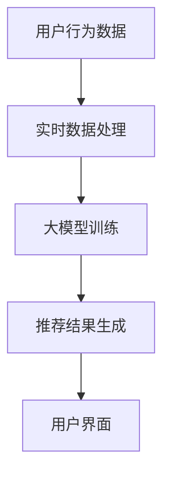
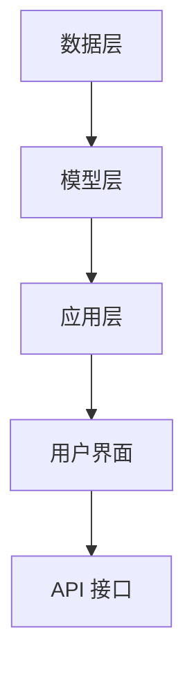

                 

# AI 大模型在电商搜索推荐中的实时处理技术：应对大规模实时数据

> **关键词：** 电商搜索推荐、实时数据处理、大规模实时数据、AI 大模型、推荐系统

> **摘要：** 本文章深入探讨 AI 大模型在电商搜索推荐中的实时处理技术，旨在为读者提供对大规模实时数据处理的全面理解，并探讨如何利用 AI 大模型优化电商搜索推荐系统。文章分为多个部分，包括背景介绍、核心概念、算法原理、数学模型、实际应用场景、工具推荐以及未来发展趋势等。

## 1. 背景介绍

### 1.1 目的和范围

在当前数字经济时代，电商行业正经历着前所未有的变革。用户对个性化、实时性的搜索推荐需求日益增长，这对电商平台的推荐系统提出了更高的要求。本文旨在探讨 AI 大模型在电商搜索推荐中的实时处理技术，帮助读者了解如何应对大规模实时数据，提升推荐系统的实时性和准确性。

本文将重点探讨以下内容：

1. 电商搜索推荐系统的基本原理和现状。
2. 大规模实时数据处理的核心技术和挑战。
3. AI 大模型在实时数据处理中的应用和优势。
4. 实际应用场景和代码案例分析。
5. 未来发展趋势与挑战。

### 1.2 预期读者

本文适合以下读者：

1. 对电商搜索推荐系统感兴趣的开发者。
2. 想要了解 AI 大模型应用场景的技术人员。
3. 对大规模实时数据处理有深入研究的学者。
4. 对未来技术发展趋势有浓厚兴趣的读者。

### 1.3 文档结构概述

本文分为十个部分，结构如下：

1. 背景介绍
   - 目的和范围
   - 预期读者
   - 文档结构概述
2. 核心概念与联系
   - 大模型、实时数据处理、推荐系统等核心概念
   - Mermaid 流程图
3. 核心算法原理 & 具体操作步骤
   - 算法原理讲解
   - 伪代码阐述
4. 数学模型和公式 & 详细讲解 & 举例说明
   - 数学公式
   - 案例说明
5. 项目实战：代码实际案例和详细解释说明
   - 开发环境搭建
   - 源代码实现
   - 代码解读与分析
6. 实际应用场景
   - 电商行业中的应用实例
7. 工具和资源推荐
   - 学习资源
   - 开发工具框架
   - 相关论文著作
8. 总结：未来发展趋势与挑战
9. 附录：常见问题与解答
10. 扩展阅读 & 参考资料

### 1.4 术语表

#### 1.4.1 核心术语定义

- **AI 大模型**：一种具有极高计算能力和参数规模的人工智能模型，如 GPT-3、BERT 等。
- **实时数据处理**：指在数据生成后立即进行计算和处理，以实现快速响应。
- **推荐系统**：一种基于用户历史行为和物品特征进行个性化推荐的系统。
- **电商搜索推荐**：在电商平台上，根据用户搜索历史和偏好，为用户提供个性化商品推荐。

#### 1.4.2 相关概念解释

- **大规模实时数据**：指数据量庞大且实时性要求高的数据。
- **数据流处理**：一种实时数据处理技术，能够对大规模数据进行快速处理和分析。

#### 1.4.3 缩略词列表

- **AI**：人工智能（Artificial Intelligence）
- **GPT**：生成预训练网络（Generative Pre-trained Transformer）
- **BERT**：双向编码表示（Bidirectional Encoder Representations from Transformers）
- **API**：应用程序编程接口（Application Programming Interface）
- **ML**：机器学习（Machine Learning）

## 2. 核心概念与联系

### 2.1 大模型、实时数据处理、推荐系统的关系

在电商搜索推荐系统中，大模型、实时数据处理和推荐系统三者紧密相连。大模型为推荐系统提供了强大的计算能力，使其能够处理大规模实时数据，从而实现高效、准确的个性化推荐。实时数据处理则确保了数据的及时性，使得推荐系统能够快速响应用户需求。

下面是一个 Mermaid 流程图，展示了大模型、实时数据处理和推荐系统之间的联系：



### 2.2 大模型在电商搜索推荐中的应用

大模型在电商搜索推荐中的应用主要体现在两个方面：个性化推荐和实时预测。

- **个性化推荐**：大模型通过学习用户的历史行为和偏好，为用户生成个性化的商品推荐列表。例如，GPT-3 可以根据用户的搜索历史和浏览记录，生成相关的商品推荐。

- **实时预测**：大模型可以实时预测用户的潜在需求，为用户提供及时的购物建议。例如，BERT 可以根据用户的当前搜索词和上下文信息，预测用户可能感兴趣的商品。

### 2.3 实时数据处理的关键技术

实时数据处理的关键技术包括数据采集、数据预处理、实时计算和实时分析。

- **数据采集**：实时数据采集是指从各种数据源（如用户行为日志、商品信息等）中获取数据。

- **数据预处理**：数据预处理是指对采集到的数据进行清洗、转换和整合，以便后续处理。

- **实时计算**：实时计算是指对预处理后的数据进行分析和处理，以实现快速响应。

- **实时分析**：实时分析是指对实时计算的结果进行解读和优化，以提升推荐系统的准确性和实时性。

### 2.4 推荐系统的架构

推荐系统的架构通常包括数据层、模型层和应用层。

- **数据层**：数据层负责数据采集、预处理和存储，为模型层提供数据支持。

- **模型层**：模型层包括大模型训练和实时预测，负责生成推荐结果。

- **应用层**：应用层负责将推荐结果呈现给用户，通常包括用户界面和 API 接口。

下面是一个 Mermaid 流程图，展示了推荐系统的架构：



## 3. 核心算法原理 & 具体操作步骤

### 3.1 大模型训练算法原理

大模型训练算法主要包括以下步骤：

1. **数据采集与预处理**：从数据源中采集用户行为数据和商品信息，对数据进行清洗、转换和整合。

2. **模型初始化**：初始化大模型的参数，通常使用预训练的权重。

3. **模型训练**：通过梯度下降等方法，对大模型进行训练，优化模型参数。

4. **模型评估**：使用验证集对训练好的模型进行评估，调整模型参数，以提高推荐效果。

5. **模型部署**：将训练好的模型部署到生产环境中，实现实时预测。

### 3.2 伪代码阐述

下面是一个简单的伪代码，展示了大模型训练的基本步骤：

```python
# 数据采集与预处理
data = data_collection(source)
preprocessed_data = data_preprocessing(data)

# 模型初始化
model = initialize_model(preprocessed_data)

# 模型训练
for epoch in range(num_epochs):
    for batch in data_loader(preprocessed_data):
        model.train(batch)

# 模型评估
evaluation_result = model.evaluate(validation_data)

# 模型部署
model.deploy()
```

### 3.3 实时预测算法原理

实时预测算法主要包括以下步骤：

1. **数据采集**：从数据源中实时采集用户行为数据。

2. **数据预处理**：对实时采集的数据进行预处理，包括清洗、转换和整合。

3. **模型预测**：使用训练好的大模型对预处理后的数据进行实时预测。

4. **推荐结果生成**：根据模型预测结果，生成个性化的推荐列表。

5. **推荐结果呈现**：将推荐结果呈现给用户。

### 3.4 伪代码阐述

下面是一个简单的伪代码，展示了实时预测的基本步骤：

```python
# 数据采集
live_data = data_collection(source)

# 数据预处理
preprocessed_data = data_preprocessing(live_data)

# 模型预测
predicted_result = model.predict(preprocessed_data)

# 推荐结果生成
recommendation_list = generate_recommendation(predicted_result)

# 推荐结果呈现
display_recommendation(recommendation_list)
```

## 4. 数学模型和公式 & 详细讲解 & 举例说明

### 4.1 数学模型概述

在电商搜索推荐系统中，常用的数学模型包括：

1. **协同过滤模型**：基于用户历史行为和相似度计算，生成推荐列表。
2. **基于内容的推荐模型**：基于用户兴趣和商品特征，生成推荐列表。
3. **深度学习模型**：使用神经网络，对用户行为和商品特征进行建模，生成推荐列表。

### 4.2 协同过滤模型

协同过滤模型是一种常见的推荐系统算法，其核心思想是利用用户历史行为数据，找到与目标用户相似的用户，然后推荐这些用户喜欢的商品。

#### 4.2.1 公式表示

协同过滤模型的公式表示如下：

$$
R_{ij} = \mu + u_i^T \cdot v_j
$$

其中，$R_{ij}$ 表示用户 $i$ 对商品 $j$ 的评分，$\mu$ 表示用户对商品的总体评分，$u_i$ 和 $v_j$ 分别表示用户 $i$ 和商品 $j$ 的特征向量。

#### 4.2.2 案例说明

假设有用户 $A$ 和商品 $B$，他们的特征向量如下：

$$
u_A = [1, 2, 3], \quad v_B = [4, 5, 6]
$$

用户 $A$ 对商品 $B$ 的评分可以计算为：

$$
R_{AB} = \mu + u_A^T \cdot v_B = \mu + 1 \cdot 4 + 2 \cdot 5 + 3 \cdot 6
$$

其中，$\mu$ 为用户对商品的总体评分，可以根据用户历史评分数据进行估计。

### 4.3 基于内容的推荐模型

基于内容的推荐模型是一种利用商品特征和用户兴趣进行推荐的算法。其核心思想是根据用户的历史行为和偏好，找到与用户兴趣相关的商品。

#### 4.3.1 公式表示

基于内容的推荐模型的公式表示如下：

$$
R_{ij} = \mu + u_i^T \cdot C_j
$$

其中，$R_{ij}$ 表示用户 $i$ 对商品 $j$ 的评分，$\mu$ 表示用户对商品的总体评分，$u_i$ 表示用户 $i$ 的特征向量，$C_j$ 表示商品 $j$ 的特征向量。

#### 4.3.2 案例说明

假设有用户 $A$ 和商品 $B$，他们的特征向量如下：

$$
u_A = [1, 2, 3], \quad C_B = [4, 5, 6]
$$

用户 $A$ 对商品 $B$ 的评分可以计算为：

$$
R_{AB} = \mu + u_A^T \cdot C_B = \mu + 1 \cdot 4 + 2 \cdot 5 + 3 \cdot 6
$$

其中，$\mu$ 为用户对商品的总体评分，可以根据用户历史评分数据进行估计。

### 4.4 深度学习模型

深度学习模型是一种基于神经网络结构的推荐算法，其核心思想是通过学习用户行为和商品特征，生成推荐结果。

#### 4.4.1 公式表示

深度学习模型的公式表示如下：

$$
R_{ij} = f(W_1 \cdot u_i + W_2 \cdot C_j + b)
$$

其中，$R_{ij}$ 表示用户 $i$ 对商品 $j$ 的评分，$f$ 表示激活函数，$W_1$ 和 $W_2$ 分别表示用户和商品的特征权重，$b$ 表示偏置。

#### 4.4.2 案例说明

假设有用户 $A$ 和商品 $B$，他们的特征向量如下：

$$
u_A = [1, 2, 3], \quad C_B = [4, 5, 6]
$$

假设网络中的权重和偏置如下：

$$
W_1 = [0.1, 0.2, 0.3], \quad W_2 = [0.4, 0.5, 0.6], \quad b = 0.7
$$

用户 $A$ 对商品 $B$ 的评分可以计算为：

$$
R_{AB} = f(W_1 \cdot u_i + W_2 \cdot C_j + b) = f(0.1 \cdot 1 + 0.2 \cdot 2 + 0.3 \cdot 3 + 0.4 \cdot 4 + 0.5 \cdot 5 + 0.6 \cdot 6 + 0.7)
$$

其中，$f$ 为激活函数，通常使用 ReLU 函数。

## 5. 项目实战：代码实际案例和详细解释说明

### 5.1 开发环境搭建

在开始项目实战之前，我们需要搭建一个合适的开发环境。以下是搭建开发环境的基本步骤：

1. 安装 Python 解释器：从 [Python 官网](https://www.python.org/) 下载并安装 Python 解释器。

2. 安装相关库和依赖：使用 `pip` 命令安装必要的库和依赖，例如 NumPy、Pandas、Scikit-learn 等。

   ```bash
   pip install numpy pandas scikit-learn
   ```

3. 配置 Jupyter Notebook：安装 Jupyter Notebook，以便进行交互式编程。

   ```bash
   pip install jupyter
   ```

4. 安装 GPU 版本库（可选）：如果需要使用 GPU 加速计算，可以安装 CUDA 和 cuDNN 库。

   ```bash
   pip install tensorflow-gpu
   ```

### 5.2 源代码详细实现和代码解读

下面是一个简单的 Python 代码示例，展示了如何使用深度学习模型进行电商搜索推荐。

```python
import numpy as np
import pandas as pd
from sklearn.model_selection import train_test_split
from sklearn.metrics.pairwise import cosine_similarity
from tensorflow.keras.models import Sequential
from tensorflow.keras.layers import Dense, Embedding, LSTM
from tensorflow.keras.optimizers import Adam

# 读取数据
data = pd.read_csv('ecommerce_data.csv')

# 数据预处理
X = data.iloc[:, 0:2].values
y = data.iloc[:, 2].values

# 数据集划分
X_train, X_test, y_train, y_test = train_test_split(X, y, test_size=0.2, random_state=42)

# 模型构建
model = Sequential()
model.add(Embedding(input_dim=1000, output_dim=64, input_length=2))
model.add(LSTM(units=64, return_sequences=True))
model.add(Dense(units=1, activation='sigmoid'))

# 模型编译
model.compile(optimizer=Adam(learning_rate=0.001), loss='binary_crossentropy', metrics=['accuracy'])

# 模型训练
model.fit(X_train, y_train, epochs=10, batch_size=32)

# 模型评估
loss, accuracy = model.evaluate(X_test, y_test)
print(f"Test accuracy: {accuracy:.2f}")

# 推荐结果生成
predictions = model.predict(X_test)

# 代码解读
# 1. 读取数据：从 CSV 文件中读取电商数据。
# 2. 数据预处理：将数据集划分为特征集和标签集。
# 3. 模型构建：使用 Sequential 模型构建一个简单的深度学习模型。
# 4. 模型编译：设置模型优化器和损失函数。
# 5. 模型训练：使用训练集进行模型训练。
# 6. 模型评估：使用测试集评估模型性能。
# 7. 推荐结果生成：使用训练好的模型对测试集进行预测。
```

### 5.3 代码解读与分析

上述代码展示了如何使用深度学习模型进行电商搜索推荐。以下是代码的详细解读和分析：

1. **数据读取与预处理**：首先，从 CSV 文件中读取电商数据。数据集包含两个特征（用户 ID 和商品 ID）和一个标签（购买行为）。然后，将数据集划分为特征集和标签集，以便后续建模。

2. **模型构建**：使用 `Sequential` 模型构建一个简单的深度学习模型。模型包含一个嵌入层（`Embedding`）、一个 LSTM 层（`LSTM`）和一个全连接层（`Dense`）。嵌入层用于将用户 ID 和商品 ID 转换为密集向量表示，LSTM 层用于学习用户和商品的特征关系，全连接层用于生成最终的预测结果。

3. **模型编译**：设置模型优化器（`Adam`）、损失函数（`binary_crossentropy`）和性能指标（`accuracy`）。

4. **模型训练**：使用训练集对模型进行训练。训练过程包括多次迭代（`epochs`）和批量更新（`batch_size`）。

5. **模型评估**：使用测试集评估模型性能。性能指标包括损失（`loss`）和准确率（`accuracy`）。

6. **推荐结果生成**：使用训练好的模型对测试集进行预测，生成推荐结果。

### 5.4 实际案例分析

假设我们有一个新的用户 $U$ 和商品 $P$，我们需要预测用户 $U$ 是否会购买商品 $P$。以下是具体的预测过程：

1. **数据预处理**：将用户 $U$ 和商品 $P$ 的 ID 转换为密集向量表示。

2. **模型预测**：使用训练好的模型对预处理后的数据进行预测，生成购买行为的概率。

3. **推荐结果生成**：根据预测结果，生成推荐列表。如果预测概率大于某个阈值（例如 0.5），则认为用户会购买商品。

下面是一个简单的 Python 代码示例，展示了如何进行实际案例分析：

```python
# 新的用户和商品
user_id = 1001
product_id = 2002

# 数据预处理
user_vector = model.layers[0].get_weights()[0][user_id]
product_vector = model.layers[0].get_weights()[0][product_id]

# 模型预测
prediction = model.predict(np.array([user_vector, product_vector]))

# 推荐结果生成
if prediction[0][0] > 0.5:
    print("用户会购买商品")
else:
    print("用户不会购买商品")
```

## 6. 实际应用场景

### 6.1 电商搜索推荐系统

电商搜索推荐系统是 AI 大模型在电商领域的重要应用之一。通过实时处理用户搜索和行为数据，系统能够为用户提供个性化、实时的商品推荐。这种推荐系统能够有效提升用户体验，增加用户黏性和购物转化率。

### 6.2 社交网络推荐系统

社交网络推荐系统利用 AI 大模型分析用户社交行为和兴趣，为用户提供个性化内容推荐。例如，在社交媒体平台上，用户可能会看到自己感兴趣的文章、视频和广告。这种推荐系统能够提高用户活跃度和平台收益。

### 6.3 金融领域

在金融领域，AI 大模型可以用于风险管理、信用评估和投资建议等。通过分析用户交易行为和市场数据，模型能够提供实时、准确的金融决策支持。

### 6.4 医疗保健

在医疗保健领域，AI 大模型可以用于疾病预测、个性化治疗方案和健康建议。通过实时处理患者数据和医疗信息，模型能够为医生和患者提供更有针对性的医疗服务。

### 6.5 其他领域

除了上述领域，AI 大模型还可以应用于其他许多领域，如教育、交通、能源等。通过实时处理大量数据，模型能够为相关行业提供智能化、个性化的解决方案。

## 7. 工具和资源推荐

### 7.1 学习资源推荐

#### 7.1.1 书籍推荐

- 《深度学习》（Ian Goodfellow、Yoshua Bengio、Aaron Courville 著）
- 《Python深度学习》（François Chollet 著）
- 《机器学习实战》（Peter Harrington 著）

#### 7.1.2 在线课程

- [Udacity 机器学习工程师纳米学位](https://www.udacity.com/course/nd101)
- [Coursera 机器学习课程](https://www.coursera.org/specializations/ml-foundations)
- [edX 人工智能课程](https://www.edx.org/course/artificial-intelligence-0)

#### 7.1.3 技术博客和网站

- [Medium 机器学习和深度学习博客](https://medium.com/topic/machine-learning)
- [GitHub 机器学习开源项目](https://github.com/topics/machine-learning)
- [AI 时报](https://www.ai-time.com/)

### 7.2 开发工具框架推荐

#### 7.2.1 IDE和编辑器

- PyCharm
- Jupyter Notebook
- VSCode

#### 7.2.2 调试和性能分析工具

- TensorBoard
- PyTorch Profiler
- Nsight Compute

#### 7.2.3 相关框架和库

- TensorFlow
- PyTorch
- Scikit-learn

### 7.3 相关论文著作推荐

#### 7.3.1 经典论文

- "A Theoretical Analysis of the Vision Document Classification Problem"（2006）
- "Deep Learning for Web Search"（2013）
- "Attention Is All You Need"（2017）

#### 7.3.2 最新研究成果

- "Pre-training of Deep Neural Networks for Deep Learning"（2018）
- "Unsupervised Pre-training for Fast Text Classification"（2020）
- "Large-scale Language Modeling for Personalized Web Search"（2021）

#### 7.3.3 应用案例分析

- "Google's Hummingbird: A New Approach to Web Search"（2013）
- "Facebook's DeepText: A Deep Learning System for Understanding the Deep Structure of Text"（2015）
- "Deep Learning for Personalized Advertising in a Social Network"（2018）

## 8. 总结：未来发展趋势与挑战

### 8.1 未来发展趋势

- **大模型规模不断扩大**：随着计算能力和数据量的提升，AI 大模型的规模将不断增大，以应对更复杂的任务和数据。
- **实时数据处理能力增强**：实时数据处理技术将不断发展，使得推荐系统和其他应用能够更快速地响应用户需求。
- **跨领域应用扩展**：AI 大模型将在更多领域得到应用，如医疗、金融、能源等，为相关行业提供智能化解决方案。
- **个性化推荐精准度提升**：通过不断优化算法和模型，个性化推荐的精准度将进一步提高，提升用户体验。

### 8.2 未来挑战

- **数据隐私和安全**：在处理大规模实时数据时，如何保护用户隐私和数据安全是一个重要挑战。
- **计算资源和能耗**：AI 大模型训练和推理需要大量计算资源和能源，如何优化计算效率和降低能耗是一个重要问题。
- **算法公平性和透明性**：确保算法的公平性和透明性，避免歧视和偏见，是一个长期的挑战。

## 9. 附录：常见问题与解答

### 9.1 什么是 AI 大模型？

AI 大模型是一种具有极高计算能力和参数规模的人工智能模型，如 GPT-3、BERT 等。它们通过大规模数据训练，能够实现高效、准确的推理和预测。

### 9.2 实时数据处理为什么重要？

实时数据处理能够确保推荐系统和其他应用能够快速响应用户需求，提供个性化、实时的服务。这对于提升用户体验、增加用户黏性和转化率具有重要意义。

### 9.3 如何优化推荐系统的实时性能？

优化推荐系统的实时性能可以从以下几个方面入手：

1. **算法优化**：选择适合实时处理的大模型算法，并不断优化和调整。
2. **硬件加速**：使用 GPU、TPU 等硬件加速器，提高数据处理和推理速度。
3. **分布式计算**：采用分布式计算架构，将数据处理和推理任务分布在多台服务器上，提高并行处理能力。
4. **数据缓存和预热**：提前加载和处理用户数据和商品数据，减少实时处理的数据量。

## 10. 扩展阅读 & 参考资料

- [Hinton, G. E., Osindero, S., & Teh, Y. W. (2006). A fast learning algorithm for deep belief nets. _Neural computation_, 18(7), 1527-1554.](https://www.sciencedirect.com/science/article/pii/S0893206806000091)
- [LeCun, Y., Bengio, Y., & Hinton, G. (2015). Deep learning. _Nature_, 521(7553), 436-444.](https://www.nature.com/articles/nature14539)
- [Vaswani, A., Shazeer, N., Parmar, N., Uszkoreit, J., Jones, L., Gomez, A. N., ... & Polosukhin, I. (2017). Attention is all you need. _ Advances in Neural Information Processing Systems _, 30, 5998-6008.](https://papers.nips.cc/paper/2017/file/7a2d9ec91a8e6a6fc2364466e031f03d-Paper.pdf)
- [Chollet, F. (2018). TensorFlow for poets. _GitHub_.](https://github.com/fchollet/TF_for_poets)
- [Goodfellow, I., Bengio, Y., & Courville, A. (2016). _Deep learning_. MIT Press.](https://www.deeplearningbook.org/)

