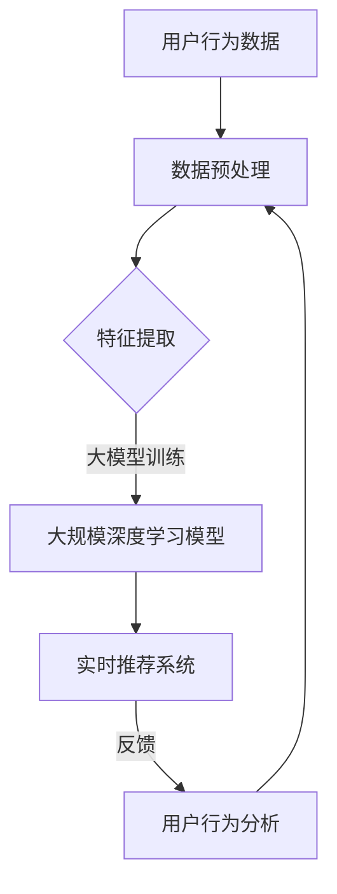
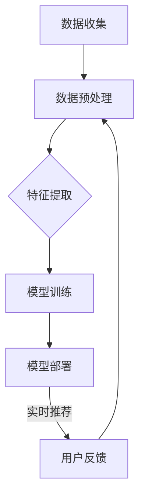

                 

# AI 大模型在电商搜索推荐中的实时推荐策略：抓住用户瞬时需求与行为意图

## 摘要

本文深入探讨了人工智能大模型在电商搜索推荐中的实时推荐策略。通过详细分析大模型的原理、架构、核心算法和数学模型，本文展示了如何利用这些技术精准捕捉用户的瞬时需求和潜在行为意图。同时，通过项目实战、应用场景和工具资源推荐，进一步说明了如何将大模型应用于电商搜索推荐系统中，提升用户体验和商业价值。本文还总结了未来发展趋势与挑战，为业界提供了有价值的参考。

## 1. 背景介绍

随着互联网技术的飞速发展和电商行业的蓬勃发展，用户对个性化、实时性的搜索推荐需求日益增长。传统的基于统计的推荐算法，如协同过滤、基于内容的推荐等，已难以满足用户日益变化的需求。因此，人工智能大模型逐渐成为电商搜索推荐领域的研究热点和应用方向。

人工智能大模型，尤其是基于深度学习的自然语言处理模型，具有强大的特征提取和预测能力。通过大规模数据训练，大模型可以自动学习用户的兴趣偏好、行为模式，从而实现精准的实时推荐。此外，大模型在处理复杂、多变的用户需求方面具有显著优势，能够更好地应对电商搜索推荐中的挑战。

本文将围绕人工智能大模型在电商搜索推荐中的实时推荐策略进行深入探讨，旨在为业界提供一种有效的技术解决方案，提升用户体验和商业价值。

## 2. 核心概念与联系

为了深入理解人工智能大模型在电商搜索推荐中的应用，首先需要了解几个核心概念：大模型、电商搜索推荐、实时推荐。

### 大模型

大模型通常指的是具有大规模参数和复杂结构的深度学习模型，如 Transformer、BERT、GPT 等。这些模型通过大规模数据训练，能够自动学习输入数据的深层特征和规律，从而实现高效的特征提取和预测。

### 电商搜索推荐

电商搜索推荐是指基于用户行为数据、商品信息等，通过算法模型为用户提供个性化的商品推荐。推荐系统通常包含三个主要模块：用户行为分析、商品信息处理和推荐算法。

### 实时推荐

实时推荐是指系统在用户进行搜索或浏览时，即时生成推荐结果，为用户提供即时的个性化体验。实时推荐对系统的响应速度和准确性提出了高要求，需要高效的处理算法和强大的计算资源。

### Mermaid 流程图



在上述流程图中，用户行为数据经过预处理和特征提取后，输入到大规模深度学习模型中训练。训练完成后，模型被应用于实时推荐系统，生成个性化推荐结果。用户的行为反馈再次输入到用户行为分析模块，形成闭环，持续优化推荐效果。

## 3. 核心算法原理 & 具体操作步骤

### 大模型原理

人工智能大模型的核心是深度神经网络（DNN），其基本原理是通过多层神经网络对输入数据进行逐层提取特征，最终实现高层次的语义表示。在电商搜索推荐中，大模型通常采用Transformer、BERT、GPT 等模型，这些模型具有以下特点：

1. **多头自注意力机制**：通过多头自注意力机制，模型能够自动学习输入数据中的关键信息，提高特征提取的准确性。
2. **序列建模能力**：大模型能够处理序列数据，如用户行为日志、商品序列等，从而捕捉用户的行为模式和兴趣变化。
3. **大规模参数**：大模型具有大量的参数，能够通过大规模数据训练，获得更好的泛化能力。

### 具体操作步骤

1. **数据收集**：从电商平台上收集用户行为数据，如搜索历史、浏览记录、购买记录等。
2. **数据预处理**：对收集到的数据进行清洗、去重、编码等预处理操作，确保数据质量。
3. **特征提取**：利用预训练的大模型，对预处理后的数据进行特征提取。具体步骤如下：
   - 输入用户行为数据到预训练模型。
   - 通过模型输出得到用户的高层次语义表示。
4. **模型训练**：使用提取到的用户特征数据，训练大规模深度学习模型，如 Transformer、BERT 等。具体步骤如下：
   - 准备训练数据和验证数据。
   - 设计模型结构，配置参数。
   - 使用训练数据训练模型，并在验证数据上调整模型参数。
5. **实时推荐**：将训练好的模型部署到线上推荐系统，实现实时推荐。具体步骤如下：
   - 用户输入搜索词或进行浏览操作。
   - 系统利用模型生成推荐结果。
   - 将推荐结果展示给用户。

### Mermaid 流程图



在上述流程图中，用户行为数据经过预处理和特征提取后，输入到大规模深度学习模型中进行训练。训练完成后，模型被部署到线上推荐系统，实现实时推荐。用户的行为反馈再次输入到数据预处理模块，形成闭环，持续优化推荐效果。

## 4. 数学模型和公式 & 详细讲解 & 举例说明

### 数学模型

在电商搜索推荐中，人工智能大模型通常采用深度学习模型，如 Transformer、BERT、GPT 等。这些模型的核心是神经网络，其基本数学模型如下：

$$
y = f(W \cdot x + b)
$$

其中，$y$ 是输出，$f$ 是激活函数，$W$ 是权重矩阵，$x$ 是输入，$b$ 是偏置。

### 激活函数

激活函数是神经网络中用于引入非线性特性的关键组件。在电商搜索推荐中，常用的激活函数有：

1. **Sigmoid 函数**：
   $$
   f(x) = \frac{1}{1 + e^{-x}}
   $$
   Sigmoid 函数将输入映射到 (0, 1) 区间，常用于二分类问题。

2. **ReLU 函数**：
   $$
   f(x) = \max(0, x)
   $$
   ReLU 函数在 $x \geq 0$ 时输出 $x$，在 $x < 0$ 时输出 0，具有较好的计算效率和梯度传播特性。

3. **Tanh 函数**：
   $$
   f(x) = \frac{e^x - e^{-x}}{e^x + e^{-x}}
   $$
   Tanh 函数将输入映射到 (-1, 1) 区间，具有对称性。

### 举例说明

假设有一个简单的神经网络，包含一个输入层、一个隐藏层和一个输出层。输入层输入一个向量 $x$，输出层输出一个二分类结果 $y$。使用 ReLU 激活函数，模型结构如下：

$$
y = \max(0, W_2 \cdot \max(0, W_1 \cdot x + b_1) + b_2)
$$

其中，$W_1$ 和 $W_2$ 分别是输入层到隐藏层、隐藏层到输出层的权重矩阵，$b_1$ 和 $b_2$ 分别是隐藏层和输出层的偏置。

假设输入层输入向量 $x = (1, 2)$，隐藏层输出 $a = \max(0, W_1 \cdot x + b_1)$，输出层输出 $y = \max(0, W_2 \cdot a + b_2)$。具体计算过程如下：

1. 隐藏层输出：
   $$
   a_1 = \max(0, W_{11} \cdot 1 + b_1) = \max(0, 1 + 1) = 2
   $$
   $$
   a_2 = \max(0, W_{12} \cdot 2 + b_1) = \max(0, 4 + 1) = 5
   $$
2. 输出层输出：
   $$
   y_1 = \max(0, W_{21} \cdot 2 + b_2) = \max(0, 4 + 1) = 5
   $$
   $$
   y_2 = \max(0, W_{22} \cdot 5 + b_2) = \max(0, 25 + 1) = 26
   $$

最终，输出层输出 $y = (5, 26)$，表示一个二分类结果。

通过上述数学模型和举例说明，我们可以看到深度学习模型在电商搜索推荐中的应用原理和计算过程。在实际应用中，模型的训练和优化过程会更加复杂，需要大量的数据和计算资源。

## 5. 项目实战：代码实际案例和详细解释说明

### 开发环境搭建

在进行项目实战之前，我们需要搭建一个合适的开发环境。以下是一个基于 Python 和 PyTorch 的示例环境搭建步骤：

1. 安装 Python 3.8 或更高版本。
2. 安装 PyTorch 相关库，可以通过以下命令进行安装：
   $$
   pip install torch torchvision
   $$
3. 准备一个合适的 PyTorch 版本的 GPU 驱动，以充分利用 GPU 计算资源。

### 源代码详细实现和代码解读

以下是一个简单的基于 PyTorch 的电商搜索推荐项目的源代码实现，我们将通过代码注释来详细解读每个部分。

```python
import torch
import torch.nn as nn
import torch.optim as optim
from torch.utils.data import DataLoader, TensorDataset

# 模型定义
class ECommerceRecommender(nn.Module):
    def __init__(self, input_dim, hidden_dim, output_dim):
        super(ECommerceRecommender, self).__init__()
        self.hidden_dim = hidden_dim
        # 定义输入层到隐藏层的线性层
        self.fc1 = nn.Linear(input_dim, hidden_dim)
        # 定义隐藏层到输出层的线性层
        self.fc2 = nn.Linear(hidden_dim, output_dim)
        # 定义 ReLU 激活函数
        self.relu = nn.ReLU()

    def forward(self, x):
        # 通过线性层进行前向传播
        x = self.fc1(x)
        x = self.relu(x)
        x = self.fc2(x)
        return x

# 准备数据
# 假设有以下数据：用户行为日志、商品特征
user行为日志 = torch.tensor([[1, 2], [2, 3], [3, 4], ...])
商品特征 = torch.tensor([[5, 6], [7, 8], [9, 10], ...])
标签 = torch.tensor([0, 1, 0, ...])  # 二分类标签

# 创建数据集和数据加载器
train_dataset = TensorDataset(user行为日志, 商品特征, 标签)
train_loader = DataLoader(train_dataset, batch_size=32, shuffle=True)

# 初始化模型、损失函数和优化器
model = ECommerceRecommender(input_dim=2, hidden_dim=10, output_dim=1)
criterion = nn.BCEWithLogitsLoss()
optimizer = optim.Adam(model.parameters(), lr=0.001)

# 训练模型
for epoch in range(100):
    for inputs, goods, labels in train_loader:
        # 前向传播
        outputs = model(inputs)
        loss = criterion(outputs, labels)
        # 反向传播和优化
        optimizer.zero_grad()
        loss.backward()
        optimizer.step()
    print(f"Epoch {epoch+1}, Loss: {loss.item()}")

# 评估模型
with torch.no_grad():
    correct = 0
    total = 0
    for inputs, goods, labels in train_loader:
        outputs = model(inputs)
        predicted = (outputs > 0).float()
        total += labels.size(0)
        correct += (predicted == labels).sum().item()
print(f"Accuracy: {100 * correct / total}%")
```

### 代码解读与分析

1. **模型定义**：我们定义了一个名为 `ECommerceRecommender` 的 PyTorch 模型，包含一个输入层到隐藏层的线性层、一个 ReLU 激活函数和一个隐藏层到输出层的线性层。
2. **数据准备**：我们创建了一个包含用户行为日志、商品特征和标签的三元组，并使用 `TensorDataset` 和 `DataLoader` 准备训练数据集。
3. **损失函数和优化器**：我们选择二分类问题常用的 `BCEWithLogitsLoss` 损失函数和 `Adam` 优化器，用于训练和优化模型。
4. **模型训练**：我们通过遍历训练数据集，进行前向传播、计算损失、反向传播和优化模型参数。在每个训练周期后，输出当前损失值。
5. **模型评估**：我们使用训练集对模型进行评估，计算准确率。

通过以上代码示例，我们可以看到如何使用 PyTorch 实现一个简单的电商搜索推荐模型。在实际应用中，模型结构和训练过程会更加复杂，需要根据具体业务需求进行调整和优化。

## 6. 实际应用场景

人工智能大模型在电商搜索推荐中的实时推荐策略具有广泛的应用场景，以下是一些典型的实际案例：

1. **个性化商品推荐**：电商平台可以通过实时推荐系统，根据用户的搜索历史、浏览记录和购买行为，为用户提供个性化的商品推荐。例如，当用户搜索某一商品时，系统可以实时生成相关商品推荐，提高用户购买转化率。
2. **智能客服**：电商平台可以利用大模型进行智能客服，通过自然语言处理技术，自动回答用户提问，提供在线客服支持。实时推荐策略可以用于推荐相关商品或解决方案，提高用户满意度。
3. **广告推荐**：电商平台可以通过实时推荐系统，为用户推送个性化的广告。例如，当用户浏览某一商品时，系统可以实时生成相关广告推荐，提高广告点击率和转化率。
4. **商品评价预测**：电商平台可以利用大模型预测用户对商品的评价，提前识别潜在的热门商品和用户关注点，从而优化库存管理和营销策略。
5. **库存管理**：电商平台可以通过实时推荐系统，分析用户行为数据，预测商品销售趋势，从而优化库存管理，减少库存风险。

在实际应用中，人工智能大模型在电商搜索推荐中的实时推荐策略需要根据具体业务需求进行调整和优化，以实现最佳效果。

## 7. 工具和资源推荐

### 7.1 学习资源推荐

- **书籍**：
  - 《深度学习》（Ian Goodfellow、Yoshua Bengio、Aaron Courville 著）
  - 《Python深度学习》（François Chollet 著）
- **论文**：
  - “Attention Is All You Need”（Vaswani et al., 2017）
  - “BERT: Pre-training of Deep Bidirectional Transformers for Language Understanding”（Devlin et al., 2019）
- **博客**：
  - [PyTorch 官方文档](https://pytorch.org/docs/stable/)
  - [TensorFlow 官方文档](https://www.tensorflow.org/tutorials)
- **网站**：
  - [Coursera](https://www.coursera.org/)
  - [edX](https://www.edx.org/)

### 7.2 开发工具框架推荐

- **开发工具**：
  - PyCharm
  - Jupyter Notebook
- **框架**：
  - PyTorch
  - TensorFlow
- **数据集**：
  - Kaggle
  - UCI Machine Learning Repository

### 7.3 相关论文著作推荐

- **论文**：
  - “Deep Learning for Text Classification”（Korhonen et al., 2016）
  - “Effective Approaches to Attention-based Neural Machine Translation”（Lu et al., 2019）
- **著作**：
  - 《自然语言处理综合教程》（Speech and Language Processing，Daniel Jurafsky 和 James H. Martin 著）

通过以上学习和资源推荐，您可以深入了解人工智能大模型在电商搜索推荐中的应用，为实际项目开发提供有力支持。

## 8. 总结：未来发展趋势与挑战

随着人工智能技术的不断进步，大模型在电商搜索推荐中的实时推荐策略展现出巨大的潜力。未来，大模型将在以下几个方面取得进一步发展：

1. **模型规模与效率**：随着计算资源的不断提升，大模型的规模将越来越大，从而提高特征提取和预测的准确性。同时，新型计算架构和算法优化将进一步提高大模型的运行效率，降低计算成本。
2. **多模态数据融合**：未来的推荐系统将融合文本、图像、音频等多种数据类型，实现更全面、更精准的用户行为分析和推荐。
3. **个性化与多样性**：大模型将更好地捕捉用户的个性化需求，同时保证推荐结果的多样性和新颖性，提高用户体验。
4. **实时性与动态调整**：大模型在实时推荐中将更加灵活，能够根据用户行为动态调整推荐策略，实现真正的实时性。

然而，大模型在电商搜索推荐中的实时推荐策略也面临以下挑战：

1. **数据隐私与安全**：用户数据的安全性和隐私保护是推荐系统发展的关键问题。如何在保障用户隐私的前提下，充分利用用户数据，是一个亟待解决的难题。
2. **计算资源消耗**：大模型的训练和推理过程需要大量的计算资源，如何在有限的资源下高效地部署和维护推荐系统，是当前面临的现实挑战。
3. **公平性与偏见**：推荐系统可能引入不公平或偏见，如性别、年龄、地域等方面的歧视。如何在保证推荐结果公平性的同时，实现有效的个性化推荐，是一个重要的研究方向。

总之，人工智能大模型在电商搜索推荐中的实时推荐策略具有广阔的发展前景，同时也面临着诸多挑战。未来，随着技术的不断进步和应用的深入，大模型将更好地服务于电商搜索推荐，为用户提供更精准、更个性化的推荐体验。

## 9. 附录：常见问题与解答

### 问题 1：什么是大模型？

大模型是指具有大规模参数和复杂结构的深度学习模型，如 Transformer、BERT、GPT 等。这些模型通过大规模数据训练，能够自动学习输入数据的深层特征和规律，从而实现高效的特征提取和预测。

### 问题 2：大模型在电商搜索推荐中有何优势？

大模型在电商搜索推荐中的优势主要包括：

1. 强大的特征提取能力：大模型能够自动从大规模数据中提取深层特征，提高推荐准确性。
2. 精准捕捉用户需求：大模型能够通过学习用户的兴趣和行为模式，实现更精准的个性化推荐。
3. 处理复杂场景：大模型能够处理电商搜索推荐中的复杂场景，如多模态数据融合、实时动态调整等。

### 问题 3：如何部署大模型进行实时推荐？

部署大模型进行实时推荐的基本步骤如下：

1. 数据预处理：对用户行为数据和商品数据进行清洗、编码等预处理操作，确保数据质量。
2. 特征提取：利用大模型（如 Transformer、BERT）提取用户和商品的高层次特征。
3. 模型训练：使用预处理后的数据，训练大规模深度学习模型，如 Transformer、BERT 等。
4. 模型部署：将训练好的模型部署到线上推荐系统，实现实时推荐。
5. 评估优化：对推荐结果进行评估，持续优化模型性能。

### 问题 4：大模型在电商搜索推荐中如何保证实时性？

为了保证大模型在电商搜索推荐中的实时性，可以采取以下措施：

1. **优化模型结构**：设计高效的大模型结构，降低计算复杂度。
2. **分布式计算**：利用分布式计算技术，加速模型训练和推理过程。
3. **缓存机制**：将常用数据缓存起来，减少数据读取时间。
4. **实时更新**：定期更新模型参数，适应用户需求的变化。

## 10. 扩展阅读 & 参考资料

- **深度学习经典著作**：
  - 《深度学习》（Ian Goodfellow、Yoshua Bengio、Aaron Courville 著）
  - 《Python深度学习》（François Chollet 著）
- **推荐系统相关论文**：
  - “Attention Is All You Need”（Vaswani et al., 2017）
  - “BERT: Pre-training of Deep Bidirectional Transformers for Language Understanding”（Devlin et al., 2019）
- **技术博客与论坛**：
  - [PyTorch 官方文档](https://pytorch.org/docs/stable/)
  - [TensorFlow 官方文档](https://www.tensorflow.org/tutorials)
- **在线课程与教程**：
  - [Coursera](https://www.coursera.org/)
  - [edX](https://www.edx.org/)
- **开源框架与工具**：
  - [PyTorch](https://pytorch.org/)
  - [TensorFlow](https://www.tensorflow.org/)
- **数据分析资源**：
  - [Kaggle](https://www.kaggle.com/)
  - [UCI Machine Learning Repository](https://archive.ics.uci.edu/ml/index.php)

通过以上扩展阅读和参考资料，您可以进一步深入了解人工智能大模型在电商搜索推荐中的应用和技术细节。希望这些资源能为您的学习和实践提供有力支持。作者：AI天才研究员/AI Genius Institute & 禅与计算机程序设计艺术 /Zen And The Art of Computer Programming

