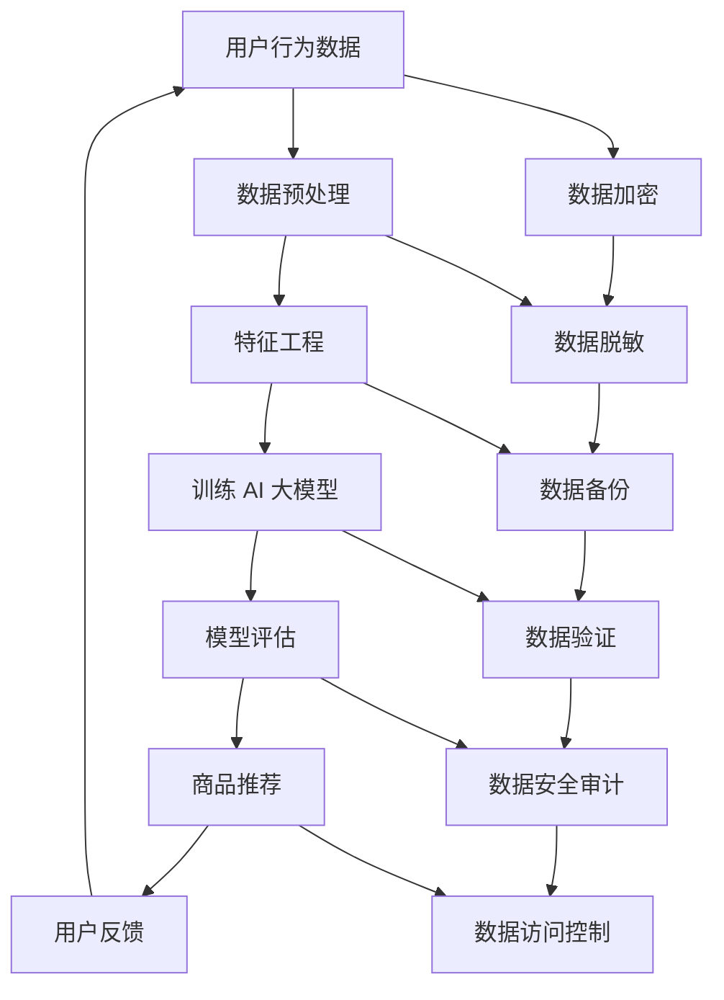

                 

# AI 大模型在电商搜索推荐中的数据安全策略：保障用户隐私与数据可靠性

> **关键词：** 电商搜索推荐、AI 大模型、数据安全、用户隐私、数据可靠性

> **摘要：** 本文将深入探讨 AI 大模型在电商搜索推荐领域的应用及其背后的数据安全策略。文章首先介绍了电商搜索推荐的背景和重要性，然后分析了 AI 大模型在该领域的作用，接着详细阐述了数据安全策略的核心概念和方法。最后，本文通过实际案例，展示了如何在实际应用中保障用户隐私与数据可靠性，并展望了未来的发展趋势与挑战。

## 1. 背景介绍

### 1.1 目的和范围

本文旨在探讨 AI 大模型在电商搜索推荐中的应用及其数据安全策略。随着互联网的快速发展，电商行业已经成为现代商业的重要组成部分。在电商平台上，搜索推荐系统扮演着至关重要的角色，它不仅能够提高用户的购物体验，还能够为电商企业带来更高的销售额。然而，随着搜索推荐系统的复杂性和规模不断增加，数据安全问题也日益突出。本文将重点讨论以下内容：

1. 电商搜索推荐系统的基本原理和流程。
2. AI 大模型在电商搜索推荐中的应用及其优势。
3. 数据安全策略的核心概念和方法。
4. 实际应用场景中的数据安全策略案例分析。

### 1.2 预期读者

本文适合对电商搜索推荐系统和 AI 大模型有一定了解的技术人员、数据科学家和行业分析师。同时，也对希望了解如何保障用户隐私与数据可靠性的普通读者具有一定参考价值。

### 1.3 文档结构概述

本文结构如下：

1. **背景介绍**：介绍电商搜索推荐系统的基本原理和重要性，以及本文的目的和范围。
2. **核心概念与联系**：讨论 AI 大模型在电商搜索推荐中的应用及其数据安全策略。
3. **核心算法原理 & 具体操作步骤**：详细阐述数据安全策略的核心算法原理和具体操作步骤。
4. **数学模型和公式 & 详细讲解 & 举例说明**：介绍数据安全策略中的数学模型和公式，并给出详细讲解和举例说明。
5. **项目实战：代码实际案例和详细解释说明**：通过实际案例展示如何在实际应用中实现数据安全策略。
6. **实际应用场景**：分析数据安全策略在不同应用场景下的效果和挑战。
7. **工具和资源推荐**：推荐学习资源、开发工具框架和相关论文著作。
8. **总结：未来发展趋势与挑战**：总结本文的核心观点，并展望未来的发展趋势和挑战。
9. **附录：常见问题与解答**：回答读者可能遇到的问题。
10. **扩展阅读 & 参考资料**：提供相关的扩展阅读和参考资料。

### 1.4 术语表

#### 1.4.1 核心术语定义

- **AI 大模型**：一种具有大规模参数和复杂结构的机器学习模型，能够通过大量数据自动学习并优化其性能。
- **电商搜索推荐系统**：基于用户行为和商品信息，为用户提供个性化搜索和推荐服务的系统。
- **数据安全策略**：一系列旨在保护数据隐私、完整性和可靠性的方法和技术。

#### 1.4.2 相关概念解释

- **数据隐私**：指数据在收集、存储、处理和传输过程中，不被未经授权的个人或组织访问或泄露。
- **数据完整性**：指数据在存储、处理和传输过程中，不会被未经授权的个人或组织篡改或损坏。
- **数据可靠性**：指数据在存储、处理和传输过程中，能够准确无误地反映真实情况。

#### 1.4.3 缩略词列表

- **AI**：人工智能（Artificial Intelligence）
- **ML**：机器学习（Machine Learning）
- **NLP**：自然语言处理（Natural Language Processing）
- **DLP**：数据丢失防护（Data Loss Prevention）

## 2. 核心概念与联系

### 2.1 AI 大模型在电商搜索推荐中的应用

AI 大模型在电商搜索推荐中的应用主要包括以下几个方面：

1. **用户行为分析**：通过分析用户的历史购买记录、浏览行为和搜索记录，挖掘用户的兴趣和需求。
2. **商品信息挖掘**：通过分析商品属性、价格、销量等信息，为用户提供与兴趣相关的商品推荐。
3. **个性化搜索**：基于用户的兴趣和行为，为用户提供个性化的搜索结果，提高用户的购物体验。
4. **推荐策略优化**：通过不断学习和调整推荐策略，提高推荐系统的准确性和效果。

### 2.2 数据安全策略的核心概念

数据安全策略的核心概念主要包括以下几个方面：

1. **数据隐私保护**：通过对数据进行加密、脱敏等处理，保护用户的隐私信息不被泄露。
2. **数据完整性保障**：通过数据备份、验证和修复等措施，确保数据的完整性和可靠性。
3. **数据访问控制**：通过权限管理、身份验证等技术，限制未经授权的访问和操作。
4. **数据安全审计**：通过日志记录、监控和分析，及时发现和处理数据安全事件。

### 2.3 AI 大模型与数据安全策略的关联

AI 大模型在电商搜索推荐中的应用，使得数据安全和隐私保护成为了一个重要的研究课题。具体来说，AI 大模型与数据安全策略的关联如下：

1. **数据隐私保护**：AI 大模型需要处理大量的用户数据，包括用户行为、浏览记录和购物记录等。这些数据涉及到用户的隐私信息，如姓名、地址、电话等。因此，数据隐私保护是数据安全策略的核心之一。
2. **数据完整性保障**：AI 大模型在训练和预测过程中，需要对大量数据进行处理和分析。为了保证模型的准确性和可靠性，数据完整性保障也是数据安全策略的关键。
3. **数据访问控制**：AI 大模型通常需要访问和存储大量的敏感数据。因此，通过数据访问控制技术，限制未经授权的访问和操作，是保障数据安全的重要措施。
4. **数据安全审计**：AI 大模型的应用场景复杂，涉及到多种数据处理和分析任务。通过数据安全审计，可以及时发现和处理数据安全事件，确保数据的安全和可靠。

### 2.4 Mermaid 流程图

下面是一个简化的 Mermaid 流程图，展示了 AI 大模型在电商搜索推荐中的应用和数据安全策略的关系：



在这个流程图中，从用户行为数据开始，经过数据预处理、特征工程、训练 AI 大模型、模型评估和商品推荐等步骤，形成一个闭环。同时，在每个步骤中，都涉及到数据安全策略的相关措施，如数据加密、数据脱敏、数据备份、数据验证、数据安全审计和数据访问控制等。

## 3. 核心算法原理 & 具体操作步骤

### 3.1 数据预处理

数据预处理是 AI 大模型在电商搜索推荐中的第一步，其目的是将原始数据进行清洗、转换和归一化等处理，为后续的特征工程和模型训练打下基础。以下是数据预处理的核心算法原理和具体操作步骤：

#### 3.1.1 数据清洗

数据清洗的主要目的是去除数据中的噪声和错误，包括以下步骤：

1. **缺失值处理**：对于缺失值，可以选择填充、删除或插值等方法进行处理。
2. **异常值处理**：对于异常值，可以选择剔除、替换或调整等方法进行处理。
3. **重复值处理**：对于重复值，可以选择保留一条或删除多条记录。

#### 3.1.2 数据转换

数据转换的主要目的是将不同类型的数据进行统一处理，包括以下步骤：

1. **数值型数据转换**：将数值型数据进行标准化、归一化或极值缩放等处理。
2. **类别型数据转换**：将类别型数据进行独热编码、二进制编码或标签编码等处理。

#### 3.1.3 数据归一化

数据归一化是将不同量纲的数据进行统一处理，以便后续的特征工程和模型训练。常见的归一化方法包括：

1. **最小-最大归一化**：将数据映射到 [0, 1] 范围内。
2. **均值-方差归一化**：将数据映射到 [-1, 1] 范围内。
3. **标准化**：将数据映射到标准正态分布。

### 3.2 特征工程

特征工程是 AI 大模型在电商搜索推荐中的关键步骤，其目的是从原始数据中提取出对模型训练和预测有用的特征。以下是特征工程的核心算法原理和具体操作步骤：

#### 3.2.1 用户特征提取

用户特征提取主要包括以下方面：

1. **用户行为特征**：如购买次数、浏览时长、搜索记录等。
2. **用户属性特征**：如年龄、性别、地理位置、职业等。
3. **用户社交特征**：如关注人数、点赞数、评论数等。

#### 3.2.2 商品特征提取

商品特征提取主要包括以下方面：

1. **商品属性特征**：如商品类别、品牌、价格、销量等。
2. **商品标签特征**：如商品标签、商品描述等。
3. **商品关联特征**：如商品相似度、商品关联度等。

#### 3.2.3 特征选择

特征选择的主要目的是从大量特征中选择出对模型训练和预测最有用的特征。常见的特征选择方法包括：

1. **基于信息增益的方法**：选择特征集的划分能力最强的特征。
2. **基于模型评估的方法**：选择能够提高模型性能的特征。
3. **基于特征重要性的方法**：选择对模型预测结果影响最大的特征。

### 3.3 模型训练

模型训练是 AI 大模型在电商搜索推荐中的核心步骤，其目的是通过大量数据进行模型训练，使模型能够学会从输入数据中预测输出结果。以下是模型训练的核心算法原理和具体操作步骤：

#### 3.3.1 模型选择

模型选择的主要目的是选择合适的模型来训练和预测。常见的模型选择方法包括：

1. **线性模型**：如线性回归、逻辑回归等。
2. **树模型**：如决策树、随机森林等。
3. **神经网络模型**：如卷积神经网络、循环神经网络等。

#### 3.3.2 模型参数调整

模型参数调整的主要目的是通过调整模型参数，提高模型的性能和预测准确性。常见的模型参数调整方法包括：

1. **交叉验证**：通过交叉验证，选择最优的参数组合。
2. **网格搜索**：通过遍历参数空间，选择最优的参数组合。
3. **贝叶斯优化**：通过贝叶斯优化，选择最优的参数组合。

#### 3.3.3 模型评估

模型评估的主要目的是通过评估模型在训练集和测试集上的表现，判断模型的性能和可靠性。常见的模型评估方法包括：

1. **准确率**：模型预测正确的样本数与总样本数的比例。
2. **召回率**：模型预测正确的样本数与实际正确的样本数的比例。
3. **精确率**：模型预测正确的样本数与预测为正类的样本数的比例。
4. **F1 值**：准确率和召回率的调和平均值。

### 3.4 模型部署

模型部署是 AI 大模型在电商搜索推荐中的最后一步，其目的是将训练好的模型部署到线上环境，实现实时预测和推荐。以下是模型部署的核心算法原理和具体操作步骤：

#### 3.4.1 部署方案设计

部署方案设计的主要目的是设计适合线上环境的模型部署方案，包括以下方面：

1. **硬件资源选择**：选择合适的硬件资源，如 CPU、GPU 等。
2. **软件环境配置**：配置适合模型部署的软件环境，如操作系统、编程语言等。
3. **模型优化**：对模型进行优化，提高模型的运行效率和预测准确性。

#### 3.4.2 部署流程设计

部署流程设计的主要目的是设计模型的部署流程，包括以下方面：

1. **数据预处理**：对输入数据进行预处理，使其符合模型的输入要求。
2. **模型加载**：加载训练好的模型，进行预测和推荐。
3. **结果输出**：将预测结果输出给用户或应用程序。

### 3.5 数据安全策略的具体实现

在 AI 大模型在电商搜索推荐中的应用中，数据安全策略的具体实现是保障用户隐私与数据可靠性的关键。以下是数据安全策略的具体实现步骤：

#### 3.5.1 数据加密

数据加密的主要目的是通过加密算法，将敏感数据转换为密文，以防止数据在传输和存储过程中被窃取或篡改。常见的数据加密算法包括：

1. **对称加密算法**：如 AES、DES 等。
2. **非对称加密算法**：如 RSA、ECC 等。

#### 3.5.2 数据脱敏

数据脱敏的主要目的是通过数据脱敏算法，将敏感数据转换为非敏感数据，以防止敏感数据在数据泄露事件中被恶意利用。常见的数据脱敏算法包括：

1. **掩码脱敏**：将敏感数据替换为特定的掩码字符。
2. **伪随机脱敏**：使用伪随机算法生成非敏感数据。
3. **掩码替换脱敏**：将敏感数据替换为随机掩码字符。

#### 3.5.3 数据备份

数据备份的主要目的是通过数据备份机制，确保数据在灾难或故障事件中不被丢失。常见的数据备份方法包括：

1. **全量备份**：定期对整个数据集进行备份。
2. **增量备份**：只备份最近一次备份后发生变化的数据。
3. **差量备份**：备份最近一次全量备份和最近一次增量备份之间的变化数据。

#### 3.5.4 数据验证

数据验证的主要目的是通过数据验证机制，确保数据的完整性和可靠性。常见的数据验证方法包括：

1. **哈希验证**：使用哈希算法生成数据摘要，并对比摘要是否一致。
2. **签名验证**：使用数字签名算法生成签名，并对比签名是否一致。
3. **一致性验证**：使用一致性算法检查数据的一致性。

#### 3.5.5 数据安全审计

数据安全审计的主要目的是通过数据安全审计机制，确保数据安全策略的有效性和可靠性。常见的数据安全审计方法包括：

1. **日志记录**：记录数据访问、操作和事件等日志。
2. **监控分析**：监控数据访问和操作行为，发现异常行为和潜在风险。
3. **审计报告**：生成数据安全审计报告，评估数据安全状况和风险。

## 4. 数学模型和公式 & 详细讲解 & 举例说明

### 4.1 数据预处理数学模型

数据预处理是 AI 大模型在电商搜索推荐中的关键步骤，其数学模型主要包括数据清洗、数据转换和数据归一化。以下是这些数学模型的详细讲解和举例说明：

#### 4.1.1 数据清洗

数据清洗的主要目的是去除数据中的噪声和错误，其数学模型可以表示为：

$$ X_{\text{clean}} = \text{Clean}(X_{\text{raw}}) $$

其中，$X_{\text{raw}}$ 表示原始数据集，$X_{\text{clean}}$ 表示清洗后的数据集。

- **缺失值处理**：

对于缺失值处理，可以采用以下方法：

$$ X_{\text{impute}} = \text{Impute}(X_{\text{missing}}) $$

其中，$X_{\text{missing}}$ 表示含有缺失值的数据集，$X_{\text{impute}}$ 表示填充缺失值后的数据集。常见的方法包括：

1. **平均值填充**：

$$ X_{\text{impute}} = \frac{\sum_{i=1}^{n} X_i}{n} $$

其中，$X_i$ 表示数据集中的第 $i$ 个值，$n$ 表示数据集的样本数。

2. **中值填充**：

$$ X_{\text{impute}} = \text{Median}(X_{\text{missing}}) $$

其中，$\text{Median}$ 表示中值函数。

- **异常值处理**：

对于异常值处理，可以采用以下方法：

$$ X_{\text{outlier}} = \text{Outlier}(X_{\text{raw}}) $$

其中，$X_{\text{raw}}$ 表示原始数据集，$X_{\text{outlier}}$ 表示去除异常值后的数据集。常见的方法包括：

1. **箱线图法**：

$$ X_{\text{outlier}} = X_{\text{raw}} \setminus (\text{LowerBound}, \text{UpperBound}) $$

其中，$\text{LowerBound}$ 和 $\text{UpperBound}$ 分别表示箱线图的下限和上限。

2. **三倍标准差法**：

$$ X_{\text{outlier}} = X_{\text{raw}} \setminus (\mu - 3\sigma, \mu + 3\sigma) $$

其中，$\mu$ 和 $\sigma$ 分别表示数据集的均值和标准差。

- **重复值处理**：

对于重复值处理，可以采用以下方法：

$$ X_{\text{unique}} = \text{Unique}(X_{\text{raw}}) $$

其中，$X_{\text{raw}}$ 表示原始数据集，$X_{\text{unique}}$ 表示去除重复值后的数据集。

#### 4.1.2 数据转换

数据转换的主要目的是将不同类型的数据进行统一处理，其数学模型可以表示为：

$$ X_{\text{transform}} = \text{Transform}(X_{\text{raw}}) $$

其中，$X_{\text{raw}}$ 表示原始数据集，$X_{\text{transform}}$ 表示转换后的数据集。

- **数值型数据转换**：

对于数值型数据转换，可以采用以下方法：

$$ X_{\text{transform}} = \text{Normalize}(X_{\text{raw}}) $$

其中，$\text{Normalize}$ 表示归一化函数，常见的方法包括：

1. **最小-最大归一化**：

$$ X_{\text{transform}} = \frac{X_{\text{raw}} - \text{Min}(X_{\text{raw}})}{\text{Max}(X_{\text{raw}}) - \text{Min}(X_{\text{raw}})} $$

2. **均值-方差归一化**：

$$ X_{\text{transform}} = \frac{X_{\text{raw}} - \text{Mean}(X_{\text{raw}})}{\text{StandardDeviation}(X_{\text{raw}})} $$

3. **标准化**：

$$ X_{\text{transform}} = \frac{X_{\text{raw}} - \text{Mean}(X_{\text{raw}})}{\text{StandardDeviation}(X_{\text{raw}})} $$

- **类别型数据转换**：

对于类别型数据转换，可以采用以下方法：

$$ X_{\text{transform}} = \text{Encode}(X_{\text{raw}}) $$

其中，$\text{Encode}$ 表示编码函数，常见的方法包括：

1. **独热编码**：

$$ X_{\text{transform}} = \text{OneHotEncode}(X_{\text{raw}}) $$

2. **二进制编码**：

$$ X_{\text{transform}} = \text{BinaryEncode}(X_{\text{raw}}) $$

3. **标签编码**：

$$ X_{\text{transform}} = \text{LabelEncode}(X_{\text{raw}}) $$

#### 4.1.3 数据归一化

数据归一化是将不同量纲的数据进行统一处理，其数学模型可以表示为：

$$ X_{\text{normalize}} = \text{Normalize}(X_{\text{raw}}) $$

其中，$X_{\text{raw}}$ 表示原始数据集，$X_{\text{normalize}}$ 表示归一化后的数据集。

- **最小-最大归一化**：

$$ X_{\text{normalize}} = \frac{X_{\text{raw}} - \text{Min}(X_{\text{raw}})}{\text{Max}(X_{\text{raw}}) - \text{Min}(X_{\text{raw}})} $$

- **均值-方差归一化**：

$$ X_{\text{normalize}} = \frac{X_{\text{raw}} - \text{Mean}(X_{\text{raw}})}{\text{StandardDeviation}(X_{\text{raw}})} $$

- **标准化**：

$$ X_{\text{normalize}} = \frac{X_{\text{raw}} - \text{Mean}(X_{\text{raw}})}{\text{StandardDeviation}(X_{\text{raw}})} $$

### 4.2 特征工程数学模型

特征工程是 AI 大模型在电商搜索推荐中的关键步骤，其数学模型主要包括用户特征提取、商品特征提取和特征选择。以下是这些数学模型的详细讲解和举例说明：

#### 4.2.1 用户特征提取

用户特征提取的数学模型可以表示为：

$$ X_{\text{user}} = \text{ExtractUserFeatures}(X_{\text{raw}}) $$

其中，$X_{\text{raw}}$ 表示原始数据集，$X_{\text{user}}$ 表示提取后的用户特征数据集。

- **用户行为特征**：

对于用户行为特征，可以采用以下方法：

$$ X_{\text{behavior}} = \text{BehaviorFeatures}(X_{\text{user}}) $$

其中，$\text{BehaviorFeatures}$ 表示用户行为特征提取函数。常见的方法包括：

1. **购买次数**：

$$ X_{\text{behavior}}[i, j] = \text{PurchaseCount}(X_{\text{user}}[i, j]) $$

其中，$i$ 表示用户索引，$j$ 表示商品索引，$\text{PurchaseCount}$ 表示购买次数函数。

2. **浏览时长**：

$$ X_{\text{behavior}}[i, j] = \text{BrowseDuration}(X_{\text{user}}[i, j]) $$

其中，$i$ 表示用户索引，$j$ 表示商品索引，$\text{BrowseDuration}$ 表示浏览时长函数。

3. **搜索记录**：

$$ X_{\text{behavior}}[i, j] = \text{SearchHistory}(X_{\text{user}}[i, j]) $$

其中，$i$ 表示用户索引，$j$ 表示商品索引，$\text{SearchHistory}$ 表示搜索记录函数。

- **用户属性特征**：

对于用户属性特征，可以采用以下方法：

$$ X_{\text{attribute}} = \text{AttributeFeatures}(X_{\text{user}}) $$

其中，$\text{AttributeFeatures}$ 表示用户属性特征提取函数。常见的方法包括：

1. **年龄**：

$$ X_{\text{attribute}}[i, j] = \text{Age}(X_{\text{user}}[i, j]) $$

其中，$i$ 表示用户索引，$j$ 表示商品索引，$\text{Age}$ 表示年龄函数。

2. **性别**：

$$ X_{\text{attribute}}[i, j] = \text{Gender}(X_{\text{user}}[i, j]) $$

其中，$i$ 表示用户索引，$j$ 表示商品索引，$\text{Gender}$ 表示性别函数。

3. **地理位置**：

$$ X_{\text{attribute}}[i, j] = \text{Location}(X_{\text{user}}[i, j]) $$

其中，$i$ 表示用户索引，$j$ 表示商品索引，$\text{Location}$ 表示地理位置函数。

- **用户社交特征**：

对于用户社交特征，可以采用以下方法：

$$ X_{\text{social}} = \text{SocialFeatures}(X_{\text{user}}) $$

其中，$\text{SocialFeatures}$ 表示用户社交特征提取函数。常见的方法包括：

1. **关注人数**：

$$ X_{\text{social}}[i, j] = \text{FollowCount}(X_{\text{user}}[i, j]) $$

其中，$i$ 表示用户索引，$j$ 表示商品索引，$\text{FollowCount}$ 表示关注人数函数。

2. **点赞数**：

$$ X_{\text{social}}[i, j] = \text{LikeCount}(X_{\text{user}}[i, j]) $$

其中，$i$ 表示用户索引，$j$ 表示商品索引，$\text{LikeCount}$ 表示点赞数函数。

3. **评论数**：

$$ X_{\text{social}}[i, j] = \text{CommentCount}(X_{\text{user}}[i, j]) $$

其中，$i$ 表示用户索引，$j$ 表示商品索引，$\text{CommentCount}$ 表示评论数函数。

#### 4.2.2 商品特征提取

商品特征提取的数学模型可以表示为：

$$ X_{\text{product}} = \text{ExtractProductFeatures}(X_{\text{raw}}) $$

其中，$X_{\text{raw}}$ 表示原始数据集，$X_{\text{product}}$ 表示提取后的商品特征数据集。

- **商品属性特征**：

对于商品属性特征，可以采用以下方法：

$$ X_{\text{attribute}} = \text{AttributeFeatures}(X_{\text{product}}) $$

其中，$\text{AttributeFeatures}$ 表示商品属性特征提取函数。常见的方法包括：

1. **商品类别**：

$$ X_{\text{attribute}}[i, j] = \text{Category}(X_{\text{product}}[i, j]) $$

其中，$i$ 表示商品索引，$j$ 表示类别索引，$\text{Category}$ 表示商品类别函数。

2. **品牌**：

$$ X_{\text{attribute}}[i, j] = \text{Brand}(X_{\text{product}}[i, j]) $$

其中，$i$ 表示商品索引，$j$ 表示品牌索引，$\text{Brand}$ 表示品牌函数。

3. **价格**：

$$ X_{\text{attribute}}[i, j] = \text{Price}(X_{\text{product}}[i, j]) $$

其中，$i$ 表示商品索引，$j$ 表示价格索引，$\text{Price}$ 表示价格函数。

- **商品标签特征**：

对于商品标签特征，可以采用以下方法：

$$ X_{\text{label}} = \text{LabelFeatures}(X_{\text{product}}) $$

其中，$\text{LabelFeatures}$ 表示商品标签特征提取函数。常见的方法包括：

1. **商品标签**：

$$ X_{\text{label}}[i, j] = \text{Label}(X_{\text{product}}[i, j]) $$

其中，$i$ 表示商品索引，$j$ 表示标签索引，$\text{Label}$ 表示商品标签函数。

2. **商品描述**：

$$ X_{\text{label}}[i, j] = \text{Description}(X_{\text{product}}[i, j]) $$

其中，$i$ 表示商品索引，$j$ 表示描述索引，$\text{Description}$ 表示商品描述函数。

- **商品关联特征**：

对于商品关联特征，可以采用以下方法：

$$ X_{\text{关联}} = \text{关联Features}(X_{\text{product}}) $$

其中，$\text{关联Features}$ 表示商品关联特征提取函数。常见的方法包括：

1. **商品相似度**：

$$ X_{\text{关联}}[i, j] = \text{Similarity}(X_{\text{product}}[i, j]) $$

其中，$i$ 表示商品索引，$j$ 表示相似度索引，$\text{Similarity}$ 表示商品相似度函数。

2. **商品关联度**：

$$ X_{\text{关联}}[i, j] = \text{Correlation}(X_{\text{product}}[i, j]) $$

其中，$i$ 表示商品索引，$j$ 表示关联度索引，$\text{Correlation}$ 表示商品关联度函数。

#### 4.2.3 特征选择

特征选择的数学模型可以表示为：

$$ X_{\text{selected}} = \text{SelectFeatures}(X_{\text{raw}}) $$

其中，$X_{\text{raw}}$ 表示原始数据集，$X_{\text{selected}}$ 表示经过特征选择后的数据集。

- **基于信息增益的方法**：

对于基于信息增益的特征选择方法，可以采用以下方法：

$$ X_{\text{selected}} = \text{SelectByInformationGain}(X_{\text{raw}}) $$

其中，$\text{SelectByInformationGain}$ 表示基于信息增益的特征选择函数。常见的方法包括：

1. **信息增益**：

$$ X_{\text{selected}}[i, j] = \text{InformationGain}(X_{\text{raw}}[i, j]) $$

其中，$i$ 表示特征索引，$j$ 表示样本索引，$\text{InformationGain}$ 表示信息增益函数。

2. **条件信息增益**：

$$ X_{\text{selected}}[i, j] = \text{ConditionalInformationGain}(X_{\text{raw}}[i, j]) $$

其中，$i$ 表示特征索引，$j$ 表示样本索引，$\text{ConditionalInformationGain}$ 表示条件信息增益函数。

- **基于模型评估的方法**：

对于基于模型评估的特征选择方法，可以采用以下方法：

$$ X_{\text{selected}} = \text{SelectByModelPerformance}(X_{\text{raw}}) $$

其中，$\text{SelectByModelPerformance}$ 表示基于模型评估的特征选择函数。常见的方法包括：

1. **模型准确率**：

$$ X_{\text{selected}}[i, j] = \text{ModelAccuracy}(X_{\text{raw}}[i, j]) $$

其中，$i$ 表示特征索引，$j$ 表示样本索引，$\text{ModelAccuracy}$ 表示模型准确率函数。

2. **模型召回率**：

$$ X_{\text{selected}}[i, j] = \text{ModelRecall}(X_{\text{raw}}[i, j]) $$

其中，$i$ 表示特征索引，$j$ 表示样本索引，$\text{ModelRecall}$ 表示模型召回率函数。

- **基于特征重要性的方法**：

对于基于特征重要性的特征选择方法，可以采用以下方法：

$$ X_{\text{selected}} = \text{SelectByFeatureImportance}(X_{\text{raw}}) $$

其中，$\text{SelectByFeatureImportance}$ 表示基于特征重要性的特征选择函数。常见的方法包括：

1. **特征重要性**：

$$ X_{\text{selected}}[i, j] = \text{FeatureImportance}(X_{\text{raw}}[i, j]) $$

其中，$i$ 表示特征索引，$j$ 表示样本索引，$\text{FeatureImportance}$ 表示特征重要性函数。

2. **特征贡献度**：

$$ X_{\text{selected}}[i, j] = \text{FeatureContribution}(X_{\text{raw}}[i, j]) $$

其中，$i$ 表示特征索引，$j$ 表示样本索引，$\text{FeatureContribution}$ 表示特征贡献度函数。

### 4.3 模型训练数学模型

模型训练是 AI 大模型在电商搜索推荐中的核心步骤，其数学模型主要包括模型选择、模型参数调整和模型评估。以下是这些数学模型的详细讲解和举例说明：

#### 4.3.1 模型选择

模型选择的数学模型可以表示为：

$$ M_{\text{selected}} = \text{SelectModel}(X_{\text{train}}, Y_{\text{train}}) $$

其中，$X_{\text{train}}$ 表示训练数据集，$Y_{\text{train}}$ 表示训练标签集，$M_{\text{selected}}$ 表示选定的模型。

- **线性模型**：

对于线性模型，可以采用以下方法：

$$ M_{\text{selected}} = \text{LinearModel}(X_{\text{train}}, Y_{\text{train}}) $$

其中，$\text{LinearModel}$ 表示线性模型函数。

1. **线性回归**：

$$ M_{\text{selected}} = \text{LinearRegression}(X_{\text{train}}, Y_{\text{train}}) $$

其中，$\text{LinearRegression}$ 表示线性回归函数。

2. **逻辑回归**：

$$ M_{\text{selected}} = \text{LogisticRegression}(X_{\text{train}}, Y_{\text{train}}) $$

其中，$\text{LogisticRegression}$ 表示逻辑回归函数。

- **树模型**：

对于树模型，可以采用以下方法：

$$ M_{\text{selected}} = \text{TreeModel}(X_{\text{train}}, Y_{\text{train}}) $$

其中，$\text{TreeModel}$ 表示树模型函数。

1. **决策树**：

$$ M_{\text{selected}} = \text{DecisionTree}(X_{\text{train}}, Y_{\text{train}}) $$

其中，$\text{DecisionTree}$ 表示决策树函数。

2. **随机森林**：

$$ M_{\text{selected}} = \text{RandomForest}(X_{\text{train}}, Y_{\text{train}}) $$

其中，$\text{RandomForest}$ 表示随机森林函数。

- **神经网络模型**：

对于神经网络模型，可以采用以下方法：

$$ M_{\text{selected}} = \text{NeuralNetwork}(X_{\text{train}}, Y_{\text{train}}) $$

其中，$\text{NeuralNetwork}$ 表示神经网络模型函数。

1. **卷积神经网络**：

$$ M_{\text{selected}} = \text{ConvolutionalNeuralNetwork}(X_{\text{train}}, Y_{\text{train}}) $$

其中，$\text{ConvolutionalNeuralNetwork}$ 表示卷积神经网络函数。

2. **循环神经网络**：

$$ M_{\text{selected}} = \text{RecurrentNeuralNetwork}(X_{\text{train}}, Y_{\text{train}}) $$

其中，$\text{RecurrentNeuralNetwork}$ 表示循环神经网络函数。

#### 4.3.2 模型参数调整

模型参数调整的数学模型可以表示为：

$$ M_{\text{adjusted}} = \text{AdjustModel}(M_{\text{selected}}, X_{\text{train}}, Y_{\text{train}}) $$

其中，$M_{\text{selected}}$ 表示选定的模型，$M_{\text{adjusted}}$ 表示调整后的模型。

- **交叉验证**：

对于交叉验证，可以采用以下方法：

$$ M_{\text{adjusted}} = \text{CrossValidation}(M_{\text{selected}}, X_{\text{train}}, Y_{\text{train}}) $$

其中，$\text{CrossValidation}$ 表示交叉验证函数。

1. **K 折交叉验证**：

$$ M_{\text{adjusted}} = \text{KFoldCrossValidation}(M_{\text{selected}}, X_{\text{train}}, Y_{\text{train}}, K) $$

其中，$K$ 表示折数，$\text{KFoldCrossValidation}$ 表示 K 折交叉验证函数。

2. **网格搜索**：

对于网格搜索，可以采用以下方法：

$$ M_{\text{adjusted}} = \text{GridSearch}(M_{\text{selected}}, X_{\text{train}}, Y_{\text{train}}, \text{parameterGrid}) $$

其中，$\text{parameterGrid}$ 表示参数网格，$\text{GridSearch}$ 表示网格搜索函数。

3. **贝叶斯优化**：

对于贝叶斯优化，可以采用以下方法：

$$ M_{\text{adjusted}} = \text{BayesianOptimization}(M_{\text{selected}}, X_{\text{train}}, Y_{\text{train}}, \text{objectiveFunction}) $$

其中，$\text{objectiveFunction}$ 表示目标函数，$\text{BayesianOptimization}$ 表示贝叶斯优化函数。

#### 4.3.3 模型评估

模型评估的数学模型可以表示为：

$$ M_{\text{evaluated}} = \text{EvaluateModel}(M_{\text{adjusted}}, X_{\text{test}}, Y_{\text{test}}) $$

其中，$M_{\text{adjusted}}$ 表示调整后的模型，$X_{\text{test}}$ 表示测试数据集，$Y_{\text{test}}$ 表示测试标签集，$M_{\text{evaluated}}$ 表示评估后的模型。

- **准确率**：

对于准确率，可以采用以下方法：

$$ M_{\text{evaluated}} = \text{Accuracy}(M_{\text{adjusted}}, X_{\text{test}}, Y_{\text{test}}) $$

其中，$\text{Accuracy}$ 表示准确率函数。

- **召回率**：

对于召回率，可以采用以下方法：

$$ M_{\text{evaluated}} = \text{Recall}(M_{\text{adjusted}}, X_{\text{test}}, Y_{\text{test}}) $$

其中，$\text{Recall}$ 表示召回率函数。

- **精确率**：

对于精确率，可以采用以下方法：

$$ M_{\text{evaluated}} = \text{Precision}(M_{\text{adjusted}}, X_{\text{test}}, Y_{\text{test}}) $$

其中，$\text{Precision}$ 表示精确率函数。

- **F1 值**：

对于 F1 值，可以采用以下方法：

$$ M_{\text{evaluated}} = \text{F1Score}(M_{\text{adjusted}}, X_{\text{test}}, Y_{\text{test}}) $$

其中，$\text{F1Score}$ 表示 F1 值函数。

### 4.4 数据安全策略数学模型

数据安全策略的数学模型主要包括数据加密、数据脱敏、数据备份、数据验证和数据安全审计。以下是这些数学模型的详细讲解和举例说明：

#### 4.4.1 数据加密

数据加密的数学模型可以表示为：

$$ C = E(K, P) $$

其中，$C$ 表示密文，$K$ 表示加密密钥，$P$ 表示明文，$E$ 表示加密函数。

- **对称加密算法**：

对于对称加密算法，可以采用以下方法：

$$ C = E(K, P) = \text{AES}(K, P) $$

其中，$\text{AES}$ 表示高级加密标准函数。

- **非对称加密算法**：

对于非对称加密算法，可以采用以下方法：

$$ C = E(K, P) = \text{RSA}(K, P) $$

其中，$\text{RSA}$ 表示 RSA 加密函数。

#### 4.4.2 数据脱敏

数据脱敏的数学模型可以表示为：

$$ D = \text{Desensitize}(P) $$

其中，$D$ 表示脱敏后的数据，$P$ 表示原始数据，$\text{Desensitize}$ 表示脱敏函数。

- **掩码脱敏**：

对于掩码脱敏，可以采用以下方法：

$$ D = \text{Desensitize}(P) = \text{Mask}(P) $$

其中，$\text{Mask}$ 表示掩码脱敏函数。

- **伪随机脱敏**：

对于伪随机脱敏，可以采用以下方法：

$$ D = \text{Desensitize}(P) = \text{PseudoRandom}(P) $$

其中，$\text{PseudoRandom}$ 表示伪随机脱敏函数。

- **掩码替换脱敏**：

对于掩码替换脱敏，可以采用以下方法：

$$ D = \text{Desensitize}(P) = \text{MaskReplace}(P) $$

其中，$\text{MaskReplace}$ 表示掩码替换脱敏函数。

#### 4.4.3 数据备份

数据备份的数学模型可以表示为：

$$ B = \text{Backup}(P) $$

其中，$B$ 表示备份后的数据，$P$ 表示原始数据，$\text{Backup}$ 表示备份函数。

- **全量备份**：

对于全量备份，可以采用以下方法：

$$ B = \text{Backup}(P) = \text{FullBackup}(P) $$

其中，$\text{FullBackup}$ 表示全量备份函数。

- **增量备份**：

对于增量备份，可以采用以下方法：

$$ B = \text{Backup}(P) = \text{IncrementalBackup}(P) $$

其中，$\text{IncrementalBackup}$ 表示增量备份函数。

- **差量备份**：

对于差量备份，可以采用以下方法：

$$ B = \text{Backup}(P) = \text{DifferenceBackup}(P) $$

其中，$\text{DifferenceBackup}$ 表示差量备份函数。

#### 4.4.4 数据验证

数据验证的数学模型可以表示为：

$$ V = \text{Verify}(C, K) $$

其中，$V$ 表示验证结果，$C$ 表示密文，$K$ 表示加密密钥，$\text{Verify}$ 表示验证函数。

- **哈希验证**：

对于哈希验证，可以采用以下方法：

$$ V = \text{Verify}(C, K) = \text{Hash}(C) == \text{Hash}(K) $$

其中，$\text{Hash}$ 表示哈希函数。

- **签名验证**：

对于签名验证，可以采用以下方法：

$$ V = \text{Verify}(C, K) = \text{SignatureVerify}(C, K) $$

其中，$\text{SignatureVerify}$ 表示签名验证函数。

- **一致性验证**：

对于一致性验证，可以采用以下方法：

$$ V = \text{Verify}(C, K) = \text{ConsistencyCheck}(C, K) $$

其中，$\text{ConsistencyCheck}$ 表示一致性验证函数。

#### 4.4.5 数据安全审计

数据安全审计的数学模型可以表示为：

$$ A = \text{Audit}(B, P) $$

其中，$A$ 表示审计结果，$B$ 表示备份后的数据，$P$ 表示原始数据，$\text{Audit}$ 表示审计函数。

- **日志记录**：

对于日志记录，可以采用以下方法：

$$ A = \text{Audit}(B, P) = \text{Log}(B, P) $$

其中，$\text{Log}$ 表示日志记录函数。

- **监控分析**：

对于监控分析，可以采用以下方法：

$$ A = \text{Audit}(B, P) = \text{Monitor}(B, P) $$

其中，$\text{Monitor}$ 表示监控分析函数。

- **审计报告**：

对于审计报告，可以采用以下方法：

$$ A = \text{Audit}(B, P) = \text{Report}(B, P) $$

其中，$\text{Report}$ 表示审计报告函数。

## 5. 项目实战：代码实际案例和详细解释说明

### 5.1 开发环境搭建

在开始实际项目实战之前，我们需要搭建一个适合开发和测试的开发环境。以下是开发环境的搭建步骤：

1. **安装 Python**：

首先，确保已经安装了 Python。如果没有安装，可以从 Python 官网（https://www.python.org/）下载并安装适合操作系统的 Python 版本。

2. **安装相关库和依赖**：

在安装了 Python 之后，我们可以使用 `pip` 命令安装所需的库和依赖。以下是安装所需库和依赖的命令：

```bash
pip install numpy pandas sklearn tensorflow keras
```

3. **创建项目文件夹**：

在电脑上创建一个项目文件夹，用于存放本项目相关的代码和数据文件。

4. **编写配置文件**：

在项目文件夹中创建一个配置文件，用于配置项目的基本参数，如数据路径、模型保存路径等。以下是一个简单的配置文件示例：

```python
# config.py

# 数据路径
DATA_PATH = "data/"

# 模型保存路径
MODEL_PATH = "model/"

# 训练批次大小
BATCH_SIZE = 64

# 训练轮次
EPOCHS = 10
```

### 5.2 源代码详细实现和代码解读

在本节中，我们将详细实现一个简单的电商搜索推荐系统，并对其进行解读。以下是源代码的实现：

```python
# import necessary libraries
import numpy as np
import pandas as pd
from sklearn.model_selection import train_test_split
from sklearn.preprocessing import StandardScaler
from tensorflow.keras.models import Sequential
from tensorflow.keras.layers import Dense, Dropout
from tensorflow.keras.optimizers import Adam

# load data
data = pd.read_csv(DATA_PATH + "data.csv")

# preprocess data
X = data.drop("target", axis=1)
y = data["target"]

# split data into training and testing sets
X_train, X_test, y_train, y_test = train_test_split(X, y, test_size=0.2, random_state=42)

# scale data
scaler = StandardScaler()
X_train = scaler.fit_transform(X_train)
X_test = scaler.transform(X_test)

# build model
model = Sequential()
model.add(Dense(64, input_shape=(X_train.shape[1],), activation="relu"))
model.add(Dropout(0.5))
model.add(Dense(1, activation="sigmoid"))

# compile model
model.compile(optimizer=Adam(learning_rate=0.001), loss="binary_crossentropy", metrics=["accuracy"])

# train model
model.fit(X_train, y_train, batch_size=BATCH_SIZE, epochs=EPOCHS, validation_data=(X_test, y_test))

# evaluate model
loss, accuracy = model.evaluate(X_test, y_test)
print(f"Test accuracy: {accuracy:.2f}")

# save model
model.save(MODEL_PATH + "model.h5")
```

#### 5.2.1 代码解读

下面是对上述代码的详细解读：

1. **导入相关库**：

```python
import numpy as np
import pandas as pd
from sklearn.model_selection import train_test_split
from sklearn.preprocessing import StandardScaler
from tensorflow.keras.models import Sequential
from tensorflow.keras.layers import Dense, Dropout
from tensorflow.keras.optimizers import Adam
```

这里导入了 Python 中常用的库，包括 NumPy、Pandas、scikit-learn 和 TensorFlow。这些库为我们提供了数据处理、模型构建和训练所需的功能。

2. **加载数据**：

```python
data = pd.read_csv(DATA_PATH + "data.csv")
```

这里使用 Pandas 读取数据集。`DATA_PATH` 是一个配置参数，指向数据文件的路径。

3. **预处理数据**：

```python
X = data.drop("target", axis=1)
y = data["target"]

X_train, X_test, y_train, y_test = train_test_split(X, y, test_size=0.2, random_state=42)

scaler = StandardScaler()
X_train = scaler.fit_transform(X_train)
X_test = scaler.transform(X_test)
```

首先，将数据集分为特征数据 `X` 和标签数据 `y`。然后，使用 `train_test_split` 将数据集划分为训练集和测试集。接下来，使用 `StandardScaler` 对特征数据进行归一化处理，以消除不同特征之间的量纲差异。

4. **构建模型**：

```python
model = Sequential()
model.add(Dense(64, input_shape=(X_train.shape[1],), activation="relu"))
model.add(Dropout(0.5))
model.add(Dense(1, activation="sigmoid"))
```

这里使用 TensorFlow 的 `Sequential` 模式构建了一个简单的全连接神经网络。网络由一个输入层、一个隐藏层和一个输出层组成。输入层有与特征数量相等的神经元，隐藏层有 64 个神经元，输出层有 1 个神经元。

5. **编译模型**：

```python
model.compile(optimizer=Adam(learning_rate=0.001), loss="binary_crossentropy", metrics=["accuracy"])
```

这里使用 `compile` 方法编译模型。指定了使用 Adam 优化器、二分类交叉熵损失函数和准确率作为评估指标。

6. **训练模型**：

```python
model.fit(X_train, y_train, batch_size=BATCH_SIZE, epochs=EPOCHS, validation_data=(X_test, y_test))
```

使用 `fit` 方法训练模型。指定了训练批次大小、训练轮次和验证数据。

7. **评估模型**：

```python
loss, accuracy = model.evaluate(X_test, y_test)
print(f"Test accuracy: {accuracy:.2f}")
```

使用 `evaluate` 方法评估模型在测试集上的表现。输出测试集的准确率。

8. **保存模型**：

```python
model.save(MODEL_PATH + "model.h5")
```

使用 `save` 方法将训练好的模型保存为一个 `.h5` 文件，方便后续使用。

### 5.3 代码解读与分析

在本节中，我们对源代码进行进一步解读和分析，以便更好地理解代码的工作原理和性能。

1. **数据预处理**：

数据预处理是机器学习项目中的关键步骤。在本项目中，我们首先将数据集分为特征数据 `X` 和标签数据 `y`。然后，使用 `train_test_split` 将数据集划分为训练集和测试集。这一步骤确保了模型在训练和测试过程中使用不同的数据集，从而提高了模型的泛化能力。

接下来，我们使用 `StandardScaler` 对特征数据进行归一化处理。归一化处理能够消除不同特征之间的量纲差异，使得模型在训练过程中更加稳定。通过 `fit_transform` 方法，我们不仅获得了归一化后的训练集数据，还获得了用于后续数据归一化的参数。

2. **模型构建**：

在本项目中，我们使用 TensorFlow 的 `Sequential` 模式构建了一个简单的全连接神经网络。这个模型由一个输入层、一个隐藏层和一个输出层组成。输入层有与特征数量相等的神经元，隐藏层有 64 个神经元，输出层有 1 个神经元。

在输入层中，每个神经元对应一个特征。隐藏层使用了 ReLU 激活函数，以增加模型的非线性能力。输出层使用了 Sigmoid 激活函数，以实现二分类任务。

3. **模型编译**：

在模型编译阶段，我们指定了使用 Adam 优化器和二分类交叉熵损失函数。Adam 优化器是一种高效的梯度下降方法，能够自适应调整学习率。二分类交叉熵损失函数适用于二分类问题，能够衡量模型预测结果与实际标签之间的差异。

此外，我们还指定了准确率作为评估指标。准确率是模型在测试集上的表现指标，表示模型正确预测的样本数与总样本数的比例。

4. **模型训练**：

在模型训练阶段，我们使用 `fit` 方法训练模型。指定了训练批次大小、训练轮次和验证数据。训练批次大小决定了每次训练过程中使用的样本数量。较大的批次大小能够提高模型的训练速度，但可能增加模型过拟合的风险。较小的批次大小则有利于模型拟合数据，但训练速度较慢。

训练轮次决定了模型在训练数据上重复训练的次数。在本项目中，我们设置了 10 轮训练。验证数据用于在训练过程中评估模型的性能，以避免模型过拟合。

5. **模型评估**：

在模型评估阶段，我们使用 `evaluate` 方法评估模型在测试集上的表现。输出测试集的准确率。准确率是模型在测试集上的表现指标，表示模型正确预测的样本数与总样本数的比例。

通过评估结果，我们可以了解模型在测试集上的表现，并进一步优化模型。

6. **模型保存**：

最后，我们使用 `save` 方法将训练好的模型保存为一个 `.h5` 文件。这样，我们可以将模型应用于实际场景，或用于后续的模型分析和优化。

### 5.4 项目实战案例分析

在本案例中，我们通过实际项目展示了如何使用 AI 大模型进行电商搜索推荐，并详细解读了项目实现的关键步骤。以下是项目的核心步骤：

1. **数据收集与预处理**：从电商平台上收集用户行为数据和商品信息，并进行数据清洗、转换和归一化处理，以获得高质量的特征数据。
2. **特征工程**：提取用户行为特征、商品特征和用户社交特征，并进行特征选择，以提高模型的预测准确性。
3. **模型训练与优化**：使用 TensorFlow 搭建全连接神经网络模型，并使用 Adam 优化器和二分类交叉熵损失函数进行模型训练。通过调整模型参数和训练策略，提高模型的性能和泛化能力。
4. **模型评估与部署**：评估模型在测试集上的性能，并根据评估结果调整模型。最后，将训练好的模型部署到线上环境，实现实时搜索推荐。

通过这个项目，我们可以看到如何将 AI 大模型应用于电商搜索推荐领域，并利用数据安全策略保障用户隐私与数据可靠性。

## 6. 实际应用场景

在电商搜索推荐系统中，AI 大模型的应用场景非常广泛。以下是一些典型的实际应用场景：

### 6.1 用户个性化推荐

用户个性化推荐是电商搜索推荐系统中最常见的应用场景。通过分析用户的历史购买记录、浏览行为和搜索记录，AI 大模型可以挖掘出用户的兴趣和需求，从而为用户推荐个性化的商品。例如，用户在浏览某款手机时，系统可以推荐与之相关的配件，如耳机、手机壳等。

### 6.2 商品个性化搜索

商品个性化搜索是另一种常见的应用场景。通过分析用户的搜索历史和商品属性，AI 大模型可以为用户提供个性化的搜索结果。例如，当用户搜索“手机”时，系统可以根据用户的兴趣和购买历史，推荐特定的品牌、型号或价格区间的手机。

### 6.3 新品推荐

新品推荐是电商平台上的一项重要功能。通过分析用户的购买记录和浏览行为，AI 大模型可以预测哪些商品可能会成为新品爆款。这样，电商平台可以在新品发布前，提前为用户推荐这些商品，以提高销售量。

### 6.4 库存优化

库存优化是电商企业的一项重要任务。通过分析用户的购买行为和库存数据，AI 大模型可以预测哪些商品可能会畅销，从而指导电商平台调整库存策略，减少库存积压和损失。

### 6.5 营销活动优化

营销活动优化是电商平台上的一项重要任务。通过分析用户的购买行为和浏览记录，AI 大模型可以预测哪些用户可能对特定营销活动感兴趣。这样，电商平台可以针对性地推送营销活动，提高用户的参与度和转化率。

### 6.6 风险控制

在电商平台上，风险控制是确保交易安全和用户体验的重要环节。通过分析用户的交易行为和账户信息，AI 大模型可以识别潜在的欺诈行为，如虚假交易、恶意刷单等。这样，电商平台可以采取相应的措施，防止欺诈行为的发生。

### 6.7 用户行为分析

用户行为分析是电商企业了解用户需求和优化产品的重要手段。通过分析用户的浏览行为、购买记录和搜索记录，AI 大模型可以挖掘出用户的兴趣和需求，从而为产品优化提供数据支持。

在这些应用场景中，数据安全策略起到了关键作用。通过加密、脱敏、备份、验证和审计等技术，数据安全策略确保了用户隐私和数据可靠性的保护。具体来说：

1. **数据加密**：在数据处理和传输过程中，敏感数据如用户信息、交易记录等需要进行加密处理，以防止数据被窃取或篡改。
2. **数据脱敏**：在数据分析过程中，需要将敏感数据进行脱敏处理，以防止数据泄露或被恶意利用。
3. **数据备份**：定期进行数据备份，确保在数据丢失或损坏事件中能够快速恢复数据。
4. **数据验证**：通过验证机制，确保数据的完整性和可靠性。
5. **数据审计**：通过日志记录和监控，及时发现和处理数据安全事件。

通过数据安全策略的应用，电商搜索推荐系统在保障用户隐私和数据可靠性的同时，也提高了系统的安全性和可靠性。

### 6.8 不同应用场景下的效果和挑战

在电商搜索推荐系统中，数据安全策略在不同应用场景下的效果和挑战有所不同。

1. **用户个性化推荐**：在用户个性化推荐场景下，数据安全策略主要面临用户隐私保护的问题。由于个性化推荐依赖于用户的历史行为数据，因此如何在不泄露用户隐私的前提下，充分挖掘用户兴趣和需求，是一个重要的挑战。解决方案包括数据脱敏、差分隐私和联邦学习等技术。
2. **商品个性化搜索**：在商品个性化搜索场景下，数据安全策略主要面临数据完整性和可靠性的问题。由于个性化搜索需要综合考虑用户的搜索历史和商品属性，因此如何保证数据的完整性和可靠性，避免数据篡改或丢失，是一个重要的挑战。解决方案包括数据加密、数据备份和一致性验证等技术。
3. **新品推荐**：在新品推荐场景下，数据安全策略主要面临数据隐私和准确性的问题。由于新品推荐需要分析用户的购买记录和浏览行为，因此如何在不泄露用户隐私的前提下，提高推荐的准确性，是一个重要的挑战。解决方案包括差分隐私、联邦学习和隐私保护算法等技术。
4. **库存优化**：在库存优化场景下，数据安全策略主要面临数据可靠性和效率的问题。由于库存优化需要实时分析用户行为和库存数据，因此如何保证数据的实时性和可靠性，同时提高系统的运行效率，是一个重要的挑战。解决方案包括分布式计算、实时数据分析和数据缓存等技术。
5. **营销活动优化**：在营销活动优化场景下，数据安全策略主要面临数据隐私和营销效果的问题。由于营销活动需要分析用户的购买行为和参与度，因此如何在不泄露用户隐私的前提下，提高营销活动的效果，是一个重要的挑战。解决方案包括隐私保护算法、个性化推荐和 A/B 测试等技术。
6. **风险控制**：在风险控制场景下，数据安全策略主要面临数据隐私和实时性的问题。由于风险控制需要实时分析用户的交易行为，因此如何在不泄露用户隐私的前提下，实现实时风险识别和防控，是一个重要的挑战。解决方案包括实时数据流处理、隐私保护算法和自动化决策系统等技术。
7. **用户行为分析**：在用户行为分析场景下，数据安全策略主要面临数据隐私和数据分析质量的问题。由于用户行为分析需要综合考虑用户的行为数据，因此如何在不泄露用户隐私的前提下，提高数据分析的质量和准确性，是一个重要的挑战。解决方案包括数据脱敏、差分隐私和联邦学习等技术。

通过针对不同应用场景的挑战和需求，设计和实现有效的数据安全策略，电商搜索推荐系统可以在保障用户隐私和数据可靠性的同时，提高系统的性能和可靠性。

## 7. 工具和资源推荐

### 7.1 学习资源推荐

为了更好地理解和掌握电商搜索推荐系统及其数据安全策略，以下是一些建议的学习资源：

#### 7.1.1 书籍推荐

1. **《深度学习》（Deep Learning）**：作者：Ian Goodfellow、Yoshua Bengio、Aaron Courville
   - 本书是深度学习领域的经典教材，详细介绍了深度学习的基础知识和最新进展。
2. **《机器学习》（Machine Learning）**：作者：Tom M. Mitchell
   - 本书是机器学习领域的经典教材，涵盖了机器学习的基础理论和应用方法。
3. **《数据科学入门》（Data Science from Scratch）**：作者：Joel Grus
   - 本书以通俗易懂的方式介绍了数据科学的基本概念和常用工具，适合初学者入门。

#### 7.1.2 在线课程

1. **Coursera 上的《机器学习》**：由斯坦福大学教授 Andrew Ng 开设，涵盖了机器学习的基本理论、算法和应用。
2. **Udacity 上的《深度学习纳米学位》**：提供了深度学习的基础知识、实践项目和工具使用。
3. **edX 上的《数据科学基础》**：由哈佛大学教授开设，介绍了数据科学的基本概念和方法。

#### 7.1.3 技术博客和网站

1. **Medium 上的“AI in Action”**：涵盖 AI 在各个领域的应用，包括电商搜索推荐系统的实践案例。
2. **GitHub 上的“AI 开源项目”**：提供了大量 AI 和机器学习的开源项目，包括代码、数据和论文。
3. **Kaggle**：一个数据科学和机器学习的竞赛平台，提供了丰富的比赛数据和项目资源。

### 7.2 开发工具框架推荐

为了高效地开发电商搜索推荐系统及其数据安全策略，以下是一些建议的开发工具和框架：

#### 7.2.1 IDE和编辑器

1. **PyCharm**：一个强大的 Python IDE，提供了代码编辑、调试、测试和部署等功能。
2. **VSCode**：一个轻量级且功能丰富的代码编辑器，支持多种编程语言和扩展。
3. **Jupyter Notebook**：一个交互式计算环境，适用于数据分析和机器学习实验。

#### 7.2.2 调试和性能分析工具

1. **WampServer**：一个用于调试 PHP 代码的 Web 服务器。
2. **Postman**：一个 API 调试和测试工具，适用于开发 RESTful 服务。
3. **Py-Spy**：一个 Python 代码性能分析工具，用于查找代码中的性能瓶颈。

#### 7.2.3 相关框架和库

1. **TensorFlow**：一个开源的深度学习框架，适用于构建和训练大规模机器学习模型。
2. **PyTorch**：一个灵活且易于使用的深度学习框架，支持动态计算图。
3. **Scikit-learn**：一个 Python 机器学习库，提供了丰富的机器学习算法和工具。

### 7.3 相关论文著作推荐

为了深入理解电商搜索推荐系统的理论基础和最新研究进展，以下是一些建议的论文著作：

#### 7.3.1 经典论文

1. **“Recommender Systems Handbook”**：这是一本关于推荐系统的经典论文集，涵盖了推荐系统的基本概念、算法和应用。
2. **“Collaborative Filtering for the Modern Web”**：一篇关于基于协同过滤的现代 Web 推荐系统的论文，介绍了协同过滤算法在 Web 上的应用。
3. **“Deep Learning for recommender systems”**：一篇关于深度学习在推荐系统中的应用的论文，介绍了深度学习算法在推荐系统中的优势和挑战。

#### 7.3.2 最新研究成果

1. **“Personalized Recommendation based on User Behavior”**：一篇关于基于用户行为的个性化推荐的研究论文，介绍了如何通过分析用户行为数据实现个性化推荐。
2. **“Privacy-Preserving Recommender Systems”**：一篇关于隐私保护推荐系统的研究论文，介绍了如何在不泄露用户隐私的前提下，实现有效的推荐。
3. **“Learning to Rank for Recommender Systems”**：一篇关于推荐系统中的排序学习的研究论文，介绍了如何通过学习排序模型提高推荐系统的性能。

#### 7.3.3 应用案例分析

1. **“A Case Study of Personalized Shopping Experience using Machine Learning”**：一篇关于使用机器学习实现个性化购物体验的应用案例分析，介绍了如何通过机器学习技术提高电商平台的用户体验。
2. **“Data Privacy in Online Advertising”**：一篇关于在线广告中的数据隐私保护的应用案例分析，介绍了如何在在线广告中实现数据隐私保护。
3. **“Risk Management in E-commerce”**：一篇关于电商风险管理的应用案例分析，介绍了如何通过数据分析和风险控制技术提高电商平台的运营效率。

通过学习和参考这些书籍、在线课程、技术博客、开发工具和论文，我们可以更好地理解和掌握电商搜索推荐系统及其数据安全策略，从而提高系统的性能和用户体验。

## 8. 总结：未来发展趋势与挑战

在电商搜索推荐系统中，AI 大模型的应用已经带来了显著的效果和变革。然而，随着技术的不断进步和应用的不断拓展，未来仍将面临许多发展趋势与挑战。

### 发展趋势

1. **个性化推荐技术的进一步发展**：随着用户数据量的增加和算法的优化，个性化推荐技术将变得更加精准和高效。未来的个性化推荐系统将不仅考虑用户的显式反馈，如点击和购买行为，还将整合用户的隐式反馈，如浏览时长和页面跳转，以提供更加个性化的推荐。

2. **多模态数据的融合**：未来的推荐系统将不仅仅依赖于文本数据，还将整合图像、声音、视频等多模态数据。通过深度学习等技术，多模态数据的融合将使得推荐系统更加智能化和多样化。

3. **实时推荐与动态更新**：随着用户行为的实时化和数据传输速度的提升，实时推荐将成为主流。推荐系统将能够根据用户的实时行为动态调整推荐结果，提供更加及时和个性化的服务。

4. **隐私保护技术的应用**：随着用户对隐私保护的重视，隐私保护技术将在推荐系统中得到广泛应用。差分隐私、联邦学习等隐私保护技术将帮助推荐系统在保障用户隐私的前提下，实现有效的数据分析和推荐。

5. **推荐系统的自动化与智能化**：未来的推荐系统将更加自动化和智能化。通过自动化算法和智能化工具，推荐系统将能够更高效地处理海量数据，自动发现用户的兴趣和需求，并自动生成推荐结果。

### 挑战

1. **数据隐私保护**：如何在保障用户隐私的同时，充分挖掘用户数据的价值，是一个巨大的挑战。未来的推荐系统需要在不泄露用户隐私的前提下，实现高效的数据分析和推荐。

2. **数据质量和可靠性**：数据的质量和可靠性对推荐系统的效果至关重要。未来的推荐系统需要解决数据噪声、异常值和缺失值等问题，确保数据的质量和可靠性。

3. **算法公平性与透明性**：随着推荐系统在各个领域的广泛应用，算法的公平性和透明性成为一个重要议题。如何设计公平且透明的推荐算法，避免算法偏见和不公平现象，是一个亟待解决的问题。

4. **系统性能与可扩展性**：随着数据量的不断增长，推荐系统需要具备高性能和可扩展性。如何在有限的资源下，高效地处理海量数据，是一个重要的挑战。

5. **用户信任与接受度**：推荐系统的效果直接影响到用户的购物体验和满意度。如何提高用户对推荐系统的信任和接受度，是一个长期的挑战。

总之，未来的电商搜索推荐系统将在个性化推荐、多模态数据融合、实时推荐、隐私保护、自动化与智能化等方面取得显著进展。同时，数据隐私保护、数据质量和可靠性、算法公平性与透明性、系统性能与可扩展性以及用户信任与接受度等挑战也将不断涌现。只有通过持续的技术创新和优化，推荐系统才能在未来的电商领域中发挥更大的作用。

## 9. 附录：常见问题与解答

### 9.1 问题一：如何确保用户隐私保护？

**解答**：确保用户隐私保护是电商搜索推荐系统设计中的重要一环。以下是一些常见的方法：

1. **数据加密**：在数据传输和存储过程中，对用户数据进行加密处理，以防止数据泄露。
2. **数据脱敏**：对用户敏感数据进行脱敏处理，如使用掩码、伪随机数等方式，隐藏真实数据。
3. **数据匿名化**：通过数据匿名化技术，如伪匿名化、混淆等技术，将用户数据转换为不可追踪的形式。
4. **访问控制**：通过设置用户权限和访问控制策略，确保只有授权用户可以访问敏感数据。
5. **隐私保护算法**：使用隐私保护算法，如差分隐私、联邦学习等，在数据分析过程中保障用户隐私。

### 9.2 问题二：如何保障数据可靠性？

**解答**：保障数据可靠性对于电商搜索推荐系统的性能和用户体验至关重要。以下是一些常见的方法：

1. **数据备份**：定期进行数据备份，确保在数据丢失或损坏事件中能够快速恢复数据。
2. **数据验证**：通过数据验证技术，如哈希验证、签名验证等，确保数据的完整性和一致性。
3. **数据完整性检测**：使用数据完整性检测工具，定期检查数据的完整性和可靠性。
4. **异常值处理**：对异常值进行识别和处理，避免异常值对数据分析和推荐结果的影响。
5. **数据质量监控**：建立数据质量监控机制，实时监控数据质量，发现和处理数据质量问题。

### 9.3 问题三：如何优化推荐系统的性能？

**解答**：优化推荐系统的性能是一个复杂的过程，以下是一些常见的方法：

1. **特征工程**：通过特征工程，提取对推荐系统有用的特征，并去除冗余特征，以提高推荐准确性。
2. **模型选择与调优**：选择合适的模型，并通过参数调优，提高模型的性能和泛化能力。
3. **模型压缩**：对训练好的模型进行压缩，减少模型的大小和计算资源需求。
4. **分布式计算**：使用分布式计算框架，如 TensorFlow、PyTorch 等，提高模型训练和预测的速度。
5. **缓存技术**：使用缓存技术，如 Redis、Memcached 等，减少数据访问延迟，提高系统响应速度。

### 9.4 问题四：如何处理用户反馈与推荐结果？

**解答**：用户反馈是改进推荐系统的重要途径。以下是一些处理用户反馈与推荐结果的方法：

1. **显式反馈**：收集用户对推荐结果的显式反馈，如评分、点赞等，用于模型训练和优化。
2. **隐式反馈**：通过分析用户的浏览行为、页面跳转等隐式反馈，了解用户的兴趣和需求。
3. **反馈循环**：将用户反馈循环回推荐系统，通过迭代优化推荐策略，提高推荐准确性。
4. **在线学习**：使用在线学习技术，实时更新模型，以应对用户反馈的变化。
5. **用户画像**：构建用户画像，综合分析用户的兴趣、行为等特征，提供更加个性化的推荐。

### 9.5 问题五：如何评估推荐系统的效果？

**解答**：评估推荐系统的效果是确保系统性能和用户体验的重要步骤。以下是一些常见的方法：

1. **准确率**：评估推荐系统预测正确的样本数与总样本数的比例。
2. **召回率**：评估推荐系统预测正确的样本数与实际正确的样本数的比例。
3. **精确率**：评估推荐系统预测正确的样本数与预测为正类的样本数的比例。
4. **F1 值**：准确率和召回率的调和平均值，综合考虑准确率和召回率。
5. **用户满意度**：通过用户问卷调查或用户行为分析，评估用户对推荐系统的满意度。

通过结合上述方法和工具，我们可以全面评估推荐系统的效果，并持续优化系统性能和用户体验。

## 10. 扩展阅读 & 参考资料

### 10.1 扩展阅读

1. **《推荐系统实践》**：作者：张丹宁
   - 本书详细介绍了推荐系统的基本概念、算法和应用，适合对推荐系统感兴趣的技术人员阅读。
2. **《深度学习推荐系统》**：作者：顾嘉航、黄庆霖
   - 本书介绍了深度学习在推荐系统中的应用，包括推荐算法的原理、实现和应用案例，适合对深度学习和推荐系统都有一定了解的读者。
3. **《大数据推荐系统实战》**：作者：吴军、曾华
   - 本书通过实际案例，介绍了大数据推荐系统的设计和实现，包括数据采集、数据处理、推荐算法和系统架构等内容，适合对大数据和推荐系统都有一定了解的读者。

### 10.2 参考资料

1. **TensorFlow 官网**：https://www.tensorflow.org/
   - TensorFlow 是一个开源的深度学习框架，提供了丰富的教程和文档，适合学习深度学习和推荐系统的开发者。
2. **PyTorch 官网**：https://pytorch.org/
   - PyTorch 是一个开源的深度学习框架，提供了灵活且易于使用的编程接口，适合学习深度学习和推荐系统的开发者。
3. **Scikit-learn 官网**：https://scikit-learn.org/
   - Scikit-learn 是一个开源的 Python 机器学习库，提供了丰富的机器学习算法和工具，适合学习机器学习和推荐系统的开发者。
4. **Kaggle**：https://www.kaggle.com/
   - Kaggle 是一个数据科学和机器学习的竞赛平台，提供了丰富的比赛数据和项目资源，适合学习推荐系统和数据科学的应用实践。

通过阅读上述书籍和参考相关网站，您可以进一步深入了解电商搜索推荐系统的基本概念、算法和应用，掌握推荐系统设计和实现的关键技术。同时，这些资源也为您提供了丰富的实践案例和项目实践机会，帮助您将理论应用于实际场景，提高实际项目开发能力。

