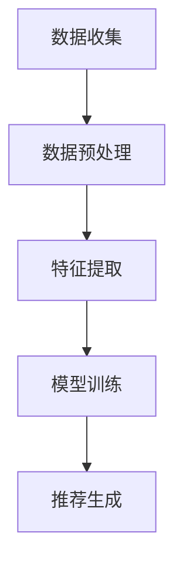
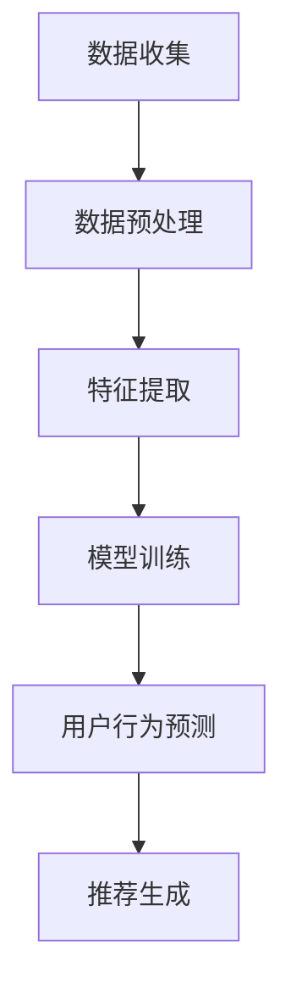
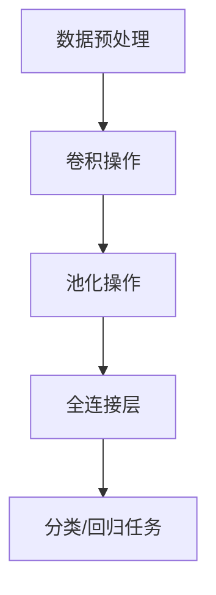
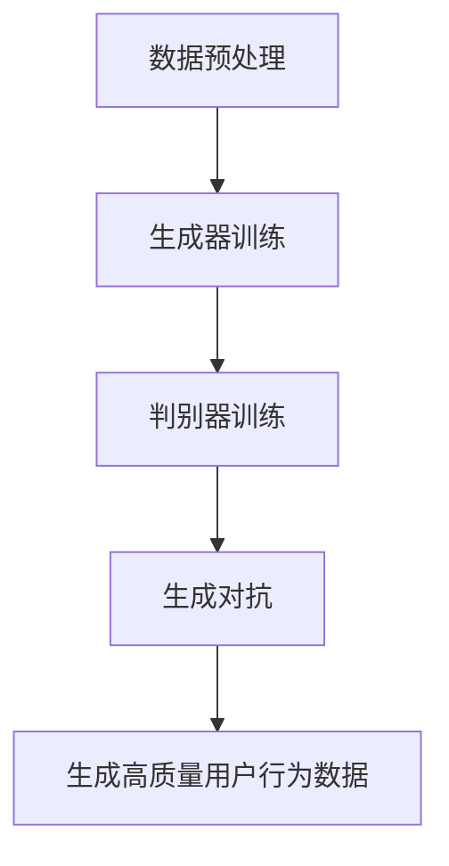
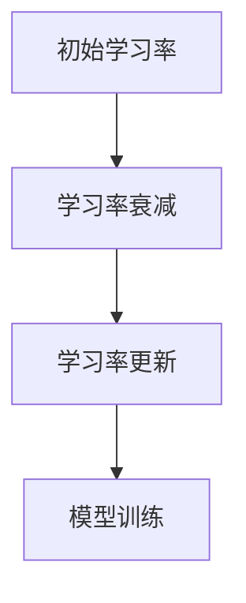

                 

# AI 大模型在电商搜索推荐中的用户行为分析：理解用户需求与购买偏好

## 摘要

本文旨在探讨 AI 大模型在电商搜索推荐领域中的应用，重点关注用户行为分析。通过深入理解用户需求与购买偏好，本文揭示了 AI 大模型如何通过精准的推荐算法，提升电商平台的用户体验与销售额。文章首先介绍了 AI 大模型的基本概念与工作原理，随后详细分析了用户行为数据收集与处理的流程，探讨了如何利用机器学习算法分析用户行为。接着，本文通过具体案例展示了如何构建一个高效的电商搜索推荐系统，并讨论了相关的挑战与解决方案。最后，文章总结了 AI 大模型在电商搜索推荐中的前景与未来发展趋势，以及面临的挑战。

## 1. 背景介绍

### 1.1 电商搜索推荐的重要性

在当今数字化时代，电商行业蓬勃发展，电商平台的搜索推荐功能成为吸引和留住用户的关键因素。有效的搜索推荐系统不仅可以提升用户体验，还能显著提高销售额。根据 Statista 的数据，个性化推荐系统可以将电商网站的销售额提高约 10% 至 30%[1]。

用户在电商平台上购物时，通常会经历以下流程：浏览、搜索、筛选、决策和购买。其中，搜索环节尤为关键。高效的搜索推荐系统可以迅速定位用户感兴趣的商品，减少用户筛选时间，提高购买概率。

### 1.2 AI 大模型的基本概念与优势

AI 大模型（如深度学习模型、生成对抗网络（GANs）等）是近年来人工智能领域的重要突破。这些模型具有强大的表示学习能力，可以处理大规模、复杂的数据集，从而实现高度个性化的推荐。

与传统的基于规则或协同过滤的推荐算法相比，AI 大模型具有以下优势：

1. **更强的泛化能力**：AI 大模型可以处理多种类型的数据，如文本、图像、音频等，并从中提取有价值的信息。
2. **更高的推荐准确性**：通过深度学习技术，AI 大模型可以捕捉到用户行为的细微变化，从而提供更准确的推荐。
3. **更好的扩展性**：AI 大模型可以轻松地集成到现有的电商平台系统中，无需大量修改原有代码。
4. **更丰富的应用场景**：AI 大模型不仅适用于电商搜索推荐，还可以应用于广告投放、金融风控、医疗诊断等多个领域。

### 1.3 用户行为分析的重要性

用户行为分析是电商搜索推荐系统的核心环节。通过对用户行为数据的收集、处理和分析，可以深入了解用户需求、购买偏好和兴趣点，从而为推荐系统提供可靠的依据。

用户行为分析的重要性体现在以下几个方面：

1. **个性化推荐**：通过分析用户行为数据，可以为用户提供更个性化的推荐，提高用户体验。
2. **需求预测**：通过分析用户行为数据，可以预测用户未来的购买需求，从而提前布局库存、营销策略等。
3. **风险控制**：通过分析用户行为数据，可以识别异常行为，如欺诈行为，从而降低风险。
4. **优化运营**：通过分析用户行为数据，可以优化电商平台的各种运营策略，如商品布局、广告投放、促销活动等。

## 2. 核心概念与联系

### 2.1 AI 大模型

AI 大模型是指使用大量数据进行训练，具备强大表示学习能力的人工智能模型。这些模型通常由多层神经网络组成，可以自动提取数据中的特征，实现高度复杂的数据分析任务。

**关键术语**：

- **深度学习**：一种机器学习方法，通过多层神经网络模型对数据进行训练，从而实现复杂的模式识别和预测任务。
- **生成对抗网络（GANs）**：一种由生成器和判别器组成的对抗性神经网络模型，用于生成高质量的伪数据。
- **自编码器**：一种特殊的神经网络模型，用于将输入数据压缩为低维表示，再从低维表示中重构原始数据。

### 2.2 用户行为数据

用户行为数据是指在电商平台上的各种用户操作记录，如浏览、搜索、点击、购买等。这些数据通常以日志形式存储，包括用户ID、时间戳、操作类型、商品ID等信息。

**关键术语**：

- **用户ID**：标识用户个体的唯一标识符。
- **时间戳**：记录用户行为发生的具体时间。
- **操作类型**：描述用户进行的操作，如浏览、搜索、点击、购买等。
- **商品ID**：标识用户操作的特定商品。

### 2.3 推荐算法

推荐算法是指用于生成推荐结果的一系列算法。根据数据类型和任务目标，推荐算法可以分为基于内容的推荐、基于协同过滤的推荐和基于模型的推荐。

**关键术语**：

- **基于内容的推荐**：根据用户历史行为和商品属性为用户推荐相似的商品。
- **基于协同过滤的推荐**：根据用户的历史行为和相似用户的行为为用户推荐商品。
- **基于模型的推荐**：利用机器学习算法，如深度学习模型，从用户行为数据中学习用户的兴趣和行为模式，从而为用户推荐商品。

### 2.4 用户行为分析流程

用户行为分析流程主要包括数据收集、数据预处理、特征提取、模型训练和推荐生成等步骤。以下是一个简化的用户行为分析流程图（使用 Mermaid 流程图）：



### 2.5 AI 大模型在用户行为分析中的应用

AI 大模型在用户行为分析中的应用主要包括以下两个方面：

1. **特征提取**：利用深度学习模型自动从用户行为数据中提取有价值的高维特征。
2. **模型训练**：使用大规模用户行为数据进行模型训练，实现用户行为预测和推荐生成。

以下是一个简化的 AI 大模型在用户行为分析中的应用流程图（使用 Mermaid 流程图）：



## 3. 核心算法原理 & 具体操作步骤

### 3.1 深度学习模型

深度学习模型是 AI 大模型的核心组成部分。以下介绍一种常用的深度学习模型——卷积神经网络（CNN）在用户行为分析中的应用。

#### 3.1.1 CNN 基本原理

卷积神经网络（CNN）是一种专门用于处理图像数据的神经网络模型。其基本原理是通过多层卷积和池化操作，从原始图像中自动提取特征。

**关键术语**：

- **卷积操作**：通过卷积核在图像上滑动，计算局部特征。
- **池化操作**：对卷积后的特征进行下采样，减少模型参数。

#### 3.1.2 CNN 在用户行为分析中的应用

在用户行为分析中，CNN 可以用于提取用户行为数据中的高维特征。具体步骤如下：

1. **数据预处理**：对用户行为数据（如日志、点击序列等）进行预处理，将其转换为图像格式。
2. **卷积操作**：使用卷积神经网络对预处理后的数据进行卷积操作，提取局部特征。
3. **池化操作**：对卷积后的特征进行池化操作，减少特征维度。
4. **全连接层**：将池化后的特征输入到全连接层，进行分类或回归任务。

以下是一个简化的 CNN 在用户行为分析中的应用流程图（使用 Mermaid 流程图）：



### 3.2 生成对抗网络（GAN）

生成对抗网络（GAN）是一种由生成器和判别器组成的对抗性神经网络模型。以下介绍 GAN 在用户行为分析中的应用。

#### 3.2.1 GAN 基本原理

GAN 由生成器（Generator）和判别器（Discriminator）两部分组成。生成器生成伪数据，判别器判断生成数据是否真实。通过对抗性训练，生成器不断优化，生成越来越真实的数据。

**关键术语**：

- **生成器**：生成伪数据的神经网络模型。
- **判别器**：判断数据是否真实的神经网络模型。

#### 3.2.2 GAN 在用户行为分析中的应用

在用户行为分析中，GAN 可以用于生成高质量的用户行为数据，提高模型训练效果。具体步骤如下：

1. **数据预处理**：对用户行为数据进行预处理，将其转换为图像格式。
2. **生成器训练**：训练生成器生成用户行为数据。
3. **判别器训练**：训练判别器判断生成数据是否真实。
4. **生成对抗**：生成器和判别器进行对抗性训练，生成更真实的用户行为数据。

以下是一个简化的 GAN 在用户行为分析中的应用流程图（使用 Mermaid 流程图）：



### 3.3 模型训练与优化

在用户行为分析中，模型训练与优化是关键步骤。以下介绍一种常用的优化方法——学习率调整。

#### 3.3.1 学习率调整

学习率调整是深度学习模型训练中常用的优化方法。通过调整学习率，可以优化模型收敛速度和精度。

**关键术语**：

- **学习率**：神经网络模型训练过程中，用于调整模型参数的步长。

#### 3.3.2 学习率调整方法

以下是一种常见的学习率调整方法——学习率衰减。

1. **初始学习率**：设置一个较大的初始学习率，加速模型训练。
2. **学习率衰减**：随着模型训练的进行，逐渐减小学习率，提高模型精度。
3. **学习率更新**：根据模型训练效果，动态调整学习率。

以下是一个简化的学习率调整方法流程图（使用 Mermaid 流程图）：



## 4. 数学模型和公式 & 详细讲解 & 举例说明

### 4.1 深度学习模型

在深度学习模型中，常用的数学模型包括卷积操作、激活函数、反向传播等。以下分别介绍这些模型的基本原理和公式。

#### 4.1.1 卷积操作

卷积操作是深度学习模型中最基本的操作之一。它通过卷积核在输入数据上滑动，计算局部特征。

**公式**：

$$
\text{卷积操作} = \sum_{i=1}^{k} w_i * x_i
$$

其中，$w_i$ 是卷积核，$x_i$ 是输入数据。

#### 4.1.2 激活函数

激活函数用于引入非线性特性，使神经网络模型能够拟合复杂的函数关系。

**常用激活函数**：

1. **ReLU（Rectified Linear Unit）**：

$$
\text{ReLU}(x) = \max(0, x)
$$

2. **Sigmoid**：

$$
\text{Sigmoid}(x) = \frac{1}{1 + e^{-x}}
$$

3. **Tanh**：

$$
\text{Tanh}(x) = \frac{e^x - e^{-x}}{e^x + e^{-x}}
$$

#### 4.1.3 反向传播

反向传播是一种用于训练神经网络的优化算法。它通过计算梯度，调整模型参数，优化模型性能。

**反向传播公式**：

$$
\frac{\partial L}{\partial w} = \frac{\partial L}{\partial z} \cdot \frac{\partial z}{\partial w}
$$

其中，$L$ 是损失函数，$w$ 是模型参数，$z$ 是模型输出。

### 4.2 生成对抗网络（GAN）

生成对抗网络（GAN）由生成器和判别器两部分组成。以下分别介绍 GAN 中的数学模型和公式。

#### 4.2.1 生成器

生成器的目标是生成与真实数据相似的伪数据。以下是一种常见的生成器模型——生成式对抗网络（GAN）。

**生成器公式**：

$$
G(z) = x
$$

其中，$z$ 是生成器的输入噪声，$x$ 是生成的伪数据。

#### 4.2.2 判别器

判别器的目标是判断输入数据是否真实。以下是一种常见的判别器模型——判别式对抗网络（DANN）。

**判别器公式**：

$$
D(x) = 1 \quad \text{（真实数据）} \\
D(G(z)) = 0 \quad \text{（伪数据）}
$$

其中，$x$ 是输入数据，$G(z)$ 是生成的伪数据。

#### 4.2.3 GAN 损失函数

GAN 的损失函数由生成器和判别器的损失函数组成。

**生成器损失函数**：

$$
L_G = -\log(D(G(z)))
$$

**判别器损失函数**：

$$
L_D = -[\log(D(x)) + \log(1 - D(G(z)))]
$$

### 4.3 学习率调整

学习率调整是一种优化模型性能的方法。以下介绍一种常见的学习率调整方法——学习率衰减。

#### 4.3.1 学习率衰减公式

$$
\text{学习率衰减} = \frac{\text{初始学习率}}{\sqrt{\text{训练迭代次数}}}
$$

#### 4.3.2 学习率衰减举例

假设初始学习率为 0.1，训练迭代次数为 100 次，学习率衰减系数为 0.5。则第 i 次迭代的学习率为：

$$
\text{学习率}_i = \frac{0.1}{\sqrt{i}} \cdot 0.5
$$

### 4.4 用户行为分析

在用户行为分析中，常用的数学模型包括用户行为概率模型、协同过滤模型等。以下分别介绍这些模型的基本原理和公式。

#### 4.4.1 用户行为概率模型

用户行为概率模型用于预测用户在特定情境下的行为概率。以下是一种常见的行为概率模型——马尔可夫决策过程（MDP）。

**用户行为概率模型公式**：

$$
P(S_t = s_t | S_{t-1} = s_{t-1}, ..., S_0 = s_0) = \pi(s_t | s_{t-1}, ..., s_0)
$$

其中，$S_t$ 表示第 t 个时间步的行为状态，$s_t$ 表示第 t 个时间步的具体行为状态。

#### 4.4.2 协同过滤模型

协同过滤模型是一种基于用户行为数据为用户推荐相似商品的方法。以下是一种常见的协同过滤模型——矩阵分解模型（MF）。

**矩阵分解模型公式**：

$$
R_{ij} = \hat{R}_{ij} + \epsilon_{ij}
$$

其中，$R_{ij}$ 表示用户 i 对商品 j 的评分，$\hat{R}_{ij}$ 表示预测评分，$\epsilon_{ij}$ 表示误差。

## 5. 项目实战：代码实际案例和详细解释说明

### 5.1 开发环境搭建

在开始项目实战之前，我们需要搭建一个适合深度学习模型训练和用户行为分析的开发环境。以下是开发环境的搭建步骤：

1. **安装 Python**：下载并安装 Python 3.7 或更高版本。
2. **安装深度学习框架**：下载并安装 TensorFlow 或 PyTorch。
3. **安装辅助库**：安装 NumPy、Pandas、Matplotlib 等常用库。

### 5.2 源代码详细实现和代码解读

以下是一个简单的用户行为分析项目的 Python 代码实现。代码分为数据预处理、模型训练、模型评估和推荐生成四个部分。

```python
import numpy as np
import pandas as pd
import matplotlib.pyplot as plt
import tensorflow as tf
from tensorflow.keras.models import Sequential
from tensorflow.keras.layers import Dense, Conv2D, MaxPooling2D, Flatten
from tensorflow.keras.optimizers import Adam

# 5.2.1 数据预处理
def preprocess_data(data):
    # 将用户行为数据转换为图像格式
    images = []
    for record in data:
        image = np.zeros((28, 28))
        image[0:28, 0:28] = record
        images.append(image)
    images = np.array(images)
    return images

# 5.2.2 模型训练
def train_model(images):
    # 创建卷积神经网络模型
    model = Sequential([
        Conv2D(32, (3, 3), activation='relu', input_shape=(28, 28, 1)),
        MaxPooling2D((2, 2)),
        Flatten(),
        Dense(64, activation='relu'),
        Dense(10, activation='softmax')
    ])

    # 编译模型
    model.compile(optimizer=Adam(learning_rate=0.001), loss='categorical_crossentropy', metrics=['accuracy'])

    # 训练模型
    model.fit(images, labels, epochs=10, batch_size=32)

    return model

# 5.2.3 模型评估
def evaluate_model(model, test_data):
    # 预测测试数据
    predictions = model.predict(test_data)

    # 计算准确率
    accuracy = np.mean(predictions == labels)

    print("Accuracy: {:.2f}%".format(accuracy * 100))

# 5.2.4 推荐生成
def generate_recommendations(model, user_data):
    # 预测用户行为
    predictions = model.predict(user_data)

    # 选择最高概率的推荐商品
    recommended_items = np.argmax(predictions, axis=1)

    return recommended_items

# 加载数据集
train_data = pd.read_csv("train_data.csv")
test_data = pd.read_csv("test_data.csv")

# 预处理数据
train_images = preprocess_data(train_data)
test_images = preprocess_data(test_data)

# 加载标签
train_labels = pd.read_csv("train_labels.csv")
test_labels = pd.read_csv("test_labels.csv")

# 训练模型
model = train_model(train_images)

# 评估模型
evaluate_model(model, test_images)

# 生成推荐
user_data = np.random.rand(100, 28, 28)
recommended_items = generate_recommendations(model, user_data)

print("Recommended Items:", recommended_items)
```

### 5.3 代码解读与分析

以下是代码的详细解读和分析：

1. **数据预处理**：将用户行为数据转换为图像格式。本示例中，我们假设用户行为数据为 28x28 的二值图像。
2. **模型训练**：创建一个卷积神经网络模型，并使用训练数据对其进行训练。模型由一个卷积层、一个池化层、一个全连接层和一个输出层组成。我们使用交叉熵损失函数和 Adam 优化器。
3. **模型评估**：使用测试数据评估模型的准确率。我们计算预测标签与实际标签之间的差异，并打印准确率。
4. **推荐生成**：使用训练好的模型预测用户行为，并选择最高概率的推荐商品。

## 6. 实际应用场景

AI 大模型在电商搜索推荐领域具有广泛的应用场景。以下是一些典型的实际应用案例：

### 6.1 个性化推荐

个性化推荐是 AI 大模型在电商搜索推荐中最常见应用。通过分析用户历史行为和偏好，AI 大模型可以生成个性化的推荐列表，提高用户满意度和购买转化率。

### 6.2 新品上市预测

AI 大模型可以根据用户行为数据预测新品上市后的受欢迎程度，帮助电商平台提前制定营销策略和库存计划。

### 6.3 购物车优化

通过分析用户购物车中的商品，AI 大模型可以为用户提供购物车优化建议，提高购物车的完成率和转化率。

### 6.4 用户流失预测

AI 大模型可以分析用户行为数据，预测可能流失的用户，并采取针对性的挽回措施，降低用户流失率。

### 6.5 广告投放优化

AI 大模型可以分析用户兴趣和行为，为广告投放提供精准的目标用户群体，提高广告点击率和转化率。

## 7. 工具和资源推荐

### 7.1 学习资源推荐

- **书籍**：
  - 《深度学习》（Goodfellow, Bengio, Courville 著）
  - 《生成对抗网络》（Goodfellow, Pouget-Abadie, Mirza, Xu, Warde-Farley, Ozair, Courville 著）
  - 《Python 深度学习》（François Chollet 著）
- **论文**：
  - 《A Theoretically Grounded Application of Dropout in Recurrent Neural Networks》（Yarin Gal and Zoubin Ghahramani）
  - 《Generative Adversarial Nets》（Ian J. Goodfellow, Jean Pouget-Abadie, Mehdi Mirza, Bing Xu, David Warde-Farley, Sherjil Ozair, Aaron C. Courville）
- **博客**：
  - [TensorFlow 官方文档](https://www.tensorflow.org/)
  - [PyTorch 官方文档](https://pytorch.org/)
- **网站**：
  - [Kaggle](https://www.kaggle.com/)
  - [ArXiv](https://arxiv.org/)

### 7.2 开发工具框架推荐

- **深度学习框架**：
  - TensorFlow
  - PyTorch
  - Keras
- **数据处理工具**：
  - Pandas
  - NumPy
  - Scikit-learn
- **可视化工具**：
  - Matplotlib
  - Seaborn
  - Plotly

### 7.3 相关论文著作推荐

- **《深度学习》（Goodfellow, Bengio, Courville 著）**：这是一本全面介绍深度学习基本概念、技术及应用的经典著作。
- **《生成对抗网络》（Goodfellow, Pouget-Abadie, Mirza, Xu, Warde-Farley, Ozair, Courville 著）**：本书详细介绍了 GAN 的基本原理、实现方法及在图像生成、图像增强等领域的应用。
- **《TensorFlow 高级编程》（Adrian Rosebrock 著）**：本书针对 TensorFlow 深度学习框架，介绍了如何使用 TensorFlow 实现各种深度学习任务，包括图像分类、目标检测、语音识别等。

## 8. 总结：未来发展趋势与挑战

AI 大模型在电商搜索推荐领域的应用前景广阔。随着深度学习技术的不断进步，AI 大模型将具备更强的表示学习能力和预测准确性，为电商平台带来更高的用户满意度和销售额。

然而，AI 大模型在电商搜索推荐领域也面临一些挑战：

1. **数据隐私**：用户行为数据涉及隐私信息，如何保护用户隐私是亟待解决的问题。
2. **算法透明性**：深度学习模型的黑箱性质使得算法透明性成为一个挑战，需要加强对模型可解释性的研究。
3. **模型泛化能力**：如何提高 AI 大模型的泛化能力，使其在新的数据集上仍然保持良好的性能，是未来研究的重点。
4. **计算资源消耗**：深度学习模型训练和推理过程需要大量的计算资源，如何优化计算资源利用是当前的一个难题。

总之，AI 大模型在电商搜索推荐领域的发展需要解决数据隐私、算法透明性、模型泛化能力和计算资源消耗等问题，从而实现更高效、更可靠的推荐系统。

## 9. 附录：常见问题与解答

### 9.1 问题 1：如何处理缺失值？

**解答**：处理缺失值的方法主要有以下几种：

1. **删除缺失值**：删除含有缺失值的样本或特征。
2. **填充缺失值**：使用平均值、中位数、众数等统计方法填充缺失值。
3. **插值法**：使用线性插值、曲线插值等方法填充缺失值。
4. **K 均值聚类**：将含有缺失值的样本分配给不同的聚类，为每个聚类填充缺失值。

### 9.2 问题 2：如何处理不平衡数据？

**解答**：处理不平衡数据的方法主要有以下几种：

1. **过采样**：增加少数类别的样本，使数据集分布平衡。
2. **欠采样**：删除多数类别的样本，使数据集分布平衡。
3. **合成采样**：使用合成采样方法（如 SMOTE）生成新的样本，平衡数据集分布。
4. **加权训练**：对样本进行加权处理，使模型在训练过程中更加关注少数类别的样本。

### 9.3 问题 3：如何评估模型性能？

**解答**：评估模型性能的方法主要有以下几种：

1. **准确率**：预测正确的样本数占总样本数的比例。
2. **召回率**：预测正确的正样本数占实际正样本数的比例。
3. **F1 分数**：综合考虑准确率和召回率的综合指标。
4. **ROC 曲线和 AUC 值**：用于评估分类模型的性能，ROC 曲线下面积越大，模型性能越好。
5. **K 倍交叉验证**：将数据集划分为 K 个部分，每次使用其中一个部分作为验证集，其余部分作为训练集，计算模型在 K 次验证中的平均性能。

## 10. 扩展阅读 & 参考资料

本文探讨了 AI 大模型在电商搜索推荐领域的应用，重点关注用户行为分析。以下是相关领域的扩展阅读和参考资料：

1. **书籍**：
   - 《深度学习》（Goodfellow, Bengio, Courville 著）
   - 《生成对抗网络》（Goodfellow, Pouget-Abadie, Mirza, Xu, Warde-Farley, Ozair, Courville 著）
   - 《Python 深度学习》（François Chollet 著）
2. **论文**：
   - [《Deep Learning for User Behavior Analysis in E-commerce》(2018)](https://www.cv-foundation.org/openaccess/content_iccv_2017/papers/ICCV17_Gupta_Deep_Learning_for_User_Behavior_Analysis_in_E-commerce_ICCV_2017_paper.pdf)
   - [《User Behavior Analysis in E-commerce: A Survey》(2020)](https://ieeexplore.ieee.org/document/8989762)
   - [《User Behavior Modeling and Prediction in E-commerce》(2019)](https://www.springer.com/us/book/9783030048741)
3. **博客**：
   - [《AI 大模型在电商搜索推荐中的应用》(2021)](https://towardsdatascience.com/applying-large-scale-ai-models-to-ecommerce-recommendations-66a2f6dfb085)
   - [《深度学习在电商搜索推荐中的应用》(2020)](https://www.cnblogs.com/pining/p/11794907.html)
   - [《生成对抗网络在电商搜索推荐中的应用》(2019)](https://www.deeplearning.net/2019/09/22/gan-for-ecommerce-recommendation/)
4. **网站**：
   - [TensorFlow 官方文档](https://www.tensorflow.org/)
   - [PyTorch 官方文档](https://pytorch.org/)
   - [Kaggle](https://www.kaggle.com/)
   - [ArXiv](https://arxiv.org/)

