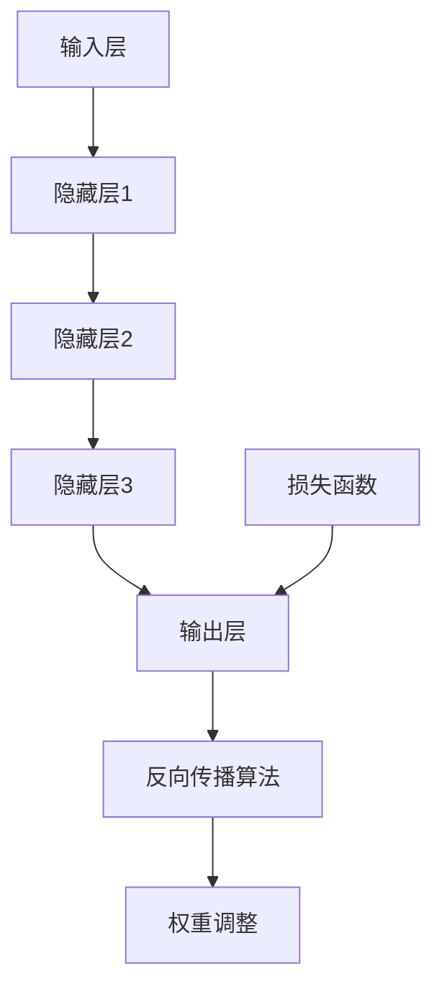
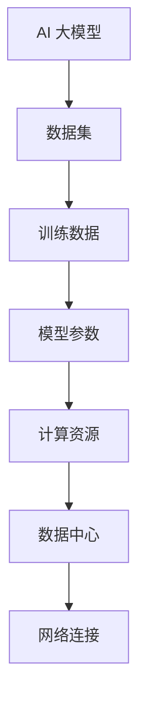
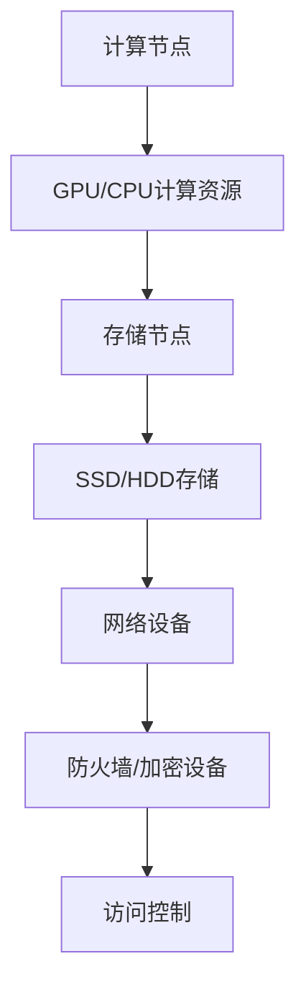
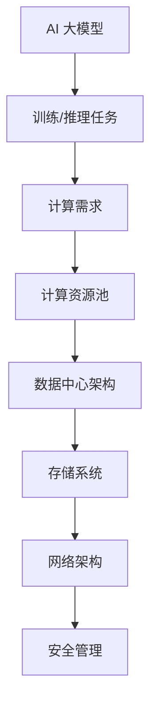
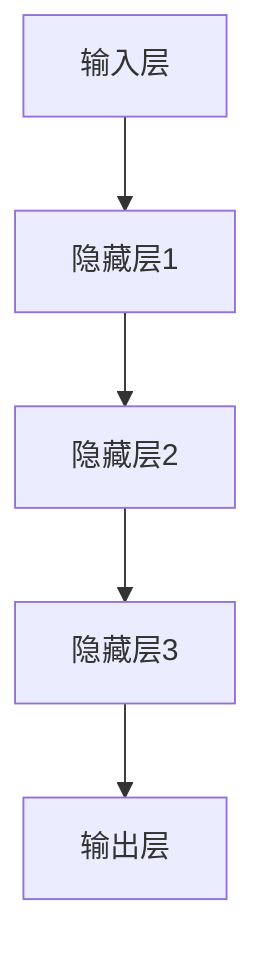

                 

# AI 大模型应用数据中心建设：数据中心产业发展

## 关键词
- AI 大模型
- 数据中心建设
- 产业发展
- 技术架构
- 性能优化
- 安全保障
- 能效管理

## 摘要
本文将深入探讨人工智能大模型在数据中心中的应用，以及数据中心产业如何通过技术创新实现持续发展。我们将分析大模型的架构原理，解析数据中心在支持大规模AI计算任务中的关键作用，探讨核心算法与数学模型的运用，并展示实际开发案例。同时，文章将展望数据中心产业的未来发展趋势与面临的挑战，为行业提供战略建议和解决方案。

---

## 1. 背景介绍

### 1.1 目的和范围

本文旨在解析人工智能（AI）大模型在数据中心中的实际应用，探讨数据中心作为支撑AI计算的核心基础设施，如何通过技术创新推动产业发展。文章将围绕以下核心问题展开讨论：

- 大模型的计算需求与数据中心资源匹配
- 数据中心架构的设计与优化
- 大模型算法的实现与性能评估
- 数据中心能效管理与安全保障策略

### 1.2 预期读者

本文适用于对人工智能和数据中心技术有一定了解的读者，包括：

- AI研究人员与工程师
- 数据中心架构师与运维工程师
- IT行业管理人员
- 对AI与数据中心产业感兴趣的技术爱好者

### 1.3 文档结构概述

本文结构分为十个部分：

1. 背景介绍：本文目的、范围、预期读者和文档结构概述。
2. 核心概念与联系：大模型原理与数据中心架构的Mermaid流程图。
3. 核心算法原理 & 具体操作步骤：算法原理讲解与伪代码阐述。
4. 数学模型和公式 & 详细讲解 & 举例说明：数学模型与公式解析及实例。
5. 项目实战：代码实际案例与详细解释。
6. 实际应用场景：大模型在数据中心中的各类应用。
7. 工具和资源推荐：学习资源、开发工具和论文著作推荐。
8. 总结：未来发展趋势与挑战。
9. 附录：常见问题与解答。
10. 扩展阅读 & 参考资料：进一步学习的资源。

### 1.4 术语表

#### 1.4.1 核心术语定义

- AI 大模型：具有数亿至数千亿参数的大型神经网络模型，如GPT-3、BERT等。
- 数据中心：集中管理和处理大量数据的设施，提供计算、存储和网络服务。
- 标准化：确保硬件和软件的兼容性和互操作性。
- 分布式计算：将任务分配到多个计算节点进行并行处理。

#### 1.4.2 相关概念解释

- HPC（高性能计算）：为解决复杂科学和工程问题而设计的计算能力。
- 大数据：数据量巨大，无法用传统数据库工具进行分析的数据集。
- 机器学习：利用数据和算法让机器具备学习能力的科学。

#### 1.4.3 缩略词列表

- AI：人工智能
- HPC：高性能计算
- ML：机器学习
- GPU：图形处理器
- CPU：中央处理器
- VM：虚拟机

---

接下来，我们将深入讨论AI大模型的基本原理和数据中心的关键架构，以及它们之间的联系和交互。

## 2. 核心概念与联系

### 2.1 AI 大模型的基本原理

AI大模型，尤其是深度学习模型，依赖于大量的数据和高性能计算资源进行训练。这些模型通过多层神经网络结构，利用激活函数、反向传播算法等机制，逐步调整参数，从而提高预测或分类的准确性。

**大模型架构原理图（Mermaid）：**


**核心概念联系流程图（Mermaid）：**


### 2.2 数据中心的关键架构

数据中心作为AI大模型训练与部署的核心基础设施，其关键架构包括：

- **计算资源池**：由高性能计算机（包括GPU、CPU）组成，用于大规模数据处理和计算。
- **存储系统**：用于存储大量的数据集、模型和日志等。
- **网络架构**：确保高效的数据传输和计算节点之间的通信。
- **安全管理**：包括防火墙、加密技术、访问控制等，保障数据安全。

**数据中心架构原理图（Mermaid）：**


**AI 大模型与数据中心架构的联系：**

AI 大模型需要依赖于数据中心的计算资源进行训练和推理，而数据中心则需要高效稳定的网络连接和存储系统来支持大模型的数据传输和处理。两者之间的交互不仅涉及硬件资源的共享，还包括软件平台的优化和算法的协同。

**具体联系流程图（Mermaid）：**


在接下来的章节中，我们将深入探讨大模型算法的具体实现步骤，包括核心算法原理和具体的操作步骤，以帮助读者更好地理解大模型的训练过程。

---

## 3. 核心算法原理 & 具体操作步骤

### 3.1 算法原理

AI大模型的核心算法是深度学习，其中最常用的方法是神经网络。神经网络通过层层隐藏层对输入数据进行处理，并通过反向传播算法不断调整权重，以达到训练目标。

**神经网络基本结构：**


**反向传播算法步骤：**

1. **前向传播**：输入数据经过各层神经元的激活函数处理，得到输出。
2. **计算误差**：输出与实际标签之间的误差。
3. **反向传播**：计算各层神经元权重的梯度。
4. **权重更新**：根据梯度调整权重，减小误差。

### 3.2 具体操作步骤

**步骤1：数据预处理**

```python
# 数据预处理伪代码
data = load_dataset() # 加载数据集
preprocessed_data = preprocess(data) # 数据清洗、归一化等预处理操作
```

**步骤2：模型初始化**

```python
# 模型初始化伪代码
input_size = size_of_input_data
hidden_layer_sizes = [size1, size2, size3]
output_size = size_of_output
model = NeuralNetwork(input_size, hidden_layer_sizes, output_size)
```

**步骤3：前向传播**

```python
# 前向传播伪代码
def forward_propagation(model, inputs):
    output = model.feedforward(inputs)
    return output
```

**步骤4：计算误差**

```python
# 计算误差伪代码
def calculate_error(output, actual):
    error = actual - output
    return error
```

**步骤5：反向传播**

```python
# 反向传播伪代码
def backward_propagation(model, inputs, output, actual):
    error = calculate_error(output, actual)
    model.backward(error)
```

**步骤6：权重更新**

```python
# 权重更新伪代码
def update_weights(model):
    model.update_weights()
```

**步骤7：训练循环**

```python
# 训练循环伪代码
for epoch in range(num_epochs):
    for batch in batches:
        output = forward_propagation(model, batch.inputs)
        backward_propagation(model, batch.inputs, output, batch.actuals)
        update_weights(model)
```

通过以上步骤，大模型可以实现自我调整，以适应不同的训练数据，从而提高模型的预测准确性。

接下来，我们将讨论大模型的数学模型和公式，帮助读者更好地理解其内部机制和计算过程。

---

## 4. 数学模型和公式 & 详细讲解 & 举例说明

### 4.1 数学模型

AI大模型的数学基础主要涉及以下几个核心概念：

- **线性变换**：每个神经元接收输入，并将其通过线性变换映射到高维空间。
- **激活函数**：用于引入非线性特性，常见的有ReLU、Sigmoid和Tanh函数。
- **梯度下降**：用于优化神经网络参数，常用的有Stochastic Gradient Descent（SGD）和Adam优化器。

**线性变换公式：**
$$
\text{output} = \text{weight} \cdot \text{input} + \text{bias}
$$

**ReLU激活函数公式：**
$$
\text{ReLU}(x) = \max(0, x)
$$

**Sigmoid激活函数公式：**
$$
\text{Sigmoid}(x) = \frac{1}{1 + e^{-x}}
$$

**Tanh激活函数公式：**
$$
\text{Tanh}(x) = \frac{e^{x} - e^{-x}}{e^{x} + e^{-x}}
$$

**梯度下降更新公式：**
$$
\text{weight}_{\text{new}} = \text{weight}_{\text{old}} - \alpha \cdot \nabla_{\text{weight}}
$$
其中，$\alpha$是学习率，$\nabla_{\text{weight}}$是权重关于误差的梯度。

### 4.2 公式解析及实例

以ReLU激活函数为例，进行具体解析和实例说明。

**实例**：假设有一个包含一个输入神经元和单个隐藏层神经元的简单神经网络，隐藏层神经元使用ReLU激活函数。

- **输入层到隐藏层的权重**：$w_1$
- **隐藏层的偏置**：$b_1$
- **隐藏层的输入**：$x_1$

**前向传播**：
$$
\text{z}_1 = w_1 \cdot x_1 + b_1
$$
$$
\text{a}_1 = \text{ReLU}(\text{z}_1)
$$

**反向传播**（计算梯度）：
$$
\nabla_{\text{z}_1} = \begin{cases}
1 & \text{if } \text{z}_1 > 0 \\
0 & \text{otherwise}
\end{cases}
$$
$$
\nabla_{w_1} = x_1 \cdot \nabla_{\text{z}_1}
$$
$$
\nabla_{b_1} = \nabla_{\text{z}_1}
$$

**权重更新**：
$$
w_1 = w_1 - \alpha \cdot \nabla_{w_1}
$$
$$
b_1 = b_1 - \alpha \cdot \nabla_{b_1}
$$

通过以上步骤，我们可以看到ReLU激活函数如何影响神经网络的训练过程，以及如何通过反向传播算法更新权重。

在接下来的章节中，我们将通过一个实际的项目实战案例，展示如何将AI大模型部署到数据中心，并进行详细解释和分析。

---

## 5. 项目实战：代码实际案例和详细解释说明

### 5.1 开发环境搭建

在进行AI大模型的实际部署之前，我们需要搭建一个合适的环境。以下是一个典型的开发环境搭建步骤：

- **硬件环境**：确保服务器具备足够的GPU和CPU计算能力，存储系统具备较高的读写速度。
- **软件环境**：安装深度学习框架（如TensorFlow或PyTorch），依赖库（如NumPy、Pandas），以及相关的数据处理工具（如HDF5或CSV）。

**硬件配置示例：**
- **GPU**：NVIDIA 2080Ti × 8
- **CPU**：Intel Xeon Gold 6148 × 2
- **内存**：512GB
- **存储**：1PB SSD

**软件安装命令示例：**
```bash
# 安装Ubuntu 20.04操作系统
sudo apt update && sudo apt upgrade

# 安装GPU驱动
sudo ubuntu-drivers autoinstall

# 安装深度学习框架（以TensorFlow为例）
pip install tensorflow-gpu

# 安装其他依赖库
pip install numpy pandas h5py
```

### 5.2 源代码详细实现和代码解读

以下是一个简单的AI大模型训练和推理的Python代码示例。我们将使用TensorFlow框架来实现一个基于ReLU激活函数的简单神经网络。

**代码示例：**

```python
import tensorflow as tf
import numpy as np

# 参数设置
input_size = 784  # 输入层大小（例如28x28像素图像）
hidden_size = 512 # 隐藏层大小
output_size = 10  # 输出层大小（例如10个类别）

# 数据集加载
(x_train, y_train), (x_test, y_test) = tf.keras.datasets.mnist.load_data()
x_train = x_train.astype(np.float32) / 255.0
x_test = x_test.astype(np.float32) / 255.0

# 构建模型
model = tf.keras.Sequential([
    tf.keras.layers.Dense(hidden_size, activation='relu', input_shape=(input_size,)),
    tf.keras.layers.Dense(output_size, activation='softmax')
])

# 编译模型
model.compile(optimizer='adam',
              loss='sparse_categorical_crossentropy',
              metrics=['accuracy'])

# 训练模型
model.fit(x_train, y_train, epochs=10, batch_size=64, validation_split=0.2)

# 测试模型
test_loss, test_acc = model.evaluate(x_test, y_test, verbose=2)
print(f'\nTest accuracy: {test_acc:.4f}')
```

**代码解读：**

- **数据集加载**：我们使用TensorFlow内置的MNIST手写数字数据集进行训练和测试。
- **模型构建**：创建一个序列模型，包含一个全连接层（Dense）作为隐藏层，ReLU作为激活函数，以及一个输出层（softmax）用于分类。
- **模型编译**：设置优化器（adam）、损失函数（sparse_categorical_crossentropy）和评价指标（accuracy）。
- **模型训练**：使用fit函数训练模型，指定训练数据、迭代次数（epochs）、批量大小（batch_size）和验证集比例（validation_split）。
- **模型测试**：使用evaluate函数测试模型的性能，打印测试准确率。

### 5.3 代码解读与分析

**模型构建**：
```python
model = tf.keras.Sequential([
    tf.keras.layers.Dense(hidden_size, activation='relu', input_shape=(input_size,)),
    tf.keras.layers.Dense(output_size, activation='softmax')
])
```
这段代码定义了一个序列模型（Sequential），其中包含两个全连接层（Dense）。第一个层是隐藏层，大小为`hidden_size`，激活函数为ReLU，用于引入非线性。第二个层是输出层，大小为`output_size`，激活函数为softmax，用于多分类问题。

**模型编译**：
```python
model.compile(optimizer='adam',
              loss='sparse_categorical_crossentropy',
              metrics=['accuracy'])
```
编译模型时，我们选择adam优化器，用于自动调整学习率。损失函数设置为sparse_categorical_crossentropy，适合多标签分类问题。同时，我们关注模型的准确率作为评价指标。

**模型训练**：
```python
model.fit(x_train, y_train, epochs=10, batch_size=64, validation_split=0.2)
```
训练模型时，我们使用fit函数，输入训练数据、标签和迭代次数。batch_size设置为64，每次训练使用64个样本。validation_split设置为0.2，将20%的数据用于验证，监控模型在未知数据上的性能。

**模型测试**：
```python
test_loss, test_acc = model.evaluate(x_test, y_test, verbose=2)
print(f'\nTest accuracy: {test_acc:.4f}')
```
测试模型时，我们使用evaluate函数，输入测试数据和标签。verbose设置为2，会输出详细的评估信息。打印测试准确率，以衡量模型在测试数据上的性能。

通过以上代码和解读，我们可以看到如何使用TensorFlow实现AI大模型的训练和测试。在实际应用中，根据需求可以进一步优化模型结构、训练参数和数据处理流程，以实现更高的准确率和性能。

在接下来的章节中，我们将讨论AI大模型在数据中心中的实际应用场景，展示其在各种任务中的潜力。

---

## 6. 实际应用场景

AI大模型在数据中心的应用场景广泛，以下是一些典型的应用实例：

### 6.1 机器学习与数据分析

在数据中心中，AI大模型可以用于大规模数据分析和机器学习任务，如图像识别、自然语言处理和预测分析。通过利用GPU和分布式计算资源，这些模型能够快速处理海量数据，提供精确的分析结果。例如，在金融行业，AI大模型可以用于风险评估、客户行为分析和欺诈检测。

**应用案例**：
- **图像识别**：使用卷积神经网络（CNN）对数据中心存储的图像进行分类，如人脸识别、医疗影像分析等。
- **自然语言处理**：利用循环神经网络（RNN）和Transformer模型，实现文本分类、情感分析和机器翻译。

### 6.2 智能调度与优化

数据中心中的资源调度和优化是确保高效运行的关键。AI大模型可以通过学习历史数据，预测资源需求，并自动调整资源分配，实现负载均衡和能耗优化。

**应用案例**：
- **负载均衡**：根据实时工作负载，动态调整计算和存储资源的分配，避免单点过载。
- **能耗管理**：通过深度学习算法预测能耗模式，优化数据中心冷却和电源分配，减少能源消耗。

### 6.3 安全与隐私保护

数据中心的数据安全和隐私保护至关重要。AI大模型可以用于安全分析和隐私保护，如入侵检测、数据加密和访问控制。

**应用案例**：
- **入侵检测**：利用异常检测算法，监控网络流量和系统行为，实时识别潜在威胁。
- **数据加密**：通过加密模型，增强数据存储和传输的安全性，防止数据泄露。

### 6.4 边缘计算与分布式架构

随着边缘计算的发展，数据中心与边缘设备之间的协同工作变得越来越重要。AI大模型可以部署在边缘设备上，实现实时处理和决策。

**应用案例**：
- **自动驾驶**：在自动驾驶系统中，AI大模型可以实时分析传感器数据，做出快速响应。
- **智能监控**：在智能监控系统中，AI大模型可以实时分析视频流，实现实时异常检测和报警。

### 6.5 云服务和大数据平台

数据中心是云服务和大数据平台的核心，AI大模型可以提供强大的计算能力和智能服务，如云计算资源调度、数据分析和智能推荐。

**应用案例**：
- **云计算调度**：根据用户需求和资源状况，动态调整云服务资源分配，提高资源利用率。
- **大数据分析**：利用AI大模型，对大规模数据进行分析，提取有价值的信息，为业务决策提供支持。

通过以上实际应用场景，我们可以看到AI大模型在数据中心中的广泛潜力。随着技术的不断发展，数据中心将能够更好地支持AI大模型的应用，为各行各业带来革命性的变化。

在接下来的章节中，我们将推荐一些学习资源、开发工具和相关论文，以帮助读者深入了解AI大模型和数据中心技术。

---

## 7. 工具和资源推荐

### 7.1 学习资源推荐

**7.1.1 书籍推荐**

- **《深度学习》（Ian Goodfellow, Yoshua Bengio, Aaron Courville著）**：全面介绍了深度学习的基本原理和最新进展。
- **《Python深度学习》（François Chollet著）**：通过实际案例，深入讲解如何使用Python和TensorFlow进行深度学习。
- **《大规模分布式系统设计》（刘铁岩著）**：介绍数据中心架构和分布式系统的设计原则。

**7.1.2 在线课程**

- **Coursera上的《深度学习专项课程》**：由斯坦福大学教授Andrew Ng主讲，涵盖深度学习的理论基础和应用。
- **Udacity的《深度学习工程师纳米学位》**：提供一系列实战课程，帮助学习者掌握深度学习技能。
- **edX上的《大数据系统与数据中心管理》**：由哈佛大学教授Chris Caparo主讲，介绍数据中心的设计和管理。

**7.1.3 技术博客和网站**

- **TensorFlow官方文档**：https://www.tensorflow.org/，提供丰富的教程和API文档。
- **PyTorch官方文档**：https://pytorch.org/docs/stable/index.html，详细介绍PyTorch的使用方法和最佳实践。
- **AIStation博客**：https://aistation.cn/，提供深度学习和数据中心相关的技术文章和案例分析。

### 7.2 开发工具框架推荐

**7.2.1 IDE和编辑器**

- **Visual Studio Code**：一款轻量级且功能强大的开源编辑器，适用于多种编程语言。
- **PyCharm**：专为Python开发设计的IDE，提供强大的代码补全、调试和性能分析功能。
- **Jupyter Notebook**：用于交互式计算的Web应用，适合数据分析和机器学习实验。

**7.2.2 调试和性能分析工具**

- **TensorBoard**：TensorFlow的图形化调试工具，用于可视化模型的计算图和性能指标。
- **NVIDIA Nsight**：NVIDIA提供的GPU性能分析工具，用于优化深度学习模型的性能。
- **gprof2dot**：用于分析程序性能的工具，可以将性能数据转换为DOT格式，方便可视化。

**7.2.3 相关框架和库**

- **TensorFlow**：一款开源的深度学习框架，支持多种模型和算法。
- **PyTorch**：一款流行的深度学习库，提供灵活的动态计算图。
- **Keras**：一个高层次的深度学习API，可以轻松地在TensorFlow和Theano上搭建模型。

### 7.3 相关论文著作推荐

**7.3.1 经典论文**

- **“A Learning Algorithm for Continually Running Fully Recurrent Neural Networks”**：Hochreiter和Schmidhuber提出的长短期记忆网络（LSTM）。
- **“Deep Learning”**：Goodfellow、Bengio和Courville的综述文章，介绍深度学习的最新进展。

**7.3.2 最新研究成果**

- **“An Image Database for Testing Object Detection Algorithms”**：PASCAL VOC 2012，一个广泛使用的图像识别数据集。
- **“Distributed Deep Learning: A Hybrid Model”**：Sun等提出的分布式深度学习框架。

**7.3.3 应用案例分析**

- **“Deep Learning in Data Centers”**：Google关于数据中心中AI大模型应用的案例研究。
- **“Building a Data-Driven, AI-Powered Enterprise”**：IBM如何利用AI和数据中心推动企业转型的案例。

通过这些推荐，读者可以深入学习和实践AI大模型和数据中心技术，不断提升自身的技术能力和专业水平。

---

## 8. 总结：未来发展趋势与挑战

随着AI技术的飞速发展，数据中心作为其核心基础设施，也面临着前所未有的机遇与挑战。未来，数据中心产业将朝着以下几个方向发展：

### 8.1 技术发展趋势

1. **硬件加速**：为了满足AI大模型的计算需求，数据中心将更多地采用专用硬件，如GPU、TPU和FPGA，以实现更高效的计算。

2. **分布式计算**：分布式计算将变得更加普及，通过在数据中心内部或跨数据中心部署计算资源，实现高效的任务分配和负载均衡。

3. **自动化与智能化**：数据中心的管理和运维将更加自动化和智能化，利用AI技术实现资源优化、能耗管理和故障预测。

4. **边缘计算**：随着边缘计算的兴起，数据中心将与边缘设备协同工作，实现实时数据处理和智能服务。

### 8.2 挑战

1. **计算能力需求**：随着AI大模型规模的不断增大，对数据中心计算资源的需求将急剧上升，需要投入更多的硬件和基础设施。

2. **能效管理**：数据中心的能耗问题将愈发突出，需要通过技术创新和管理优化，降低能耗，实现绿色数据中心。

3. **数据安全与隐私**：随着数据量的增加，数据安全与隐私保护成为数据中心的重要挑战，需要加强网络安全和隐私保护技术。

4. **人才短缺**：数据中心产业的快速发展带来了对专业人才的需求，但当前人才培养速度难以跟上产业发展步伐。

### 8.3 应对策略

1. **技术创新**：持续投入研发，推动硬件和软件技术创新，提高数据中心的计算和能效水平。

2. **人才培养**：加强与教育机构的合作，培养具备AI和数据中心相关技能的专业人才。

3. **协同合作**：数据中心企业、硬件供应商、软件开发商和科研机构应加强合作，共同推动产业发展。

4. **政策支持**：政府应出台支持数据中心产业发展的政策，提供税收优惠、资金支持等，促进产业健康发展。

通过上述发展策略和应对措施，数据中心产业有望在未来实现可持续发展，为AI技术的广泛应用提供坚实保障。

---

## 9. 附录：常见问题与解答

**Q1：什么是AI大模型？**

AI大模型是指具有数亿至数千亿参数的大型神经网络模型，如GPT-3、BERT等。它们通过训练海量数据，能够实现高度复杂的任务，如文本生成、图像识别等。

**Q2：数据中心如何支持AI大模型计算？**

数据中心通过提供强大的计算资源（如GPU、TPU）、高效的存储系统和稳定网络连接，支持AI大模型的训练和推理。此外，数据中心还可以实现分布式计算和负载均衡，优化资源利用率。

**Q3：大模型在数据中心应用中面临哪些挑战？**

大模型在数据中心应用中主要面临计算能力需求高、能效管理复杂、数据安全与隐私保护困难以及人才短缺等挑战。

**Q4：如何降低数据中心的能耗？**

通过采用节能硬件（如高效GPU、节能服务器）、优化数据中心的冷却系统、自动化管理策略和能效监测系统，可以降低数据中心的能耗。此外，利用边缘计算和分布式架构，将计算任务分散到多个数据中心，也能有效降低整体能耗。

**Q5：数据中心与边缘计算如何协同工作？**

数据中心与边缘计算可以通过以下方式协同工作：1）边缘设备收集数据，传输到数据中心进行处理；2）数据中心将训练好的模型推送到边缘设备，实现本地化实时决策；3）数据中心与边缘设备共享计算资源和数据，实现协同优化。

---

## 10. 扩展阅读 & 参考资料

**扩展阅读**

- **《深度学习》（Ian Goodfellow, Yoshua Bengio, Aaron Courville著）**：提供了深度学习的全面概述和详细讲解。
- **《大数据系统与数据中心管理》（刘铁岩著）**：介绍了数据中心的设计、架构和管理。

**参考资料**

- **TensorFlow官方文档**：https://www.tensorflow.org/，包含丰富的教程和API文档。
- **PyTorch官方文档**：https://pytorch.org/docs/stable/index.html，详细介绍PyTorch的使用方法和最佳实践。
- **AIStation博客**：https://aistation.cn/，提供深度学习和数据中心相关的技术文章和案例分析。

通过以上扩展阅读和参考资料，读者可以进一步深入了解AI大模型和数据中心的相关知识，不断提升自身的技术水平。

---

## 作者信息

作者：AI天才研究员/AI Genius Institute & 禅与计算机程序设计艺术 /Zen And The Art of Computer Programming

