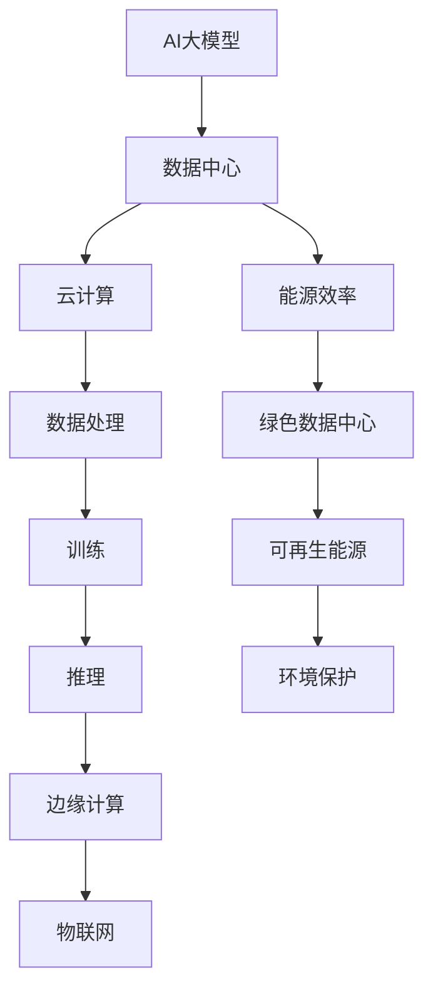

                 

# AI 大模型应用数据中心建设：数据中心产业发展

## 关键词
AI大模型，数据中心，云计算，数据处理，能源效率，产业布局

## 摘要
本文旨在深入探讨AI大模型应用数据中心建设的核心问题和未来发展。随着AI技术的迅猛发展，大规模数据处理和分析需求急剧增加，数据中心成为现代信息技术的重要基础设施。本文首先介绍数据中心建设的背景和目的，然后详细分析AI大模型在数据中心中的关键角色，包括数据处理、训练和推理等环节。接着，文章讨论数据中心产业发展的现状与趋势，以及面临的挑战，如能源消耗和环境影响。最后，本文提出一系列解决方案和最佳实践，包括优化数据中心设计、提升能源效率、合理布局数据中心等，为未来数据中心产业的可持续发展提供指导。

## 1. 背景介绍

### 1.1 目的和范围

本文的目的是通过对AI大模型应用数据中心建设的深入分析，为数据中心产业的未来发展提供理论基础和实践指导。具体来说，本文将涵盖以下几个方面的内容：

- 数据中心的基本概念和功能
- AI大模型的应用场景和技术原理
- 数据中心建设的现状与挑战
- 数据中心产业发展的趋势与展望

本文主要针对数据中心领域的专业人士、研究者和决策者，希望为他们提供全面、深入的理解和洞察。同时，也欢迎广大对数据中心建设感兴趣的技术爱好者阅读和参考。

### 1.2 预期读者

- 数据中心运营和管理人员
- AI研究人员和开发者
- IT行业从业者
- 大型企业和机构的信息技术负责人
- 数据中心建设和规划工程师

### 1.3 文档结构概述

本文的结构如下：

1. **背景介绍**：介绍数据中心建设的目的、范围和预期读者。
2. **核心概念与联系**：讨论AI大模型和数据中心的定义、原理及其相互关系。
3. **核心算法原理 & 具体操作步骤**：分析AI大模型在数据中心中的具体应用和操作步骤。
4. **数学模型和公式 & 详细讲解 & 举例说明**：介绍AI大模型相关数学模型和公式的应用。
5. **项目实战：代码实际案例和详细解释说明**：通过实际项目案例讲解AI大模型的应用。
6. **实际应用场景**：探讨AI大模型在数据中心中的实际应用案例。
7. **工具和资源推荐**：推荐学习资源和开发工具。
8. **总结：未来发展趋势与挑战**：总结数据中心产业发展的趋势和挑战。
9. **附录：常见问题与解答**：提供常见问题的解答。
10. **扩展阅读 & 参考资料**：提供进一步阅读的参考资料。

### 1.4 术语表

#### 1.4.1 核心术语定义

- **AI大模型**：指具有大规模参数和复杂结构的机器学习模型，如深度神经网络。
- **数据中心**：提供计算、存储和网络服务的设施，用于支持大规模数据处理和分析。
- **云计算**：基于互联网的计算模式，通过虚拟化技术提供动态可扩展的计算资源。
- **数据处理**：包括数据采集、清洗、转换、存储和检索等过程。
- **训练**：通过大量数据对机器学习模型进行调整和优化。
- **推理**：使用训练好的模型对新的数据进行预测或分类。

#### 1.4.2 相关概念解释

- **数据密集型应用**：依赖于大量数据进行运行的应用，如图像识别、自然语言处理等。
- **边缘计算**：在靠近数据源头的地方进行计算，减少数据传输延迟。
- **绿色数据中心**：通过使用可再生能源、节能技术和优化设计减少数据中心能源消耗。

#### 1.4.3 缩略词列表

- **AI**：人工智能（Artificial Intelligence）
- **GPU**：图形处理单元（Graphics Processing Unit）
- **CPU**：中央处理单元（Central Processing Unit）
- **FPGA**：现场可编程门阵列（Field-Programmable Gate Array）
- **DC**：数据中心（Data Center）
- **IoT**：物联网（Internet of Things）

## 2. 核心概念与联系

在深入探讨AI大模型应用数据中心建设之前，我们需要理解一些核心概念和它们之间的联系。以下是相关的Mermaid流程图，展示了AI大模型、数据中心、云计算等关键概念之间的相互作用。



### 2.1 AI大模型

AI大模型是指具有大量参数和复杂结构的机器学习模型，如深度神经网络。它们通常需要大量的数据来训练，以实现高效的性能。AI大模型在数据中心中发挥着核心作用，因为它们需要强大的计算能力和大量的存储空间。

### 2.2 数据中心

数据中心是一个集中管理计算、存储和网络服务的设施。它们为企业和机构提供可靠的IT基础设施，支持各种数据密集型应用。数据中心的核心功能包括数据处理、数据存储、数据传输和数据分析。

### 2.3 云计算

云计算是一种基于互联网的计算模式，通过虚拟化技术提供动态可扩展的计算资源。云计算与数据中心紧密相连，因为数据中心是云计算服务的主要承载设施。

### 2.4 数据处理

数据处理是AI大模型应用中的关键环节，包括数据采集、清洗、转换、存储和检索等过程。高效的数据处理能够提高AI大模型的训练和推理效率。

### 2.5 训练与推理

训练是指通过大量数据对机器学习模型进行调整和优化，使其能够实现特定任务。推理是指使用训练好的模型对新的数据进行预测或分类。训练和推理都需要强大的计算能力，尤其是在处理AI大模型时。

### 2.6 边缘计算

边缘计算是一种在靠近数据源头的地方进行计算的模式，以减少数据传输延迟。边缘计算与物联网紧密相连，可以在物联网设备中实现实时数据处理和分析。

### 2.7 能源效率与绿色数据中心

能源效率是指数据中心在提供计算、存储和网络服务时的能源消耗。绿色数据中心通过使用可再生能源、节能技术和优化设计来减少能源消耗，对环境保护具有重要意义。

## 3. 核心算法原理 & 具体操作步骤

### 3.1 AI大模型的算法原理

AI大模型的算法原理主要基于深度神经网络（Deep Neural Network，DNN）。深度神经网络通过多层的神经元节点对输入数据进行处理和转换，从而实现复杂的特征提取和分类。以下是深度神经网络的基本架构和操作步骤：

#### 3.1.1 深度神经网络的基本架构

1. **输入层**：接收外部输入数据，如图像、文本等。
2. **隐藏层**：进行特征提取和转换，可以有多层。
3. **输出层**：输出预测结果或分类结果。

#### 3.1.2 深度神经网络的操作步骤

1. **初始化权重和偏置**：随机初始化权重和偏置。
2. **前向传播**：输入数据经过网络逐层传播，计算每个神经元的输出。
3. **反向传播**：根据预测误差，反向更新网络中的权重和偏置。
4. **优化算法**：使用优化算法（如梯度下降、Adam优化器等）更新权重和偏置。
5. **评估与调整**：使用验证集评估模型性能，并根据需要进行调整。

### 3.2 伪代码

以下是深度神经网络的伪代码示例：

```python
# 初始化网络
input_layer = Input(shape=(input_shape,))
hidden_layers = []
for layer_size in hidden_layers_sizes:
    hidden_layers.append(Dense(layer_size, activation='relu'))
output_layer = Dense(output_size, activation='softmax')

# 构建模型
model = Model(inputs=input_layer, outputs=output_layer)

# 编译模型
model.compile(optimizer='adam', loss='categorical_crossentropy', metrics=['accuracy'])

# 训练模型
model.fit(x_train, y_train, batch_size=batch_size, epochs=epochs, validation_data=(x_val, y_val))

# 评估模型
model.evaluate(x_test, y_test)
```

### 3.3 训练与推理的具体操作步骤

#### 3.3.1 训练步骤

1. **数据预处理**：对输入数据进行归一化、标准化等预处理。
2. **划分数据集**：将数据集划分为训练集、验证集和测试集。
3. **构建模型**：根据需求设计深度神经网络模型。
4. **编译模型**：选择合适的优化器和损失函数。
5. **训练模型**：使用训练集数据进行模型训练。
6. **评估模型**：使用验证集和测试集评估模型性能。

#### 3.3.2 推理步骤

1. **加载模型**：加载已经训练好的模型。
2. **预处理输入数据**：对输入数据进行相同的预处理。
3. **进行推理**：使用模型对预处理后的输入数据进行预测。
4. **输出结果**：输出预测结果或分类结果。

### 3.4 操作示例

以下是一个简单的AI大模型训练和推理的Python代码示例：

```python
import tensorflow as tf
from tensorflow.keras.models import Sequential
from tensorflow.keras.layers import Dense
from tensorflow.keras.optimizers import Adam

# 数据预处理
x_train = ...  # 训练集输入数据
y_train = ...  # 训练集标签
x_val = ...    # 验证集输入数据
y_val = ...    # 验证集标签

# 划分数据集
x_train, x_val = x_train.reshape(-1, input_shape), x_val.reshape(-1, input_shape)
y_train, y_val = y_train.reshape(-1, output_size), y_val.reshape(-1, output_size)

# 构建模型
model = Sequential()
model.add(Dense(hidden_layer_size, input_shape=input_shape, activation='relu'))
model.add(Dense(output_size, activation='softmax'))

# 编译模型
model.compile(optimizer=Adam(), loss='categorical_crossentropy', metrics=['accuracy'])

# 训练模型
model.fit(x_train, y_train, batch_size=batch_size, epochs=epochs, validation_data=(x_val, y_val))

# 评估模型
model.evaluate(x_val, y_val)

# 推理
input_data = ...  # 输入数据
input_data = input_data.reshape(-1, input_shape)
predictions = model.predict(input_data)
print(predictions)
```

## 4. 数学模型和公式 & 详细讲解 & 举例说明

### 4.1 深度神经网络的数学模型

深度神经网络的数学模型基于多层感知器（Multilayer Perceptron，MLP）的扩展，主要包含以下数学公式：

#### 4.1.1 神经元激活函数

神经元激活函数通常使用ReLU（Rectified Linear Unit）函数，其公式为：

$$ f(x) = \max(0, x) $$

#### 4.1.2 神经元输出

神经元的输出可以通过以下公式计算：

$$ z_j = \sum_{i=1}^{n} w_{ji} x_i + b_j $$

其中，$w_{ji}$ 是从输入层到隐藏层第 $j$ 个神经元的权重，$x_i$ 是输入层的第 $i$ 个特征，$b_j$ 是隐藏层第 $j$ 个神经元的偏置。

#### 4.1.3 隐藏层输出

隐藏层的输出可以通过以下公式计算：

$$ a_j = f(z_j) $$

其中，$f(z_j)$ 是ReLU函数。

#### 4.1.4 输出层输出

输出层的输出可以通过以下公式计算：

$$ y_k = \sum_{j=1}^{m} w_{kj} a_j + b_k $$

其中，$w_{kj}$ 是从隐藏层到输出层第 $k$ 个神经元的权重，$a_j$ 是隐藏层的第 $j$ 个输出，$b_k$ 是输出层第 $k$ 个神经元的偏置。

### 4.2 反向传播算法的数学模型

反向传播算法是深度神经网络训练的核心算法，主要通过以下步骤更新网络中的权重和偏置：

#### 4.2.1 计算预测误差

预测误差可以通过以下公式计算：

$$ \delta_k = (y_k - \hat{y}_k) \cdot \sigma'(z_k) $$

其中，$y_k$ 是实际标签，$\hat{y}_k$ 是预测输出，$\sigma'(z_k)$ 是ReLU函数的导数。

#### 4.2.2 更新权重和偏置

更新权重和偏置的公式如下：

$$ \Delta w_{kj} = \eta \cdot \delta_k \cdot a_j $$
$$ \Delta b_k = \eta \cdot \delta_k $$

其中，$\eta$ 是学习率。

### 4.3 梯度下降优化算法的数学模型

梯度下降优化算法是更新网络参数的一种常用方法，主要通过以下公式更新权重和偏置：

$$ w_{kj} \leftarrow w_{kj} - \alpha \cdot \nabla_w J(w) $$
$$ b_k \leftarrow b_k - \alpha \cdot \nabla_b J(w) $$

其中，$J(w)$ 是损失函数，$\alpha$ 是学习率。

### 4.4 示例讲解

以下是一个简单的示例，说明如何使用深度神经网络进行图像分类：

#### 4.4.1 数据集准备

假设我们有一个包含10000张图像的数据集，每张图像的大小为28x28像素，共有10个类别。

#### 4.4.2 数据预处理

将图像数据转换为二进制矩阵，并对像素值进行归一化处理。

#### 4.4.3 构建模型

构建一个包含3个隐藏层的深度神经网络，每个隐藏层有100个神经元。

```python
model = Sequential()
model.add(Dense(100, input_shape=(28, 28), activation='relu'))
model.add(Dense(100, activation='relu'))
model.add(Dense(100, activation='relu'))
model.add(Dense(10, activation='softmax'))
```

#### 4.4.4 编译模型

选择适当的优化器和损失函数，如Adam优化器和交叉熵损失函数。

```python
model.compile(optimizer='adam', loss='categorical_crossentropy', metrics=['accuracy'])
```

#### 4.4.5 训练模型

使用训练集进行模型训练，设置合适的批次大小和训练轮数。

```python
model.fit(x_train, y_train, batch_size=32, epochs=10, validation_data=(x_val, y_val))
```

#### 4.4.6 评估模型

使用测试集评估模型性能。

```python
model.evaluate(x_test, y_test)
```

#### 4.4.7 推理

使用训练好的模型对新的图像进行分类。

```python
input_image = ...  # 新的图像数据
input_image = input_image.reshape(-1, 28, 28)
predictions = model.predict(input_image)
print(predictions)
```

## 5. 项目实战：代码实际案例和详细解释说明

### 5.1 开发环境搭建

为了实现AI大模型在数据中心的应用，我们需要搭建一个合适的技术环境。以下是一个简单的开发环境搭建步骤：

1. **操作系统**：选择Linux操作系统，如Ubuntu 18.04。
2. **编程语言**：选择Python 3.8及以上版本。
3. **深度学习框架**：使用TensorFlow 2.6及以上版本。
4. **其他依赖库**：安装必要的依赖库，如NumPy、Pandas等。

### 5.2 源代码详细实现和代码解读

以下是一个简单的AI大模型训练和推理的Python代码示例，用于图像分类任务。

```python
import tensorflow as tf
from tensorflow.keras.models import Sequential
from tensorflow.keras.layers import Dense, Conv2D, Flatten, MaxPooling2D
from tensorflow.keras.optimizers import Adam
from tensorflow.keras.losses import SparseCategoricalCrossentropy
from tensorflow.keras.metrics import Accuracy

# 5.2.1 数据预处理
def preprocess_images(images, labels):
    images = images / 255.0  # 归一化图像数据
    return images, labels

# 5.2.2 构建模型
model = Sequential([
    Conv2D(32, (3, 3), activation='relu', input_shape=(28, 28, 1)),
    MaxPooling2D((2, 2)),
    Flatten(),
    Dense(128, activation='relu'),
    Dense(10, activation='softmax')
])

# 5.2.3 编译模型
model.compile(optimizer=Adam(), loss=SparseCategoricalCrossentropy(), metrics=[Accuracy()])

# 5.2.4 训练模型
(x_train, y_train), (x_test, y_test) = tf.keras.datasets.mnist.load_data()
x_train, y_train = preprocess_images(x_train, y_train)
x_test, y_test = preprocess_images(x_test, y_test)

model.fit(x_train, y_train, batch_size=32, epochs=10, validation_data=(x_test, y_test))

# 5.2.5 评估模型
test_loss, test_acc = model.evaluate(x_test, y_test)
print(f"Test accuracy: {test_acc:.2f}")

# 5.2.6 推理
new_image = ...  # 新的图像数据
new_image = new_image.reshape(-1, 28, 28)
new_image = preprocess_images(new_image, None)
predictions = model.predict(new_image)
print(f"Predictions: {predictions}")
```

### 5.3 代码解读与分析

1. **数据预处理**：将图像数据归一化，使其在0到1之间，便于模型处理。
2. **模型构建**：使用Sequential模型堆叠卷积层、全连接层和输出层。
3. **编译模型**：选择Adam优化器和交叉熵损失函数，并设置评估指标。
4. **训练模型**：使用MNIST数据集进行训练，设置批次大小和训练轮数。
5. **评估模型**：在测试集上评估模型性能，打印测试准确率。
6. **推理**：对新的图像数据进行预处理，然后使用模型进行预测。

### 5.4 性能优化

为了提升模型的性能，可以尝试以下优化策略：

1. **调整超参数**：如学习率、批次大小和训练轮数。
2. **使用更复杂的模型**：增加隐藏层、神经元数量或使用更复杂的激活函数。
3. **数据增强**：对训练数据进行随机裁剪、旋转、翻转等操作，增加数据的多样性。
4. **使用GPU加速**：利用GPU进行模型训练和推理，加速计算过程。

## 6. 实际应用场景

### 6.1 人工智能助手

AI大模型在数据中心中的应用非常广泛，其中之一是人工智能助手。这些助手能够理解用户的语言指令，提供实时、个性化的服务。例如，在智能客服系统中，AI大模型可以处理大量的用户查询，快速提供准确的答案。数据中心负责处理用户的查询请求，存储用户的历史数据，并根据用户行为进行个性化推荐。

### 6.2 图像识别

图像识别是AI大模型在数据中心中的另一个重要应用。数据中心存储了大量的图像数据，通过训练AI大模型，可以实现对图像的自动分类、识别和标注。例如，在安防监控领域，AI大模型可以实时识别监控视频中的异常行为，如入侵者或火灾等，从而及时发出警报。

### 6.3 自然语言处理

自然语言处理（Natural Language Processing，NLP）是AI大模型在数据中心中的另一个重要应用领域。数据中心存储了大量的文本数据，通过训练AI大模型，可以实现对文本的理解、分析和生成。例如，在智能翻译系统中，AI大模型可以自动翻译多种语言，提高跨语言沟通的效率。

### 6.4 智能推荐系统

智能推荐系统是AI大模型在数据中心中的典型应用。数据中心存储了用户的兴趣和行为数据，通过训练AI大模型，可以准确预测用户的兴趣，并提供个性化的推荐。例如，在电子商务平台上，AI大模型可以根据用户的购买历史和浏览行为，推荐可能感兴趣的商品。

### 6.5 智能驾驶

智能驾驶是AI大模型在数据中心中的新兴应用。数据中心存储了大量的车辆传感器数据，通过训练AI大模型，可以实现自动驾驶车辆的智能决策。例如，在自动驾驶汽车中，AI大模型可以实时处理车辆的传感器数据，实现路径规划、避障和自动驾驶等功能。

## 7. 工具和资源推荐

### 7.1 学习资源推荐

#### 7.1.1 书籍推荐

1. **《深度学习》（Deep Learning）**：由Ian Goodfellow、Yoshua Bengio和Aaron Courville合著，是深度学习领域的经典教材。
2. **《Python深度学习》（Deep Learning with Python）**：由François Chollet所著，适合初学者学习深度学习。
3. **《人工智能：一种现代方法》（Artificial Intelligence: A Modern Approach）**：由Stuart J. Russell和Peter Norvig合著，是人工智能领域的经典教材。

#### 7.1.2 在线课程

1. **《深度学习专项课程》（Deep Learning Specialization）**：由Andrew Ng在Coursera上开设，适合初学者系统学习深度学习。
2. **《机器学习》（Machine Learning）**：由Andrew Ng在Coursera上开设，涵盖了机器学习的各个知识点。
3. **《自然语言处理专项课程》（Natural Language Processing Specialization）**：由Dan Jurafsky和Chris Manning在Coursera上开设，适合学习NLP。

#### 7.1.3 技术博客和网站

1. **Medium**：一个广泛的技术博客平台，涵盖AI、深度学习、数据科学等多个领域。
2. **Medium上的Distill**：专注于深度学习的文章和教程，讲解深入浅出。
3. **GitHub**：存储了大量的深度学习和AI项目，适合学习和实践。

### 7.2 开发工具框架推荐

#### 7.2.1 IDE和编辑器

1. **JetBrains PyCharm**：功能强大的Python IDE，支持多种编程语言。
2. **Visual Studio Code**：轻量级的代码编辑器，支持多种编程语言和插件。
3. **Google Colab**：基于谷歌文档的云端编程环境，适合进行深度学习和数据分析。

#### 7.2.2 调试和性能分析工具

1. **TensorBoard**：TensorFlow提供的可视化工具，用于分析模型训练过程和性能。
2. **NVIDIA Nsight**：用于分析和优化GPU性能的工具。
3. **Python Profiler**：用于分析Python代码的性能瓶颈。

#### 7.2.3 相关框架和库

1. **TensorFlow**：广泛使用的深度学习框架，支持多种机器学习和深度学习算法。
2. **PyTorch**：另一个流行的深度学习框架，具有灵活的动态计算图。
3. **Keras**：基于TensorFlow的高层次神经网络API，易于使用。

### 7.3 相关论文著作推荐

#### 7.3.1 经典论文

1. **"A Learning Algorithm for Continually Running Fully Recurrent Neural Networks"**：Hopfield论文，介绍了基于能量的神经网络。
2. **"Gradient Flow in Plastic Networks: The Stochastic季Hodgkin-Huxley Model"**：Sompolinsky、Crutchfield和Moore论文，提出了神经网络的学习算法。
3. **"Deep Learning"**：Goodfellow、Bengio和Courville论文，综述了深度学习的理论和实践。

#### 7.3.2 最新研究成果

1. **"An Information-Theoretic Perspective on Deep Learning"**：Arjovsky等人的论文，从信息论的角度分析深度学习。
2. **"Bert: Pre-training of Deep Bidirectional Transformers for Language Understanding"**：Devlin等人的论文，介绍了BERT模型。
3. **"Gshard: Scaling Giant Neural Networks using Mixed Precision and Shadow Banks"**：Liu等人的论文，提出了Gshard模型。

#### 7.3.3 应用案例分析

1. **"How Google Does Machine Learning"**：Google公司的内部报告，介绍了Google在机器学习领域的应用实践。
2. **"Deep Learning for Natural Language Processing"**：Rahman和Rao的论文，介绍了深度学习在自然语言处理中的应用。
3. **"Deep Learning in Computer Vision"**：Tompson等人的论文，介绍了深度学习在计算机视觉中的应用。

## 8. 总结：未来发展趋势与挑战

### 8.1 发展趋势

1. **计算能力提升**：随着硬件技术的进步，特别是GPU和FPGA等计算设备的性能提升，AI大模型的训练和推理速度将显著提高。
2. **边缘计算与云计算的融合**：边缘计算和云计算的结合将更好地满足实时数据处理的需求，降低数据传输延迟。
3. **绿色数据中心**：绿色数据中心的发展趋势将更加明显，通过使用可再生能源和节能技术，降低数据中心的环境影响。
4. **AI大模型应用的多样化**：AI大模型将在更多领域得到应用，如医疗、金融、智能制造等，推动社会各行业的数字化和智能化。

### 8.2 挑战

1. **数据隐私与安全**：随着数据量的增加，数据隐私和安全问题将越来越突出，如何在保证数据安全的前提下进行数据处理是一个重要挑战。
2. **能源消耗**：数据中心的高能耗问题需要解决，如何提高能源效率、降低能耗是一个重要课题。
3. **算法公平性和透明性**：AI大模型在决策过程中可能存在偏见，如何确保算法的公平性和透明性是一个亟待解决的问题。
4. **模型解释性**：随着模型的复杂度增加，如何解释和验证模型的决策过程成为一项挑战。

## 9. 附录：常见问题与解答

### 9.1 数据中心建设的关键因素是什么？

数据中心建设的关键因素包括地理位置、能源供应、网络连接、安全性、可靠性、扩展性和成本效益。

### 9.2 如何提高数据中心的能源效率？

提高数据中心能源效率的方法包括使用高效的硬件设备、优化数据中心布局、采用绿色能源和节能技术、实施智能监控和管理等。

### 9.3 AI大模型训练过程中的数据预处理有哪些方法？

数据预处理方法包括数据清洗、数据归一化、数据标准化、数据增强、缺失值处理、异常值处理等。

### 9.4 数据中心的安全性问题如何解决？

数据中心的security问题可以通过以下方法解决：加强物理安全、采用多层次的安全策略、定期进行安全审计、使用加密技术、实施访问控制和身份验证等。

## 10. 扩展阅读 & 参考资料

### 10.1 书籍推荐

- **《深度学习》（Deep Learning）**：Ian Goodfellow、Yoshua Bengio和Aaron Courville著。
- **《人工智能：一种现代方法》（Artificial Intelligence: A Modern Approach）**：Stuart J. Russell和Peter Norvig著。
- **《数据中心基础设施管理》（Data Center Infrastructure Management）**：David M. Blech著。

### 10.2 在线课程

- **《深度学习专项课程》（Deep Learning Specialization）**：由Andrew Ng在Coursera上开设。
- **《机器学习》（Machine Learning）**：由Andrew Ng在Coursera上开设。
- **《自然语言处理专项课程》（Natural Language Processing Specialization）**：由Dan Jurafsky和Chris Manning在Coursera上开设。

### 10.3 技术博客和网站

- **Medium**：https://medium.com/
- **Distill**：https://distill.pub/
- **GitHub**：https://github.com/

### 10.4 相关论文和研究成果

- **"A Learning Algorithm for Continually Running Fully Recurrent Neural Networks"**：Hopfield论文。
- **"Gradient Flow in Plastic Networks: The Stochastic季Hodgkin-Huxley Model"**：Sompolinsky、Crutchfield和Moore论文。
- **"Deep Learning"**：Goodfellow、Bengio和Courville论文。
- **"Bert: Pre-training of Deep Bidirectional Transformers for Language Understanding"**：Devlin等人的论文。
- **"Gshard: Scaling Giant Neural Networks using Mixed Precision and Shadow Banks"**：Liu等人的论文。

### 10.5 数据中心产业报告和研究成果

- **IDC**：https://www.idc.com/
- **Gartner**：https://www.gartner.com/
- **市场研究报告**：各种市场研究报告，如“全球数据中心市场报告”等。

### 10.6 开源项目和代码示例

- **TensorFlow**：https://www.tensorflow.org/
- **PyTorch**：https://pytorch.org/
- **Keras**：https://keras.io/

## 作者

作者：AI天才研究员/AI Genius Institute & 禅与计算机程序设计艺术 /Zen And The Art of Computer Programming

