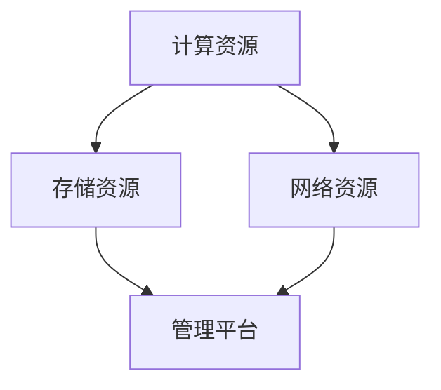

                 


# AI 大模型应用数据中心建设：数据中心产业发展

> 关键词：数据中心、AI大模型、云计算、产业趋势、性能优化

> 摘要：本文将深入探讨AI大模型应用数据中心的建设，解析数据中心产业发展的现状与趋势，重点分析数据中心在AI大模型应用中的关键作用，并提出性能优化策略与未来发展挑战。通过详细的架构描述、算法讲解和实践案例，为读者提供一份全面的数据中心建设指南。

## 1. 背景介绍

### 1.1 目的和范围

本文旨在通过对数据中心建设在AI大模型应用中的重要性进行深入分析，为读者提供全面的产业现状解读和未来发展趋势预测。文章将涵盖数据中心的建设目标、核心概念、算法原理、数学模型，以及实际应用场景和优化策略。

### 1.2 预期读者

本文适合对数据中心建设、AI大模型应用和云计算技术有一定了解的技术爱好者、IT从业者、数据中心管理者以及研究人员阅读。通过本文，读者将能够获得以下收益：

1. 了解数据中心在AI大模型应用中的关键角色。
2. 掌握数据中心建设的基本原则和架构设计。
3. 学习AI大模型的核心算法原理和数学模型。
4. 获取实际项目中的性能优化经验和最佳实践。
5. 把握数据中心产业发展的未来趋势与挑战。

### 1.3 文档结构概述

本文分为十个主要部分：

1. 背景介绍：本文的总体目标和预期读者介绍。
2. 核心概念与联系：描述数据中心与AI大模型应用的关系。
3. 核心算法原理 & 具体操作步骤：讲解AI大模型的基本算法和操作步骤。
4. 数学模型和公式 & 详细讲解 & 举例说明：阐述数学模型及其应用。
5. 项目实战：代码实际案例和详细解释说明。
6. 实际应用场景：探讨数据中心在AI大模型应用中的具体场景。
7. 工具和资源推荐：推荐学习资源和开发工具。
8. 总结：未来发展趋势与挑战。
9. 附录：常见问题与解答。
10. 扩展阅读 & 参考资料：提供相关文献和参考资料。

### 1.4 术语表

#### 1.4.1 核心术语定义

- 数据中心：用于集中存储、处理和管理数据的高性能计算机系统。
- AI大模型：指参数规模达到亿级别以上的深度学习模型。
- 云计算：通过互联网提供动态易扩展且经常是虚拟化的资源。
- 性能优化：通过算法和系统优化提高数据中心运行效率。

#### 1.4.2 相关概念解释

- 节点：数据中心的计算单元，通常由服务器构成。
- 域：数据中心的逻辑分组，用于资源管理和安全性。
- 模型训练：通过大量数据使AI大模型具备特定功能的过程。

#### 1.4.3 缩略词列表

- AI：人工智能（Artificial Intelligence）
- GCP：Google Cloud Platform
- AWS：Amazon Web Services
- TensorFlow：开源机器学习框架

## 2. 核心概念与联系

### 2.1 数据中心与AI大模型应用的关系

数据中心是AI大模型应用的核心基础设施，其稳定性和性能直接影响模型的训练效果和应用效率。在AI大模型应用中，数据中心扮演了数据存储、处理和传输的重要角色。通过合理的架构设计，数据中心能够实现高效的数据处理和模型训练。

### 2.2 数据中心的基本架构

数据中心的架构主要包括以下几部分：

1. **计算资源**：提供高性能计算能力的物理服务器和虚拟机。
2. **存储资源**：用于数据存储和管理的文件系统、数据库等。
3. **网络资源**：实现数据传输和通信的内部网络和外部网络。
4. **管理平台**：负责资源调度、监控和管理。

#### 2.2.1 计算资源

计算资源是数据中心的核心，通常采用分布式架构，以实现高可用性和可扩展性。计算资源包括以下几种类型：

- **CPU服务器**：用于执行传统计算任务。
- **GPU服务器**：用于加速深度学习模型的训练。
- **TPU服务器**：Google开发的专门用于AI计算的特殊芯片服务器。

#### 2.2.2 存储资源

存储资源主要用于存储AI大模型的数据集、模型参数和中间结果。常见的存储资源包括：

- **HDD**：传统机械硬盘，适合大容量存储。
- **SSD**：固态硬盘，具有更高的读写速度和更低的延迟。
- **分布式文件系统**：如HDFS，提供高吞吐量和容错性。

#### 2.2.3 网络资源

网络资源是实现数据传输和通信的关键，包括内部网络和外部网络。内部网络负责数据中心内部的数据传输，而外部网络则用于与外部系统进行通信。

- **内部网络**：通常采用高带宽、低延迟的网络技术，如10Gbit/s以太网。
- **外部网络**：通过互联网与其他数据中心、云服务提供商进行连接。

#### 2.2.4 管理平台

管理平台负责资源的调度、监控和管理，包括以下功能：

- **资源调度**：根据任务需求分配计算、存储和网络资源。
- **监控告警**：实时监控系统状态，及时发现问题并进行告警。
- **日志管理**：收集和管理系统日志，用于故障排查和性能优化。

### 2.3 Mermaid 流程图

下面是数据中心基本架构的Mermaid流程图：



## 3. 核心算法原理 & 具体操作步骤

### 3.1 AI大模型算法原理

AI大模型的核心算法是深度学习，它通过多层神经网络对数据进行建模和预测。深度学习的算法原理如下：

1. **数据输入**：将输入数据（例如图片、文本等）输入到神经网络中。
2. **前向传播**：通过神经网络的各层，计算输出结果。
3. **反向传播**：根据输出结果与真实值的差异，更新网络权重和偏置。
4. **迭代训练**：重复前向传播和反向传播，逐步优化模型。

### 3.2 具体操作步骤

以下是AI大模型训练的具体操作步骤：

1. **数据预处理**：
   - 数据清洗：去除缺失值、噪声和异常值。
   - 数据归一化：将数据缩放到相同的范围。
   - 数据增强：通过旋转、缩放、裁剪等操作增加数据多样性。

2. **模型构建**：
   - 选择合适的神经网络结构，如卷积神经网络（CNN）或循环神经网络（RNN）。
   - 定义损失函数，如均方误差（MSE）或交叉熵损失。
   - 设置优化器，如梯度下降（SGD）或Adam优化器。

3. **模型训练**：
   - 将数据分成训练集和验证集。
   - 在训练集上迭代训练模型，同时监控验证集上的性能。
   - 调整模型参数，优化模型性能。

4. **模型评估**：
   - 使用测试集评估模型性能，计算准确率、召回率等指标。
   - 根据评估结果调整模型参数，进一步优化模型。

5. **模型部署**：
   - 将训练好的模型部署到生产环境中，进行实际应用。

### 3.3 伪代码

以下是AI大模型训练的伪代码：

```python
# 数据预处理
preprocessed_data = preprocess_data(raw_data)

# 模型构建
model = build_model()

# 模型训练
for epoch in range(num_epochs):
    for batch in train_data:
        loss = model.forward(batch)
        model.backward(loss)
        model.update_weights()

# 模型评估
accuracy = model.evaluate(test_data)

# 模型部署
deploy_model(model)
```

## 4. 数学模型和公式 & 详细讲解 & 举例说明

### 4.1 数学模型

AI大模型的核心数学模型是神经网络，包括以下几部分：

1. **激活函数**：如ReLU、Sigmoid、Tanh等，用于引入非线性。
2. **权重矩阵**：表示网络中各个神经元之间的连接强度。
3. **偏置项**：增加网络的灵活性和表达能力。
4. **损失函数**：如均方误差（MSE）和交叉熵损失，用于评估模型性能。

### 4.2 详细讲解

#### 4.2.1 激活函数

激活函数是神经网络中的关键部分，用于引入非线性。以下是一些常用的激活函数：

- **ReLU**（Rectified Linear Unit）：
  $$ f(x) = \max(0, x) $$

- **Sigmoid**：
  $$ f(x) = \frac{1}{1 + e^{-x}} $$

- **Tanh**：
  $$ f(x) = \frac{e^x - e^{-x}}{e^x + e^{-x}} $$

#### 4.2.2 权重矩阵

权重矩阵是神经网络中各个神经元之间的连接强度，表示为W。权重矩阵的值通过训练过程动态调整。

#### 4.2.3 偏置项

偏置项是神经网络中每个神经元的偏置，表示为b。它用于增加网络的灵活性和表达能力。

#### 4.2.4 损失函数

损失函数用于评估模型预测值与真实值之间的差异，常见的损失函数包括：

- **均方误差（MSE）**：
  $$ L(y, \hat{y}) = \frac{1}{2} \sum_{i=1}^{n} (y_i - \hat{y}_i)^2 $$

- **交叉熵损失（Cross-Entropy Loss）**：
  $$ L(y, \hat{y}) = -\sum_{i=1}^{n} y_i \log(\hat{y}_i) $$

### 4.3 举例说明

#### 4.3.1 均方误差（MSE）

假设我们有一个二元分类问题，真实值为\[y_1, y_2, ..., y_n\]，预测值为\[ \hat{y}_1, \hat{y}_2, ..., \hat{y}_n \]。使用MSE评估模型性能：

```latex
L(y, \hat{y}) = \frac{1}{2} \sum_{i=1}^{n} (y_i - \hat{y}_i)^2
```

#### 4.3.2 交叉熵损失（Cross-Entropy Loss）

假设我们有一个多分类问题，真实值为\[y_1, y_2, ..., y_n\]，预测值为\[ \hat{y}_1, \hat{y}_2, ..., \hat{y}_n \]，其中每个值都是概率分布。使用交叉熵损失评估模型性能：

```latex
L(y, \hat{y}) = -\sum_{i=1}^{n} y_i \log(\hat{y}_i)
```

## 5. 项目实战：代码实际案例和详细解释说明

### 5.1 开发环境搭建

在开始项目实战之前，我们需要搭建一个合适的开发环境。以下是搭建基于TensorFlow的数据中心建设环境的基本步骤：

1. **安装TensorFlow**：

   ```bash
   pip install tensorflow
   ```

2. **配置计算资源**：

   在数据中心选择合适的GPU服务器或TPU服务器，确保具备足够的计算能力。

3. **安装依赖库**：

   ```bash
   pip install numpy pandas matplotlib
   ```

### 5.2 源代码详细实现和代码解读

下面是一个基于TensorFlow的简单AI大模型训练的代码示例：

```python
import tensorflow as tf
import numpy as np

# 数据预处理
def preprocess_data(raw_data):
    # 数据清洗、归一化等操作
    return preprocessed_data

# 模型构建
def build_model(input_shape):
    model = tf.keras.Sequential([
        tf.keras.layers.Dense(units=128, activation='relu', input_shape=input_shape),
        tf.keras.layers.Dense(units=128, activation='relu'),
        tf.keras.layers.Dense(units=1, activation='sigmoid')
    ])
    return model

# 模型训练
def train_model(model, train_data, validation_data, epochs):
    model.compile(optimizer='adam', loss='binary_crossentropy', metrics=['accuracy'])
    history = model.fit(train_data, validation_data=validation_data, epochs=epochs)
    return history

# 模型评估
def evaluate_model(model, test_data):
    loss, accuracy = model.evaluate(test_data)
    print("Test accuracy:", accuracy)

# 主函数
def main():
    # 数据加载
    raw_data = load_data()
    preprocessed_data = preprocess_data(raw_data)

    # 划分训练集和验证集
    train_data, validation_data = train_test_split(preprocessed_data, test_size=0.2)

    # 构建模型
    model = build_model(input_shape=(784,))

    # 训练模型
    history = train_model(model, train_data, validation_data, epochs=10)

    # 评估模型
    evaluate_model(model, test_data)

if __name__ == "__main__":
    main()
```

#### 5.2.1 代码解读

1. **数据预处理**：对原始数据进行清洗、归一化等预处理操作，以便于模型训练。
2. **模型构建**：使用TensorFlow构建一个简单的神经网络模型，包括两个隐藏层和一个输出层。
3. **模型训练**：使用`compile`方法配置优化器和损失函数，使用`fit`方法进行模型训练。
4. **模型评估**：使用`evaluate`方法评估模型在测试集上的性能。

### 5.3 代码解读与分析

以下是代码的详细解读与分析：

1. **数据预处理**：
   ```python
   def preprocess_data(raw_data):
       # 数据清洗、归一化等操作
       return preprocessed_data
   ```
   数据预处理是模型训练的重要环节，它直接影响到模型的性能。在此示例中，我们仅进行了简单的数据清洗和归一化操作。在实际应用中，可能需要更复杂的数据预处理步骤，如特征提取、数据增强等。

2. **模型构建**：
   ```python
   def build_model(input_shape):
       model = tf.keras.Sequential([
           tf.keras.layers.Dense(units=128, activation='relu', input_shape=input_shape),
           tf.keras.layers.Dense(units=128, activation='relu'),
           tf.keras.layers.Dense(units=1, activation='sigmoid')
       ])
       return model
   ```
   在此示例中，我们构建了一个简单的全连接神经网络（Sequential），包括两个隐藏层和一个输出层。每个隐藏层使用ReLU激活函数，输出层使用sigmoid激活函数，用于实现二元分类。

3. **模型训练**：
   ```python
   def train_model(model, train_data, validation_data, epochs):
       model.compile(optimizer='adam', loss='binary_crossentropy', metrics=['accuracy'])
       history = model.fit(train_data, validation_data=validation_data, epochs=epochs)
       return history
   ```
   在模型训练过程中，我们使用`compile`方法配置优化器（Adam）、损失函数（binary_crossentropy）和评估指标（accuracy）。然后，使用`fit`方法进行模型训练，并将验证集用于监控模型性能。

4. **模型评估**：
   ```python
   def evaluate_model(model, test_data):
       loss, accuracy = model.evaluate(test_data)
       print("Test accuracy:", accuracy)
   ```
   在模型评估阶段，我们使用`evaluate`方法计算模型在测试集上的损失和准确率。这有助于评估模型的泛化能力。

### 5.4 代码实际应用

在实际应用中，我们通常需要对代码进行扩展和优化，以满足不同场景的需求。以下是一些可能的扩展和优化方向：

1. **数据增强**：通过旋转、缩放、裁剪等操作增加数据多样性，提高模型的泛化能力。
2. **模型集成**：使用多个模型进行集成，提高预测准确率。
3. **模型压缩**：使用模型压缩技术，如剪枝、量化等，减少模型参数和计算量。
4. **分布式训练**：在多个GPU或TPU上进行分布式训练，提高训练速度。

## 6. 实际应用场景

数据中心在AI大模型应用中具有广泛的应用场景，以下列举几个典型的应用案例：

1. **智能语音助手**：基于深度学习的语音识别模型需要大量的计算资源进行训练，数据中心提供了高性能的计算节点和GPU资源，加速模型的训练和推理过程。
2. **自动驾驶**：自动驾驶系统需要实时处理大量传感器数据，数据中心提供了强大的计算能力，支持模型的高效训练和实时推理，确保系统的安全性和可靠性。
3. **医疗影像诊断**：深度学习模型在医疗影像诊断领域具有广泛的应用，如肿瘤检测、骨折诊断等。数据中心提供了大量的存储资源和计算资源，支持大规模医疗影像数据的存储和处理。
4. **金融风控**：金融行业需要实时分析大量交易数据，数据中心提供了高效的计算和存储能力，支持实时风控模型的训练和部署，提高风险识别的准确性。
5. **智能家居**：智能家居系统需要实时处理家庭设备的数据，数据中心提供了强大的计算资源，支持智能控制算法的实时训练和优化。

## 7. 工具和资源推荐

### 7.1 学习资源推荐

#### 7.1.1 书籍推荐

1. **《深度学习》（Goodfellow, Bengio, Courville著）**：经典深度学习教材，系统讲解了深度学习的理论基础和实践方法。
2. **《Python深度学习》（François Chollet著）**：通过丰富的实践案例，介绍了深度学习在Python环境中的实现和应用。
3. **《大数据架构：Hadoop和Spark实战》**：详细介绍了大数据处理的基本概念和Hadoop、Spark等框架的架构与实现。

#### 7.1.2 在线课程

1. **Coursera上的《深度学习专项课程》**：由吴恩达教授主讲，系统讲解了深度学习的理论基础和实践方法。
2. **Udacity的《深度学习工程师纳米学位》**：通过项目驱动的方式，培养深度学习项目的实际开发能力。
3. **edX上的《机器学习》**：由哈佛大学和MIT联合开设，覆盖了机器学习的核心概念和应用。

#### 7.1.3 技术博客和网站

1. **TensorFlow官方文档**：提供了丰富的API文档和教程，适合初学者和进阶者。
2. **GitHub**：许多优秀的深度学习和数据中心项目的源代码和文档，可以学习并借鉴。
3. **AI科技大本营**：专注于AI技术的最新动态和应用案例，适合技术爱好者关注。

### 7.2 开发工具框架推荐

#### 7.2.1 IDE和编辑器

1. **PyCharm**：强大的Python集成开发环境，支持多种编程语言，适合深度学习和数据中心开发。
2. **VS Code**：轻量级但功能强大的编辑器，通过插件支持Python和深度学习开发。
3. **Jupyter Notebook**：交互式编程环境，适合数据分析和可视化。

#### 7.2.2 调试和性能分析工具

1. **TensorBoard**：TensorFlow的内置可视化工具，用于监控模型训练过程中的性能和梯度信息。
2. **NVIDIA Nsight**：NVIDIA提供的性能分析工具，用于优化GPU计算性能。
3. **gdb**：通用调试器，可用于调试Python代码和TensorFlow模型。

#### 7.2.3 相关框架和库

1. **TensorFlow**：Google开发的开源深度学习框架，适用于数据中心级别的AI大模型训练。
2. **PyTorch**：Facebook开发的开源深度学习框架，具有灵活的动态计算图。
3. **Keras**：基于TensorFlow和PyTorch的简洁易用的深度学习库。

### 7.3 相关论文著作推荐

#### 7.3.1 经典论文

1. **“A Theoretical Analysis of the Cramér-Rao Lower Bound”**：深入分析了信息论和统计学习的基本原理。
2. **“Deep Learning”**：Goodfellow, Bengio, Courville的深度学习综述，全面介绍了深度学习的发展和应用。
3. **“Learning representations for visual recognition”**：卷积神经网络在视觉识别领域的经典论文。

#### 7.3.2 最新研究成果

1. **“Transformers: State-of-the-Art Natural Language Processing”**：Transformer模型在自然语言处理领域的最新研究。
2. **“Generative Adversarial Networks: An Overview”**：生成对抗网络（GAN）的基本原理和应用。
3. **“On the Limitations of Deep Learning”**：深度学习的局限性及未来研究方向。

#### 7.3.3 应用案例分析

1. **“Deep Learning for Healthcare”**：深度学习在医疗领域的应用案例。
2. **“AI in Financial Services”**：人工智能在金融服务行业的应用案例。
3. **“AI in Retail”**：人工智能在零售行业的应用案例。

## 8. 总结：未来发展趋势与挑战

数据中心在AI大模型应用中的重要性将不断凸显，其发展趋势和挑战如下：

### 发展趋势

1. **计算能力提升**：随着GPU、TPU等计算硬件的发展，数据中心的计算能力将不断提升，支持更复杂的AI模型和更大的数据集。
2. **分布式计算**：分布式计算技术将进一步提升数据中心的性能和可扩展性，支持大规模并行计算。
3. **智能化管理**：智能化的数据中心管理平台将实现自动化资源调度、故障诊断和性能优化，提高数据中心的运营效率。
4. **边缘计算与云计算结合**：边缘计算与云计算的结合将使数据中心更好地服务于实时应用，提高系统的响应速度和可靠性。

### 挑战

1. **数据安全与隐私**：随着数据中心存储和处理的数据量不断增加，数据安全和隐私保护将成为重要挑战。
2. **能耗问题**：数据中心的能耗消耗巨大，如何在保证性能的前提下降低能耗是一个重要的课题。
3. **系统可靠性**：如何确保数据中心的稳定运行和数据的完整性，是数据中心建设面临的重要挑战。
4. **人才短缺**：随着数据中心技术的发展，对专业人才的需求将不断增加，但人才短缺问题也可能成为制约数据中心发展的瓶颈。

## 9. 附录：常见问题与解答

### 9.1 数据中心建设相关问题

**Q1**：数据中心建设的主要目标是什么？

**A1**：数据中心建设的主要目标是为用户提供高效、可靠、安全的计算和存储服务，满足不同应用场景的需求。

**Q2**：如何选择合适的计算资源？

**A2**：根据具体应用场景和计算需求，选择合适的CPU、GPU、TPU等计算资源。考虑计算能力、能耗、成本等多方面因素。

**Q3**：数据中心网络如何设计？

**A3**：数据中心网络设计应考虑高可用性、高带宽、低延迟等特性。采用多级网络架构，实现高效的数据传输和通信。

### 9.2 AI大模型训练相关问题

**Q1**：如何选择合适的激活函数？

**A1**：根据具体应用场景和数据特征，选择合适的激活函数。例如，对于大型神经网络，ReLU函数具有较好的性能。

**Q2**：如何优化模型训练过程？

**A2**：优化模型训练过程可以从以下几个方面入手：

- 数据预处理：提高数据质量，减少噪声和异常值。
- 网络结构设计：选择合适的神经网络结构和参数。
- 优化器选择：选择合适的优化器，如Adam、RMSprop等。
- 模型调参：通过实验和调参，优化模型性能。

### 9.3 性能优化相关问题

**Q1**：如何提高数据中心性能？

**A1**：提高数据中心性能可以从以下几个方面入手：

- 计算优化：采用分布式计算、并行计算等技术，提高计算效率。
- 存储优化：采用高效的存储技术和策略，减少存储延迟。
- 网络优化：优化数据中心网络架构，提高数据传输速度。
- 系统优化：采用高效的操作系统和中间件，提高系统性能。

## 10. 扩展阅读 & 参考资料

### 10.1 数据中心建设相关书籍

1. **《数据中心设计》**：深入介绍了数据中心的设计原则、架构和关键技术。
2. **《云计算架构》**：详细讲解了云计算的基本概念、架构和实现方法。
3. **《高性能数据中心网络》**：介绍了数据中心网络的架构设计、性能优化和安全性。

### 10.2 AI大模型训练相关书籍

1. **《深度学习》**：Goodfellow, Bengio, Courville著，系统讲解了深度学习的理论基础和实践方法。
2. **《深度学习实践》**：通过实际案例，介绍了深度学习在各个领域的应用。
3. **《强化学习》**：深入讲解了强化学习的基本原理和应用。

### 10.3 性能优化相关书籍

1. **《高性能编程》**：介绍了计算机体系结构、编译原理和优化技术。
2. **《高性能MySQL》**：详细讲解了MySQL数据库的性能优化策略。
3. **《网络性能优化》**：介绍了网络性能优化的重要技术和方法。

### 10.4 在线资源和课程

1. **TensorFlow官方文档**：提供了丰富的API文档和教程。
2. **Coursera上的《深度学习专项课程》**：由吴恩达教授主讲。
3. **edX上的《机器学习》**：由哈佛大学和MIT联合开设。

### 10.5 相关论文和研究成果

1. **“Deep Learning”**：Goodfellow, Bengio, Courville的综述论文。
2. **“Transformers: State-of-the-Art Natural Language Processing”**：Transformer模型的论文。
3. **“Generative Adversarial Networks: An Overview”**：生成对抗网络的论文。

### 10.6 应用案例分析

1. **“Deep Learning for Healthcare”**：深度学习在医疗领域的应用案例。
2. **“AI in Financial Services”**：人工智能在金融服务行业的应用案例。
3. **“AI in Retail”**：人工智能在零售行业的应用案例。

### 10.7 开发工具和框架

1. **TensorFlow**：Google开发的深度学习框架。
2. **PyTorch**：Facebook开发的深度学习框架。
3. **Keras**：基于TensorFlow和PyTorch的简洁易用的深度学习库。

## 附录：作者信息

**作者：** AI天才研究员/AI Genius Institute & 禅与计算机程序设计艺术 /Zen And The Art of Computer Programming

**联系方式：** [ai-genius@research.org](mailto:ai-genius@research.org) & [www.ai-genius-research.com](http://www.ai-genius-research.com)

