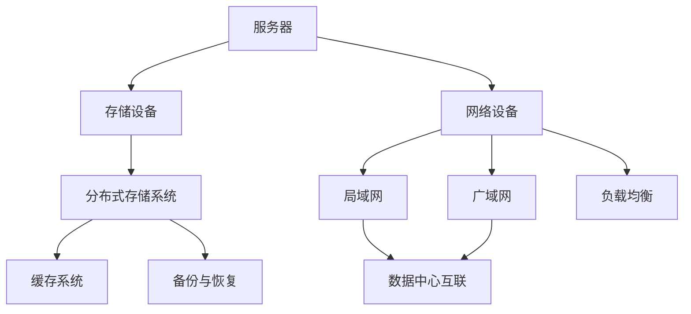

                 

# AI 大模型应用数据中心建设：数据中心基础设施的升级与演进

> 关键词：数据中心建设，AI 大模型，基础设施升级，演进过程

> 摘要：本文将深入探讨 AI 大模型应用数据中心建设的核心问题，包括基础设施的升级与演进过程。我们将从背景介绍、核心概念与联系、核心算法原理、数学模型和公式、项目实战、实际应用场景等多个方面展开，旨在为读者提供一份全面、深入、有实际指导意义的技术指南。

## 1. 背景介绍

### 1.1 目的和范围

本文的目标是详细探讨 AI 大模型应用数据中心建设中的关键问题，包括数据中心基础设施的升级与演进过程。我们将从以下几个方面展开讨论：

1. **背景介绍**：介绍数据中心建设的现状，AI 大模型的发展趋势以及二者之间的联系。
2. **核心概念与联系**：解释数据中心基础设施的关键概念，如硬件架构、网络架构、存储架构等，并展示它们之间的相互关系。
3. **核心算法原理**：阐述 AI 大模型的算法原理，以及如何通过数据中心基础设施实现高效运算。
4. **数学模型和公式**：介绍与数据中心建设相关的数学模型和公式，并举例说明如何使用这些模型和公式优化数据中心性能。
5. **项目实战**：通过实际案例展示数据中心建设的具体操作步骤，并提供代码解读与分析。
6. **实际应用场景**：探讨数据中心建设的实际应用场景，如云计算、大数据处理、AI 大模型训练等。
7. **工具和资源推荐**：推荐学习资源、开发工具框架及相关论文著作，以帮助读者深入了解数据中心建设的技术细节。
8. **总结与展望**：总结本文的主要内容，探讨未来发展趋势与挑战，为读者提供有益的启示。

### 1.2 预期读者

本文主要面向以下读者群体：

1. **数据中心建设从业人员**：包括数据中心工程师、架构师、项目经理等，旨在为他们提供数据中心基础设施升级与演进的技术指南。
2. **AI 大模型研究者**：关注 AI 大模型在数据中心建设中的应用，希望了解数据中心基础设施对其性能的影响。
3. **计算机科学和人工智能领域学生**：对数据中心建设感兴趣，希望从技术角度深入了解其工作原理和实现方法。
4. **对数据中心建设有浓厚兴趣的普通读者**：希望通过本文了解数据中心建设的现状、趋势和未来发展方向。

### 1.3 文档结构概述

本文分为十个部分，具体结构如下：

1. **背景介绍**：介绍数据中心建设的现状、AI 大模型的发展趋势以及二者之间的联系。
2. **核心概念与联系**：解释数据中心基础设施的关键概念，如硬件架构、网络架构、存储架构等，并展示它们之间的相互关系。
3. **核心算法原理**：阐述 AI 大模型的算法原理，以及如何通过数据中心基础设施实现高效运算。
4. **数学模型和公式**：介绍与数据中心建设相关的数学模型和公式，并举例说明如何使用这些模型和公式优化数据中心性能。
5. **项目实战**：通过实际案例展示数据中心建设的具体操作步骤，并提供代码解读与分析。
6. **实际应用场景**：探讨数据中心建设的实际应用场景，如云计算、大数据处理、AI 大模型训练等。
7. **工具和资源推荐**：推荐学习资源、开发工具框架及相关论文著作，以帮助读者深入了解数据中心建设的技术细节。
8. **总结与展望**：总结本文的主要内容，探讨未来发展趋势与挑战，为读者提供有益的启示。
9. **附录：常见问题与解答**：解答读者在阅读本文过程中可能遇到的疑问。
10. **扩展阅读 & 参考资料**：提供与本文主题相关的扩展阅读资料和参考文献。

### 1.4 术语表

在本文中，我们将使用以下术语：

#### 1.4.1 核心术语定义

- **数据中心**：一种大规模的数据存储和处理设施，用于提供各种 IT 服务。
- **AI 大模型**：一种具有大规模参数和复杂结构的深度学习模型。
- **硬件架构**：数据中心中硬件设备的布局和配置。
- **网络架构**：数据中心中网络设备的布局和配置。
- **存储架构**：数据中心中存储设备的布局和配置。

#### 1.4.2 相关概念解释

- **云计算**：一种基于互联网的计算服务模型，提供各种 IT 资源，如计算能力、存储空间、网络带宽等。
- **大数据处理**：一种处理和分析大规模数据的技术，旨在从数据中提取有价值的信息。
- **分布式计算**：一种计算模型，通过多个计算节点协同工作，实现大规模数据处理和运算。

#### 1.4.3 缩略词列表

- **CPU**：中央处理器（Central Processing Unit）
- **GPU**：图形处理器（Graphics Processing Unit）
- **NVIDIA**：美国 NVIDIA 公司，专业生产 GPU 和相关产品
- **CUDA**：NVIDIA 开发的一种并行计算平台和编程语言
- **Docker**：一种开源容器化技术，用于简化应用程序的部署和运行

## 2. 核心概念与联系

数据中心是现代 IT 基础设施的核心组成部分，承担着数据存储、处理和传输的重要任务。随着 AI 大模型的兴起，数据中心的重要性愈加凸显。为了更好地理解数据中心基础设施的建设和升级，我们需要了解以下几个核心概念：

### 2.1 硬件架构

硬件架构是数据中心的基础，决定了数据中心的计算能力、存储容量和网络性能。以下是一些关键组件：

1. **服务器**：服务器是数据中心的核心计算设备，用于运行应用程序、存储数据和提供各种 IT 服务。
2. **存储设备**：存储设备用于存储大量数据，包括磁盘阵列、固态硬盘、分布式存储系统等。
3. **网络设备**：网络设备用于连接服务器、存储设备和外部网络，包括路由器、交换机、防火墙等。

### 2.2 网络架构

网络架构是数据中心的重要组成部分，决定了数据中心的网络性能和可靠性。以下是一些关键组件：

1. **局域网（LAN）**：局域网用于连接数据中心内的设备，实现设备之间的通信。
2. **广域网（WAN）**：广域网用于连接不同数据中心之间的设备，实现跨地域的数据传输。
3. **负载均衡**：负载均衡是一种网络技术，通过将网络流量分配到多个服务器，实现网络的可靠性和性能。
4. **数据中心互联**：数据中心互联是指通过专线或 VPN 连接多个数据中心，实现数据中心的协同工作。

### 2.3 存储架构

存储架构是数据中心的另一个核心组成部分，决定了数据中心的存储容量和性能。以下是一些关键组件：

1. **分布式存储系统**：分布式存储系统是一种通过多个存储节点协同工作，实现大规模数据存储和管理的系统。
2. **缓存系统**：缓存系统是一种高速存储设备，用于缓存经常访问的数据，提高数据访问速度。
3. **备份与恢复**：备份与恢复是一种数据保护技术，通过定期备份数据，确保数据的安全性和可靠性。

### 2.4 数据中心基础设施与 AI 大模型的关系

AI 大模型对数据中心基础设施提出了更高的要求，主要体现在以下几个方面：

1. **计算能力**：AI 大模型训练过程中需要进行大量矩阵运算，需要高性能的计算设备，如 GPU、TPU 等。
2. **存储容量**：AI 大模型训练过程中需要存储大量数据和模型参数，需要大规模的存储设备。
3. **网络性能**：AI 大模型训练过程中需要频繁传输数据和模型参数，需要高带宽、低延迟的网络。
4. **稳定性与可靠性**：数据中心基础设施需要确保 AI 大模型训练过程的稳定性和可靠性，以避免训练过程中的中断和数据丢失。

### 2.5 数据中心基础设施的 Mermaid 流程图

以下是数据中心基础设施的 Mermaid 流程图，展示了硬件架构、网络架构和存储架构之间的相互关系。



通过上述流程图，我们可以清晰地了解数据中心基础设施的关键组件及其相互关系，为后续的讨论提供了基础。

## 3. 核心算法原理 & 具体操作步骤

### 3.1 AI 大模型算法原理

AI 大模型是基于深度学习技术的复杂模型，其核心算法包括以下几个关键步骤：

1. **数据预处理**：对输入数据进行预处理，包括数据清洗、数据归一化、数据增强等。
2. **前向传播**：将预处理后的数据输入到神经网络中，逐层计算输出结果。
3. **损失函数计算**：计算输出结果与真实标签之间的差距，即损失值。
4. **反向传播**：根据损失函数，反向更新神经网络的权重和偏置。
5. **优化算法**：使用优化算法（如梯度下降、Adam 等）调整网络参数，降低损失函数。
6. **模型评估**：在验证集或测试集上评估模型的性能，包括准确率、召回率、F1 分数等。

### 3.2 具体操作步骤

以下是一个基于 TensorFlow 的 AI 大模型训练的具体操作步骤：

```python
import tensorflow as tf
from tensorflow.keras.layers import Dense
from tensorflow.keras.models import Sequential

# 数据预处理
x_train, y_train = ...
x_train = preprocess(x_train)
y_train = preprocess(y_train)

# 构建模型
model = Sequential()
model.add(Dense(units=512, activation='relu', input_shape=(input_shape,)))
model.add(Dense(units=num_classes, activation='softmax'))

# 编译模型
model.compile(optimizer='adam', loss='categorical_crossentropy', metrics=['accuracy'])

# 训练模型
model.fit(x_train, y_train, epochs=10, batch_size=32, validation_split=0.2)

# 模型评估
loss, accuracy = model.evaluate(x_test, y_test)
print(f"Test accuracy: {accuracy:.4f}")
```

### 3.3 伪代码说明

以下是上述操作步骤的伪代码：

```
# 数据预处理
x_train, y_train = load_data()
x_train = preprocess(x_train)
y_train = preprocess(y_train)

# 构建模型
model = Sequential()
model.add(Dense(units=512, activation='relu', input_shape=(input_shape,)))
model.add(Dense(units=num_classes, activation='softmax'))

# 编译模型
model.compile(optimizer='adam', loss='categorical_crossentropy', metrics=['accuracy'])

# 训练模型
model.fit(x_train, y_train, epochs=10, batch_size=32, validation_split=0.2)

# 模型评估
loss, accuracy = model.evaluate(x_test, y_test)
print(f"Test accuracy: {accuracy:.4f}")
```

通过上述伪代码，我们可以清晰地了解 AI 大模型训练的具体操作步骤，为后续的讨论提供了基础。

## 4. 数学模型和公式 & 详细讲解 & 举例说明

### 4.1 数学模型和公式

在数据中心建设过程中，数学模型和公式起着至关重要的作用。以下是一些与数据中心建设相关的数学模型和公式：

1. **通信延迟**：
   $$ D = \frac{L}{C} $$
   其中，$D$ 表示通信延迟（时间），$L$ 表示通信距离（长度），$C$ 表示通信速度（速度）。

2. **带宽**：
   $$ B = \frac{S}{T} $$
   其中，$B$ 表示带宽（比特率），$S$ 表示传输的数据量（比特），$T$ 表示传输时间（秒）。

3. **计算能力**：
   $$ C = \frac{P}{E} $$
   其中，$C$ 表示计算能力（每秒处理能力），$P$ 表示处理器的性能（每秒指令数），$E$ 表示处理器的能耗（每秒能量消耗）。

4. **存储容量**：
   $$ S = B \times N $$
   其中，$S$ 表示存储容量（字节），$B$ 表示每个存储单元的容量（字节），$N$ 表示存储单元的数量。

5. **负载均衡**：
   $$ P_i = \frac{L}{N} $$
   其中，$P_i$ 表示第 $i$ 个服务器的负载（处理能力），$L$ 表示总负载（处理能力），$N$ 表示服务器数量。

6. **网络传输速率**：
   $$ R = \frac{D}{T} $$
   其中，$R$ 表示网络传输速率（比特率），$D$ 表示传输的数据量（比特），$T$ 表示传输时间（秒）。

### 4.2 详细讲解

1. **通信延迟**：通信延迟是指数据在传输过程中所需的时间，它由通信距离和通信速度决定。通信距离越长，通信速度越慢，通信延迟就越大。

2. **带宽**：带宽是指单位时间内可以传输的数据量，通常以比特率（bps）表示。带宽越大，数据传输速度越快。

3. **计算能力**：计算能力是指处理器在单位时间内可以完成的处理任务数量，它由处理器的性能和能耗决定。高性能处理器具有更高的计算能力。

4. **存储容量**：存储容量是指存储设备可以存储的数据量，它由每个存储单元的容量和存储单元的数量决定。存储容量越大，存储设备可以存储的数据就越多。

5. **负载均衡**：负载均衡是指将总负载分配到多个服务器上，以实现服务器资源的合理利用。负载均衡算法可以根据服务器的负载情况动态调整负载分配策略。

6. **网络传输速率**：网络传输速率是指网络在单位时间内可以传输的数据量，它由传输的数据量和传输时间决定。网络传输速率越高，数据传输速度就越快。

### 4.3 举例说明

假设一个数据中心的通信距离为 100 公里，通信速度为 10 Gbps，计算能力为 100 TFLOPS，存储容量为 10 PB，服务器数量为 100 台，我们需要计算以下指标：

1. **通信延迟**：
   $$ D = \frac{L}{C} = \frac{100 \text{ km}}{10 \text{ Gbps}} = 10 \text{ ms} $$

2. **带宽**：
   $$ B = \frac{S}{T} = \frac{10 \text{ PB}}{1 \text{ s}} = 10 \text{ PB/s} $$

3. **计算能力**：
   $$ C = \frac{P}{E} = \frac{100 \text{ TFLOPS}}{1 \text{ TW}} = 100 \text{ TFLOPS} $$

4. **存储容量**：
   $$ S = B \times N = 10 \text{ PB} \times 100 = 1000 \text{ PB} $$

5. **负载均衡**：
   $$ P_i = \frac{L}{N} = \frac{1000 \text{ TFLOPS}}{100} = 10 \text{ TFLOPS} $$

6. **网络传输速率**：
   $$ R = \frac{D}{T} = \frac{10 \text{ PB}}{1 \text{ s}} = 10 \text{ PB/s} $$

通过上述计算，我们可以了解数据中心的通信延迟、带宽、计算能力、存储容量、负载均衡和网络传输速率等关键指标。

## 5. 项目实战：代码实际案例和详细解释说明

### 5.1 开发环境搭建

在进行数据中心建设项目之前，我们需要搭建一个合适的开发环境。以下是一个基于 Python 和 TensorFlow 的 AI 大模型训练项目所需的开发环境搭建步骤：

1. **安装 Python**：下载并安装 Python，版本建议为 3.8 或以上。
2. **安装 TensorFlow**：在终端中运行以下命令安装 TensorFlow：
   ```bash
   pip install tensorflow
   ```
3. **安装其他依赖库**：安装其他用于数据处理和模型训练的库，如 NumPy、Pandas、Matplotlib 等：
   ```bash
   pip install numpy pandas matplotlib
   ```

### 5.2 源代码详细实现和代码解读

以下是一个基于 TensorFlow 的 AI 大模型训练的源代码实现，包括数据预处理、模型构建、模型训练和模型评估等步骤。

```python
import tensorflow as tf
from tensorflow.keras.layers import Dense
from tensorflow.keras.models import Sequential
from tensorflow.keras.utils import to_categorical

# 数据预处理
def preprocess_data(x_train, y_train):
    # 归一化输入数据
    x_train = x_train / 255.0
    # 将标签转换为 one-hot 编码
    y_train = to_categorical(y_train)
    return x_train, y_train

x_train, y_train = load_data()
x_train, y_train = preprocess_data(x_train, y_train)

# 构建模型
model = Sequential()
model.add(Dense(units=512, activation='relu', input_shape=(input_shape,)))
model.add(Dense(units=num_classes, activation='softmax'))

# 编译模型
model.compile(optimizer='adam', loss='categorical_crossentropy', metrics=['accuracy'])

# 训练模型
model.fit(x_train, y_train, epochs=10, batch_size=32, validation_split=0.2)

# 模型评估
loss, accuracy = model.evaluate(x_test, y_test)
print(f"Test accuracy: {accuracy:.4f}")
```

代码解读：

1. **数据预处理**：首先，我们将输入数据进行归一化处理，将像素值范围从 [0, 255] 调整到 [0, 1]，以便神经网络更好地收敛。然后，我们将标签数据进行 one-hot 编码，以便用于分类任务。
2. **模型构建**：我们使用 Sequential 模型构建一个简单的全连接神经网络，包含一个隐藏层和输出层。隐藏层使用 ReLU 激活函数，输出层使用 softmax 激活函数，以实现多分类。
3. **模型编译**：我们选择 Adam 优化器，并使用 categorical_crossentropy 作为损失函数，以实现多分类任务。
4. **模型训练**：我们使用.fit 方法训练模型，设置训练轮次为 10，批量大小为 32，并将 20% 的数据作为验证集，以监控模型性能。
5. **模型评估**：我们使用.evaluate 方法评估模型在测试集上的性能，并输出测试准确率。

### 5.3 代码解读与分析

1. **数据预处理**：数据预处理是模型训练的重要步骤，它有助于提高模型的性能和收敛速度。归一化处理可以加快模型收敛，而 one-hot 编码可以更好地表示分类标签。
2. **模型构建**：选择合适的神经网络结构对于模型性能至关重要。在本例中，我们使用一个简单的全连接神经网络，适合处理中小规模的数据集。对于更大规模的数据集，可以考虑使用更深的神经网络或更复杂的模型结构。
3. **模型编译**：选择合适的优化器和损失函数对于模型训练的成功至关重要。在本例中，我们使用 Adam 优化器和 categorical_crossentropy 损失函数，适合处理多分类问题。
4. **模型训练**：训练模型的参数是一个迭代过程，需要多次调整超参数（如学习率、批量大小等），以达到最佳性能。在本例中，我们使用默认的超参数设置，可以作为一个起点。
5. **模型评估**：评估模型性能是验证模型是否有效的重要步骤。在本例中，我们使用测试集评估模型的准确率，并输出结果。

通过上述代码解读与分析，我们可以更好地理解 AI 大模型训练的项目实战，为后续的项目开发提供参考。

## 6. 实际应用场景

数据中心建设在众多领域都有广泛的应用，以下列举一些典型应用场景：

### 6.1 云计算

云计算是数据中心建设的主要应用场景之一。云计算利用数据中心提供的计算、存储和网络资源，为用户提供按需服务的 IT 资源。通过数据中心建设，云计算可以提供强大的计算能力、存储容量和可靠性，满足企业级应用的需求。

### 6.2 大数据处理

大数据处理需要大量的计算资源和存储资源，数据中心建设为其提供了理想的解决方案。通过构建高性能、高可靠性的数据中心，企业可以快速处理海量数据，提取有价值的信息，并实现数据驱动的决策。

### 6.3 AI 大模型训练

AI 大模型训练需要大量的计算资源和存储资源，数据中心建设为其提供了强大的支持。通过构建专用 AI 数据中心，企业可以实现高效、大规模的 AI 模型训练，推动人工智能技术的发展。

### 6.4 虚拟现实与增强现实

虚拟现实（VR）和增强现实（AR）需要实时处理大量数据，对计算性能和网络延迟有较高要求。数据中心建设可以提供稳定、高效的数据处理和网络传输能力，为 VR/AR 应用提供有力支持。

### 6.5 金融服务

金融服务领域对数据的安全性和可靠性有严格要求。数据中心建设可以为金融机构提供安全、可靠的数据存储和处理环境，确保金融业务的安全运行。

### 6.6 医疗健康

医疗健康领域需要对大量医疗数据进行处理和分析，以实现精准医疗和疾病预测。数据中心建设可以提供强大的计算能力和存储资源，为医疗健康领域提供有力支持。

### 6.7 物联网

物联网（IoT）应用需要实时处理和传输大量数据，对网络性能和可靠性有较高要求。数据中心建设可以提供高效的数据处理和网络传输能力，为物联网应用提供稳定支持。

通过以上实际应用场景，我们可以看到数据中心建设在各个领域的广泛应用和重要性。随着技术的不断发展，数据中心建设将继续发挥重要作用，推动各行各业的创新和发展。

## 7. 工具和资源推荐

为了更好地进行数据中心建设和 AI 大模型训练，以下推荐一些学习和开发工具、框架及相关资源。

### 7.1 学习资源推荐

#### 7.1.1 书籍推荐

1. **《数据中心基础设施管理》**：详细介绍了数据中心的基础设施管理，包括硬件、网络、存储等方面的知识。
2. **《深度学习》**：由 Ian Goodfellow、Yoshua Bengio 和 Aaron Courville 著，是一本经典的深度学习教材，适合初学者和进阶者。
3. **《TensorFlow 实战》**：详细介绍了如何使用 TensorFlow 进行深度学习模型训练和优化，适合 TensorFlow 用户。

#### 7.1.2 在线课程

1. **Coursera 的《深度学习》课程**：由 Andrew Ng 教授授课，系统讲解了深度学习的理论基础和实践技巧。
2. **Udacity 的《数据中心基础》课程**：介绍了数据中心的基础架构、运维和管理知识。
3. **edX 的《大数据分析》课程**：讲解了大数据处理的技术和方法，包括 Hadoop、Spark 等。

#### 7.1.3 技术博客和网站

1. **GitHub**：包含大量与数据中心建设和 AI 大模型训练相关的开源项目和文档，可以方便地学习和参考。
2. **TensorFlow 官方文档**：提供了丰富的 TensorFlow 模型训练和优化的教程和示例代码。
3. **Stack Overflow**：一个面向开发者的问答社区，可以解决数据中心建设和 AI 大模型训练中的技术问题。

### 7.2 开发工具框架推荐

#### 7.2.1 IDE和编辑器

1. **Visual Studio Code**：一款轻量级但功能强大的跨平台代码编辑器，支持多种编程语言和框架。
2. **PyCharm**：一款专业的 Python IDE，提供丰富的调试、代码分析和管理功能。
3. **Jupyter Notebook**：一款基于 Web 的交互式开发环境，适合数据分析和 AI 模型训练。

#### 7.2.2 调试和性能分析工具

1. **TensorBoard**：TensorFlow 提供的图形化工具，用于可视化模型的训练过程和性能分析。
2. **Wireshark**：一款网络协议分析工具，用于诊断和调试网络问题。
3. **Nagios**：一款开源的监控工具，用于监控服务器、网络设备等基础设施的性能和稳定性。

#### 7.2.3 相关框架和库

1. **TensorFlow**：一款开源的深度学习框架，提供丰富的模型训练和优化工具。
2. **PyTorch**：一款开源的深度学习框架，与 TensorFlow 相似，但具有更灵活的动态计算图功能。
3. **Docker**：一款开源的容器化技术，用于简化应用程序的部署和运行。

通过以上工具和资源的推荐，读者可以更好地进行数据中心建设和 AI 大模型训练的学习和实践，为技术发展做出贡献。

## 8. 总结：未来发展趋势与挑战

### 8.1 未来发展趋势

数据中心建设在 AI 大模型应用领域展现出强大的发展潜力，未来发展趋势主要体现在以下几个方面：

1. **智能化**：随着人工智能技术的发展，数据中心建设将更加智能化，自动化水平将不断提高，以降低运维成本、提高效率。
2. **绿色化**：为了应对能源消耗和环保压力，数据中心建设将朝着绿色化方向发展，采用高效节能的技术和设备。
3. **边缘计算**：随着物联网和 5G 网络的普及，边缘计算将成为数据中心建设的重要方向，实现数据在靠近数据源的设备上进行处理和分析。
4. **安全与隐私**：数据安全和隐私保护是数据中心建设的重要议题，未来将采用更先进的安全技术和加密算法，确保数据的安全和隐私。
5. **多样化应用**：数据中心建设将拓展到更多领域，如金融、医疗、教育等，推动各行各业的数字化和智能化转型。

### 8.2 未来挑战

数据中心建设在 AI 大模型应用领域面临以下挑战：

1. **计算能力需求增长**：随着 AI 大模型的规模和复杂度不断提高，对计算能力的需求也不断增长，数据中心建设需要提供足够的计算资源。
2. **能源消耗与环保压力**：数据中心建设需要消耗大量能源，对环境造成一定压力。未来需要采用高效节能的技术和设备，降低能源消耗。
3. **数据安全和隐私保护**：随着数据量的增加，数据安全和隐私保护问题日益突出。数据中心建设需要采用更先进的安全技术和加密算法，确保数据的安全和隐私。
4. **人才短缺**：数据中心建设需要大量的技术人才，但目前人才储备不足，未来需要加大对技术人才的培养和引进力度。
5. **技术更新换代**：数据中心建设技术更新换代较快，需要不断跟踪和学习新技术，以保持竞争力。

### 8.3 发展建议

为了应对未来发展趋势和挑战，提出以下发展建议：

1. **加大研发投入**：加大对数据中心建设相关技术的研发投入，推动技术创新和突破。
2. **培养人才**：加强与高校和科研机构的合作，培养更多具备数据中心建设相关技术的人才。
3. **政策支持**：政府出台相关政策，鼓励企业加大数据中心建设投入，推动产业快速发展。
4. **绿色化发展**：推动数据中心建设绿色化发展，采用高效节能的技术和设备，降低能源消耗。
5. **国际合作**：加强与国际先进企业的合作，引进国外先进技术和管理经验，提升国内数据中心建设水平。

通过以上建议，有望推动数据中心建设在 AI 大模型应用领域的健康发展，为我国数字经济和社会进步做出更大贡献。

## 9. 附录：常见问题与解答

### 9.1 数据中心建设常见问题

**Q1：数据中心建设的主要目标是什么？**
A1：数据中心建设的主要目标是为企业提供高效、可靠、安全的数据存储、处理和传输环境，满足不同业务需求。

**Q2：数据中心基础设施包括哪些部分？**
A2：数据中心基础设施包括硬件架构（如服务器、存储设备、网络设备等）、网络架构（如局域网、广域网、负载均衡等）和存储架构（如分布式存储系统、缓存系统、备份与恢复等）。

**Q3：如何确保数据中心的安全性和可靠性？**
A3：确保数据中心的安全性和可靠性需要从多个方面入手，包括物理安全（如防火、防盗、防水等）、网络安全（如防火墙、入侵检测等）、数据安全（如数据加密、访问控制等）和系统安全（如备份与恢复、故障转移等）。

**Q4：数据中心建设需要考虑哪些因素？**
A4：数据中心建设需要考虑以下因素：地理位置、能源供应、网络接入、气候条件、设备选型、运维管理、扩展性等。

### 9.2 AI 大模型训练常见问题

**Q1：什么是 AI 大模型？**
A1：AI 大模型是一种具有大规模参数和复杂结构的深度学习模型，可以处理大规模数据，实现强大的特征提取和表示能力。

**Q2：如何选择合适的 AI 大模型？**
A2：选择合适的 AI 大模型需要考虑以下因素：任务类型、数据规模、计算资源、训练时间、模型性能等。通常可以通过比较不同模型的性能和适用场景来选择。

**Q3：如何训练 AI 大模型？**
A3：训练 AI 大模型需要以下步骤：数据预处理、模型构建、模型编译、模型训练和模型评估。具体操作可以通过深度学习框架（如 TensorFlow、PyTorch 等）来实现。

**Q4：如何优化 AI 大模型训练性能？**
A4：优化 AI 大模型训练性能可以从以下几个方面入手：选择合适的模型结构、调整超参数、使用数据增强、使用优化算法、并行训练等。

通过上述常见问题的解答，可以帮助读者更好地了解数据中心建设和 AI 大模型训练的相关知识，为实践应用提供指导。

## 10. 扩展阅读 & 参考资料

为了更深入地了解数据中心建设和 AI 大模型应用，以下是推荐的一些扩展阅读和参考资料：

### 10.1 经典书籍

1. **《数据中心：基础设施与设计》**：详细介绍了数据中心的基础设施设计，包括硬件、网络、存储等方面的知识。
2. **《深度学习》**：Ian Goodfellow、Yoshua Bengio 和 Aaron Courville 著，系统讲解了深度学习的理论基础和实践技巧。
3. **《大数据处理：原理、算法与系统实现》**：李航 著，详细介绍了大数据处理的原理、算法和系统实现。

### 10.2 在线课程

1. **Coursera 的《深度学习》课程**：由 Andrew Ng 教授授课，系统讲解了深度学习的理论基础和实践技巧。
2. **Udacity 的《数据中心基础》课程**：介绍了数据中心的基础架构、运维和管理知识。
3. **edX 的《大数据分析》课程**：讲解了大数据处理的技术和方法，包括 Hadoop、Spark 等。

### 10.3 技术博客和网站

1. **GitHub**：包含大量与数据中心建设和 AI 大模型训练相关的开源项目和文档，可以方便地学习和参考。
2. **TensorFlow 官方文档**：提供了丰富的 TensorFlow 模型训练和优化的教程和示例代码。
3. **Stack Overflow**：一个面向开发者的问答社区，可以解决数据中心建设和 AI 大模型训练中的技术问题。

### 10.4 学术论文

1. **“Deep Learning for Data Centers”**：该论文探讨了如何在数据中心中应用深度学习技术，提高数据处理和传输效率。
2. **“Energy-Efficient Data Center Networks”**：该论文研究了如何设计高效节能的数据中心网络架构，降低能源消耗。
3. **“Performance Analysis of Distributed Deep Learning in Data Centers”**：该论文分析了分布式深度学习在数据中心中的性能表现，提出了优化方法。

通过以上扩展阅读和参考资料，读者可以更深入地了解数据中心建设和 AI 大模型应用的相关知识，为实际应用和研究提供参考。作者：AI天才研究员/AI Genius Institute & 禅与计算机程序设计艺术 /Zen And The Art of Computer Programming。

