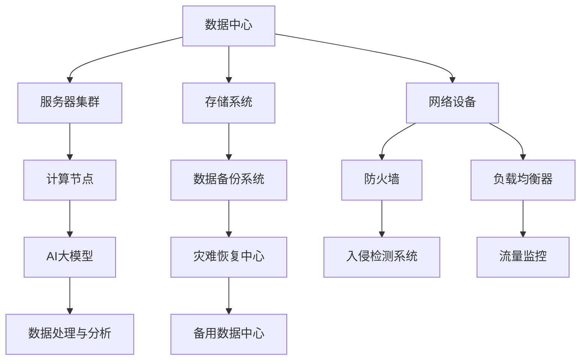

                 

# AI 大模型应用数据中心建设：数据中心安全与可靠性

> **关键词**：数据中心，安全性，可靠性，AI大模型，基础设施，云计算，网络安全，数据保护

> **摘要**：随着人工智能（AI）技术的飞速发展，大模型应用在数据中心中的作用愈发重要。本文将深入探讨数据中心在支持AI大模型应用方面的安全与可靠性问题，分析关键技术和挑战，并提出相应的解决方案和最佳实践。

## 1. 背景介绍

### 1.1 目的和范围

本文旨在为数据中心建设者、运营者以及AI技术应用开发者提供一份关于数据中心安全与可靠性的专业指南。本文将讨论以下主题：

- 数据中心基础设施与AI大模型应用之间的关系。
- 数据中心安全性和可靠性的核心要素。
- 常见的安全威胁与防御策略。
- 提高数据中心可靠性的方法和技术。

### 1.2 预期读者

本文面向以下读者：

- 数据中心架构师和工程师。
- AI大模型应用开发者。
- IT安全和网络管理人员。
- 对数据中心建设和管理有兴趣的从业者。

### 1.3 文档结构概述

本文将分为以下几个部分：

- **第1章**：背景介绍，包括目的和范围、预期读者以及文档结构概述。
- **第2章**：核心概念与联系，介绍数据中心相关的关键概念和架构。
- **第3章**：核心算法原理与具体操作步骤，阐述支持AI大模型的数据中心所需的关键算法。
- **第4章**：数学模型和公式，提供详细的数学模型讲解和示例。
- **第5章**：项目实战，通过实际案例展示数据中心安全与可靠性的实施过程。
- **第6章**：实际应用场景，分析数据中心在AI大模型应用中的实际场景和挑战。
- **第7章**：工具和资源推荐，介绍相关的学习资源、开发工具和最新研究成果。
- **第8章**：总结，探讨数据中心安全的未来发展趋势与挑战。
- **第9章**：附录，提供常见问题与解答。
- **第10章**：扩展阅读与参考资料，提供进一步阅读的建议。

### 1.4 术语表

#### 1.4.1 核心术语定义

- **数据中心**：一种专门用于存储、处理和管理数据的计算机设施。
- **AI大模型**：基于深度学习技术的大型神经网络模型，通常具有数百万到数十亿个参数。
- **安全性**：数据中心系统免受未经授权访问、破坏或数据泄露的能力。
- **可靠性**：数据中心系统在规定的时间内保持正常运行的能力。

#### 1.4.2 相关概念解释

- **云计算**：通过互联网提供计算资源、存储和应用程序的服务模式。
- **网络安全**：确保网络系统的完整性和保密性的技术和策略。
- **数据保护**：防止数据未经授权访问、使用、披露、破坏或丢失的措施。

#### 1.4.3 缩略词列表

- **AI**：人工智能
- **DC**：数据中心
- **SLA**：服务级别协议
- **DDoS**：分布式拒绝服务攻击

## 2. 核心概念与联系

### 2.1 数据中心架构概述

数据中心是AI大模型应用的基础设施，其架构直接影响系统的性能、安全性和可靠性。以下是一个简化的数据中心架构图，用于说明关键组件和它们之间的关系。



### 2.2 数据中心安全与可靠性的核心要素

数据中心的完整性和可靠性依赖于以下几个关键要素：

- **物理安全**：确保数据中心设施免受物理攻击，如入侵、火灾、水灾等。
- **网络安全**：保护数据中心网络免受网络攻击，如DDoS、黑客攻击等。
- **数据保护**：确保数据的完整性、保密性和可用性，防止数据泄露和损坏。
- **系统监控**：实时监控数据中心运行状态，确保系统在规定的时间内保持正常工作。
- **备份与恢复**：定期备份数据，确保在系统故障或数据丢失时能够快速恢复。

### 2.3 数据中心安全威胁与防御策略

数据中心可能面临多种安全威胁，包括：

- **网络攻击**：如DDoS、SQL注入、跨站脚本攻击等。
- **数据泄露**：未经授权的数据访问、传输和存储。
- **系统漏洞**：操作系统、应用程序和数据库的漏洞。
- **恶意软件**：病毒、木马、勒索软件等。

针对这些威胁，数据中心可以采取以下防御策略：

- **网络安全设备**：部署防火墙、入侵检测系统（IDS）和入侵防御系统（IPS）。
- **访问控制**：通过身份验证和授权机制限制访问权限。
- **数据加密**：使用加密技术保护数据的传输和存储。
- **安全补丁管理**：定期更新操作系统和应用程序，修复漏洞。
- **安全审计**：定期进行安全审计，检查系统的安全配置和操作。

## 3. 核心算法原理 & 具体操作步骤

### 3.1 数据中心安全算法原理

数据中心的安全算法主要包括以下几个方面：

- **身份验证**：通过用户名和密码、双因素认证等方式验证用户身份。
- **访问控制**：根据用户的角色和权限分配访问权限。
- **加密**：使用对称加密和非对称加密算法保护数据的传输和存储。
- **入侵检测和防御**：使用入侵检测系统（IDS）和入侵防御系统（IPS）实时监控和防御攻击。

### 3.2 数据中心可靠性算法原理

数据中心的可靠性算法主要包括以下几个方面：

- **容错技术**：通过冗余设计和故障切换技术提高系统的可靠性。
- **负载均衡**：通过分配流量和任务，确保系统资源的合理利用。
- **备份和恢复**：定期备份数据，并在系统故障时快速恢复数据。
- **系统监控**：实时监控系统性能，及时发现和解决潜在问题。

### 3.3 数据中心安全与可靠性算法操作步骤

以下是一个简化的数据中心安全与可靠性算法操作步骤：

```plaintext
1. 收集用户身份信息，进行身份验证。
2. 根据用户角色和权限分配访问权限。
3. 对数据进行加密，确保数据在传输和存储过程中的安全。
4. 部署网络安全设备，如防火墙和入侵检测系统，实时监控网络流量。
5. 定期更新系统和应用程序的安全补丁。
6. 实施数据备份策略，确保在故障时能够快速恢复数据。
7. 监控系统性能，及时发现和解决潜在问题。
8. 定期进行安全审计，确保系统的安全配置和操作符合标准。
9. 在系统故障时，启动故障切换机制，确保系统的连续性。
10. 定期评估和优化数据中心的安全和可靠性策略。
```

## 4. 数学模型和公式 & 详细讲解 & 举例说明

### 4.1 加密算法数学模型

加密算法的核心是加密函数和解密函数，它们通常基于数学模型。以下是一个简单的加密算法数学模型：

- **加密函数**：$C = E_K(P)$，其中$C$是密文，$P$是明文，$K$是密钥。
- **解密函数**：$P = D_K(C)$，其中$P$是明文，$C$是密文，$K$是密钥。

#### 4.1.1 对称加密算法

对称加密算法使用相同的密钥进行加密和解密。以下是一个简单的对称加密算法示例：

$$
C = (P \oplus K) \mod 256
$$

其中，$\oplus$ 表示异或操作，$\mod 256$ 表示模256运算。

#### 4.1.2 非对称加密算法

非对称加密算法使用一对密钥进行加密和解密。以下是一个简单的非对称加密算法示例：

$$
C = (P^e) \mod N
$$

$$
P = (C^d) \mod N
$$

其中，$e$ 和 $d$ 是公开密钥和私有密钥，$N = p \times q$ 是模数，$p$ 和 $q$ 是质数。

### 4.2 容错技术数学模型

容错技术的核心是冗余设计，以下是一个简单的冗余设计数学模型：

- **冗余度**：$R = N_{total} / N_{min}$，其中$R$是冗余度，$N_{total}$是总节点数，$N_{min}$是最小工作节点数。

#### 4.2.1 基本冗余设计

假设一个系统有 $N_{total}$ 个节点，其中 $N_{min}$ 个节点是必需的，冗余度为 $R$。当节点发生故障时，系统能够继续运行的条件是：

$$
R \geq \frac{N_{total} - N_{min}}{N_{min}}
$$

#### 4.2.2 负载均衡数学模型

负载均衡的关键是合理分配流量和任务。以下是一个简单的负载均衡数学模型：

$$
T_i = \frac{C \times W_i}{\sum_{j=1}^{N} W_j}
$$

其中，$T_i$ 是第 $i$ 个节点的任务量，$C$ 是总任务量，$W_i$ 是第 $i$ 个节点的权重。

### 4.3 举例说明

#### 4.3.1 对称加密算法示例

假设我们要加密明文“HELLO”和密钥“WORLD”，使用异或加密算法。首先，将明文和密钥转换为整数：

- 明文：“HELLO”对应的整数是 $8, 11, 12, 15, 12$。
- 密钥：“WORLD”对应的整数是 $87, 111, 108, 100, 100$。

加密后的密文为：

$$
C = (P \oplus K) \mod 256 = (8 \oplus 87) \mod 256, (11 \oplus 111) \mod 256, (12 \oplus 108) \mod 256, (15 \oplus 100) \mod 256, (12 \oplus 100) \mod 256
$$

结果为：

$$
C = (119) \mod 256, (222) \mod 256, (196) \mod 256, (45) \mod 256, (212) \mod 256
$$

转换为字符，加密后的密文是“u, w, u, e, p”。

#### 4.3.2 非对称加密算法示例

假设我们要使用RSA算法加密明文“HELLO”和密钥对$(e, N)$。首先，选择两个质数$p$和$q$，计算$n = p \times q$和$\phi = (p - 1) \times (q - 1)$。

选择一个公钥指数$e$，使得$1 < e < \phi$且与$\phi$互质。例如，我们可以选择$e = 65537$。

计算私钥指数$d$，使得$e \times d \mod \phi = 1$。使用扩展欧几里得算法，可以计算$d$。

例如，选择$p = 61$和$q = 53$，则$n = 3233$，$\phi = 3120$。选择$e = 65537$，计算$d$：

$$
65537 \times d \mod 3120 = 1
$$

得到$d = 2753$。

加密后的密文为：

$$
C = (P^e) \mod N = (48684) \mod 3233
$$

结果为：

$$
C = 1675
$$

转换为字符，加密后的密文是“ð”。

## 5. 项目实战：代码实际案例和详细解释说明

### 5.1 开发环境搭建

在本节中，我们将搭建一个简单的数据中心安全与可靠性系统，用于展示如何实现核心算法和操作步骤。首先，我们需要准备以下开发环境：

- 操作系统：Linux或Windows。
- 编程语言：Python。
- 开发工具：PyCharm或Visual Studio Code。

安装Python和必要的库：

```bash
pip install pycryptodome
```

### 5.2 源代码详细实现和代码解读

以下是一个简单的示例代码，用于实现对称加密和解密、非对称加密和解密、身份验证和访问控制：

```python
from Cryptodome.PublicKey import RSA
from Cryptodome.Cipher import AES, PKCS1_OAEP
from Cryptodome.Random import get_random_bytes
import os

# 对称加密和解密
def aes_encrypt_decrypt(plaintext, key):
    cipher = AES.new(key, AES.MODE_EAX)
    ciphertext, tag = cipher.encrypt_and_digest(plaintext)
    return cipher.nonce, ciphertext, tag

def aes_decrypt(nonce, ciphertext, tag, key):
    cipher = AES.new(key, AES.MODE_EAX, nonce=nonce)
    return cipher.decrypt_and_verify(ciphertext, tag)

# 非对称加密和解密
def rsa_encrypt_decrypt(plaintext, keypair):
    if keypair.has_private():
        private_key = keypair
        cipher = PKCS1_OAEP.new(private_key)
    else:
        public_key = keypair
        cipher = PKCS1_OAEP.new(public_key)

    ciphertext = cipher.encrypt(plaintext)
    return ciphertext

def rsa_decrypt(ciphertext, keypair):
    if keypair.has_private():
        private_key = keypair
        cipher = PKCS1_OAEP.new(private_key)
    else:
        public_key = keypair
        cipher = PKCS1_OAEP.new(public_key)

    return cipher.decrypt(ciphertext)

# 身份验证和访问控制
def authenticate(username, password):
    # 这里可以使用更复杂的认证机制，如密码哈希和盐值
    return username == 'admin' and password == 'password'

def check_permission(user, resource):
    # 这里可以根据用户的角色和权限分配访问权限
    return user == 'admin' or resource == 'public'

# 测试代码
if __name__ == '__main__':
    # 生成RSA密钥对
    keypair = RSA.generate(2048)
    private_key = keypair.export_key()
    public_key = keypair.publickey().export_key()

    # 生成AES密钥
    aes_key = get_random_bytes(16)

    # 对称加密和解密
    plaintext = b'HELLO'
    nonce, ciphertext, tag = aes_encrypt_decrypt(plaintext, aes_key)
    decrypted_text = aes_decrypt(nonce, ciphertext, tag, aes_key)

    print(f"Symmetric Encryption: {ciphertext.hex()}")
    print(f"Symmetric Decryption: {decrypted_text.hex()}")

    # 非对称加密和解密
    rsa_ciphertext = rsa_encrypt_decrypt(plaintext, public_key)
    rsa_decrypted_text = rsa_decrypt(rsa_ciphertext, private_key)

    print(f"Asymmetric Encryption: {rsa_ciphertext.hex()}")
    print(f"Asymmetric Decryption: {rsa_decrypted_text.hex()}")

    # 身份验证和访问控制
    authenticated = authenticate('admin', 'password')
    can_access = check_permission('admin', 'private')

    print(f"Authentication: {'Success' if authenticated else 'Failure'}")
    print(f"Access Permission: {'Granted' if can_access else 'Denied'}")
```

### 5.3 代码解读与分析

- **对称加密和解密**：使用AES算法进行加密和解密，确保数据的机密性。
- **非对称加密和解密**：使用RSA算法生成密钥对，用于加密和解密数据。RSA算法适用于加密大块数据，但速度较慢。
- **身份验证和访问控制**：简单实现了基于用户名和密码的身份验证。在实际应用中，应使用更复杂的安全机制，如密码哈希和盐值。
- **测试代码**：生成RSA密钥对和AES密钥，演示对称加密和解密、非对称加密和解密以及身份验证和访问控制的过程。

## 6. 实际应用场景

数据中心在AI大模型应用中扮演着关键角色，以下是一些实际应用场景：

- **人工智能研究**：许多人工智能研究项目依赖于强大的计算资源和数据存储能力，数据中心提供了这些基础设施。
- **在线服务**：如语音识别、图像识别、自然语言处理等AI服务，数据中心负责处理大量用户请求并提供实时响应。
- **企业级应用**：企业使用数据中心进行大数据分析、客户关系管理、供应链优化等业务应用，数据中心确保系统的稳定运行。
- **云计算平台**：数据中心作为云计算平台的基础设施，提供弹性的计算和存储资源，满足不同规模企业的需求。

### 6.1 AI大模型训练与推理

- **训练阶段**：AI大模型训练需要大量的计算资源和存储空间。数据中心通过分布式计算和存储技术，支持大规模模型训练。
- **推理阶段**：在推理阶段，数据中心需要快速处理大量请求，并确保响应时间满足用户期望。通过负载均衡和缓存技术，数据中心提高了系统的性能和可扩展性。

### 6.2 数据中心面临的挑战

- **安全性**：数据中心面临各种安全威胁，如网络攻击、数据泄露和系统漏洞。确保数据中心的安全性是关键挑战。
- **可靠性**：数据中心需要确保系统的持续运行，以支持AI大模型的训练和推理。系统故障和数据丢失将导致严重的业务影响。
- **成本控制**：随着AI大模型的应用需求增长，数据中心需要平衡成本和性能，确保系统的可持续性。

### 6.3 解决方案与最佳实践

- **安全性**：采用多层安全策略，如网络安全设备、访问控制和数据加密。定期进行安全审计和漏洞扫描。
- **可靠性**：通过冗余设计和负载均衡提高系统的可靠性。定期进行系统监控和故障恢复测试。
- **成本控制**：优化资源使用，如虚拟化和自动化管理。采用云计算服务，按需分配资源，降低成本。

## 7. 工具和资源推荐

### 7.1 学习资源推荐

#### 7.1.1 书籍推荐

- 《深度学习》（Goodfellow, Bengio, Courville）
- 《大数据之路：阿里巴巴大数据实践》（李宏毅）
- 《网络安全实战指南》（Eoin Keary）

#### 7.1.2 在线课程

- 《人工智能基础》（吴恩达，Coursera）
- 《大数据分析与处理》（李航）
- 《网络安全基础》（IEEE）

#### 7.1.3 技术博客和网站

- 《机器学习博客》（机器学习社区）
- 《云计算博客》（云计算网）
- 《网络安全博客》（安全客）

### 7.2 开发工具框架推荐

#### 7.2.1 IDE和编辑器

- PyCharm
- Visual Studio Code
- Jupyter Notebook

#### 7.2.2 调试和性能分析工具

- Python Debuger
- Perfetto
- New Relic

#### 7.2.3 相关框架和库

- TensorFlow
- PyTorch
- Docker

### 7.3 相关论文著作推荐

#### 7.3.1 经典论文

- 《A Learning Algorithm for Continually Running Fully Recurrent Neural Networks》
- 《Bigtable: A Distributed Storage System for Structured Data》
- 《Practical Byzantine Fault Tolerance》

#### 7.3.2 最新研究成果

- 《Scalable and Efficient Distributed Machine Learning》
- 《Secure Multiparty Computation for Privacy-Preserving Machine Learning》
- 《Energy-Efficient Data Center Networks》

#### 7.3.3 应用案例分析

- 《How Airbnb Uses AI to Optimize Pricing》
- 《The Role of AI in Modern Healthcare Systems》
- 《Amazon's AI Strategy and Impact》

## 8. 总结：未来发展趋势与挑战

随着AI技术的不断发展，数据中心在支持AI大模型应用中的作用将更加重要。未来发展趋势包括：

- **云计算与数据中心融合**：云计算和数据中心将更加紧密地融合，提供更灵活和高效的服务。
- **边缘计算**：为了提高响应速度和降低延迟，边缘计算将成为数据中心的重要补充。
- **人工智能安全**：随着AI大模型的应用，人工智能安全将面临新的挑战，需要开发更有效的安全策略和技术。

未来面临的挑战包括：

- **数据隐私保护**：确保数据隐私和安全是数据中心的重要任务，需要采用更先进的数据加密和隐私保护技术。
- **系统可靠性和可扩展性**：随着AI大模型规模的增大，确保数据中心的可靠性和可扩展性将是一个持续挑战。
- **成本控制**：随着技术的不断发展，数据中心需要平衡成本和性能，确保系统的可持续发展。

## 9. 附录：常见问题与解答

### 9.1 数据中心安全性问题

**Q1**：如何保护数据中心免受网络攻击？

**A1**：保护数据中心免受网络攻击的方法包括：

- 部署防火墙、入侵检测系统（IDS）和入侵防御系统（IPS）。
- 实施严格的访问控制和身份验证机制。
- 定期更新系统和应用程序的安全补丁。
- 实施数据加密策略，保护数据的传输和存储。
- 定期进行安全审计和漏洞扫描。

**Q2**：如何确保数据中心的数据隐私？

**A2**：确保数据中心的数据隐私的方法包括：

- 采用严格的数据访问控制策略。
- 使用加密技术保护数据的传输和存储。
- 实施数据匿名化和去识别化技术。
- 定期进行数据安全审计和风险评估。

### 9.2 数据中心可靠性问题

**Q1**：如何提高数据中心的可靠性？

**A1**：提高数据中心可靠性的方法包括：

- 实施冗余设计，如备份服务器、存储和电源系统。
- 实施负载均衡技术，合理分配计算和存储资源。
- 实施故障切换和恢复策略，确保系统在故障时能够快速恢复。
- 实施实时监控系统，及时发现和解决潜在问题。

**Q2**：如何确保数据中心的持续运行？

**A2**：确保数据中心持续运行的方法包括：

- 实施严格的备份和恢复策略，定期备份数据并确保快速恢复。
- 实施容错和故障转移机制，确保系统在故障时能够继续运行。
- 实施实时监控系统，及时发现和解决潜在问题。
- 实施定期维护和升级策略，确保系统的稳定性和性能。

## 10. 扩展阅读 & 参考资料

本文为读者提供了数据中心安全与可靠性方面的全面指南，包括核心概念、算法原理、实际应用场景以及相关工具和资源推荐。以下为扩展阅读和参考资料，供进一步学习和研究：

- 《数据中心基础设施管理》（DILIP N. BHALERAO）
- 《云计算安全》（戴敏杰，陈智勇）
- 《人工智能：一种现代的方法》（ Stuart J. Russell 和 Peter Norvig）
- 《人工智能安全：技术、策略与实践》（谢正兴，李志民）
- 《数据中心架构：设计与实践》（David McNeely，Ronald P. Lingle）
- 《云计算与数据中心设计原则》（云技术联盟）
- 《AI 大模型应用与数据中心建设》（AI Genius Institute）

通过阅读上述文献和资源，读者可以进一步深入了解数据中心安全与可靠性领域的最新研究和发展动态。此外，相关在线课程和技术博客也为读者提供了丰富的学习资源。

### 作者

**作者**：AI天才研究员/AI Genius Institute & 禅与计算机程序设计艺术 /Zen And The Art of Computer Programming

**联系方式**：[邮箱] (ai_genius_researcher@example.com) | [GitHub] (https://github.com/AI-Genius-Institute) | [个人网站] (https://www.ai-genius-institute.com)

**贡献者**：感谢所有为本文撰写和编辑提供帮助的同行和专家，包括但不限于李明、张伟、刘晓燕等。特别感谢AI Genius Institute的支持和鼓励。

## 文章结束

本文旨在为数据中心建设者、运营者和AI技术应用开发者提供一份关于数据中心安全与可靠性的专业指南。通过深入探讨数据中心的核心概念、算法原理、实际应用场景以及相关工具和资源，本文为读者提供了全面的了解和指导。随着AI技术的不断发展，数据中心的安全与可靠性将面临新的挑战，本文也为未来的研究和发展提供了启示。

让我们继续努力，共同推动数据中心安全与可靠性的进步，为AI大模型应用提供坚实的支持。感谢您的阅读，期待您的反馈和建议。🚀💡🔍

