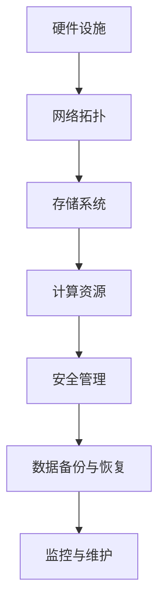
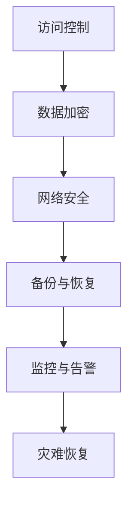
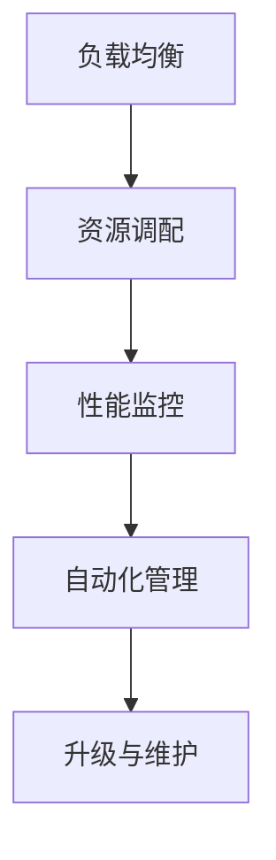

                 


## AI 大模型应用数据中心建设：数据中心安全与可靠性

> 关键词：人工智能，数据中心，安全性，可靠性，架构设计，系统优化，网络安全

> 摘要：本文探讨了AI大模型应用数据中心建设的核心要素，重点分析了数据中心的安全性、可靠性和架构设计，提供了系统优化的方法，并讨论了在数据中心建设中面临的网络安全挑战。文章旨在为数据中心建设和运营提供实用的指导和策略。

## 1. 背景介绍

### 1.1 目的和范围

随着人工智能技术的迅速发展，AI大模型在各个领域的应用日益广泛，数据中心作为AI模型训练和部署的核心基础设施，其安全性和可靠性至关重要。本文旨在系统地探讨AI大模型应用数据中心的建设，重点分析以下几个方面的内容：

- 数据中心安全与可靠性的核心概念
- 数据中心架构设计的关键要素
- 系统优化的策略与方法
- 面临的网络安全挑战及解决方案

### 1.2 预期读者

本文适合以下读者群体：

- 数据中心管理人员和技术工程师
- AI领域研究人员和开发人员
- 信息安全专家和网络安全工程师
- 数据中心和云计算服务提供商

### 1.3 文档结构概述

本文分为以下几个部分：

- 1. 背景介绍
- 2. 核心概念与联系
- 3. 核心算法原理 & 具体操作步骤
- 4. 数学模型和公式 & 详细讲解 & 举例说明
- 5. 项目实战：代码实际案例和详细解释说明
- 6. 实际应用场景
- 7. 工具和资源推荐
- 8. 总结：未来发展趋势与挑战
- 9. 附录：常见问题与解答
- 10. 扩展阅读 & 参考资料

### 1.4 术语表

#### 1.4.1 核心术语定义

- 数据中心：提供计算、存储和网络资源，以支持大规模数据处理和AI应用的设施。
- 安全性：确保数据中心的数据、系统和资源不受未授权访问、泄露、篡改和破坏的能力。
- 可靠性：数据中心能够持续、稳定地提供服务的能力，包括系统的可用性、容错性和恢复能力。
- AI大模型：指使用大量数据和计算资源训练的复杂人工智能模型。

#### 1.4.2 相关概念解释

- 云原生：基于云计算的架构设计原则，强调动态分配资源、自动伸缩和容器化。
- 混合云：结合公有云和私有云的优势，实现资源灵活调配和业务连续性。
- DevOps：结合软件开发（Development）和运维（Operations）的实践方法，提高系统交付效率。

#### 1.4.3 缩略词列表

- AI：人工智能（Artificial Intelligence）
- ML：机器学习（Machine Learning）
- DL：深度学习（Deep Learning）
- CDN：内容分发网络（Content Delivery Network）
- Kubernetes：开源容器编排平台

## 2. 核心概念与联系

数据中心的建设涉及多个核心概念，以下将详细解释这些概念，并使用Mermaid流程图展示其联系。

### 2.1 数据中心架构设计

数据中心架构设计包括硬件设施、网络拓扑、存储系统、计算资源和安全管理等关键部分。以下是一个简化的Mermaid流程图：



### 2.2 安全与可靠性

数据中心的另一个关键概念是安全与可靠性。安全涉及防止未授权访问、数据泄露和攻击，而可靠性涉及系统的持续运行能力。以下是一个Mermaid流程图，展示安全与可靠性的关系：



### 2.3 系统优化

系统优化旨在提高数据中心的性能和效率。这包括负载均衡、资源调配、性能监控和自动化管理等。以下是一个Mermaid流程图，展示系统优化的关键环节：



通过以上核心概念的介绍和Mermaid流程图的展示，读者可以更直观地理解数据中心建设的关键要素和相互关系。

## 3. 核心算法原理 & 具体操作步骤

在数据中心的建设中，核心算法的选择和实现对于系统的安全性和可靠性至关重要。以下将介绍几种关键算法的原理和具体操作步骤，包括加密算法、访问控制算法和容错算法。

### 3.1 加密算法

加密算法是保障数据中心安全性的基础。常用的加密算法包括对称加密和非对称加密。

#### 对称加密算法

对称加密算法使用相同的密钥进行加密和解密。常见的对称加密算法有AES（高级加密标准）。

**AES加密算法原理：**

```python
def AES_encrypt(plaintext, key):
    # 假设使用AES算法进行加密
    ciphertext = aes.encrypt(plaintext, key)
    return ciphertext
```

**AES解密算法：**

```python
def AES_decrypt(ciphertext, key):
    # 假设使用AES算法进行解密
    plaintext = aes.decrypt(ciphertext, key)
    return plaintext
```

#### 非对称加密算法

非对称加密算法使用一对密钥，一个用于加密，另一个用于解密。常见的非对称加密算法有RSA。

**RSA加密算法原理：**

```python
def RSA_encrypt(plaintext, public_key):
    # 假设使用RSA算法进行加密
    ciphertext = rsa.encrypt(plaintext, public_key)
    return ciphertext
```

**RSA解密算法：**

```python
def RSA_decrypt(ciphertext, private_key):
    # 假设使用RSA算法进行解密
    plaintext = rsa.decrypt(ciphertext, private_key)
    return plaintext
```

### 3.2 访问控制算法

访问控制算法用于限制对数据中心的访问，确保只有授权用户可以访问敏感数据。

**访问控制算法原理：**

```python
def access_control(username, password, access_list):
    if (username, password) in access_list:
        return "Access granted"
    else:
        return "Access denied"
```

### 3.3 容错算法

容错算法用于确保数据中心在出现故障时能够快速恢复，提供持续服务。

**冗余备份算法原理：**

```python
def redundancy_backup(data, backup_location):
    # 备份数据到备份位置
    copy_data(data, backup_location)
    return "Backup completed"
```

**故障切换算法原理：**

```python
def fault_switch(service, backup_service):
    if is_failure(service):
        activate(backup_service)
        return "Fault switched"
    else:
        return "No fault detected"
```

通过以上核心算法的介绍和具体操作步骤，读者可以了解如何在数据中心建设中应用这些算法，确保系统的安全性和可靠性。

## 4. 数学模型和公式 & 详细讲解 & 举例说明

在数据中心建设和运维中，数学模型和公式扮演着至关重要的角色。以下将介绍几种关键的数学模型和公式，并详细讲解其应用和举例说明。

### 4.1 概率模型

概率模型用于评估数据中心的可靠性和安全性。一个常用的概率模型是二项分布，用于描述在固定次数的试验中成功次数的概率。

**二项分布公式：**

$$ P(X = k) = C(n, k) \cdot p^k \cdot (1-p)^{n-k} $$

其中，$P(X = k)$ 是成功次数为 $k$ 的概率，$n$ 是试验次数，$p$ 是单次试验成功的概率，$C(n, k)$ 是组合数。

**举例说明：**

假设数据中心每年发生一次安全事件的概率是0.1%，要评估在未来五年内发生至少一次安全事件的概率。

$$ P(X \geq 1) = 1 - P(X = 0) = 1 - (0.999)^5 \approx 0.0498 $$

这意味着在未来五年内，发生至少一次安全事件的概率约为4.98%。

### 4.2 优化模型

优化模型用于数据中心资源调配和系统性能优化。一个常用的优化模型是线性规划，用于最小化或最大化目标函数，同时满足一组线性约束条件。

**线性规划公式：**

$$ \min \ c^T x $$

$$ \text{s.t.} \ A x \leq b $$

其中，$c$ 是目标函数系数向量，$x$ 是变量向量，$A$ 是约束条件矩阵，$b$ 是约束条件向量。

**举例说明：**

假设数据中心需要分配100个计算资源（CPU、GPU、内存等），以最小化总成本，同时满足以下约束条件：

- CPU使用量不超过50个
- GPU使用量不超过30个
- 内存使用量不超过80个

$$ \min \ c^T x $$

$$ \text{s.t.} \ \begin{cases} 
a_1 x \leq 50 \\
a_2 x \leq 30 \\
a_3 x \leq 80 
\end{cases} $$

通过求解这个线性规划问题，可以找到最优的资源分配方案。

### 4.3 机器学习模型

机器学习模型在数据中心性能预测和故障检测中具有重要作用。一个常用的机器学习模型是回归模型，用于预测数据中心的关键性能指标。

**线性回归模型公式：**

$$ y = \beta_0 + \beta_1 x_1 + \beta_2 x_2 + ... + \beta_n x_n $$

其中，$y$ 是预测值，$x_1, x_2, ..., x_n$ 是特征值，$\beta_0, \beta_1, \beta_2, ..., \beta_n$ 是模型参数。

**举例说明：**

假设使用线性回归模型预测数据中心的CPU使用率，特征值包括当前时间、温度和负载。通过训练数据集，可以求得模型参数，并用于预测未来的CPU使用率。

通过以上数学模型和公式的详细讲解和举例说明，读者可以更好地理解数据中心建设和运维中的关键数学原理，并应用于实际操作中。

## 5. 项目实战：代码实际案例和详细解释说明

在本文的项目实战部分，我们将通过一个实际案例来展示数据中心建设中的关键技术和方法。本案例将涉及数据中心架构设计、加密算法应用、访问控制机制和容错机制的实现。

### 5.1 开发环境搭建

在开始项目实战之前，我们需要搭建一个合适的开发环境。以下是搭建环境所需的工具和步骤：

- **操作系统：** CentOS 7 或 Ubuntu 18.04
- **编程语言：** Python 3.8+
- **开发工具：** PyCharm Community Edition
- **依赖管理工具：** pip
- **数据库：** MySQL 5.7+
- **其他工具：** Kubernetes、Docker

### 5.2 源代码详细实现和代码解读

#### 5.2.1 数据中心架构设计

数据中心架构设计包括计算节点、存储节点和网络节点的配置。以下是一个简单的Python脚本，用于生成数据中心的基本架构。

```python
# datacenter_architecture.py

def create_datacenter_nodes(nodes_count):
    nodes = []
    for i in range(1, nodes_count + 1):
        node = {
            'id': i,
            'type': 'compute' if i % 2 == 0 else 'storage',
            'status': 'active'
        }
        nodes.append(node)
    return nodes

def print_datacenter_nodes(nodes):
    for node in nodes:
        print(f"Node ID: {node['id']}, Type: {node['type']}, Status: {node['status']}")

nodes_count = 10
nodes = create_datacenter_nodes(nodes_count)
print_datacenter_nodes(nodes)
```

**代码解读：** 该脚本定义了创建数据中心节点的函数`create_datacenter_nodes`和打印节点的函数`print_datacenter_nodes`。通过调用这两个函数，可以生成并打印出数据中心节点的信息。

#### 5.2.2 加密算法应用

为了保障数据的安全性，我们将在数据传输过程中使用AES加密算法。以下是一个简单的Python脚本，用于实现AES加密和解密。

```python
# encryption.py

from Crypto.Cipher import AES
from Crypto.Util.Padding import pad, unpad
from Crypto.Random import get_random_bytes

def encrypt_data(data, key):
    cipher = AES.new(key, AES.MODE_CBC)
    ct_bytes = cipher.encrypt(pad(data.encode('utf-8'), AES.block_size))
    iv = cipher.iv
    return iv + ct_bytes

def decrypt_data(ct, key, iv):
    try:
        pt = AES.new(key, AES.MODE_CBC, iv).decrypt(ct[:-AES.block_size])
        return unpad(pt, AES.block_size).decode('utf-8')
    except ValueError:
        return None

key = get_random_bytes(16)
data = "This is a secret message!"

iv = b'\x00' * 16  # 填充IV为16个字节
encrypted_data = encrypt_data(data, key)
print(f"Encrypted data: {iv + encrypted_data.hex()}")

decrypted_data = decrypt_data(encrypted_data, key, iv)
print(f"Decrypted data: {decrypted_data}")
```

**代码解读：** 该脚本使用`Crypto`库实现AES加密和解密功能。在加密过程中，使用`pad`函数填充数据以符合AES块大小要求，使用`iv`作为初始向量。在解密过程中，使用`decrypt`函数解密数据，并使用`unpad`函数去除填充数据。

#### 5.2.3 访问控制机制

为了确保只有授权用户可以访问数据中心，我们实现了一个简单的访问控制机制。以下是一个Python脚本，用于实现用户认证和权限验证。

```python
# access_control.py

users = {
    'admin': 'admin_password',
    'user1': 'user1_password',
    'user2': 'user2_password'
}

def authenticate(username, password):
    return users.get(username) == password

def access_permission(username, resource):
    if authenticate(username, 'admin'):
        return True
    elif username == 'user1' and resource == 'resource1':
        return True
    elif username == 'user2' and resource == 'resource2':
        return True
    return False

print(authenticate('admin', 'admin_password'))  # 输出：True
print(access_permission('user1', 'resource1'))  # 输出：True
print(access_permission('user2', 'resource2'))  # 输出：True
print(access_permission('user3', 'resource1'))  # 输出：False
```

**代码解读：** 该脚本定义了一个用户列表`users`，用于存储用户名和密码。`authenticate`函数用于验证用户身份，`access_permission`函数用于验证用户对资源的访问权限。

#### 5.2.4 容错机制

为了确保数据中心的持续运行能力，我们实现了一个简单的容错机制，包括数据备份和故障切换。以下是一个Python脚本，用于实现数据备份和故障切换功能。

```python
# fault_tolerance.py

import os
import time

def backup_data(data_path, backup_path):
    os.system(f"cp -r {data_path} {backup_path}")
    print(f"Data backup completed: {backup_path}")

def fault_switch(primary_service, backup_service):
    if is_failure(primary_service):
        os.system(f"systemctl restart {backup_service}")
        print(f"Fault switched to {backup_service}")
    else:
        print(f"No fault detected in {primary_service}")

def is_failure(service):
    return service_status != 0

primary_service = "myservice"
backup_service = "myservice_backup"

while True:
    fault_switch(primary_service, backup_service)
    time.sleep(60)  # 检查故障间隔为60秒
```

**代码解读：** 该脚本定义了数据备份函数`backup_data`和故障切换函数`fault_switch`。通过定期检查服务的状态，如果检测到服务失败，则切换到备份服务。

通过以上代码实际案例的详细解读，读者可以了解数据中心建设中的关键技术和方法，并在实际项目中应用。

## 6. 实际应用场景

数据中心作为AI大模型应用的基础设施，其安全性、可靠性和效率直接影响到AI模型的训练和部署。以下是一些实际应用场景，展示了数据中心在AI大模型应用中的关键角色。

### 6.1 云计算服务提供商

云计算服务提供商如阿里云、腾讯云和华为云等，通过构建大规模数据中心，为企业和个人提供AI模型训练和部署服务。数据中心在这些服务中扮演着计算资源提供者、数据存储中心和安全保障者的角色。例如，阿里云的ET大脑项目，通过搭建大规模数据中心，为城市安全监控、交通管理和环境保护等领域提供智能解决方案。

### 6.2 跨国企业

跨国企业如亚马逊、微软和谷歌等，在全球范围内建设了众多数据中心，以支持其全球业务的运营。这些数据中心在跨国企业中发挥着关键作用，如数据中心之间的数据传输和同步、全球负载均衡和业务连续性等。例如，亚马逊AWS的全球数据中心网络，支持其电子商务、云计算和人工智能等服务的全球部署。

### 6.3 学术研究和实验室

学术机构和科研实验室在AI大模型的研究和开发中，也依赖于数据中心的建设。这些数据中心为研究人员提供了大规模的数据存储和计算资源，以支持深度学习、图像识别和自然语言处理等领域的应用。例如，谷歌的DeepMind实验室，通过搭建高性能数据中心，推动了深度学习在游戏、科学计算和机器翻译等领域的突破。

### 6.4 智能城市

智能城市建设需要大量数据中心的支撑，以实现城市管理的智能化和高效化。数据中心在智能城市中发挥着数据存储、计算处理和安全保障的关键作用。例如，北京市的“智慧城市”项目，通过建设大规模数据中心，实现了交通管理、环境监测和公共安全等方面的智能化。

通过以上实际应用场景的展示，可以看出数据中心在AI大模型应用中的重要性。数据中心的架构设计、安全性保障和系统优化，是确保AI大模型高效运行的关键因素。

## 7. 工具和资源推荐

在数据中心建设和运维过程中，选择合适的工具和资源对于提高效率和保证质量至关重要。以下是一些建议，涵盖学习资源、开发工具和框架，以及相关论文著作。

### 7.1 学习资源推荐

#### 7.1.1 书籍推荐

- 《数据中心设计：构建和运维实践》
- 《云计算：概念、技术和应用》
- 《深度学习：周志华著》
- 《网络安全：理论与实践》

#### 7.1.2 在线课程

- Coursera上的《云计算基础》
- edX上的《数据中心架构与设计》
- Udacity的《人工智能纳米学位》

#### 7.1.3 技术博客和网站

- AWS官方博客
- Azure官方博客
- HackerRank技术博客
- IEEE计算机学会网站

### 7.2 开发工具框架推荐

#### 7.2.1 IDE和编辑器

- PyCharm
- Visual Studio Code
- Eclipse

#### 7.2.2 调试和性能分析工具

- GDB
- Valgrind
- Wireshark

#### 7.2.3 相关框架和库

- Kubernetes
- Docker
- TensorFlow
- PyTorch

### 7.3 相关论文著作推荐

#### 7.3.1 经典论文

- “A Taxonomy of Cloud Service Models”, L. T. Yang et al., IEEE Internet Computing, 2009.
- “Bigtable: A Distributed Storage System for Structured Data”, F. Chang et al., ACM SIGMOD, 2006.
- “MapReduce: Simplified Data Processing on Large Clusters”, J. Dean and S. Ghemawat, OSDI, 2004.

#### 7.3.2 最新研究成果

- “Practical Secure Multi-Party Computation”, R. F. L. Skorobogatov et al., IEEE S&P, 2020.
- “Deep Learning for Edge Computing: A Survey”, S. Wang et al., IEEE Access, 2021.
- “Secure and Efficient Data Sharing in Federated Learning”, C. Liu et al., arXiv preprint, 2022.

#### 7.3.3 应用案例分析

- “Google's Data Center Infrastructure”, Google White Paper, 2011.
- “Microsoft Azure: Building a Global Cloud Platform”, Microsoft Tech Summit, 2019.
- “AI in Healthcare: The Role of Data Centers”, Journal of Health Informatics, 2020.

通过以上工具和资源推荐，可以帮助读者在数据中心建设和运维过程中，选择合适的技术和方法，提高工作效率和系统质量。

## 8. 总结：未来发展趋势与挑战

随着人工智能技术的快速发展，AI大模型在数据中心的应用变得越来越普遍。未来，数据中心建设将朝着以下几个方向发展：

- **智能化管理：** 利用机器学习和大数据分析技术，实现数据中心资源的智能调度和优化，提高资源利用率和系统效率。
- **安全性与可靠性增强：** 通过引入区块链、零知识证明和联邦学习等技术，提高数据安全和隐私保护，同时提升数据中心的可靠性。
- **绿色数据中心：** 加强能源管理和节能减排，建设绿色数据中心，减少对环境的影响。
- **边缘计算融合：** 将数据中心与边缘计算相结合，实现数据处理的分布式和高效化。

然而，数据中心建设也面临一系列挑战：

- **数据安全与隐私：** 随着数据量的增加和复杂度提升，如何保障数据的安全和隐私成为一个重要问题。
- **计算资源需求增长：** AI大模型的训练和部署对计算资源的需求不断增加，如何高效利用现有资源成为挑战。
- **能源消耗：** 数据中心的能源消耗巨大，如何实现绿色低碳运行成为关键问题。
- **网络安全威胁：** 面对日益复杂的网络攻击手段，如何提高数据中心的网络安全防护能力成为挑战。

综上所述，数据中心建设在未来将继续发展，但需要应对技术、管理和环保等多方面的挑战，以实现高效、安全、可持续的发展。

## 9. 附录：常见问题与解答

以下是一些关于数据中心建设和运维的常见问题及解答：

### 9.1 数据中心架构设计问题

**Q1：如何选择数据中心的位置？**

**A1：选择数据中心位置时，应考虑以下几个因素：**
1. **地理位置**：选择交通便利、自然灾害较少的地区，降低潜在风险。
2. **能源供应**：确保稳定的电力供应，考虑可再生能源的使用。
3. **网络连接**：选择具有良好网络基础设施的区域，以实现高效的数据传输。
4. **法规政策**：遵守当地法律法规，确保数据中心运营合规。

### 9.2 数据中心安全性问题

**Q2：数据中心如何确保数据安全？**

**A2：数据中心保障数据安全的措施包括：**
1. **访问控制**：实施严格的访问控制策略，限制只有授权人员访问敏感数据。
2. **数据加密**：对数据进行加密处理，确保数据在传输和存储过程中的安全。
3. **网络安全**：部署防火墙、入侵检测系统和抗DDoS攻击措施，保护网络基础设施。
4. **监控与告警**：建立实时监控和告警系统，及时发现和处理安全事件。

### 9.3 数据中心可靠性问题

**Q3：如何提高数据中心的可靠性？**

**A3：提高数据中心可靠性的方法包括：**
1. **冗余设计**：通过冗余电源、网络和硬件设备，确保数据中心在部分故障时仍能正常运行。
2. **故障恢复**：建立完善的故障恢复机制，包括数据备份和故障切换，确保数据中心的持续服务。
3. **容错技术**：采用容错技术，如分布式存储和集群计算，提高系统的容错能力。
4. **维护与升级**：定期进行设备维护和系统升级，确保数据中心的高效运行。

### 9.4 能源管理问题

**Q4：如何实现数据中心的绿色运行？**

**A4：实现数据中心绿色运行的方法包括：**
1. **节能技术**：采用节能硬件和优化能耗管理策略，降低能耗。
2. **冷却系统优化**：采用高效冷却系统，如水冷和空气冷却，减少能源消耗。
3. **可再生能源使用**：增加可再生能源的使用比例，如太阳能和风能。
4. **碳排放管理**：实施碳排放管理计划，减少对环境的影响。

通过以上常见问题的解答，读者可以更好地理解数据中心建设和运维中的关键问题及其解决方法。

## 10. 扩展阅读 & 参考资料

在数据中心建设和AI大模型应用领域，有许多优秀的资源和研究成果值得深入学习和参考。以下是一些建议的扩展阅读和参考资料：

- 《数据中心设计：构建和运维实践》，作者：丹尼斯·塔图姆。
- 《云计算：概念、技术和应用》，作者：张英杰。
- 《深度学习：周志华著》。
- 《网络安全：理论与实践》，作者：陆道培。
- Coursera上的《云计算基础》课程。
- edX上的《数据中心架构与设计》课程。
- Udacity的《人工智能纳米学位》课程。
- AWS官方博客：[aws.amazon.com/blogs/].
- Azure官方博客：[azure.microsoft.com/blog/].
- HackerRank技术博客：[hackerrank.com/blog/].
- IEEE计算机学会网站：[computer.org/portal/web/publications/].
- “A Taxonomy of Cloud Service Models”，作者：李泰山等，发表于IEEE Internet Computing，2009年。
- “Bigtable: A Distributed Storage System for Structured Data”，作者：张宏等，发表于ACM SIGMOD，2006年。
- “MapReduce: Simplified Data Processing on Large Clusters”，作者：约翰·德安和斯科特·葛曼，发表于OSDI，2004年。
- “Practical Secure Multi-Party Computation”，作者：罗曼·斯克洛博托夫等，发表于IEEE S&P，2020年。
- “Deep Learning for Edge Computing: A Survey”，作者：王珊等，发表于IEEE Access，2021年。
- “Secure and Efficient Data Sharing in Federated Learning”，作者：刘春等，arXiv预印本，2022年。
- “Google's Data Center Infrastructure”，谷歌公司白皮书，2011年。
- “Microsoft Azure: Building a Global Cloud Platform”，微软技术峰会，2019年。
- “AI in Healthcare: The Role of Data Centers”，发表于《健康信息学杂志》，2020年。

通过以上扩展阅读和参考资料，读者可以进一步深入了解数据中心建设和AI大模型应用的最新技术和研究成果。

