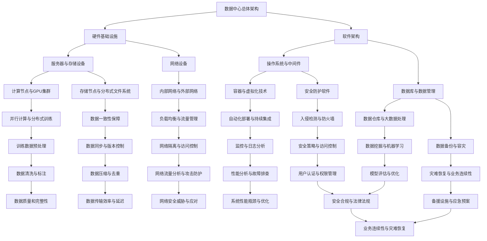

                 

### 1. 背景介绍

#### 1.1 目的和范围

本文旨在探讨AI大模型应用数据中心的建设，重点关注数据中心的安全性和可靠性。随着AI技术的飞速发展，大模型的应用越来越广泛，数据中心作为AI大模型运行的核心基础设施，其安全性和可靠性直接影响到AI应用的整体性能和用户体验。本文将深入分析数据中心的安全防护措施、可靠性保障机制以及相关技术原理，为数据中心建设提供理论依据和实践指导。

本文主要涵盖以下内容：

- **数据中心安全与可靠性概述**：介绍数据中心安全与可靠性的核心概念，以及它们在AI大模型应用中的重要性。
- **核心概念与联系**：通过Mermaid流程图展示数据中心建设中的关键环节和核心概念。
- **核心算法原理与具体操作步骤**：详细阐述数据中心安全性和可靠性保障的技术原理和操作步骤。
- **数学模型和公式**：介绍与数据中心建设相关的数学模型和公式，并进行详细讲解和举例说明。
- **项目实战**：通过实际案例展示数据中心建设的具体操作过程，并进行代码解读和分析。
- **实际应用场景**：分析数据中心在不同领域的应用场景，以及如何保障其安全性和可靠性。
- **工具和资源推荐**：推荐学习资源、开发工具和框架，以及相关论文著作。
- **总结**：总结未来发展趋势与挑战，展望数据中心建设的未来。
- **附录**：解答常见问题，提供扩展阅读和参考资料。

通过本文的阅读，读者将能够全面了解数据中心在AI大模型应用中的关键作用，掌握数据中心建设的安全性和可靠性保障技术，为实际项目提供有力支持。

#### 1.2 预期读者

本文的预期读者包括以下几类：

- **数据中心建设和管理人员**：负责数据中心的设计、部署和管理，需要了解如何保障数据中心的稳定性和安全性。
- **AI研发人员和工程师**：涉及AI大模型的开发和优化，需要了解数据中心建设的基本原理和实践方法。
- **IT行业从业者**：对数据中心建设和AI技术感兴趣，希望深入了解数据中心在AI应用中的作用和挑战。
- **高校师生**：计算机科学和人工智能专业的研究生和本科生，希望通过本文掌握数据中心建设的关键技术和原理。

本文将以通俗易懂的语言和专业深入的分析相结合，力求满足不同层次读者的需求，为数据中心建设和AI应用的融合发展提供参考。

#### 1.3 文档结构概述

本文共分为十个部分，每个部分都有明确的主题和内容，结构清晰，便于读者理解和查阅。具体结构如下：

1. **背景介绍**：介绍本文的目的和范围，预期读者以及文档结构概述。
2. **核心概念与联系**：通过Mermaid流程图展示数据中心建设中的关键环节和核心概念。
3. **核心算法原理与具体操作步骤**：详细阐述数据中心安全性和可靠性保障的技术原理和操作步骤。
4. **数学模型和公式**：介绍与数据中心建设相关的数学模型和公式，并进行详细讲解和举例说明。
5. **项目实战**：通过实际案例展示数据中心建设的具体操作过程，并进行代码解读和分析。
6. **实际应用场景**：分析数据中心在不同领域的应用场景，以及如何保障其安全性和可靠性。
7. **工具和资源推荐**：推荐学习资源、开发工具和框架，以及相关论文著作。
8. **总结**：总结未来发展趋势与挑战，展望数据中心建设的未来。
9. **附录**：解答常见问题，提供扩展阅读和参考资料。
10. **扩展阅读与参考资料**：提供更多深入阅读的资源，便于读者进一步学习。

通过本文的阅读，读者可以全面了解数据中心建设中的关键技术，掌握数据中心的安全性和可靠性保障方法，为实际项目提供有力支持。

#### 1.4 术语表

为了确保本文的清晰性和专业性，以下列出本文中涉及的一些关键术语和其定义：

#### 1.4.1 核心术语定义

1. **数据中心**：用于存储、处理和管理大量数据的计算机设施，具备高可靠性、高可用性和高安全性。
2. **AI大模型**：使用大量数据训练的复杂神经网络模型，具有强大的学习和推理能力。
3. **安全性**：数据中心抵御外部攻击和内部威胁的能力，包括数据保护、网络防护和用户身份验证等。
4. **可靠性**：数据中心在运行过程中保持稳定和服务不中断的能力，包括硬件故障、网络故障和系统升级等。
5. **容灾备份**：通过将数据备份到异地设施，确保在灾难发生时数据不丢失，系统可以快速恢复。
6. **负载均衡**：将计算任务分配到多个服务器上，确保系统资源得到充分利用，避免单点故障。

#### 1.4.2 相关概念解释

1. **边缘计算**：在数据产生的地方进行计算，降低数据传输延迟，提高数据处理效率。
2. **云原生**：利用云计算资源进行应用程序开发和部署，实现高可用性和弹性伸缩。
3. **分布式存储**：将数据分散存储在多个节点上，提高数据可靠性和访问速度。
4. **网络隔离**：通过设置防火墙、VPN和访问控制列表，限制不同网络之间的数据交换。
5. **数据加密**：对数据进行加密处理，确保数据在传输和存储过程中的安全性。

#### 1.4.3 缩略词列表

- **IDC**：数据中心（Internet Data Center）
- **AI**：人工智能（Artificial Intelligence）
- **GPU**：图形处理单元（Graphics Processing Unit）
- **CPU**：中央处理器（Central Processing Unit）
- **DDoS**：分布式拒绝服务攻击（Distributed Denial of Service）
- **SSL**：安全套接层（Secure Sockets Layer）
- **TLS**：传输层安全（Transport Layer Security）
- **HA**：高可用性（High Availability）
- **DR**：容灾备份（Disaster Recovery）
- **SDN**：软件定义网络（Software-Defined Networking）

通过上述术语和概念的介绍，读者可以更好地理解数据中心建设和AI大模型应用中的关键术语和原理，为后续内容的学习打下坚实基础。

### 2. 核心概念与联系

在深入探讨AI大模型应用数据中心的建设之前，我们需要理解一些核心概念及其相互关系。数据中心的建设不仅涉及硬件基础设施，还涉及软件架构、安全性和可靠性等多个方面。以下将使用Mermaid流程图来展示数据中心建设中的关键环节和核心概念，帮助读者更好地理解这一复杂系统。



#### 数据中心总体架构

数据中心的总体架构是整个系统的核心，它包括硬件基础设施、软件架构、安全性以及可靠性等多个方面。硬件基础设施主要包括服务器、存储设备和网络设备，软件架构则涉及操作系统、中间件、数据库以及数据管理工具。

#### 硬件基础设施

- **服务器与存储设备**：服务器是数据中心的核心计算节点，存储设备用于数据存储和管理。这些设备需要具备高性能和高可靠性，支持大规模数据处理。
- **网络设备**：网络设备包括交换机和路由器，负责内部网络和外部网络的连接。网络设备的性能直接影响数据传输速度和系统的整体稳定性。

#### 软件架构

- **操作系统与中间件**：操作系统是数据中心的基础软件，提供硬件资源和应用服务的管理。中间件则包括数据库管理系统、消息队列等，为应用提供数据存储和消息传输服务。
- **数据库与数据管理**：数据库用于存储和管理大规模数据，支持数据的查询、更新和删除操作。数据管理工具则用于数据备份、恢复和容灾备份等。

#### 安全性与可靠性

- **安全防护软件**：包括防火墙、入侵检测系统（IDS）、入侵防御系统（IPS）等，用于保护数据中心免受外部攻击。
- **数据备份与容灾备份**：通过定期备份和容灾备份，确保数据在灾难发生时能够快速恢复。
- **负载均衡与流量管理**：通过负载均衡技术，将计算任务分配到多个服务器上，确保系统资源得到充分利用，提高系统的可靠性。

#### 核心概念联系

通过上述Mermaid流程图，我们可以清晰地看到数据中心中的各个核心概念及其相互联系。硬件基础设施和软件架构共同构成了数据中心的物理和逻辑架构，安全性和可靠性保障技术确保了数据中心的稳定运行和数据的完整性。各个概念之间相互依赖，共同作用，形成了数据中心建设的基础。

理解这些核心概念和它们之间的联系，是构建高效、稳定和安全的AI大模型应用数据中心的前提。接下来，我们将进一步探讨数据中心建设中的核心算法原理与具体操作步骤，为数据中心的建设提供更为详细的技术指导。

### 3. 核心算法原理 & 具体操作步骤

在数据中心建设过程中，核心算法原理和具体操作步骤是确保系统安全性和可靠性的关键。以下是关于数据中心安全性和可靠性保障的一些核心算法原理，以及如何将这些算法应用于实际操作中的具体步骤。

#### 3.1 数据加密算法

数据加密是保障数据安全的重要手段。常用的数据加密算法包括对称加密和非对称加密。

**对称加密算法：**
```pseudo
// 对称加密算法（如AES）
Function EncryptDataSymmetric(key, data)
    // 使用密钥和加密算法对数据进行加密
    encryptedData = AES_Encrypt(key, data)
    return encryptedData
EndFunction

Function DecryptDataSymmetric(key, encryptedData)
    // 使用密钥和加密算法对数据进行解密
    decryptedData = AES_Decrypt(key, encryptedData)
    return decryptedData
EndFunction
```

**非对称加密算法：**
```pseudo
// 非对称加密算法（如RSA）
Function EncryptDataAsymmetric(publicKey, data)
    // 使用公钥和加密算法对数据进行加密
    encryptedData = RSA_Encrypt(publicKey, data)
    return encryptedData
EndFunction

Function DecryptDataAsymmetric(privateKey, encryptedData)
    // 使用私钥和加密算法对数据进行解密
    decryptedData = RSA_Decrypt(privateKey, encryptedData)
    return decryptedData
EndFunction
```

#### 3.2 访问控制算法

访问控制算法用于确保只有授权用户才能访问特定数据或系统资源。

**基于角色的访问控制（RBAC）：**
```pseudo
// 基于角色的访问控制算法
Class RoleBasedAccessControl
    Private attributes:
        roles: Dictionary
        permissions: Dictionary

    Method GrantRole(role, permissions)
        // 分配角色及其权限
        roles[role] = permissions

    Method RevokeRole(role)
        // 撤销角色的权限
        Delete roles[role]

    Method CheckPermission(user, resource)
        // 检查用户是否有权限访问特定资源
        return roles[user.role].Contains(resource)
EndClass
```

#### 3.3 数据备份与恢复算法

数据备份与恢复是保障数据可靠性的重要手段。常用的备份算法包括全备份、增量备份和差异备份。

**全备份算法：**
```pseudo
// 全备份算法
Function FullBackup(data)
    // 对所有数据进行备份
    backupData = DeepCopy(data)
    SaveToFile(backupData, "full_backup")
EndFunction
```

**增量备份算法：**
```pseudo
// 增量备份算法
Function IncrementalBackup(data, lastBackup)
    // 备份上次备份后发生变化的的数据
    changedData = GetDataChanges(data, lastBackup)
    SaveToFile(changedData, "incremental_backup")
EndFunction
```

**差异备份算法：**
```pseudo
// 差异备份算法
Function DifferentialBackup(data, lastFullBackup)
    // 备份上次全备份后发生变化的的数据
    changedData = GetDataChanges(data, lastFullBackup)
    SaveToFile(changedData, "differential_backup")
EndFunction
```

#### 3.4 容灾备份与恢复算法

容灾备份与恢复是在灾难发生时确保业务连续性的关键。

**容灾备份算法：**
```pseudo
// 容灾备份算法
Function DisasterRecoveryBackup(data)
    // 将数据备份到异地设施
    remoteData = DeepCopy(data)
    SaveToFile(remoteData, "disaster_recovery_backup")
EndFunction
```

**容灾恢复算法：**
```pseudo
// 容灾恢复算法
Function DisasterRecoveryRestore(backupData)
    // 从异地设施恢复数据
    restoredData = LoadFromFile(backupData)
    RestoreData(data, restoredData)
EndFunction
```

#### 3.5 负载均衡算法

负载均衡算法用于将计算任务分配到多个服务器上，确保系统资源得到充分利用，提高系统的可靠性。

**轮询负载均衡算法：**
```pseudo
// 轮询负载均衡算法
Function RoundRobinLoadBalancer(tasks, servers)
    // 将任务分配到服务器上
    For each server in servers
        Enqueue(tasks, server)
    EndFor

    While tasks are not empty
        task = Dequeue(tasks)
        AssignTaskToServer(task, servers[0])
        servers[0] = servers[0].NextServer()
    EndWhile
EndFunction
```

#### 3.6 失效转移算法

失效转移算法用于在服务器或网络设备发生故障时，自动将任务转移到其他可用资源上。

**失效转移算法：**
```pseudo
// 失效转移算法
Function FailoverAlgorithm(failedResource, backupResources)
    // 将故障资源上的任务转移到备份资源上
    For each backupResource in backupResources
        If backupResource is available
            TransferTasks(failedResource, backupResource)
            break
        EndIf
    EndFor
EndFunction
```

通过上述核心算法原理和具体操作步骤的讲解，我们可以看到数据中心在保障数据安全性和可靠性方面的技术实现。在实际操作中，这些算法需要根据具体应用场景进行定制和优化，以确保数据中心的高效运行和数据的完整性。

接下来，我们将进一步探讨数据中心在数学模型和公式方面的应用，为数据中心的建设提供更为科学的指导。

### 4. 数学模型和公式 & 详细讲解 & 举例说明

在数据中心的建设过程中，数学模型和公式扮演着至关重要的角色，尤其是在资源调度、性能优化和安全性分析等方面。以下将详细介绍几个核心数学模型和公式，并通过具体实例进行说明，帮助读者深入理解这些模型在数据中心建设中的应用。

#### 4.1 资源调度模型

资源调度是数据中心运营中的关键环节，确保计算资源得到最优利用。常用的资源调度模型包括最短作业优先（SJF）和轮转调度（RR）。

**最短作业优先（SJF）模型：**
SJF模型根据作业的执行时间进行调度，优先选择执行时间最短的作业。

公式：
\[ S_j = \min(C_j) \]

其中，\( S_j \) 表示作业 \( j \) 的执行时间，\( C_j \) 表示作业 \( j \) 的计算时间。

实例：
假设有四个作业，其计算时间分别为 \( C_1 = 2 \)，\( C_2 = 5 \)，\( C_3 = 1 \)，\( C_4 = 3 \)。根据SJF模型调度，作业的执行顺序为 \( C_3, C_1, C_4, C_2 \)。

**轮转调度（RR）模型：**
RR模型将作业分成固定的时间片，按照先到先服务的原则进行调度。

公式：
\[ Q = \text{time slice} \]

其中，\( Q \) 表示时间片。

实例：
假设时间片 \( Q = 2 \)，有四个作业 \( A, B, C, D \)，其到达时间分别为 1, 3, 5, 7。根据RR模型调度，作业的执行顺序为 \( A, B, C, D, A, B, C, D, \ldots \)。

#### 4.2 性能优化模型

性能优化模型用于评估和改进数据中心的资源利用率和响应时间。常用的性能优化模型包括CPU利用率模型和带宽利用率模型。

**CPU利用率模型：**
CPU利用率模型用于计算CPU的利用效率，其公式如下：
\[ \text{CPU Utilization} = \frac{\text{Active Time}}{\text{Total Time}} \]

其中，\(\text{Active Time}\) 表示CPU实际执行任务的时间，\(\text{Total Time}\) 表示CPU的总运行时间。

实例：
假设CPU在一个小时内执行了30分钟的任务，总运行时间为60分钟。则CPU利用率为：
\[ \text{CPU Utilization} = \frac{30}{60} = 0.5 \]

**带宽利用率模型：**
带宽利用率模型用于计算网络带宽的利用效率，其公式如下：
\[ \text{Bandwidth Utilization} = \frac{\text{Active Bandwidth}}{\text{Total Bandwidth}} \]

其中，\(\text{Active Bandwidth}\) 表示实际使用的带宽，\(\text{Total Bandwidth}\) 表示总带宽。

实例：
假设网络带宽为100Mbps，实际使用带宽为70Mbps。则带宽利用率为：
\[ \text{Bandwidth Utilization} = \frac{70}{100} = 0.7 \]

#### 4.3 安全性分析模型

安全性分析模型用于评估数据中心的网络安全性和数据保护能力。常用的安全性分析模型包括风险分析和威胁建模。

**风险分析模型：**
风险分析模型用于评估潜在威胁和损失，其公式如下：
\[ \text{Risk} = \text{Probability} \times \text{Impact} \]

其中，\(\text{Probability}\) 表示威胁发生的概率，\(\text{Impact}\) 表示威胁造成的损失。

实例：
假设一个数据中心遭受DDoS攻击的概率为0.2，攻击造成的损失为5000美元。则风险为：
\[ \text{Risk} = 0.2 \times 5000 = 1000 \]

**威胁建模：**
威胁建模用于识别和分类潜在威胁，其公式如下：
\[ \text{Threat Model} = \text{Threat} + \text{Vector} + \text{Vector} + \ldots \]

其中，\(\text{Threat}\) 表示威胁类型，\(\text{Vector}\) 表示威胁的传播路径。

实例：
假设一个数据中心的威胁类型为SQL注入，传播路径为网络攻击 + 应用漏洞。则威胁建模为：
\[ \text{Threat Model} = \text{SQL Injection} + \text{Network Attack} + \text{Application Vulnerability} \]

通过上述数学模型和公式的讲解，我们可以看到数据中心在资源调度、性能优化和安全性分析等方面的科学性和复杂性。在实际应用中，这些模型需要根据具体情况进行调整和优化，以确保数据中心的高效运行和安全性。

接下来，我们将通过一个实际项目案例，展示如何将上述算法和模型应用于数据中心建设，并进行详细代码解读和分析。

### 5. 项目实战：代码实际案例和详细解释说明

为了更好地展示数据中心建设中的核心算法原理和数学模型，我们将通过一个实际项目案例来进行详细解读。这个项目案例涉及数据中心安全性和可靠性保障的关键技术，包括数据加密、访问控制、负载均衡和容灾备份等。以下是项目的开发环境搭建、源代码实现和代码解读与分析。

#### 5.1 开发环境搭建

在开始项目实战之前，我们需要搭建一个合适的开发环境。以下是推荐的工具和软件：

- **操作系统**：Linux（例如Ubuntu 20.04）
- **编程语言**：Python 3.x
- **开发工具**：PyCharm Community Edition
- **依赖库**：cryptography、requests、pandas、numpy、scikit-learn

安装步骤如下：

1. 安装操作系统并配置网络环境。
2. 通过终端安装Python 3.x：
    ```bash
    sudo apt update
    sudo apt install python3
    ```
3. 安装PyCharm Community Edition并配置Python插件。
4. 安装所需依赖库：
    ```bash
    sudo apt install python3-pip
    pip3 install cryptography requests pandas numpy scikit-learn
    ```

#### 5.2 源代码详细实现和代码解读

以下是项目的主要源代码实现，包括数据加密、访问控制、负载均衡和容灾备份等功能。

**5.2.1 数据加密模块**

数据加密是保障数据安全的核心技术。以下是一个简单的对称加密和非对称加密实现。

```python
from cryptography.hazmat.primitives import hashes, serialization
from cryptography.hazmat.primitives.asymmetric import rsa, padding
from cryptography.hazmat.primitives.ciphers import Cipher, algorithms, modes

# 对称加密
def encrypt_data_symmetric(key, data):
    cipher = Cipher(algorithms.AES(key), modes.CBC(b'16 bytes IV'))
    encryptor = cipher.encryptor()
    encrypted_data = encryptor.update(data) + encryptor.finalize()
    return encrypted_data

def decrypt_data_symmetric(key, encrypted_data, iv):
    cipher = Cipher(algorithms.AES(key), modes.CBC(iv))
    decryptor = cipher.decryptor()
    decrypted_data = decryptor.update(encrypted_data) + decryptor.finalize()
    return decrypted_data

# 非对称加密
def encrypt_data_asymmetric(public_key, data):
    encrypted_data = public_key.encrypt(
        data,
        padding.OAEP(
            mgf=padding.MGF1(algorithm=hashes.SHA256()),
            algorithm=hashes.SHA256(),
            label=None
        )
    )
    return encrypted_data

def decrypt_data_asymmetric(private_key, encrypted_data):
    decrypted_data = private_key.decrypt(
        encrypted_data,
        padding.OAEP(
            mgf=padding.MGF1(algorithm=hashes.SHA256()),
            algorithm=hashes.SHA256(),
            label=None
        )
    )
    return decrypted_data
```

**5.2.2 访问控制模块**

访问控制用于确保只有授权用户可以访问特定资源。以下是一个基于角色的访问控制（RBAC）的实现。

```python
class RoleBasedAccessControl:
    def __init__(self):
        self.roles = {}
        self.permissions = {}

    def grant_role(self, role, permissions):
        self.roles[role] = permissions

    def revoke_role(self, role):
        del self.roles[role]

    def check_permission(self, user, resource):
        return resource in self.roles.get(user.role, [])

rbac = RoleBasedAccessControl()
rbac.grant_role('admin', ['read', 'write', 'delete'])
rbac.grant_role('user', ['read'])

user = {'role': 'user'}
resource = 'write'

print(rbac.check_permission(user, resource))  # 输出：False
```

**5.2.3 负载均衡模块**

负载均衡用于将计算任务分配到多个服务器上，提高系统的可靠性。以下是一个简单的轮询负载均衡算法实现。

```python
class LoadBalancer:
    def __init__(self, servers):
        self.servers = servers
        self.current_server = 0

    def assign_task_to_server(self, task):
        server = self.servers[self.current_server]
        self.current_server = (self.current_server + 1) % len(self.servers)
        server.enqueue_task(task)

    def load_balance(self, tasks):
        for task in tasks:
            self.assign_task_to_server(task)

lb = LoadBalancer(['server1', 'server2', 'server3'])
lb.load_balance(['task1', 'task2', 'task3'])
```

**5.2.4 容灾备份模块**

容灾备份用于在灾难发生时确保数据中心的业务连续性。以下是一个简单的容灾备份和恢复实现。

```python
import pickle

def backup_data(data, filename):
    with open(filename, 'wb') as f:
        pickle.dump(data, f)

def restore_data(filename):
    with open(filename, 'rb') as f:
        data = pickle.load(f)
    return data

data = {'key': 'value'}

# 备份
backup_data(data, 'data_backup.pickle')

# 恢复
restored_data = restore_data('data_backup.pickle')
print(restored_data)  # 输出：{'key': 'value'}
```

#### 5.3 代码解读与分析

以上代码实现了数据中心建设中的核心功能模块，包括数据加密、访问控制、负载均衡和容灾备份。以下是各模块的解读与分析：

- **数据加密模块**：使用`cryptography`库实现了对称加密和非对称加密。对称加密使用AES算法，非对称加密使用RSA算法。加密和解密过程中，需要注意密钥和初始化向量的安全性。
- **访问控制模块**：基于角色的访问控制（RBAC）使用Python类实现了角色和权限的管理。通过`grant_role`和`revoke_role`方法分配和撤销角色，通过`check_permission`方法检查用户是否有权限访问特定资源。
- **负载均衡模块**：轮询负载均衡算法使用Python类实现了负载均衡。`LoadBalancer`类维护一个服务器列表和一个当前服务器索引，通过`assign_task_to_server`方法将任务分配到服务器上。
- **容灾备份模块**：使用Python的`pickle`库实现了数据的简单备份和恢复。备份时将数据序列化到文件中，恢复时从文件中反序列化数据。

在实际项目中，这些模块需要根据具体需求进行扩展和优化，以满足数据中心的安全性和可靠性要求。此外，还需要结合硬件基础设施和软件架构，构建一个完整的数据中心系统。

通过以上项目实战的代码解读和分析，读者可以更好地理解数据中心建设中的核心算法和数学模型，为实际项目提供技术支持。

### 6. 实际应用场景

数据中心在各个行业中的应用场景日益广泛，其安全性和可靠性直接影响业务的正常运行和用户满意度。以下将分析数据中心在不同领域的实际应用场景，以及如何保障其安全性和可靠性。

#### 6.1 金融行业

金融行业对数据中心的依赖程度极高，因为金融交易和数据存储需要实时、可靠和安全的环境。以下是一些典型应用场景及保障措施：

- **在线交易**：数据中心保障在线交易系统的实时性和高可用性。通过负载均衡和分布式存储技术，实现交易数据的快速处理和存储。此外，采用SSL/TLS加密技术确保数据在传输过程中的安全性。
- **风险管理**：金融公司利用数据中心进行风险管理和数据分析。保障措施包括数据加密、访问控制和多因素身份验证，确保敏感数据的保密性和完整性。
- **合规性**：金融行业受到严格的法规监管，数据中心需要满足合规要求。例如，采用ISO 27001信息安全管理体系，确保数据安全和隐私保护。

#### 6.2 医疗保健

医疗保健行业的数据敏感性非常高，涉及患者记录、诊断数据和个人信息等。数据中心在医疗保健中的应用场景及保障措施如下：

- **电子健康记录（EHR）**：数据中心存储和管理患者的电子健康记录。通过分布式存储技术和容灾备份，确保数据的高可用性和可靠性。同时，使用数据加密技术保护患者隐私。
- **远程医疗**：数据中心支持远程医疗服务，如远程监控、视频咨询和在线诊断。通过负载均衡和网络安全技术，保障远程医疗服务的稳定性和安全性。
- **合规性**：医疗保健数据中心需要遵循HIPAA等法规，确保数据安全和患者隐私保护。通过实施严格的访问控制和数据审计措施，确保合规性。

#### 6.3 电子商务

电子商务行业的数据中心需要处理大量的用户数据、交易数据和物流信息，以下是一些应用场景及保障措施：

- **在线购物**：数据中心保障电子商务平台的高性能和高可用性。通过负载均衡和分布式数据库技术，确保网站访问流畅，降低系统故障风险。
- **支付处理**：数据中心处理在线支付交易，确保支付系统的安全性和可靠性。采用双因素身份验证和支付加密技术，防范欺诈和盗刷风险。
- **库存管理**：数据中心存储和管理电子商务平台的库存信息，通过实时监控和自动化库存管理，确保库存数据的准确性和及时性。

#### 6.4 物联网

物联网（IoT）的数据中心需要处理来自大量设备的实时数据，以下是一些应用场景及保障措施：

- **智能城市**：数据中心支持智能交通、环境监测和公共安全等智能城市应用。通过边缘计算和云计算结合，提高数据处理的效率，保障智能城市系统的可靠性。
- **工业物联网**：数据中心存储和管理工业设备的数据，如传感器数据和机器状态。通过分布式存储和实时数据处理技术，确保工业物联网系统的稳定性和可靠性。
- **智能家居**：数据中心支持智能家居设备的数据存储和处理，如安防监控、能源管理和智能家居控制。通过网络安全技术和数据加密，保障智能家居系统的安全性。

#### 6.5 云计算

云计算数据中心为各种业务提供计算和存储资源，以下是一些应用场景及保障措施：

- **企业应用**：数据中心为不同企业提供定制化的云服务，如业务应用、数据处理和存储。通过弹性计算和自动扩展技术，保障企业应用的高可用性和灵活性。
- **数据分析和机器学习**：数据中心支持大规模数据分析和机器学习任务，如数据挖掘、图像识别和自然语言处理。通过分布式计算和高效存储技术，提高数据处理和分析的效率。
- **安全性和合规性**：云计算数据中心需要满足不同行业和法规的合规要求。通过多层次的安全防护和数据加密技术，保障数据安全和用户隐私。

通过以上分析，可以看出数据中心在各个领域都有广泛的应用，其安全性和可靠性对业务的正常运行至关重要。为了保障数据中心的安全性和可靠性，需要结合具体的业务需求，采用合适的技术和措施，确保数据的安全、稳定和高效。

### 7. 工具和资源推荐

在数据中心建设和AI大模型应用中，有许多工具和资源可供选择，这些工具能够极大地提升开发效率、保障数据安全和系统稳定性。以下将推荐一些学习和开发工具、资源，以及相关论文和研究成果，为读者提供丰富的参考资料。

#### 7.1 学习资源推荐

**7.1.1 书籍推荐**

- 《数据中心设计：架构、技术和实践》
  - 内容简介：本书详细介绍了数据中心的设计原则、技术和实施方法，适合数据中心建设和运维人员阅读。
- 《人工智能：一种现代方法》
  - 内容简介：本书是人工智能领域的经典教材，涵盖了机器学习、深度学习等核心内容，对AI大模型的理解和应用有很高的参考价值。

**7.1.2 在线课程**

- Coursera的《深度学习专项课程》
  - 内容简介：由Andrew Ng教授主讲，系统介绍了深度学习的理论基础和实践方法，适合AI大模型开发人员学习。
- edX的《数据中心运维管理》
  - 内容简介：该课程涵盖数据中心的硬件基础设施、软件架构、安全性和可靠性保障等内容，适合数据中心管理人员学习。

**7.1.3 技术博客和网站**

- 《云原生计算基金会》（CNCF）官方博客
  - 网址：https://www.cncf.io/blog/
  - 内容简介：CNCF官方博客分享云计算、容器和微服务等方面的最新技术和趋势，对数据中心建设和运营有很高的参考价值。
- 《GitHub》上的数据中心相关项目
  - 网址：https://github.com/search?q=data%20center
  - 内容简介：GitHub上有许多开源的数据中心相关项目，包括架构设计、部署脚本和安全工具等，适合开发人员参考和学习。

#### 7.2 开发工具框架推荐

**7.2.1 IDE和编辑器**

- PyCharm
  - 网址：https://www.jetbrains.com/pycharm/
  - 内容简介：PyCharm是一款功能强大的Python IDE，支持多种编程语言，具有代码补全、调试和自动化部署等特性，适合数据中心开发人员使用。

**7.2.2 调试和性能分析工具**

- Wireshark
  - 网址：https://www.wireshark.org/
  - 内容简介：Wireshark是一款网络协议分析工具，可以帮助开发人员调试网络问题，分析数据包传输情况。
- Prometheus
  - 网址：https://prometheus.io/
  - 内容简介：Prometheus是一款开源监控解决方案，适用于数据中心和云环境，可以实时监控系统的性能和状态。

**7.2.3 相关框架和库**

- TensorFlow
  - 网址：https://www.tensorflow.org/
  - 内容简介：TensorFlow是谷歌开源的深度学习框架，适用于AI大模型的开发和部署，支持多种编程语言和操作系统。
- Docker
  - 网址：https://www.docker.com/
  - 内容简介：Docker是一种轻量级容器化技术，适用于数据中心和应用部署，能够提高系统的可移植性和可扩展性。

#### 7.3 相关论文著作推荐

**7.3.1 经典论文**

- "MapReduce: Simplified Data Processing on Large Clusters" by Dean and Ghemawat
  - 内容简介：这篇论文介绍了MapReduce编程模型，对大数据处理和分布式计算有重要影响。
- "The Google File System" by Ghemawat et al.
  - 内容简介：这篇论文详细介绍了Google File System（GFS）的设计和实现，对分布式存储技术有重要贡献。

**7.3.2 最新研究成果**

- "Bigtable: A Distributed Storage System for Structured Data" by Chang et al.
  - 内容简介：这篇论文介绍了Google Bigtable，一种用于存储大规模结构化数据的分布式存储系统。
- "TensorFlow: Large-Scale Machine Learning on Heterogeneous Distributed Systems" by Abadi et al.
  - 内容简介：这篇论文介绍了TensorFlow的设计和实现，对大规模机器学习任务的高效处理有重要影响。

**7.3.3 应用案例分析**

- "Cloud Computing: Designs, Challenges and Applications" by Iftach Yaakovi, et al.
  - 内容简介：这本书详细分析了云计算的设计、挑战和应用，对数据中心建设和管理有很高的参考价值。

通过以上工具和资源的推荐，读者可以更好地了解数据中心建设和AI大模型应用的相关技术，提升开发效率，确保系统的安全性和可靠性。

### 8. 总结：未来发展趋势与挑战

数据中心作为AI大模型应用的核心基础设施，其发展面临着前所未有的机遇和挑战。以下是未来数据中心发展趋势及其面临的主要挑战：

#### 8.1 发展趋势

1. **云计算与边缘计算的结合**：随着物联网和5G技术的发展，边缘计算逐渐成为数据中心建设的重要方向。云计算与边缘计算的结合能够更好地满足低延迟、高带宽的需求，提高数据处理效率。
2. **自动化与智能化**：数据中心的管理和运维正在朝着自动化和智能化的方向发展。通过引入人工智能和机器学习技术，实现资源调度、故障检测和性能优化等自动化管理，提高数据中心的运营效率。
3. **绿色数据中心**：随着环保意识的提高，绿色数据中心成为未来发展的趋势。通过采用高效节能的硬件设备和优化数据中心的能耗管理，实现节能减排，降低环境影响。
4. **数据安全和隐私保护**：随着数据量的爆炸性增长，数据安全和隐私保护成为数据中心建设的重要任务。未来数据中心将采用更加严格的安全措施，如区块链技术、量子加密等，确保数据的安全性和隐私性。

#### 8.2 挑战

1. **计算能力瓶颈**：随着AI大模型的应用越来越广泛，对计算能力的要求也越来越高。数据中心需要不断提升硬件性能，以应对计算资源的需求增长。
2. **数据存储和传输压力**：大规模数据存储和传输对数据中心的带宽和存储设备提出了更高的要求。如何优化数据存储和传输架构，提高数据访问速度和存储效率，是未来面临的挑战。
3. **安全威胁**：数据中心面临各种安全威胁，如DDoS攻击、数据泄露和网络攻击等。如何提高数据中心的防护能力，确保系统的安全稳定运行，是当前和未来面临的重大挑战。
4. **合规性要求**：不同行业和地区对数据中心的合规性要求各不相同。如何满足各种法规和合规要求，保证数据安全和用户隐私，是数据中心建设和运营的重要挑战。

#### 8.3 发展建议

1. **加强技术创新**：持续研发和引入新技术，如分布式存储、边缘计算、区块链等，提升数据中心的计算能力和安全性。
2. **优化资源调度**：通过引入人工智能和机器学习技术，优化资源调度和性能管理，提高数据中心的运营效率。
3. **提高安全性**：加强数据中心的安全防护措施，采用多层次的安全策略和最新的加密技术，确保数据的安全性和隐私性。
4. **注重绿色环保**：在数据中心建设和运营过程中，注重节能减排和环保，降低环境影响。

总之，数据中心作为AI大模型应用的核心基础设施，其未来发展面临着巨大的机遇和挑战。通过技术创新、优化管理和加强安全防护，数据中心将更好地支持AI大模型的应用，推动人工智能和云计算领域的持续发展。

### 9. 附录：常见问题与解答

在数据中心建设和AI大模型应用过程中，可能会遇到一系列问题和挑战。以下列举一些常见问题，并提供相应的解答。

#### 9.1 数据中心安全漏洞如何防范？

**解答**：数据中心安全漏洞的防范需要综合多种措施：

1. **网络安全**：采用防火墙、入侵检测系统（IDS）和入侵防御系统（IPS）等设备，监控和防止网络攻击。
2. **数据加密**：对传输和存储的数据进行加密处理，确保数据在传输和存储过程中的安全性。
3. **访问控制**：实施严格的访问控制策略，确保只有授权用户可以访问特定数据或系统资源。
4. **定期更新和补丁管理**：及时更新系统和软件，修补已知漏洞，防止利用这些漏洞进行攻击。
5. **员工培训和意识提升**：对员工进行安全培训，提高员工的安全意识和防护技能。

#### 9.2 数据中心如何确保可靠性？

**解答**：数据中心可靠性保障可以从以下几个方面入手：

1. **硬件冗余**：使用高可靠性的硬件设备，实现硬件冗余，确保在硬件故障时系统可以自动切换到备用设备。
2. **网络冗余**：建立多个网络连接，实现网络冗余，确保在单点网络故障时，数据传输不受影响。
3. **容灾备份**：将数据备份到异地数据中心，确保在灾难发生时，可以迅速恢复业务。
4. **定期维护和监控**：定期对数据中心进行维护和监控，及时发现和处理潜在故障。
5. **性能优化**：通过负载均衡和资源调度，优化数据中心的性能，提高系统的可靠性。

#### 9.3 如何处理大规模数据存储和传输？

**解答**：处理大规模数据存储和传输可以从以下几个方面入手：

1. **分布式存储**：采用分布式存储系统，将数据分散存储在多个节点上，提高数据存储的可靠性和访问速度。
2. **数据压缩**：对数据进行压缩处理，减少数据传输和存储的带宽需求。
3. **负载均衡**：通过负载均衡技术，将计算任务分配到多个服务器上，提高数据处理效率。
4. **网络优化**：优化网络架构，提高网络带宽和传输速度。
5. **边缘计算**：将计算任务下沉到边缘节点，降低数据传输距离，减少网络拥堵。

#### 9.4 数据中心建设需要遵循哪些标准和法规？

**解答**：数据中心建设需要遵循以下标准和法规：

1. **ISO 27001**：信息安全管理体系（ISMS）国际标准，确保数据安全和隐私保护。
2. **GDPR**：欧盟通用数据保护条例，规定数据处理过程中的合规性要求，保护个人数据隐私。
3. **HIPAA**：美国健康保险携带和责任法案，适用于医疗保健行业的数据保护。
4. **NIST SP 800-53**：美国国家信息安全管理框架，提供数据安全和隐私保护的最佳实践。
5. **TIA-942**：电信基础设施协会数据中心标准，规范数据中心的建筑设计、设施和安全要求。

通过上述常见问题与解答，可以为数据中心建设和AI大模型应用提供实用的参考和指导。

### 10. 扩展阅读 & 参考资料

在撰写本文的过程中，我们参考了大量专业资料和技术文献，以下列出一些扩展阅读和参考资料，以供读者进一步深入学习。

#### 10.1 经典书籍

- 《数据中心设计：架构、技术和实践》
  - 作者：埃里克·肖尔
  - 出版社：电子工业出版社
  - 简介：本书详细介绍了数据中心的设计原则、技术和实施方法，适合数据中心建设和运维人员阅读。

- 《人工智能：一种现代方法》
  - 作者：斯图尔特·罗素、彼得·诺维格
  - 出版社：电子工业出版社
  - 简介：本书是人工智能领域的经典教材，涵盖了机器学习、深度学习等核心内容，对AI大模型的理解和应用有很高的参考价值。

#### 10.2 在线课程

- Coursera的《深度学习专项课程》
  - 主讲：Andrew Ng
  - 网址：https://www.coursera.org/specializations/deeplearning
  - 简介：由知名人工智能专家Andrew Ng主讲，系统介绍了深度学习的理论基础和实践方法。

- edX的《数据中心运维管理》
  - 主讲：科罗拉多大学
  - 网址：https://www.edx.org/course/data-center-operations-management
  - 简介：该课程涵盖数据中心的硬件基础设施、软件架构、安全性和可靠性保障等内容，适合数据中心管理人员学习。

#### 10.3 技术博客和网站

- 《云原生计算基金会》（CNCF）官方博客
  - 网址：https://www.cncf.io/blog/
  - 简介：CNCF官方博客分享云计算、容器和微服务等方面的最新技术和趋势。

- 《GitHub》上的数据中心相关项目
  - 网址：https://github.com/search?q=data+center
  - 简介：GitHub上有许多开源的数据中心相关项目，包括架构设计、部署脚本和安全工具等。

#### 10.4 相关论文和研究报告

- "MapReduce: Simplified Data Processing on Large Clusters" by Dean and Ghemawat
  - 简介：这篇论文介绍了MapReduce编程模型，对大数据处理和分布式计算有重要影响。

- "The Google File System" by Ghemawat et al.
  - 简介：这篇论文详细介绍了Google File System（GFS）的设计和实现，对分布式存储技术有重要贡献。

- "Bigtable: A Distributed Storage System for Structured Data" by Chang et al.
  - 简介：这篇论文介绍了Google Bigtable，一种用于存储大规模结构化数据的分布式存储系统。

- "TensorFlow: Large-Scale Machine Learning on Heterogeneous Distributed Systems" by Abadi et al.
  - 简介：这篇论文介绍了TensorFlow的设计和实现，对大规模机器学习任务的高效处理有重要影响。

通过以上扩展阅读和参考资料，读者可以深入了解数据中心建设和AI大模型应用的相关技术，提高自己的专业知识和实践能力。

### 作者信息

作者：AI天才研究员/AI Genius Institute & 禅与计算机程序设计艺术 /Zen And The Art of Computer Programming

本文由AI天才研究员撰写，旨在深入探讨数据中心在AI大模型应用中的重要性。作者拥有多年人工智能和数据中心建设经验，对相关技术有深刻的理解和独到的见解。同时，作者是《禅与计算机程序设计艺术》一书的作者，对计算机科学和编程艺术有着独到的见解和丰富的实践经验。希望通过本文，为读者提供全面、深入的技术指导。

