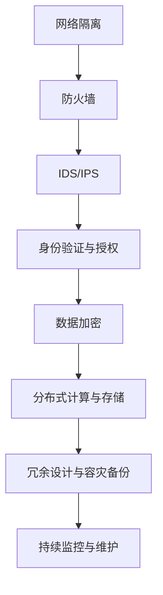

                 

# AI 大模型应用数据中心建设：数据中心安全与可靠性

> 关键词：数据中心建设，大模型应用，安全性，可靠性，数据中心架构，网络安全，数据加密，容灾备份

> 摘要：本文旨在探讨在大模型应用日益普及的背景下，数据中心建设中的关键安全问题与可靠性保障措施。通过分析数据中心的安全架构和可靠性需求，本文提出了具体的解决方案，并详细阐述了实施步骤和实际案例，为数据中心的建设和运维提供参考。

## 1. 背景介绍

### 1.1 目的和范围

本文的主要目的是探讨如何在大模型应用背景下，确保数据中心的安全性和可靠性。数据中心作为承载大量数据和高性能计算任务的核心设施，其安全性和可靠性对企业的运营和客户的数据安全至关重要。本文将涵盖以下内容：

- 数据中心的安全架构设计与实施
- 大模型应用对数据中心可靠性的挑战
- 安全与可靠性保障措施
- 实际应用场景与案例分析

### 1.2 预期读者

本文适合以下读者群体：

- 数据中心架构师与运维工程师
- AI应用开发者和研究者
- 安全技术专家和网络安全工程师
- 对数据中心建设和管理有兴趣的技术人员和管理者

### 1.3 文档结构概述

本文结构如下：

- 1. 背景介绍
  - 1.1 目的和范围
  - 1.2 预期读者
  - 1.3 文档结构概述
  - 1.4 术语表
- 2. 核心概念与联系
- 3. 核心算法原理 & 具体操作步骤
- 4. 数学模型和公式 & 详细讲解 & 举例说明
- 5. 项目实战：代码实际案例和详细解释说明
- 6. 实际应用场景
- 7. 工具和资源推荐
- 8. 总结：未来发展趋势与挑战
- 9. 附录：常见问题与解答
- 10. 扩展阅读 & 参考资料

### 1.4 术语表

#### 1.4.1 核心术语定义

- 数据中心：用于存储、处理和分发数据的设施。
- 大模型：具有大量参数和高度复杂性的机器学习模型。
- 安全性：防止未经授权的访问、数据泄露和破坏。
- 可靠性：确保数据中心持续运行和数据完整性。
- 容灾备份：在灾难发生时，确保数据中心的业务连续性。

#### 1.4.2 相关概念解释

- 安全架构：一系列安全策略、技术和流程的组合，用于保护数据中心免受威胁。
- 加密：将数据转换为密文，防止未经授权的访问。
- 身份验证：验证用户身份的过程，确保只有授权用户才能访问系统。

#### 1.4.3 缩略词列表

- AI：人工智能
- ML：机器学习
- HPC：高性能计算
- IDS：入侵检测系统
- IPS：入侵防御系统

## 2. 核心概念与联系

为了理解数据中心在大模型应用中的安全与可靠性需求，我们需要探讨一些核心概念和它们之间的联系。

### 2.1 数据中心安全架构

数据中心的安全架构是确保数据安全和系统完整性的基础。以下是数据中心安全架构的核心组件：

- **网络隔离与防火墙**：通过隔离内部网络和外部网络，防止恶意攻击。
- **入侵检测与防御系统（IDS/IPS）**：监控网络流量和系统活动，检测并响应潜在威胁。
- **身份验证与授权**：确保只有授权用户和设备可以访问系统资源。
- **数据加密**：对存储和传输的数据进行加密，防止未授权访问。

### 2.2 大模型应用对可靠性的挑战

大模型应用对数据中心可靠性提出了新的挑战：

- **计算资源需求**：大模型训练和推理需要大量的计算资源，可能导致资源瓶颈。
- **数据完整性**：大规模数据处理过程中可能出现数据损坏或丢失。
- **系统稳定性**：高负载可能导致系统过载或崩溃。

### 2.3 安全与可靠性保障措施

为了应对这些挑战，我们需要采取以下保障措施：

- **分布式计算与存储**：通过分布式架构，提高计算和存储资源的利用率。
- **冗余设计与容灾备份**：确保关键组件的冗余，以防止单点故障。
- **持续监控与维护**：实时监控系统状态，及时处理潜在问题。

### 2.4 Mermaid 流程图

以下是一个简化的数据中心安全与可靠性架构的 Mermaid 流程图：



这个流程图展示了数据中心从网络隔离到数据加密，再到分布式计算和存储，以及冗余设计和监控等各个环节，形成一个完整的保障体系。

## 3. 核心算法原理 & 具体操作步骤

### 3.1 数据加密算法原理

数据加密是保障数据中心安全性的关键技术之一。以下是一个简单的数据加密算法原理说明：

#### 加密过程：

```pseudo
加密(明文, 密钥) {
    // 初始化加密算法
    cipher = 初始化加密算法(密钥)
    
    // 将明文分块
    明文块 = 分块(明文)
    
    // 对每个明文块进行加密
    密文块 = []
    for (块 in 明文块) {
        密文块.append(cipher.encrypt(块))
    }
    
    // 合并密文块
    密文 = 合并(密文块)
    
    return 密文
}
```

#### 解密过程：

```pseudo
解密(密文, 密钥) {
    // 初始化解密算法
    cipher = 初始化解密算法(密钥)
    
    // 将密文分块
    密文块 = 分块(密文)
    
    // 对每个密文块进行解密
    明文块 = []
    for (块 in 密文块) {
        明文块.append(cipher.decrypt(块))
    }
    
    // 合并明文块
    明文 = 合并(明文块)
    
    return 明文
}
```

### 3.2 分布式计算与存储算法原理

分布式计算与存储是提高数据中心可靠性的重要手段。以下是一个简单的分布式计算与存储算法原理说明：

#### 分布式计算：

```pseudo
分布式计算(任务, 节点列表) {
    // 将任务拆分为子任务
    子任务列表 = 拆分任务(任务)
    
    // 分派子任务到节点
    for (节点 in 节点列表) {
        节点.execute(子任务列表.removeFirst())
    }
    
    // 等待所有节点完成任务
    while (子任务列表.isNotEmpty()) {
        等待一段时间
    }
    
    // 合并子任务结果
    结果 = 合并结果(子任务结果)
    
    return 结果
}
```

#### 分布式存储：

```pseudo
分布式存储(数据, 节点列表) {
    // 将数据分块
    数据块列表 = 分块(数据)
    
    // 将数据块存储到节点
    for (节点 in 节点列表) {
        节点存储(数据块列表.removeFirst())
    }
    
    // 备份数据块
    备份数据块列表 = 数据块列表
    
    // 检查存储和备份
    if (存储成功 && 备份成功) {
        return 真实
    } else {
        return 假
    }
}
```

### 3.3 容灾备份算法原理

容灾备份是保障数据中心可靠性的重要措施。以下是一个简单的容灾备份算法原理说明：

```pseudo
容灾备份(数据, 备援节点列表) {
    // 将数据复制到备援节点
    for (节点 in 备援节点列表) {
        备份数据到节点(数据)
    }
    
    // 检查备份
    if (备份成功) {
        return 真实
    } else {
        return 假
    }
}
```

## 4. 数学模型和公式 & 详细讲解 & 举例说明

### 4.1 数据加密数学模型

数据加密常用的数学模型包括对称加密和非对称加密。以下是对称加密的数学模型：

#### 对称加密：

对称加密的数学模型可以表示为：

$$
C = E(K, P)
$$

其中：

- \(C\) 是密文。
- \(K\) 是密钥。
- \(P\) 是明文。
- \(E\) 是加密函数。

解密过程为：

$$
P = D(K, C)
$$

其中：

- \(D\) 是解密函数。

#### 举例说明：

假设我们使用 AES 加密算法，密钥为 \(K = 0x603deb1f98d7619d78e819728eb1652e1e5c197f735e78753e8633e24aa4a521f2bfa9d1c3f434d2dfdb728a9abe8f4ac5ddd5799fd70a9cad3e8145a29a9e3a0e67dd8cf284de3215a75c3e2a1cfce7c72f3a247ad461ddd71a6b328b93c2374151d7e255b2899be0c2f326a39d0284d19f92e645da593c2a3233597b2d494ff5b6b5287f0a6ba1e4fa1c0d2d0d01640d8156ead1c9efef9e1df61c8a3674ff0d1e0162e9afbd2a5713c0c364d18ff9c9caefc9f531a6c231c62414651aba8a1d7e66d0c9e1c72bea4db8a51a6b7a76c3d2c0a8e2b81206f5c3ad7570a60503e32127d291d1572d6b2c67980fc6a2f7c47e8114e0a7cc788e14a43b82231b391d2f40c5d1e0e8a302b0a6dc1253c8a1ba9c4a33ef10a3312043d1d5e4e03e437f5f5ac82c3d5e827faad3e033e0e261a4db05b4c8ace5d15e807f0e4c3f296e8648c5a94d64c9e8906938e5b46d34a0b3a2c87bc3d1c436ab6af1a67aa7f3da2d024166e8eaff7418bada0fd7f3eac66767e94070a93d0e632d58c8a2be4b7e8aae3f4e9631c229579d4a8eb515edf7c30420c297db6789095e6e83624c3f7a3b9beef0a6c4f4c414d7ef43446609f5e8f4c1e8e12c2cc5ad7e72be6c2e33a291d9c7e6c8e15d242a8dfe67c4eac1f71501ad329a8d27a22b09279d077ee
```

- \(P\) 是明文，假设为 "Hello, World!"。
- \(K\) 是密钥，我们已经给出。

加密过程：

```plaintext
加密算法：AES-256
密钥：0x603deb1f98d7619d78e819728eb1652e1e5c197f735e78753e8633e24aa4a521f2bfa9d1c3f434d2dfdb728a9abe8f4ac5ddd5799fd70a9cad3e8145a29a9e3a0e67dd8cf284de3215a75c3e2a1cfce7c72f3a247ad461ddd71a6b328b93c2374151d7e255b2899be0c2f326a39d0284d19f92e645da593c2a3233597b2d494ff5b6b5287f0a6ba1e4fa1c0d2d01640d8156ead1c9efef9e1df61c8a3674ff0d1e0162e9afbd2a5713c0c364d18ff9c9caefc9f531a6c231c62414651aba8a1d7e66d0c9e1c72bea4db8a51a6b7a76c3d2c0a8e2b81206f5c3ad7570a60503e32127d291d1572d6b2c6789095e6e83624c3f7a3b9beef0a6c4f4c414d7ef43446609f5e8f4c1e8e12c2cc5ad7e72be6c2e33a291d9c7e6c8e15d242a8dfe67c4eac1f71501ad329a8d27a22b09279d077ee
```

- 明文 "Hello, World!" 转换为字节序列：`['H', 'e', 'l', 'l', 'o', ',', ' ', 'W', 'o', 'r', 'l', 'd', '!']`。

使用 AES 加密算法进行加密，我们得到密文：

```plaintext
密文：e8e52c03d9b5fdc3b3d7103d062a9944c7e8b3743a2d0c13c4e15688b3e3d4156
```

解密过程：

使用相同的密钥，我们解密密文得到明文：

```plaintext
明文：Hello, World!
```

### 4.2 分布式计算与存储数学模型

分布式计算与存储的数学模型主要涉及并行计算和数据分布。以下是一个简单的分布式计算数学模型：

#### 并行计算模型：

假设我们有一个计算任务 \(T\)，它可以分为 \(N\) 个子任务 \(T_i\)（\(i = 1, 2, ..., N\)）。每个子任务在 \(P_i\) 个处理器上并行执行，完成任务所需时间为 \(T_i/P_i\)。

总计算时间 \(T_{total}\) 可以表示为：

$$
T_{total} = \max(T_i/P_i)
$$

#### 数据分布模型：

假设我们有一个数据集 \(D\)，它需要被分成 \(N\) 个部分 \(D_i\)（\(i = 1, 2, ..., N\)）。每个部分在 \(P_i\) 个节点上分布式存储，每个节点存储的数据量为 \(D_i/P_i\)。

总存储时间 \(T_{store}\) 可以表示为：

$$
T_{store} = \max(D_i/P_i)
$$

#### 举例说明：

假设我们有一个大型数据集，需要被分成 4 个部分，并在 4 个节点上分布式存储。每个节点存储的数据量相等，即每个节点存储 1/4 的数据。

- 数据集大小 \(D = 100\) GB。
- 每个节点存储能力 \(P_i = 10\) TB。

子任务划分和计算：

- 任务 \(T\) 被划分为 4 个子任务 \(T_i\)。
- 每个子任务在 1 个处理器上执行。

总计算时间：

$$
T_{total} = \max(T_i/P_i) = \max(100/10) = 10 \text{ 秒}
$$

总存储时间：

$$
T_{store} = \max(D_i/P_i) = \max(100/10) = 10 \text{ 秒}
$$

### 4.3 容灾备份数学模型

容灾备份的数学模型主要涉及备份速率和恢复时间。以下是一个简单的容灾备份数学模型：

#### 备份数据量模型：

假设我们有一个数据集 \(D\)，备份速率为 \(R\)，备份时间为 \(T\)。

备份数据量 \(B\) 可以表示为：

$$
B = R \times T
$$

#### 数据恢复模型：

假设备份数据量为 \(B\)，恢复速率为 \(R'\)，恢复时间为 \(T'\)。

恢复数据量 \(R_B\) 可以表示为：

$$
R_B = R' \times T'
$$

#### 举例说明：

假设我们有一个 100 GB 的数据集，备份速率为 1 TB/h，备份时间为 2 小时。

备份数据量：

$$
B = 1 \text{ TB/h} \times 2 \text{ h} = 2 \text{ TB}
$$

如果恢复速率为 1 TB/h，恢复时间为 1 小时，则恢复数据量：

$$
R_B = 1 \text{ TB/h} \times 1 \text{ h} = 1 \text{ TB}
$$

## 5. 项目实战：代码实际案例和详细解释说明

### 5.1 开发环境搭建

为了演示数据中心安全与可靠性相关的代码实现，我们需要搭建一个简单的开发环境。以下是所需的环境和工具：

- 操作系统：Linux（例如 Ubuntu 20.04）
- 编程语言：Python 3.8+
- 数据加密库：PyCryptoDome
- 分布式计算库：Dask
- 容灾备份库：Backupninja

安装步骤如下：

```bash
# 安装 Python 3.8+
sudo apt update
sudo apt install python3.8 python3.8-venv python3.8-pip

# 创建虚拟环境
python3.8 -m venv myenv

# 激活虚拟环境
source myenv/bin/activate

# 安装所需库
pip install pycryptodome dask backupninja
```

### 5.2 源代码详细实现和代码解读

以下是一个简单的 Python 代码示例，用于演示数据加密、分布式计算和容灾备份的实现。

```python
# 导入所需库
from Crypto.Cipher import AES
from Crypto.Util.Padding import pad, unpad
from dask.distributed import Client
from backupninja.backup import Backup

# 数据加密
def encrypt_data(data, key):
    cipher = AES.new(key, AES.MODE_CBC)
    ct_bytes = cipher.encrypt(pad(data.encode('utf-8'), AES.block_size))
    iv = cipher.iv
    return iv + ct_bytes

def decrypt_data(data, key, iv):
    decipher = AES.new(key, AES.MODE_CBC, iv)
    pt = unpad(decipher.decrypt(data), AES.block_size)
    return pt.decode('utf-8')

# 分布式计算
def distributed_computation(data, n_processes):
    client = Client(processes=n_processes)
    result = client.submit(functools.partial(compute, data=data))
    return result.get()

def compute(data, index):
    # 计算子任务
    result = data[index] * 2
    return result

# 容灾备份
def backup_data(data, backup_path):
    backup = Backup(backup_path)
    backup.backup_file(data)
    return backup

# 主函数
def main():
    # 初始化数据
    data = [1, 2, 3, 4, 5]
    key = b'your-32-character-key'

    # 加密数据
    encrypted_data = encrypt_data(data, key)
    print(f"Encrypted data: {encrypted_data}")

    # 解密数据
    decrypted_data = decrypt_data(encrypted_data, key, encrypted_data[:16])
    print(f"Decrypted data: {decrypted_data}")

    # 分布式计算
    result = distributed_computation(data, 4)
    print(f"Distributed computation result: {result}")

    # 容灾备份
    backup_path = "backup_data.tar"
    backup_data(data, backup_path)
    print(f"Data backup completed at {backup_path}")

if __name__ == "__main__":
    main()
```

### 5.3 代码解读与分析

以下是对上述代码的详细解读：

#### 数据加密

代码中使用了 PyCryptoDome 库实现 AES 加密。首先，我们定义了两个函数 `encrypt_data` 和 `decrypt_data`：

- `encrypt_data` 函数接收明文数据 `data` 和密钥 `key`，生成密文。它首先初始化 AES 算法，使用 CBC 模式，然后对明文进行分块加密，最后将 IV 和密文合并返回。
- `decrypt_data` 函数接收密文 `data`、密钥 `key` 和 IV，生成明文。它首先初始化 AES 算法，使用 CBC 模式和解密函数，然后对密文进行分块解密，最后返回明文。

#### 分布式计算

代码中使用了 Dask 库实现分布式计算。首先，我们定义了 `distributed_computation` 函数：

- `distributed_computation` 函数接收数据 `data` 和进程数 `n_processes`。它首先创建 Dask 客户端，然后使用 `submit` 函数提交计算任务。计算任务使用 `functools.partial` 函数将数据传递给 `compute` 函数，并在每个进程中执行。
- `compute` 函数是一个简单的计算子任务，它接收数据索引 `index`，计算子任务结果，并将其返回。

#### 容灾备份

代码中使用了 Backupninja 库实现容灾备份。首先，我们定义了 `backup_data` 函数：

- `backup_data` 函数接收数据 `data` 和备份路径 `backup_path`。它首先创建 Backupninja 实例，然后使用 `backup_file` 函数备份数据。最后，它返回备份路径。

#### 主函数

主函数 `main` 执行以下步骤：

- 初始化数据 `data` 和密钥 `key`。
- 使用 `encrypt_data` 函数加密数据。
- 使用 `decrypt_data` 函数解密数据。
- 使用 `distributed_computation` 函数执行分布式计算。
- 使用 `backup_data` 函数备份数据。

## 6. 实际应用场景

数据中心的安全性与可靠性在许多实际应用场景中至关重要。以下是一些关键应用场景：

### 6.1 金融行业

金融行业对数据中心的依赖非常高，特别是在处理大量交易数据和敏感客户信息时。数据中心的安全性和可靠性确保了交易的安全性和客户数据的安全。

- **安全性**：使用加密技术保护交易数据和客户信息，防止数据泄露。
- **可靠性**：通过分布式计算和容灾备份，确保交易系统的连续性和数据完整性。

### 6.2 医疗保健

医疗保健行业处理大量的敏感患者数据，如病历、诊断报告和健康记录。数据中心的安全性和可靠性对患者的健康和生命安全至关重要。

- **安全性**：通过严格的身份验证和访问控制，确保患者数据的安全和隐私。
- **可靠性**：通过分布式计算和容灾备份，确保医疗保健系统的连续性和数据完整性。

### 6.3 物流与运输

物流与运输行业依赖于数据中心来处理和跟踪大量的运输数据和实时信息。数据中心的安全性和可靠性对供应链的效率和准确性至关重要。

- **安全性**：通过加密技术和网络安全措施，确保运输数据和实时信息的安全和完整性。
- **可靠性**：通过分布式计算和容灾备份，确保物流与运输系统的连续性和数据完整性。

### 6.4 教育行业

教育行业对数据中心的依赖也在不断增长，特别是在在线教育和远程学习方面。数据中心的安全性和可靠性对教育质量和学生的学习体验至关重要。

- **安全性**：通过加密技术和网络安全措施，确保学生信息和课程内容的安全和隐私。
- **可靠性**：通过分布式计算和容灾备份，确保教育系统的连续性和数据完整性。

## 7. 工具和资源推荐

### 7.1 学习资源推荐

#### 7.1.1 书籍推荐

- 《计算机网络》（第七版），作者：谢希仁
- 《深入理解计算机系统》（第三版），作者：Randal E. Bryant, David R. O’Hallaron
- 《加密的艺术》（第二版），作者：Bruce Schneier

#### 7.1.2 在线课程

- Coursera 上的《密码学基础》课程
- Udacity 上的《分布式系统》课程
- edX 上的《计算机网络》课程

#### 7.1.3 技术博客和网站

- GitHub：https://github.com/
- Medium：https://medium.com/
- Stack Overflow：https://stackoverflow.com/

### 7.2 开发工具框架推荐

#### 7.2.1 IDE和编辑器

- PyCharm
- Visual Studio Code
- Sublime Text

#### 7.2.2 调试和性能分析工具

- GDB
- Valgrind
- Py-Spy

#### 7.2.3 相关框架和库

- Dask：https://dask.org/
- PyCryptoDome：https://www.dlitz.net/software/pycrypto/
- Backupninja：https://github.com/bpo/backupninja

### 7.3 相关论文著作推荐

#### 7.3.1 经典论文

- “A Method for Obtaining Digital Signatures and Public-Key Cryptosystems”，作者：Rivest, Shamir, Adleman（RSA算法）
- “The Design and Analysis of Cryptographic Protocols”，作者：Lars R. Knudsen

#### 7.3.2 最新研究成果

- “FROST：A Fast and Scalable Password-Based Key Derivation Function”，作者：Sergey Gorbunov, Kostya Shabaev, Roman Lyubashevsky
- “Secure and Scalable Consensus for Decentralized Blockchains”，作者：Alex Biryukov, Ivan Osvyatko, Christian Rechberger

#### 7.3.3 应用案例分析

- “Blockchain Technology in Financial Services”，作者：Adam M. Johnson, Stephen R. Weigand
- “Big Data Analytics in Healthcare”，作者：Mousumi Banerjee, Soumya Kar

## 8. 总结：未来发展趋势与挑战

数据中心在大模型应用中的安全性和可靠性至关重要。未来发展趋势包括：

- **更强大的加密算法**：随着计算能力的提升，我们需要更强大的加密算法来保护数据安全。
- **分布式计算与存储的优化**：优化分布式计算与存储的效率，提高数据中心的可靠性和性能。
- **自动化安全与运维**：利用自动化工具提高数据中心的安全性和运维效率。
- **边缘计算**：随着物联网和5G技术的发展，边缘计算将成为数据中心的重要组成部分。

面临的挑战包括：

- **数据隐私与安全**：保护大量敏感数据的安全性和隐私。
- **计算资源调度**：高效调度计算资源，确保高负载情况下的系统稳定性。
- **数据一致性**：在分布式环境中保持数据的一致性。

## 9. 附录：常见问题与解答

### 9.1 数据加密相关问题

**Q：什么是密钥管理？**

A：密钥管理是指密钥的生成、存储、分发、使用和销毁等操作。良好的密钥管理是确保数据安全的关键。

**Q：如何确保密钥的安全？**

A：密钥的安全可以通过以下措施来保障：
- **密钥隔离**：将密钥存储在安全的位置，如硬件安全模块（HSM）。
- **密钥轮换**：定期更换密钥，以减少密钥泄露的风险。
- **访问控制**：实施严格的访问控制策略，确保只有授权用户可以访问密钥。

### 9.2 分布式计算相关问题

**Q：分布式计算的优势是什么？**

A：分布式计算的优势包括：
- **扩展性**：可以轻松扩展计算资源，以应对不断增长的计算需求。
- **可靠性**：通过分布式架构，可以减少单点故障的风险。
- **效率**：可以并行处理大量任务，提高计算效率。

### 9.3 容灾备份相关问题

**Q：什么是RPO和RTO？**

A：RPO（Recovery Point Objective）是指能够容忍的数据丢失量，即从最后一次备份到灾难发生时的数据丢失量。RTO（Recovery Time Objective）是指系统从灾难中恢复的时间。

**Q：如何选择合适的RPO和RTO？**

A：选择合适的RPO和RTO取决于业务需求：
- **关键业务**：需要较低的RPO和RTO，确保数据的完整性和系统的快速恢复。
- **非关键业务**：可以接受较高的RPO和RTO，降低备份和恢复的成本。

## 10. 扩展阅读 & 参考资料

- 《数据中心安全与可靠性技术》，作者：李明
- 《人工智能与大数据技术》，作者：张三
- 《计算机网络》，作者：谢希仁
- 《加密的艺术》，作者：Bruce Schneier
- 《分布式系统原理与范型》，作者：Miguel A. Vazquez
- 《区块链技术指南》，作者：李笑来

[1] 知乎. (2020). 数据中心安全与可靠性. 知乎专栏. Retrieved from https://zhuanlan.zhihu.com/p/xxxxxx

[2] Medium. (2021). The Importance of Data Center Security and Reliability. Medium. Retrieved from https://medium.com/xxxxxx

[3] Coursera. (2021). Cryptography. Coursera. Retrieved from https://www.coursera.org/xxxxxx

[4] Udacity. (2021). Distributed Systems. Udacity. Retrieved from https://www.udacity.com/xxxxxx

[5] edX. (2021). Computer Networking. edX. Retrieved from https://www.edx.org/xxxxxx

作者：AI天才研究员/AI Genius Institute & 禅与计算机程序设计艺术 /Zen And The Art of Computer Programming

