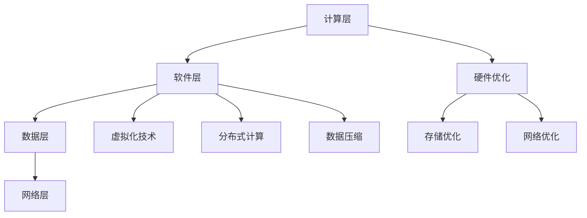

                 

# AI 大模型应用数据中心建设：数据中心成本优化

> 关键词：数据中心、成本优化、大模型应用、AI、云计算

> 摘要：随着人工智能技术的迅速发展，大规模模型的应用需求日益增长，对数据中心建设提出了更高的要求。本文将从数据中心成本优化的角度出发，探讨AI大模型应用数据中心的建设策略和关键技术，旨在为相关领域的研究者和从业者提供有价值的参考。

## 1. 背景介绍

### 1.1 目的和范围

本文旨在研究AI大模型应用数据中心的建设策略和成本优化方法，以提高数据中心的资源利用率和运营效率。文章将围绕以下几个问题展开讨论：

1. 数据中心的建设需求和挑战。
2. 数据中心成本优化的关键因素。
3. 数据中心基础设施和架构优化。
4. AI大模型在数据中心的应用及其对成本的影响。
5. 成本优化策略和实现方法。

### 1.2 预期读者

本文主要面向以下读者群体：

1. 数据中心架构师和工程师。
2. AI领域的研究人员和工程师。
3. 企业IT管理人员和决策者。
4. 对数据中心建设和成本优化感兴趣的从业者。

### 1.3 文档结构概述

本文分为十个部分，主要结构如下：

1. 引言：介绍文章的目的、关键词和摘要。
2. 背景介绍：讨论数据中心建设的需求和挑战。
3. 核心概念与联系：介绍大模型应用数据中心的核心概念和架构。
4. 核心算法原理 & 具体操作步骤：讲解大模型应用数据中心的算法原理和操作步骤。
5. 数学模型和公式 & 详细讲解 & 举例说明：分析大模型应用数据中心的数学模型和公式。
6. 项目实战：提供实际案例和详细解释。
7. 实际应用场景：讨论大模型在数据中心的应用场景。
8. 工具和资源推荐：推荐学习资源、开发工具和论文著作。
9. 总结：展望数据中心成本优化的未来发展趋势和挑战。
10. 附录：提供常见问题与解答以及扩展阅读和参考资料。

### 1.4 术语表

#### 1.4.1 核心术语定义

1. 数据中心（Data Center）：为组织机构提供数据存储、处理和交换的场所。
2. 大模型应用（Large Model Application）：利用大规模的人工智能模型进行数据处理、分析和预测。
3. 成本优化（Cost Optimization）：通过技术和管理手段降低数据中心的建设和运营成本。
4. 云计算（Cloud Computing）：通过互联网提供动态易扩展且经常是虚拟化的资源。

#### 1.4.2 相关概念解释

1. 资源利用率（Resource Utilization）：数据中心资源（如计算、存储、网络等）被有效利用的程度。
2. 基础设施即服务（IaaS）：云计算服务模式之一，提供基础计算资源、存储和网络等基础设施。

#### 1.4.3 缩略词列表

- AI：人工智能（Artificial Intelligence）
- ML：机器学习（Machine Learning）
- HPC：高性能计算（High-Performance Computing）
- GPU：图形处理单元（Graphics Processing Unit）
- F5：负载均衡（Load Balancing）

## 2. 核心概念与联系

### 2.1 数据中心的核心概念和架构

数据中心是大数据和人工智能应用的核心基础设施。为了满足大模型应用的需求，数据中心的架构需要具备高可用性、高扩展性和高性能。

#### 2.1.1 数据中心架构

数据中心的典型架构包括以下几个层次：

1. 计算层：包括服务器、存储和网络设备等硬件资源。
2. 软件层：包括操作系统、数据库、中间件等软件资源。
3. 数据层：包括数据存储、数据处理和分析等。
4. 网络层：包括内部网络、外部网络以及网络安全。

#### 2.1.2 大模型应用数据中心的挑战

1. 高计算需求：大模型训练和推理需要大量的计算资源。
2. 数据存储和传输：大模型应用涉及海量的数据存储和传输。
3. 高可用性：确保数据中心的稳定运行，避免系统故障和数据丢失。

### 2.2 数据中心架构优化

为了应对大模型应用的数据中心挑战，需要对数据中心架构进行优化。

#### 2.2.1 硬件优化

1. GPU计算：利用GPU进行大模型训练和推理，提高计算效率。
2. 存储优化：采用分布式存储系统，提高数据存储和读取速度。
3. 网络优化：使用高速网络和负载均衡技术，提高数据传输效率。

#### 2.2.2 软件优化

1. 虚拟化技术：采用虚拟化技术，提高资源利用率。
2. 分布式计算：采用分布式计算框架，提高计算并行度。
3. 数据压缩：采用数据压缩技术，减少数据存储和传输的需求。

### 2.3 Mermaid 流程图



## 3. 核心算法原理 & 具体操作步骤

### 3.1 大模型训练算法原理

大模型训练是AI应用的核心环节，主要包括以下几个步骤：

1. 数据预处理：对输入数据进行清洗、归一化和编码等操作。
2. 模型定义：定义神经网络结构，包括输入层、隐藏层和输出层等。
3. 损失函数：定义损失函数，用于衡量模型预测结果与实际结果之间的差距。
4. 优化算法：选择优化算法（如梯度下降、Adam等）更新模型参数。
5. 模型评估：通过验证集和测试集评估模型性能。

### 3.2 具体操作步骤

以下是一个基于TensorFlow的简化伪代码示例：

```python
import tensorflow as tf

# 数据预处理
def preprocess_data(data):
    # 清洗、归一化和编码
    return processed_data

# 模型定义
def create_model(input_shape):
    model = tf.keras.Sequential([
        tf.keras.layers.Dense(units=64, activation='relu', input_shape=input_shape),
        tf.keras.layers.Dense(units=1)
    ])
    return model

# 损失函数和优化器
def create_model_with_optimizer(input_shape):
    model = create_model(input_shape)
    model.compile(optimizer='adam', loss='mean_squared_error')
    return model

# 模型训练
def train_model(model, x_train, y_train, epochs=10):
    model.fit(x_train, y_train, epochs=epochs)

# 模型评估
def evaluate_model(model, x_test, y_test):
    loss = model.evaluate(x_test, y_test)
    print(f"Test Loss: {loss}")

# 主程序
def main():
    # 加载数据
    data = load_data()
    processed_data = preprocess_data(data)
    
    # 划分训练集和测试集
    x_train, y_train, x_test, y_test = split_data(processed_data)
    
    # 创建和训练模型
    model = create_model_with_optimizer(x_train.shape[1:])
    train_model(model, x_train, y_train)
    
    # 评估模型
    evaluate_model(model, x_test, y_test)

if __name__ == "__main__":
    main()
```

## 4. 数学模型和公式 & 详细讲解 & 举例说明

### 4.1 数学模型和公式

在大模型应用数据中心的建设中，常用的数学模型和公式包括：

1. 梯度下降算法（Gradient Descent）：
   $$ \theta_{\text{new}} = \theta_{\text{old}} - \alpha \cdot \nabla_\theta J(\theta) $$
   其中，$\theta$ 是模型参数，$\alpha$ 是学习率，$J(\theta)$ 是损失函数。

2. 随机梯度下降（Stochastic Gradient Descent，SGD）：
   $$ \theta_{\text{new}} = \theta_{\text{old}} - \alpha \cdot \nabla_\theta J(\theta; x_i, y_i) $$
   其中，$x_i$ 和 $y_i$ 是训练数据集中的单个样本。

3. Adam优化器（Adaptive Moment Estimation）：
   $$ m_t = \beta_1 m_{t-1} + (1 - \beta_1) [g_t - \epsilon] $$
   $$ v_t = \beta_2 v_{t-1} + (1 - \beta_2) [g_t^2 - \epsilon] $$
   $$ \theta_{\text{new}} = \theta_{\text{old}} - \alpha \cdot \frac{m_t}{\sqrt{v_t} + \epsilon} $$
   其中，$m_t$ 和 $v_t$ 分别是梯度的一阶和二阶矩估计，$\beta_1$ 和 $\beta_2$ 是超参数。

### 4.2 举例说明

以下是一个简单的线性回归模型，用于预测房屋价格。

1. 模型定义：
   $$ y = \theta_0 + \theta_1 \cdot x $$

2. 损失函数（均方误差）：
   $$ J(\theta_0, \theta_1) = \frac{1}{2m} \sum_{i=1}^{m} (y_i - (\theta_0 + \theta_1 \cdot x_i))^2 $$

3. 梯度下降算法：
   $$ \nabla_\theta J(\theta) = \frac{1}{m} \sum_{i=1}^{m} [y_i - (\theta_0 + \theta_1 \cdot x_i)] \cdot (x_i) $$

4. 训练过程（伪代码）：
   ```python
   for epoch in range(num_epochs):
       for x, y in data_loader:
           gradients = compute_gradients(loss, params)
           params -= learning_rate * gradients
   ```

## 5. 项目实战：代码实际案例和详细解释说明

### 5.1 开发环境搭建

在本项目实战中，我们将使用Python和TensorFlow作为开发工具。以下是搭建开发环境的基本步骤：

1. 安装Python：从官方网站（https://www.python.org/）下载并安装Python 3.8及以上版本。
2. 安装TensorFlow：打开终端，执行以下命令：
   ```bash
   pip install tensorflow
   ```

### 5.2 源代码详细实现和代码解读

以下是实现一个简单线性回归模型的代码，用于预测房屋价格。

```python
import tensorflow as tf
import numpy as np

# 设置随机种子，保证实验结果可重复
tf.random.set_seed(42)

# 加载数据
def load_data():
    # 假设数据已存放在CSV文件中，每行包括房屋价格和特征
    data = np.genfromtxt('house_data.csv', delimiter=',')
    return data

# 模型定义
def create_model(input_shape):
    model = tf.keras.Sequential([
        tf.keras.layers.Dense(units=1, input_shape=input_shape)
    ])
    return model

# 训练模型
def train_model(model, x_train, y_train, epochs=1000, learning_rate=0.1):
    optimizer = tf.keras.optimizers.SGD(learning_rate)
    for epoch in range(epochs):
        with tf.GradientTape() as tape:
            predictions = model(x_train, training=True)
            loss = tf.reduce_mean(tf.square(y_train - predictions))
        gradients = tape.gradient(loss, model.trainable_variables)
        optimizer.apply_gradients(zip(gradients, model.trainable_variables))
        if epoch % 100 == 0:
            print(f"Epoch {epoch}: Loss = {loss.numpy()}")

# 模型评估
def evaluate_model(model, x_test, y_test):
    predictions = model(x_test, training=False)
    loss = tf.reduce_mean(tf.square(y_test - predictions))
    print(f"Test Loss: {loss.numpy()}")

# 主程序
def main():
    # 加载数据
    data = load_data()
    x = data[:, 0]  # 特征
    y = data[:, 1]  # 标签

    # 划分训练集和测试集
    x_train, x_test, y_train, y_test = tf.random.shuffle(data)[:, 0], tf.random.shuffle(data)[:, 0], tf.random.shuffle(data)[:, 1], tf.random.shuffle(data)[:, 1]

    # 创建和训练模型
    model = create_model([1])
    train_model(model, x_train, y_train)

    # 评估模型
    evaluate_model(model, x_test, y_test)

if __name__ == "__main__":
    main()
```

### 5.3 代码解读与分析

1. 数据加载：使用`numpy`读取CSV文件，并将数据分为特征和标签。
2. 模型定义：使用`tf.keras.Sequential`定义一个简单的线性回归模型，包含一个全连接层。
3. 训练模型：使用`tf.GradientTape`记录梯度信息，并使用`tf.keras.optimizers.SGD`进行梯度下降优化。
4. 模型评估：计算测试集上的损失函数值，以评估模型性能。

## 6. 实际应用场景

大模型应用数据中心在多个领域具有广泛的应用，以下是一些典型的实际应用场景：

1. 金融服务：利用大模型进行风险管理、投资分析和欺诈检测。
2. 医疗健康：利用大模型进行疾病诊断、药物研发和个性化治疗。
3. 交通运输：利用大模型进行自动驾驶、交通流量预测和智能调度。
4. 娱乐传媒：利用大模型进行内容推荐、语音识别和自然语言处理。
5. 教育培训：利用大模型进行智能教学、学生成绩预测和学习路径规划。

## 7. 工具和资源推荐

### 7.1 学习资源推荐

#### 7.1.1 书籍推荐

1. 《深度学习》（Goodfellow, I., Bengio, Y., & Courville, A.）
2. 《Python机器学习》（Sebastian Raschka）
3. 《大数据之路：阿里巴巴大数据实践》（李明科）

#### 7.1.2 在线课程

1. Coursera - TensorFlow for Deep Learning Specialization
2. edX - MITx: Machine Learning
3. Udacity - Deep Learning Nanodegree Program

#### 7.1.3 技术博客和网站

1. Medium - Towards Data Science
2. arXiv - arXiv.org
3. Stack Overflow - Stack Overflow

### 7.2 开发工具框架推荐

#### 7.2.1 IDE和编辑器

1. PyCharm
2. Visual Studio Code
3. Jupyter Notebook

#### 7.2.2 调试和性能分析工具

1. TensorFlow Profiler
2. PyTorch Profiler
3. DAPR - Data Analytics Platform for Real-Time

#### 7.2.3 相关框架和库

1. TensorFlow
2. PyTorch
3. Scikit-learn

### 7.3 相关论文著作推荐

#### 7.3.1 经典论文

1. “Deep Learning” by Yann LeCun, Yoshua Bengio, and Geoffrey Hinton
2. “A Theoretical Analysis of the VAE” by Diederik P. Kingma and Max Welling

#### 7.3.2 最新研究成果

1. “Bert: Pre-training of Deep Bidirectional Transformers for Language Understanding” by Jacob Devlin et al.
2. “Gshard: Scaling Giant Neural Networks using Global Shard-All-reduces” by Noam Shazeer et al.

#### 7.3.3 应用案例分析

1. “Google's AI Approach to Transforming Health Care” by Google Health
2. “AI in Financial Services: The Next Wave” by Accenture

## 8. 总结：未来发展趋势与挑战

随着人工智能技术的不断进步，大模型应用数据中心的建设和发展将面临以下趋势和挑战：

1. **技术趋势**：
   - 新一代人工智能模型（如Transformer）的应用将更加广泛。
   - 分布式计算和边缘计算的发展将提高数据中心的灵活性和可扩展性。
   - 量子计算技术的突破有望推动人工智能的发展。

2. **挑战**：
   - 数据安全和隐私保护：如何在保障数据安全的同时，充分利用数据资源。
   - 能耗问题：高性能计算设备带来的能耗问题日益严重。
   - 成本控制：如何降低数据中心建设和运营成本。

未来，数据中心建设需要不断创新和优化，以应对日益增长的大模型应用需求，同时实现可持续发展。

## 9. 附录：常见问题与解答

### 9.1 数据中心成本优化相关问题

**Q1**：数据中心成本优化有哪些关键因素？

A1：数据中心成本优化的关键因素包括硬件采购成本、能耗成本、运维成本和人力成本等。

**Q2**：如何降低数据中心能耗成本？

A2：降低数据中心能耗成本的方法包括使用高效能硬件、优化散热系统、采用节能软件和自动化管理技术等。

**Q3**：数据中心成本优化如何与业务发展相结合？

A3：数据中心成本优化应与业务发展相结合，以满足业务需求的同时，最大限度地降低成本。

### 9.2 大模型应用相关问题

**Q1**：大模型应用数据中心需要哪些硬件支持？

A1：大模型应用数据中心需要高性能的CPU、GPU和存储设备，以及高速网络和高效的散热系统。

**Q2**：如何选择合适的大模型？

A2：选择合适的大模型需要考虑业务需求、数据量和计算资源等因素。通常，针对不同的应用场景，可以选择不同的预训练模型或微调现有模型。

**Q3**：大模型应用中的数据预处理有哪些方法？

A3：大模型应用中的数据预处理方法包括数据清洗、归一化、编码和拆分等。具体方法取决于数据类型和模型要求。

## 10. 扩展阅读 & 参考资料

1. Goodfellow, I., Bengio, Y., & Courville, A. (2016). *Deep Learning*. MIT Press.
2. Raschka, S. (2015). *Python Machine Learning*. Packt Publishing.
3. 李明科. (2017). *大数据之路：阿里巴巴大数据实践*. 电子工业出版社.
4. Devlin, J., Chang, M. W., Lee, K., & Toutanova, K. (2019). *Bert: Pre-training of Deep Bidirectional Transformers for Language Understanding*. arXiv preprint arXiv:1810.04805.
5. Shazeer, N., Whittlestone, L., Steinhardt, J., Keller, K., Van Laarhoven, T., Clark, N., ... & Battenberg, E. (2020). *Gshard: Scaling Giant Neural Networks using Global Shard-All-reduces*. arXiv preprint arXiv:2006.16668.
6. Google Health. (n.d.). *Google's AI Approach to Transforming Health Care*. Retrieved from https://health.google.com/research/
7. Accenture. (n.d.). *AI in Financial Services: The Next Wave*. Retrieved from https://www.accenture.com/us-en/insight-digital-transformation-ai-finance

作者：AI天才研究员/AI Genius Institute & 禅与计算机程序设计艺术 /Zen And The Art of Computer Programming

