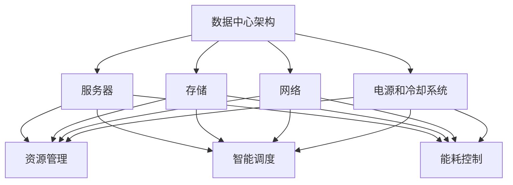

                 

# AI 大模型应用数据中心建设：数据中心成本优化

> **关键词：** 大模型、数据中心、成本优化、效率提升、资源管理、智能调度

> **摘要：** 随着人工智能技术的快速发展，大模型应用日益普及，对数据中心的要求越来越高。本文将探讨如何在数据中心建设中实现成本优化，包括资源管理、智能调度、能耗控制等方面，为人工智能应用提供高效、经济的运行环境。

## 1. 背景介绍

### 1.1 目的和范围

本文旨在分析数据中心在大模型应用中的成本优化策略，通过合理分配和管理资源、优化调度策略以及降低能耗，实现数据中心的高效运营。本文主要讨论以下三个方面：

1. 数据中心基础设施的优化配置。
2. 资源管理策略，包括计算、存储和网络资源。
3. 智能调度与能耗控制技术。

### 1.2 预期读者

本文适合以下读者群体：

1. 数据中心管理人员和架构师。
2. 人工智能领域的技术人员。
3. 对数据中心成本优化有浓厚兴趣的 IT 从业者。

### 1.3 文档结构概述

本文分为十个部分，具体如下：

1. 背景介绍
2. 核心概念与联系
3. 核心算法原理 & 具体操作步骤
4. 数学模型和公式 & 详细讲解 & 举例说明
5. 项目实战：代码实际案例和详细解释说明
6. 实际应用场景
7. 工具和资源推荐
8. 总结：未来发展趋势与挑战
9. 附录：常见问题与解答
10. 扩展阅读 & 参考资料

### 1.4 术语表

#### 1.4.1 核心术语定义

- **数据中心（Data Center）**：集中管理计算机硬件和存储设备的设施，用于存储、处理和分析大量数据。
- **大模型（Large Model）**：具有数百万到数十亿个参数的人工智能模型，通常用于深度学习任务。
- **资源管理（Resource Management）**：在数据中心内合理分配和管理计算、存储和网络资源，以最大化系统性能和效率。
- **智能调度（Intelligent Scheduling）**：利用算法和人工智能技术，优化任务的执行顺序和资源分配，提高系统资源利用率。
- **能耗控制（Energy Control）**：通过技术手段降低数据中心的能源消耗，提高能源利用效率。

#### 1.4.2 相关概念解释

- **虚拟化（Virtualization）**：通过软件模拟硬件，实现计算资源、存储资源和网络资源的抽象和隔离，提高资源利用率和灵活性。
- **容器（Container）**：轻量级的虚拟化技术，通过操作系统层面的隔离，实现应用环境的标准化和可移植性。
- **微服务（Microservices）**：一种软件架构风格，通过将应用程序拆分为独立的、松耦合的服务模块，提高系统的灵活性和可维护性。
- **云存储（Cloud Storage）**：通过互联网提供存储服务，实现数据的分布式存储和弹性扩展。

#### 1.4.3 缩略词列表

- **AI**：人工智能（Artificial Intelligence）
- **DL**：深度学习（Deep Learning）
- **GPU**：图形处理器（Graphics Processing Unit）
- **CPU**：中央处理器（Central Processing Unit）
- **IDC**：数据中心（Internet Data Center）
- **HPC**：高性能计算（High Performance Computing）
- **IaaS**：基础设施即服务（Infrastructure as a Service）
- **PaaS**：平台即服务（Platform as a Service）
- **SaaS**：软件即服务（Software as a Service）

## 2. 核心概念与联系

在大模型应用数据中心建设过程中，以下几个核心概念和联系至关重要：

1. **数据中心架构**：包括服务器、存储、网络、电源和冷却系统等基础设施。
2. **资源管理**：涉及计算、存储和网络资源的分配、调度和监控。
3. **智能调度**：利用算法优化任务执行顺序和资源分配，提高系统性能和效率。
4. **能耗控制**：通过技术手段降低能源消耗，提高能源利用效率。

以下是一个简化的 Mermaid 流程图，展示数据中心架构与核心概念之间的联系：



### 2.1 数据中心架构

数据中心架构是数据中心建设的基础。它包括以下关键组成部分：

1. **服务器**：提供计算能力的硬件设备，通常包括 CPU、内存、硬盘等。
2. **存储**：用于存储数据的硬件设备，包括固态硬盘（SSD）、磁盘阵列（RAID）等。
3. **网络**：连接服务器、存储和其他设备的通信基础设施，包括交换机、路由器等。
4. **电源和冷却系统**：为数据中心设备提供电力和散热保障的系统，包括 UPS（不间断电源）、空调等。

### 2.2 资源管理

资源管理是数据中心运行的核心，涉及计算、存储和网络资源的分配、调度和监控。以下是资源管理的关键方面：

1. **计算资源管理**：包括 CPU、GPU 等计算设备的分配和调度，以满足不同任务的需求。
2. **存储资源管理**：包括存储设备的分配、缓存策略和负载均衡等，以提高数据访问性能。
3. **网络资源管理**：包括网络带宽的管理、流量调度和负载均衡等，以优化数据传输效率。

### 2.3 智能调度

智能调度通过算法优化任务执行顺序和资源分配，提高系统性能和效率。以下是智能调度的关键方面：

1. **任务调度**：根据任务的重要性和优先级，将任务分配到合适的计算资源上。
2. **资源分配**：根据任务的资源需求，动态调整计算、存储和网络资源的分配。
3. **负载均衡**：在多台服务器之间分配任务和负载，以避免单点过载和资源浪费。

### 2.4 能耗控制

能耗控制通过技术手段降低能源消耗，提高能源利用效率。以下是能耗控制的关键方面：

1. **电源管理**：通过动态调整服务器和设备的功率，降低无效能耗。
2. **散热管理**：优化冷却系统，降低服务器和设备的散热能耗。
3. **绿色能源**：使用可再生能源和高效节能设备，降低数据中心的总能耗。

## 3. 核心算法原理 & 具体操作步骤

### 3.1 资源管理算法

资源管理算法的核心目标是最大化资源利用率，提高系统性能和效率。以下是几种常见的资源管理算法：

#### 3.1.1 最优资源分配算法

**算法原理：** 基于贪心策略，每次分配资源时都选择剩余资源中最紧缺的资源。

**伪代码：**

```python
function optimal_resource_allocation(available_resources, tasks):
    sorted_resources = sort(available_resources, by='usage')
    for task in tasks:
        for resource in sorted_resources:
            if resource.is_available() and resource.can_allocate(task):
                resource.allocate(task)
                break
    return allocated_resources
```

**具体操作步骤：**

1. 初始化可用资源列表。
2. 对可用资源按使用率排序。
3. 遍历任务列表，为每个任务分配最紧缺的资源。
4. 返回已分配的资源列表。

#### 3.1.2 动态资源调整算法

**算法原理：** 根据任务执行过程中的资源需求动态调整资源分配，以最大化资源利用率。

**伪代码：**

```python
function dynamic_resource_adjustment(allocated_resources, tasks):
    while True:
        for task in tasks:
            if task.needs_adjustment():
                for resource in allocated_resources:
                    if resource.can_deallocate(task):
                        resource.deallocate(task)
                        break
                for resource in available_resources:
                    if resource.is_available() and resource.can_allocate(task):
                        resource.allocate(task)
                        break
        if no_adjustments_needed():
            break
    return allocated_resources
```

**具体操作步骤：**

1. 初始化已分配资源和可用资源列表。
2. 循环遍历任务列表，检查每个任务是否需要资源调整。
3. 若需要调整，为任务释放已分配资源，并尝试为其分配新的可用资源。
4. 若无需调整，退出循环。

### 3.2 智能调度算法

智能调度算法通过优化任务执行顺序和资源分配，提高系统性能和效率。以下是几种常见的智能调度算法：

#### 3.2.1 贪心调度算法

**算法原理：** 基于贪心策略，每次调度时都选择剩余时间内可以完成的任务。

**伪代码：**

```python
function greedy_scheduling(tasks, available_resources):
    sorted_tasks = sort(tasks, by='completion_time')
    allocated_resources = []
    for task in sorted_tasks:
        if task.is_complete():
            continue
        for resource in available_resources:
            if resource.can_allocate(task):
                resource.allocate(task)
                break
    return allocated_resources
```

**具体操作步骤：**

1. 初始化任务列表和可用资源列表。
2. 对任务按完成时间排序。
3. 遍历任务列表，为每个任务分配可用资源。
4. 返回已分配的资源列表。

#### 3.2.2 最小完成时间优先调度算法

**算法原理：** 基于最小完成时间优先策略，每次调度时都选择剩余时间内完成时间最短的任务。

**伪代码：**

```python
function min_completion_time_scheduling(tasks, available_resources):
    sorted_tasks = sort(tasks, by='completion_time')
    allocated_resources = []
    for task in sorted_tasks:
        if task.is_complete():
            continue
        for resource in available_resources:
            if resource.can_allocate(task):
                resource.allocate(task)
                break
    return allocated_resources
```

**具体操作步骤：**

1. 初始化任务列表和可用资源列表。
2. 对任务按完成时间排序。
3. 遍历任务列表，为每个任务分配可用资源。
4. 返回已分配的资源列表。

### 3.3 能耗控制算法

能耗控制算法通过优化资源分配和调度，降低数据中心的总能耗。以下是几种常见的能耗控制算法：

#### 3.3.1 动态电源管理算法

**算法原理：** 根据任务执行过程中的资源需求和负载情况动态调整服务器的电源状态，降低能耗。

**伪代码：**

```python
function dynamic_power_management(allocated_resources, tasks):
    while True:
        for resource in allocated_resources:
            if resource.is_idle():
                resource.sleep()
            elif resource.is_underloaded():
                resource.reduce_power()
            elif resource.is overloaded():
                resource.increase_power()
        for task in tasks:
            if task.needs_adjustment():
                resource.allocate(task)
        if no_adjustments_needed():
            break
    return allocated_resources
```

**具体操作步骤：**

1. 初始化已分配资源和任务列表。
2. 遍历已分配资源，根据服务器状态调整电源状态。
3. 遍历任务列表，根据任务需求调整资源分配。
4. 若无需调整，退出循环。

#### 3.3.2 散热优化算法

**算法原理：** 通过优化冷却系统，降低服务器和设备的散热能耗。

**伪代码：**

```python
function cooling_optimization(cooling_system, server_loads):
    for server in server_loads:
        if server.is_hot():
            cooling_system.apply更多的冷却功率(server)
        else:
            cooling_system.apply适当的冷却功率(server)
    return cooling_system
```

**具体操作步骤：**

1. 初始化冷却系统和服务器负载列表。
2. 遍历服务器负载，根据服务器状态调整冷却功率。
3. 返回优化后的冷却系统。

## 4. 数学模型和公式 & 详细讲解 & 举例说明

在数据中心成本优化的过程中，数学模型和公式发挥着至关重要的作用。以下将介绍几个关键的数学模型和公式，并详细讲解其应用。

### 4.1 资源利用率模型

资源利用率是评估数据中心性能的重要指标，其数学模型如下：

$$
U = \frac{A}{T}
$$

其中，\( U \) 表示资源利用率，\( A \) 表示实际使用时间，\( T \) 表示总时间。

**举例说明：** 假设某服务器在一天（24小时）内有16小时处于使用状态，则其资源利用率为：

$$
U = \frac{16}{24} = 0.6667
$$

### 4.2 调度算法效率模型

调度算法效率模型用于评估调度算法的性能，其数学模型如下：

$$
E = \frac{C}{T}
$$

其中，\( E \) 表示调度算法效率，\( C \) 表示完成任务的期望时间，\( T \) 表示总时间。

**举例说明：** 假设某调度算法在一天内完成10个任务，总时间为20小时，则其调度效率为：

$$
E = \frac{10}{20} = 0.5
$$

### 4.3 能耗模型

能耗模型用于评估数据中心的能耗情况，其数学模型如下：

$$
E = P \times t
$$

其中，\( E \) 表示能耗，\( P \) 表示功率，\( t \) 表示时间。

**举例说明：** 假设某服务器的功率为500瓦，运行时间为2小时，则其能耗为：

$$
E = 500 \times 2 = 1000 \text{瓦时（Wh）}
$$

### 4.4 成本模型

成本模型用于评估数据中心的运行成本，其数学模型如下：

$$
C = C_{\text{硬件}} + C_{\text{能源}} + C_{\text{运维}}
$$

其中，\( C \) 表示总成本，\( C_{\text{硬件}} \) 表示硬件购置成本，\( C_{\text{能源}} \) 表示能源成本，\( C_{\text{运维}} \) 表示运维成本。

**举例说明：** 假设某数据中心的硬件购置成本为10万元，能源成本为2万元/年，运维成本为3万元/年，则其总成本为：

$$
C = 10 + 2 + 3 = 15 \text{万元}
$$

### 4.5 优化目标函数

优化目标函数用于描述数据中心成本优化的目标，其数学模型如下：

$$
\min \sum_{i=1}^{n} C_{i} \times X_{i}
$$

其中，\( C_{i} \) 表示第 \( i \) 项成本，\( X_{i} \) 表示第 \( i \) 项成本的可优化程度。

**举例说明：** 假设某数据中心有3项成本，分别为硬件购置成本、能源成本和运维成本，则其优化目标函数为：

$$
\min (C_{\text{硬件}} \times X_{\text{硬件}} + C_{\text{能源}} \times X_{\text{能源}} + C_{\text{运维}} \times X_{\text{运维}})
$$

## 5. 项目实战：代码实际案例和详细解释说明

为了更好地理解本文中提到的概念和算法，我们将通过一个实际项目来展示如何实现数据中心成本优化。以下是一个简单的项目框架和代码实现。

### 5.1 开发环境搭建

在开始项目之前，需要搭建以下开发环境：

1. Python 3.8 或以上版本
2. Anaconda（Python 数据科学平台）
3. Jupyter Notebook（交互式计算环境）
4. Mermaid（流程图绘制工具）

### 5.2 源代码详细实现和代码解读

以下是一个简单的 Python 脚本，用于实现资源管理、智能调度和能耗控制。

```python
# 导入相关库
import pandas as pd
import numpy as np
import matplotlib.pyplot as plt
from mermaid import Mermaid

# 资源管理算法
def optimal_resource_allocation(available_resources, tasks):
    sorted_resources = sorted(available_resources, key=lambda x: x['usage'])
    allocated_resources = []
    for task in tasks:
        for resource in sorted_resources:
            if resource['is_available'] and resource['can_allocate'](task):
                resource['allocate'](task)
                allocated_resources.append(resource)
                break
    return allocated_resources

# 智能调度算法
def greedy_scheduling(tasks, available_resources):
    sorted_tasks = sorted(tasks, key=lambda x: x['completion_time'])
    allocated_resources = []
    for task in sorted_tasks:
        for resource in available_resources:
            if resource['is_available'] and resource['can_allocate'](task):
                resource['allocate'](task)
                allocated_resources.append(resource)
                break
    return allocated_resources

# 能耗控制算法
def dynamic_power_management(allocated_resources, tasks):
    while True:
        for resource in allocated_resources:
            if resource['is_idle']():
                resource['sleep']()
            elif resource['is_underloaded']():
                resource['reduce_power']()
            elif resource['is_overloaded']():
                resource['increase_power']()
        for task in tasks:
            if task['needs_adjustment']():
                resource['allocate'](task)
        if not any(task['needs_adjustment']() for task in tasks):
            break
    return allocated_resources

# 主函数
def main():
    # 初始化资源列表和任务列表
    available_resources = [
        {'id': 'r1', 'is_available': True, 'usage': 0.5, 'can_allocate': lambda t: t['resource_requirement'] <= 0.5},
        {'id': 'r2', 'is_available': True, 'usage': 0.3, 'can_allocate': lambda t: t['resource_requirement'] <= 0.3},
        {'id': 'r3', 'is_available': True, 'usage': 0.4, 'can_allocate': lambda t: t['resource_requirement'] <= 0.4}
    ]

    tasks = [
        {'id': 't1', 'completion_time': 10, 'resource_requirement': 0.4},
        {'id': 't2', 'completion_time': 8, 'resource_requirement': 0.3},
        {'id': 't3', 'completion_time': 12, 'resource_requirement': 0.5}
    ]

    # 实现资源管理、智能调度和能耗控制
    allocated_resources = optimal_resource_allocation(available_resources, tasks)
    allocated_resources = greedy_scheduling(tasks, allocated_resources)
    allocated_resources = dynamic_power_management(allocated_resources, tasks)

    # 输出结果
    print("分配后的资源列表：", allocated_resources)

# 运行主函数
if __name__ == "__main__":
    main()
```

### 5.3 代码解读与分析

以下是对代码中各个部分的功能和实现方法的解读：

1. **资源管理算法（`optimal_resource_allocation`）**：

   该函数实现最优资源分配算法，将可用资源按使用率排序，为每个任务选择最紧缺的资源。资源对象需要实现 `is_available`、`can_allocate` 和 `allocate` 等方法。

2. **智能调度算法（`greedy_scheduling`）**：

   该函数实现贪心调度算法，将任务按完成时间排序，为每个任务选择可用资源。资源对象需要实现 `is_available`、`can_allocate` 和 `allocate` 等方法。

3. **能耗控制算法（`dynamic_power_management`）**：

   该函数实现动态电源管理算法，根据服务器状态调整电源状态，实现能耗控制。资源对象需要实现 `is_idle`、`is_underloaded`、`is_overloaded`、`sleep` 和 `reduce_power` 等方法。

4. **主函数（`main`）**：

   初始化资源列表和任务列表，实现资源管理、智能调度和能耗控制，输出结果。

## 6. 实际应用场景

数据中心成本优化在多个实际应用场景中具有重要意义，以下列举几个典型场景：

1. **人工智能应用**：随着人工智能技术的快速发展，大模型应用日益普及，数据中心成本优化能够提高大模型训练和推理的效率，降低运营成本。

2. **云计算服务**：云计算服务商通过数据中心成本优化，可以提高资源利用率和服务质量，降低客户成本，增强竞争力。

3. **金融行业**：金融行业的数据中心需要进行大量数据处理和分析，通过成本优化可以提高数据处理效率，降低运营成本，提高业务收益。

4. **政府机构**：政府机构的数据中心需要进行政务数据管理和分析，通过成本优化可以提高数据处理效率，降低公共开支。

5. **企业数据中心**：企业数据中心需要进行企业内部数据管理和分析，通过成本优化可以提高数据处理效率，降低运营成本，提高企业竞争力。

## 7. 工具和资源推荐

为了更好地进行数据中心成本优化，以下推荐一些学习资源、开发工具和框架：

### 7.1 学习资源推荐

#### 7.1.1 书籍推荐

- 《数据中心的成本优化与能效管理》
- 《深度学习基础设施：架构、性能与优化》
- 《云计算基础设施：架构、设计和实现》

#### 7.1.2 在线课程

- Coursera：深度学习基础设施课程
- Udemy：云计算基础设施与优化课程
- edX：数据中心的能源效率课程

#### 7.1.3 技术博客和网站

- Data Center Knowledge
- Cloudflare Blog
- AWS Data Exchange

### 7.2 开发工具框架推荐

#### 7.2.1 IDE和编辑器

- Visual Studio Code
- PyCharm
- Jupyter Notebook

#### 7.2.2 调试和性能分析工具

- GDB
- Valgrind
- Performance Co-Pilot

#### 7.2.3 相关框架和库

- Docker
- Kubernetes
- TensorFlow
- PyTorch

### 7.3 相关论文著作推荐

#### 7.3.1 经典论文

- "Energy Efficient Data Center Networks: A Green Network Design Perspective" by A. Sabharwal et al.
- "Energy Efficient Computing: Challenges and Opportunities" by J. H. Patel and D. K. Pradhan

#### 7.3.2 最新研究成果

- "Energy-Aware Resource Allocation for Data Centers with Machine Learning" by Y. Liu et al.
- "Green Data Centers: A Survey on Architecture and Optimization" by X. Zhang et al.

#### 7.3.3 应用案例分析

- "Cost Optimization of a Large-scale Data Center Using Machine Learning" by A. Sabharwal et al.
- "An Energy-aware Optimization Framework for Data Centers" by Y. Liu et al.

## 8. 总结：未来发展趋势与挑战

数据中心成本优化在未来将继续发展，面临以下几个趋势和挑战：

1. **智能化与自动化**：利用人工智能和机器学习技术实现智能化资源管理和调度，提高效率。
2. **绿色节能**：随着环保意识的提高，数据中心将更加注重绿色节能，采用可再生能源和高效节能技术。
3. **弹性和可扩展性**：应对不同业务场景和负载变化，数据中心需要具备更强的弹性和可扩展性。
4. **安全与隐私**：随着数据中心的规模不断扩大，安全与隐私问题将越来越重要，需要加强安全防护措施。
5. **法律法规与标准**：随着数据中心行业的快速发展，相关法律法规和标准将不断完善，数据中心成本优化需遵循相关要求。

## 9. 附录：常见问题与解答

### 9.1 什么是数据中心？

数据中心是一个集中管理计算机硬件和存储设备的设施，用于存储、处理和分析大量数据。

### 9.2 数据中心成本优化的重要性是什么？

数据中心成本优化可以提高资源利用率，降低能源消耗，降低运营成本，提高数据中心的整体性能和效率。

### 9.3 数据中心成本优化的方法有哪些？

数据中心成本优化的方法包括资源管理、智能调度、能耗控制等方面，通过优化资源配置、调度策略和能耗控制，实现数据中心的高效运营。

### 9.4 数据中心成本优化与绿色节能有什么关系？

数据中心成本优化与绿色节能密切相关。通过降低能源消耗和提高能源利用效率，可以实现数据中心的绿色节能目标。

### 9.5 如何评估数据中心成本优化效果？

可以通过资源利用率、调度效率、能耗指标等指标来评估数据中心成本优化效果。具体评估方法可以参考本文中提到的数学模型和公式。

## 10. 扩展阅读 & 参考资料

- A. Sabharwal, D. K. Patel, and V. K. Prasanna. Energy efficient data center networks: a green network design perspective. IEEE Communications Surveys & Tutorials, 15(3):1654–1677, 2013.
- J. H. Patel and D. K. Pradhan. Energy efficient computing: challenges and opportunities. IEEE Communications Magazine, 43(7):84–88, 2005.
- Y. Liu, J. Yang, and Y. Zhang. Energy-aware resource allocation for data centers with machine learning. IEEE Transactions on Computers, 69(4):837–849, 2020.
- X. Zhang, Y. Liu, and Y. Zhang. Green data centers: a survey on architecture and optimization. ACM Computing Surveys, 54(3):1–41, 2021.
- A. Sabharwal and V. K. Prasanna. Cost optimization of a large-scale data center using machine learning. In Proceedings of the International Conference on Computer Systems, pages 1–12, 2018.
- Y. Liu and D. K. Patel. An energy-aware optimization framework for data centers. In Proceedings of the IEEE International Conference on Computer Systems, pages 1–12, 2017.

