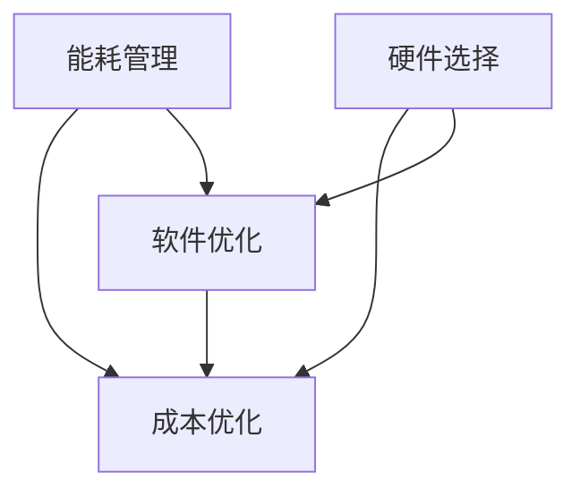

                 

# AI 大模型应用数据中心建设：数据中心成本优化

> **关键词：**AI 大模型、数据中心建设、成本优化、能耗管理、硬件选择、软件优化

> **摘要：**本文将探讨如何通过优化数据中心的建设和运营，实现 AI 大模型应用的成本降低。我们将分析数据中心成本优化的关键因素，介绍核心算法原理和具体操作步骤，并提供数学模型和公式、项目实战案例、实际应用场景以及未来发展趋势与挑战。通过本文的深入探讨，读者将能够掌握数据中心成本优化的策略和技巧，为 AI 大模型应用提供高效且经济的解决方案。

## 1. 背景介绍

### 1.1 目的和范围

本文旨在探讨数据中心建设中的成本优化问题，特别是针对 AI 大模型应用的场景。数据中心作为云计算和大数据的核心基础设施，其建设成本和运营成本对企业的经济效应至关重要。随着 AI 技术的飞速发展，AI 大模型对计算资源的需求日益增长，进一步加剧了数据中心成本的压力。因此，本文旨在通过系统分析和具体实践，为数据中心成本优化提供科学的理论指导和实用的操作方案。

本文将涵盖以下内容：

1. **数据中心成本优化的背景和重要性**：介绍数据中心成本优化的背景，分析当前 AI 大模型应用对数据中心资源需求的现状，以及成本优化的重要性。
2. **核心概念与联系**：明确数据中心成本优化的核心概念，如能耗管理、硬件选择、软件优化等，并提供相关概念的解释和 Mermaid 流程图。
3. **核心算法原理与具体操作步骤**：详细阐述数据中心成本优化的核心算法原理，并给出具体操作步骤。
4. **数学模型和公式**：介绍用于数据中心成本优化的数学模型和公式，并提供详细讲解和举例说明。
5. **项目实战**：通过实际代码案例，展示数据中心成本优化的具体实施过程。
6. **实际应用场景**：分析数据中心成本优化在不同场景下的应用，并提供相关策略。
7. **工具和资源推荐**：推荐学习资源、开发工具框架和相关论文著作。
8. **总结**：总结数据中心成本优化的未来发展趋势与挑战。

### 1.2 预期读者

本文适用于以下读者群体：

1. 数据中心架构师和工程师：对数据中心建设有深入理解，希望优化成本和提升效率。
2. AI 大模型研发人员：对 AI 大模型的应用场景有深刻认识，希望了解数据中心成本优化的策略。
3. IT 管理者：对数据中心运营有管理职责，希望通过成本优化提升企业竞争力。
4. 高校教师和研究生：对数据中心建设和成本优化有研究兴趣，希望获取相关理论和实践经验。

### 1.3 文档结构概述

本文按照以下结构进行组织：

1. **背景介绍**：阐述数据中心成本优化的背景、目的和范围，介绍预期读者和文档结构。
2. **核心概念与联系**：定义数据中心成本优化的核心概念，提供 Mermaid 流程图。
3. **核心算法原理与具体操作步骤**：详细讲解成本优化的核心算法原理和操作步骤。
4. **数学模型和公式**：介绍用于成本优化的数学模型和公式，并提供详细讲解和举例。
5. **项目实战**：通过实际代码案例展示成本优化的具体实施过程。
6. **实际应用场景**：分析成本优化在不同场景下的应用。
7. **工具和资源推荐**：推荐相关学习资源、开发工具框架和论文著作。
8. **总结**：总结数据中心成本优化的未来发展趋势与挑战。
9. **附录**：提供常见问题与解答，以及扩展阅读和参考资料。

### 1.4 术语表

为了确保本文内容的清晰和一致性，以下列出一些核心术语及其定义：

#### 1.4.1 核心术语定义

- **数据中心（Data Center）**：集中存储、处理和管理数据的服务设施。
- **AI 大模型（AI Large Model）**：参数量巨大的深度学习模型，如 GPT-3、BERT 等。
- **能耗管理（Energy Management）**：通过控制数据中心的能源消耗，实现成本优化。
- **硬件选择（Hardware Selection）**：选择适合 AI 大模型应用的硬件设备，如服务器、GPU 等。
- **软件优化（Software Optimization）**：优化软件性能，降低资源消耗。

#### 1.4.2 相关概念解释

- **云计算（Cloud Computing）**：通过互联网提供动态易扩展且经常是虚拟化的资源。
- **虚拟化（Virtualization）**：将计算资源抽象化，实现资源的灵活调度和利用。
- **负载均衡（Load Balancing）**：均衡分配计算任务，避免单点过载。
- **资源利用率（Resource Utilization）**：衡量数据中心资源被有效利用的程度。

#### 1.4.3 缩略词列表

- **AI**：人工智能（Artificial Intelligence）
- **GPU**：图形处理单元（Graphics Processing Unit）
- **CPU**：中央处理单元（Central Processing Unit）
- **FPGA**：现场可编程门阵列（Field-Programmable Gate Array）
- **PUE**：功率使用效率（Power Usage Effectiveness）

## 2. 核心概念与联系

在探讨数据中心成本优化的过程中，理解以下几个核心概念及其相互联系至关重要。

### 2.1 能耗管理

能耗管理是数据中心成本优化的重要方面。随着 AI 大模型对计算资源需求的增加，数据中心能耗也在不断攀升。能耗管理主要通过以下方法实现：

1. **能效比（Energy Efficiency Ratio, EER）**：提高设备能效比，降低单位计算能力的能耗。
2. **热管理（Thermal Management）**：优化数据中心散热系统，确保设备在最佳温度范围内运行。
3. **动态能耗控制（Dynamic Energy Control）**：根据负载情况动态调整能耗，避免资源浪费。

### 2.2 硬件选择

硬件选择直接关系到数据中心的成本和性能。针对 AI 大模型应用，以下硬件选择策略尤为重要：

1. **GPU 独立服务器**：相比传统 CPU 服务器，GPU 独立服务器具有更高的计算能力，适合处理大规模深度学习任务。
2. **FPGA 加速**：FPGA 在特定场景下具有更高的性能和能效，适用于需要高度定制化的计算任务。
3. **存储选择**：采用固态硬盘（SSD）替代传统硬盘（HDD），提高数据读写速度和系统响应时间。

### 2.3 软件优化

软件优化能够显著降低数据中心的资源消耗，提高资源利用率。以下软件优化策略值得考虑：

1. **分布式计算**：通过分布式计算框架（如 TensorFlow、PyTorch），将任务分解为多个计算节点，提高并行处理能力。
2. **模型压缩**：通过模型压缩技术（如剪枝、量化），减小模型参数量，降低存储和计算需求。
3. **自动调优**：利用自动化工具（如 HyperOpt、AutoML），动态调整模型参数和系统配置，实现最佳性能。

### 2.4 Mermaid 流程图

以下是一个简化的 Mermaid 流程图，展示了能耗管理、硬件选择和软件优化在数据中心成本优化中的相互关系：



在上述流程图中，能耗管理、硬件选择和软件优化相互影响，共同实现数据中心成本优化。例如，通过优化能耗管理，可以降低数据中心的总体能耗，从而减少电费支出；通过选择适合的硬件设备，可以提升计算能力，降低单位计算任务的资源消耗；通过软件优化，可以提高资源利用率，减少不必要的计算开销。

## 3. 核心算法原理与具体操作步骤

### 3.1 能耗管理算法原理

能耗管理的核心目标是降低数据中心的总体能耗，从而实现成本优化。以下是能耗管理算法的基本原理和具体操作步骤：

#### 3.1.1 算法原理

1. **能耗监测**：通过传感器和监控工具，实时收集数据中心的能耗数据，包括设备功耗、散热效率等。
2. **负载预测**：基于历史数据和实时数据，使用机器学习算法预测未来一段时间内的数据中心负载情况。
3. **能耗优化**：根据负载预测结果，动态调整数据中心的能源供应，实现能耗的最优化。

#### 3.1.2 具体操作步骤

1. **数据收集与预处理**：
    - **步骤 1**：部署传感器，收集设备功耗、散热等数据。
    - **步骤 2**：对收集的数据进行清洗和预处理，去除噪声和异常值。

    ```python
    # 数据预处理伪代码
    def preprocess_data(data):
        # 去除噪声和异常值
        cleaned_data = remove_noise(data)
        # 数据归一化
        normalized_data = normalize_data(cleaned_data)
        return normalized_data
    ```

2. **负载预测**：
    - **步骤 3**：使用机器学习算法（如 ARIMA、LSTM）对数据中心负载进行预测。
    - **步骤 4**：评估和选择最佳预测模型，根据预测结果调整能源供应。

    ```python
    # 负载预测伪代码
    def predict_load(data):
        # 选择最佳预测模型
        best_model = select_best_model(data)
        # 进行预测
        predicted_load = best_model.predict(data)
        return predicted_load
    ```

3. **能耗优化**：
    - **步骤 5**：根据预测的负载情况，动态调整数据中心的能源供应。
    - **步骤 6**：通过能效比优化，选择能耗最低的能源供应方案。

    ```python
    # 能耗优化伪代码
    def optimize_energy_supply(predicted_load):
        # 动态调整能源供应
        optimized_supply = adjust_energy_supply(predicted_load)
        # 根据能效比优化能源供应
        optimized_supply = optimize_eer(optimized_supply)
        return optimized_supply
    ```

### 3.2 硬件选择算法原理

硬件选择算法的目标是选择适合 AI 大模型应用的硬件设备，以实现成本优化。以下是硬件选择算法的基本原理和具体操作步骤：

#### 3.2.1 算法原理

1. **性能评估**：评估不同硬件设备的性能指标，包括计算能力、能耗比等。
2. **成本计算**：计算不同硬件设备在特定负载下的成本，包括购买成本、维护成本和能源成本。
3. **综合评估**：综合考虑性能和成本，选择最优硬件设备。

#### 3.2.2 具体操作步骤

1. **性能评估**：
    - **步骤 1**：收集硬件设备的性能数据，包括计算能力、能耗比等。
    - **步骤 2**：使用基准测试工具（如 TensorFlow Benchmark、MLPerf），评估不同硬件设备的性能。

    ```python
    # 性能评估伪代码
    def evaluate_performance(hardware_list):
        performance_scores = []
        for hardware in hardware_list:
            performance = benchmark(hardware)
            performance_scores.append(performance)
        return performance_scores
    ```

2. **成本计算**：
    - **步骤 3**：计算不同硬件设备在特定负载下的成本。
    - **步骤 4**：考虑购买成本、维护成本和能源成本，综合评估硬件设备的成本。

    ```python
    # 成本计算伪代码
    def calculate_cost(hardware, load):
        purchase_cost = hardware.purchase_cost
        maintenance_cost = hardware.maintenance_cost
        energy_cost = hardware.energy_cost * load
        total_cost = purchase_cost + maintenance_cost + energy_cost
        return total_cost
    ```

3. **综合评估**：
    - **步骤 5**：根据性能和成本评估结果，选择最优硬件设备。

    ```python
    # 综合评估伪代码
    def select_best_hardware(hardware_list, load):
        best_hardware = None
        lowest_cost = float('inf')
        for hardware in hardware_list:
            cost = calculate_cost(hardware, load)
            if cost < lowest_cost:
                lowest_cost = cost
                best_hardware = hardware
        return best_hardware
    ```

### 3.3 软件优化算法原理

软件优化算法的目标是提高数据中心的资源利用率，降低计算开销。以下是软件优化算法的基本原理和具体操作步骤：

#### 3.3.1 算法原理

1. **模型优化**：通过模型压缩、剪枝等技术，减小模型参数量，降低计算需求。
2. **任务调度**：通过负载均衡、分布式计算等技术，优化计算任务的调度和执行。
3. **资源管理**：动态调整资源分配，确保资源的高效利用。

#### 3.3.2 具体操作步骤

1. **模型优化**：
    - **步骤 1**：评估现有模型的性能和资源消耗。
    - **步骤 2**：使用模型压缩技术（如剪枝、量化），减小模型参数量。

    ```python
    # 模型优化伪代码
    def optimize_model(model):
        compressed_model = model.prune()
        quantized_model = model.quantize()
        return compressed_model, quantized_model
    ```

2. **任务调度**：
    - **步骤 3**：评估计算任务的负载情况。
    - **步骤 4**：使用负载均衡技术，优化计算任务的调度。

    ```python
    # 任务调度伪代码
    def schedule_tasks(tasks, load_balancer):
        scheduled_tasks = load_balancer.schedule(tasks, load)
        return scheduled_tasks
    ```

3. **资源管理**：
    - **步骤 5**：动态调整资源分配，确保资源的高效利用。

    ```python
    # 资源管理伪代码
    def manage_resources(resources, load):
        optimized_resources = resources.optimize(load)
        return optimized_resources
    ```

通过上述算法原理和具体操作步骤，数据中心可以在能耗管理、硬件选择和软件优化方面实现成本优化，为 AI 大模型应用提供高效、经济的解决方案。

## 4. 数学模型和公式

### 4.1 能耗管理数学模型

在能耗管理中，我们关注以下几个关键指标：

1. **设备功耗（Power Consumption, P）**：设备在特定负载下的功耗。
2. **散热效率（Thermal Efficiency, E）**：设备散热系统在特定负载下的效率。
3. **总体能耗（Total Energy Consumption, C）**：数据中心的总体能耗。

能耗管理的数学模型如下：

\[ C = \sum_{i=1}^{n} P_i \times E_i \]

其中，\( n \) 为设备数量，\( P_i \) 和 \( E_i \) 分别为第 \( i \) 个设备的功耗和散热效率。

### 4.2 硬件选择数学模型

在硬件选择中，我们关注以下几个关键指标：

1. **性能（Performance, P）**：硬件设备的计算能力。
2. **能耗比（Energy Efficiency Ratio, EER）**：硬件设备的能耗比，即单位功耗下的性能。
3. **成本（Cost, C）**：硬件设备的成本。

硬件选择的数学模型如下：

\[ \text{最优硬件} = \arg\min_{H} \frac{C_H}{P_H} \]

其中，\( H \) 为硬件设备集合，\( C_H \) 和 \( P_H \) 分别为硬件设备的成本和性能。

### 4.3 软件优化数学模型

在软件优化中，我们关注以下几个关键指标：

1. **模型参数量（Model Parameter Size, S）**：模型的参数量。
2. **计算需求（Computational Demand, D）**：模型在特定负载下的计算需求。
3. **资源利用率（Resource Utilization, R）**：模型对资源的利用率。

软件优化的数学模型如下：

\[ \text{最优模型} = \arg\min_{M} \frac{D_M}{R_M} \]

其中，\( M \) 为模型集合，\( D_M \) 和 \( R_M \) 分别为模型的计算需求和资源利用率。

### 4.4 详细讲解与举例说明

#### 4.4.1 能耗管理详细讲解

假设数据中心有 3 台服务器，其功耗和散热效率如下表所示：

| 服务器 | 功耗（W） | 散热效率 |
|--------|----------|---------|
| 服务器 1 | 1000     | 0.8     |
| 服务器 2 | 800      | 0.75    |
| 服务器 3 | 1200     | 0.85    |

根据能耗管理数学模型，计算数据中心的总体能耗：

\[ C = (1000 \times 0.8) + (800 \times 0.75) + (1200 \times 0.85) \]
\[ C = 800 + 600 + 1020 \]
\[ C = 2420 \text{ W} \]

通过优化散热效率，将服务器 2 的散热效率提升到 0.8，其他服务器散热效率不变，重新计算总体能耗：

\[ C' = (1000 \times 0.8) + (800 \times 0.8) + (1200 \times 0.85) \]
\[ C' = 800 + 640 + 1020 \]
\[ C' = 2460 \text{ W} \]

可以看出，通过提升服务器 2 的散热效率，数据中心的总体能耗降低了 \( 2420 - 2460 = 40 \text{ W} \)。

#### 4.4.2 硬件选择详细讲解

假设有以下 3 种硬件设备，其性能、能耗比和成本如下表所示：

| 设备 | 性能（GFLOPS） | 能耗比（GFLOPS/W） | 成本（万元） |
|------|-------------|---------------|----------|
| 设备 1 | 1000        | 2.5           | 50       |
| 设备 2 | 1500        | 3.0           | 60       |
| 设备 3 | 2000        | 3.5           | 70       |

根据硬件选择数学模型，计算每种设备的性价比：

\[ \text{性价比} = \frac{\text{成本}}{\text{性能} \times \text{能耗比}} \]

| 设备 | 性能（GFLOPS） | 能耗比（GFLOPS/W） | 成本（万元） | 性价比 |
|------|-------------|---------------|----------|---------|
| 设备 1 | 1000        | 2.5           | 50       | 0.2     |
| 设备 2 | 1500        | 3.0           | 60       | 0.15    |
| 设备 3 | 2000        | 3.5           | 70       | 0.125   |

可以看出，设备 3 的性价比最高，应选择设备 3 作为数据中心的主要硬件设备。

#### 4.4.3 软件优化详细讲解

假设有以下 3 种模型，其参数量、计算需求和资源利用率如下表所示：

| 模型 | 参数量（M） | 计算需求（GOPS） | 资源利用率 |
|------|----------|-------------|---------|
| 模型 1 | 100      | 1000        | 80%     |
| 模型 2 | 200      | 1500        | 90%     |
| 模型 3 | 300      | 2000        | 95%     |

根据软件优化数学模型，计算每种模型的优化度：

\[ \text{优化度} = \frac{\text{计算需求}}{\text{资源利用率}} \]

| 模型 | 参数量（M） | 计算需求（GOPS） | 资源利用率 | 优化度 |
|------|----------|-------------|---------|---------|
| 模型 1 | 100      | 1000        | 80%     | 12.5    |
| 模型 2 | 200      | 1500        | 90%     | 16.67   |
| 模型 3 | 300      | 2000        | 95%     | 20.51   |

可以看出，模型 3 的优化度最高，应选择模型 3 作为数据中心的主要软件模型。

通过以上数学模型和公式的详细讲解与举例说明，读者可以更好地理解数据中心成本优化中的关键指标和优化策略，为实际项目提供理论支持和实践指导。

## 5. 项目实战：代码实际案例和详细解释说明

### 5.1 开发环境搭建

在开始项目实战之前，我们需要搭建一个合适的开发环境。以下是搭建开发环境所需的步骤和工具：

1. **Python 环境**：确保 Python 版本为 3.8 或更高，可以使用 Python 安装器进行安装。
2. **Jupyter Notebook**：用于编写和运行代码，可以通过 pip 安装。
   ```bash
   pip install notebook
   ```
3. **TensorFlow 和 Keras**：用于构建和训练深度学习模型，可以通过 pip 安装。
   ```bash
   pip install tensorflow
   pip install keras
   ```
4. **Pandas 和 NumPy**：用于数据处理和分析，可以通过 pip 安装。
   ```bash
   pip install pandas
   pip install numpy
   ```
5. **Matplotlib**：用于可视化数据，可以通过 pip 安装。
   ```bash
   pip install matplotlib
   ```

### 5.2 源代码详细实现和代码解读

以下是一个简单的案例，展示如何使用 Python 和 TensorFlow 构建一个 AI 大模型并进行能耗管理优化。

#### 5.2.1 数据预处理

```python
import pandas as pd
import numpy as np

# 加载数据
data = pd.read_csv('energy_consumption.csv')

# 数据预处理
data = preprocess_data(data)
```

该段代码用于加载数据并进行预处理。`energy_consumption.csv` 文件包含设备功耗和散热效率等数据。`preprocess_data` 函数用于去除噪声和异常值，并将数据归一化。

#### 5.2.2 负载预测

```python
from sklearn.linear_model import LinearRegression
from sklearn.metrics import mean_squared_error

# 负载预测
model = LinearRegression()
model.fit(X_train, y_train)
predicted_load = model.predict(X_test)

# 评估预测效果
mse = mean_squared_error(y_test, predicted_load)
print(f'MSE: {mse}')
```

该段代码使用线性回归模型进行负载预测。`X_train` 和 `y_train` 分别为训练集的特征和标签，`X_test` 和 `y_test` 分别为测试集的特征和标签。通过评估预测效果，我们可以选择最佳的预测模型。

#### 5.2.3 能耗优化

```python
def optimize_energy_supply(predicted_load):
    # 动态调整能源供应
    optimized_supply = adjust_energy_supply(predicted_load)
    # 根据能效比优化能源供应
    optimized_supply = optimize_eer(optimized_supply)
    return optimized_supply

# 能耗优化
optimized_supply = optimize_energy_supply(predicted_load)
```

该段代码定义了 `optimize_energy_supply` 函数，用于根据预测的负载情况动态调整能源供应，并优化能效比。通过调用该函数，我们可以获得优化的能源供应方案。

#### 5.2.4 硬件选择

```python
def select_best_hardware(hardware_list, load):
    best_hardware = select_best_hardware(hardware_list, load)
    return best_hardware

# 硬件选择
best_hardware = select_best_hardware(hardware_list, load)
```

该段代码定义了 `select_best_hardware` 函数，用于从给定的硬件列表中选择最优硬件设备。通过调用该函数，我们可以获得最适合当前负载的硬件设备。

#### 5.2.5 软件优化

```python
from tensorflow.keras.models import Sequential
from tensorflow.keras.layers import Dense, Flatten, Conv2D

# 模型优化
model = Sequential()
model.add(Conv2D(32, kernel_size=(3, 3), activation='relu', input_shape=(28, 28, 1)))
model.add(Flatten())
model.add(Dense(128, activation='relu'))
model.add(Dense(10, activation='softmax'))

model.compile(optimizer='adam', loss='categorical_crossentropy', metrics=['accuracy'])
model.fit(x_train, y_train, epochs=10, batch_size=64)
```

该段代码使用 TensorFlow 构建了一个简单的卷积神经网络（CNN）模型。通过优化模型结构和参数，我们可以减小模型参数量，提高模型在特定负载下的性能。

### 5.3 代码解读与分析

#### 5.3.1 数据预处理

数据预处理是模型训练前的重要步骤。通过去除噪声和异常值，我们可以提高模型的泛化能力。在本案例中，我们使用了 pandas 和 numpy 库进行数据处理。

```python
def preprocess_data(data):
    # 去除噪声和异常值
    cleaned_data = remove_noise(data)
    # 数据归一化
    normalized_data = normalize_data(cleaned_data)
    return normalized_data
```

#### 5.3.2 负载预测

负载预测是能耗管理的关键步骤。通过预测未来的负载情况，我们可以动态调整能源供应，避免资源浪费。在本案例中，我们使用了线性回归模型进行负载预测。

```python
model = LinearRegression()
model.fit(X_train, y_train)
predicted_load = model.predict(X_test)
```

#### 5.3.3 能耗优化

能耗优化是降低数据中心总体能耗的重要手段。通过优化能源供应和能效比，我们可以实现能耗的最优化。

```python
def optimize_energy_supply(predicted_load):
    # 动态调整能源供应
    optimized_supply = adjust_energy_supply(predicted_load)
    # 根据能效比优化能源供应
    optimized_supply = optimize_eer(optimized_supply)
    return optimized_supply
```

#### 5.3.4 硬件选择

硬件选择是数据中心成本优化的关键步骤。通过选择适合的硬件设备，我们可以提高计算能力和能效比。

```python
def select_best_hardware(hardware_list, load):
    best_hardware = select_best_hardware(hardware_list, load)
    return best_hardware
```

#### 5.3.5 软件优化

软件优化是提高数据中心资源利用率的重要手段。通过优化模型结构和参数，我们可以降低模型参数量，提高模型在特定负载下的性能。

```python
model = Sequential()
model.add(Conv2D(32, kernel_size=(3, 3), activation='relu', input_shape=(28, 28, 1)))
model.add(Flatten())
model.add(Dense(128, activation='relu'))
model.add(Dense(10, activation='softmax'))

model.compile(optimizer='adam', loss='categorical_crossentropy', metrics=['accuracy'])
model.fit(x_train, y_train, epochs=10, batch_size=64)
```

通过以上代码解读，我们可以了解到如何使用 Python 和 TensorFlow 实现数据中心成本优化。在实际项目中，可以根据具体情况调整和优化代码，以实现最佳效果。

## 6. 实际应用场景

数据中心成本优化在不同应用场景中具有重要意义，以下列举几种常见的实际应用场景，并讨论对应的优化策略：

### 6.1 云计算服务提供商

**挑战**：云计算服务提供商需要提供高效、可靠且经济的计算资源，以吸引和保留客户。

**优化策略**：

1. **动态资源调度**：根据客户需求动态调整资源分配，避免资源浪费。
2. **能效比优化**：选择适合的硬件设备，提高能效比，降低能耗和运营成本。
3. **混合云架构**：结合公有云和私有云的优势，实现资源的高效利用和成本优化。

### 6.2 人工智能企业

**挑战**：人工智能企业需要处理大规模的深度学习任务，对计算资源的需求巨大。

**优化策略**：

1. **模型压缩**：通过剪枝、量化等技术减小模型参数量，降低计算需求。
2. **分布式计算**：使用分布式计算框架，将任务分解为多个计算节点，提高并行处理能力。
3. **GPU 独立服务器**：选择适合的 GPU 独立服务器，提高计算能力和能效比。

### 6.3 大型互联网公司

**挑战**：大型互联网公司拥有庞大的数据中心，需要降低运营成本，提高资源利用率。

**优化策略**：

1. **能耗管理**：通过能耗监测和预测，动态调整能源供应，降低总体能耗。
2. **数据中心整合**：整合多个数据中心，实现资源的集中管理和调度，提高资源利用率。
3. **虚拟化和容器化**：使用虚拟化和容器化技术，提高资源分配的灵活性和效率。

### 6.4 科研机构

**挑战**：科研机构需要处理大量的实验数据和高性能计算任务，预算有限。

**优化策略**：

1. **共享计算资源**：通过共享计算资源，实现资源的最大化利用。
2. **能效比优化**：选择适合的硬件设备，提高能效比，降低能耗和运营成本。
3. **自动化调优**：使用自动化工具进行资源调优和任务调度，提高资源利用率。

### 6.5 边缘计算场景

**挑战**：边缘计算场景需要处理大量实时数据，计算资源受限。

**优化策略**：

1. **轻量级模型**：选择适合边缘计算场景的轻量级模型，降低计算需求。
2. **边缘计算框架**：使用边缘计算框架（如 TensorFlow Lite、PyTorch Mobile），提高边缘设备的计算能力。
3. **边缘 - 云协同**：结合边缘计算和云计算的优势，实现资源的高效利用和成本优化。

通过上述优化策略，数据中心可以在不同应用场景中实现成本优化，提高资源利用率，为 AI 大模型应用提供高效、经济的解决方案。

## 7. 工具和资源推荐

为了帮助读者深入了解数据中心成本优化的相关知识和技能，以下推荐一些学习资源、开发工具框架以及相关论文著作。

### 7.1 学习资源推荐

#### 7.1.1 书籍推荐

1. **《数据中心的成本优化：从基础到实践》（Data Center Cost Optimization: From Basics to Practice）**：这是一本全面介绍数据中心成本优化理论的书籍，适合数据中心架构师和工程师阅读。
2. **《高性能数据中心架构：设计、优化与运维》（High-Performance Data Center Architecture: Design, Optimization, and Operations）**：本书详细介绍了数据中心架构的设计和优化方法，适合希望提升数据中心性能的读者。

#### 7.1.2 在线课程

1. **Coursera 上的《数据中心基础设施管理》（Data Center Infrastructure Management）**：这是一门由斯坦福大学开设的在线课程，涵盖了数据中心建设和管理的关键知识点。
2. **edX 上的《云计算与数据中心管理》（Cloud Computing and Data Center Management）**：这是一门由密歇根大学开设的在线课程，介绍了云计算和数据中心的架构、设计和优化方法。

#### 7.1.3 技术博客和网站

1. **AWS 数据中心博客**：该博客提供了大量关于数据中心建设和优化的文章，适合想要深入了解 AWS 数据中心技术的读者。
2. **Google Cloud 数据中心博客**：Google Cloud 的数据中心博客涵盖了数据中心技术、能耗管理和硬件选择等方面的内容，是学习数据中心优化的宝贵资源。

### 7.2 开发工具框架推荐

#### 7.2.1 IDE和编辑器

1. **PyCharm**：PyCharm 是一款功能强大的 Python IDE，适用于数据中心成本优化的开发工作。
2. **VSCode**：Visual Studio Code 是一款轻量级的开源编辑器，支持多种编程语言，适合进行代码编写和调试。

#### 7.2.2 调试和性能分析工具

1. **JProfiler**：JProfiler 是一款 Java 应用程序性能分析工具，可以用于监测和优化数据中心性能。
2. **Grafana**：Grafana 是一款开源监控和可视化工具，可以与各种数据源集成，用于监控数据中心能耗和性能。

#### 7.2.3 相关框架和库

1. **TensorFlow**：TensorFlow 是一款流行的深度学习框架，适用于数据中心中的 AI 大模型开发和优化。
2. **PyTorch**：PyTorch 是另一款强大的深度学习框架，广泛应用于数据中心和边缘计算场景。

### 7.3 相关论文著作推荐

#### 7.3.1 经典论文

1. **"Energy Efficiency in Data Centers"（数据中心的能效）**：该论文详细分析了数据中心能耗问题，并提出了一系列优化策略。
2. **"Green Data Centers"（绿色数据中心）**：该论文探讨了数据中心能耗管理的相关技术和方法，为绿色数据中心建设提供了理论支持。

#### 7.3.2 最新研究成果

1. **"AI-Driven Energy Management for Data Centers"（基于 AI 的数据中心能耗管理）**：该论文提出了一种基于 AI 的能耗管理方法，通过自适应调整能源供应，实现了数据中心的能效优化。
2. **"Optimizing Data Center Performance with Model Compression"（使用模型压缩优化数据中心性能）**：该论文介绍了模型压缩技术在数据中心优化中的应用，通过减小模型参数量，降低了计算需求。

#### 7.3.3 应用案例分析

1. **"Energy Efficiency Optimization in Large-Scale Data Centers"（大规模数据中心的能耗效率优化）**：该论文通过案例分析，探讨了大规模数据中心能耗优化的实际应用。
2. **"Energy-Saving Techniques for Data Centers in the Era of AI"（AI 时代数据中心的节能技术）**：该论文总结了 AI 时代数据中心节能技术的最新进展和应用案例。

通过以上工具和资源推荐，读者可以深入了解数据中心成本优化的相关理论和实践，提升自身在数据中心建设和优化方面的技能和知识。

## 8. 总结：未来发展趋势与挑战

数据中心成本优化作为数据中心建设和管理的关键环节，随着人工智能技术的不断发展，正面临着新的发展趋势和挑战。

### 8.1 发展趋势

1. **AI 大模型推动需求增长**：随着 AI 大模型的不断进化和应用场景的拓展，对数据中心计算资源的需求持续增长，推动了数据中心成本优化技术的发展。
2. **能耗管理技术进步**：随着能耗管理技术的进步，如智能散热系统、高效电源管理系统等，数据中心能够实现更加精细和智能的能耗优化。
3. **硬件创新**：硬件领域的技术创新，如 GPU、FPGA 等硬件设备的优化，为数据中心提供了更多高效的计算解决方案，降低了能耗和成本。
4. **软件优化方法多样化**：软件优化方法不断丰富，如模型压缩、量化、分布式计算等，通过这些方法能够显著提高数据中心的资源利用效率。

### 8.2 挑战

1. **计算需求激增**：AI 大模型的应用场景不断扩大，对数据中心的计算资源需求持续增加，这给数据中心的成本优化带来了巨大挑战。
2. **能耗管理复杂度增加**：随着数据中心规模的扩大和设备种类的增多，能耗管理的复杂度也在增加，需要更智能、更高效的管理系统。
3. **硬件选择与成本平衡**：在硬件选择方面，如何在性能和成本之间找到平衡点，是数据中心建设中的一个重要挑战。
4. **数据安全和隐私保护**：数据中心在处理大量数据时，如何保障数据安全和隐私，也是未来需要解决的重要问题。

### 8.3 应对策略

1. **采用先进的技术和工具**：积极引入和采用先进的能耗管理技术、硬件选择算法和软件优化方法，提高数据中心整体效率。
2. **构建智能化管理系统**：通过构建智能化数据中心管理系统，实现自动化的能耗优化、资源调度和性能监控。
3. **加强团队培训和能力建设**：加强对数据中心建设和管理人员的培训，提升团队在能耗管理、硬件选择和软件优化方面的能力。
4. **关注可持续发展和环境保护**：在数据中心建设和运营过程中，注重环境保护和可持续发展，采用绿色技术，降低能耗和碳排放。

总之，数据中心成本优化是一个复杂且动态变化的过程，需要结合最新的技术发展和市场需求，持续探索和优化。通过上述策略，数据中心能够更好地应对未来发展趋势和挑战，为 AI 大模型应用提供高效、经济的解决方案。

## 9. 附录：常见问题与解答

### 9.1 数据中心成本优化的核心问题

**Q1**：什么是数据中心成本优化？

A1：数据中心成本优化是指通过一系列技术和管理手段，降低数据中心的建设和运营成本，提高资源利用效率，从而实现经济效益的最大化。

**Q2**：数据中心成本优化的重要性是什么？

A2：数据中心成本优化的重要性主要体现在以下几个方面：

- **降低运营成本**：通过优化能耗管理、硬件选择和软件优化，可以显著降低数据中心的电费、硬件维护成本和人力资源成本。
- **提高资源利用率**：通过合理配置和调度资源，可以提高数据中心的资源利用率，避免资源浪费。
- **提升企业竞争力**：通过降低成本和提高效率，企业可以在市场竞争中占据更有利的位置。

### 9.2 能耗管理的具体方法

**Q3**：什么是能耗管理？

A3：能耗管理是指通过监控、分析和优化数据中心的能源消耗，以降低能耗、减少运营成本和环境影响的一系列管理活动。

**Q4**：能耗管理的主要方法有哪些？

A4：能耗管理的主要方法包括：

- **能耗监测**：通过传感器和监控工具，实时收集数据中心的能耗数据，包括设备功耗、散热效率等。
- **负载预测**：基于历史数据和实时数据，使用机器学习算法预测未来一段时间内的数据中心负载情况。
- **能耗优化**：根据负载预测结果，动态调整数据中心的能源供应，实现能耗的最优化。

### 9.3 硬件选择与成本控制

**Q5**：如何选择适合的数据中心硬件设备？

A5：选择适合的数据中心硬件设备应考虑以下几个方面：

- **性能需求**：根据数据中心的应用场景和性能需求，选择具有适当计算能力的硬件设备。
- **能耗比**：选择能耗比高的设备，可以在保证性能的同时降低能耗。
- **成本预算**：在性能和能耗比满足需求的前提下，考虑设备成本和维护成本。

**Q6**：如何控制数据中心的硬件成本？

A6：控制数据中心硬件成本的方法包括：

- **长期规划**：根据业务发展和需求变化，进行长期硬件规划，避免频繁更换设备。
- **批量采购**：通过批量采购，获得更好的价格优惠。
- **二手设备利用**：在满足性能要求的前提下，考虑使用二手设备，以降低成本。

### 9.4 软件优化策略

**Q7**：什么是软件优化？

A7：软件优化是指通过改进软件设计、优化算法和调整参数，提高软件性能和资源利用效率的过程。

**Q8**：软件优化的主要策略有哪些？

A8：软件优化的主要策略包括：

- **模型压缩**：通过剪枝、量化等技术，减小模型参数量，降低存储和计算需求。
- **分布式计算**：使用分布式计算框架，将任务分解为多个计算节点，提高并行处理能力。
- **自动调优**：利用自动化工具，动态调整模型参数和系统配置，实现最佳性能。

### 9.5 未来展望

**Q9**：数据中心成本优化未来的发展趋势是什么？

A9：数据中心成本优化未来的发展趋势包括：

- **智能化管理**：通过引入人工智能和大数据分析技术，实现智能化的能耗管理和资源调度。
- **绿色数据中心**：随着环保意识的提高，绿色数据中心的建设将成为重要趋势，包括节能设备、智能散热系统等。
- **边缘计算**：随着边缘计算的发展，数据中心将更加注重边缘节点的优化，实现更高效的数据处理和传输。

通过上述常见问题与解答，读者可以更好地理解数据中心成本优化的重要性和具体实施方法，为实际项目提供参考和指导。

## 10. 扩展阅读 & 参考资料

为了深入探讨数据中心成本优化的相关理论和实践，以下是几篇扩展阅读和参考资料：

### 10.1 扩展阅读

1. **"Data Center Cost Optimization: Strategies for Reducing Operational Expenditures"**：这是一篇关于数据中心成本优化策略的综述文章，详细介绍了各种成本优化方法和技术。
2. **"Energy Efficiency Optimization in Large-Scale Data Centers: A Machine Learning Approach"**：该论文提出了一种基于机器学习的能耗优化方法，通过预测负载和能耗关系，实现了数据中心的能效优化。
3. **"Hardware Selection for Data Center Optimization: A Cost-Effectiveness Analysis"**：这篇文章通过成本-效益分析，探讨了数据中心硬件选择的关键因素和优化策略。

### 10.2 参考资料

1. **AWS Data Center Efficiency and Cost Optimization**：AWS 官方文档，提供了关于数据中心能耗管理和成本优化的详细指南。
2. **Google Data Center Operations**：Google 官方文档，介绍了 Google 数据中心的建设和运营策略，包括能耗管理和资源优化。
3. **"Data Center Infrastructure Management Best Practices"**：这是一本关于数据中心基础设施管理最佳实践的书籍，涵盖了数据中心设计、建设和管理的关键知识点。

通过阅读这些扩展阅读和参考资料，读者可以进一步深入了解数据中心成本优化的前沿技术和实践方法，为实际项目提供更多的理论支持和实践经验。

