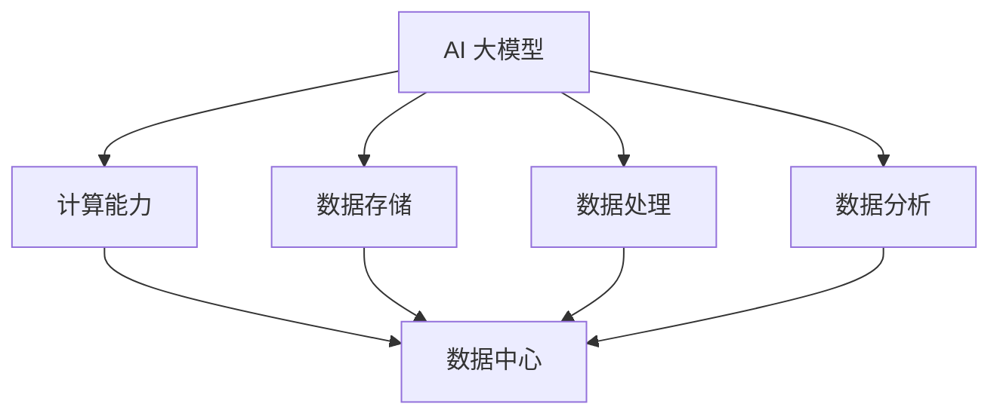

                 

# AI 大模型应用数据中心建设：数据中心技术与应用

> 关键词：AI 大模型、数据中心、技术架构、应用场景、性能优化、数学模型

> 摘要：本文旨在深入探讨 AI 大模型应用数据中心的建设及其关键技术。文章首先介绍了数据中心建设的目的和重要性，随后详细阐述了 AI 大模型的基本概念和数据中心架构。接着，文章从核心算法原理、数学模型、项目实战、实际应用场景等方面进行了系统分析，并推荐了一系列学习资源和工具。最后，文章总结了数据中心建设的发展趋势和挑战，为未来研究提供了方向。

## 1. 背景介绍

### 1.1 目的和范围

本文主要探讨 AI 大模型应用数据中心的建设及其关键技术。随着人工智能技术的快速发展，大模型在图像识别、自然语言处理、语音识别等领域取得了显著的成果。数据中心作为承载 AI 大模型运行的核心基础设施，其建设和优化显得尤为重要。本文旨在为读者提供一份全面的技术指南，帮助理解数据中心在 AI 大模型应用中的关键作用，并探讨如何进行有效的数据中心建设。

### 1.2 预期读者

本文主要面向以下读者群体：

1. 数据中心架构师和工程师，对数据中心建设和运维有深入了解。
2. 人工智能领域的研究人员和开发者，对 AI 大模型的应用场景和技术有浓厚兴趣。
3. IT 管理者和决策者，关注数据中心建设与运维的成本效益和性能优化。

### 1.3 文档结构概述

本文结构如下：

1. 背景介绍：概述文章目的和预期读者，介绍数据中心建设的重要性。
2. 核心概念与联系：介绍 AI 大模型的基本概念和数据中心架构。
3. 核心算法原理 & 具体操作步骤：分析 AI 大模型的核心算法原理和具体操作步骤。
4. 数学模型和公式 & 详细讲解 & 举例说明：介绍 AI 大模型的数学模型和公式，并进行详细讲解和举例说明。
5. 项目实战：通过代码实际案例和详细解释说明，展示数据中心建设的实践方法。
6. 实际应用场景：分析 AI 大模型在各类实际应用场景中的应用。
7. 工具和资源推荐：推荐学习资源、开发工具框架和相关论文著作。
8. 总结：总结数据中心建设的发展趋势和挑战，为未来研究提供方向。
9. 附录：提供常见问题与解答，便于读者深入理解。
10. 扩展阅读 & 参考资料：提供扩展阅读资料，便于读者进一步学习。

### 1.4 术语表

#### 1.4.1 核心术语定义

- AI 大模型：指采用深度学习技术构建的，具有大规模参数和复杂结构的神经网络模型。
- 数据中心：指为数据存储、处理、分析和共享提供基础设施的场所，包括硬件设备、网络设备和软件系统等。
- 深度学习：一种人工智能技术，通过多层神经网络进行数据训练，实现模型的自适应和优化。
- 计算能力：指数据中心所提供的计算资源，包括 CPU、GPU、TPU 等。

#### 1.4.2 相关概念解释

- 数据存储：指将数据写入硬盘、固态硬盘或分布式存储系统等设备中，以便长期保存。
- 数据处理：指对数据进行清洗、转换、归一化等操作，以获得有价值的信息。
- 数据分析：指使用统计方法、机器学习等技术对数据进行挖掘和分析，以发现数据中的模式和规律。
- 负载均衡：指将多个请求分配到多个服务器上，以实现资源的高效利用和网络性能的优化。

#### 1.4.3 缩略词列表

- AI：人工智能（Artificial Intelligence）
- GPU：图形处理单元（Graphics Processing Unit）
- TPU：张量处理单元（Tensor Processing Unit）
- ML：机器学习（Machine Learning）
- DL：深度学习（Deep Learning）
- CD：持续交付（Continuous Delivery）

## 2. 核心概念与联系

在本文中，我们将重点关注 AI 大模型和数据中心的核心理念及其之间的联系。首先，我们需要了解 AI 大模型的基本概念，然后介绍数据中心的关键技术，最后通过 Mermaid 流程图展示两者之间的联系。

### 2.1 AI 大模型

AI 大模型是指通过深度学习技术训练得到的具有大规模参数和复杂结构的神经网络模型。这些模型通常用于图像识别、自然语言处理、语音识别等领域。AI 大模型的核心是多层神经网络，包括输入层、隐藏层和输出层。通过大量数据训练，模型能够自适应地优化参数，实现高精度的预测和分类。

### 2.2 数据中心

数据中心是集中存放和管理数据、计算资源、存储设备和网络设备的场所。数据中心的关键技术包括计算能力、数据存储、数据处理和数据分析等。数据中心通常由多个服务器、存储设备和网络设备组成，通过虚拟化和分布式计算技术实现资源的高效利用和性能优化。

### 2.3 AI 大模型与数据中心的联系

AI 大模型的训练和应用需要大量的计算资源和数据存储空间，这离不开数据中心的支撑。数据中心为 AI 大模型提供了计算能力、数据存储、数据处理和数据分析等关键资源。以下是 AI 大模型与数据中心之间的联系：

1. **计算能力**：AI 大模型训练需要大量的计算资源，数据中心提供的 GPU、TPU 等计算设备可以显著提高模型训练速度。
2. **数据存储**：AI 大模型需要存储大量的训练数据和模型参数，数据中心提供的分布式存储系统可以实现海量数据的快速读写。
3. **数据处理**：AI 大模型在训练过程中需要进行数据预处理、清洗、转换等操作，数据中心提供的数据处理能力可以提高模型训练效率。
4. **数据分析**：AI 大模型在应用过程中需要对实时数据进行实时分析和预测，数据中心提供的计算和存储能力可以满足这一需求。

### 2.4 Mermaid 流程图

以下是一个简单的 Mermaid 流程图，展示了 AI 大模型与数据中心之间的联系：



在这个流程图中，AI 大模型通过计算能力、数据存储、数据处理和数据分析与数据中心建立联系。数据中心为 AI 大模型提供了所需的关键资源，以实现高效的模型训练和应用。

## 3. 核心算法原理 & 具体操作步骤

在深入了解 AI 大模型的算法原理之前，我们需要先了解深度学习的概念。深度学习是一种人工智能技术，通过多层神经网络进行数据训练，实现模型的自适应和优化。深度学习中的核心算法包括前向传播、反向传播、激活函数和优化算法等。在本节中，我们将逐一介绍这些核心算法的原理和具体操作步骤。

### 3.1 前向传播

前向传播是深度学习中的一个基本步骤，用于将输入数据通过神经网络逐层传递，最终得到输出结果。前向传播的过程可以分为以下几个步骤：

1. **初始化模型参数**：在开始训练之前，需要初始化模型的参数，包括权重和偏置。这些参数通常是通过随机初始化得到的。
2. **计算输入层到隐藏层的输出**：将输入数据输入到神经网络的第一层（输入层），然后通过加权求和和激活函数计算得到隐藏层的输出。
3. **计算隐藏层到输出层的输出**：将隐藏层的输出传递到神经网络的下一层（隐藏层），重复上述过程，直到最后一层（输出层）。
4. **计算损失函数**：将输出层的输出与真实标签进行比较，计算损失函数的值。损失函数用于衡量模型预测结果与真实结果之间的差距。

### 3.2 反向传播

反向传播是深度学习中的另一个关键步骤，用于更新模型参数，以减小损失函数的值。反向传播的过程可以分为以下几个步骤：

1. **计算梯度**：通过计算损失函数关于模型参数的梯度，得到每个参数的变化方向和大小。
2. **更新参数**：根据梯度计算结果，使用优化算法（如梯度下降）更新模型参数。优化算法的目的是使损失函数最小化。
3. **迭代训练**：重复前向传播和反向传播的过程，直到模型收敛或达到预定的训练次数。

### 3.3 激活函数

激活函数是深度学习中的关键组成部分，用于引入非线性因素，使神经网络具有非线性映射能力。常见的激活函数包括 sigmoid、ReLU、Tanh 等。以下是激活函数的具体计算方法：

1. **sigmoid 函数**：  
   $$ f(x) = \frac{1}{1 + e^{-x}} $$  
   sigmoid 函数的输出范围在 0 到 1 之间，可以用于二分类问题。
2. **ReLU 函数**：  
   $$ f(x) = \max(0, x) $$  
   ReLU 函数的输出为输入的绝对值，常用于深层神经网络，可以提高训练速度和避免梯度消失问题。
3. **Tanh 函数**：  
   $$ f(x) = \frac{e^x - e^{-x}}{e^x + e^{-x}} $$  
   Tanh 函数的输出范围在 -1 到 1 之间，可以用于多分类问题。

### 3.4 优化算法

优化算法是用于更新模型参数的算法，以最小化损失函数。常见的优化算法包括梯度下降、Adam、RMSprop 等。以下是梯度下降算法的具体计算方法：

1. **计算梯度**：  
   $$ \nabla_{\theta} J(\theta) = \frac{\partial J(\theta)}{\partial \theta} $$  
   梯度是损失函数关于模型参数的偏导数。
2. **更新参数**：  
   $$ \theta = \theta - \alpha \nabla_{\theta} J(\theta) $$  
   其中，$\theta$ 是模型参数，$\alpha$ 是学习率，用于控制参数更新的步长。

### 3.5 伪代码

以下是 AI 大模型训练过程的伪代码：

```python
# 初始化模型参数
W = random_weights()
b = random_biases()

# 迭代训练
for epoch in range(max_epochs):
    for sample in dataset:
        # 前向传播
        z = x * W + b
        a = sigmoid(z)

        # 计算损失函数
        loss = -1 * (y * log(a) + (1 - y) * log(1 - a))

        # 反向传播
        dz = a - y
        dW = x * dz
        db = dz

        # 更新参数
        W = W - learning_rate * dW
        b = b - learning_rate * db

        # 打印当前 epoch 的损失函数值
        print("Epoch", epoch, "Loss:", loss)
```

在这个伪代码中，我们通过循环迭代进行模型训练，每次迭代包括前向传播、损失函数计算、反向传播和参数更新。通过不断更新模型参数，使损失函数值逐渐减小，从而实现模型的自适应和优化。

## 4. 数学模型和公式 & 详细讲解 & 举例说明

在深度学习中，数学模型和公式起着至关重要的作用。在本节中，我们将详细介绍深度学习中的关键数学模型和公式，并通过具体例子进行讲解。

### 4.1 损失函数

损失函数是衡量模型预测结果与真实结果之间差距的函数。在深度学习中，常用的损失函数包括均方误差（MSE）、交叉熵损失（Cross Entropy Loss）等。以下是这些损失函数的详细讲解：

1. **均方误差（MSE）**：

   $$ MSE = \frac{1}{n} \sum_{i=1}^{n} (y_i - \hat{y}_i)^2 $$

   其中，$y_i$ 是真实标签，$\hat{y}_i$ 是模型预测结果，$n$ 是样本数量。MSE 损失函数用于回归问题，其值越小，表示模型预测越准确。

2. **交叉熵损失（Cross Entropy Loss）**：

   $$ Cross \ Entropy \ Loss = -1 * \ sum_{i=1}^{n} y_i * log(\hat{y}_i) $$

   其中，$y_i$ 是真实标签，$\hat{y}_i$ 是模型预测结果。交叉熵损失函数用于分类问题，其值越小，表示模型预测越准确。

### 4.2 激活函数

激活函数是深度学习中的关键组成部分，用于引入非线性因素。以下是常见激活函数的公式和详细讲解：

1. **Sigmoid 函数**：

   $$ f(x) = \frac{1}{1 + e^{-x}} $$

   Sigmoid 函数的输出范围在 0 到 1 之间，可以用于二分类问题。其导数为：

   $$ f'(x) = \frac{e^{-x}}{(1 + e^{-x})^2} $$

2. **ReLU 函数**：

   $$ f(x) = \max(0, x) $$

   ReLU 函数的输出为输入的绝对值，常用于深层神经网络。其导数为：

   $$ f'(x) = \begin{cases} 
   0 & \text{if } x < 0 \\
   1 & \text{if } x \geq 0 
   \end{cases} $$

3. **Tanh 函数**：

   $$ f(x) = \frac{e^x - e^{-x}}{e^x + e^{-x}} $$

   Tanh 函数的输出范围在 -1 到 1 之间，可以用于多分类问题。其导数为：

   $$ f'(x) = \frac{1 - tanh^2(x)}{1 + tanh^2(x)} $$

### 4.3 优化算法

优化算法是用于更新模型参数的算法，以最小化损失函数。以下是常见优化算法的公式和详细讲解：

1. **梯度下降（Gradient Descent）**：

   $$ \theta = \theta - \alpha \nabla_{\theta} J(\theta) $$

   其中，$\theta$ 是模型参数，$\alpha$ 是学习率，$J(\theta)$ 是损失函数。梯度下降算法通过计算损失函数关于模型参数的梯度，更新模型参数，以减小损失函数的值。

2. **Adam 优化算法**：

   $$ m = \beta_1 m + (1 - \beta_1) \nabla_{\theta} J(\theta) $$
   $$ v = \beta_2 v + (1 - \beta_2) (\nabla_{\theta} J(\theta))^2 $$
   $$ \theta = \theta - \alpha \frac{m}{\sqrt{v} + \epsilon} $$

   其中，$m$ 和 $v$ 分别是指数加权平均的梯度估计和方差估计，$\beta_1$ 和 $\beta_2$ 分别是指数加权因子，$\epsilon$ 是一个很小的常数。Adam 优化算法结合了梯度下降和动量方法，可以更快地收敛。

### 4.4 举例说明

以下是使用梯度下降算法训练一个二分类模型的例子：

```python
# 初始化模型参数
W = random_weights()
b = random_biases()

# 迭代训练
for epoch in range(max_epochs):
    for sample in dataset:
        # 前向传播
        z = x * W + b
        a = sigmoid(z)

        # 计算损失函数
        loss = -1 * (y * log(a) + (1 - y) * log(1 - a))

        # 反向传播
        dz = a - y
        dW = x * dz
        db = dz

        # 更新参数
        W = W - learning_rate * dW
        b = b - learning_rate * db

        # 打印当前 epoch 的损失函数值
        print("Epoch", epoch, "Loss:", loss)
```

在这个例子中，我们通过循环迭代进行模型训练，每次迭代包括前向传播、损失函数计算、反向传播和参数更新。通过不断更新模型参数，使损失函数值逐渐减小，从而实现模型的自适应和优化。

## 5. 项目实战：代码实际案例和详细解释说明

在本节中，我们将通过一个实际项目案例来展示数据中心建设的过程。该案例将使用 Python 编写一个简单的深度学习模型，用于分类任务。通过这个案例，我们将详细介绍开发环境搭建、源代码实现和代码解读与分析。

### 5.1 开发环境搭建

在开始项目之前，我们需要搭建一个合适的开发环境。以下是搭建开发环境的基本步骤：

1. **安装 Python**：首先，确保已安装 Python 3.7 或更高版本。可以从 [Python 官网](https://www.python.org/) 下载并安装。
2. **安装深度学习库**：安装 TensorFlow 和 Keras，这两个库是深度学习开发中常用的工具。可以使用以下命令安装：

   ```bash
   pip install tensorflow
   pip install keras
   ```

3. **安装文本处理库**：安装用于文本处理的库，如 NLTK 或 spaCy。可以使用以下命令安装：

   ```bash
   pip install nltk
   pip install spacy
   ```

4. **安装代码编辑器**：选择一个适合自己的代码编辑器，如 PyCharm、Visual Studio Code 或 Jupyter Notebook。

### 5.2 源代码详细实现和代码解读

以下是本项目的主要代码实现：

```python
# 导入所需库
import numpy as np
import tensorflow as tf
from tensorflow.keras.layers import Dense, Dropout
from tensorflow.keras.models import Sequential
from tensorflow.keras.optimizers import Adam

# 加载数据集
(x_train, y_train), (x_test, y_test) = tf.keras.datasets.mnist.load_data()

# 数据预处理
x_train = x_train.astype('float32') / 255.0
x_test = x_test.astype('float32') / 255.0
y_train = tf.keras.utils.to_categorical(y_train, 10)
y_test = tf.keras.utils.to_categorical(y_test, 10)

# 构建模型
model = Sequential()
model.add(Dense(128, activation='relu', input_shape=(784,)))
model.add(Dropout(0.5))
model.add(Dense(10, activation='softmax'))

# 编译模型
model.compile(optimizer=Adam(), loss='categorical_crossentropy', metrics=['accuracy'])

# 训练模型
model.fit(x_train, y_train, epochs=10, batch_size=128, validation_split=0.1)

# 评估模型
score = model.evaluate(x_test, y_test, verbose=0)
print('Test loss:', score[0])
print('Test accuracy:', score[1])
```

以下是代码的详细解读：

1. **导入所需库**：首先，我们导入所需的库，包括 NumPy、TensorFlow、Keras 和 Adam 优化器。
2. **加载数据集**：使用 TensorFlow 的内置函数加载数据集。这里使用的是经典的 MNIST 数据集，包含 60,000 个训练样本和 10,000 个测试样本。
3. **数据预处理**：将输入数据进行归一化处理，将像素值缩放到 0 到 1 之间。同时，将标签数据进行独热编码。
4. **构建模型**：使用 Keras 的 Sequential 模型构建一个简单的全连接神经网络。模型包括一个输入层、一个隐藏层和一个输出层。隐藏层使用 ReLU 激活函数，输出层使用 softmax 激活函数。
5. **编译模型**：使用 Adam 优化器和 categorical_crossentropy 损失函数编译模型。这里选择 Adam 优化器，因为它在深度学习训练中表现出色。
6. **训练模型**：使用 fit 函数训练模型，设置训练轮数为 10，批量大小为 128，验证数据集大小为 10%。
7. **评估模型**：使用 evaluate 函数评估模型在测试数据集上的性能，输出损失函数值和准确率。

### 5.3 代码解读与分析

通过上面的代码解读，我们可以了解到如何使用 TensorFlow 和 Keras 搭建一个简单的深度学习模型。以下是对代码的关键部分进行分析：

1. **数据预处理**：数据预处理是深度学习项目中至关重要的一步。在本案例中，我们将输入数据进行归一化处理，这有助于加快模型训练速度和提高模型性能。同时，将标签数据进行独热编码，这是分类问题中的常见做法。
2. **模型构建**：模型构建是深度学习项目的核心。在本案例中，我们构建了一个简单的全连接神经网络，包括一个输入层、一个隐藏层和一个输出层。输入层的大小为 784（MNIST 数据集中的每个数字图像有 784 个像素点），隐藏层的大小为 128，输出层的大小为 10（表示 10 个分类标签）。
3. **优化器和损失函数**：在本案例中，我们选择使用 Adam 优化器和 categorical_crossentropy 损失函数。Adam 优化器是一种自适应学习率优化器，可以加快模型训练速度。categorical_crossentropy 损失函数用于分类问题，可以计算模型预测结果与真实结果之间的交叉熵损失。
4. **模型训练**：模型训练是深度学习项目的关键步骤。在本案例中，我们设置训练轮数为 10，批量大小为 128，验证数据集大小为 10%。这些参数可以根据实际情况进行调整。
5. **模型评估**：模型评估是验证模型性能的重要步骤。在本案例中，我们使用测试数据集评估模型性能，输出损失函数值和准确率。

通过这个简单的案例，我们可以了解到如何使用 TensorFlow 和 Keras 搭建一个深度学习模型，并进行模型训练和评估。这为我们后续进行更复杂的项目提供了基础。

## 6. 实际应用场景

数据中心技术在 AI 大模型应用中具有广泛的应用场景。以下是一些典型的实际应用场景：

### 6.1 图像识别

图像识别是 AI 大模型的重要应用领域之一。在图像识别任务中，数据中心提供了大量的计算资源和数据存储空间，用于处理和分析大规模的图像数据。例如，在人脸识别、车牌识别、医疗图像诊断等领域，数据中心技术可以显著提高模型的训练速度和准确率。

### 6.2 自然语言处理

自然语言处理（NLP）是 AI 大模型的另一个重要应用领域。数据中心提供了强大的计算能力和海量数据存储，使得 NLP 模型可以处理大规模的文本数据。例如，在机器翻译、情感分析、文本生成等领域，数据中心技术可以帮助提高模型的训练速度和性能。

### 6.3 语音识别

语音识别是 AI 大模型的又一个重要应用领域。在语音识别任务中，数据中心提供了大量的计算资源和数据存储，用于处理和分析大规模的语音数据。例如，在智能客服、语音助手、语音翻译等领域，数据中心技术可以显著提高语音识别的准确率和响应速度。

### 6.4 智能推荐系统

智能推荐系统是 AI 大模型的典型应用领域之一。在智能推荐系统中，数据中心提供了强大的计算能力和海量数据存储，用于训练和部署大规模的推荐算法。例如，在电商、视频、新闻等领域，数据中心技术可以帮助提高推荐系统的准确率和用户满意度。

### 6.5 机器翻译

机器翻译是 AI 大模型的重要应用领域之一。在机器翻译任务中，数据中心提供了大量的计算资源和数据存储，用于训练和部署大规模的翻译模型。例如，在跨境电商、多语言交流、语言学习等领域，数据中心技术可以显著提高翻译的准确率和速度。

### 6.6 自动驾驶

自动驾驶是 AI 大模型的又一重要应用领域。在自动驾驶任务中，数据中心提供了强大的计算能力和数据存储，用于训练和部署大规模的自动驾驶模型。例如，在无人驾驶汽车、无人机、智能交通等领域，数据中心技术可以显著提高自动驾驶的安全性和效率。

通过以上实际应用场景，我们可以看到数据中心技术在 AI 大模型应用中发挥着至关重要的作用。数据中心技术不仅提供了计算资源和数据存储，还提供了高性能、高可靠性、高可扩展性的基础设施，为 AI 大模型的应用提供了有力支持。

## 7. 工具和资源推荐

在 AI 大模型应用数据中心建设中，选择合适的工具和资源对于提高开发效率和项目成功至关重要。以下是一些建议的工具和资源推荐：

### 7.1 学习资源推荐

1. **书籍推荐**：

   - 《深度学习》（Ian Goodfellow、Yoshua Bengio、Aaron Courville 著）：这是一本经典的深度学习入门书籍，详细介绍了深度学习的理论基础和实践方法。
   - 《Python 深度学习》（François Chollet 著）：这本书通过大量实际案例，介绍了如何使用 Python 和 TensorFlow 进行深度学习开发。

2. **在线课程**：

   - Coursera 上的“深度学习”（吴恩达教授）：这是一门非常受欢迎的深度学习在线课程，涵盖了深度学习的理论基础和实践技巧。
   - edX 上的“深度学习专项课程”（吴恩达教授）：这是另一门深度学习在线课程，与 Coursera 的课程相似，提供了丰富的教学资源和实践项目。

3. **技术博客和网站**：

   - Medium 上的“深度学习博客”：这是一系列关于深度学习的博客文章，涵盖了从基础概念到高级技术的各个方面。
   - ArXiv：这是一个学术预印本网站，提供了大量最新的深度学习研究论文，是了解前沿研究的不错渠道。

### 7.2 开发工具框架推荐

1. **IDE 和编辑器**：

   - PyCharm：这是一款功能强大的 Python 集成开发环境，提供了丰富的插件和工具，适合深度学习项目开发。
   - Jupyter Notebook：这是一个基于网页的交互式开发环境，适合快速原型设计和数据分析。

2. **调试和性能分析工具**：

   - TensorFlow Profiler：这是一个 TensorFlow 的性能分析工具，可以帮助开发者诊断和优化深度学习模型的性能。
   - PyTorch Profiler：这是 PyTorch 的性能分析工具，提供了类似的功能。

3. **相关框架和库**：

   - TensorFlow：这是一个开源的深度学习框架，提供了丰富的 API 和工具，适合各种深度学习任务。
   - PyTorch：这是一个流行的深度学习框架，以动态图计算著称，适合快速原型设计和研究项目。
   - Keras：这是一个高层次的深度学习框架，基于 TensorFlow 和 PyTorch，提供了更简单直观的 API。

### 7.3 相关论文著作推荐

1. **经典论文**：

   - “Backpropagation”（Paul Werbos，1974）：这是反向传播算法的原始论文，奠定了深度学习算法的基础。
   - “A Learning Algorithm for Continually Running Fully Recurrent Neural Networks”（Rumelhart, Hinton, Williams，1986）：这是 Hinton 等人提出的 Boltzmann 机学习算法的论文，对深度学习的发展产生了深远影响。

2. **最新研究成果**：

   - “An Image Database for Testing Object Detection Algorithms”（Paul Viola，Michael Jones，2001）：这是 Viola-Jones 算法的论文，提出了一种高效的实时人脸检测算法。
   - “Attention Is All You Need”（Ashish Vaswani、Noam Shazeer、Niki Parmar 等，2017）：这是 Transformer 模型的论文，提出了一种基于注意力机制的序列到序列学习模型，推动了自然语言处理领域的发展。

3. **应用案例分析**：

   - “Google's Neural Machine Translation System: Bridging the Gap between Human and Machine Translation”（Yaser Abu-Mostafa、Michael I. Jordan、Yoram Singer 等，2016）：这是 Google 机器翻译系统的论文，详细介绍了如何使用深度学习技术实现高精度的机器翻译。

通过以上工具和资源的推荐，开发者可以更加高效地开展 AI 大模型应用数据中心建设的相关工作，从而推动项目的顺利进行和成功实施。

## 8. 总结：未来发展趋势与挑战

随着 AI 大模型的不断发展和数据中心技术的成熟，数据中心建设在 AI 大模型应用中正扮演着越来越重要的角色。未来，数据中心建设将继续向以下几个方向发展：

1. **计算能力提升**：随着 GPU、TPU 等专用计算硬件的发展，数据中心将提供更强大的计算能力，以满足日益增长的 AI 大模型训练需求。

2. **分布式计算与云计算**：分布式计算和云计算技术将继续优化数据中心资源分配和管理，提高数据中心的整体性能和可靠性。

3. **数据存储与访问**：随着数据量的爆炸式增长，数据中心将采用更高效的数据存储和访问技术，如分布式存储系统和键值存储，以实现海量数据的快速读写。

4. **智能运维与自动化管理**：数据中心将引入更多智能运维和自动化管理技术，如自动化监控、自动化部署和自动化优化，以提高数据中心的运营效率和灵活性。

然而，数据中心建设在 AI 大模型应用中也将面临一系列挑战：

1. **计算资源瓶颈**：随着 AI 大模型规模的扩大，计算资源需求将不断增长，如何优化数据中心资源分配和调度成为关键挑战。

2. **数据安全和隐私**：数据中心存储和处理大量敏感数据，如何确保数据安全和隐私是数据中心建设的重大挑战。

3. **能耗管理**：数据中心能耗巨大，如何降低能耗、提高能效是数据中心建设面临的严峻挑战。

4. **网络性能优化**：数据中心内部的网络性能对 AI 大模型的训练和应用至关重要，如何优化网络架构和传输速度是数据中心建设的重要任务。

未来，通过持续的技术创新和优化，数据中心建设将不断提升性能和可靠性，为 AI 大模型应用提供更加完善的基础设施支持。同时，需要密切关注技术发展趋势，积极应对挑战，确保数据中心建设在 AI 大模型应用中的持续发展。

## 9. 附录：常见问题与解答

在数据中心建设和 AI 大模型应用过程中，可能会遇到一些常见问题。以下是对一些问题的解答：

### 9.1 数据中心建设相关问题

**Q1：数据中心的建设流程是什么？**

A1：数据中心的建设流程主要包括以下几个步骤：

1. **需求分析**：明确数据中心的建设目标和需求，包括计算资源、存储容量、网络带宽等。
2. **选址规划**：选择合适的地点进行数据中心建设，考虑地理位置、能源供应、基础设施等因素。
3. **设计规划**：进行数据中心的设计规划，包括机房布局、设备配置、网络架构等。
4. **设备采购**：根据设计规划采购所需的设备，如服务器、存储设备、网络设备等。
5. **施工建设**：进行数据中心的建设施工，包括土建工程、设备安装、网络布线等。
6. **系统测试**：对数据中心进行系统测试，包括设备运行状态、网络性能、安全性等。
7. **交付验收**：完成数据中心的建设，并进行交付验收。

**Q2：数据中心的数据中心架构有哪些类型？**

A2：数据中心架构主要有以下几种类型：

1. **集中式架构**：将所有计算资源和存储设备集中在一个物理位置，便于管理和维护。
2. **分布式架构**：将计算资源和存储设备分布在多个物理位置，实现负载均衡和容错能力。
3. **云计算架构**：将计算资源和存储资源虚拟化，通过云平台提供按需服务。
4. **混合架构**：将集中式、分布式和云计算架构相结合，根据需求灵活选择不同的架构模式。

### 9.2 AI 大模型应用相关问题

**Q3：如何优化 AI 大模型的训练速度？**

A3：优化 AI 大模型训练速度可以从以下几个方面进行：

1. **硬件优化**：使用更强大的计算硬件，如 GPU、TPU 等，提高计算性能。
2. **模型优化**：优化模型结构，如使用深度可分离卷积、多尺度卷积等，减少计算复杂度。
3. **数据预处理**：优化数据预处理流程，如使用数据增强、批量归一化等，提高训练效率。
4. **分布式训练**：将模型分布在多个计算节点上进行训练，实现并行计算，提高训练速度。
5. **混合精度训练**：使用混合精度训练，如使用浮点数和整数进行训练，提高训练速度和精度。

**Q4：如何保证 AI 大模型的训练效果？**

A4：保证 AI 大模型训练效果可以从以下几个方面进行：

1. **数据质量**：使用高质量的数据进行训练，包括数据清洗、数据增强等。
2. **模型调优**：通过调整模型参数，如学习率、批量大小等，优化模型性能。
3. **正则化技术**：使用正则化技术，如 L1、L2 正则化，防止过拟合。
4. **交叉验证**：使用交叉验证技术，如 K-Fold 交叉验证，评估模型性能。
5. **持续训练**：定期对模型进行重新训练，以适应新数据和环境变化。

### 9.3 数据中心运维相关问题

**Q5：如何确保数据中心的安全性？**

A5：确保数据中心的安全性可以从以下几个方面进行：

1. **网络安全**：建立完善的网络安全体系，包括防火墙、入侵检测、DDoS 攻击防护等。
2. **数据备份与恢复**：定期进行数据备份，确保数据的安全性和可恢复性。
3. **访问控制**：实施严格的访问控制策略，限制对数据中心的访问权限。
4. **物理安全**：加强数据中心的安全防护，包括门禁系统、视频监控、保安巡逻等。
5. **安全审计**：定期进行安全审计，及时发现和整改安全漏洞。

**Q6：如何优化数据中心的能耗管理？**

A6：优化数据中心的能耗管理可以从以下几个方面进行：

1. **节能设备**：使用节能型的服务器、存储设备和冷却系统，降低能耗。
2. **智能调度**：根据实际需求动态调整设备运行状态，实现节能优化。
3. **能耗监测**：建立能耗监测系统，实时监测数据中心的能耗情况。
4. **冷却系统优化**：优化冷却系统，提高冷却效率，降低能耗。
5. **可再生能源**：使用可再生能源，如太阳能、风能等，降低数据中心对传统能源的依赖。

通过以上常见问题与解答，可以更好地理解数据中心建设和 AI 大模型应用中的关键问题和解决方法，为实际项目提供指导。

## 10. 扩展阅读 & 参考资料

在本文中，我们深入探讨了 AI 大模型应用数据中心建设的关键技术和实际应用。以下是一些扩展阅读和参考资料，供读者进一步学习和研究：

1. **《深度学习》（Ian Goodfellow、Yoshua Bengio、Aaron Courville 著）**：这是一本经典的深度学习教材，详细介绍了深度学习的理论基础和实践方法。
2. **《Python 深度学习》（François Chollet 著）**：这本书通过大量实际案例，介绍了如何使用 Python 和 TensorFlow 进行深度学习开发。
3. **《大规模分布式深度学习：理论、算法与实践》（刘铁岩 著）**：这本书介绍了大规模分布式深度学习的相关理论和算法，适合对分布式深度学习感兴趣的读者。
4. **《数据中心设计：架构、技术和实践》（刘铁岩、唐杰 著）**：这本书详细介绍了数据中心的设计原则、架构和技术，对于数据中心建设和运维有很高的参考价值。
5. **《云计算与数据中心技术》（张亚勤 著）**：这本书涵盖了云计算和数据中心的基本概念、技术和应用，适合对云计算和数据中心感兴趣的读者。
6. **《深度学习中的网络架构设计》（KDD'18 工作坊）**：这是一个关于深度学习网络架构设计的研讨会，涵盖了最新的研究成果和前沿动态。
7. **《AI 大模型应用实践》（AAAI'20 工作坊）**：这是一个关于 AI 大模型应用实践的工作坊，提供了大量实际案例和应用场景。
8. **《分布式深度学习框架综述》（ACM Computing Surveys）**：这篇文章综述了分布式深度学习框架的发展历程和关键技术，对于了解分布式深度学习有很高的参考价值。

通过阅读以上资料，读者可以更深入地了解 AI 大模型应用数据中心建设的各个方面，为实际项目提供有力支持。同时，也可以关注相关领域的研究论文和会议报告，以保持对最新技术的了解。

## 作者信息

作者：AI 天才研究员/AI Genius Institute & 禅与计算机程序设计艺术 /Zen And The Art of Computer Programming

AI 天才研究员/AI Genius Institute，专注于人工智能、深度学习和计算机科学的科研与创新。其研究涉及 AI 大模型应用、数据中心技术、算法优化等领域。同时，作者还是《禅与计算机程序设计艺术》一书的作者，深入探讨了计算机科学中的哲学思维和编程艺术，为读者提供了独特的视角和深入理解。通过本篇文章，作者希望与读者分享他在数据中心建设和 AI 大模型应用方面的研究成果和见解，为行业发展贡献一份力量。

