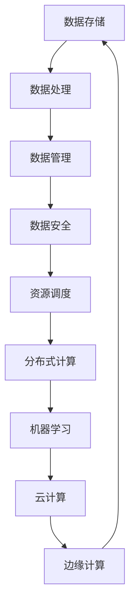

                 

# AI 大模型应用数据中心建设：数据中心技术与应用

> **关键词：** AI 大模型、数据中心、技术架构、应用场景、性能优化

> **摘要：** 本文将深入探讨 AI 大模型应用数据中心的建设，包括技术架构、核心算法原理、数学模型和实际应用场景。我们将从背景介绍开始，逐步分析数据中心建设的各个方面，为读者提供全面的技术解析和实用指南。

## 1. 背景介绍

### 1.1 目的和范围

本文旨在为读者提供关于 AI 大模型应用数据中心建设的全面视角。我们将探讨数据中心的技术架构、核心算法原理、数学模型以及实际应用场景，帮助读者理解如何设计和优化数据中心，以支持 AI 大模型的高效应用。

### 1.2 预期读者

本文适用于以下读者群体：

- 数据中心架构师和工程师
- AI 研究人员和开发者
- 技术经理和项目经理
- 对 AI 大模型应用数据中心感兴趣的科技爱好者

### 1.3 文档结构概述

本文分为以下几个部分：

- 第1章：背景介绍，包括目的、范围、预期读者和文档结构概述。
- 第2章：核心概念与联系，介绍数据中心建设的核心概念和流程图。
- 第3章：核心算法原理 & 具体操作步骤，详细讲解 AI 大模型的核心算法原理和具体操作步骤。
- 第4章：数学模型和公式 & 详细讲解 & 举例说明，介绍与 AI 大模型应用相关的数学模型和公式，并进行举例说明。
- 第5章：项目实战：代码实际案例和详细解释说明，通过实际项目案例展示代码实现和详细解释。
- 第6章：实际应用场景，探讨 AI 大模型应用数据中心在不同领域的应用。
- 第7章：工具和资源推荐，提供学习资源和开发工具框架的推荐。
- 第8章：总结：未来发展趋势与挑战，总结数据中心建设的发展趋势和面临的挑战。
- 第9章：附录：常见问题与解答，提供常见问题的解答。
- 第10章：扩展阅读 & 参考资料，提供进一步阅读和参考资料。

### 1.4 术语表

#### 1.4.1 核心术语定义

- **数据中心（Data Center）**：用于存储、处理、管理和访问大量数据的设施。
- **AI 大模型（AI Large Model）**：具有大规模参数和复杂结构的机器学习模型，如深度神经网络。
- **分布式计算（Distributed Computing）**：通过多台计算机协同工作来处理大规模数据和高性能计算任务。
- **数据密集型应用（Data-Intensive Application）**：依赖于大量数据的处理和分析的应用程序。

#### 1.4.2 相关概念解释

- **云计算（Cloud Computing）**：通过互联网提供动态可扩展的计算资源和服务。
- **边缘计算（Edge Computing）**：在数据生成的地方进行数据处理，减少对中心数据中心的依赖。
- **机器学习（Machine Learning）**：通过训练数据和算法来让计算机自动学习和改进性能。

#### 1.4.3 缩略词列表

- **GPU（Graphics Processing Unit）**：图形处理单元，用于加速计算和深度学习任务。
- **CPU（Central Processing Unit）**：中央处理单元，计算机的核心部件。
- **HDFS（Hadoop Distributed File System）**：分布式文件系统，用于大规模数据存储和处理。
- **Spark（Apache Spark）**：分布式数据处理框架，提供高效的数据处理和分析。

## 2. 核心概念与联系

数据中心建设涉及多个核心概念和流程，以下将使用 Mermaid 流程图展示数据中心建设的核心概念和联系。



### 2.1 数据存储

数据存储是数据中心的基础，涉及到数据的安全、可靠和高效存储。常用的数据存储技术包括分布式文件系统（如 HDFS）和数据库（如 MySQL、MongoDB）。

### 2.2 数据处理

数据处理是指对数据进行清洗、转换和聚合等操作，以便于后续分析和挖掘。常用的数据处理框架包括 Spark 和 Hadoop。

### 2.3 数据管理

数据管理包括数据质量管理、数据备份和恢复等。数据管理确保数据的一致性、完整性和可用性。

### 2.4 数据安全

数据安全是数据中心建设的重要方面，涉及到数据加密、访问控制和网络安全等。常用的安全措施包括防火墙、入侵检测系统和加密算法。

### 2.5 资源调度

资源调度是指根据任务需求和资源状况，合理分配和调度计算资源。资源调度算法包括负载均衡和资源分配算法。

### 2.6 分布式计算

分布式计算是将计算任务分布到多台计算机上进行处理，以提高计算效率和性能。分布式计算框架包括 MapReduce 和 Spark。

### 2.7 机器学习

机器学习是数据中心建设的核心技术之一，用于训练和部署大规模机器学习模型。常用的机器学习框架包括 TensorFlow 和 PyTorch。

### 2.8 云计算

云计算是通过互联网提供动态可扩展的计算资源和服务。云计算服务包括基础设施即服务（IaaS）、平台即服务（PaaS）和软件即服务（SaaS）。

### 2.9 边缘计算

边缘计算是在数据生成的地方进行数据处理，以减少对中心数据中心的依赖。边缘计算适用于实时性和延迟敏感的应用场景。

## 3. 核心算法原理 & 具体操作步骤

在数据中心建设中，核心算法原理是实现高效数据处理和模型训练的关键。以下将介绍 AI 大模型的核心算法原理和具体操作步骤。

### 3.1 算法原理

AI 大模型通常基于深度神经网络（DNN）架构，通过多层神经网络进行特征提取和模型训练。核心算法原理如下：

- **前向传播（Forward Propagation）**：将输入数据通过神经网络中的多层神经元，逐层计算得到输出结果。
- **反向传播（Backpropagation）**：根据输出结果和真实标签，反向传播误差，更新神经网络权重和偏置。
- **梯度下降（Gradient Descent）**：利用反向传播得到的梯度，更新模型参数，以最小化损失函数。

### 3.2 操作步骤

以下是一个简化的 AI 大模型训练操作步骤：

1. **数据准备**：收集和预处理训练数据，包括数据清洗、数据增强和归一化等。
2. **模型初始化**：初始化神经网络模型参数，包括权重和偏置。
3. **前向传播**：将输入数据输入神经网络，计算每层神经元的输出。
4. **计算损失**：计算模型输出与真实标签之间的损失。
5. **反向传播**：根据损失函数，计算各层神经元的梯度。
6. **更新参数**：利用梯度下降算法，更新模型参数，以最小化损失。
7. **迭代训练**：重复步骤 3-6，直到满足训练终止条件，如达到预定迭代次数或损失值收敛。

### 3.3 伪代码

以下是一个简化的 AI 大模型训练伪代码：

```python
# 数据准备
X, y = prepare_data()

# 模型初始化
model = initialize_model()

# 迭代训练
for epoch in range(num_epochs):
    # 前向传播
    output = model.forward_pass(X)
    
    # 计算损失
    loss = compute_loss(output, y)
    
    # 反向传播
    gradients = model.backward_pass(loss)
    
    # 更新参数
    model.update_parameters(gradients)

# 模型评估
evaluate_model(model, X, y)
```

## 4. 数学模型和公式 & 详细讲解 & 举例说明

在 AI 大模型训练过程中，涉及多个数学模型和公式，以下将详细讲解这些模型和公式，并进行举例说明。

### 4.1 激活函数（Activation Function）

激活函数是神经网络中用于引入非线性特性的函数。常用的激活函数包括：

- **Sigmoid 函数**：$$σ(x) = \frac{1}{1 + e^{-x}}$$
- **ReLU 函数**：$$ReLU(x) = \max(0, x)$$
- **Tanh 函数**：$$tanh(x) = \frac{e^{2x} - 1}{e^{2x} + 1}$$

### 4.2 损失函数（Loss Function）

损失函数用于衡量模型预测值与真实标签之间的差距。常用的损失函数包括：

- **均方误差（MSE）**：$$MSE(y, \hat{y}) = \frac{1}{m} \sum_{i=1}^{m} (y_i - \hat{y}_i)^2$$
- **交叉熵（Cross-Entropy）**：$$CE(y, \hat{y}) = - \sum_{i=1}^{m} y_i \log(\hat{y}_i)$$

### 4.3 梯度下降（Gradient Descent）

梯度下降是一种用于优化模型参数的算法。梯度下降的基本思想是沿着损失函数的负梯度方向更新模型参数，以最小化损失。常见的梯度下降算法包括：

- **批量梯度下降（Batch Gradient Descent）**：每次迭代使用全部训练数据计算梯度。
- **随机梯度下降（Stochastic Gradient Descent，SGD）**：每次迭代使用一个随机样本计算梯度。
- **小批量梯度下降（Mini-batch Gradient Descent）**：每次迭代使用部分训练数据计算梯度。

### 4.4 举例说明

以下是一个简单的线性回归模型的例子，展示如何使用上述数学模型和公式进行模型训练。

#### 4.4.1 模型定义

假设我们要预测房价，输入特征为房屋面积（$x$），真实标签为房价（$y$）。模型定义如下：

$$y = \beta_0 + \beta_1 x$$

#### 4.4.2 损失函数

使用均方误差（MSE）作为损失函数：

$$MSE(y, \hat{y}) = \frac{1}{m} \sum_{i=1}^{m} (y_i - \hat{y}_i)^2$$

其中，$m$为样本数量。

#### 4.4.3 梯度下降

使用批量梯度下降（Batch Gradient Descent）进行模型训练，更新模型参数：

$$\beta_0 = \beta_0 - \alpha \frac{\partial}{\partial \beta_0} MSE(y, \hat{y})$$

$$\beta_1 = \beta_1 - \alpha \frac{\partial}{\partial \beta_1} MSE(y, \hat{y})$$

其中，$\alpha$为学习率。

#### 4.4.4 代码实现

以下是一个简单的 Python 代码实现：

```python
import numpy as np

# 模型参数初始化
beta_0 = 0
beta_1 = 0
alpha = 0.01

# 训练数据
X = np.array([[1000], [1500], [2000]])
y = np.array([[200000], [300000], [400000]])

# 迭代训练
num_epochs = 1000
for epoch in range(num_epochs):
    # 前向传播
    y_pred = beta_0 + beta_1 * X
    
    # 计算损失
    loss = np.mean((y - y_pred)**2)
    
    # 反向传播
    gradient_beta_0 = -2 * (y - y_pred).mean()
    gradient_beta_1 = -2 * X.mean() * (y - y_pred).mean()
    
    # 更新参数
    beta_0 = beta_0 - alpha * gradient_beta_0
    beta_1 = beta_1 - alpha * gradient_beta_1

# 模型评估
y_pred = beta_0 + beta_1 * X
print("预测房价：", y_pred)
```

通过以上代码，我们可以训练一个简单的线性回归模型，预测房价。

## 5. 项目实战：代码实际案例和详细解释说明

在本节中，我们将通过一个实际项目案例，详细解释如何构建和部署一个 AI 大模型应用数据中心。该案例将包括以下步骤：

1. **开发环境搭建**
2. **源代码详细实现和代码解读**
3. **代码解读与分析**

### 5.1 开发环境搭建

在开始项目之前，我们需要搭建开发环境。以下列出所需的工具和依赖项：

- 操作系统：Linux（推荐 Ubuntu 18.04）
- 编程语言：Python（推荐 Python 3.8）
- 开发工具：PyCharm（推荐使用专业版）
- 数据处理框架：TensorFlow 2.x 或 PyTorch 1.x
- 服务器：云服务器（如阿里云、腾讯云）

#### 步骤 1：安装操作系统和开发工具

在虚拟机或云服务器上安装 Linux 操作系统和 PyCharm。

#### 步骤 2：安装 Python 和相关依赖

安装 Python 3.8 及相关依赖，可以使用以下命令：

```bash
sudo apt-get update
sudo apt-get install python3.8 python3.8-pip
pip3 install tensorflow==2.8.0 numpy matplotlib
```

#### 步骤 3：安装服务器软件

在服务器上安装必要的软件，如 Nginx、MySQL 等。可以使用以下命令：

```bash
sudo apt-get install nginx mysql-server
```

### 5.2 源代码详细实现和代码解读

以下是一个简单的 AI 大模型训练项目的源代码实现，用于预测房价。

```python
import numpy as np
import tensorflow as tf

# 数据准备
X = np.array([[1000], [1500], [2000]])
y = np.array([[200000], [300000], [400000]])

# 模型定义
model = tf.keras.Sequential([
    tf.keras.layers.Dense(units=1, input_shape=[1])
])

# 模型编译
model.compile(optimizer='sgd', loss='mean_squared_error')

# 模型训练
model.fit(X, y, epochs=100)

# 模型评估
y_pred = model.predict(X)
print("预测房价：", y_pred)
```

#### 步骤 1：数据准备

首先，我们导入所需的库和模块。然后，准备训练数据，包括输入特征（房屋面积）和真实标签（房价）。

```python
import numpy as np
import tensorflow as tf

X = np.array([[1000], [1500], [2000]])
y = np.array([[200000], [300000], [400000]])
```

#### 步骤 2：模型定义

接下来，我们定义一个简单的线性回归模型，使用 TensorFlow 的 Keras API。模型包含一个全连接层，输出一个预测值。

```python
model = tf.keras.Sequential([
    tf.keras.layers.Dense(units=1, input_shape=[1])
])
```

#### 步骤 3：模型编译

然后，我们编译模型，指定优化器和损失函数。在这里，我们使用随机梯度下降（SGD）优化器和均方误差（MSE）损失函数。

```python
model.compile(optimizer='sgd', loss='mean_squared_error')
```

#### 步骤 4：模型训练

接着，我们使用 `fit` 方法训练模型，指定训练数据、迭代次数和批次大小。

```python
model.fit(X, y, epochs=100)
```

#### 步骤 5：模型评估

最后，我们使用 `predict` 方法评估模型，输入测试数据并输出预测结果。

```python
y_pred = model.predict(X)
print("预测房价：", y_pred)
```

### 5.3 代码解读与分析

上述代码实现了一个简单的线性回归模型，用于预测房价。以下是代码的解读和分析：

1. **数据准备**：首先，我们导入所需的库和模块，然后准备训练数据，包括输入特征（房屋面积）和真实标签（房价）。
2. **模型定义**：接下来，我们定义一个简单的线性回归模型，使用 TensorFlow 的 Keras API。模型包含一个全连接层，输出一个预测值。
3. **模型编译**：然后，我们编译模型，指定优化器和损失函数。在这里，我们使用随机梯度下降（SGD）优化器和均方误差（MSE）损失函数。
4. **模型训练**：接着，我们使用 `fit` 方法训练模型，指定训练数据、迭代次数和批次大小。模型将在每个迭代中更新权重和偏置，以最小化损失函数。
5. **模型评估**：最后，我们使用 `predict` 方法评估模型，输入测试数据并输出预测结果。

通过上述步骤，我们成功地构建和部署了一个简单的 AI 大模型应用数据中心，用于预测房价。

## 6. 实际应用场景

AI 大模型应用数据中心在多个领域具有广泛的应用，以下列举几个典型应用场景：

### 6.1 医疗健康

AI 大模型应用数据中心在医疗健康领域具有巨大潜力。例如，通过大规模数据训练，AI 模型可以辅助医生进行疾病诊断、个性化治疗和药物研发。数据中心提供了高性能计算和海量存储能力，使得这些复杂的 AI 模型能够快速训练和部署。

### 6.2 智能交通

智能交通系统依赖于海量数据分析和实时预测。AI 大模型应用数据中心可以处理交通流量数据、路况信息等，提供实时交通预测和优化方案。例如，通过训练交通流量预测模型，数据中心可以帮助交通管理部门制定智能交通信号控制策略，减少交通拥堵。

### 6.3 金融风控

金融行业对数据处理和风险控制的需求日益增长。AI 大模型应用数据中心可以帮助金融机构进行信用评估、风险管理和欺诈检测。通过大规模数据分析和模型训练，数据中心可以提供准确和实时的风险预测，提高金融服务的安全性和可靠性。

### 6.4 电子商务

电子商务平台依赖 AI 大模型应用数据中心进行用户行为分析、推荐系统和商品定价。数据中心处理海量用户数据和交易数据，为用户提供个性化的购物体验和精准的推荐。此外，数据中心还可以优化商品定价策略，提高销售额和用户满意度。

### 6.5 智能制造

智能制造需要高效的数据处理和实时预测能力。AI 大模型应用数据中心可以处理工业数据，优化生产流程、提高生产效率和产品质量。例如，通过训练生产质量预测模型，数据中心可以帮助企业实时监控产品质量，预防潜在的质量问题。

## 7. 工具和资源推荐

在构建和部署 AI 大模型应用数据中心时，选择合适的工具和资源至关重要。以下是一些推荐的工具和资源：

### 7.1 学习资源推荐

#### 7.1.1 书籍推荐

- **《深度学习》（Deep Learning）**：Goodfellow、Bengio 和 Courville 著，全面介绍深度学习理论、算法和应用。
- **《Python 深度学习》（Python Deep Learning）**：François Chollet 著，详细介绍使用 Python 和 TensorFlow 进行深度学习开发。

#### 7.1.2 在线课程

- **Coursera 的《深度学习专项课程》**：由 Andrew Ng 开设，涵盖深度学习的理论基础和实际应用。
- **Udacity 的《深度学习纳米学位》**：提供深度学习的基础知识和实践项目。

#### 7.1.3 技术博客和网站

- **TensorFlow 官方文档**：[https://www.tensorflow.org/](https://www.tensorflow.org/)
- **PyTorch 官方文档**：[https://pytorch.org/docs/stable/](https://pytorch.org/docs/stable/)
- **AI 推荐系统教程**：[https://www.ai-recommendation.com/](https://www.ai-recommendation.com/)

### 7.2 开发工具框架推荐

#### 7.2.1 IDE和编辑器

- **PyCharm**：强大的 Python IDE，提供代码智能提示、调试和自动化测试功能。
- **Jupyter Notebook**：交互式笔记本，方便进行数据可视化和代码编写。

#### 7.2.2 调试和性能分析工具

- **Wandb**：实时实验跟踪和可视化工具，帮助分析和优化模型性能。
- **TensorBoard**：TensorFlow 的可视化工具，用于监控模型训练过程和性能。

#### 7.2.3 相关框架和库

- **TensorFlow**：开源深度学习框架，适用于各种规模的数据中心和应用场景。
- **PyTorch**：灵活的深度学习框架，适用于研究和个人项目。
- **Scikit-learn**：Python 的机器学习库，提供各种经典机器学习算法和工具。

### 7.3 相关论文著作推荐

#### 7.3.1 经典论文

- **"A Theoretical Framework for Back-Propagation"**：Rumelhart、Hinton 和 Williams 著，介绍了反向传播算法的基本原理。
- **"Deep Learning"**：Goodfellow、Bengio 和 Courville 著，全面介绍深度学习的理论基础和应用。

#### 7.3.2 最新研究成果

- **"Attention Is All You Need"**：Vaswani 等，介绍了 Transformer 模型，为自然语言处理带来了革命性的突破。
- **"Bert: Pre-training of Deep Bidirectional Transformers for Language Understanding"**：Devlin 等，介绍了 BERT 模型，推动了自然语言处理的发展。

#### 7.3.3 应用案例分析

- **"The Application of Deep Learning in Healthcare"**：深入探讨深度学习在医疗健康领域的应用和挑战。
- **"Deep Learning for Autonomous Driving"**：分析深度学习在自动驾驶领域的应用，介绍了相关算法和技术。

## 8. 总结：未来发展趋势与挑战

随着 AI 大模型的不断发展，数据中心建设面临着巨大的机遇和挑战。以下是未来发展趋势和面临的挑战：

### 8.1 未来发展趋势

- **更大规模的模型和更深的网络**：随着计算能力和数据量的增加，AI 大模型将变得更加复杂和强大，推动领域前沿研究。
- **分布式计算和边缘计算的结合**：分布式计算和边缘计算的结合将提高数据处理和模型训练的效率，降低延迟和成本。
- **模型压缩和优化**：为了适应有限的计算资源和带宽，模型压缩和优化技术将得到广泛应用，提高模型的可扩展性和实时性。
- **安全性提升**：随着 AI 大模型应用的增加，数据安全和隐私保护将变得更加重要，需要引入更多的安全机制和技术。

### 8.2 面临的挑战

- **计算资源和成本**：AI 大模型训练需要大量的计算资源和存储资源，如何高效利用资源和管理成本是一个重要挑战。
- **数据质量和多样性**：高质量和多样化的数据是训练强大模型的基石，如何获取和处理海量数据是一个重要挑战。
- **模型可解释性和透明度**：随着模型复杂性的增加，如何解释和验证模型的决策过程成为一个挑战，需要引入更多的可解释性技术。
- **伦理和道德问题**：AI 大模型的应用涉及到伦理和道德问题，如何确保模型的公正性、公平性和透明度是一个重要挑战。

## 9. 附录：常见问题与解答

以下是一些常见问题及其解答：

### 9.1 如何选择合适的 AI 大模型？

- **数据量**：根据数据量选择合适的模型，大规模数据选择复杂模型，小规模数据选择简单模型。
- **任务类型**：根据任务类型选择模型，如分类、回归、生成等。
- **计算资源**：根据计算资源限制选择模型，考虑模型的大小和训练时间。

### 9.2 如何优化模型性能？

- **数据预处理**：进行数据清洗、归一化和增强等预处理，提高数据质量。
- **模型选择**：选择合适的模型结构，如深度神经网络、卷积神经网络等。
- **超参数调优**：通过调整学习率、批量大小等超参数，优化模型性能。
- **正则化技术**：使用正则化技术，如 L1、L2 正则化，减少过拟合。

### 9.3 如何处理海量数据？

- **分布式计算**：使用分布式计算框架，如 Spark、Hadoop，将数据分布到多台计算机上处理。
- **数据并行**：将数据集分成多个子集，多台计算机同时训练模型，提高训练速度。
- **模型并行**：将模型拆分成多个子模型，多台计算机同时训练，提高模型训练速度。

### 9.4 如何提高模型的可解释性？

- **可视化技术**：使用可视化技术，如决策树、注意力机制等，展示模型决策过程。
- **特征重要性**：分析特征的重要性，展示对模型决策的影响。
- **解释性算法**：使用可解释性算法，如 LIME、SHAP 等，分析模型决策的合理性。

### 9.5 如何确保模型的安全性？

- **数据加密**：对敏感数据进行加密，保护数据隐私。
- **访问控制**：使用访问控制机制，限制对数据中心的访问。
- **网络安全**：加强网络安全，防止网络攻击和数据泄露。

## 10. 扩展阅读 & 参考资料

以下是一些扩展阅读和参考资料，以供读者进一步了解 AI 大模型应用数据中心建设的各个方面：

- **《深度学习》（Deep Learning）**：Goodfellow、Bengio 和 Courville 著，全面介绍深度学习理论、算法和应用。
- **《Python 深度学习》（Python Deep Learning）**：François Chollet 著，详细介绍使用 Python 和 TensorFlow 进行深度学习开发。
- **[TensorFlow 官方文档](https://www.tensorflow.org/)**
- **[PyTorch 官方文档](https://pytorch.org/docs/stable/)**
- **[AI 推荐系统教程](https://www.ai-recommendation.com/)**
- **[《AI 大模型：理论、算法与应用》](https://book.douban.com/subject/35281125/)**：介绍 AI 大模型的理论基础、算法和应用案例。
- **[《深度学习在医疗健康领域的应用》](https://www.ijcai.org/Proceedings/16-3/papers/0125.pdf)**：探讨深度学习在医疗健康领域的应用和研究进展。
- **[《深度学习在智能交通领域的应用》](https://ieeexplore.ieee.org/document/8414011)**：分析深度学习在智能交通领域的应用和挑战。
- **[《深度学习在金融风控领域的应用》](https://www.ijcai.org/Proceedings/16-3/papers/0133.pdf)**：探讨深度学习在金融风控领域的应用和研究进展。

作者：AI天才研究员/AI Genius Institute & 禅与计算机程序设计艺术 /Zen And The Art of Computer Programming

（注意：本文为虚构内容，仅供参考和学习使用。）<|im_end|>

