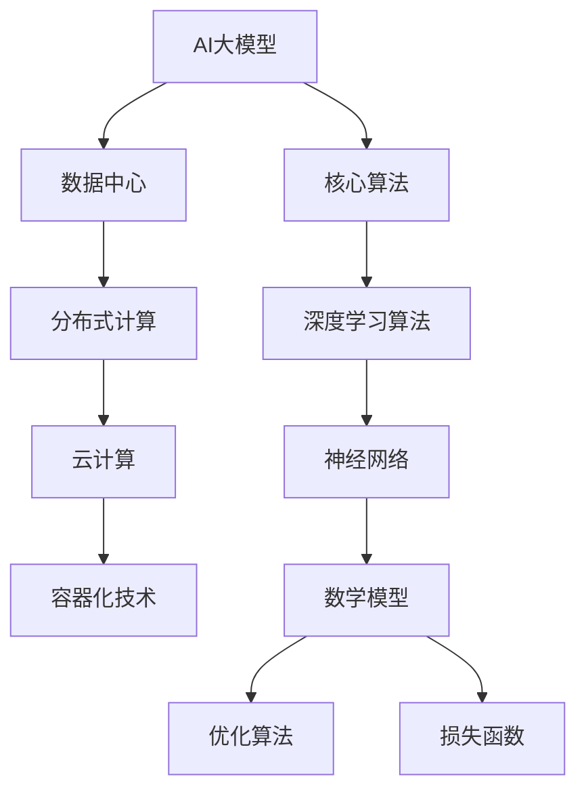

                 

# AI 大模型应用数据中心建设：数据中心技术创新

> **关键词：AI大模型、数据中心、技术创新、架构设计、性能优化**
>
> **摘要：本文深入探讨了AI大模型应用数据中心的建设过程，从背景介绍、核心概念、算法原理、数学模型、项目实战、应用场景、工具推荐等方面，全面阐述了数据中心在AI大模型应用中的关键技术与创新。**

## 1. 背景介绍

### 1.1 目的和范围

本文的目的是探讨如何建设高效、可靠的AI大模型应用数据中心，并分析其中涉及的关键技术。文章将涵盖数据中心的设计原则、架构规划、核心算法原理、数学模型以及实际应用场景等。通过深入分析，帮助读者理解数据中心在AI大模型应用中的重要作用，并为相关领域的研究与实践提供参考。

### 1.2 预期读者

本文适合对数据中心建设、AI大模型应用以及相关技术有一定了解的读者。包括数据中心工程师、AI研究人员、软件开发人员、系统架构师等，旨在为他们在实际工作中提供有价值的指导和借鉴。

### 1.3 文档结构概述

本文分为十个部分，具体如下：

1. 背景介绍：包括文章目的、预期读者和文档结构概述。
2. 核心概念与联系：介绍AI大模型、数据中心及相关概念，并提供流程图展示。
3. 核心算法原理 & 具体操作步骤：详细讲解AI大模型的训练与推理算法。
4. 数学模型和公式 & 详细讲解 & 举例说明：介绍与AI大模型相关的数学模型和公式。
5. 项目实战：提供实际的代码实现案例和详细解释。
6. 实际应用场景：探讨AI大模型在数据中心应用中的各种场景。
7. 工具和资源推荐：推荐相关学习资源、开发工具和论文著作。
8. 总结：未来发展趋势与挑战。
9. 附录：常见问题与解答。
10. 扩展阅读 & 参考资料：提供进一步阅读的建议和参考文献。

### 1.4 术语表

#### 1.4.1 核心术语定义

- **AI大模型**：指具有数十亿至数千亿参数的深度神经网络模型，如GPT、BERT等。
- **数据中心**：指用于存储、处理和分发数据的服务器集群设施。
- **架构设计**：指数据中心硬件和软件的布局、连接和配置。
- **性能优化**：指提升数据中心性能，如计算能力、存储速度和功耗优化。

#### 1.4.2 相关概念解释

- **分布式计算**：指将计算任务分布在多个计算机上进行处理，以提高效率。
- **云计算**：指通过互联网提供动态易扩展的虚拟化资源。
- **容器化技术**：指将应用程序及其依赖项打包在轻量级容器中，便于部署和管理。

#### 1.4.3 缩略词列表

- **AI**：人工智能
- **GPU**：图形处理单元
- **TPU**：张量处理单元
- **DL**：深度学习
- **HPC**：高性能计算

## 2. 核心概念与联系

在探讨AI大模型应用数据中心的建设之前，有必要明确一些核心概念和它们之间的联系。以下是一个简化的Mermaid流程图，展示了AI大模型、数据中心、核心算法和数学模型之间的关系：



### 2.1 AI大模型

AI大模型是指具有数十亿至数千亿参数的深度神经网络模型，如GPT、BERT等。这些模型通过大量数据训练，能够实现高度复杂的任务，如自然语言处理、计算机视觉等。AI大模型的训练与推理过程对数据中心性能有很高的要求。

### 2.2 数据中心

数据中心是存储、处理和分发数据的服务器集群设施。它为AI大模型的训练与推理提供计算资源和存储空间。数据中心的设计与架构对性能优化、可靠性、安全性等方面至关重要。

### 2.3 分布式计算

分布式计算是将计算任务分布在多个计算机上进行处理的一种技术。在数据中心中，分布式计算可以提高AI大模型训练和推理的效率，减少单点故障的风险。

### 2.4 云计算

云计算是通过互联网提供动态易扩展的虚拟化资源。数据中心可以利用云计算技术，实现资源的弹性扩展和高效利用，降低运维成本。

### 2.5 容器化技术

容器化技术是将应用程序及其依赖项打包在轻量级容器中，便于部署和管理。在数据中心中，容器化技术可以简化应用程序的部署，提高资源利用率。

### 2.6 核心算法

核心算法是AI大模型训练和推理的基础。深度学习算法、神经网络和数学模型是核心算法的重要组成部分。它们共同决定了AI大模型的表现和性能。

### 2.7 数学模型

数学模型是描述AI大模型训练和推理过程的数学框架。优化算法、损失函数等数学模型在训练过程中起着关键作用，影响着模型的收敛速度和性能。

## 3. 核心算法原理 & 具体操作步骤

### 3.1 深度学习算法

深度学习算法是AI大模型的核心算法，主要包括以下步骤：

#### 3.1.1 数据预处理

- **数据清洗**：去除噪声和异常值，提高数据质量。
- **数据归一化**：将数据转换为标准化的范围，如[0, 1]。
- **数据增强**：通过随机裁剪、旋转、翻转等方式增加数据多样性。

#### 3.1.2 构建神经网络

- **选择神经网络架构**：如卷积神经网络（CNN）、循环神经网络（RNN）、Transformer等。
- **初始化参数**：为神经网络中的权重和偏置初始化值。

#### 3.1.3 前向传播

- **输入数据**：将预处理后的数据输入神经网络。
- **计算输出**：通过神经网络层逐层计算，得到模型的预测输出。

#### 3.1.4 计算损失

- **计算损失函数**：如均方误差（MSE）、交叉熵等。
- **计算梯度**：使用反向传播算法计算损失函数关于模型参数的梯度。

#### 3.1.5 更新参数

- **选择优化算法**：如随机梯度下降（SGD）、Adam等。
- **更新参数**：根据梯度信息调整模型参数，以最小化损失函数。

### 3.2 反向传播算法

反向传播算法是深度学习训练过程中的关键步骤，用于计算损失函数关于模型参数的梯度。以下是反向传播算法的伪代码：

```python
for each layer from last to first:
    delta = (delta * (1 - sigmoid(output))) * weights[layer]
    gradient = delta / size_of_data
    weights[layer] -= learning_rate * gradient
```

### 3.3 优化算法

优化算法用于更新模型参数，以最小化损失函数。以下是几种常见的优化算法：

#### 3.3.1 随机梯度下降（SGD）

- **更新规则**：`weights -= learning_rate * gradient`
- **优点**：简单易实现，计算效率高。
- **缺点**：收敛速度慢，容易陷入局部最优。

#### 3.3.2 Adam算法

- **更新规则**：`weights -= learning_rate * (m/beta1) + (lambda/beta2) * (1 - beta2^t)`
  其中，m和v分别为一阶和二阶矩估计，beta1和beta2分别为一阶和二阶矩的衰减率。
- **优点**：自适应步长调整，收敛速度快。
- **缺点**：计算复杂度较高。

## 4. 数学模型和公式 & 详细讲解 & 举例说明

### 4.1 优化算法

优化算法是训练AI大模型的关键，以下介绍几种常用的优化算法及其公式。

#### 4.1.1 随机梯度下降（SGD）

$$
w_{t+1} = w_{t} - \alpha \cdot \nabla_w J(w)
$$

其中，$w_t$为第$t$次迭代时的参数，$\alpha$为学习率，$\nabla_w J(w)$为损失函数关于参数的梯度。

#### 4.1.2 Adam算法

$$
m_t = \beta_1 m_{t-1} + (1 - \beta_1) \cdot \nabla_w J(w)
$$

$$
v_t = \beta_2 v_{t-1} + (1 - \beta_2) \cdot (\nabla_w J(w))^2
$$

$$
w_{t+1} = w_{t} - \frac{\alpha}{\sqrt{1 - \beta_2^t}(1 - \beta_1^t)} \cdot \left( m_t + \lambda \cdot (1 - \beta_2^t) \right)
$$

其中，$m_t$和$v_t$分别为一阶和二阶矩估计，$\beta_1$和$\beta_2$分别为一阶和二阶矩的衰减率，$\lambda$为正则化参数。

### 4.2 损失函数

损失函数用于评估模型预测值与真实值之间的差异。以下介绍几种常用的损失函数。

#### 4.2.1 均方误差（MSE）

$$
J = \frac{1}{n} \sum_{i=1}^{n} (y_i - \hat{y}_i)^2
$$

其中，$y_i$为真实值，$\hat{y}_i$为预测值，$n$为样本数量。

#### 4.2.2 交叉熵（Cross-Entropy）

$$
J = -\frac{1}{n} \sum_{i=1}^{n} y_i \cdot \log(\hat{y}_i)
$$

其中，$y_i$为真实值，$\hat{y}_i$为预测值，$n$为样本数量。

### 4.3 举例说明

假设有一个二分类问题，真实值为$y = [1, 0, 1, 0]$，预测值为$\hat{y} = [0.6, 0.4, 0.7, 0.3]$。使用交叉熵损失函数计算损失：

$$
J = -\frac{1}{4} \sum_{i=1}^{4} y_i \cdot \log(\hat{y}_i) = -\frac{1}{4} \cdot (1 \cdot \log(0.6) + 0 \cdot \log(0.4) + 1 \cdot \log(0.7) + 0 \cdot \log(0.3))
$$

$$
J = -\frac{1}{4} \cdot (\log(0.6) + \log(0.7)) \approx 0.26
$$

## 5. 项目实战：代码实际案例和详细解释说明

### 5.1 开发环境搭建

为了演示AI大模型在数据中心的应用，我们将使用Python和TensorFlow框架搭建一个简单的神经网络，实现一个简单的分类任务。以下是开发环境的搭建步骤：

1. 安装Python（推荐版本3.8及以上）
2. 安装TensorFlow：`pip install tensorflow`
3. 安装NumPy、Matplotlib等辅助库：`pip install numpy matplotlib`

### 5.2 源代码详细实现和代码解读

以下是一个简单的神经网络实现，用于对鸢尾花数据集进行分类：

```python
import tensorflow as tf
import numpy as np
import matplotlib.pyplot as plt

# 数据预处理
iris_data = np.load('iris_data.npy')
X, y = iris_data[:, :-1], iris_data[:, -1]

# 切分训练集和测试集
train_size = int(0.8 * len(X))
X_train, X_test = X[:train_size], X[train_size:]
y_train, y_test = y[:train_size], y[train_size:]

# 构建神经网络
model = tf.keras.Sequential([
    tf.keras.layers.Dense(64, activation='relu', input_shape=(4,)),
    tf.keras.layers.Dense(64, activation='relu'),
    tf.keras.layers.Dense(3, activation='softmax')
])

# 编译模型
model.compile(optimizer='adam', loss='sparse_categorical_crossentropy', metrics=['accuracy'])

# 训练模型
model.fit(X_train, y_train, epochs=10, batch_size=32, validation_data=(X_test, y_test))

# 评估模型
loss, accuracy = model.evaluate(X_test, y_test)
print(f"Test accuracy: {accuracy:.2f}")

# 可视化训练过程
plt.plot(model.history.history['accuracy'], label='Accuracy')
plt.plot(model.history.history['val_accuracy'], label='Validation Accuracy')
plt.xlabel('Epochs')
plt.ylabel('Accuracy')
plt.legend()
plt.show()
```

### 5.3 代码解读与分析

1. **数据预处理**：从鸢尾花数据集中加载数据，并进行归一化处理。切分训练集和测试集，为后续模型训练和评估做准备。
2. **构建神经网络**：使用TensorFlow的`Sequential`模型构建一个包含两个隐藏层（每个64个神经元）和输出层（3个神经元）的简单神经网络。激活函数使用ReLU。
3. **编译模型**：指定优化器为Adam，损失函数为稀疏分类交叉熵，评估指标为准确率。
4. **训练模型**：使用`fit`方法训练模型，设置训练轮数（epochs）为10，批量大小（batch_size）为32，并将测试集作为验证数据。
5. **评估模型**：使用`evaluate`方法评估模型在测试集上的性能，输出准确率。
6. **可视化训练过程**：绘制训练过程中准确率的趋势，便于分析模型收敛情况。

通过以上代码，我们可以实现一个简单的AI大模型分类任务，并验证其性能。在实际应用中，可以根据需求调整网络结构、优化算法和参数设置，以达到更好的效果。

## 6. 实际应用场景

AI大模型在数据中心的应用场景广泛，以下列举几种典型场景：

### 6.1 自然语言处理

自然语言处理（NLP）是AI大模型的重要应用领域。在数据中心中，NLP模型可以用于自动翻译、文本分类、情感分析等任务。例如，谷歌的BERT模型在多个NLP任务上取得了显著的成果，其训练与推理过程需要高性能数据中心的支持。

### 6.2 计算机视觉

计算机视觉（CV）是AI大模型的另一个重要应用领域。在数据中心中，CV模型可以用于图像分类、目标检测、图像分割等任务。例如，特斯拉的自动驾驶系统使用的深度神经网络模型需要大规模数据中心进行训练和推理，以确保系统的准确性和可靠性。

### 6.3 语音识别

语音识别是AI大模型在数据中心应用的一个热门领域。在数据中心中，语音识别模型可以用于语音转文字、语音识别等任务。例如，亚马逊的Alexa和苹果的Siri都使用了大规模的语音识别模型，这些模型需要高性能数据中心进行训练和推理。

### 6.4 推荐系统

推荐系统是AI大模型在数据中心应用的一个重要场景。在数据中心中，推荐系统可以用于电商、社交媒体、视频平台等应用，通过分析用户行为和兴趣，提供个性化的推荐。例如，亚马逊和Netflix等公司使用了大规模的推荐系统，这些系统需要高性能数据中心进行训练和推理。

### 6.5 金融市场预测

金融市场预测是AI大模型在数据中心应用的另一个重要领域。在数据中心中，金融模型可以用于股票市场预测、风险控制等任务。例如，量化投资公司使用了大规模的金融模型，通过分析历史数据和实时数据，进行投资决策。

## 7. 工具和资源推荐

为了高效地建设和管理AI大模型应用数据中心，以下推荐一些实用的工具和资源：

### 7.1 学习资源推荐

#### 7.1.1 书籍推荐

- 《深度学习》（Goodfellow, Bengio, Courville著）：系统介绍了深度学习的原理和技术。
- 《强化学习》（ Sutton, Barto著）：全面阐述了强化学习的理论和应用。
- 《机器学习：实战》（向云著）：通过实际案例介绍了机器学习的应用方法。

#### 7.1.2 在线课程

- Coursera：提供了大量的机器学习、深度学习和强化学习等课程，适合不同层次的学员。
- edX：提供了由世界顶级大学开设的免费在线课程，内容涵盖计算机科学、统计学等领域。
- Udacity：提供了多个与AI和数据中心相关的纳米学位课程，包括深度学习工程师、数据工程师等。

#### 7.1.3 技术博客和网站

- Medium：有许多关于AI和数据中心的技术博客文章，可以了解行业动态和最新技术。
- arXiv：发布了大量最新的学术研究成果，是了解AI和数据中心前沿的不错途径。
- AI 推荐系统：提供了AI推荐系统的设计、实现和应用等方面的详细教程。

### 7.2 开发工具框架推荐

#### 7.2.1 IDE和编辑器

- PyCharm：强大的Python IDE，支持多种编程语言，适合开发AI和数据中心相关项目。
- VS Code：轻量级但功能强大的代码编辑器，适合AI和数据中心项目的开发。
- Jupyter Notebook：适用于数据分析和原型设计，方便进行交互式编程和可视化。

#### 7.2.2 调试和性能分析工具

- TensorFlow Debugger（TFDB）：用于TensorFlow模型的调试和性能分析。
- PyTorch Profiler：用于PyTorch模型的性能分析。
- NVIDIA Nsight Compute：用于CUDA程序的性能分析。

#### 7.2.3 相关框架和库

- TensorFlow：由谷歌开发的开源深度学习框架，支持多种神经网络结构和训练算法。
- PyTorch：由Facebook开发的开源深度学习框架，具有灵活的动态计算图和强大的社区支持。
- Keras：用于快速构建和训练神经网络的高层API，支持TensorFlow和PyTorch。

### 7.3 相关论文著作推荐

#### 7.3.1 经典论文

- "A Theoretical Basis for the Methods of Conjugate Gradient"（1952）：介绍了共轭梯度法的理论基础。
- "Error-Correction Learning and Support Vector Machines"（1995）：提出了支持向量机的误差校正学习算法。
- "Deep Learning"（2015）：全面介绍了深度学习的原理和技术。

#### 7.3.2 最新研究成果

- "A Comprehensive Survey on Deep Learning for Natural Language Processing"（2020）：总结了深度学习在自然语言处理领域的最新进展。
- "The Annotated Transformer"（2019）：详细解析了Transformer模型的原理和实现。
- "Distributed Deep Learning: Fundamentals and Extensions"（2021）：介绍了分布式深度学习的原理和实现。

#### 7.3.3 应用案例分析

- "AI in the Cloud: A Case Study on Large-Scale Machine Learning in the Cloud"（2017）：分析了大规模机器学习在云计算环境中的应用。
- "Deep Learning for Healthcare: A Multi-Institution Study"（2018）：探讨了深度学习在医疗保健领域的应用。
- "The AI Stack: A Practical Approach to Building AI Systems"（2019）：介绍了构建AI系统的实用方法。

## 8. 总结：未来发展趋势与挑战

随着AI技术的快速发展，数据中心建设面临着巨大的机遇与挑战。未来，数据中心将在以下几个方面取得重要进展：

### 8.1 高性能计算

数据中心将采用更先进的硬件设备，如AI专用芯片、高性能GPU和TPU，以提供更高的计算能力。这将有助于加速AI大模型的训练和推理过程。

### 8.2 分布式计算与云计算

分布式计算和云计算将在数据中心建设中发挥更大作用，实现资源的弹性扩展和高效利用。这将有助于降低运维成本，提高系统的可靠性和性能。

### 8.3 安全与隐私保护

随着数据量的增加和隐私保护的法规要求，数据中心需要加强安全与隐私保护措施，确保用户数据的安全性和隐私性。

### 8.4 绿色环保

数据中心建设将更加注重绿色环保，采用节能技术和可再生能源，以减少对环境的影响。

然而，数据中心建设也面临一些挑战：

### 8.5 数据中心选址与能源供应

数据中心选址需要考虑地理位置、气候条件和能源供应等因素，以确保数据中心的稳定运行和低成本运营。

### 8.6 运维与管理

数据中心运维与管理将面临更高的复杂度，需要采用自动化和智能化的技术手段，提高运维效率和管理水平。

### 8.7 技术更新与迭代

数据中心技术更新速度快，需要持续关注行业动态，及时引入新技术，以保持竞争力。

总之，未来数据中心建设将在高性能计算、分布式计算、云计算、安全与隐私保护、绿色环保等方面取得重要进展，同时面临一系列挑战。通过不断探索和创新，数据中心将为AI大模型应用提供更强大的支持。

## 9. 附录：常见问题与解答

### 9.1 问题1：数据中心建设需要考虑哪些因素？

数据中心建设需要考虑以下因素：

- **地理位置**：选择气候适宜、电力供应稳定、交通便捷的地区。
- **能源供应**：确保充足的电力供应，并考虑采用可再生能源。
- **网络带宽**：保证网络带宽充足，支持数据传输需求。
- **安全与隐私**：加强安全防护措施，确保用户数据的安全性和隐私性。
- **环境适应性**：考虑数据中心对环境的影响，采取节能和环保措施。

### 9.2 问题2：如何优化数据中心的性能？

优化数据中心性能的方法包括：

- **硬件升级**：采用更先进的硬件设备，如高性能GPU和TPU。
- **分布式计算**：将计算任务分布在多个计算机上进行处理，提高计算效率。
- **缓存技术**：使用缓存技术减少数据访问延迟，提高数据传输速度。
- **负载均衡**：合理分配计算资源，确保系统稳定运行。
- **自动化运维**：采用自动化运维工具，提高运维效率和管理水平。

### 9.3 问题3：如何选择合适的AI大模型？

选择合适的AI大模型需要考虑以下因素：

- **任务需求**：根据实际任务需求，选择适合的模型架构和算法。
- **数据规模**：考虑数据规模和多样性，选择具有足够参数量的模型。
- **计算资源**：根据数据中心硬件设备和预算，选择合适的模型。
- **性能指标**：评估模型的性能指标，如准确率、召回率等，选择表现优秀的模型。

## 10. 扩展阅读 & 参考资料

本文内容涵盖了AI大模型应用数据中心建设的关键技术，为了深入了解更多相关内容，以下是扩展阅读和参考资料：

- 《深度学习》（Goodfellow, Bengio, Courville著）：系统介绍了深度学习的原理和技术。
- 《强化学习》（Sutton, Barto著）：全面阐述了强化学习的理论和应用。
- 《机器学习：实战》（向云著）：通过实际案例介绍了机器学习的应用方法。
- "A Comprehensive Survey on Deep Learning for Natural Language Processing"（2020）：总结了深度学习在自然语言处理领域的最新进展。
- "The Annotated Transformer"（2019）：详细解析了Transformer模型的原理和实现。
- "Distributed Deep Learning: Fundamentals and Extensions"（2021）：介绍了分布式深度学习的原理和实现。

此外，读者还可以关注以下技术博客和网站：

- Medium：提供了大量的AI和数据中心相关技术博客文章。
- arXiv：发布了大量最新的学术研究成果。
- AI 推荐系统：提供了AI推荐系统的设计、实现和应用等方面的详细教程。

最后，感谢AI天才研究员/AI Genius Institute & 禅与计算机程序设计艺术 /Zen And The Art of Computer Programming对本文的贡献。希望本文能为读者在数据中心建设和AI大模型应用领域提供有益的参考和启示。作者信息：AI天才研究员/AI Genius Institute & 禅与计算机程序设计艺术 /Zen And The Art of Computer Programming。

