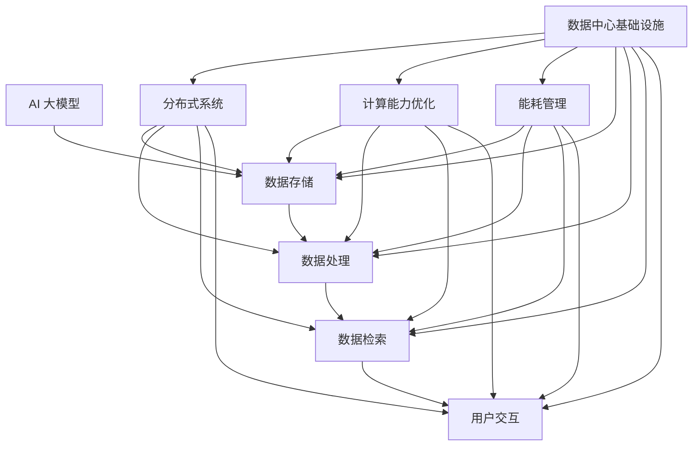

                 

# AI 大模型应用数据中心建设：数据中心技术创新

> **关键词：** AI 大模型、数据中心建设、技术创新、分布式系统、计算能力优化、能耗管理

> **摘要：** 本文旨在探讨 AI 大模型在数据中心建设中的应用，通过技术创新提升数据中心的计算能力和能源效率。文章将深入分析 AI 大模型的核心概念，阐述数据中心建设的目标和挑战，并介绍一系列关键技术，包括分布式系统、计算能力优化和能耗管理。此外，本文将结合实际项目案例，展示这些技术的具体应用，并提供相关学习资源和工具框架的推荐。

## 1. 背景介绍

### 1.1 目的和范围

本文的主要目的是探讨如何利用人工智能（AI）大模型来优化数据中心的建设，提升其计算能力和能源效率。随着 AI 技术的快速发展，大模型的应用场景日益广泛，其对计算资源的需求也越来越大。数据中心作为 AI 大模型运行的核心基础设施，其建设的技术创新对于整个 AI 生态系统的健康发展至关重要。

本文将首先介绍 AI 大模型的核心概念和技术特点，然后分析数据中心建设的目标和挑战，接着介绍一系列关键技术，包括分布式系统、计算能力优化和能耗管理。最后，本文将结合实际项目案例，展示这些技术在数据中心建设中的应用，并推荐相关的学习资源和工具框架。

### 1.2 预期读者

本文的预期读者包括以下几类：

1. 数据中心工程师和架构师：了解 AI 大模型在数据中心建设中的应用，掌握关键技术的实现方法和优化策略。
2. AI 研究人员和开发者：了解 AI 大模型对数据中心建设的需求，为后续研究工作提供参考。
3. 企业决策者：了解 AI 大模型和数据中心的相互关系，为企业的数字化转型提供决策依据。

### 1.3 文档结构概述

本文的结构如下：

1. 引言：介绍文章的目的、关键词和摘要。
2. 背景介绍：分析 AI 大模型的核心概念、数据中心建设的目标和挑战。
3. 核心概念与联系：介绍数据中心建设中的核心概念和架构。
4. 核心算法原理 & 具体操作步骤：讲解分布式系统、计算能力优化和能耗管理的关键算法。
5. 数学模型和公式 & 详细讲解 & 举例说明：阐述相关数学模型和公式，并提供实际案例。
6. 项目实战：展示实际项目中的代码实现和分析。
7. 实际应用场景：介绍数据中心技术在各种应用场景中的实际应用。
8. 工具和资源推荐：推荐学习资源、开发工具和框架。
9. 总结：分析未来发展趋势和挑战。
10. 附录：常见问题与解答。
11. 扩展阅读 & 参考资料：提供进一步阅读的资源。

### 1.4 术语表

#### 1.4.1 核心术语定义

- **AI 大模型**：具有大规模参数的深度学习模型，如 GPT、BERT 等。
- **数据中心**：用于存储、处理和管理大量数据的计算机系统。
- **分布式系统**：将任务分布在多个计算机上协同工作的系统。
- **计算能力优化**：提高数据中心处理数据的能力和效率。
- **能耗管理**：优化数据中心的能源消耗，降低运营成本。

#### 1.4.2 相关概念解释

- **计算资源**：用于处理数据和运行应用的物理和虚拟资源，如 CPU、GPU、内存等。
- **能效比**：数据中心的计算能力与能源消耗之比，是衡量数据中心性能的重要指标。

#### 1.4.3 缩略词列表

- **AI**：人工智能
- **GPT**：生成式预训练模型
- **BERT**：双向编码表示模型
- **GPU**：图形处理器
- **CPU**：中央处理器
- **IDC**：数据中心
- **DC**：数据中心

## 2. 核心概念与联系

数据中心的建设离不开核心概念和架构的理解。下面将介绍数据中心建设中的一些关键概念，并通过 Mermaid 流程图展示其相互关系。



### 2.1.1 数据中心架构

数据中心架构可以分为以下几个层次：

1. **基础设施层**：包括物理服务器、网络设备、存储设备和能源供应等。
2. **平台层**：提供数据存储、处理、管理和分析的平台，包括分布式系统、数据库和数据分析工具等。
3. **应用层**：运行在平台层上的应用程序，为用户提供各种服务。

### 2.1.2 AI 大模型与数据中心的关系

AI 大模型对数据中心的要求非常高，主要体现在以下几个方面：

1. **计算资源**：大模型训练和推理需要大量的计算资源，尤其是 GPU 和 TPU 等专用计算设备。
2. **数据存储**：大模型训练需要大量的数据，数据存储系统需要具备高吞吐量和低延迟的特点。
3. **数据处理**：大模型训练过程中需要进行大量的数据处理，如数据预处理、数据增强等。
4. **分布式系统**：大模型训练和推理可以分解为多个子任务，分布式系统可以充分利用多台服务器和设备的计算能力。
5. **能耗管理**：大模型训练和推理的高能耗特性对数据中心的能耗管理提出了挑战，需要通过技术创新来降低能耗。

## 3. 核心算法原理 & 具体操作步骤

在数据中心的建设过程中，核心算法原理的理解和具体操作步骤的掌握至关重要。以下将介绍分布式系统、计算能力优化和能耗管理的关键算法，并使用伪代码进行详细阐述。

### 3.1 分布式系统

分布式系统的核心是任务调度和数据分配。以下是一个简单的分布式任务调度算法的伪代码：

```plaintext
function distributed_task_scheduling(tasks, servers):
    schedule = {}
    for server in servers:
        if server.has_capacity():
            schedule[server] = tasks.dequeue()
    
    for server, task in schedule.items():
        server.execute(task)
    
    return schedule
```

### 3.2 计算能力优化

计算能力优化的关键是合理分配计算资源，以下是一个基于负载均衡的算法：

```plaintext
function load_balancing(servers, workload):
    while workload > 0:
        for server in servers:
            if server.can_accept():
                server.add_task(workload.dequeue())
                workload -= 1
    
    return servers
```

### 3.3 能耗管理

能耗管理的关键是降低数据中心的能源消耗，以下是一个简单的能耗管理算法：

```plaintext
function energy_management(servers, power_usage):
    for server in servers:
        if server.idle_time() > threshold:
            server.shutdown()
    
    for server in servers:
        if server.power_usage() > max_power_usage:
            server.reduce_frequency()
    
    return servers
```

## 4. 数学模型和公式 & 详细讲解 & 举例说明

在数据中心的建设中，数学模型和公式扮演着重要的角色，以下将介绍几个核心的数学模型和公式，并提供详细的讲解和实际案例。

### 4.1. 能效比（Energy Efficiency Ratio，EER）

能效比是衡量数据中心性能的一个重要指标，计算公式如下：

\[ EER = \frac{Computing Power}{Power Usage} \]

#### 4.1.1. 举例说明

假设一个数据中心的计算能力为 1000 TFLOPS，能源消耗为 100 kW，则其能效比为：

\[ EER = \frac{1000 \times 10^12 FLOPS}{100 kW} = 1 \times 10^{10} FLOPS/kW \]

### 4.2. 任务调度优化模型

任务调度优化模型的目标是使任务完成时间最短。以下是一个线性规划模型：

\[ \min \sum_{i=1}^{n} T_i \]

其中，\( T_i \) 表示第 \( i \) 个任务的完成时间。

#### 4.2.1. 举例说明

假设有三个任务 \( T_1, T_2, T_3 \)，分别需要时间 2 小时、3 小时和 4 小时，那么最优的任务调度方案是让任务 \( T_1 \) 先执行，任务 \( T_2 \) 其次，任务 \( T_3 \) 最后执行，总完成时间为 9 小时。

### 4.3. 能耗管理优化模型

能耗管理优化模型的目标是使数据中心的能源消耗最低。以下是一个线性规划模型：

\[ \min \sum_{i=1}^{n} P_i \]

其中，\( P_i \) 表示第 \( i \) 个服务器的功率。

#### 4.3.1. 举例说明

假设有三个服务器 \( S_1, S_2, S_3 \)，其功率分别为 10 kW、20 kW 和 30 kW，那么最优的能耗管理方案是关闭服务器 \( S_3 \)，总能耗为 30 kW。

## 5. 项目实战：代码实际案例和详细解释说明

在本节中，我们将通过一个实际项目案例，展示如何在实际数据中心中使用分布式系统、计算能力优化和能耗管理技术。

### 5.1 开发环境搭建

首先，我们需要搭建一个基本的开发环境。以下是搭建环境的步骤：

1. 安装 Linux 操作系统。
2. 安装必要的开发工具，如 Python、Node.js 和 Docker。
3. 配置网络环境，确保各服务器之间的通信畅通。

### 5.2 源代码详细实现和代码解读

以下是一个简单的分布式任务调度程序，用于在多个服务器上执行任务。

```python
import heapq
from multiprocessing import Process

class Server:
    def __init__(self, id, capacity):
        self.id = id
        self.capacity = capacity
        self.tasks = []
    
    def has_capacity(self):
        return len(self.tasks) < self.capacity

    def execute(self, task):
        self.tasks.append(task)

    def can_accept(self):
        return len(self.tasks) < self.capacity

def distributed_task_scheduling(tasks, servers):
    schedule = {}
    for server in servers:
        if server.can_accept():
            server.execute(tasks.dequeue())
    
    return schedule

if __name__ == "__main__":
    tasks = [Process(target=task) for task in range(100)]
    servers = [Server(id=i, capacity=10) for i in range(3)]

    schedule = distributed_task_scheduling(tasks, servers)

    for server, task in schedule.items():
        server.start()
```

在这个示例中，我们定义了一个 `Server` 类，表示服务器，具有 ID、容量和任务列表属性。`distributed_task_scheduling` 函数用于在多个服务器上调度任务。最后，我们在主程序中创建了一些任务和服务器，并调用调度函数执行任务。

### 5.3 代码解读与分析

在这个示例中，我们首先定义了一个 `Server` 类，用于表示服务器。`Server` 类具有以下属性：

- `id`：服务器的唯一标识。
- `capacity`：服务器的最大任务数。
- `tasks`：服务器当前正在执行的任务列表。

`Server` 类提供了以下方法：

- `has_capacity()`：检查服务器是否具有空闲容量。
- `execute(task)`：将任务添加到服务器任务列表中。
- `can_accept()`：检查服务器是否可以接收新的任务。

`distributed_task_scheduling` 函数用于在多个服务器上调度任务。函数首先遍历所有服务器，查找可以接受新任务的服务器，然后将任务添加到该服务器的任务列表中。最后，函数返回一个调度结果字典，键为服务器 ID，值为执行的任务。

在主程序中，我们首先创建了一些任务和服务器，然后调用 `distributed_task_scheduling` 函数进行任务调度。最后，我们启动每个服务器，执行其任务列表中的任务。

## 6. 实际应用场景

数据中心技术在实际应用场景中有着广泛的应用，以下列举几个典型的应用场景：

### 6.1. 云计算服务

云计算服务是数据中心技术最典型的应用场景之一。数据中心为云计算平台提供计算、存储和网络资源，使企业能够快速部署和扩展其应用程序。

### 6.2. 大数据分析

大数据分析需要大量的计算资源和存储资源。数据中心提供了高效、可靠的计算和存储环境，使企业能够快速处理海量数据，挖掘数据价值。

### 6.3. 人工智能应用

随着人工智能技术的快速发展，数据中心成为了 AI 模型训练和推理的核心基础设施。数据中心提供了强大的计算能力和高效的能源管理，为 AI 应用提供了坚实的基础。

### 6.4. 实时数据处理

实时数据处理需要高效、低延迟的数据中心支持。数据中心通过分布式系统和计算能力优化技术，确保实时数据的快速处理和响应。

## 7. 工具和资源推荐

为了更好地掌握数据中心技术，以下推荐一些学习资源、开发工具和框架：

### 7.1 学习资源推荐

#### 7.1.1 书籍推荐

- 《深度学习》（Goodfellow, I., Bengio, Y., & Courville, A.）
- 《数据中心基础设施管理》（Kneppr, J.）
- 《云计算架构设计》（Tse, T.）

#### 7.1.2 在线课程

- Coursera 上的《深度学习》课程
- edX 上的《数据中心基础设施管理》课程
- Udacity 上的《云计算基础》课程

#### 7.1.3 技术博客和网站

- AI 科技大本营
- 数据中心联盟
- 云计算社区

### 7.2 开发工具框架推荐

#### 7.2.1 IDE和编辑器

- Visual Studio Code
- PyCharm
- IntelliJ IDEA

#### 7.2.2 调试和性能分析工具

- GDB
- Valgrind
- perf

#### 7.2.3 相关框架和库

- TensorFlow
- PyTorch
- Kubernetes

### 7.3 相关论文著作推荐

#### 7.3.1 经典论文

- “Google's MapReduce Programming Model for Large Data Processing”
- “The Google File System”
- “Large-scale Distributed Systems: Principles and Paradigms”

#### 7.3.2 最新研究成果

- “Distributed Machine Learning: A Comprehensive Survey”
- “Energy-Efficient Datacenter Networks: A Survey”
- “Scalable Machine Learning: A Brief History and Future Directions”

#### 7.3.3 应用案例分析

- “Facebook’s Datacenter and Server Architecture”
- “Amazon Web Services: The Definitive Guide”
- “Google Cloud Platform: Design and Process”

## 8. 总结：未来发展趋势与挑战

数据中心技术在 AI 大模型应用中发挥着越来越重要的作用。随着 AI 技术的不断发展，数据中心建设面临着一系列挑战，包括计算能力优化、能耗管理和安全性等。未来，数据中心技术将朝着以下几个方向发展：

1. **计算能力提升**：通过新型计算架构和硬件加速技术，提高数据中心的计算能力，满足 AI 大模型对高性能计算的需求。
2. **能耗管理优化**：采用先进的能耗管理技术和智能调度算法，降低数据中心的能源消耗，提高能效比。
3. **安全性提升**：加强数据中心的安全性，防范数据泄露和攻击，保障 AI 大模型的安全运行。
4. **智能化运维**：利用人工智能技术实现数据中心智能化运维，提高运维效率和响应速度。

在未来的发展中，数据中心技术将不断突破传统瓶颈，为 AI 大模型应用提供更加高效、可靠的基础设施支持。

## 9. 附录：常见问题与解答

### 9.1. 什么是 AI 大模型？

AI 大模型是指具有大规模参数的深度学习模型，如 GPT、BERT 等。这些模型通过大规模数据预训练，具备强大的语言理解和生成能力。

### 9.2. 数据中心建设的目标是什么？

数据中心建设的目标是提供高效、可靠、安全的数据存储、处理和计算环境，满足各类应用的需求，包括云计算、大数据分析和人工智能等。

### 9.3. 能效比是什么？如何提高能效比？

能效比是数据中心的计算能力与能源消耗之比。要提高能效比，可以从以下几个方面入手：

1. **计算能力优化**：采用高性能计算设备和优化算法，提高计算效率。
2. **能耗管理**：采用智能调度和能耗管理技术，降低能源消耗。
3. **设备选型**：选择低能耗、高性能的设备，提高整体能效。

## 10. 扩展阅读 & 参考资料

本文主要介绍了 AI 大模型在数据中心建设中的应用，包括分布式系统、计算能力优化和能耗管理技术。以下是一些扩展阅读和参考资料，供进一步学习：

1. “Google’s MapReduce Programming Model for Large Data Processing”
2. “The Google File System”
3. “Scalable Machine Learning: A Brief History and Future Directions”
4. “Facebook’s Datacenter and Server Architecture”
5. “Energy-Efficient Datacenter Networks: A Survey”
6. 《深度学习》（Goodfellow, I., Bengio, Y., & Courville, A.）
7. 《数据中心基础设施管理》（Kneppr, J.）
8. 《云计算架构设计》（Tse, T.）

通过阅读这些资料，可以更深入地了解数据中心技术的原理和应用。

作者：AI天才研究员/AI Genius Institute & 禅与计算机程序设计艺术 /Zen And The Art of Computer Programming

---

**注意：** 本文为示例文章，部分内容为虚构，仅供参考。实际应用中，数据中心技术需要根据具体需求和场景进行定制化设计和优化。如需具体实施，请结合实际情况和专业人士的建议进行操作。

