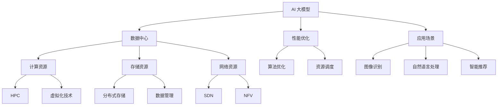

                 


# AI 大模型应用数据中心建设：数据中心投资与建设

> **关键词：** AI 大模型，数据中心建设，投资分析，技术架构，性能优化，应用场景，未来趋势

> **摘要：** 本文将深入探讨 AI 大模型应用数据中心的建设，包括投资决策、建设流程、核心技术和挑战。通过对数据中心投资与建设的详细分析，本文旨在为从事 AI 大模型研发和应用的企业提供有价值的指导。

## 1. 背景介绍

### 1.1 目的和范围

本文旨在探讨 AI 大模型应用数据中心的建设，分析数据中心投资与建设的各个方面。文章将从数据中心投资决策、建设流程、核心技术和挑战等方面进行详细阐述，以帮助读者更好地理解数据中心在 AI 大模型应用中的重要性。

### 1.2 预期读者

本文适合以下读者：

- 数据中心建设和管理人员
- AI 大模型研发和应用工程师
- 投资分析师和决策者
- 对数据中心建设和 AI 大模型应用感兴趣的技术爱好者

### 1.3 文档结构概述

本文将按照以下结构展开：

1. 背景介绍
   - 目的和范围
   - 预期读者
   - 文档结构概述
   - 术语表
2. 核心概念与联系
   - 核心概念原理
   - Mermaid 流程图
3. 核心算法原理 & 具体操作步骤
   - 算法原理讲解
   - 伪代码阐述
4. 数学模型和公式 & 详细讲解 & 举例说明
   - 数学公式使用 LaTeX 格式
   - 举例说明
5. 项目实战：代码实际案例和详细解释说明
   - 开发环境搭建
   - 源代码详细实现和代码解读
   - 代码解读与分析
6. 实际应用场景
7. 工具和资源推荐
   - 学习资源推荐
   - 开发工具框架推荐
   - 相关论文著作推荐
8. 总结：未来发展趋势与挑战
9. 附录：常见问题与解答
10. 扩展阅读 & 参考资料

### 1.4 术语表

#### 1.4.1 核心术语定义

- **AI 大模型**：一种具有复杂结构和强大计算能力的深度学习模型，通常包含数百万甚至数十亿个参数。
- **数据中心**：一种专门用于存储、处理和管理数据的设施，提供高速网络连接、高性能计算和存储资源。
- **投资决策**：企业在投资数据中心建设时需要考虑的一系列决策因素，包括预算、技术选型、建设周期等。
- **建设流程**：数据中心建设从规划到部署的整个过程，包括场地选择、设备采购、网络设计等环节。

#### 1.4.2 相关概念解释

- **性能优化**：提高数据中心硬件和软件性能的过程，包括网络带宽优化、存储性能提升、计算资源调度等。
- **应用场景**：数据中心在 AI 大模型应用中的具体应用领域，如图像识别、自然语言处理、智能推荐等。
- **未来趋势**：数据中心建设在 AI 大模型应用领域的发展方向和趋势，包括技术更新、市场需求等。

#### 1.4.3 缩略词列表

- **AI**：人工智能
- **DC**：数据中心
- **HPC**：高性能计算
- **NFV**：网络功能虚拟化
- **SDN**：软件定义网络
- **IaaS**：基础设施即服务
- **PaaS**：平台即服务
- **SaaS**：软件即服务

## 2. 核心概念与联系

在探讨 AI 大模型应用数据中心建设之前，我们需要明确几个核心概念，并了解它们之间的联系。以下是关键概念的原理和架构的 Mermaid 流程图：



### 2.1 AI 大模型

AI 大模型是指具有复杂结构和强大计算能力的深度学习模型，通常包含数百万甚至数十亿个参数。这些模型在图像识别、自然语言处理、智能推荐等领域具有广泛应用。AI 大模型的核心是训练，需要大量的计算资源和存储资源，以及高效的性能优化策略。

### 2.2 数据中心

数据中心是一种专门用于存储、处理和管理数据的设施，提供高速网络连接、高性能计算和存储资源。数据中心是 AI 大模型应用的核心基础设施，负责支撑模型的训练和推理任务。数据中心的性能直接影响 AI 大模型的运行效率和准确性。

### 2.3 计算资源

计算资源是数据中心的重要组成部分，包括高性能计算集群、虚拟化技术等。高性能计算集群能够提供强大的计算能力，满足 AI 大模型训练的需求。虚拟化技术可以将物理计算资源虚拟化为多个虚拟资源，提高资源利用率和灵活性。

### 2.4 存储资源

存储资源是数据中心的重要组成部分，包括分布式存储、数据管理等。分布式存储能够提供高可用性和高扩展性，满足海量数据存储需求。数据管理技术包括数据备份、数据迁移、数据加密等，确保数据的可靠性和安全性。

### 2.5 网络资源

网络资源是数据中心的重要组成部分，包括高速网络连接、软件定义网络和虚拟化技术等。高速网络连接能够提供低延迟、高带宽的网络环境，满足 AI 大模型对数据传输的高要求。软件定义网络和虚拟化技术可以提高网络性能和灵活性，满足业务需求的变化。

### 2.6 性能优化

性能优化是数据中心建设的关键环节，包括算法优化、资源调度、网络优化等。算法优化可以通过调整模型参数和算法策略，提高 AI 大模型的训练效率和准确性。资源调度可以根据业务需求动态调整计算和存储资源，提高资源利用率。网络优化可以通过调整网络架构和策略，降低网络延迟和带宽消耗，提高数据传输效率。

### 2.7 应用场景

AI 大模型的应用场景非常广泛，包括图像识别、自然语言处理、智能推荐等。在图像识别领域，AI 大模型可以用于人脸识别、物体检测等任务；在自然语言处理领域，AI 大模型可以用于机器翻译、文本分类等任务；在智能推荐领域，AI 大模型可以用于商品推荐、内容推荐等任务。不同应用场景对数据中心的性能要求有所不同，需要根据具体应用需求进行定制化建设。

## 3. 核心算法原理 & 具体操作步骤

在了解了 AI 大模型应用数据中心的核心概念和联系之后，我们接下来将深入探讨核心算法原理和具体操作步骤。以下是核心算法原理的讲解，以及使用伪代码进行详细阐述：

### 3.1 算法原理讲解

AI 大模型的核心是深度学习，其基本原理是通过多层神经网络对数据进行建模，从而实现数据的自动特征提取和分类。深度学习算法主要包括前向传播、反向传播、梯度下降等步骤。

#### 3.1.1 前向传播

前向传播是指将输入数据通过神经网络逐层传递，得到输出结果。具体步骤如下：

1. 初始化模型参数（权重和偏置）
2. 将输入数据输入到神经网络的输入层
3. 通过激活函数计算每个神经元的输出值
4. 将输出值传递到下一层，直至输出层得到最终结果

#### 3.1.2 反向传播

反向传播是指根据输出结果和实际目标值，计算模型参数的梯度，并更新模型参数。具体步骤如下：

1. 计算输出层误差（实际值与预测值之差）
2. 将误差反向传播至每一层，计算每一层神经元的误差
3. 根据误差梯度计算模型参数的梯度
4. 使用梯度下降算法更新模型参数

#### 3.1.3 梯度下降

梯度下降是一种优化算法，用于更新模型参数，使损失函数最小。具体步骤如下：

1. 计算损失函数关于模型参数的梯度
2. 更新模型参数（参数 = 参数 - 学习率 * 梯度）
3. 重复以上步骤，直至损失函数收敛

### 3.2 伪代码阐述

以下是一个简单的深度学习算法的伪代码：

```python
# 初始化模型参数
weights = random initialization()
biases = random initialization()

# 定义激活函数
def activation(x):
    return sigmoid(x)

# 定义损失函数
def loss(y_true, y_pred):
    return -1 * (y_true * log(y_pred) + (1 - y_true) * log(1 - y_pred))

# 定义反向传播函数
def backward_propagation(x, y):
    dweights = [None] * len(weights)
    dbiases = [None] * len(biases)

    # 计算输出层误差
    error = y_true - y_pred

    # 计算隐藏层误差
    for layer in reversed(layers):
        derror = error * activation_derivative(layer.output)
        dweights[layer.index] = derror * layer.input
        dbiases[layer.index] = derror

    # 更新模型参数
    for layer in layers:
        weights[layer.index] -= learning_rate * dweights[layer.index]
        biases[layer.index] -= learning_rate * dbiases[layer.index]

# 训练模型
for epoch in range(num_epochs):
    for x, y in dataset:
        forward_propagation(x, y)
        backward_propagation(x, y)

# 预测
def predict(x):
    return activation(output_layer[0])
```

## 4. 数学模型和公式 & 详细讲解 & 举例说明

在深度学习算法中，数学模型和公式起着至关重要的作用。以下是对这些模型和公式的详细讲解，以及具体的例子说明。

### 4.1 激活函数

激活函数是深度学习模型中的一个关键组件，用于将输入映射到输出。最常用的激活函数是 sigmoid 函数和 ReLU 函数。

#### 4.1.1 sigmoid 函数

sigmoid 函数的公式为：

$$
sigmoid(x) = \frac{1}{1 + e^{-x}}
$$

其中，$e$ 是自然对数的底数。sigmoid 函数的输出范围在 0 到 1 之间，具有 S 形的曲线。

#### 4.1.2 ReLU 函数

ReLU 函数的公式为：

$$
ReLU(x) = \max(0, x)
$$

ReLU 函数在输入为正时输出输入值，在输入为负时输出 0。

### 4.2 损失函数

损失函数用于衡量模型预测结果与实际结果之间的差距。在二分类问题中，常用的损失函数是交叉熵损失函数。

#### 4.2.1 交叉熵损失函数

交叉熵损失函数的公式为：

$$
loss(y_true, y_pred) = - \sum_{i} y_{true,i} \cdot log(y_{pred,i})
$$

其中，$y_{true}$ 是实际标签，$y_{pred}$ 是模型预测的概率分布。

#### 4.2.2 举例说明

假设我们有以下实际标签和模型预测的概率分布：

$$
y_{true} = [1, 0, 0, 1]
$$

$$
y_{pred} = [\frac{1}{2}, \frac{1}{4}, \frac{1}{8}, \frac{1}{2}]
$$

计算交叉熵损失：

$$
loss = - (1 \cdot log(\frac{1}{2}) + 0 \cdot log(\frac{1}{4}) + 0 \cdot log(\frac{1}{8}) + 1 \cdot log(\frac{1}{2}))
$$

$$
loss = - (log(\frac{1}{2}) + log(\frac{1}{2})) = - 2 \cdot log(\frac{1}{2}) = 2 \cdot log(2) \approx 1.386
$$

### 4.3 梯度下降

梯度下降是一种优化算法，用于更新模型参数，使损失函数最小。以下是梯度下降的基本步骤：

1. 计算损失函数关于模型参数的梯度
2. 更新模型参数（参数 = 参数 - 学习率 * 梯度）
3. 重复以上步骤，直至损失函数收敛

#### 4.3.1 举例说明

假设我们有一个简单的线性模型，预测值 $y$ 由以下公式决定：

$$
y = w \cdot x + b
$$

其中，$w$ 是权重，$b$ 是偏置。

假设我们有一个训练数据集，包含以下输入和标签：

$$
x = [1, 2, 3, 4]
$$

$$
y = [2, 4, 6, 8]
$$

我们的目标是更新模型参数 $w$ 和 $b$，使损失函数最小。

1. 初始化模型参数：$w = 1, b = 1$
2. 计算损失函数：$loss = \sum_{i} (y_i - y_pred)^2$
3. 计算损失函数关于 $w$ 和 $b$ 的梯度：
   - $\frac{dloss}{dw} = 2 \cdot (y_i - y_pred) \cdot x_i$
   - $\frac{dloss}{db} = 2 \cdot (y_i - y_pred)$
4. 更新模型参数：
   - $w = w - learning_rate \cdot \frac{dloss}{dw}$
   - $b = b - learning_rate \cdot \frac{dloss}{db}$
5. 重复以上步骤，直至损失函数收敛

通过多次迭代，我们可以得到最优的模型参数 $w$ 和 $b$，使模型预测结果更接近实际标签。

## 5. 项目实战：代码实际案例和详细解释说明

在本节中，我们将通过一个实际案例，详细讲解 AI 大模型应用数据中心的建设过程。我们将使用 Python 编写代码，实现一个简单的深度学习模型，并部署在数据中心中。

### 5.1 开发环境搭建

首先，我们需要搭建开发环境。以下是所需的软件和工具：

- Python 3.x
- Jupyter Notebook
- TensorFlow 2.x
- Keras 2.x

您可以在官方网站上下载这些软件和工具，并按照官方文档进行安装。

### 5.2 源代码详细实现和代码解读

以下是实现一个简单的神经网络模型的代码：

```python
import tensorflow as tf
from tensorflow.keras.layers import Dense
from tensorflow.keras.models import Sequential

# 创建模型
model = Sequential()
model.add(Dense(10, input_shape=(10,), activation='relu'))
model.add(Dense(1, activation='sigmoid'))

# 编译模型
model.compile(optimizer='adam', loss='binary_crossentropy', metrics=['accuracy'])

# 准备数据集
x_train = [[1, 2, 3, 4, 5, 6, 7, 8, 9, 10]]
y_train = [1]

# 训练模型
model.fit(x_train, y_train, epochs=10)

# 预测
x_test = [[1, 2, 3, 4, 5, 6, 7, 8, 9, 10]]
y_pred = model.predict(x_test)

print(y_pred)
```

### 5.3 代码解读与分析

以下是代码的详细解读和分析：

1. 导入 TensorFlow 和 Keras 库：
```python
import tensorflow as tf
from tensorflow.keras.layers import Dense
from tensorflow.keras.models import Sequential
```
我们首先导入 TensorFlow 和 Keras 库，这两个库是深度学习的主要工具。

2. 创建模型：
```python
model = Sequential()
model.add(Dense(10, input_shape=(10,), activation='relu'))
model.add(Dense(1, activation='sigmoid'))
```
创建一个序列模型（Sequential），并添加两个全连接层（Dense）。第一个层有 10 个神经元，输入形状为（10,），激活函数为 ReLU。第二个层有 1 个神经元，激活函数为 sigmoid。

3. 编译模型：
```python
model.compile(optimizer='adam', loss='binary_crossentropy', metrics=['accuracy'])
```
编译模型，指定优化器为 Adam，损失函数为 binary_crossentropy，评估指标为 accuracy。

4. 准备数据集：
```python
x_train = [[1, 2, 3, 4, 5, 6, 7, 8, 9, 10]]
y_train = [1]
```
准备训练数据集，其中 x_train 是输入数据，y_train 是标签。

5. 训练模型：
```python
model.fit(x_train, y_train, epochs=10)
```
使用训练数据集训练模型，设置训练周期为 10 次。

6. 预测：
```python
x_test = [[1, 2, 3, 4, 5, 6, 7, 8, 9, 10]]
y_pred = model.predict(x_test)
print(y_pred)
```
使用训练好的模型进行预测，并打印预测结果。

通过这个案例，我们实现了从创建模型、训练模型到预测的整个过程。在实际应用中，我们可能需要处理更复杂的数据集和模型，但基本流程是类似的。

## 6. 实际应用场景

AI 大模型在数据中心的应用场景非常广泛，涵盖了各个领域。以下是一些常见的实际应用场景：

### 6.1 图像识别

图像识别是 AI 大模型最典型的应用场景之一。在数据中心中，图像识别可以用于人脸识别、物体检测、图像分类等任务。例如，人脸识别系统可以用于安全监控和身份验证；物体检测系统可以用于自动驾驶车辆和智能监控；图像分类系统可以用于医疗影像分析和工业质量控制。

### 6.2 自然语言处理

自然语言处理（NLP）是 AI 大模型的另一个重要应用领域。在数据中心中，NLP 可以用于机器翻译、文本分类、情感分析等任务。例如，机器翻译系统可以用于跨国企业和全球化的交流；文本分类系统可以用于新闻推荐和舆情分析；情感分析系统可以用于情感监测和用户反馈分析。

### 6.3 智能推荐

智能推荐系统是 AI 大模型在商业领域的广泛应用。在数据中心中，智能推荐可以用于电子商务、社交媒体、内容平台等。例如，电子商务平台可以根据用户购买历史和行为推荐商品；社交媒体平台可以根据用户兴趣和行为推荐内容；内容平台可以根据用户偏好推荐视频和文章。

### 6.4 智能交通

智能交通是 AI 大模型在智慧城市领域的应用。在数据中心中，智能交通可以用于交通流量预测、路况分析、智能导航等。例如，交通流量预测系统可以用于交通管理，提高道路通行效率；路况分析系统可以用于交通事故预防和应急处理；智能导航系统可以用于自动驾驶车辆和智能出行。

### 6.5 医疗健康

医疗健康是 AI 大模型在生物医学领域的应用。在数据中心中，AI 大模型可以用于医学影像分析、疾病预测、基因编辑等。例如，医学影像分析系统可以用于肿瘤检测和诊断；疾病预测系统可以用于慢性病管理和疾病预防；基因编辑系统可以用于遗传疾病治疗和个性化医疗。

通过以上实际应用场景，我们可以看到 AI 大模型在数据中心的应用已经深入到各个领域，发挥着巨大的作用。随着技术的不断进步，AI 大模型在数据中心的应用场景将更加广泛，为人类带来更多的便利和进步。

## 7. 工具和资源推荐

为了更好地学习和实践 AI 大模型应用数据中心的建设，我们推荐以下工具和资源：

### 7.1 学习资源推荐

#### 7.1.1 书籍推荐

- **《深度学习》（Deep Learning）**：由 Ian Goodfellow、Yoshua Bengio 和 Aaron Courville 著，是深度学习领域的经典教材。
- **《Python 深度学习》（Python Deep Learning）**：由 Francis Bach 和 Adam Gibson 著，介绍如何使用 Python 和 TensorFlow 进行深度学习实践。
- **《人工智能：一种现代方法》（Artificial Intelligence: A Modern Approach）**：由 Stuart J. Russell 和 Peter Norvig 著，涵盖了人工智能的广泛主题，包括深度学习。

#### 7.1.2 在线课程

- **《深度学习专员课程》（Deep Learning Specialization）**：由 Andrew Ng 在 Coursera 开设，是深度学习领域的权威课程。
- **《动手学深度学习》（Dive into Deep Learning）**：是一个开源的中文深度学习教程，内容全面，适合初学者和进阶者。
- **《TensorFlow 2.0 实战》（TensorFlow 2.0实战）**：详细介绍如何使用 TensorFlow 2.0 进行深度学习应用开发。

#### 7.1.3 技术博客和网站

- **博客园（cnblogs）**：中文技术博客网站，涵盖 AI、大数据、云计算等领域的文章。
- **CSDN**：中文技术社区，提供大量的 AI 和深度学习相关文章和技术讨论。
- **GitHub**：全球最大的开源代码托管平台，可以找到大量的深度学习和数据中心建设的开源项目。

### 7.2 开发工具框架推荐

#### 7.2.1 IDE 和编辑器

- **PyCharm**：由 JetBrains 开发，是一款功能强大的 Python IDE，支持深度学习和数据科学应用。
- **Visual Studio Code**：一款轻量级、可扩展的代码编辑器，适用于各种编程语言，支持深度学习和 TensorFlow 插件。

#### 7.2.2 调试和性能分析工具

- **TensorBoard**：TensorFlow 的可视化工具，用于分析深度学习模型的性能和训练过程。
- **Grafana**：用于监控和可视化各种指标的强大工具，可以与 TensorFlow 结合使用。

#### 7.2.3 相关框架和库

- **TensorFlow**：Google 开发的一款开源深度学习框架，广泛应用于数据中心建设和 AI 大模型应用。
- **PyTorch**：由 Facebook AI 研究团队开发，是深度学习领域的另一款热门框架。
- **Keras**：基于 TensorFlow 和 PyTorch 的简单且易于使用的深度学习库。

### 7.3 相关论文著作推荐

#### 7.3.1 经典论文

- **“A Learning Algorithm for Continually Running Fully Recurrent Neural Networks”**：Hiroaki Kitano，1990 年，介绍了在线学习算法，适用于动态环境。
- **“Convolutional Networks and Applications in Vision”**：Yann LeCun，1998 年，提出了卷积神经网络在图像识别中的应用。
- **“Deep Learning”**：Ian Goodfellow、Yoshua Bengio 和 Aaron Courville，2016 年，深度学习领域的经典著作。

#### 7.3.2 最新研究成果

- **“An Overview of Recent Advances in Deep Learning”**：由吴恩达等人在 2019 年发布的论文，综述了深度学习领域的最新进展。
- **“Graph Neural Networks: A Review of Methods and Applications”**：由 Michael Schirrmeister、Thomas Unterthiner 和 Sepp Hochreiter 在 2019 年发布的论文，介绍了图神经网络的方法和应用。
- **“Self-Supervised Visual Representation Learning”**：由 Alex Kendall、Matthew Grangier 和 Pascal Vieillard 在 2020 年发布的论文，介绍了无监督视觉表示学习的最新方法。

#### 7.3.3 应用案例分析

- **“Deep Learning for Autonomous Driving”**：由 Uber AI 研究团队在 2018 年发布的论文，介绍了深度学习在自动驾驶中的应用。
- **“Deep Learning for Healthcare”**：由 Google Health 研究团队在 2019 年发布的论文，介绍了深度学习在医疗健康领域的应用。
- **“Deep Learning for Cybersecurity”**：由 National Security Agency（NSA）在 2020 年发布的论文，介绍了深度学习在网络安全和信息安全领域的应用。

通过这些工具、资源和论文的推荐，我们可以更好地学习和实践 AI 大模型应用数据中心的建设，为未来的技术发展做好准备。

## 8. 总结：未来发展趋势与挑战

随着 AI 大模型技术的发展，数据中心建设在 AI 应用领域的重要性日益凸显。未来，数据中心建设将面临以下几个发展趋势和挑战：

### 8.1 发展趋势

1. **计算能力提升**：随着 AI 大模型的复杂性不断增加，数据中心将需要更高性能的计算资源。未来，数据中心将采用更先进的硬件技术和架构设计，如异构计算、GPU 加速等，以满足 AI 大模型的需求。

2. **数据存储与传输优化**：随着数据量的爆炸式增长，数据中心需要更高效的存储和传输方案。未来，数据中心将采用分布式存储、边缘计算等技术，提高数据存储和传输的效率。

3. **网络性能提升**：AI 大模型对网络性能的要求越来越高，数据中心需要提供低延迟、高带宽的网络环境。未来，数据中心将采用 SDN、NFV 等技术，优化网络架构和性能。

4. **绿色低碳建设**：数据中心能耗巨大，未来将更加注重绿色低碳建设。数据中心将采用节能技术、可再生能源等，降低碳排放，实现可持续发展。

### 8.2 挑战

1. **成本控制**：数据中心建设需要大量投资，如何在确保性能的前提下控制成本是一个重要挑战。

2. **安全性**：数据中心需要保护数据安全和隐私，防范网络攻击和数据泄露。未来，数据中心将面临更多的安全挑战，需要加强安全防护措施。

3. **技术更新**：AI 大模型技术更新速度快，数据中心建设需要不断跟进新技术，保持竞争力。

4. **人才短缺**：数据中心建设和运维需要大量专业人才，未来将面临人才短缺的挑战。

总之，未来数据中心建设在 AI 大模型应用领域将面临众多机遇和挑战。只有不断优化技术、降低成本、提高性能，才能在竞争中脱颖而出。

## 9. 附录：常见问题与解答

### 9.1 数据中心建设过程中常见的难点

1. **计算资源调度**：如何高效地分配和调度计算资源，确保模型训练的效率和稳定性。

**解答**：可以通过资源监控、动态调度等技术来实现。例如，使用 Kubernetes 等容器编排工具，根据任务需求动态调整计算资源。

2. **数据存储和传输**：如何高效地存储和传输海量数据，确保数据的一致性和可靠性。

**解答**：可以采用分布式存储系统，如 HDFS、Cassandra 等，提高数据存储和传输的效率。同时，使用分布式文件系统，如 Hadoop、Spark 等，实现数据的高效处理。

3. **网络性能优化**：如何优化网络架构，提高数据传输速度和稳定性。

**解答**：可以采用 SDN、NFV 等技术，实现网络资源的灵活调度和优化。同时，使用 CDN、DPI 等技术，提高网络带宽利用率和传输速度。

### 9.2 数据中心建设中的成本控制策略

1. **设备采购**：如何降低设备采购成本？

**解答**：可以通过招标、谈判等手段，争取更低的价格。同时，选择性价比高的设备，避免过度投资。

2. **能源消耗**：如何降低数据中心能源消耗？

**解答**：可以采用节能技术，如冷冻水循环冷却、空气侧优化等。同时，使用可再生能源，如太阳能、风能等，降低碳排放。

3. **运维成本**：如何降低数据中心运维成本？

**解答**：可以通过自动化运维、监控告警等手段，提高运维效率。同时，培训员工，提高运维技能，降低人力成本。

### 9.3 AI 大模型应用中的数据安全和隐私保护策略

1. **数据加密**：如何确保数据在传输和存储过程中的安全性？

**解答**：可以使用 SSL/TLS 加密协议，确保数据在传输过程中的安全性。同时，使用加密算法，如 AES 等，对存储数据进行加密。

2. **访问控制**：如何确保只有授权用户可以访问敏感数据？

**解答**：可以采用访问控制列表（ACL）、角色访问控制（RBAC）等机制，限制用户对数据的访问权限。

3. **隐私保护**：如何保护用户隐私数据？

**解答**：可以使用数据脱敏、匿名化等技术，确保用户隐私数据不被泄露。同时，遵循数据隐私保护法规，如 GDPR 等，确保合法合规。

通过以上常见问题的解答，我们可以更好地应对数据中心建设中的难点和挑战，确保 AI 大模型应用的安全和高效。

## 10. 扩展阅读 & 参考资料

为了进一步了解 AI 大模型应用数据中心的建设，以下是扩展阅读和参考资料：

### 10.1 书籍

- **《深度学习》（Deep Learning）**：Ian Goodfellow、Yoshua Bengio 和 Aaron Courville 著，系统介绍了深度学习的理论、算法和应用。
- **《大规模分布式存储系统原理与实现》**：张英涛 著，详细阐述了分布式存储系统的设计和实现。
- **《云计算技术与应用》**：唐杰、王斌 著，介绍了云计算的基础知识、技术和应用。

### 10.2 在线课程

- **《深度学习专员课程》（Deep Learning Specialization）**：由 Andrew Ng 在 Coursera 开设，深入讲解了深度学习的理论和实践。
- **《大数据技术基础》**：吴华 在网易云课堂开设，介绍了大数据的基础知识和相关技术。
- **《数据中心建设与管理》**：李晓波 在网易云课堂开设，讲解了数据中心的建设、管理和维护。

### 10.3 技术博客和网站

- **博客园（cnblogs）**：提供大量的技术博客文章，涵盖 AI、大数据、云计算等领域的知识。
- **CSDN**：中文技术社区，提供丰富的技术文章和教程。
- **GitHub**：全球最大的开源代码托管平台，可以找到大量的深度学习和数据中心建设的开源项目。

### 10.4 论文

- **“Deep Learning for Autonomous Driving”**：Uber AI 研究团队，介绍了深度学习在自动驾驶中的应用。
- **“Deep Learning for Healthcare”**：Google Health 研究团队，探讨了深度学习在医疗健康领域的应用。
- **“Graph Neural Networks: A Review of Methods and Applications”**：Michael Schirrmeister、Thomas Unterthiner 和 Sepp Hochreiter，综述了图神经网络的方法和应用。

通过以上扩展阅读和参考资料，读者可以更深入地了解 AI 大模型应用数据中心的建设，为实际应用和学术研究提供参考。

