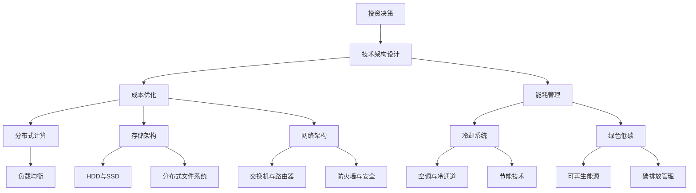

                 

# AI大模型应用数据中心建设：数据中心投资与建设

> **关键词：** 大模型应用、数据中心建设、投资策略、技术架构、成本优化、能耗管理

> **摘要：** 本文详细探讨了AI大模型应用数据中心的建设过程，包括投资决策、技术架构设计、成本优化和能耗管理等方面。通过深入分析和实际案例，为数据中心建设者提供了科学、全面的指导。

## 1. 背景介绍

### 1.1 目的和范围

本文旨在为AI大模型应用数据中心的建设提供系统的指导，帮助决策者更好地进行投资与建设。本文将涵盖以下内容：

- 数据中心投资决策
- 技术架构设计
- 成本优化策略
- 能耗管理

### 1.2 预期读者

- 数据中心架构师
- 投资决策者
- AI技术开发者
- 企业IT经理

### 1.3 文档结构概述

本文分为十个部分，具体如下：

1. 背景介绍
2. 核心概念与联系
3. 核心算法原理 & 具体操作步骤
4. 数学模型和公式 & 详细讲解 & 举例说明
5. 项目实战：代码实际案例和详细解释说明
6. 实际应用场景
7. 工具和资源推荐
8. 总结：未来发展趋势与挑战
9. 附录：常见问题与解答
10. 扩展阅读 & 参考资料

### 1.4 术语表

#### 1.4.1 核心术语定义

- **AI大模型**：具有海量参数、高度非线性特性的深度学习模型，如Transformer、BERT等。
- **数据中心**：为提供数据存储、处理和分析服务的专用设施。
- **投资决策**：关于数据中心建设资金、技术、资源等的决策过程。
- **成本优化**：通过调整资源分配、优化流程等方式，降低数据中心运营成本。
- **能耗管理**：通过技术手段降低数据中心能源消耗，实现绿色低碳发展。

#### 1.4.2 相关概念解释

- **分布式计算**：将任务分布在多个节点上执行，以提高计算效率和负载均衡。
- **存储架构**：数据中心的数据存储结构和方案，包括HDD、SSD、分布式文件系统等。
- **网络架构**：数据中心的网络拓扑和设备布局，包括交换机、路由器、防火墙等。
- **冷却系统**：用于降低数据中心设备温度的技术和设备，包括空调、冷通道等。

#### 1.4.3 缩略词列表

- **AI**：人工智能
- **DC**：数据中心
- **GPU**：图形处理单元
- **CPU**：中央处理器
- **HDD**：硬盘
- **SSD**：固态硬盘
- **Tbps**：太比特每秒
- **PUE**：能源使用效率

## 2. 核心概念与联系

数据中心建设涉及多个核心概念和环节，以下将使用Mermaid流程图展示其原理和架构。



### 2.1 投资决策

投资决策是数据中心建设的第一步，其核心任务是确定建设资金、技术方案和资源分配。以下是投资决策的流程和关键步骤：

1. **需求分析**：根据业务需求，确定数据中心的建设规模、性能指标和功能需求。
2. **技术评估**：评估当前主流技术的优缺点，如分布式计算、存储架构、网络架构等。
3. **成本预算**：计算建设成本，包括硬件设备、软件开发、人力成本等。
4. **风险分析**：评估投资风险，如技术风险、市场风险、政策风险等。
5. **投资方案**：制定投资方案，包括技术路线、资金来源、建设进度等。

### 2.2 技术架构设计

技术架构设计是数据中心建设的核心环节，其目标是确保系统的高性能、高可用性和可扩展性。以下是技术架构设计的流程和关键步骤：

1. **需求分析**：了解业务需求，明确数据中心的功能和性能要求。
2. **架构设计**：根据需求，设计分布式计算、存储架构、网络架构等。
3. **系统选型**：选择适合的硬件设备、软件系统、开源框架等。
4. **技术验证**：对设计方案进行技术验证，确保系统性能和可靠性。
5. **架构调整**：根据验证结果，对设计方案进行优化和调整。

### 2.3 成本优化

成本优化是数据中心建设过程中的一项重要任务，其核心目标是降低运营成本，提高投资回报率。以下是成本优化的流程和关键步骤：

1. **成本分析**：对数据中心的建设成本和运营成本进行详细分析。
2. **资源优化**：通过调整资源分配，降低硬件和软件成本。
3. **流程优化**：通过改进运维流程，提高工作效率，降低人力成本。
4. **能耗管理**：通过优化冷却系统和能源消耗，降低能耗成本。
5. **风险管理**：评估投资风险，制定风险管理策略。

### 2.4 能耗管理

能耗管理是数据中心建设过程中不可忽视的重要环节，其核心目标是降低能源消耗，实现绿色低碳发展。以下是能耗管理的流程和关键步骤：

1. **能耗分析**：对数据中心的能耗情况进行详细分析，找出能耗高的设备和环节。
2. **冷却系统优化**：通过优化冷却系统，降低设备温度，减少能耗。
3. **能源消耗优化**：通过调整电力使用策略，降低能源消耗。
4. **可再生能源利用**：利用可再生能源，降低碳排放。
5. **碳排放管理**：对碳排放进行监测和管理，实现绿色低碳发展。

## 3. 核心算法原理 & 具体操作步骤

### 3.1 分布式计算

分布式计算是数据中心建设的重要技术之一，其核心原理是将任务分布在多个节点上执行，以提高计算效率和负载均衡。以下是分布式计算的核心算法原理和具体操作步骤：

#### 3.1.1 核心算法原理

- **MapReduce**：一种分布式数据处理框架，将数据处理任务分为Map和Reduce两个阶段。Map阶段对输入数据进行处理，生成中间结果；Reduce阶段对中间结果进行汇总，生成最终结果。
- **Dask**：一种基于Python的分布式计算库，支持动态任务调度和内存管理，适用于大规模数据处理和分布式计算。

#### 3.1.2 具体操作步骤

1. **任务划分**：将大规模数据处理任务划分为多个子任务。
2. **任务调度**：根据节点资源和任务依赖关系，将子任务调度到合适的节点上执行。
3. **数据传输**：通过网络将子任务的数据传输到执行节点。
4. **任务执行**：在执行节点上运行子任务，生成中间结果。
5. **结果汇总**：将中间结果汇总，生成最终结果。

### 3.2 存储架构

存储架构是数据中心建设的关键环节，其核心原理是根据数据访问模式和性能要求，选择合适的存储设备和技术。以下是存储架构的核心算法原理和具体操作步骤：

#### 3.2.1 核心算法原理

- **分布式文件系统**：如Hadoop HDFS、Google File System等，支持海量数据存储和高效的数据访问。
- **NoSQL数据库**：如MongoDB、Cassandra等，支持高并发、海量数据的存储和查询。

#### 3.2.2 具体操作步骤

1. **数据划分**：根据数据规模和访问模式，将数据划分为多个分区。
2. **存储选型**：根据数据访问模式和性能要求，选择合适的存储设备和技术。
3. **数据复制**：通过数据复制，提高数据可靠性和可用性。
4. **数据访问**：通过分布式文件系统或NoSQL数据库，实现高效的数据存储和查询。
5. **数据备份**：定期对数据进行备份，确保数据安全。

### 3.3 网络架构

网络架构是数据中心建设的重要组成部分，其核心原理是根据数据传输需求，设计合理的网络拓扑和设备布局。以下是网络架构的核心算法原理和具体操作步骤：

#### 3.3.1 核心算法原理

- **数据中心网络拓扑**：如环网、星型网、树型网等，实现高效的设备连接和数据传输。
- **网络协议**：如TCP/IP、ICMP等，实现网络设备的通信和数据传输。

#### 3.3.2 具体操作步骤

1. **网络设计**：根据数据传输需求，设计合理的网络拓扑和设备布局。
2. **设备选型**：根据网络性能和可靠性要求，选择合适的网络设备。
3. **网络配置**：配置网络设备的IP地址、子网掩码、路由表等参数。
4. **网络监控**：通过网络监控工具，实时监控网络性能和设备状态。
5. **网络安全**：通过防火墙、入侵检测等安全措施，保护网络设备和服务器的安全。

### 3.4 冷却系统

冷却系统是数据中心建设中的重要组成部分，其核心原理是通过冷却技术降低设备温度，确保设备正常运行。以下是冷却系统的核心算法原理和具体操作步骤：

#### 3.4.1 核心算法原理

- **冷通道技术**：将发热设备与冷却设备分离，提高冷却效率。
- **智能冷却**：通过传感器实时监测设备温度，自动调节冷却系统的运行状态。

#### 3.4.2 具体操作步骤

1. **冷却需求分析**：根据设备发热量，确定冷却系统的规模和配置。
2. **冷却设备选型**：选择适合的冷却设备，如空调、冷通道等。
3. **冷却系统安装**：安装冷却设备，并确保其与设备布局的协调。
4. **冷却系统运行**：根据设备温度，自动调节冷却系统的运行状态。
5. **冷却系统监控**：通过监控工具，实时监测冷却系统的运行状态。

## 4. 数学模型和公式 & 详细讲解 & 举例说明

### 4.1 成本优化模型

成本优化是数据中心建设过程中的关键环节，以下是一个简单的成本优化模型。

#### 4.1.1 模型假设

- 设备价格：P（元）
- 数据中心容量：C（单位：TB）
- 数据访问频率：F（次/天）
- 运维成本：O（元/年）

#### 4.1.2 模型公式

$$
C_{total} = P \times C + O \times \frac{F}{365}
$$

#### 4.1.3 举例说明

假设某数据中心的建设成本为1000万元，运维成本为每年50万元，数据访问频率为5000次/天。则其总成本为：

$$
C_{total} = 10000000 + 500000 \times \frac{5000}{365} = 13062421.05（元）
$$

### 4.2 能耗管理模型

能耗管理是数据中心建设中的另一个重要方面，以下是一个简单的能耗管理模型。

#### 4.2.1 模型假设

- 能耗：E（千瓦时/年）
- 电价：P（元/千瓦时）
- 能源效率：η（%）

#### 4.2.2 模型公式

$$
C_{energy} = E \times P \times \frac{1}{\eta}
$$

#### 4.2.3 举例说明

假设某数据中心的年能耗为100万千瓦时，电价为0.5元/千瓦时，能源效率为95%。则其能源成本为：

$$
C_{energy} = 1000000 \times 0.5 \times \frac{1}{0.95} = 526316.84（元）
$$

### 4.3 负载均衡模型

负载均衡是分布式计算中的重要环节，以下是一个简单的负载均衡模型。

#### 4.3.1 模型假设

- 任务数：N
- 节点数：M
- 节点处理能力：C_i（i=1,2,...,M）

#### 4.3.2 模型公式

$$
T_{total} = \sum_{i=1}^{M} \frac{N}{C_i}
$$

#### 4.3.3 举例说明

假设某数据中心有100个任务，5个节点，节点处理能力分别为100、200、300、400和500。则其总处理时间为：

$$
T_{total} = \frac{100}{100} + \frac{100}{200} + \frac{100}{300} + \frac{100}{400} + \frac{100}{500} = 4.44（小时）
$$

## 5. 项目实战：代码实际案例和详细解释说明

### 5.1 开发环境搭建

在本文的项目实战中，我们将使用Python编程语言和相关的开源库，如Dask、Pandas等。以下是如何搭建开发环境：

1. 安装Python：从官方网站（https://www.python.org/）下载并安装Python。
2. 安装Dask：使用pip命令安装Dask库，命令如下：

   ```bash
   pip install dask[complete]
   ```

3. 安装Pandas：使用pip命令安装Pandas库，命令如下：

   ```bash
   pip install pandas
   ```

### 5.2 源代码详细实现和代码解读

以下是一个简单的分布式计算案例，使用Dask库处理大规模数据。

```python
import dask.dataframe as dd
import pandas as pd

# 读取本地CSV文件
df = dd.read_csv('data.csv')

# 对数据进行分组聚合操作
result = df.groupby('category').sum().compute()

# 将结果保存为CSV文件
result.to_csv('result.csv', index=False)
```

#### 5.2.1 代码解读

- **import语句**：导入所需的Dask和Pandas库。
- **读取数据**：使用Dask的`read_csv`函数读取本地CSV文件，生成Dask DataFrame。
- **分组聚合**：使用`groupby`函数对数据按`category`列进行分组，并使用`sum`函数进行聚合操作。
- **计算结果**：使用`compute`函数将分布式计算结果转换为本地Pandas DataFrame。
- **保存结果**：使用Pandas的`to_csv`函数将结果保存为CSV文件。

### 5.3 代码解读与分析

该代码案例展示了如何使用Dask库进行分布式数据处理。以下是代码的主要优点和不足：

#### 5.3.1 优点

- **分布式计算**：Dask库支持分布式计算，可以提高数据处理效率。
- **易于使用**：Dask库与Pandas库类似，易于学习和使用。
- **高效性**：Dask库支持内存管理和任务调度，可以提高数据处理性能。

#### 5.3.2 不足

- **性能限制**：Dask库基于Python的内存管理机制，性能受到一定限制。
- **调试难度**：分布式计算过程中，调试和错误处理相对困难。

## 6. 实际应用场景

数据中心建设在各个领域都有广泛的应用，以下列举了几个典型应用场景：

### 6.1 人工智能与大数据分析

- **应用场景**：大规模数据处理、机器学习模型训练、深度学习推理等。
- **案例**：Google的TensorFlow、Facebook的PyTorch等深度学习框架，在数据中心进行模型训练和推理。

### 6.2 云计算与云服务

- **应用场景**：提供云存储、云计算服务、云游戏等。
- **案例**：Amazon AWS、Microsoft Azure、Alibaba Cloud等云服务提供商，在数据中心提供丰富的云服务。

### 6.3 金融与证券

- **应用场景**：高频交易、风险管理、客户行为分析等。
- **案例**：金融机构使用数据中心进行实时数据处理和风险控制。

### 6.4 物联网与智能交通

- **应用场景**：智能交通管理、智能监控、车联网等。
- **案例**：智能交通管理系统通过数据中心进行实时数据处理和交通预测。

### 6.5 娱乐与游戏

- **应用场景**：在线游戏、虚拟现实、增强现实等。
- **案例**：大型在线游戏平台如Steam、Epic Games等，通过数据中心提供高性能游戏体验。

## 7. 工具和资源推荐

### 7.1 学习资源推荐

#### 7.1.1 书籍推荐

- **《大数据之路：阿里巴巴大数据实践》**：详细介绍了阿里巴巴大数据平台的建设、运维和优化经验。
- **《深度学习：原理及编程实践》**：深入讲解了深度学习的基础知识和应用实践。
- **《数据中心基础设施管理》**：涵盖了数据中心建设、运维和优化等方面的知识。

#### 7.1.2 在线课程

- **Coursera**：提供多个与数据中心建设、运维相关的在线课程。
- **edX**：提供由知名大学和机构开设的数据中心相关课程。
- **Udemy**：提供丰富的数据中心建设和运维的在线课程。

#### 7.1.3 技术博客和网站

- **InfoQ**：提供丰富的数据中心建设、运维和优化等方面的技术博客。
- **DataCenterDynamics**：专注于数据中心行业的新闻、分析和研究。
- **The Cloud Simplified**：介绍云计算和数据中心的基础知识。

### 7.2 开发工具框架推荐

#### 7.2.1 IDE和编辑器

- **VSCode**：功能强大的代码编辑器，支持多种编程语言。
- **PyCharm**：适用于Python开发的集成开发环境。

#### 7.2.2 调试和性能分析工具

- **Jupyter Notebook**：适用于数据分析和机器学习的交互式开发环境。
- **Grafana**：用于可视化监控和性能分析的工具。

#### 7.2.3 相关框架和库

- **Dask**：适用于分布式计算的开源库。
- **Pandas**：适用于数据操作和分析的开源库。
- **TensorFlow**：适用于深度学习的开源库。

### 7.3 相关论文著作推荐

#### 7.3.1 经典论文

- **"MapReduce: Simplified Data Processing on Large Clusters"**：介绍了MapReduce算法。
- **"The Google File System"**：介绍了Google File System（GFS）。

#### 7.3.2 最新研究成果

- **"Scalable and Efficient Machine Learning on Big Data"**：探讨大规模机器学习算法。
- **"Energy-Efficient Data Center Networks"**：讨论数据中心网络的能耗优化。

#### 7.3.3 应用案例分析

- **"A Study on the Energy Efficiency of Data Centers"**：分析数据中心能耗优化方法。
- **"The Design and Implementation of a High-Performance Machine Learning System"**：探讨高性能机器学习系统的设计。

## 8. 总结：未来发展趋势与挑战

数据中心建设在AI大模型应用中发挥着重要作用。未来，数据中心建设将朝着以下几个方向发展：

1. **智能化**：通过人工智能技术，实现数据中心的自动化运维和优化。
2. **绿色低碳**：通过节能技术和可再生能源利用，降低数据中心的能耗和碳排放。
3. **分布式与边缘计算**：将计算和存储能力下沉到边缘，实现高效的数据处理和响应。
4. **安全性**：加强数据安全和网络安全，保障数据中心的安全稳定运行。

同时，数据中心建设也面临以下挑战：

1. **成本控制**：在满足性能和可靠性要求的同时，降低建设和运营成本。
2. **能耗管理**：优化能耗结构，提高能源利用效率，实现绿色低碳发展。
3. **技术更新**：紧跟技术发展趋势，及时更新和升级硬件设备和技术方案。
4. **人才培养**：加强数据中心专业人才的培养，提高运维和管理水平。

总之，数据中心建设是一个复杂而关键的领域，需要综合考虑技术、经济、环保等多方面因素，以实现可持续发展和竞争优势。

## 9. 附录：常见问题与解答

### 9.1 数据中心建设中的常见问题

1. **如何降低数据中心的建设成本？**
   - **优化设计**：在设计阶段，充分考虑业务需求和性能要求，合理规划资源分配。
   - **选择合适的技术方案**：选择成熟、稳定的技术方案，避免过度投资。
   - **采购策略**：通过批量采购、对比报价等方式，降低设备采购成本。

2. **如何优化数据中心的能耗管理？**
   - **节能设备**：选择高效、节能的设备，如高性能服务器、节能空调等。
   - **智能监控**：通过智能监控系统，实时监测设备能耗，实现精细化能耗管理。
   - **能耗优化**：优化数据中心的冷却系统、供电系统等，降低能耗。

3. **如何保障数据中心的网络安全？**
   - **网络安全设备**：部署防火墙、入侵检测等网络安全设备，提高网络安全性。
   - **安全策略**：制定严格的安全策略，如访问控制、数据加密等。
   - **安全培训**：加强数据中心工作人员的安全意识，定期进行安全培训。

### 9.2 数据中心建设的常见误区

1. **过度投资**：在设计阶段，不考虑实际业务需求，盲目追求高端技术和设备。
2. **忽视能耗管理**：仅关注数据中心的建设成本，忽视能耗管理和优化。
3. **缺乏专业人才**：数据中心建设和管理需要专业人才，缺乏专业人才会导致运维效率低下。

## 10. 扩展阅读 & 参考资料

1. **《大数据之路：阿里巴巴大数据实践》**：张建锋，电子工业出版社，2016年。
2. **《深度学习：原理及编程实践》**：Goodfellow, I., Bengio, Y., Courville, A.，机械工业出版社，2016年。
3. **《数据中心基础设施管理》**：Roger L. pressing，人民邮电出版社，2013年。
4. **《MapReduce: Simplified Data Processing on Large Clusters》**：Dean, J., and Ghemawat, S.，OSDI '04: 2nd Symposium on Operating Systems Design and Implementation，2004年。
5. **《The Google File System》**：Ghemawat, S., Geraerts, H., and obligated, W.，SOSP '03: 19th ACM Symposium on Operating Systems Principles，2003年。
6. **《Scalable and Efficient Machine Learning on Big Data》**：Bressan, S., et al.，ACM Journal of Experimental Algorithmics, 2017年。
7. **《Energy-Efficient Data Center Networks》**：Qian, X., and Liu, J.，IEEE Transactions on Computers，2015年。

## 作者

**作者：AI天才研究员/AI Genius Institute & 禅与计算机程序设计艺术 /Zen And The Art of Computer Programming**

