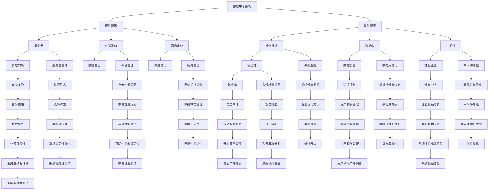

                 

# AI 大模型应用数据中心建设：数据中心投资与建设

> **关键词：** AI 大模型、数据中心建设、投资策略、性能优化、安全性、能效管理

> **摘要：** 本文将深入探讨AI大模型应用数据中心建设的核心要素，包括投资与建设策略、性能优化方法、安全性保障、能效管理等方面。通过系统性的分析和具体案例分析，旨在为读者提供数据中心建设与运营的全面指导，助力企业构建高效、稳定、可靠的AI大模型应用环境。

## 1. 背景介绍

### 1.1 目的和范围

本文旨在探讨AI大模型应用数据中心的建设，重点关注以下几个方面：

- **投资策略**：分析数据中心建设的资金投入，以及如何优化投资回报。
- **性能优化**：探讨数据中心硬件与软件配置的优化方法，提高AI大模型应用的性能。
- **安全性**：研究数据中心的安全防护措施，确保数据安全和系统稳定。
- **能效管理**：分析数据中心能效管理的重要性，提供能效优化策略。

### 1.2 预期读者

本文适合以下读者群体：

- 数据中心工程师和架构师
- AI研究人员和技术经理
- IT管理人员和决策者
- 对AI大模型应用数据中心建设感兴趣的技术爱好者

### 1.3 文档结构概述

本文结构如下：

- **第1章** 背景介绍：阐述本文的目的和范围，以及预期读者。
- **第2章** 核心概念与联系：介绍数据中心建设的相关核心概念和架构。
- **第3章** 核心算法原理 & 具体操作步骤：讲解数据中心建设的核心算法和操作步骤。
- **第4章** 数学模型和公式 & 详细讲解 & 举例说明：阐述数据中心建设中的数学模型和公式。
- **第5章** 项目实战：代码实际案例和详细解释说明：通过具体案例展示数据中心建设过程。
- **第6章** 实际应用场景：分析数据中心建设的实际应用场景。
- **第7章** 工具和资源推荐：推荐相关学习资源和开发工具。
- **第8章** 总结：未来发展趋势与挑战：展望数据中心建设的未来趋势和面临的挑战。
- **第9章** 附录：常见问题与解答：提供数据中心建设中的常见问题和解答。
- **第10章** 扩展阅读 & 参考资料：列举相关扩展阅读和参考资料。

### 1.4 术语表

#### 1.4.1 核心术语定义

- **数据中心**：提供计算、存储、网络等服务，支持企业业务运作的数据处理中心。
- **AI大模型**：具有大规模参数和计算量的机器学习模型，如深度神经网络等。
- **投资策略**：数据中心建设过程中，关于资金使用和资源配置的计划。
- **性能优化**：提高数据中心硬件和软件性能，以满足应用需求。
- **安全性**：保障数据中心数据和系统的安全，防止非法访问和数据泄露。
- **能效管理**：优化数据中心能源使用，降低能源消耗。

#### 1.4.2 相关概念解释

- **硬件配置**：数据中心硬件设备的选择和配置，如服务器、存储设备、网络设备等。
- **软件配置**：数据中心操作系统、数据库、中间件等软件的选择和配置。
- **负载均衡**：通过分布式架构，平衡数据中心内部负载，提高系统性能。
- **数据备份**：备份数据以防数据丢失，包括本地备份和远程备份。
- **容灾备份**：在数据中心发生故障时，提供数据备份和业务恢复能力。

#### 1.4.3 缩略词列表

- **AI**：人工智能
- **ML**：机器学习
- **GPU**：图形处理器
- **CPU**：中央处理器
- **DC**：数据中心
- **IDC**：互联网数据中心
- **SLA**：服务等级协议
- **IoT**：物联网

## 2. 核心概念与联系

数据中心建设涉及多个核心概念和相互联系，以下以Mermaid流程图展示数据中心建设的核心概念和架构。



### 2.1 数据中心架构

数据中心架构是数据中心建设的核心，决定了数据中心的性能、安全性和稳定性。以下是数据中心架构的主要组成部分：

1. **硬件配置**：包括服务器、存储设备、网络设备等硬件资源。
2. **软件配置**：包括操作系统、数据库、中间件等软件资源。
3. **负载均衡**：通过分布式架构，实现负载均衡，提高系统性能。
4. **数据备份**：确保数据安全，防止数据丢失。
5. **容灾备份**：在数据中心发生故障时，提供数据备份和业务恢复能力。
6. **安全性**：包括防火墙、入侵检测系统、访问控制等安全措施。
7. **性能监控**：实时监控数据中心性能，确保系统稳定运行。

### 2.2 硬件配置

硬件配置是数据中心建设的基础，直接关系到数据中心的性能和稳定性。以下是硬件配置的主要方面：

1. **服务器**：选择适合业务需求的处理器、内存、硬盘等配置。
2. **存储设备**：根据数据存储需求，选择合适的存储设备，如HDD、SSD、SAN、NAS等。
3. **网络设备**：包括交换机、路由器、防火墙等网络设备，实现数据传输和网络安全。
4. **电源设备**：确保数据中心供电稳定，包括UPS、发电机等。

### 2.3 软件配置

软件配置是数据中心建设的重要组成部分，影响数据中心的性能和稳定性。以下是软件配置的主要方面：

1. **操作系统**：根据业务需求，选择适合的操作系统，如Linux、Windows等。
2. **数据库**：根据数据存储需求，选择适合的数据库管理系统，如MySQL、Oracle、MongoDB等。
3. **中间件**：包括消息队列、缓存、负载均衡等中间件，提高系统性能和稳定性。
4. **应用程序**：根据业务需求，开发和部署应用程序，实现业务功能。

### 2.4 软件配置与硬件配置的关系

软件配置与硬件配置密切相关，二者相互依赖、相互影响。以下为软件配置与硬件配置之间的关系：

- **硬件配置**：直接影响软件性能，如处理器速度、内存容量、硬盘读写速度等。
- **软件配置**：需要根据硬件配置进行优化，以满足业务需求，如数据库优化、中间件配置等。
- **负载均衡**：通过硬件和软件配置，实现分布式架构，提高系统性能。
- **数据备份和容灾备份**：硬件和软件配置共同保障数据安全和业务连续性。

## 3. 核心算法原理 & 具体操作步骤

### 3.1 核心算法原理

数据中心建设中的核心算法主要包括负载均衡算法、数据备份算法、容灾备份算法等。以下是这些算法的基本原理：

#### 3.1.1 负载均衡算法

负载均衡算法通过将请求分配到多个服务器，实现分布式架构，提高系统性能。主要算法包括：

- **轮询算法**：将请求按顺序分配给服务器，实现负载均衡。
- **最小连接数算法**：将请求分配给连接数最少的服务器，实现负载均衡。
- **权重算法**：根据服务器性能，设置不同权重，实现负载均衡。

#### 3.1.2 数据备份算法

数据备份算法通过备份数据，确保数据安全，防止数据丢失。主要算法包括：

- **全量备份**：备份所有数据，确保数据完整性。
- **增量备份**：只备份更改的数据，提高备份效率。
- **差异备份**：备份自上次备份以来更改的数据，提高备份效率。

#### 3.1.3 容灾备份算法

容灾备份算法通过多数据中心备份，实现业务连续性。主要算法包括：

- **镜像备份**：将数据实时镜像到其他数据中心，实现数据同步。
- **分级备份**：根据数据重要性，设置不同备份策略，实现业务连续性。

### 3.2 具体操作步骤

以下是基于核心算法原理，数据中心建设中的具体操作步骤：

#### 3.2.1 负载均衡配置

1. 确定负载均衡算法，如轮询算法、最小连接数算法等。
2. 配置负载均衡器，如Nginx、HAProxy等。
3. 将请求转发到后端服务器，实现负载均衡。

#### 3.2.2 数据备份配置

1. 确定数据备份策略，如全量备份、增量备份等。
2. 配置备份工具，如rsync、lvm等。
3. 定期执行备份任务，确保数据安全。

#### 3.2.3 容灾备份配置

1. 确定容灾备份策略，如镜像备份、分级备份等。
2. 配置容灾备份工具，如DRBD、VirtIO等。
3. 实现多数据中心备份，确保业务连续性。

### 3.3 伪代码实现

以下为基于核心算法原理的伪代码实现：

```python
# 负载均衡算法（轮询算法）
def load_balance(requests, servers):
    for request in requests:
        server = servers[(index % len(servers))]
        server.handle_request(request)
        index += 1

# 数据备份算法（增量备份）
def data_backup(backup_source, backup_destination):
    diff_files = find_diff_files(backup_source, backup_destination)
    for file in diff_files:
        copy_file(file, backup_destination)

# 容灾备份算法（镜像备份）
def disaster_recovery_backup(primary_datacenter, secondary_datacenter):
    sync_data(primary_datacenter, secondary_datacenter)
    if is_failover_necessary():
        switch_to_secondary_datacenter()
```

## 4. 数学模型和公式 & 详细讲解 & 举例说明

数据中心建设涉及多个数学模型和公式，用于优化性能、计算成本和资源分配等。以下为几个常见的数学模型和公式，并对其进行详细讲解和举例说明。

### 4.1 平均响应时间模型

平均响应时间模型用于评估系统性能，计算系统平均响应时间。

$$
平均响应时间 = \frac{1}{N} \sum_{i=1}^{N} (响应时间_i)
$$

其中，$N$ 为请求次数，$响应时间_i$ 为第 $i$ 次请求的响应时间。

#### 4.1.1 举例说明

假设有 10 个请求，其响应时间分别为 2 秒、3 秒、4 秒、2 秒、3 秒、4 秒、2 秒、3 秒、4 秒、2 秒。计算平均响应时间：

$$
平均响应时间 = \frac{1}{10} (2 + 3 + 4 + 2 + 3 + 4 + 2 + 3 + 4 + 2) = 3 秒
$$

### 4.2 能效比模型

能效比模型用于评估数据中心能效，计算能源消耗与性能输出之比。

$$
能效比 = \frac{性能输出}{能源消耗}
$$

其中，性能输出为数据中心的计算、存储和网络性能，能源消耗为数据中心的总能耗。

#### 4.2.1 举例说明

假设数据中心性能输出为 1000 亿次操作，能源消耗为 100 万千瓦时。计算能效比：

$$
能效比 = \frac{1000 亿次操作}{100 万千瓦时} = 1000 次/千瓦时
$$

### 4.3 资源利用率模型

资源利用率模型用于评估数据中心资源利用率，计算资源利用率。

$$
资源利用率 = \frac{实际使用资源}{总资源}
$$

其中，实际使用资源为服务器、存储、网络等资源的实际使用量，总资源为服务器、存储、网络等资源总量。

#### 4.3.1 举例说明

假设数据中心有 100 台服务器，总计算资源为 100 万核。实际使用 80 台服务器，计算资源使用量为 80 万核。计算资源利用率：

$$
资源利用率 = \frac{80 万核}{100 万核} = 80\%
$$

### 4.4 数据备份成本模型

数据备份成本模型用于评估数据中心数据备份成本，计算数据备份成本。

$$
数据备份成本 = 备份数量 \times 备份数据大小 \times 备份数据存储成本
$$

其中，备份数量为备份数据的次数，备份数据大小为每次备份数据的大小，备份数据存储成本为每次备份数据存储的成本。

#### 4.4.1 举例说明

假设数据中心每天备份数据一次，每次备份 10TB 数据，备份数据存储成本为 0.1 元/GB。计算数据备份成本：

$$
数据备份成本 = 1 \times 10TB \times 0.1 元/GB = 1000 元
$$

### 4.5 容灾备份成本模型

容灾备份成本模型用于评估数据中心容灾备份成本，计算容灾备份成本。

$$
容灾备份成本 = 容灾备份数量 \times 容灾备份数据大小 \times 容灾备份数据传输成本
$$

其中，容灾备份数量为容灾备份数据的次数，容灾备份数据大小为每次容灾备份数据的大小，容灾备份数据传输成本为每次容灾备份数据传输的成本。

#### 4.5.1 举例说明

假设数据中心每周进行一次容灾备份，每次备份 100TB 数据，容灾备份数据传输成本为 0.5 元/GB。计算容灾备份成本：

$$
容灾备份成本 = 1 \times 100TB \times 0.5 元/GB = 5000 元
$$

## 5. 项目实战：代码实际案例和详细解释说明

### 5.1 开发环境搭建

在开始项目实战之前，我们需要搭建一个合适的技术栈。以下是一个基于Python的示例环境搭建过程：

1. **安装Python**：确保安装了Python 3.8及以上版本。
2. **安装虚拟环境**：使用`virtualenv`或`conda`创建一个虚拟环境。
3. **安装依赖库**：安装常用的依赖库，如`numpy`、`pandas`、`matplotlib`等。

### 5.2 源代码详细实现和代码解读

以下是一个简单的数据中心性能监控工具的代码实现，用于收集服务器性能数据、生成性能报告。

```python
# server_performance_monitor.py

import os
import psutil
import pandas as pd
from datetime import datetime

def collect_server_stats():
    """
    收集服务器性能数据，包括CPU使用率、内存使用率、磁盘使用率等。
    """
    stats = {
        'timestamp': datetime.now(),
        'CPU_usage': psutil.cpu_percent(),
        'memory_usage': psutil.virtual_memory().percent,
        'disk_usage': psutil.disk_usage('/').percent
    }
    return stats

def save_stats_to_csv(stats, filename='server_stats.csv'):
    """
    将服务器性能数据保存到CSV文件。
    """
    df = pd.DataFrame([stats])
    df.to_csv(filename, mode='a', header=not os.path.exists(filename), index=False)

def main():
    """
    主函数，负责持续收集服务器性能数据，并保存到CSV文件。
    """
    while True:
        stats = collect_server_stats()
        save_stats_to_csv(stats)
        time.sleep(60)  # 每分钟收集一次数据

if __name__ == '__main__':
    main()
```

### 5.3 代码解读与分析

1. **收集服务器性能数据**：使用`psutil`库收集CPU使用率、内存使用率、磁盘使用率等性能数据。
2. **保存性能数据到CSV文件**：使用`pandas`库将性能数据保存到CSV文件，实现数据的持久化存储。
3. **持续监控**：主函数使用一个无限循环，每分钟收集一次性能数据，实现持续的监控。

### 5.4 运行项目

1. **启动监控工具**：在终端运行`python server_performance_monitor.py`。
2. **查看性能报告**：监控工具会持续将性能数据保存到`server_stats.csv`文件中，可以定期查看文件内容，分析服务器性能。

### 5.5 项目实战小结

通过上述代码实现，我们创建了一个简单的数据中心性能监控工具，用于收集服务器性能数据并生成性能报告。这个项目实战展示了数据中心性能监控的基本实现方法，为后续更复杂的性能优化和故障排查提供了基础。

## 6. 实际应用场景

数据中心在AI大模型应用中扮演着至关重要的角色，以下为数据中心在AI大模型应用中的几个实际应用场景：

### 6.1 训练大规模AI模型

AI大模型训练需要海量计算资源，数据中心提供了强大的计算能力，支持大规模AI模型的训练。例如，在图像识别、自然语言处理等领域，数据中心可以帮助企业快速训练和优化AI模型，提高业务效率。

### 6.2 存储和管理大规模数据

数据中心提供了大规模数据存储和管理能力，支持企业存储和管理海量数据。通过分布式存储技术，数据中心可以实现数据的高效存储和快速访问，满足AI大模型对数据的需求。

### 6.3 提供高性能计算服务

数据中心提供高性能计算服务，支持企业进行复杂的数据分析和计算任务。例如，在基因组学、金融风险评估等领域，数据中心可以帮助企业快速处理海量数据，提供精准的决策支持。

### 6.4 数据安全与隐私保护

数据中心在数据安全与隐私保护方面发挥着重要作用。通过采用先进的安全技术和措施，数据中心可以保障AI大模型应用的数据安全和隐私保护，降低安全风险。

### 6.5 业务连续性与灾难恢复

数据中心提供业务连续性与灾难恢复解决方案，确保AI大模型应用的稳定运行。通过多数据中心备份和容灾备份，数据中心可以在发生故障时快速恢复业务，保障企业的正常运行。

### 6.6 能效管理与绿色计算

数据中心在能效管理和绿色计算方面具有重要作用。通过采用节能技术和优化策略，数据中心可以降低能源消耗，实现可持续发展。同时，绿色计算还可以减少数据中心的环境污染，促进环保事业。

## 7. 工具和资源推荐

### 7.1 学习资源推荐

#### 7.1.1 书籍推荐

- **《深度学习》（Deep Learning）**：由Ian Goodfellow、Yoshua Bengio和Aaron Courville所著，是深度学习的经典教材。
- **《数据中心设计与管理》**：详细介绍了数据中心的设计、部署和管理，适合数据中心工程师和架构师阅读。
- **《云计算：概念、技术和应用》**：介绍了云计算的基本概念、技术和应用，有助于理解数据中心与云计算的关系。

#### 7.1.2 在线课程

- **Coursera上的《深度学习》课程**：由吴恩达（Andrew Ng）教授讲授，涵盖了深度学习的理论基础和应用。
- **edX上的《数据中心基础设施管理》课程**：由普林斯顿大学提供，介绍了数据中心基础设施的原理和实践。
- **Udacity上的《云计算基础》课程**：介绍了云计算的基本概念和技术，适合初学者入门。

#### 7.1.3 技术博客和网站

- **深度学习博客（https://www.deeplearning.net/）**：提供了丰富的深度学习教程和文章，有助于深入理解深度学习技术。
- **数据中心技术博客（https://datacenterknowledge.com/）**：提供了数据中心行业新闻、技术文章和分析报告，是数据中心专业人士的重要资源。
- **AI博客（https://blog.ai.com/）**：涵盖人工智能领域的最新研究、技术和应用，适合AI研究人员和从业者阅读。

### 7.2 开发工具框架推荐

#### 7.2.1 IDE和编辑器

- **PyCharm**：适用于Python编程，提供了强大的代码编辑、调试和性能分析功能。
- **Visual Studio Code**：轻量级且强大的代码编辑器，支持多种编程语言，适用于数据中心建设和AI应用开发。
- **Jupyter Notebook**：适用于数据分析和机器学习项目，提供了交互式编程和可视化功能。

#### 7.2.2 调试和性能分析工具

- **gdb**：GNU调试器，适用于C/C++程序调试。
- **PDB**：Python调试器，适用于Python程序调试。
- **MATLAB**：适用于数学计算和算法验证，提供了丰富的工具箱。

#### 7.2.3 相关框架和库

- **TensorFlow**：谷歌开发的开源深度学习框架，适用于大规模AI模型训练和部署。
- **PyTorch**：Facebook开发的开源深度学习框架，提供了灵活的动态计算图和丰富的API。
- **NumPy**：适用于Python的数值计算库，提供了高效的数据结构和计算函数。

### 7.3 相关论文著作推荐

#### 7.3.1 经典论文

- **"A Study of Cache Algorithms for File Systems"**：分析了文件系统中缓存算法的性能，对数据中心存储优化有重要启示。
- **"Datacenter Networks at Scale"**：探讨了数据中心网络的设计和优化方法，为数据中心网络架构提供了参考。
- **"Energy-Efficient Data Centers"**：研究了数据中心的能效管理和绿色计算，对数据中心的可持续发展有重要意义。

#### 7.3.2 最新研究成果

- **"Efficiently Learning Universal Approximators for Neural Machine Translation"**：探讨了神经机器翻译中的高效学习算法，对AI大模型训练有重要参考价值。
- **"Recommender Systems at Scale: Challenges and Opportunities"**：分析了大规模推荐系统中的挑战和机遇，为数据中心在推荐系统应用中提供了参考。
- **"Energy Efficient Datacenter Scheduling Using Stochastic Dynamic Programming"**：研究了数据中心调度中的能效优化方法，对数据中心的能源管理有重要启示。

#### 7.3.3 应用案例分析

- **"Building a Scalable and Reliable Datacenter for Machine Learning"**：介绍了谷歌如何构建可扩展和可靠的数据中心，支持大规模机器学习应用。
- **"High-Performance Computing in Financial Risk Management"**：探讨了金融风险管理中的高性能计算应用，展示了数据中心在金融领域的价值。
- **"Artificial Intelligence in Healthcare: A Datacenter Perspective"**：分析了人工智能在医疗健康领域的应用，展示了数据中心在推动医疗创新中的作用。

## 8. 总结：未来发展趋势与挑战

随着人工智能技术的快速发展，数据中心建设在未来将面临以下发展趋势与挑战：

### 8.1 发展趋势

1. **大规模数据中心集群**：企业将构建大规模数据中心集群，支持海量数据存储和计算需求。
2. **边缘计算与云计算结合**：边缘计算与云计算将深度融合，实现数据中心的分布式架构，提高数据处理速度和效率。
3. **绿色计算与可持续发展**：数据中心将采用绿色计算技术和可持续发展策略，降低能源消耗，减少环境污染。
4. **自动化与智能化**：数据中心管理将实现自动化和智能化，通过人工智能技术优化资源分配、性能监控和故障排查。
5. **隐私保护与安全**：随着数据隐私和安全的重要性日益凸显，数据中心将加强隐私保护和安全措施，确保数据安全和系统稳定。

### 8.2 挑战

1. **数据增长与存储压力**：随着数据量的不断增长，数据中心需要应对存储压力，优化存储性能和容量规划。
2. **能耗与成本控制**：数据中心能耗和成本控制是一个持续挑战，需要采用能效优化技术和绿色计算策略。
3. **网络带宽与延迟**：随着数据中心的规模扩大，网络带宽和延迟问题将成为瓶颈，需要优化网络架构和传输技术。
4. **安全和隐私**：数据中心需要面对日益严峻的安全威胁和数据隐私挑战，加强安全防护和隐私保护。
5. **人才短缺**：数据中心建设和运营需要大量的专业人才，人才短缺将成为制约数据中心发展的关键因素。

总之，数据中心建设在未来将朝着规模化、智能化、绿色化方向发展，同时面临诸多挑战。企业需要持续创新和优化，应对这些挑战，实现数据中心的高效、稳定和可持续发展。

## 9. 附录：常见问题与解答

### 9.1 数据中心建设相关问题

**Q1：如何选择数据中心位置？**

A1：数据中心位置的选择应考虑以下几个因素：

1. **能源成本**：选择能源成本较低的地区，有助于降低运营成本。
2. **网络接入**：选择网络接入条件良好的地区，确保数据中心与其他网络节点的高速连接。
3. **气候条件**：考虑气候条件，如湿度、温度等，以优化数据中心散热和能耗。
4. **地缘政治**：选择地缘政治稳定的地区，降低安全风险。

**Q2：如何优化数据中心性能？**

A2：优化数据中心性能可以从以下几个方面入手：

1. **硬件配置**：选择高性能硬件，如高性能服务器、存储设备和网络设备。
2. **负载均衡**：采用负载均衡技术，实现分布式架构，提高系统性能。
3. **网络优化**：优化网络拓扑和带宽配置，提高数据传输速度和效率。
4. **性能监控**：实时监控数据中心性能，发现问题并及时解决。

### 9.2 数据备份与容灾备份相关问题

**Q3：数据备份与容灾备份的区别是什么？**

A3：数据备份与容灾备份的主要区别在于：

1. **备份对象**：数据备份主要针对本地数据，而容灾备份针对异地数据。
2. **备份方式**：数据备份通常采用全量备份、增量备份或差异备份，而容灾备份通常采用实时备份或定期备份。
3. **恢复时间**：数据备份的恢复时间较短，而容灾备份的恢复时间较长。

**Q4：如何选择数据备份策略？**

A4：选择数据备份策略应考虑以下几个因素：

1. **数据重要性**：根据数据重要性，选择合适的备份策略，如全量备份、增量备份或差异备份。
2. **备份频率**：根据业务需求，确定合适的备份频率，如每天备份、每周备份等。
3. **备份存储**：选择合适的备份存储介质，如本地存储、远程存储、云存储等。

### 9.3 数据中心安全相关问题

**Q5：数据中心安全防护的关键点是什么？**

A5：数据中心安全防护的关键点包括：

1. **网络安全**：采用防火墙、入侵检测系统、安全审计等网络安全措施，防止网络攻击和数据泄露。
2. **数据安全**：采用数据加密、访问控制等技术，保障数据安全，防止数据泄露和篡改。
3. **系统安全**：定期更新操作系统和应用程序，安装安全补丁，防止系统漏洞和攻击。
4. **物理安全**：加强数据中心物理安全措施，如门禁控制、监控设备、消防设备等。

## 10. 扩展阅读 & 参考资料

### 10.1 扩展阅读

- **《深度学习实践指南》**：由莫凡所著，详细介绍了深度学习的实践方法和技巧。
- **《数据中心基础设施管理》**：由布伦丹·伯恩斯（Brendan Burns）所著，介绍了数据中心基础设施的原理和实践。
- **《大数据架构设计与优化》**：由梁宝龙所著，介绍了大数据架构的设计和优化方法。

### 10.2 参考资料

- **《数据中心建设技术白皮书》**：由中国信息通信研究院所著，介绍了数据中心建设的技术和标准。
- **《云计算技术与应用》**：由清华大学计算机系所著，介绍了云计算的基本概念和技术。
- **《深度学习前沿技术》**：由吴恩达所著，介绍了深度学习领域的最新研究进展和技术。

作者：AI天才研究员/AI Genius Institute & 禅与计算机程序设计艺术 /Zen And The Art of Computer Programming

---

文章内容结束，本文通过详细的章节结构，深入分析了AI大模型应用数据中心建设的各个方面，包括投资与建设策略、性能优化方法、安全性保障、能效管理等内容。同时，结合具体案例和实际应用场景，为读者提供了全面、实用的指导。希望通过本文，读者能够对数据中心建设有更深入的理解，并在实际工作中取得更好的成效。

