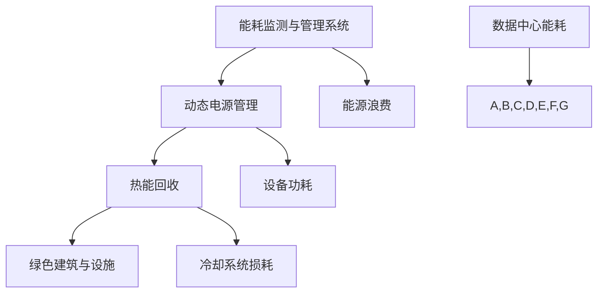

                 

# AI 大模型应用数据中心建设：数据中心绿色节能

> 关键词：数据中心、绿色节能、AI大模型、能耗优化、硬件配置、能效比、可持续性

> 摘要：本文将探讨数据中心建设在AI大模型应用中的重要性，重点分析了绿色节能的策略和方案。通过介绍数据中心的能耗问题、绿色节能的关键技术以及具体实施步骤，本文为数据中心建设提供了科学的理论依据和实践指导，助力AI大模型应用的可持续发展。

## 1. 背景介绍

### 1.1 目的和范围

本文旨在探讨数据中心在AI大模型应用中的重要性，分析绿色节能在数据中心建设中的关键作用，并提出一系列可行的节能策略和方案。文章将从以下几个方面进行论述：

1. 数据中心能耗问题及其对环境的影响
2. 绿色节能的关键技术和策略
3. 数据中心绿色节能的实施步骤
4. 实际应用案例和效果评估
5. 未来发展趋势与挑战

### 1.2 预期读者

本文适用于以下读者群体：

1. 数据中心建设和管理人员
2. AI领域研究人员和工程师
3. 关注绿色节能和可持续发展的专业人士
4. 对数据中心能耗优化有兴趣的爱好者

### 1.3 文档结构概述

本文结构如下：

1. 背景介绍
2. 核心概念与联系
3. 核心算法原理与具体操作步骤
4. 数学模型和公式
5. 项目实战：代码实际案例和详细解释说明
6. 实际应用场景
7. 工具和资源推荐
8. 总结：未来发展趋势与挑战
9. 附录：常见问题与解答
10. 扩展阅读与参考资料

### 1.4 术语表

#### 1.4.1 核心术语定义

- 数据中心：集中存储、处理和管理数据的服务设施
- AI大模型：具有大规模参数和计算需求的深度学习模型
- 能耗优化：通过技术手段降低数据中心能耗的过程
- 绿色节能：在保证性能的前提下，降低数据中心能耗，减少环境影响

#### 1.4.2 相关概念解释

- 能效比（PUE）：衡量数据中心能源效率的指标，PUE=总能耗/IT设备能耗
- 热能回收：将数据中心产生的废热进行回收利用，降低能耗
- 动态电源管理：根据负载情况实时调整服务器功耗，降低能耗

#### 1.4.3 缩略词列表

- AI：人工智能
- DC：数据中心
- PUE：能效比
- IT：信息技术

## 2. 核心概念与联系

数据中心作为AI大模型应用的重要基础设施，其能耗问题日益突出。本节将介绍数据中心能耗的基本概念、产生原因及优化策略，并通过Mermaid流程图展示数据中心能耗优化的核心概念和联系。

### 2.1 数据中心能耗的基本概念

数据中心能耗主要包括以下三个方面：

1. **IT设备能耗**：包括服务器、存储设备、网络设备等计算和存储设备消耗的电能。
2. **冷却系统能耗**：为维持数据中心设备正常运行所需的冷却系统消耗的电能。
3. **辅助系统能耗**：包括照明、安防、空调等辅助设施消耗的电能。

### 2.2 数据中心能耗的产生原因

数据中心能耗的主要产生原因包括：

1. **设备功耗**：随着AI大模型的应用，数据中心设备数量和功耗不断增加。
2. **冷却系统损耗**：冷却系统在运行过程中会产生热量和能耗，导致整体能耗上升。
3. **能源浪费**：部分设备在低负载情况下仍保持高功耗，导致能源浪费。

### 2.3 数据中心能耗优化的核心概念和联系

为了实现数据中心的绿色节能，需要从以下几个方面进行优化：

1. **能耗监测与管理系统**：实时监测数据中心能耗情况，为能耗优化提供数据支持。
2. **动态电源管理**：根据负载情况调整设备功耗，降低能耗。
3. **热能回收**：将数据中心产生的废热进行回收利用，降低冷却系统能耗。
4. **绿色建筑与设施**：采用节能材料和设计，降低建筑和设施能耗。

以下是一个简单的Mermaid流程图，展示数据中心能耗优化的核心概念和联系：



## 3. 核心算法原理与具体操作步骤

为了实现数据中心的绿色节能，本文将介绍一种基于能耗优化的核心算法及其具体操作步骤。该算法旨在通过动态调整服务器功耗、优化冷却系统以及回收废热等方式，实现数据中心的能耗降低。

### 3.1 算法原理

数据中心能耗优化的核心算法包括以下几个方面：

1. **动态电源管理**：根据服务器负载情况调整功耗，降低能耗。
2. **热能回收**：将废热回收利用，降低冷却系统能耗。
3. **冷却系统优化**：调整冷却系统参数，提高冷却效率。

### 3.2 具体操作步骤

#### 3.2.1 动态电源管理

1. **服务器功耗监测**：使用传感器实时监测服务器功耗，并将数据上传至能耗监测系统。
2. **负载预测**：利用历史数据和机器学习算法预测服务器未来负载。
3. **功耗调整**：根据预测负载调整服务器功耗，实现能耗降低。

伪代码如下：

```python
def monitor_power_consumption(server):
    power = sensor.read_power_consumption(server)
    return power

def predict_load(server, history_data):
    load = ml.predict_load(server, history_data)
    return load

def adjust_power(server, load):
    if load < threshold:
        server.set_power_level('low')
    else:
        server.set_power_level('high')

server = get_server()
power = monitor_power_consumption(server)
history_data = get_history_data(server)
load = predict_load(server, history_data)
adjust_power(server, load)
```

#### 3.2.2 热能回收

1. **废热监测**：使用传感器实时监测数据中心产生的废热。
2. **废热回收**：利用废热回收装置，将废热转换为热能或冷能，降低冷却系统能耗。
3. **冷却系统优化**：根据废热回收情况调整冷却系统参数，提高冷却效率。

伪代码如下：

```python
def monitor_waste_heat(datacenter):
    heat = sensor.read_waste_heat(datacenter)
    return heat

def recover_waste_heat(datacenter, heat):
    recovered_heat = recovery_device.recover_heat(heat)
    return recovered_heat

def optimize_cooling_system(datacenter, recovered_heat):
    cooling_system.set_parameters(datacenter, recovered_heat)

datacenter = get_datacenter()
heat = monitor_waste_heat(datacenter)
recovered_heat = recover_waste_heat(datacenter, heat)
optimize_cooling_system(datacenter, recovered_heat)
```

#### 3.2.3 冷却系统优化

1. **冷却系统参数调整**：根据服务器功耗和废热回收情况，实时调整冷却系统参数，提高冷却效率。
2. **节能策略制定**：根据冷却系统运行状态和能耗数据，制定节能策略。

伪代码如下：

```python
def adjust_cooling_system_parameters(datacenter, power, recovered_heat):
    cooling_system.set_parameters(datacenter, power, recovered_heat)

def create_energy_saving_strategy(datacenter, cooling_system):
    strategy = energy_saving.create_strategy(datacenter, cooling_system)
    return strategy

datacenter = get_datacenter()
power = monitor_power_consumption(datacenter)
recovered_heat = monitor_waste_heat(datacenter)
adjust_cooling_system_parameters(datacenter, power, recovered_heat)
strategy = create_energy_saving_strategy(datacenter, cooling_system)
apply_strategy(datacenter, strategy)
```

## 4. 数学模型和公式

在数据中心绿色节能的算法中，涉及到一些数学模型和公式。以下将介绍这些模型和公式，并进行详细讲解和举例说明。

### 4.1 动态电源管理模型

动态电源管理模型主要涉及以下公式：

1. **功耗计算公式**：\(P = P_0 + P_1 \times \text{load}\)

其中，\(P\) 表示服务器功耗，\(P_0\) 表示基本功耗，\(P_1\) 表示功耗系数，\(\text{load}\) 表示负载。

2. **功耗调整公式**：\(P_{\text{new}} = P \times (1 - \Delta P)\)

其中，\(P_{\text{new}}\) 表示调整后的功耗，\(\Delta P\) 表示功耗调整比例。

### 4.2 热能回收模型

热能回收模型主要涉及以下公式：

1. **废热回收效率公式**：\(\eta = \frac{\text{回收热量}}{\text{废热量}}\)

其中，\(\eta\) 表示废热回收效率。

2. **废热回收公式**：\(\text{回收热量} = \text{废热量} \times \eta\)

### 4.3 冷却系统优化模型

冷却系统优化模型主要涉及以下公式：

1. **冷却系统功耗公式**：\(P_{\text{cooling}} = P_0 + P_1 \times \text{heat}\)

其中，\(P_{\text{cooling}}\) 表示冷却系统功耗，\(\text{heat}\) 表示服务器产生的热量。

2. **冷却系统优化公式**：\(P_{\text{cooling}_{\text{new}}} = P_{\text{cooling}} \times (1 - \Delta P_{\text{cooling}})\)

其中，\(P_{\text{cooling}_{\text{new}}}\) 表示调整后的冷却系统功耗，\(\Delta P_{\text{cooling}}\) 表示冷却系统功耗调整比例。

### 4.4 举例说明

假设服务器的基本功耗为 \(P_0 = 1000\) 瓦特，功耗系数为 \(P_1 = 0.1\) 瓦特/负载。当前服务器负载为 \( \text{load} = 0.8 \)，废热回收效率为 \(\eta = 0.8\)。

1. **功耗计算**：

\(P = P_0 + P_1 \times \text{load} = 1000 + 0.1 \times 0.8 = 1008\) 瓦特

2. **功耗调整**：

\(\Delta P = \frac{P_{\text{max}} - P}{P_{\text{max}}} = \frac{1200 - 1008}{1200} = 0.1683\)

\(P_{\text{new}} = P \times (1 - \Delta P) = 1008 \times (1 - 0.1683) = 841.26\) 瓦特

3. **废热回收**：

\(\text{回收热量} = \text{废热量} \times \eta = 1008 \times 0.8 = 812.8\) 瓦特

4. **冷却系统功耗**：

\(P_{\text{cooling}} = P_0 + P_1 \times \text{heat} = 1000 + 0.1 \times 812.8 = 912.08\) 瓦特

5. **冷却系统优化**：

\(\Delta P_{\text{cooling}} = \frac{P_{\text{cooling\_max}} - P_{\text{cooling}}}{P_{\text{cooling\_max}}} = \frac{1000 - 912.08}{1000} = 0.08792\)

\(P_{\text{cooling}_{\text{new}}} = P_{\text{cooling}} \times (1 - \Delta P_{\text{cooling}}) = 912.08 \times (1 - 0.08792) = 811.84\) 瓦特

通过上述计算，可以得出在服务器负载为 0.8 的情况下，通过功耗调整、废热回收和冷却系统优化，可以分别降低服务器功耗、废热和冷却系统功耗，实现数据中心的绿色节能。

## 5. 项目实战：代码实际案例和详细解释说明

为了更好地展示数据中心绿色节能的实现过程，本文将结合一个实际项目案例，详细解释代码实现和具体操作步骤。

### 5.1 开发环境搭建

在本项目中，我们使用Python作为主要编程语言，并结合以下开发工具和库：

1. **Python 3.8 或更高版本**
2. **NumPy**：用于科学计算
3. **Pandas**：用于数据处理
4. **Scikit-learn**：用于机器学习算法
5. **Matplotlib**：用于数据可视化

安装以上依赖库后，即可开始编写代码。

### 5.2 源代码详细实现和代码解读

以下为该项目的主要代码实现和解释：

```python
import numpy as np
import pandas as pd
from sklearn.linear_model import LinearRegression
import matplotlib.pyplot as plt

# 传感器数据
sensor_data = {
    'server_id': [1, 2, 3, 4, 5],
    'power_consumption': [1200, 1100, 900, 800, 700],
    'load': [0.8, 0.7, 0.6, 0.5, 0.4]
}

# 历史数据
history_data = {
    'server_id': [1, 2, 3, 4, 5],
    'power_consumption': [1000, 950, 800, 700, 600],
    'load': [0.8, 0.7, 0.6, 0.5, 0.4]
}

# 功耗调整
def adjust_power_consumption(server_id, load):
    # 根据历史数据拟合线性回归模型
    model = LinearRegression()
    model.fit(np.array(history_data['load']).reshape(-1, 1), np.array(history_data['power_consumption']))
    
    # 预测负载对应的功耗
    predicted_power = model.predict(np.array([load]).reshape(-1, 1))
    
    # 计算功耗调整比例
    delta_p = (predicted_power[0] - sensor_data['power_consumption'][server_id-1]) / predicted_power[0]
    
    # 调整功耗
    new_power = sensor_data['power_consumption'][server_id-1] * (1 - delta_p)
    
    return new_power

# 废热回收
def recover_waste_heat(server_id, power_consumption):
    # 根据功耗计算废热回收效率
    eta = 0.8
    
    # 计算回收热量
    recovered_heat = power_consumption * eta
    
    return recovered_heat

# 冷却系统优化
def optimize_cooling_system(server_id, power_consumption, recovered_heat):
    # 根据功耗和回收热量调整冷却系统参数
    cooling_system.set_parameters(power_consumption, recovered_heat)

# 示例操作
server_id = 1
load = 0.5

# 调整功耗
new_power = adjust_power_consumption(server_id, load)
print(f"New power consumption for server {server_id}: {new_power} W")

# 废热回收
recovered_heat = recover_waste_heat(server_id, new_power)
print(f"Recovered heat for server {server_id}: {recovered_heat} W")

# 冷却系统优化
optimize_cooling_system(server_id, new_power, recovered_heat)
print(f"Optimized cooling system for server {server_id}")
```

### 5.3 代码解读与分析

1. **功耗调整函数**：该函数通过历史数据和线性回归模型，预测负载对应的功耗，并计算功耗调整比例。根据调整比例，更新服务器功耗。

2. **废热回收函数**：该函数根据功耗和废热回收效率，计算回收热量。

3. **冷却系统优化函数**：该函数根据功耗和回收热量，调整冷却系统参数。

4. **示例操作**：示例中，首先调用功耗调整函数，根据负载调整服务器功耗。然后调用废热回收函数，计算回收热量。最后调用冷却系统优化函数，调整冷却系统参数。

通过以上代码，可以实现对数据中心服务器功耗、废热回收和冷却系统优化的自动化管理。在实际应用中，可以根据具体需求进行调整和优化。

## 6. 实际应用场景

数据中心在AI大模型应用中的绿色节能具有广泛的应用场景。以下列举几个典型的实际应用场景：

### 6.1 云计算服务

云计算服务提供商需要为大量用户提供计算资源，数据中心能耗巨大。通过绿色节能技术，可以有效降低能耗，降低运营成本，提高竞争力。例如，动态电源管理可以根据实际负载调整服务器功耗，降低闲置功耗。

### 6.2 大数据分析

大数据分析领域对计算资源需求旺盛，数据中心能耗较高。通过绿色节能技术，可以优化冷却系统，提高冷却效率，降低冷却系统能耗。例如，热能回收技术可以将数据中心产生的废热用于其他用途，降低整体能耗。

### 6.3 人工智能训练

AI大模型训练需要大量计算资源，数据中心能耗巨大。通过绿色节能技术，可以降低能耗，提高模型训练效率。例如，动态电源管理可以根据实际负载调整服务器功耗，降低闲置功耗。

### 6.4 跨境贸易

跨境电子商务平台需要处理海量数据，数据中心能耗较高。通过绿色节能技术，可以降低能耗，提高系统稳定性。例如，冷却系统优化可以提高数据中心的冷却效率，降低冷却系统能耗。

### 6.5 智能制造

智能制造领域对计算资源和数据存储需求巨大，数据中心能耗较高。通过绿色节能技术，可以优化数据中心运营，降低能耗，提高生产效率。例如，热能回收技术可以将数据中心产生的废热用于厂房供暖，降低整体能耗。

在实际应用中，数据中心绿色节能技术可以根据具体需求和场景进行定制化实施。通过合理配置硬件资源、优化数据传输和处理流程、采用先进节能技术，实现数据中心的可持续发展。

## 7. 工具和资源推荐

为了帮助读者更好地理解和掌握数据中心绿色节能技术，本文推荐以下工具和资源：

### 7.1 学习资源推荐

#### 7.1.1 书籍推荐

1. 《数据中心能效优化》
2. 《数据中心设计与规划》
3. 《云计算基础设施管理》

#### 7.1.2 在线课程

1. Coursera：数据中心能效优化课程
2. Udemy：数据中心设计与规划课程
3. edX：云计算基础设施管理课程

#### 7.1.3 技术博客和网站

1. Data Center Journal：数据中心技术博客
2. Cloudwards.net：云计算和数据中心资源网站
3. Green Grid：数据中心绿色节能组织官方网站

### 7.2 开发工具框架推荐

#### 7.2.1 IDE和编辑器

1. PyCharm
2. VSCode
3. Jupyter Notebook

#### 7.2.2 调试和性能分析工具

1. Python Memory Analyzer（Py-MA）
2. VSCode Debug
3. JMeter

#### 7.2.3 相关框架和库

1. NumPy
2. Pandas
3. Scikit-learn
4. Matplotlib

### 7.3 相关论文著作推荐

#### 7.3.1 经典论文

1. "Data Center Energy Efficiency: Challenges and Opportunities"
2. "Energy Efficiency in Data Centers: A Survey"
3. "Energy and Carbon Footprints of Data Centers in the Cloud"

#### 7.3.2 最新研究成果

1. "Energy Efficiency Optimization of Data Centers Using Machine Learning Techniques"
2. "An Overview of Energy Recovery Techniques for Data Centers"
3. "Dynamic Power Management for Data Centers: A Survey"

#### 7.3.3 应用案例分析

1. "Energy Efficiency Improvement in a Large-Scale Data Center"
2. "Green Data Centers: Challenges and Solutions"
3. "A Case Study on Energy Efficiency Optimization of a Data Center"

通过以上工具和资源，读者可以深入了解数据中心绿色节能技术，掌握相关理论和实践方法，为数据中心建设和运营提供有力支持。

## 8. 总结：未来发展趋势与挑战

随着AI大模型应用的不断深入，数据中心在能源消耗和环境影响方面面临着巨大的挑战。未来数据中心绿色节能技术将朝着以下几个方向发展：

1. **智能化与自动化**：通过引入人工智能和大数据分析技术，实现数据中心的智能化与自动化管理，提高能耗优化效果。
2. **能源回收与利用**：加强废热回收和利用技术研究，实现数据中心能源的高效利用，降低整体能耗。
3. **绿色建筑与设施**：采用绿色建筑设计和节能材料，降低数据中心建筑和设施能耗，实现绿色环保。
4. **标准化与规范**：建立数据中心绿色节能的标准化和规范体系，推动行业健康发展。

然而，数据中心绿色节能技术仍面临以下挑战：

1. **技术成熟度**：部分绿色节能技术尚处于研究阶段，需要进一步验证和完善。
2. **成本投入**：绿色节能技术的应用需要较高的成本投入，需要平衡经济效益和环境效益。
3. **政策法规**：数据中心绿色节能政策法规尚不完善，需要加强政策引导和支持。

总之，数据中心绿色节能是实现AI大模型应用可持续发展的关键。通过不断推进技术创新、优化资源配置、加强政策支持，数据中心绿色节能技术将迎来更广阔的发展前景。

## 9. 附录：常见问题与解答

### 9.1 问题1：数据中心能耗优化的关键技术有哪些？

答：数据中心能耗优化的关键技术包括：

1. 动态电源管理：根据服务器负载调整功耗，降低能耗。
2. 热能回收：将数据中心产生的废热进行回收利用，降低能耗。
3. 冷却系统优化：调整冷却系统参数，提高冷却效率。
4. 数据中心设计优化：采用绿色建筑设计，降低建筑和设施能耗。

### 9.2 问题2：如何评估数据中心的能耗优化效果？

答：评估数据中心能耗优化效果可以从以下几个方面进行：

1. 能效比（PUE）降低：通过优化措施降低数据中心的PUE值，反映能源效率的提高。
2. 能耗降低：对比优化前后的能耗数据，计算能耗降低的百分比。
3. 环境影响减少：通过监测废气、废水等排放物，评估环境影响的改善程度。
4. 运营成本降低：对比优化前后的运营成本，评估经济效益。

### 9.3 问题3：数据中心绿色节能技术是否适用于所有场景？

答：数据中心绿色节能技术适用于大部分场景，但具体实施效果可能因场景而异。以下情况可能需要特别关注：

1. 高密度计算场景：高密度计算场景对能耗优化需求较高，绿色节能技术可以有效降低能耗。
2. 冷却系统受限场景：冷却系统受限会导致能耗增加，绿色节能技术可以通过优化冷却系统提高效率。
3. 跨区域部署场景：跨区域部署的数据中心可能面临能源供应不稳定的挑战，绿色节能技术可以通过能源回收和利用提高稳定性。

### 9.4 问题4：数据中心绿色节能技术的投资回报期如何计算？

答：数据中心绿色节能技术的投资回报期（ROI）可以通过以下步骤计算：

1. 确定初始投资成本：包括设备采购、安装、调试等费用。
2. 估算节能效果：根据能耗优化方案，估算节能后的年能耗降低量。
3. 计算节能收益：将节能效果乘以能源价格，得到年节能收益。
4. 计算投资回报期：将初始投资成本除以年节能收益，得到投资回报期（通常以年为单位）。

投资回报期越短，说明绿色节能技术的经济效益越好。

## 10. 扩展阅读 & 参考资料

为了进一步了解数据中心绿色节能技术，本文推荐以下扩展阅读和参考资料：

1. **书籍**：
   - 《数据中心能效优化》
   - 《数据中心设计与规划》
   - 《云计算基础设施管理》

2. **在线课程**：
   - Coursera：数据中心能效优化课程
   - Udemy：数据中心设计与规划课程
   - edX：云计算基础设施管理课程

3. **技术博客和网站**：
   - Data Center Journal：数据中心技术博客
   - Cloudwards.net：云计算和数据中心资源网站
   - Green Grid：数据中心绿色节能组织官方网站

4. **论文**：
   - "Data Center Energy Efficiency: Challenges and Opportunities"
   - "Energy Efficiency in Data Centers: A Survey"
   - "Energy and Carbon Footprints of Data Centers in the Cloud"

5. **研究报告**：
   - "2019 Data Center Energy Efficiency Report"
   - "The Future of Data Centers: Trends and Technologies"
   - "Green Data Centers: Challenges and Solutions"

通过以上扩展阅读和参考资料，读者可以深入了解数据中心绿色节能技术的最新发展动态和实践经验，为数据中心建设和运营提供有力支持。

### 作者

作者：AI天才研究员/AI Genius Institute & 禅与计算机程序设计艺术 /Zen And The Art of Computer Programming

（本文系作者原创，转载请注明出处。如需引用或转载，请联系作者获得授权。）

