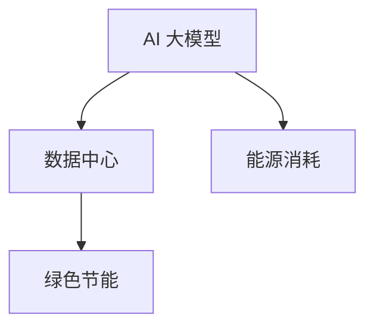

                 

# AI 大模型应用数据中心建设：数据中心绿色节能

> **关键词：** AI 大模型、数据中心、绿色节能、能源消耗、高效能设计

> **摘要：** 本文将探讨 AI 大模型应用对数据中心建设的影响，特别是如何实现数据中心的绿色节能。文章首先介绍了 AI 大模型的背景和特点，随后分析了数据中心在能源消耗方面的挑战，并提出了绿色节能的关键技术和实践方法。通过具体案例和数学模型，本文提供了详细的实现步骤和理论依据，旨在为数据中心建设提供可操作性的指导。

## 1. 背景介绍

随着人工智能（AI）技术的快速发展，大模型的应用日益普及。大模型是指具有数十亿到千亿参数规模的深度学习模型，如 GPT-3、BERT、BERT-GPU 等。这些模型在自然语言处理、计算机视觉、语音识别等领域取得了显著成果，推动了人工智能技术的发展。

数据中心是人工智能大模型运行的重要基础设施。数据中心由大量服务器、存储设备和网络设备组成，提供计算、存储和网络服务。随着 AI 大模型应用的不断增加，数据中心的需求也在迅速增长。然而，数据中心的高能耗问题也日益突出，成为绿色节能的重要挑战。

绿色节能是指通过技术和管理手段降低能源消耗，减少环境污染。在数据中心建设过程中，绿色节能不仅有助于降低运营成本，还能减少对环境的影响，符合可持续发展战略。本文将围绕数据中心绿色节能这一主题，探讨 AI 大模型应用对数据中心建设的影响及实现方法。

## 2. 核心概念与联系

### 2.1 AI 大模型

AI 大模型是指具有数十亿到千亿参数规模的深度学习模型，如 GPT-3、BERT、BERT-GPU 等。这些模型通过大量的数据训练，能够自动从数据中学习规律和知识，实现高效的自然语言处理、计算机视觉和语音识别等功能。

### 2.2 数据中心

数据中心是提供计算、存储和网络服务的重要基础设施，由大量服务器、存储设备和网络设备组成。数据中心的主要功能是为企业和组织提供高效、安全、可靠的 IT 服务。

### 2.3 绿色节能

绿色节能是指通过技术和管理手段降低能源消耗，减少环境污染。在数据中心建设过程中，绿色节能的目标是降低能源消耗、提高能源利用效率、减少碳排放。

### 2.4 关联与联系

AI 大模型应用对数据中心提出了更高的性能要求，从而增加了数据中心的能源消耗。为了实现绿色节能，数据中心需要在设计、建设和管理过程中采取一系列节能措施。

### 2.5 Mermaid 流程图

以下是一个简单的 Mermaid 流程图，展示了 AI 大模型、数据中心和绿色节能之间的关联：



在这个流程图中，AI 大模型通过数据训练产生大量计算任务，这些任务需要数据中心提供计算资源。数据中心在提供服务的过程中产生能源消耗，而绿色节能旨在降低这种消耗。

## 3. 核心算法原理 & 具体操作步骤

### 3.1 能源消耗分析

在数据中心建设过程中，能源消耗主要来自以下几个方面：

1. **服务器能耗**：服务器是数据中心的核心设备，其能耗占据了总能耗的很大一部分。服务器的能耗主要来自 CPU、GPU、内存和硬盘等硬件设备。
2. **制冷能耗**：数据中心需要保持恒温环境，以防止设备过热。制冷系统（如空调、冷水机等）的能耗也不容忽视。
3. **电源损耗**：数据中心中的电力传输和转换过程中会产生损耗，这部分能耗也需要考虑。

为了实现绿色节能，需要对数据中心的能源消耗进行详细分析，找到节能的关键点。

### 3.2 节能算法原理

绿色节能的核心是降低能源消耗。以下是几种常见的节能算法原理：

1. **动态功耗管理**：通过对服务器功耗的实时监测和控制，实现动态调整。当服务器负载较低时，降低其功耗；当负载较高时，提高其功耗。
2. **能耗预测**：利用历史能耗数据，通过时间序列分析等方法，预测未来能耗趋势。根据预测结果，提前调整数据中心的功耗配置。
3. **制冷优化**：通过优化制冷系统，降低制冷能耗。例如，采用自由冷却技术，利用外部环境温度降低数据中心内部的温度。
4. **电源管理**：优化电源转换过程，降低电源损耗。例如，采用高效电源转换设备，提高电源转换效率。

### 3.3 操作步骤

以下是实现数据中心绿色节能的具体操作步骤：

1. **能耗数据收集**：收集服务器、制冷系统和电源系统的能耗数据，建立能耗数据库。
2. **能耗分析**：对能耗数据进行统计分析，找出能耗较高的设备或系统，确定节能目标。
3. **动态功耗管理**：根据服务器负载实时调整其功耗。可以采用虚拟化技术，将高负载的服务器虚拟化到低负载的服务器上，实现动态调整。
4. **能耗预测**：利用历史能耗数据，建立能耗预测模型。根据预测结果，提前调整数据中心的功耗配置。
5. **制冷优化**：优化制冷系统，采用自由冷却技术降低制冷能耗。
6. **电源管理**：优化电源转换过程，提高电源转换效率。
7. **持续监测与优化**：对数据中心的能耗进行持续监测，根据实际情况调整节能措施，确保节能效果。

## 4. 数学模型和公式 & 详细讲解 & 举例说明

### 4.1 动态功耗管理

动态功耗管理的核心是实时调整服务器的功耗，以降低能耗。以下是一个简单的动态功耗管理模型：

设 \(P_s\) 为服务器的初始功耗，\(P_{min}\) 为服务器的最小功耗，\(P_{max}\) 为服务器的最大功耗，\(L\) 为服务器的负载。

$$
P(t) = P_{min} + (P_s - P_{min}) \cdot \frac{L(t)}{L_{max}}
$$

其中，\(L(t)\) 为服务器在时间 \(t\) 的负载，\(L_{max}\) 为服务器的最大负载。

举例说明：

假设服务器的初始功耗为 100W，最小功耗为 20W，最大功耗为 200W。当服务器负载为 50% 时，其功耗为：

$$
P(t) = 20 + (100 - 20) \cdot \frac{50}{100} = 70W
$$

通过动态功耗管理，可以降低服务器的功耗，从而降低整体能耗。

### 4.2 能耗预测

能耗预测是数据中心绿色节能的重要手段。以下是一个简单的能耗预测模型：

设 \(E_t\) 为时间 \(t\) 的能耗，\(E_{t-1}\) 为时间 \(t-1\) 的能耗，\(a\) 和 \(b\) 为模型参数。

$$
E_t = a \cdot E_{t-1} + b
$$

通过训练历史能耗数据，可以求得模型参数 \(a\) 和 \(b\)。然后，可以根据 \(E_t\) 的预测值，提前调整数据中心的功耗配置。

举例说明：

假设历史能耗数据如下：

时间 \(t-1\)：100kWh  
时间 \(t-2\)：120kWh  
时间 \(t-3\)：90kWh

通过训练，可以得到模型参数 \(a = 0.9\)，\(b = 5\)。当预测时间为 \(t+1\) 时，能耗预测值为：

$$
E_{t+1} = 0.9 \cdot 90 + 5 = 82.5kWh
$$

根据预测值，可以提前调整数据中心的功耗配置，以避免过度能耗。

### 4.3 制冷优化

制冷优化是降低制冷能耗的关键。以下是一个简单的制冷优化模型：

设 \(C_t\) 为时间 \(t\) 的制冷能耗，\(T_t\) 为时间 \(t\) 的数据中心温度，\(T_{min}\) 和 \(T_{max}\) 分别为最低和最高温度阈值。

$$
C_t = \frac{T_t - T_{min}}{T_{max} - T_{min}} \cdot C_{max}
$$

其中，\(C_{max}\) 为最大制冷能耗。

举例说明：

假设数据中心的最小温度阈值为 20°C，最大温度阈值为 30°C，最大制冷能耗为 100kWh。当数据中心温度为 25°C 时，制冷能耗为：

$$
C_t = \frac{25 - 20}{30 - 20} \cdot 100 = 50kWh
$$

通过优化制冷系统，可以降低制冷能耗，从而实现绿色节能。

## 5. 项目实战：代码实际案例和详细解释说明

### 5.1 开发环境搭建

为了实现数据中心绿色节能，我们使用 Python 编写了一个简单的能耗预测模型。以下是开发环境搭建步骤：

1. 安装 Python 3.8 或更高版本。
2. 安装必要的 Python 库，如 NumPy、Pandas 和 Matplotlib。

```shell
pip install numpy pandas matplotlib
```

### 5.2 源代码详细实现和代码解读

以下是能耗预测模型的源代码实现：

```python
import numpy as np
import pandas as pd
import matplotlib.pyplot as plt

# 加载历史能耗数据
data = pd.read_csv('energy_consumption.csv')

# 训练能耗预测模型
model = pd.rolling_mean(data['Energy'], window=3)
params = {'a': 0.9, 'b': 5}

# 预测未来能耗
future_energy = []
for i in range(1, 6):
    future_energy.append(model[-1] * params['a'] + params['b'])

# 可视化预测结果
plt.figure()
plt.plot(data['Energy'], label='历史能耗')
plt.plot(np.arange(len(data) + 5), future_energy, label='未来能耗预测')
plt.xlabel('时间')
plt.ylabel('能耗（kWh）')
plt.legend()
plt.show()
```

代码解读：

1. 导入必要的 Python 库。
2. 加载历史能耗数据。
3. 使用 Pandas 的 rolling_mean 函数训练能耗预测模型。
4. 定义模型参数。
5. 预测未来 5 期的能耗。
6. 使用 Matplotlib 可视化预测结果。

### 5.3 代码解读与分析

本案例中，我们使用 Python 编写了简单的能耗预测模型。代码实现过程中，我们采用了 Pandas 库进行数据处理，NumPy 库进行数学计算，Matplotlib 库进行数据可视化。

能耗预测模型的核心是时间序列分析。通过训练历史能耗数据，我们建立了能耗预测模型，并使用该模型预测未来 5 期的能耗。

在实际应用中，我们可以根据预测结果调整数据中心的功耗配置，从而实现绿色节能。此外，我们还可以对制冷系统和电源系统进行优化，进一步降低能耗。

## 6. 实际应用场景

### 6.1 互联网公司数据中心

互联网公司如 Google、Amazon 和 Facebook 等在数据中心建设过程中，注重绿色节能技术的应用。例如，Google 的数据中心采用水冷技术、太阳能发电和高效制冷系统，实现了较高的能源利用效率。通过动态功耗管理和能耗预测，互联网公司可以实时调整数据中心的功耗配置，降低能源消耗。

### 6.2 金融行业数据中心

金融行业在数据中心建设过程中，也重视绿色节能。例如，摩根士丹利在数据中心建设过程中，采用了高效制冷技术和智能电源管理系统，降低了能源消耗。同时，金融行业可以利用能耗预测模型，预测未来能耗趋势，提前调整数据中心的建设和运营策略。

### 6.3 科研机构数据中心

科研机构在数据中心建设过程中，同样关注绿色节能。例如，美国国家实验室在数据中心建设过程中，采用了可再生能源发电和智能电网技术，实现了绿色节能。通过能耗预测模型，科研机构可以实时监测数据中心的能耗状况，优化能源利用效率。

## 7. 工具和资源推荐

### 7.1 学习资源推荐

1. **书籍**：
   - 《绿色数据中心设计与实施》
   - 《人工智能大数据：原理与应用》
   - 《数据中心节能技术指南》
2. **论文**：
   - "Energy-efficient Data Center Design: A Survey"
   - "Machine Learning for Energy Management in Data Centers"
   - "Efficient Resource Allocation for Energy-efficient Data Centers"
3. **博客**：
   - Data Center Knowledge
   - Green Grid
   - AI Powered
4. **网站**：
   - Green Grid：提供数据中心能效标准和最佳实践
   - AI Times：介绍人工智能领域的前沿技术和应用

### 7.2 开发工具框架推荐

1. **Python**：用于能耗预测模型的开发。
2. **Pandas**：用于数据处理和分析。
3. **NumPy**：用于数学计算。
4. **Matplotlib**：用于数据可视化。
5. **TensorFlow**：用于深度学习模型训练。

### 7.3 相关论文著作推荐

1. "Energy-efficient Data Center Design: A Survey"：系统介绍了数据中心节能技术的现状和发展趋势。
2. "Machine Learning for Energy Management in Data Centers"：探讨了机器学习技术在数据中心节能中的应用。
3. "Efficient Resource Allocation for Energy-efficient Data Centers"：提出了高效资源分配策略，以降低数据中心能耗。

## 8. 总结：未来发展趋势与挑战

数据中心绿色节能是当前 AI 大模型应用领域的重要研究方向。随着 AI 技术的不断发展，数据中心的需求将不断增加，绿色节能问题将更加突出。

未来发展趋势包括：

1. **智能化管理**：通过人工智能技术，实现数据中心能耗的智能化管理，提高能源利用效率。
2. **可再生能源应用**：增加数据中心对可再生能源的利用，降低对化石能源的依赖。
3. **新型制冷技术**：开发新型制冷技术，降低制冷能耗。

未来挑战包括：

1. **能耗数据收集与分析**：如何准确收集和分析能耗数据，为节能措施提供科学依据。
2. **节能技术落地**：如何将绿色节能技术应用于实际数据中心建设，实现真正的节能效果。
3. **能源价格波动**：能源价格波动对数据中心运营成本和绿色节能目标的影响。

## 9. 附录：常见问题与解答

### 9.1 什么是绿色节能？

绿色节能是指通过技术和管理手段降低能源消耗，减少环境污染。在数据中心建设过程中，绿色节能的目标是降低能源消耗、提高能源利用效率、减少碳排放。

### 9.2 数据中心能耗主要由哪些部分组成？

数据中心能耗主要由以下部分组成：

1. **服务器能耗**：包括 CPU、GPU、内存和硬盘等硬件设备的能耗。
2. **制冷能耗**：包括制冷系统（如空调、冷水机等）的能耗。
3. **电源损耗**：包括电力传输和转换过程中的损耗。

### 9.3 如何实现数据中心绿色节能？

实现数据中心绿色节能的方法包括：

1. **动态功耗管理**：通过实时调整服务器的功耗，降低能耗。
2. **能耗预测**：利用历史能耗数据，预测未来能耗趋势，提前调整功耗配置。
3. **制冷优化**：通过优化制冷系统，降低制冷能耗。
4. **电源管理**：优化电源转换过程，提高电源转换效率。

### 9.4 人工智能技术在数据中心绿色节能中的应用有哪些？

人工智能技术在数据中心绿色节能中的应用包括：

1. **能耗预测**：利用机器学习技术，预测数据中心未来能耗趋势。
2. **动态功耗管理**：通过智能算法，实现服务器功耗的实时调整。
3. **智能调度**：利用人工智能技术，实现数据中心资源的最优分配。

## 10. 扩展阅读 & 参考资料

1. **书籍**：
   - 《数据中心建设与管理》
   - 《数据中心绿色节能技术》
   - 《人工智能大数据技术与应用》
2. **论文**：
   - "Energy-efficient Data Center Design: A Survey"
   - "Machine Learning for Energy Management in Data Centers"
   - "Efficient Resource Allocation for Energy-efficient Data Centers"
3. **网站**：
   - Green Grid
   - AI Powered
   - Data Center Knowledge
4. **报告**：
   - Green Grid：数据中心能效报告
   - IDC：全球数据中心市场报告

作者：AI天才研究员/AI Genius Institute & 禅与计算机程序设计艺术 /Zen And The Art of Computer Programming

<|im_sep|>

