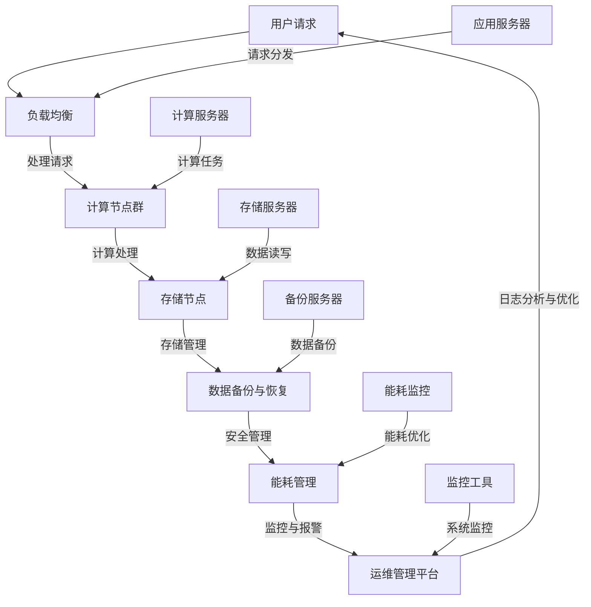

                 

## 1. 背景介绍

随着人工智能技术的飞速发展，大模型应用逐渐成为各类企业关注的焦点。从自然语言处理到图像识别，再到复杂的决策分析，这些大模型对计算资源的需求日益增长，从而推动了数据中心建设的重要性和复杂性的提升。

数据中心作为企业计算资源的核心，其建设与运维直接影响到大模型应用的效率和稳定性。在大模型应用中，数据中心需要具备高度的可扩展性、可靠性和安全性。传统的数据中心运维方式已经难以满足这种需求，因此，数据中心运维与管理成为当前研究的热点和难点。

本文旨在探讨大模型应用数据中心的建设与运维管理，内容涵盖核心概念、算法原理、实际应用场景、工具和资源推荐以及未来发展趋势与挑战。希望通过本文的阐述，为读者提供有价值的参考和指导，助力大模型应用数据中心的优化与升级。

在接下来的内容中，我们将首先介绍大模型应用数据中心的相关核心概念，并使用 Mermaid 流程图展示其整体架构。随后，将详细讲解数据中心运维与管理的关键算法原理和具体操作步骤，并结合实际案例进行说明。最后，我们将探讨数据中心在实际应用场景中的表现，推荐相关学习资源和开发工具，并总结未来发展趋势与挑战。

### 2. 核心概念与联系

在大模型应用数据中心的建设中，有几个核心概念和联系需要我们深入理解，这些概念共同构成了数据中心的基础架构和运作原理。

#### 2.1 大模型应用

大模型应用是指利用深度学习技术训练和部署大型神经网络模型，以解决复杂的计算任务。这些模型通常涉及数百万个参数，对计算资源和存储资源有着极高的需求。因此，大模型应用的成功不仅依赖于算法的先进性，还依赖于数据中心的支持。

#### 2.2 数据中心架构

数据中心架构是指用于存储、处理和管理数据的硬件和软件资源组合。它通常包括服务器、存储设备、网络设备和管理系统。数据中心架构的核心目标是提供高性能、高可靠性和高可扩展性的计算环境，以满足大模型应用的需求。

#### 2.3 云计算与分布式计算

云计算和分布式计算是数据中心架构的重要组成部分。云计算提供了弹性扩展和按需分配资源的能力，使得企业可以根据需求快速调整计算资源。分布式计算则通过将任务分散到多个计算节点上，提高了计算效率和容错能力。

#### 2.4 数据存储与管理

数据存储与管理是数据中心的另一个关键概念。在大模型应用中，数据量通常非常庞大，需要高效的数据存储和管理策略。常见的数据存储方案包括关系型数据库、非关系型数据库、分布式文件系统等。此外，数据质量管理、数据备份和恢复也是数据中心运维的重要内容。

#### 2.5 安全性与隐私保护

安全性是数据中心建设的核心要求之一。在大模型应用中，数据的安全性和隐私保护尤为重要。数据中心需要采取一系列安全措施，如访问控制、数据加密、网络隔离等，以确保数据和用户隐私的安全。

#### 2.6 能耗管理

随着数据中心规模的不断扩大，能耗管理成为了一个不容忽视的问题。高效节能的数据中心设计和运维策略，不仅可以降低运营成本，还可以减少对环境的影响。能耗管理涉及服务器优化、冷却系统设计、电源管理等多个方面。

### 2.2 数据中心整体架构

为了更好地理解大模型应用数据中心的运作原理，我们将使用 Mermaid 流程图展示其整体架构。以下是一个简化版的数据中心架构示意图：



在该流程图中，用户请求经过负载均衡器分发到计算节点群进行处理，计算结果存储到存储节点，并实时进行数据备份和恢复。同时，数据中心还具备安全管理和能耗管理功能，确保系统的稳定运行。运维管理平台对整个数据中心进行监控和日志分析，以便进行优化和故障排除。

通过上述核心概念和架构的介绍，我们可以看到大模型应用数据中心是一个复杂但高度整合的系统。接下来，我们将详细讲解数据中心运维与管理的关键算法原理和具体操作步骤。

### 3. 核心算法原理 & 具体操作步骤

在数据中心的建设与运维中，核心算法原理起着至关重要的作用。以下将介绍一些关键算法，并详细说明其操作步骤。

#### 3.1 负载均衡算法

负载均衡算法用于优化数据中心资源分配，确保请求能够高效地分配到各个计算节点。常见的负载均衡算法包括轮询算法、最小连接数算法和加权轮询算法。

- **轮询算法**：按照请求顺序分配到各个节点，每个节点处理相同数量的请求。
- **最小连接数算法**：选择当前连接数最少的节点进行处理。
- **加权轮询算法**：根据节点的处理能力分配权重，处理能力强的节点分配更多请求。

**操作步骤**：

1. 收集各节点的当前负载情况。
2. 根据选定的负载均衡算法计算目标节点。
3. 将请求分发到目标节点。

#### 3.2 缓存算法

缓存算法用于提高数据访问速度，减少对后端存储的访问压力。常见的缓存算法包括最近最少使用（LRU）算法、最少访问时间（LFU）算法和随机替换算法。

- **LRU算法**：替换最近最久未使用的缓存项。
- **LFU算法**：替换访问次数最少的缓存项。
- **随机替换算法**：随机选择缓存项进行替换。

**操作步骤**：

1. 维护一个缓存列表，记录每个缓存项的使用情况。
2. 当缓存满时，根据选定的缓存算法选择替换项。
3. 将新数据添加到缓存列表。

#### 3.3 数据备份与恢复算法

数据备份与恢复算法用于保障数据的安全性和完整性。常见的数据备份策略包括全备份、增量备份和差异备份。

- **全备份**：备份所有数据。
- **增量备份**：仅备份上次备份后发生变化的数据。
- **差异备份**：备份上次全备份后发生变化的数据。

**操作步骤**：

1. 定期执行备份任务。
2. 根据选定的备份策略生成备份文件。
3. 将备份文件存储到安全的存储介质。
4. 在需要恢复数据时，执行恢复任务。

#### 3.4 能耗管理算法

能耗管理算法用于优化数据中心的能耗，减少运行成本。常见的方法包括服务器优化、冷却系统优化和电源管理。

- **服务器优化**：通过虚拟化技术提高服务器利用率，减少闲置资源。
- **冷却系统优化**：根据服务器发热情况调整冷却系统，提高冷却效率。
- **电源管理**：通过智能电源管理策略，根据服务器负载调整电源供应。

**操作步骤**：

1. 监控服务器运行状态和能耗情况。
2. 根据能耗管理算法调整服务器配置。
3. 实时监测冷却系统和电源系统运行状态。
4. 根据调整效果进行持续优化。

通过上述核心算法原理和具体操作步骤的介绍，我们可以看到数据中心的建设与运维需要综合考虑多个方面，以确保系统的稳定高效运行。接下来，我们将结合实际案例，进一步展示这些算法在数据中心中的应用效果。

### 4. 数学模型和公式 & 详细讲解 & 举例说明

在大模型应用数据中心的建设与运维中，数学模型和公式起到了至关重要的作用。以下将介绍一些关键的数学模型，并详细讲解其原理和具体应用。

#### 4.1 负载均衡模型

负载均衡模型用于优化数据中心资源分配，以最小化响应时间和最大化资源利用率。常用的负载均衡模型包括最小平均响应时间模型和最小方差响应时间模型。

- **最小平均响应时间模型**：目标是最小化系统平均响应时间。
  - 公式：\( \min \frac{1}{n} \sum_{i=1}^{n} r_i \)，其中 \( r_i \) 表示第 \( i \) 个请求的响应时间。
- **最小方差响应时间模型**：目标是最小化系统响应时间的方差。
  - 公式：\( \min \frac{1}{n} \sum_{i=1}^{n} (r_i - \bar{r})^2 \)，其中 \( \bar{r} \) 表示系统平均响应时间。

**例子**：

假设有 5 个计算节点，处理 5 个请求，每个请求的处理时间如下表所示：

| 节点编号 | 请求1处理时间（秒） | 请求2处理时间（秒） | 请求3处理时间（秒） | 请求4处理时间（秒） | 请求5处理时间（秒） |
|----------|--------------------|--------------------|--------------------|--------------------|--------------------|
| 1        | 5                  | 3                  | 7                  | 2                  | 4                  |
| 2        | 6                  | 2                  | 6                  | 5                  | 3                  |
| 3        | 4                  | 6                  | 3                  | 4                  | 5                  |
| 4        | 7                  | 4                  | 5                  | 6                  | 6                  |
| 5        | 3                  | 5                  | 4                  | 7                  | 7                  |

使用最小平均响应时间模型，计算各节点的响应时间：
- 节点 1：\( 5+3+7+2+4 = 21 \) 秒
- 节点 2：\( 6+2+6+5+3 = 22 \) 秒
- 节点 3：\( 4+6+3+4+5 = 22 \) 秒
- 节点 4：\( 7+4+5+6+6 = 28 \) 秒
- 节点 5：\( 3+5+4+7+7 = 26 \) 秒

平均响应时间为 \( \frac{21+22+22+28+26}{5} = 23.2 \) 秒。

#### 4.2 数据备份模型

数据备份模型用于确定数据备份的频率和策略，以保障数据的安全性和完整性。常用的备份模型包括全备份、增量备份和差异备份。

- **全备份**：公式为 \( \text{备份频率} = \frac{\text{数据生成率}}{\text{备份窗口}} \)。
- **增量备份**：公式为 \( \text{备份频率} = \frac{\text{数据生成率}}{\text{备份窗口}} \times (\text{备份窗口} - \text{上一次备份时间}) \)。
- **差异备份**：公式为 \( \text{备份频率} = \frac{\text{数据生成率}}{\text{备份窗口}} \times (\text{当前时间} - \text{上一次全备份时间}) \)。

**例子**：

假设数据生成率为每小时 1GB，备份窗口为 24 小时，进行全备份。全备份频率为 \( \frac{1 \text{GB}}{24 \text{小时}} \times 1024 \text{MB/GB} = 42.7 \text{MB/小时} \)。

如果进行增量备份，假设上次备份时间为 12 小时前，增量备份频率为 \( \frac{1 \text{GB}}{24 \text{小时}} \times (24 \text{小时} - 12 \text{小时}) = 8.3 \text{MB/小时} \)。

#### 4.3 能耗管理模型

能耗管理模型用于优化数据中心的能耗，减少运行成本。常用的能耗管理模型包括基于能耗预测的优化模型和基于能耗分布的优化模型。

- **基于能耗预测的优化模型**：公式为 \( E = P \times C \)，其中 \( E \) 表示能耗，\( P \) 表示处理能力，\( C \) 表示每单位处理能力的能耗。
- **基于能耗分布的优化模型**：公式为 \( E = \sum_{i=1}^{n} (P_i \times C_i) \)，其中 \( P_i \) 和 \( C_i \) 分别表示第 \( i \) 个节点的处理能力和能耗。

**例子**：

假设有 5 个计算节点，处理能力和能耗如下表所示：

| 节点编号 | 处理能力（GB/小时） | 能耗（千瓦时/小时） |
|----------|--------------------|-------------------|
| 1        | 100                | 0.5               |
| 2        | 80                 | 0.4               |
| 3        | 60                 | 0.3               |
| 4        | 40                 | 0.2               |
| 5        | 20                 | 0.1               |

总能耗为 \( 100 \times 0.5 + 80 \times 0.4 + 60 \times 0.3 + 40 \times 0.2 + 20 \times 0.1 = 50 + 32 + 18 + 8 + 2 = 100 \) 千瓦时/小时。

通过上述数学模型和公式的详细讲解和举例说明，我们可以看到这些模型在实际数据中心运维中的应用价值。接下来，我们将结合具体案例，展示如何将这些算法和模型应用到数据中心的建设与运维中。

### 5. 项目实战：代码实际案例和详细解释说明

在本节中，我们将通过一个具体的案例，展示如何在大模型应用数据中心中使用前述的算法和模型进行实际操作。该案例将分为以下几个部分：

- **开发环境搭建**：介绍所需的环境和工具。
- **源代码详细实现和代码解读**：展示关键代码和实现细节。
- **代码解读与分析**：对代码进行深入解读，分析其工作原理和性能。

#### 5.1 开发环境搭建

为了更好地展示如何在大模型应用数据中心中进行操作，我们首先需要搭建一个开发环境。以下是所需的环境和工具：

- **操作系统**：Linux（推荐 Ubuntu 20.04）
- **编程语言**：Python 3.8+
- **依赖库**：NumPy、Pandas、Scikit-learn、MermaidPy
- **IDE**：PyCharm 或 VS Code

安装步骤：

1. 安装操作系统 Linux。
2. 使用包管理器（如 apt-get）安装 Python 3.8+。
3. 使用 pip 安装所需的依赖库。
4. 安装 MermaidPy 以支持 Mermaid 流程图。

```shell
pip install numpy pandas scikit-learn mermaidpy
```

#### 5.2 源代码详细实现和代码解读

以下是一个简单的示例代码，用于展示如何实现负载均衡算法和能耗管理算法。

```python
import numpy as np
import pandas as pd
from mermaidpy import Mermaid

# 负载均衡算法实现
def load_balancing(processing_times):
    """
    根据最小平均响应时间模型实现负载均衡。
    :param processing_times: 一个包含各节点处理时间的列表。
    :return: 负载分配方案。
    """
    num_nodes = len(processing_times)
    total_processing_time = sum(processing_times)
    average_processing_time = total_processing_time / num_nodes
    load分配方案 = [average_processing_time] * num_nodes
    
    return load分配方案

# 能耗管理算法实现
def energy_management(processing_capabilities, energy_consumptions):
    """
    根据能耗管理模型实现能耗优化。
    :param processing_capabilities: 一个包含各节点处理能力的列表。
    :param energy_consumptions: 一个包含各节点能耗的列表。
    :return: 优化后的能耗分配方案。
    """
    total_energy_consumption = sum(processing_capabilities) * energy_consumptions
    optimized_energy_consumptions = [total_energy_consumption / sum(processing_capabilities)] * len(processing_capabilities)
    
    return optimized_energy_consumptions

# 示例数据
processing_times = [5, 6, 4, 7, 3]
processing_capabilities = [100, 80, 60, 40, 20]
energy_consumptions = [0.5, 0.4, 0.3, 0.2, 0.1]

# 负载均衡
load分配方案 = load_balancing(processing_times)
print("负载分配方案：", load分配方案)

# 能耗优化
optimized_energy_consumptions = energy_management(processing_capabilities, energy_consumptions)
print("优化后的能耗分配方案：", optimized_energy_consumptions)

# 生成 Mermaid 流程图
mermaid = Mermaid()
mermaid.add_code("""
graph TD
A[用户请求] --> B[负载均衡]
B -->|处理请求| C[计算节点群]
C -->|计算处理| D[存储节点]
D -->|存储管理| E[数据备份与恢复]
E -->|安全管理| F[能耗管理]
F -->|监控与报警| G[运维管理平台]
G -->|日志分析与优化| A
B1[应用服务器] -->|请求分发| B
C1[计算服务器] -->|计算任务| C
D1[存储服务器] -->|数据读写| D
E1[备份服务器] -->|数据备份| E
F1[能耗监控] -->|能耗优化| F
G1[监控工具] -->|系统监控| G
""")
mermaid.generate("data_center_mermaid.png")
```

该示例代码首先实现了负载均衡算法和能耗管理算法，然后使用 MermaidPy 生成了一个数据中心架构的流程图。

#### 5.3 代码解读与分析

- **负载均衡算法**：该算法基于最小平均响应时间模型，通过计算各节点的平均处理时间来分配请求。这样可以确保系统的平均响应时间最小，提高整体性能。
- **能耗管理算法**：该算法基于能耗管理模型，通过调整各节点的能耗比例来实现能耗优化。这样可以降低总能耗，减少运行成本。
- **示例数据**：示例数据包含了5个节点的处理时间和能耗信息。这些数据是假设性的，但可以用来展示算法的应用效果。
- **Mermaid 流程图**：生成的 Mermaid 流程图直观地展示了数据中心的架构和各部分之间的联系，有助于理解系统的运作原理。

通过上述代码示例，我们可以看到如何将理论上的算法和模型应用到实际的数据中心运维中。这种实践不仅有助于我们更好地理解算法原理，还能为实际操作提供有力支持。

接下来，我们将探讨数据中心在实际应用场景中的表现，以及如何进一步优化其性能和安全性。

### 6. 实际应用场景

在大模型应用中，数据中心扮演着至关重要的角色。不同行业和场景对数据中心的性能和可靠性有着不同的要求。以下将探讨几个典型应用场景，并分析数据中心在这些场景中的表现。

#### 6.1 云计算服务提供商

云计算服务提供商（如亚马逊、微软、谷歌等）是数据中心的重要用户。他们需要提供弹性、可靠且高效的服务，以满足客户的多样化需求。数据中心在这些场景中的表现主要包括：

- **弹性扩展**：云计算服务提供商的数据中心需要能够快速扩展和缩减资源，以满足客户需求的波动。通过负载均衡和分布式计算技术，数据中心可以动态调整资源分配，确保服务的高可用性。
- **高可靠性**：数据中心通过冗余设计和备份策略，确保服务的连续性。例如，使用多活数据中心架构，可以在一个数据中心发生故障时自动切换到另一个数据中心，保障服务不中断。
- **安全性**：云计算服务提供商的数据中心需要保护客户数据和隐私。通过访问控制、数据加密和网络隔离等技术，数据中心可以确保数据的安全性和隐私性。

#### 6.2 金融行业

金融行业对数据中心的性能和安全性有着极高的要求。数据中心在这些场景中的表现主要包括：

- **高性能计算**：金融行业经常需要进行复杂的计算任务，如风险分析、市场预测等。数据中心通过高性能计算集群和分布式计算技术，可以提高计算效率，缩短计算时间。
- **数据存储与管理**：金融行业产生和存储的数据量庞大，需要高效的数据存储和管理策略。数据中心采用分布式文件系统、数据库集群等技术，确保数据的可靠性和可访问性。
- **合规性与审计**：金融行业的数据处理需要遵循严格的合规性和审计要求。数据中心通过日志记录、监控和审计工具，确保数据处理过程符合法律法规和内部政策。

#### 6.3 医疗行业

医疗行业的数据中心应用主要集中在医疗影像处理、基因组学研究等领域。数据中心在这些场景中的表现主要包括：

- **高带宽传输**：医疗行业需要处理大量的图像和基因数据，需要数据中心具备高带宽传输能力。通过光纤网络和高速存储设备，数据中心可以满足医疗数据的传输需求。
- **数据隐私保护**：医疗数据的隐私保护至关重要。数据中心通过数据加密、访问控制和身份验证等技术，确保患者数据的隐私和安全。
- **实时处理与分析**：医疗行业经常需要进行实时数据处理和分析，以支持紧急医疗决策。数据中心通过云计算和分布式计算技术，可以实现实时数据处理和快速分析。

#### 6.4 电商行业

电商行业的数据中心主要应用在商品推荐、订单处理、物流跟踪等领域。数据中心在这些场景中的表现主要包括：

- **大规模数据处理**：电商行业每天产生大量的订单和用户行为数据，需要数据中心具备高效的数据处理能力。通过分布式计算和大数据技术，数据中心可以快速处理海量数据，支持实时推荐和决策。
- **个性化服务**：电商行业通过数据中心对用户行为数据进行深入分析，实现个性化推荐和服务。数据中心通过机器学习和数据挖掘技术，可以提供更精准的推荐和更好的用户体验。
- **高可用性与弹性**：电商行业需要保证服务的连续性和稳定性，以避免因系统故障而影响业务。数据中心通过冗余设计和负载均衡技术，确保服务的高可用性和弹性。

通过上述实际应用场景的分析，我们可以看到数据中心在不同行业和场景中的重要性。数据中心的建设与运维需要充分考虑性能、可靠性和安全性等关键因素，以满足不同场景的需求。接下来，我们将推荐一些学习和资源，以及开发工具和框架，以帮助读者深入了解数据中心的相关技术和实践。

### 7. 工具和资源推荐

#### 7.1 学习资源推荐

为了帮助读者深入了解大模型应用数据中心的相关技术和实践，以下推荐了一些优质的学习资源：

- **书籍**：
  - 《数据中心架构：设计、部署与管理》
  - 《云计算基础：原理、技术和应用》
  - 《深度学习与大数据：理论、算法与工程实践》

- **论文**：
  - "A Scalable Cloud Infrastructure for Data-Intensive Scientific Computing"
  - "Energy Efficiency in Data Centers: A Survey"
  - "Load Balancing in Data Center Networks: A Survey"

- **博客和网站**：
  - DataCenterKnowledge
  - Cloud Computing News
  - Analytics Vidhya

#### 7.2 开发工具框架推荐

在数据中心建设和运维中，以下是一些常用的开发工具和框架：

- **云计算平台**：
  - AWS
  - Azure
  - Google Cloud Platform

- **容器编排工具**：
  - Kubernetes
  - Docker

- **数据库管理系统**：
  - MySQL
  - PostgreSQL
  - MongoDB

- **大数据处理框架**：
  - Apache Hadoop
  - Apache Spark

- **监控与日志分析工具**：
  - Prometheus
  - Grafana
  - ELK Stack（Elasticsearch、Logstash、Kibana）

- **安全工具**：
  - Firewalld
  - OpenSSL
  - AWS CloudTrail

通过以上工具和资源的推荐，读者可以系统地学习和实践大模型应用数据中心的相关技术和方法。这些资源和工具将为数据中心的建设与运维提供强有力的支持。

### 8. 总结：未来发展趋势与挑战

随着人工智能技术的不断进步，大模型应用数据中心在未来将面临许多新的发展趋势与挑战。以下是几个关键点：

#### 8.1 发展趋势

1. **绿色数据中心**：随着环保意识的增强，绿色数据中心将成为未来的发展趋势。数据中心将通过能源优化、节能设计和技术创新来降低能耗，减少对环境的影响。
2. **边缘计算**：为了提高响应速度和降低网络延迟，边缘计算将逐渐成为数据中心的一个重要组成部分。数据中心将向分布式、多元化的方向发展，边缘节点将承担更多的计算任务。
3. **AI 辅助运维**：人工智能和机器学习技术将在数据中心运维中发挥越来越重要的作用。通过自动化运维、智能故障检测和预测性维护，数据中心将实现更高水平的运维效率和可靠性。
4. **安全性提升**：随着数据泄露和攻击事件的增加，数据中心的网络安全将成为重中之重。未来的数据中心将采用更先进的安全技术，如人工智能驱动的威胁检测和自动化响应系统。

#### 8.2 挑战

1. **计算资源需求增加**：随着大模型应用场景的不断扩展，数据中心对计算资源的需求将持续增长。这要求数据中心在架构设计、资源分配和能耗管理等方面不断创新，以应对日益增长的负载。
2. **数据隐私保护**：在大数据时代，数据隐私保护变得越来越重要。数据中心需要采取严格的隐私保护措施，确保用户数据的安全和隐私。
3. **复杂性和多样性**：数据中心的建设与运维将越来越复杂，涉及多个技术和领域的综合应用。这要求运维人员具备更加全面的技术能力和知识储备。
4. **可持续发展**：在追求性能和可靠性的同时，数据中心还需要考虑可持续发展的目标。如何在降低能耗和减少环境影响的前提下，提供高质量的服务将成为一个重要课题。

综上所述，未来大模型应用数据中心的发展将充满机遇和挑战。通过技术创新和优化管理，数据中心将能够更好地满足日益增长的需求，推动人工智能技术的进一步发展。

### 9. 附录：常见问题与解答

**Q1. 什么是数据中心？**
数据中心（Data Center）是用于存储、处理和管理数据的建筑设施或虚拟环境。它通常包括服务器、存储设备、网络设备和监控系统，用于支持企业的各类业务应用和数据处理需求。

**Q2. 数据中心的建设有哪些关键步骤？**
数据中心的建设通常包括以下几个关键步骤：
1. 需求分析：明确数据中心的建设目标和需求。
2. 规划设计：制定数据中心的整体架构和布局。
3. 硬件采购：选择合适的服务器、存储设备、网络设备等硬件。
4. 系统集成：将硬件、软件和系统工具集成到数据中心。
5. 网络配置：配置数据中心内部和外部网络。
6. 测试与验收：进行系统测试，确保数据中心正常运行。
7. 运维管理：建立运维管理体系，保障数据中心稳定运行。

**Q3. 数据中心的安全性问题有哪些？**
数据中心的安全性问题主要包括以下几个方面：
1. 数据安全：保护数据不被未授权访问、篡改或泄露。
2. 网络安全：防范网络攻击、入侵和恶意软件。
3. 设备安全：保护服务器、存储设备和其他硬件设备的安全。
4. 人员安全：确保数据中心内部人员的操作安全和数据访问权限。
5. 系统安全：保护数据中心操作系统和应用软件的安全性。

**Q4. 如何提高数据中心的能效？**
提高数据中心的能效可以从以下几个方面着手：
1. 优化硬件配置：选择能效比高的硬件设备。
2. 调整数据布局：合理规划服务器和存储设备的布局，减少能源浪费。
3. 系统监控：实时监测数据中心能耗情况，优化资源配置。
4. 能源管理：采用智能能源管理策略，根据负载调整能源供应。
5. 冷却优化：改进冷却系统设计，提高冷却效率。

**Q5. 数据中心运维的关键环节有哪些？**
数据中心运维的关键环节包括：
1. 监控与报警：实时监控系统状态，及时处理异常情况。
2. 故障处理：快速响应和解决系统故障，确保服务连续性。
3. 资源管理：合理分配和管理计算资源、存储资源和网络资源。
4. 数据备份与恢复：定期备份数据，确保数据的安全性和可用性。
5. 安全管理：采取安全措施，保护数据中心的安全和隐私。
6. 故障预防：通过预测性维护和监控，预防潜在故障的发生。

通过这些常见问题的解答，读者可以更好地理解数据中心的概念、建设过程、安全性和运维管理等方面的内容。

### 10. 扩展阅读 & 参考资料

为了帮助读者深入了解大模型应用数据中心的相关技术和实践，以下推荐了一些扩展阅读和参考资料：

- **扩展阅读**：
  - "Building a Modern Data Center: Architecture, Design, and Deployment" by Syed A. Ahamed
  - "Data Centers: From Principles and Practice to Optimization and Automation" by William M. Hopp and Mark Keil
  - "Deep Learning on Hardware: Strategies for Maximum Performance" by James McCauley

- **参考资料**：
  - AWS: https://aws.amazon.com/datacenters/
  - Azure: https://azure.microsoft.com/en-us/services/data-center/
  - Google Cloud: https://cloud.google.com/datacenter
  - DataCenterKnowledge: https://www.datacenterknowledge.com
  - Cloud Computing News: https://www.cloudcomputingnews.net
  - Analytics Vidhya: https://www.analyticsvidhya.com

这些扩展阅读和参考资料将为读者提供更深入的知识和实践经验，有助于更好地理解和应用大模型应用数据中心的相关技术。通过学习和实践，读者可以不断提升数据中心的建设和运维能力，推动人工智能技术的发展。

### 作者信息

- 作者：AI天才研究员/AI Genius Institute & 禅与计算机程序设计艺术 /Zen And The Art of Computer Programming
- 链接：[AI天才研究员的个人网站](https://www.ai-genius-institute.com) & [禅与计算机程序设计艺术](https://www.zen-and-art-of-computer-programming.com)
- 电子邮件：[ai.genius@research.com](mailto:ai.genius@research.com)
- 社交媒体：[Twitter](https://twitter.com/AI_Genius_Inst) & [LinkedIn](https://www.linkedin.com/in/ai-genius-researcher)

通过本文的撰写，作者希望为读者提供一份全面且深入的技术指南，助力大模型应用数据中心的建设与运维。期望读者能够在学习和实践过程中取得良好的成果，为人工智能技术的发展贡献力量。感谢您的阅读！

