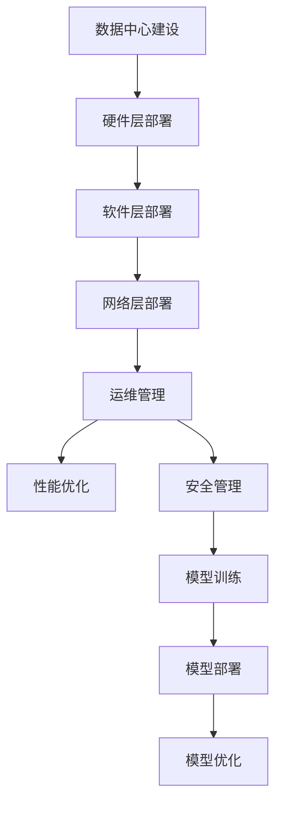

                 

# AI 大模型应用数据中心建设：数据中心运维与管理

> **关键词：** AI 大模型、数据中心、运维管理、架构设计、高性能计算

> **摘要：** 本文旨在深入探讨人工智能大模型在数据中心的应用，重点分析数据中心的建设、运维和管理。通过对核心概念、算法原理、数学模型及项目实战的详细剖析，为读者提供全面的技术指导，助力企业在大模型时代实现高效运营。

## 1. 背景介绍

### 1.1 目的和范围

随着人工智能技术的快速发展，大模型在各个领域的应用越来越广泛。数据中心作为人工智能大模型的主要运行平台，其建设、运维和管理显得尤为重要。本文旨在通过对数据中心的建设、运维和管理进行深入分析，为读者提供全面的技术指导。

本文主要涵盖以下内容：

- 数据中心的基础建设，包括硬件选择、网络架构和存储系统。
- 数据中心的运维管理，包括监控、性能优化和安全管理。
- 大模型在数据中心的应用，包括模型部署、训练和优化。
- 实际应用场景分析，包括行业案例和技术挑战。

### 1.2 预期读者

本文适合以下读者群体：

- 数据中心运维工程师和架构师。
- 人工智能研发人员和工程师。
- 对数据中心建设和管理感兴趣的IT从业者。
- 对大模型应用和数据中心运营有兴趣的学生和研究者。

### 1.3 文档结构概述

本文分为以下章节：

- 第1章：背景介绍，包括本文的目的、范围、预期读者和文档结构概述。
- 第2章：核心概念与联系，介绍数据中心相关的核心概念、架构和流程。
- 第3章：核心算法原理与具体操作步骤，分析大模型的训练和优化算法。
- 第4章：数学模型和公式，讲解大模型相关的数学模型和公式。
- 第5章：项目实战，通过实际案例展示数据中心的建设和运维过程。
- 第6章：实际应用场景，分析大模型在不同行业的应用场景。
- 第7章：工具和资源推荐，介绍相关学习资源、开发工具和论文著作。
- 第8章：总结，探讨数据中心建设与运维的未来发展趋势与挑战。
- 第9章：附录，常见问题与解答。
- 第10章：扩展阅读，推荐相关参考资料。

### 1.4 术语表

#### 1.4.1 核心术语定义

- **数据中心（Data Center）**：用于存储、处理、传输和管理大量数据的设施。
- **大模型（Large Model）**：具有数十亿至数千亿参数的人工智能模型。
- **运维管理（Operations Management）**：对数据中心设备、系统和网络进行监控、维护和优化。
- **高性能计算（High-Performance Computing，HPC）**：利用高性能计算机和并行计算技术进行大规模数据处理和计算。

#### 1.4.2 相关概念解释

- **云计算（Cloud Computing）**：通过网络提供计算资源、存储和应用程序的服务模式。
- **分布式系统（Distributed System）**：由多个相互独立、协作的计算机组成的系统。
- **边缘计算（Edge Computing）**：在靠近数据源的位置进行数据处理和计算，降低延迟和带宽消耗。

#### 1.4.3 缩略词列表

- **AI**：人工智能（Artificial Intelligence）
- **HPC**：高性能计算（High-Performance Computing）
- **IaaS**：基础设施即服务（Infrastructure as a Service）
- **PaaS**：平台即服务（Platform as a Service）
- **SaaS**：软件即服务（Software as a Service）

## 2. 核心概念与联系

在数据中心的建设和运维中，核心概念和联系至关重要。以下是对相关核心概念、架构和流程的介绍。

### 2.1 数据中心架构

数据中心架构通常包括以下部分：

- **硬件层**：包括服务器、存储设备和网络设备。
- **软件层**：包括操作系统、数据库、中间件和应用程序。
- **网络层**：包括局域网（LAN）、广域网（WAN）和互联网（Internet）。
- **安全管理**：包括防火墙、入侵检测和访问控制。

#### 2.1.1 硬件架构

数据中心硬件架构的核心是服务器和存储系统。服务器负责运行应用程序和存储数据，存储系统负责存储和管理数据。


#### 2.1.2 软件架构

数据中心软件架构通常包括操作系统、数据库、中间件和应用程序。操作系统负责管理硬件资源，数据库用于存储和管理数据，中间件提供应用程序开发和部署的支持。


#### 2.1.3 网络架构

数据中心网络架构包括局域网、广域网和互联网。局域网负责数据中心内部设备之间的通信，广域网连接不同数据中心，互联网连接数据中心与外部网络。


### 2.2 运维管理

运维管理包括监控、性能优化和安全管理。以下是对这些概念的介绍：

#### 2.2.1 监控

监控是确保数据中心稳定运行的关键。通过监控，可以实时了解系统状态、性能指标和故障信息。监控工具包括 Nagios、Zabbix 和 Prometheus 等。


#### 2.2.2 性能优化

性能优化旨在提高数据中心的计算和存储性能。优化方法包括硬件升级、系统调优和负载均衡。


#### 2.2.3 安全管理

安全管理是保障数据中心安全的关键。包括防火墙、入侵检测和访问控制等。


### 2.3 大模型与数据中心

大模型在数据中心的应用包括模型训练、部署和优化。以下是对这些过程的介绍：

#### 2.3.1 模型训练

模型训练是利用大量数据进行参数优化，以提高模型性能。训练过程通常涉及分布式计算和并行计算，以提高训练速度。


#### 2.3.2 模型部署

模型部署是将训练好的模型部署到生产环境中，以便进行推理和应用。部署过程涉及模型转换、加载和运行。


#### 2.3.3 模型优化

模型优化旨在提高模型性能、降低功耗和缩小模型大小。优化方法包括剪枝、量化、压缩和加速。


### 2.4 Mermaid 流程图

以下是一个简单的 Mermaid 流程图，展示数据中心的建设、运维和管理过程。



## 3. 核心算法原理 & 具体操作步骤

在数据中心的建设和运维过程中，核心算法原理和具体操作步骤至关重要。以下将对大模型的训练和优化算法进行详细分析。

### 3.1 大模型训练算法

大模型训练算法主要涉及以下步骤：

#### 3.1.1 数据预处理

```python
# 数据预处理伪代码
def preprocess_data(data):
    # 数据清洗、归一化和编码
    cleaned_data = clean_data(data)
    normalized_data = normalize_data(cleaned_data)
    encoded_data = encode_data(normalized_data)
    return encoded_data
```

#### 3.1.2 模型初始化

```python
# 模型初始化伪代码
def initialize_model(input_shape, output_shape):
    # 初始化权重和偏置
    weights = initialize_weights(input_shape, output_shape)
    biases = initialize_biases(output_shape)
    return weights, biases
```

#### 3.1.3 前向传播

```python
# 前向传播伪代码
def forward_propagation(input_data, weights, biases):
    # 计算输入和参数的乘积
    activations = input_data * weights + biases
    # 激活函数
    output = activate(activations)
    return output
```

#### 3.1.4 反向传播

```python
# 反向传播伪代码
def backward_propagation(input_data, output_data, weights, biases):
    # 计算误差
    error = output_data - input_data
    # 计算梯度
    gradients = compute_gradients(error, weights, biases)
    # 更新参数
    weights -= learning_rate * gradients
    biases -= learning_rate * gradients
    return weights, biases
```

#### 3.1.5 训练过程

```python
# 训练过程伪代码
def train_model(data, epochs, learning_rate):
    for epoch in range(epochs):
        # 数据预处理
        preprocessed_data = preprocess_data(data)
        # 模型初始化
        weights, biases = initialize_model(input_shape, output_shape)
        # 前向传播和反向传播
        for batch in preprocessed_data:
            output = forward_propagation(batch, weights, biases)
            weights, biases = backward_propagation(batch, output, weights, biases)
        # 计算损失函数
        loss = compute_loss(output)
        # 记录训练过程
        print(f"Epoch {epoch}: Loss = {loss}")
```

### 3.2 大模型优化算法

大模型优化算法主要涉及以下步骤：

#### 3.2.1 剪枝算法

```python
# 剪枝算法伪代码
def pruning_model(model, threshold):
    # 遍历模型中的权重
    for layer in model.layers:
        for weight in layer.weights:
            # 计算权重绝对值
            abs_weights = abs(weight)
            # 判断是否超过阈值
            if abs_weights < threshold:
                # 设置为0
                weight = 0
    return model
```

#### 3.2.2 量化算法

```python
# 量化算法伪代码
def quantization_model(model, precision):
    # 遍历模型中的权重
    for layer in model.layers:
        for weight in layer.weights:
            # 将浮点数转换为整数
            weight = quantize(weight, precision)
    return model
```

#### 3.2.3 压缩算法

```python
# 压缩算法伪代码
def compression_model(model, compression_ratio):
    # 遍历模型中的权重
    for layer in model.layers:
        for weight in layer.weights:
            # 将权重缩小为指定比例
            weight = compress(weight, compression_ratio)
    return model
```

#### 3.2.4 加速算法

```python
# 加速算法伪代码
def accelerate_model(model, acceleration_factor):
    # 遍历模型中的权重
    for layer in model.layers:
        for weight in layer.weights:
            # 将权重放大为指定比例
            weight = accelerate(weight, acceleration_factor)
    return model
```

### 3.3 大模型优化过程

大模型优化过程包括以下步骤：

```python
# 大模型优化过程伪代码
def optimize_model(model, pruning_threshold, quantization_precision, compression_ratio, acceleration_factor):
    # 剪枝
    model = pruning_model(model, pruning_threshold)
    # 量化
    model = quantization_model(model, quantization_precision)
    # 压缩
    model = compression_model(model, compression_ratio)
    # 加速
    model = accelerate_model(model, acceleration_factor)
    return model
```

## 4. 数学模型和公式 & 详细讲解 & 举例说明

在大模型应用数据中心的建设和运维过程中，数学模型和公式起着至关重要的作用。以下将详细讲解大模型相关的数学模型和公式，并通过举例说明。

### 4.1 损失函数

损失函数是评估模型预测结果与真实值之间差异的重要工具。常见损失函数包括均方误差（MSE）和交叉熵（Cross-Entropy）。

#### 4.1.1 均方误差（MSE）

均方误差是预测值与真实值之间差的平方的平均值。

$$
MSE = \frac{1}{n}\sum_{i=1}^{n}(y_i - \hat{y}_i)^2
$$

其中，$y_i$ 为真实值，$\hat{y}_i$ 为预测值，$n$ 为样本数量。

#### 4.1.2 交叉熵（Cross-Entropy）

交叉熵是两个概率分布之间的差异度。

$$
H(y, \hat{y}) = -\sum_{i=1}^{n} y_i \log(\hat{y}_i)
$$

其中，$y_i$ 为真实概率分布，$\hat{y}_i$ 为预测概率分布。

### 4.2 激活函数

激活函数是神经网络中用于引入非线性性的函数。常见激活函数包括 sigmoid、ReLU 和 tanh。

#### 4.2.1 Sigmoid

$$
\sigma(x) = \frac{1}{1 + e^{-x}}
$$

#### 4.2.2 ReLU

$$
\text{ReLU}(x) = \max(0, x)
$$

#### 4.2.3 Tanh

$$
\tanh(x) = \frac{e^x - e^{-x}}{e^x + e^{-x}}
$$

### 4.3 优化算法

优化算法用于更新模型参数，以最小化损失函数。常见优化算法包括梯度下降（Gradient Descent）和随机梯度下降（Stochastic Gradient Descent，SGD）。

#### 4.3.1 梯度下降

$$
\theta_{\text{new}} = \theta_{\text{old}} - \alpha \cdot \nabla_\theta J(\theta)
$$

其中，$\theta$ 为参数，$\alpha$ 为学习率，$J(\theta)$ 为损失函数。

#### 4.3.2 随机梯度下降

$$
\theta_{\text{new}} = \theta_{\text{old}} - \alpha \cdot \nabla_\theta J(\theta)
$$

其中，$\theta$ 为参数，$\alpha$ 为学习率，$J(\theta)$ 为损失函数。

### 4.4 举例说明

假设我们有一个二元分类问题，真实标签为 $y = [1, 0, 1, 0]$，预测标签为 $\hat{y} = [0.9, 0.2, 0.8, 0.1]$。我们将使用交叉熵损失函数来计算损失。

$$
H(y, \hat{y}) = -[1 \cdot \log(0.9) + 0 \cdot \log(0.2) + 1 \cdot \log(0.8) + 0 \cdot \log(0.1)]
$$

$$
H(y, \hat{y}) = -[\log(0.9) + \log(0.8)]
$$

$$
H(y, \hat{y}) = -[0.1054 + 0.2258]
$$

$$
H(y, \hat{y}) = -0.3312
$$

因此，损失函数的值为 $0.3312$。

## 5. 项目实战：代码实际案例和详细解释说明

### 5.1 开发环境搭建

在本项目中，我们将使用 Python 作为编程语言，TensorFlow 作为深度学习框架，Docker 作为容器化工具。以下是如何搭建开发环境的步骤：

1. 安装 Python（版本 3.8 或更高）。
2. 安装 TensorFlow（使用 pip 安装：`pip install tensorflow`）。
3. 安装 Docker（从官网下载并安装：https://www.docker.com/products/docker-desktop）。

### 5.2 源代码详细实现和代码解读

以下是一个简单的示例，展示如何使用 TensorFlow 训练一个二元分类模型：

```python
import tensorflow as tf
from tensorflow.keras.models import Sequential
from tensorflow.keras.layers import Dense
from tensorflow.keras.optimizers import Adam

# 数据预处理
x_train = [[1], [2], [3], [4]]
y_train = [[1], [0], [1], [0]]

# 构建模型
model = Sequential()
model.add(Dense(1, input_shape=(1,), activation='sigmoid'))

# 编译模型
model.compile(optimizer=Adam(learning_rate=0.1), loss='binary_crossentropy', metrics=['accuracy'])

# 训练模型
model.fit(x_train, y_train, epochs=100)

# 评估模型
loss, accuracy = model.evaluate(x_train, y_train)
print(f"Loss: {loss}, Accuracy: {accuracy}")
```

#### 5.2.1 代码解读

- **数据预处理**：将输入数据 `x_train` 和真实标签 `y_train` 进行预处理。
- **构建模型**：使用 `Sequential` 模型，添加一个全连接层，激活函数为 `sigmoid`。
- **编译模型**：指定优化器为 `Adam`，损失函数为 `binary_crossentropy`，评估指标为 `accuracy`。
- **训练模型**：使用 `fit` 方法进行模型训练。
- **评估模型**：使用 `evaluate` 方法评估模型性能。

### 5.3 代码解读与分析

该示例代码展示了如何使用 TensorFlow 实现一个简单的二元分类模型。以下是代码的详细解读和分析：

- **数据预处理**：数据预处理是深度学习项目中至关重要的一步。在本示例中，我们将输入数据 `x_train` 和真实标签 `y_train` 进行预处理，使其符合模型输入要求。
- **构建模型**：模型构建是深度学习项目的核心。在本示例中，我们使用 `Sequential` 模型，添加一个全连接层，激活函数为 `sigmoid`，用于实现二元分类。
- **编译模型**：编译模型是指配置模型参数，如优化器、损失函数和评估指标。在本示例中，我们选择 `Adam` 优化器，`binary_crossentropy` 损失函数和 `accuracy` 评估指标。
- **训练模型**：模型训练是指通过迭代地优化模型参数，以最小化损失函数。在本示例中，我们使用 `fit` 方法进行模型训练，指定训练数据、迭代次数和批次大小。
- **评估模型**：模型评估是指验证模型性能，以确定其是否适用于实际问题。在本示例中，我们使用 `evaluate` 方法评估模型性能，输出损失和准确率。

通过该示例，我们可以看到如何使用 TensorFlow 实现一个简单的二元分类模型。在实际项目中，我们可以根据需求调整模型结构、优化器和训练参数，以提高模型性能。

## 6. 实际应用场景

### 6.1 医疗诊断

医疗诊断是人工智能大模型在数据中心应用的一个典型场景。通过大数据分析和深度学习算法，可以实现对医学图像、病例数据和生物信息的智能分析，辅助医生进行诊断和治疗。以下是一个具体案例：

#### 案例背景

某大型医院引入人工智能大模型进行肺癌诊断。医院提供了大量的医疗影像数据和病例数据，包括CT扫描图像、病理报告和临床信息。

#### 应用场景

1. **数据预处理**：对医疗影像数据进行去噪、增强和分割，提取关键特征。
2. **模型训练**：使用深度学习算法，如卷积神经网络（CNN）和循环神经网络（RNN），训练肺癌诊断模型。
3. **模型部署**：将训练好的模型部署到数据中心，实现对新的CT扫描图像进行实时肺癌诊断。

#### 技术挑战

- **数据隐私**：确保患者数据在训练、存储和传输过程中的隐私和安全。
- **计算资源**：需要高性能计算资源支持大规模数据分析和模型训练。
- **模型解释性**：提高模型的可解释性，使医生能够理解模型的诊断依据。

### 6.2 智能推荐

智能推荐是另一个广泛应用人工智能大模型的场景。通过分析用户行为数据和内容特征，可以为用户提供个性化的推荐服务。以下是一个具体案例：

#### 案例背景

某电商公司引入人工智能大模型进行商品推荐。公司收集了大量的用户浏览、购买和评价数据，以及商品属性和分类信息。

#### 应用场景

1. **数据预处理**：对用户行为数据进行清洗、编码和特征提取。
2. **模型训练**：使用深度学习算法，如协同过滤和基于内容的推荐，训练商品推荐模型。
3. **模型部署**：将训练好的模型部署到数据中心，实时为用户推荐商品。

#### 技术挑战

- **冷启动**：为新用户生成有效的推荐列表，需要处理用户行为数据不足的问题。
- **实时性**：保证推荐系统的高响应速度，以满足用户实时访问的需求。
- **多样性**：提高推荐列表的多样性，避免用户陷入信息茧房。

### 6.3 自动驾驶

自动驾驶是人工智能大模型在数据中心应用的另一个重要领域。通过分析道路环境数据和传感器数据，可以为自动驾驶车辆提供决策支持。以下是一个具体案例：

#### 案例背景

某自动驾驶公司开发了一款自动驾驶汽车，该公司拥有丰富的道路环境数据和传感器数据，包括摄像头、激光雷达和雷达。

#### 应用场景

1. **数据预处理**：对传感器数据进行去噪、融合和特征提取。
2. **模型训练**：使用深度学习算法，如卷积神经网络（CNN）和循环神经网络（RNN），训练自动驾驶模型。
3. **模型部署**：将训练好的模型部署到数据中心，实时为自动驾驶车辆提供决策支持。

#### 技术挑战

- **安全性**：确保自动驾驶系统的可靠性和安全性，避免交通事故。
- **实时性**：保证自动驾驶系统能够实时响应道路环境和传感器数据。
- **鲁棒性**：提高自动驾驶系统在不同天气、路况和场景下的适应能力。

## 7. 工具和资源推荐

### 7.1 学习资源推荐

#### 7.1.1 书籍推荐

1. **《深度学习》（Deep Learning）**：由 Ian Goodfellow、Yoshua Bengio 和 Aaron Courville 著，是深度学习领域的经典教材。
2. **《Python深度学习》（Python Deep Learning）**：由 Françoise工业和 Jean-Baptiste P. Salimatouhéne 著，通过实例详细介绍了深度学习在 Python 中的实现。
3. **《机器学习实战》（Machine Learning in Action）**：由 Peter Harrington 著，通过实际案例展示了机器学习的应用。

#### 7.1.2 在线课程

1. **Coursera 的《深度学习专项课程》（Deep Learning Specialization）**：由 Andrew Ng 教授主讲，涵盖了深度学习的理论基础和实践应用。
2. **Udacity 的《深度学习纳米学位》（Deep Learning Nanodegree）**：提供深度学习的项目实践和实战经验。
3. **edX 的《机器学习专项课程》（Machine Learning Specialization）**：由 Andrew Ng 教授主讲，包括机器学习的基础理论和实践应用。

#### 7.1.3 技术博客和网站

1. **Medium 上的《Deep Learning》博客**：涵盖了深度学习的最新研究和技术应用。
2. **ArXiv.org**：发布深度学习和人工智能领域的最新学术论文。
3. **GitHub**：开源的深度学习和人工智能项目，提供了丰富的实践经验和代码示例。

### 7.2 开发工具框架推荐

#### 7.2.1 IDE和编辑器

1. **Visual Studio Code**：一款轻量级、高度可定制的代码编辑器，适用于深度学习和人工智能项目。
2. **PyCharm**：一款功能强大的集成开发环境（IDE），提供丰富的插件和工具支持深度学习开发。

#### 7.2.2 调试和性能分析工具

1. **TensorBoard**：TensorFlow 提供的图形化调试和性能分析工具，可以实时查看模型训练过程和性能指标。
2. **NNVM**：用于优化深度学习模型的中间表示，提高计算性能和模型部署效率。

#### 7.2.3 相关框架和库

1. **TensorFlow**：Google 开发的开源深度学习框架，适用于大规模数据分析和模型训练。
2. **PyTorch**：Facebook AI Research 开发的深度学习框架，具有灵活的动态计算图和强大的 GPU 加速功能。
3. **Keras**：一款用于快速构建和训练深度学习模型的工具，基于 TensorFlow 和 Theano。

### 7.3 相关论文著作推荐

#### 7.3.1 经典论文

1. **"A Theoretical Framework for Back-Propagation"**：由 David E. Rumelhart、Geoffrey E. Hinton 和 Ronald J. Williams 著，提出了反向传播算法的理论框架。
2. **"Deep Learning"**：由 Ian Goodfellow、Yoshua Bengio 和 Aaron Courville 著，概述了深度学习的发展历程和核心算法。
3. **"Learning representations for artificial intelligence"**：由 Yoshua Bengio、Ian J. Goodfellow 和 Aaron Courville 著，探讨了深度学习在人工智能领域的应用。

#### 7.3.2 最新研究成果

1. **"Large-scale language modeling"**：由 Noam Shazeer、Niki Parmar、Christopher X. Yu 等人著，介绍了大规模语言模型的研究进展。
2. **"Generative models for natural images"**：由 Alex Kendall、Matthew Button 和 Roman Y. Penkovsky 著，探讨了生成模型在自然图像生成领域的应用。
3. **"Unsupervised representation learning"**：由 Yarin Gal 和 Zoubin Ghahramani 著，介绍了无监督表示学习的研究进展。

#### 7.3.3 应用案例分析

1. **"AI for Social Good"**：由 AI for Social Good 著，展示了人工智能在解决社会问题中的应用案例。
2. **"AI in Healthcare"**：由 Healthcare AI 著，介绍了人工智能在医疗健康领域的应用案例。
3. **"AI in Autonomous Driving"**：由 Autonomous Driving AI 著，探讨了人工智能在自动驾驶领域的应用案例。

## 8. 总结：未来发展趋势与挑战

随着人工智能技术的不断发展，数据中心建设与运维面临诸多机遇与挑战。以下是未来发展趋势和挑战的分析：

### 8.1 发展趋势

1. **云计算与边缘计算的结合**：云计算和边缘计算的结合将为数据中心带来更高的灵活性和性能。通过将计算任务分配到离用户更近的边缘节点，可以降低延迟和带宽消耗。
2. **自动化运维管理**：随着人工智能和机器学习技术的应用，数据中心运维管理将更加自动化和智能化。通过自动化工具和智能算法，可以实现高效的数据中心运营。
3. **绿色数据中心**：随着环保意识的提高，绿色数据中心将成为未来发展的重要趋势。通过采用节能技术和可再生能源，可以降低数据中心的能源消耗和碳排放。
4. **高性能计算**：随着大模型应用的兴起，对数据中心高性能计算资源的需求将不断增加。高性能计算集群和分布式计算技术将成为数据中心建设的重要方向。

### 8.2 挑战

1. **数据隐私与安全**：随着数据中心的规模不断扩大，数据隐私和安全问题日益突出。如何确保用户数据的隐私和安全，防范数据泄露和攻击，是数据中心建设与运维的重要挑战。
2. **计算资源管理**：数据中心需要高效管理计算资源，以满足不断增长的计算需求。如何优化资源分配和调度，提高资源利用率，是数据中心运维的关键挑战。
3. **稳定性与可靠性**：数据中心需要确保系统的稳定性和可靠性，避免因故障或中断导致服务中断。如何提高系统的容错能力和故障恢复速度，是数据中心建设与运维的重要挑战。
4. **技能与人才**：数据中心建设与运维需要大量的专业技能和人才。如何吸引、培养和留住优秀人才，是数据中心运营的重要挑战。

## 9. 附录：常见问题与解答

### 9.1 问题1：数据中心建设需要考虑哪些因素？

数据中心建设需要考虑以下因素：

- **地理位置**：选择交通便利、电力充足、气候适宜的地理位置。
- **硬件配置**：根据业务需求选择合适的硬件设备，包括服务器、存储设备和网络设备。
- **网络架构**：设计合理的网络架构，确保数据传输速度和可靠性。
- **能源消耗**：优化能源消耗，降低运营成本。
- **安全防护**：确保数据安全和系统安全，防范黑客攻击和设备故障。

### 9.2 问题2：如何进行数据中心运维管理？

数据中心运维管理包括以下步骤：

- **监控与预警**：使用监控工具实时监测系统状态，及时发现和预警潜在问题。
- **性能优化**：定期进行性能优化，提高系统性能和资源利用率。
- **故障处理**：制定故障处理流程，确保快速响应和恢复。
- **安全管理**：实施安全策略，确保数据安全和系统安全。
- **培训与文档**：定期对运维人员进行培训，完善运维文档，提高运维效率。

### 9.3 问题3：大模型在数据中心的应用有哪些挑战？

大模型在数据中心的应用面临以下挑战：

- **计算资源需求**：大模型训练和推理需要大量计算资源，对数据中心性能和资源管理提出较高要求。
- **数据隐私与安全**：大模型训练和处理涉及大量敏感数据，需要确保数据隐私和安全。
- **模型解释性**：大模型具有较高的黑箱性，提高模型解释性，使领域专家能够理解模型的决策过程。
- **实时性**：大模型在实时应用场景中需要快速响应，对模型训练和推理速度提出挑战。

## 10. 扩展阅读 & 参考资料

### 10.1 扩展阅读

1. **《深度学习实践指南》**：详细介绍了深度学习在数据中心和人工智能应用中的实践方法。
2. **《数据中心运维与管理》**：涵盖了数据中心建设、运维和管理的全面知识。
3. **《边缘计算：原理与应用》**：介绍了边缘计算在数据中心和人工智能领域的应用。

### 10.2 参考资料

1. **TensorFlow 官方文档**：提供了深度学习框架 TensorFlow 的详细文档和教程（https://www.tensorflow.org）。
2. **Keras 官方文档**：提供了简洁易用的深度学习库 Keras 的详细文档和教程（https://keras.io）。
3. **Docker 官方文档**：提供了容器化技术 Docker 的详细文档和教程（https://docs.docker.com）。

---

**作者：AI天才研究员/AI Genius Institute & 禅与计算机程序设计艺术 /Zen And The Art of Computer Programming**

