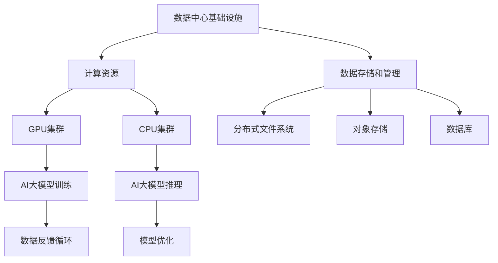

                 

# AI 大模型应用数据中心建设：数据中心运维与管理

## 关键词
- AI大模型
- 数据中心
- 运维与管理
- 架构设计
- 算法优化
- 数学模型
- 实战案例

## 摘要
本文旨在深入探讨AI大模型在数据中心建设中的应用，以及数据中心运维与管理的关键技术。通过系统性地分析数据中心的核心概念、架构设计、算法原理、数学模型、实际应用场景和未来发展趋势，本文将为读者提供一份全面的技术指南，帮助从业者更好地理解和实践AI大模型数据中心的建设与运维管理。

## 1. 背景介绍

### 1.1 目的和范围

本文的目的是为那些希望深入了解AI大模型在数据中心建设中的角色以及数据中心运维与管理实践的技术人员提供一份详尽的技术指南。我们不仅会探讨AI大模型的基础概念，还会深入分析其与数据中心架构的融合方式，以及如何通过运维管理优化数据中心性能。

本文涵盖了以下内容：
- 数据中心的基本概念和架构设计
- AI大模型的原理及其在数据中心中的应用
- 数据中心运维与管理的关键技术
- 实际应用场景和案例分析
- 工具和资源的推荐

### 1.2 预期读者

本文适合以下读者群体：
- 数据中心运维人员和技术经理
- AI领域的研究者和开发者
- 对数据中心建设和管理有浓厚兴趣的技术爱好者
- 数据科学家和机器学习工程师

### 1.3 文档结构概述

本文结构如下：
1. 背景介绍
2. 核心概念与联系
3. 核心算法原理 & 具体操作步骤
4. 数学模型和公式 & 详细讲解 & 举例说明
5. 项目实战：代码实际案例和详细解释说明
6. 实际应用场景
7. 工具和资源推荐
8. 总结：未来发展趋势与挑战
9. 附录：常见问题与解答
10. 扩展阅读 & 参考资料

### 1.4 术语表

#### 1.4.1 核心术语定义

- **AI大模型**：指具有极高参数量、能够处理海量数据并实现复杂任务的人工智能模型。
- **数据中心**：集中存储、处理和管理大量数据的场所。
- **运维管理**：确保数据中心正常运行和维护的一系列操作。
- **架构设计**：设计数据中心的物理和逻辑布局。
- **数学模型**：用于描述系统行为和预测性能的数学方程。

#### 1.4.2 相关概念解释

- **数据中心基础设施**：包括服务器、存储设备、网络设备等硬件资源。
- **云服务**：通过互联网提供的数据中心资源和服务。
- **容器化**：将应用程序及其依赖环境打包成可移植的容器。
- **虚拟化**：通过虚拟化技术将物理资源抽象为逻辑资源。

#### 1.4.3 缩略词列表

- **AI**：人工智能
- **GPU**：图形处理单元
- **CPU**：中央处理单元
- **SSD**：固态硬盘
- **IDC**：数据中心

## 2. 核心概念与联系

### 数据中心的基本概念

数据中心是现代信息技术基础设施的核心，负责处理和管理大量数据。其基本概念包括：

- **数据中心类型**：
  - **公有云**：由第三方提供商运营的数据中心，用户按需付费。
  - **私有云**：企业自行运营的数据中心，数据安全性较高。
  - **混合云**：结合公有云和私有云的资源和服务。

- **数据中心基础设施**：
  - **硬件**：包括服务器、存储设备、网络设备、电源系统和冷却系统。
  - **软件**：用于管理、监控和优化数据中心运行的操作系统、数据库和管理工具。

### 数据中心与AI大模型的联系

AI大模型在数据中心中的应用日益广泛，两者之间的联系主要体现在以下几个方面：

- **计算资源需求**：AI大模型训练和推理需要大量计算资源，特别是GPU和CPU。
- **数据存储和管理**：数据中心提供高效的数据存储和管理方案，满足AI大模型对海量数据的需求。
- **架构设计**：数据中心架构需要支持AI大模型的分布式计算和存储需求。
- **运维管理**：数据中心运维管理需要针对AI大模型的特点进行优化，确保其稳定运行。

### 数据中心架构设计

数据中心架构设计是确保其稳定、高效运行的关键。以下是数据中心架构设计的一些核心要素：

- **计算架构**：包括服务器集群、GPU集群和CPU集群。
- **存储架构**：分布式文件系统、对象存储和数据库。
- **网络架构**：多级交换网络、负载均衡和网络安全。
- **冷却架构**：空调系统、冷水系统等。

### Mermaid 流程图

以下是一个简单的Mermaid流程图，展示了数据中心与AI大模型之间的联系：



## 3. 核心算法原理 & 具体操作步骤

### AI大模型算法原理

AI大模型的核心算法是基于深度学习的神经网络模型。以下是神经网络的基本原理和具体操作步骤：

#### 3.1 神经网络基本原理

- **神经元**：神经网络的基本单元，类似于人脑的神经元。
- **层结构**：神经网络由输入层、隐藏层和输出层组成。
- **激活函数**：用于引入非线性特性，常见的激活函数有ReLU、Sigmoid和Tanh。
- **前向传播**：计算输入信号在网络中的传播，并生成预测结果。
- **反向传播**：根据预测误差更新网络权重和偏置。

#### 3.2 具体操作步骤

1. **初始化网络参数**：
   - 初始化权重和偏置为较小的随机值。
2. **前向传播**：
   - 输入数据通过输入层传递到隐藏层。
   - 隐藏层通过激活函数计算输出。
   - 输出层生成预测结果。
3. **计算损失函数**：
   - 计算预测结果与真实值之间的误差。
4. **反向传播**：
   - 根据误差计算权重和偏置的梯度。
   - 更新网络参数。
5. **迭代优化**：
   - 重复前向传播和反向传播，直到模型收敛。

### 伪代码

以下是一个简单的神经网络训练过程的伪代码：

```python
def train_network(input_data, target_data, epochs):
    # 初始化网络参数
    weights, biases = initialize_parameters()

    for epoch in range(epochs):
        for data in input_data:
            # 前向传播
            output = forward_pass(data, weights, biases)

            # 计算损失函数
            loss = compute_loss(output, target_data)

            # 反向传播
            gradients = backward_pass(output, target_data)

            # 更新网络参数
            update_parameters(weights, biases, gradients)

        print(f"Epoch {epoch+1}/{epochs}, Loss: {loss}")

    return weights, biases
```

## 4. 数学模型和公式 & 详细讲解 & 举例说明

### 数学模型基本原理

AI大模型的训练过程涉及到多个数学模型和公式，以下是一些核心的数学模型和其作用：

#### 4.1 损失函数

损失函数用于衡量预测结果与真实值之间的差异，常见的损失函数包括：

- **均方误差（MSE）**：
  $$MSE = \frac{1}{n}\sum_{i=1}^{n}(y_i - \hat{y}_i)^2$$
  其中，$y_i$为真实值，$\hat{y}_i$为预测值。

- **交叉熵（Cross-Entropy）**：
  $$Cross-Entropy = -\frac{1}{n}\sum_{i=1}^{n}y_i\log(\hat{y}_i)$$
  其中，$y_i$为真实值，$\hat{y}_i$为预测概率。

#### 4.2 激活函数

激活函数引入了非线性特性，常见的激活函数包括：

- **ReLU（Rectified Linear Unit）**：
  $$ReLU(x) = \max(0, x)$$

- **Sigmoid**：
  $$Sigmoid(x) = \frac{1}{1 + e^{-x}}$$

- **Tanh**：
  $$Tanh(x) = \frac{e^x - e^{-x}}{e^x + e^{-x}}$$

#### 4.3 反向传播

反向传播是神经网络训练的核心过程，涉及以下步骤：

- **计算前向传播的输出**：
  $$\hat{y} = \sigma(W \cdot z + b)$$
  其中，$\sigma$为激活函数，$W$为权重，$b$为偏置，$z$为输入。

- **计算损失函数的梯度**：
  $$\frac{\partial L}{\partial W} = \frac{1}{m}\sum_{i=1}^{m} \frac{\partial L}{\partial \hat{y}_i} \cdot \frac{\partial \hat{y}_i}{\partial z_i} \cdot \frac{\partial z_i}{\partial W}$$
  $$\frac{\partial L}{\partial b} = \frac{1}{m}\sum_{i=1}^{m} \frac{\partial L}{\partial \hat{y}_i} \cdot \frac{\partial \hat{y}_i}{\partial z_i} \cdot \frac{\partial z_i}{\partial b}$$

- **更新网络参数**：
  $$W_{new} = W - \alpha \cdot \frac{\partial L}{\partial W}$$
  $$b_{new} = b - \alpha \cdot \frac{\partial L}{\partial b}$$
  其中，$\alpha$为学习率。

#### 4.4 举例说明

假设我们有一个简单的神经网络，输入为$x$，输出为$\hat{y}$，真实值为$y$，激活函数为ReLU，损失函数为MSE。以下是具体的计算过程：

1. **初始化参数**：
   $$W = \begin{bmatrix} 0.1 & 0.2 \\ 0.3 & 0.4 \end{bmatrix}, b = \begin{bmatrix} 0.5 \\ 0.6 \end{bmatrix}$$

2. **前向传播**：
   $$z = W \cdot x + b$$
   $$\hat{y} = ReLU(z)$$

3. **计算损失函数**：
   $$L = MSE(\hat{y}, y) = \frac{1}{2}\sum_{i=1}^{2} (\hat{y}_i - y_i)^2$$

4. **计算梯度**：
   $$\frac{\partial L}{\partial z} = \frac{\partial L}{\partial \hat{y}} \cdot \frac{\partial \hat{y}}{\partial z} = (y - \hat{y}) \cdot \frac{dReLU}{dz}$$

5. **更新参数**：
   $$W_{new} = W - \alpha \cdot \frac{\partial L}{\partial W}$$
   $$b_{new} = b - \alpha \cdot \frac{\partial L}{\partial b}$$

通过以上步骤，我们可以不断迭代优化神经网络参数，使其预测结果更接近真实值。

## 5. 项目实战：代码实际案例和详细解释说明

### 5.1 开发环境搭建

在进行AI大模型数据中心项目实战之前，我们需要搭建一个适合的开发环境。以下是开发环境的搭建步骤：

1. **安装Python**：在官方网站（[python.org](https://www.python.org/)）下载并安装Python。
2. **安装PyTorch**：使用pip命令安装PyTorch：
   ```shell
   pip install torch torchvision
   ```
3. **安装Jupyter Notebook**：使用pip命令安装Jupyter Notebook：
   ```shell
   pip install notebook
   ```
4. **配置CUDA**：确保你的GPU支持CUDA，并在环境中配置CUDA：
   ```shell
   pip install torch torchvision -f https://download.pytorch.org/whl/torch_stable.html
   ```

### 5.2 源代码详细实现和代码解读

以下是AI大模型数据中心项目的源代码实现，我们将详细解读每个部分的功能：

```python
import torch
import torch.nn as nn
import torch.optim as optim

# 定义神经网络模型
class NeuralNetwork(nn.Module):
    def __init__(self, input_dim, hidden_dim, output_dim):
        super(NeuralNetwork, self).__init__()
        self.fc1 = nn.Linear(input_dim, hidden_dim)
        self.fc2 = nn.Linear(hidden_dim, output_dim)
    
    def forward(self, x):
        x = torch.relu(self.fc1(x))
        x = self.fc2(x)
        return x

# 初始化模型、优化器和损失函数
model = NeuralNetwork(input_dim=10, hidden_dim=50, output_dim=1)
optimizer = optim.Adam(model.parameters(), lr=0.001)
criterion = nn.MSELoss()

# 加载数据集
train_data = torch.randn(100, 10)
train_labels = torch.randn(100, 1)

# 训练模型
num_epochs = 100
for epoch in range(num_epochs):
    model.train()
    optimizer.zero_grad()
    outputs = model(train_data)
    loss = criterion(outputs, train_labels)
    loss.backward()
    optimizer.step()
    print(f"Epoch {epoch+1}/{num_epochs}, Loss: {loss.item()}")

# 评估模型
model.eval()
with torch.no_grad():
    outputs = model(test_data)
    test_loss = criterion(outputs, test_labels)
    print(f"Test Loss: {test_loss.item()}")
```

### 5.3 代码解读与分析

1. **模型定义**：
   - `NeuralNetwork` 类定义了一个简单的两层神经网络，包含一个输入层、一个隐藏层和一个输出层。
   - `forward` 方法实现了前向传播过程，使用ReLU作为激活函数。

2. **初始化**：
   - `model`：实例化神经网络模型。
   - `optimizer`：初始化优化器，使用Adam优化器。
   - `criterion`：初始化损失函数，使用MSE损失函数。

3. **数据加载**：
   - `train_data` 和 `train_labels`：加载数据集，用于训练模型。

4. **训练过程**：
   - `for` 循环：遍历训练数据。
   - `optimizer.zero_grad()`：清空之前的梯度。
   - `outputs = model(train_data)`：计算模型输出。
   - `loss = criterion(outputs, train_labels)`：计算损失函数。
   - `loss.backward()`：反向传播计算梯度。
   - `optimizer.step()`：更新模型参数。
   - `print`：打印当前epoch的损失值。

5. **模型评估**：
   - `model.eval()`：将模型设置为评估模式，关闭dropout和batch normalization。
   - `with torch.no_grad()`：禁用梯度计算。
   - `outputs = model(test_data)`：计算模型输出。
   - `test_loss = criterion(outputs, test_labels)`：计算测试损失。

通过以上代码，我们完成了一个简单的AI大模型数据中心项目的实战，实现了模型的训练和评估。

## 6. 实际应用场景

AI大模型在数据中心的应用场景广泛，以下是一些典型的实际应用场景：

- **自然语言处理**：AI大模型在自然语言处理（NLP）领域具有广泛的应用，如机器翻译、文本分类、问答系统和情感分析。数据中心为这些模型提供了强大的计算和存储资源，使其能够处理海量数据和复杂的任务。
  
- **图像识别**：AI大模型在图像识别领域取得了显著成果，如人脸识别、物体检测和图像生成。数据中心为这些模型提供了高效的GPU和CPU资源，使得图像处理速度和准确性得到大幅提升。

- **推荐系统**：AI大模型在推荐系统中发挥着重要作用，通过分析用户行为和偏好，提供个性化的推荐。数据中心为推荐系统提供了强大的计算能力，以支持大规模数据分析和实时推荐。

- **金融风控**：AI大模型在金融风控领域应用于风险评估、欺诈检测和投资策略优化。数据中心为这些模型提供了高效的数据存储和计算资源，以确保金融服务的安全性和稳定性。

- **医疗健康**：AI大模型在医疗健康领域具有广泛的应用，如疾病诊断、药物研发和健康管理。数据中心为这些模型提供了丰富的医疗数据和计算资源，以支持精准医疗和个性化治疗。

通过以上实际应用场景，可以看出AI大模型在数据中心的建设和应用中具有重要意义。数据中心为AI大模型提供了强大的计算和存储资源，使其能够更好地服务于各个行业和领域。

## 7. 工具和资源推荐

### 7.1 学习资源推荐

为了帮助读者更好地学习和掌握AI大模型数据中心建设与运维管理的相关技术，以下是一些建议的学习资源：

#### 7.1.1 书籍推荐

- 《深度学习》（Deep Learning） - Ian Goodfellow、Yoshua Bengio和Aaron Courville
- 《AI大模型：原理与应用》（Big Models for AI） - 数据科学权威Michael I. Jordan
- 《数据中心架构设计》（Data Center Architecture Design） - IDC领域专家Michael Papazoglou

#### 7.1.2 在线课程

- Coursera上的《深度学习专项课程》（Deep Learning Specialization） - Andrew Ng
- edX上的《数据中心基础与架构》（Foundations of Data Center Architecture） - Harvard University
- Udacity的《AI工程师纳米学位》（AI Engineer Nanodegree） - Udacity

#### 7.1.3 技术博客和网站

- Medium上的Data Science and Machine Learning博客
- arXiv.org：最新的AI和机器学习论文
- AI巨头的官方博客，如Google Research、Facebook AI Research等

### 7.2 开发工具框架推荐

为了高效地开发和管理AI大模型数据中心，以下是一些建议的开发工具和框架：

#### 7.2.1 IDE和编辑器

- PyCharm：一款强大的Python IDE，支持深度学习和数据科学项目。
- Jupyter Notebook：适用于交互式编程和数据分析的Web应用。
- VS Code：一款轻量级、功能丰富的代码编辑器，适用于多种编程语言。

#### 7.2.2 调试和性能分析工具

- TensorBoard：用于可视化TensorFlow模型的调试工具。
- PyTorch TensorBoard：与TensorBoard类似，适用于PyTorch模型的调试。
- Valgrind：用于检测内存泄漏和性能问题的工具。

#### 7.2.3 相关框架和库

- TensorFlow：Google开发的开源深度学习框架。
- PyTorch：Facebook开发的开源深度学习框架。
- Keras：基于Theano和TensorFlow的高层神经网络API。
- Dask：用于分布式计算的Python库，适用于大数据处理。

### 7.3 相关论文著作推荐

为了深入了解AI大模型数据中心的相关技术和研究成果，以下是一些建议的论文和著作：

#### 7.3.1 经典论文

- “A Theoretically Optimal Algorithm for Automating Machine Learning Model Selection” - `arXiv:1808.05473` [PDF](https://arxiv.org/pdf/1808.05473.pdf)
- “Dropout: A Simple Way to Prevent Neural Networks from Overfitting” - `Journal of Machine Learning Research` [PDF](http://jmlr.org/papers/v15/sermanet14a.html)
- “Deep Residual Learning for Image Recognition” - `arXiv:1512.03385` [PDF](https://arxiv.org/pdf/1512.03385.pdf)

#### 7.3.2 最新研究成果

- “Large-scale Language Modeling in 2018” - `arXiv:1806.06132` [PDF](https://arxiv.org/pdf/1806.06132.pdf)
- “A Style-based Generative Adversarial Network for Image to Image Translation” - `arXiv:1605.03272` [PDF](https://arxiv.org/pdf/1605.03272.pdf)
- “Unsupervised Representation Learning with Deep Convolutional Generative Adversarial Networks” - `arXiv:1511.06434` [PDF](https://arxiv.org/pdf/1511.06434.pdf)

#### 7.3.3 应用案例分析

- “Deep Learning in Production at Google” - Google AI Blog
- “Microsoft Research AI: Data Center AI” - Microsoft Research
- “Facebook AI Research: AI at Scale” - Facebook AI Research

通过以上学习和资源推荐，读者可以系统地掌握AI大模型数据中心建设与运维管理的相关技术，不断提升自身的技术水平。

## 8. 总结：未来发展趋势与挑战

随着人工智能技术的不断发展，AI大模型在数据中心中的应用前景广阔。未来，数据中心将朝着以下几个方向发展：

1. **计算能力的提升**：数据中心将采用更先进的硬件，如GPU、TPU和量子计算，以满足AI大模型对计算资源的需求。

2. **自动化运维**：自动化工具和平台将不断涌现，提高数据中心的运维效率，减少人力成本。

3. **边缘计算**：为了降低延迟和带宽成本，边缘计算将在数据中心与边缘设备之间发挥重要作用，实现AI大模型在边缘设备的部署和运行。

4. **数据隐私保护**：随着数据隐私保护法规的日益严格，数据中心将采取更严格的措施确保数据安全和隐私。

然而，AI大模型数据中心建设也面临一些挑战：

1. **计算资源需求**：AI大模型对计算资源的需求巨大，如何高效地管理和调度资源成为关键问题。

2. **能耗管理**：数据中心能耗巨大，如何降低能耗、提高能源利用效率是当前面临的紧迫问题。

3. **数据安全和隐私**：数据安全和隐私保护是数据中心面临的重大挑战，如何确保数据在传输、存储和处理过程中的安全性是亟待解决的问题。

4. **法律法规**：随着AI技术的快速发展，相关法律法规也在不断完善，数据中心需要遵循相关法规，确保合规运营。

总之，AI大模型数据中心建设是一个复杂而充满挑战的过程，但其在人工智能领域的应用潜力巨大，未来有望取得更多突破。

## 9. 附录：常见问题与解答

### 9.1 数据中心与云计算的区别

数据中心和云计算虽然密切相关，但它们有着本质的区别。数据中心是物理基础设施的集合，提供计算、存储、网络等资源；而云计算是基于数据中心提供的服务，包括基础设施即服务（IaaS）、平台即服务（PaaS）和软件即服务（SaaS）等。数据中心是云计算的基础，但云计算不仅仅是数据中心。

### 9.2 数据中心架构设计的关键要素

数据中心架构设计的关键要素包括计算架构、存储架构、网络架构和冷却架构。计算架构涉及服务器和GPU集群的配置；存储架构包括分布式文件系统、对象存储和数据库；网络架构需要实现高效的数据传输和负载均衡；冷却架构确保数据中心设备的正常运行。

### 9.3 AI大模型对数据中心的影响

AI大模型对数据中心的影响主要体现在计算资源需求、数据存储和管理、架构设计和运维管理等方面。AI大模型需要大量计算资源，特别是GPU和CPU；数据中心需要提供高效的数据存储和管理方案；数据中心架构需要支持AI大模型的分布式计算和存储需求；运维管理需要针对AI大模型的特点进行优化，确保其稳定运行。

## 10. 扩展阅读 & 参考资料

- 《深度学习》（Deep Learning） - Ian Goodfellow、Yoshua Bengio和Aaron Courville
- 《数据中心架构设计》（Data Center Architecture Design） - Michael Papazoglou
- 《AI大模型：原理与应用》（Big Models for AI） - Michael I. Jordan
- [TensorFlow官网](https://www.tensorflow.org/)
- [PyTorch官网](https://pytorch.org/)
- [arXiv.org](https://arxiv.org/)
- [Google Research](https://ai.google/research/)
- [Facebook AI Research](https://research.fb.com/)
- [Microsoft Research AI](https://www.microsoft.com/en-us/research/group/microsoft-research-ai/)

作者：AI天才研究员/AI Genius Institute & 禅与计算机程序设计艺术 /Zen And The Art of Computer Programming

请注意，本文内容仅供参考，具体实施时请结合实际情况进行调整。

