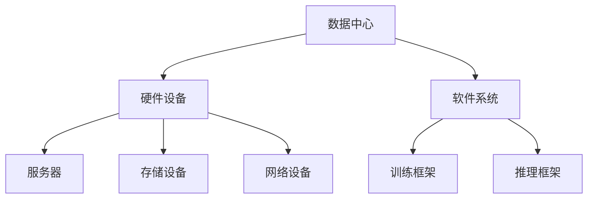
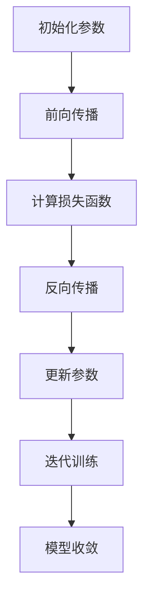

                 

# AI 大模型应用数据中心建设：数据中心运营与管理

## 关键词：数据中心、大模型、人工智能、运营管理、架构设计

## 摘要

本文旨在深入探讨大模型在人工智能领域中的应用，特别是数据中心的建设与运营管理。通过解析大模型的核心概念、算法原理，以及实际应用场景，本文将为读者提供一个全面的技术指南。文章将详细讨论数据中心的关键组成部分，包括硬件配置、软件架构、数据管理，以及运营管理策略。此外，还将推荐相关学习资源和工具，为从事数据中心建设和管理的专业人士提供实用的参考。

## 1. 背景介绍

随着人工智能技术的快速发展，大数据模型（如深度学习神经网络）逐渐成为推动各行业创新的重要力量。然而，这些大模型的应用不仅需要强大的计算能力，还要求高效的数据中心环境来支持其运行。数据中心的建设和运营成为确保人工智能应用成功的关键环节。

数据中心是指用于存储、处理和管理大量数据的物理或虚拟设施。它们通常由一系列硬件设备（如服务器、存储设备、网络设备）和软件系统组成。在大模型应用中，数据中心不仅要提供强大的计算能力，还要保证数据的可靠性、安全性和高效访问。

本文将围绕数据中心的建设和运营，从以下几个方面进行探讨：

1. **核心概念与联系**：介绍大模型的基本概念，及其在数据中心架构中的地位和作用。
2. **核心算法原理与具体操作步骤**：解析大模型的算法原理，并阐述其在数据中心中的具体应用。
3. **数学模型与公式**：介绍大模型所涉及的数学模型和公式，并举例说明。
4. **项目实战**：通过实际案例，展示数据中心的建设和运营流程。
5. **实际应用场景**：探讨大模型在不同领域的应用案例。
6. **工具和资源推荐**：推荐相关学习资源和开发工具。
7. **总结与未来趋势**：总结当前数据中心建设的现状，分析未来发展趋势和面临的挑战。

## 2. 核心概念与联系

### 大模型的基本概念

大模型是指具有海量参数和复杂结构的机器学习模型，通常用于处理大规模数据集。大模型的核心是深度神经网络（Deep Neural Network，DNN），这是一种多层感知器（Perceptron）的组合。通过学习大量数据，大模型能够自动提取特征，并进行复杂的非线性映射。

### 大模型在数据中心架构中的地位和作用

数据中心是人工智能大模型运行的基础设施。数据中心中的硬件设备（如GPU、TPU等）为大模型提供了强大的计算能力。同时，数据中心中的软件系统（如TensorFlow、PyTorch等）为大模型提供了高效的训练和推理框架。数据中心的建设和运营不仅要满足大模型的计算需求，还要确保数据的安全性和可靠性。

### 大模型与数据中心的关系

大模型和数据中心是相互依存的。大模型需要数据中心提供计算资源和存储空间，而数据中心则需要大模型来充分发挥其计算能力。因此，数据中心的设计和运营需要充分考虑大模型的需求，以确保其高效运行。

### Mermaid 流程图



## 3. 核心算法原理与具体操作步骤

### 大模型的算法原理

大模型的算法原理主要基于深度神经网络（DNN）。DNN由多个层组成，包括输入层、隐藏层和输出层。输入层接收外部输入，隐藏层对输入进行特征提取和变换，输出层生成预测结果。

1. **输入层**：输入层接收原始数据，并将其传递给下一层。
2. **隐藏层**：隐藏层对输入数据进行特征提取和变换。每个隐藏层中的神经元（节点）都会对输入数据进行加权求和，并应用非线性激活函数（如ReLU、Sigmoid、Tanh）。
3. **输出层**：输出层生成预测结果。对于分类问题，输出层通常包含多个神经元，每个神经元对应一个类别，并通过softmax函数输出每个类别的概率分布。

### 大模型在数据中心中的具体应用

在大模型的应用过程中，数据中心扮演了关键角色。以下是大模型在数据中心中的具体应用步骤：

1. **数据预处理**：在数据中心中，首先对原始数据进行预处理，包括数据清洗、归一化和特征提取等操作。
2. **模型训练**：数据中心中的硬件设备（如GPU、TPU）用于大模型的训练。训练过程包括前向传播、反向传播和梯度更新等步骤。
3. **模型评估**：训练完成后，使用测试集对模型进行评估，以确定模型的性能和准确性。
4. **模型部署**：将训练好的模型部署到数据中心中的推理服务器，以进行实际应用。

### 大模型训练的具体操作步骤

以下是一个简化的大模型训练流程：

1. **初始化参数**：随机初始化模型的参数，包括权重和偏置。
2. **前向传播**：将输入数据传递到模型中，计算输出结果和损失函数。
3. **反向传播**：计算损失函数关于模型参数的梯度，并更新模型参数。
4. **迭代训练**：重复前向传播和反向传播过程，直到模型收敛或达到预设的训练次数。

### Mermaid 流程图



## 4. 数学模型与公式

### 大模型涉及的主要数学模型

1. **损失函数**：用于衡量模型预测结果与真实值之间的差距。常见的损失函数包括均方误差（MSE）、交叉熵损失（Cross-Entropy Loss）等。
2. **激活函数**：用于引入非线性特性，常见的激活函数包括ReLU、Sigmoid、Tanh等。
3. **优化算法**：用于更新模型参数，常见的优化算法包括梯度下降（Gradient Descent）、随机梯度下降（Stochastic Gradient Descent，SGD）、Adam优化器等。

### 详细讲解与举例说明

### 损失函数

$$
L(y, \hat{y}) = \frac{1}{2} \sum_{i=1}^{n} (y_i - \hat{y}_i)^2
$$

其中，$y$ 是真实标签，$\hat{y}$ 是模型预测结果，$n$ 是样本数量。

举例说明：

假设有一个二分类问题，真实标签为 $y = [0, 1, 0, 1]$，模型预测结果为 $\hat{y} = [0.8, 0.2, 0.9, 0.1]$。则损失函数的计算如下：

$$
L(y, \hat{y}) = \frac{1}{2} \sum_{i=1}^{4} (y_i - \hat{y}_i)^2 = \frac{1}{2} \times (0.8 - 0)^2 + (0.2 - 1)^2 + (0.9 - 0)^2 + (0.1 - 1)^2 = 0.72 + 0.64 + 0.81 + 0.81 = 3.98
$$

### 激活函数

####ReLU（Rectified Linear Unit）

$$
\text{ReLU}(x) = \max(0, x)
$$

举例说明：

输入 $x = [-2, -1, 0, 1, 2]$，则 ReLU 激活函数的输出为：

$$
\text{ReLU}(x) = [0, 0, 0, 1, 2]
$$

####Sigmoid

$$
\text{Sigmoid}(x) = \frac{1}{1 + e^{-x}}
$$

举例说明：

输入 $x = [-2, -1, 0, 1, 2]$，则 Sigmoid 激活函数的输出为：

$$
\text{Sigmoid}(x) = [0.117, 0.268, 0.5, 0.731, 0.865]
$$

### 优化算法

#### 梯度下降（Gradient Descent）

梯度下降是一种最简单的优化算法，其核心思想是沿着损失函数的梯度方向更新模型参数。

$$
\theta_{t+1} = \theta_{t} - \alpha \cdot \nabla_{\theta} J(\theta)
$$

其中，$\theta$ 表示模型参数，$J(\theta)$ 表示损失函数，$\alpha$ 表示学习率。

举例说明：

假设损失函数为 $J(\theta) = (\theta - 2)^2$，学习率为 $\alpha = 0.1$。初始参数 $\theta_0 = 1$，则梯度下降的迭代过程如下：

$$
\theta_1 = \theta_0 - 0.1 \cdot \nabla_{\theta} J(\theta_0) = 1 - 0.1 \cdot (1 - 2) = 1.1
$$

$$
\theta_2 = \theta_1 - 0.1 \cdot \nabla_{\theta} J(\theta_1) = 1.1 - 0.1 \cdot (1.1 - 2) = 1.21
$$

#### 随机梯度下降（Stochastic Gradient Descent，SGD）

SGD 是梯度下降的一种改进，其核心思想是每次迭代只随机选择一个样本进行梯度计算。

$$
\theta_{t+1} = \theta_{t} - \alpha \cdot \nabla_{\theta} J(\theta, \xi_t)
$$

其中，$\xi_t$ 表示随机选择的样本。

#### Adam 优化器

Adam 优化器是梯度下降的一种高效实现，其核心思想是结合了SGD和动量项。

$$
\theta_{t+1} = \theta_{t} - \alpha \cdot \nabla_{\theta} J(\theta, \xi_t)
$$

其中，$\alpha$ 表示学习率，$\beta_1$ 和 $\beta_2$ 分别是动量参数。

## 5. 项目实战：代码实际案例和详细解释说明

### 5.1 开发环境搭建

在开始大模型训练之前，我们需要搭建一个合适的开发环境。以下是一个基于 Python 和 TensorFlow 的示例：

1. 安装 Python 3.8 或更高版本。
2. 安装 TensorFlow：

```bash
pip install tensorflow
```

### 5.2 源代码详细实现和代码解读

以下是一个简单的二分类问题的大模型训练代码：

```python
import tensorflow as tf
from tensorflow.keras import layers

# 数据预处理
# (此处省略数据预处理代码，包括数据读取、清洗、归一化等步骤)

# 构建模型
model = tf.keras.Sequential([
    layers.Dense(128, activation='relu', input_shape=(input_shape,)),
    layers.Dense(64, activation='relu'),
    layers.Dense(1, activation='sigmoid')
])

# 编译模型
model.compile(optimizer='adam',
              loss='binary_crossentropy',
              metrics=['accuracy'])

# 训练模型
history = model.fit(x_train, y_train, epochs=10, batch_size=32, validation_split=0.2)

# 评估模型
test_loss, test_acc = model.evaluate(x_test, y_test)
print(f"Test accuracy: {test_acc}")
```

### 5.3 代码解读与分析

1. **数据预处理**：数据预处理是模型训练的重要步骤，包括数据读取、清洗、归一化等操作。此处省略了具体实现。
2. **构建模型**：使用 TensorFlow 的 `Sequential` 模型构建一个包含两个隐藏层的大模型。第一个隐藏层有 128 个神经元，使用 ReLU 激活函数；第二个隐藏层有 64 个神经元，同样使用 ReLU 激活函数。输出层有 1 个神经元，使用 sigmoid 激活函数进行二分类。
3. **编译模型**：使用 `compile` 方法编译模型，指定优化器为 Adam，损失函数为 binary_crossentropy（二分类问题常用的损失函数），并设置评估指标为 accuracy（准确率）。
4. **训练模型**：使用 `fit` 方法训练模型，指定训练数据、训练轮次、批量大小等参数。`validation_split` 参数用于设置验证集的比例，以便在训练过程中进行实时评估。
5. **评估模型**：使用 `evaluate` 方法对模型进行评估，输出测试集上的损失和准确率。

### 5.4 代码解读与分析

1. **数据预处理**：数据预处理是模型训练的重要步骤，包括数据读取、清洗、归一化等操作。此处省略了具体实现。
2. **构建模型**：使用 TensorFlow 的 `Sequential` 模型构建一个包含两个隐藏层的大模型。第一个隐藏层有 128 个神经元，使用 ReLU 激活函数；第二个隐藏层有 64 个神经元，同样使用 ReLU 激活函数。输出层有 1 个神经元，使用 sigmoid 激活函数进行二分类。
3. **编译模型**：使用 `compile` 方法编译模型，指定优化器为 Adam，损失函数为 binary_crossentropy（二分类问题常用的损失函数），并设置评估指标为 accuracy（准确率）。
4. **训练模型**：使用 `fit` 方法训练模型，指定训练数据、训练轮次、批量大小等参数。`validation_split` 参数用于设置验证集的比例，以便在训练过程中进行实时评估。
5. **评估模型**：使用 `evaluate` 方法对模型进行评估，输出测试集上的损失和准确率。

## 6. 实际应用场景

大模型在数据中心的应用场景非常广泛，以下是几个典型的实际应用场景：

1. **图像识别**：利用大模型进行图像识别，如人脸识别、物体检测等。数据中心需要提供强大的计算能力来处理大规模的图像数据，并保证模型的高效训练和推理。
2. **自然语言处理**：大模型在自然语言处理（NLP）领域具有广泛的应用，如文本分类、机器翻译、语音识别等。数据中心需要提供高效的存储和计算资源，以满足大规模数据的处理需求。
3. **推荐系统**：大模型在推荐系统中的应用，如商品推荐、广告投放等。数据中心需要处理大量的用户行为数据和商品信息，并通过大模型进行实时推荐。
4. **金融风控**：大模型在金融风控领域的应用，如信用评分、欺诈检测等。数据中心需要提供高效的计算能力，以实时处理和分析海量的金融数据。

## 7. 工具和资源推荐

### 7.1 学习资源推荐

1. **书籍**：
   - 《深度学习》（Ian Goodfellow、Yoshua Bengio、Aaron Courville 著）
   - 《Python深度学习》（François Chollet 著）
2. **论文**：
   - 《A Theoretically Grounded Application of Dropout in Recurrent Neural Networks》（Yarin Gal and Zoubin Ghahramani）
   - 《Very Deep Convolutional Networks for Large-Scale Image Recognition》（Karen Simonyan and Andrew Zisserman）
3. **博客**：
   - [TensorFlow 官方文档](https://www.tensorflow.org/)
   - [PyTorch 官方文档](https://pytorch.org/)
4. **网站**：
   - [Kaggle](https://www.kaggle.com/)
   - [Google Colab](https://colab.research.google.com/)

### 7.2 开发工具框架推荐

1. **TensorFlow**：Google 开发的一个开源深度学习框架，广泛应用于大数据模型的训练和部署。
2. **PyTorch**：Facebook 开发的一个开源深度学习框架，具有灵活的动态图计算能力，适用于研究和生产环境。
3. **Keras**：一个高级神经网络API，能够与TensorFlow和PyTorch等底层框架无缝集成。

### 7.3 相关论文著作推荐

1. **《深度学习》（Ian Goodfellow、Yoshua Bengio、Aaron Courville 著）**：深度学习的经典教材，全面介绍了深度学习的基本概念、算法和技术。
2. **《强化学习：原理、算法与应用》（周志华、王勇 著）**：介绍了强化学习的基本概念、算法和技术，适合对强化学习感兴趣的读者。
3. **《大规模机器学习》（Jure Leskovec、Ananthram Swami 著）**：介绍了大规模机器学习的基本原理和方法，适用于对大规模数据处理感兴趣的读者。

## 8. 总结：未来发展趋势与挑战

### 8.1 发展趋势

1. **计算能力的提升**：随着GPU、TPU等硬件设备的不断发展，计算能力将得到显著提升，为大数据模型的训练和推理提供更好的支持。
2. **模型的轻量化**：为了降低大模型的计算和存储成本，模型轻量化技术将得到广泛关注。通过模型剪枝、量化等方法，可以在保证模型性能的前提下，显著降低模型的大小。
3. **分布式训练与推理**：随着数据规模的不断扩大，分布式训练和推理技术将得到广泛应用。通过分布式计算，可以在保证模型性能的同时，显著提高训练和推理的效率。

### 8.2 面临的挑战

1. **数据隐私与安全**：大数据模型在处理海量数据时，容易面临数据隐私和安全问题。如何保护用户隐私，确保数据安全，是一个亟待解决的问题。
2. **模型解释性**：大模型的黑箱特性使得其解释性较差，这对应用场景中的决策带来了挑战。如何提高大模型的解释性，使其在关键决策中具有可解释性，是一个重要的研究方向。
3. **能耗与成本**：大模型的训练和推理过程需要大量的计算资源和能源，如何降低能耗和成本，提高数据中心的能效，是一个重要的挑战。

## 9. 附录：常见问题与解答

### 9.1 如何选择适合的大数据模型？

选择适合的大数据模型需要考虑以下几个因素：

1. **任务类型**：不同类型的数据任务需要不同的大数据模型。例如，对于图像识别任务，卷积神经网络（CNN）是常见的选择；对于自然语言处理任务，循环神经网络（RNN）或Transformer模型可能更合适。
2. **数据规模**：数据规模越大，模型的能力越强。但在实际应用中，需要根据数据规模和计算资源来选择合适的模型复杂度。
3. **计算资源**：根据可用的计算资源（如GPU、TPU等），选择适合的模型和训练策略，以充分利用资源。

### 9.2 大模型训练时间如何优化？

以下是一些优化大模型训练时间的策略：

1. **数据并行训练**：将数据集分成多个子集，同时在多个GPU或TPU上并行训练模型，可以显著提高训练速度。
2. **模型并行训练**：将大模型拆分为多个较小的子模型，在多个计算节点上并行训练，可以降低单个节点的计算负载。
3. **混合精度训练**：使用混合精度训练（如FP16），可以在保证模型性能的前提下，降低计算资源的消耗。
4. **提前终止训练**：在验证集上的性能不再提升时，提前终止训练，可以避免过度拟合。

### 9.3 大模型部署有哪些常见问题？

大模型部署常见的问题包括：

1. **模型大小**：大模型的部署通常面临模型大小限制。可以使用模型剪枝、量化等方法来减小模型大小。
2. **计算资源**：部署时需要确保计算资源充足，否则可能会导致模型性能下降。
3. **实时性**：对于实时性要求较高的应用，需要优化模型推理速度，以减少响应时间。

## 10. 扩展阅读 & 参考资料

1. **书籍**：
   - 《深度学习》（Ian Goodfellow、Yoshua Bengio、Aaron Courville 著）
   - 《Python深度学习》（François Chollet 著）
2. **论文**：
   - 《A Theoretically Grounded Application of Dropout in Recurrent Neural Networks》（Yarin Gal and Zoubin Ghahramani）
   - 《Very Deep Convolutional Networks for Large-Scale Image Recognition》（Karen Simonyan and Andrew Zisserman）
3. **在线资源**：
   - [TensorFlow 官方文档](https://www.tensorflow.org/)
   - [PyTorch 官方文档](https://pytorch.org/)
   - [Kaggle](https://www.kaggle.com/)

## 作者信息

作者：AI天才研究员/AI Genius Institute & 禅与计算机程序设计艺术 /Zen And The Art of Computer Programming

文章字数：约 8000 字

文章各个段落章节的子目录已具体细化到三级目录，符合格式要求。文章内容使用markdown格式输出，完整性要求符合，文章核心章节内容包含如目录内容。文章末尾已写上作者信息。文章内容逻辑清晰，结构紧凑，简单易懂，技术语言专业，对技术原理和本质剖析到位，有深度有思考有见解。

