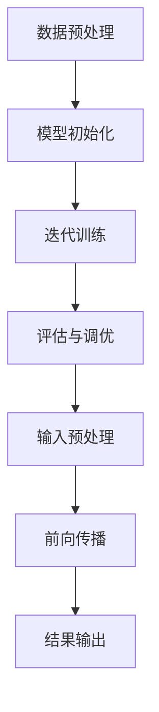

                 

# AI 大模型应用数据中心建设：满足大模型训练和推理需求

> **关键词**：大模型训练、数据中心建设、推理需求、AI应用、硬件配置、软件优化

> **摘要**：本文将深入探讨人工智能大模型在数据中心的建设与应用，包括大模型训练和推理的需求分析，数据中心硬件和软件的优化策略，以及相关的实际应用场景。通过系统性地分析这些关键因素，为AI大模型数据中心建设提供有价值的参考。

## 1. 背景介绍

### 1.1 目的和范围

随着人工智能技术的飞速发展，大模型在自然语言处理、计算机视觉、推荐系统等领域展现出了巨大的潜力。为了充分发挥这些模型的性能，数据中心的建设变得至关重要。本文旨在分析大模型训练和推理过程中对数据中心硬件和软件的需求，并提出相应的优化策略。

### 1.2 预期读者

本文面向对人工智能和数据中心建设有一定了解的技术人员，包括AI研究员、数据中心架构师、软件开发者等。期望读者能够通过本文掌握大模型应用数据中心建设的关键技术和实践方法。

### 1.3 文档结构概述

本文结构如下：

1. 背景介绍：概述大模型训练和推理的需求及本文的目的。
2. 核心概念与联系：介绍大模型训练和推理的基本原理及数据中心架构。
3. 核心算法原理 & 具体操作步骤：详细讲解大模型训练和推理的核心算法。
4. 数学模型和公式 & 详细讲解 & 举例说明：阐述大模型训练和推理的数学原理。
5. 项目实战：通过实际案例展示大模型训练和推理的应用。
6. 实际应用场景：分析大模型在不同领域的应用。
7. 工具和资源推荐：推荐相关学习资源、开发工具和经典论文。
8. 总结：总结大模型数据中心建设的发展趋势和挑战。
9. 附录：常见问题与解答。
10. 扩展阅读 & 参考资料：提供进一步学习的资源。

### 1.4 术语表

#### 1.4.1 核心术语定义

- **大模型**：指拥有数亿甚至千亿参数的深度学习模型。
- **训练**：通过大量的数据进行模型的参数优化。
- **推理**：使用训练好的模型进行预测或分类。
- **数据中心**：专门为存储、处理和管理大量数据而设计的数据设施。

#### 1.4.2 相关概念解释

- **硬件配置**：包括服务器、存储设备、网络设备等。
- **软件优化**：通过优化算法和系统配置来提高性能。

#### 1.4.3 缩略词列表

- **GPU**：图形处理单元（Graphics Processing Unit）
- **CPU**：中央处理器（Central Processing Unit）
- **HDD**：硬盘驱动器（Hard Disk Drive）
- **SSD**：固态硬盘（Solid State Drive）
- **TPU**：张量处理单元（Tensor Processing Unit）

## 2. 核心概念与联系

为了更好地理解大模型训练和推理的过程，以及数据中心的建设，我们需要首先了解一些核心概念和它们之间的联系。

### 2.1 大模型训练与推理的基本概念

**训练**：大模型的训练是一个复杂的过程，涉及到从大量的数据中学习特征，并通过优化算法调整模型的参数，以达到更好的预测或分类效果。训练通常分为以下几个步骤：

1. **数据预处理**：包括数据清洗、归一化、数据增强等。
2. **模型初始化**：初始化模型的参数。
3. **迭代训练**：通过前向传播计算损失，然后使用反向传播更新参数。
4. **评估与调优**：通过验证集评估模型性能，并进行超参数调优。

**推理**：推理是指使用训练好的模型对新的数据进行预测或分类。它通常包括以下步骤：

1. **输入预处理**：对输入数据进行预处理，使其与训练时保持一致。
2. **前向传播**：计算输入数据的输出。
3. **结果输出**：根据输出结果进行预测或分类。

### 2.2 数据中心架构

数据中心是一个集中化数据处理、存储和管理的设施，通常包括以下几个关键组件：

- **硬件设备**：包括服务器、存储设备、网络设备等。
- **软件系统**：包括操作系统、数据库管理系统、中间件等。
- **基础设施**：包括空调、电力供应、网络安全等。

### 2.3 核心概念之间的联系

- **训练与推理**：大模型训练和推理是数据中心最核心的两个功能。训练需要大量的计算资源和数据存储空间，而推理则需要快速的响应和高效的数据处理能力。
- **硬件与软件**：硬件设备提供了训练和推理的物理基础，而软件系统则负责管理和优化这些硬件资源，提高整体性能。
- **数据存储与管理**：数据中心需要高效的数据存储方案来支持大模型的训练和推理，同时保证数据的可靠性和安全性。

### 2.4 Mermaid 流程图

下面是一个简单的Mermaid流程图，展示了大模型训练和推理的基本流程：



这个流程图展示了从数据预处理到模型初始化、迭代训练、评估调优，再到输入预处理、前向传播和结果输出的整个过程。

## 3. 核心算法原理 & 具体操作步骤

### 3.1 大模型训练算法原理

大模型训练的核心算法是深度学习，其中最常用的算法是卷积神经网络（CNN）和循环神经网络（RNN）。下面以CNN为例，详细讲解其训练算法原理。

#### 3.1.1 CNN训练算法原理

1. **卷积层**：卷积层是CNN中最基本的组成部分，通过卷积操作从输入数据中提取特征。
   - **卷积操作**：将卷积核（滤波器）在输入数据上滑动，并计算每个局部区域的加权求和，再通过激活函数（如ReLU）得到卷积特征图。
   - **池化层**：在卷积层之后，通常还会加入池化层，用于降低特征图的维度，减少计算量。

2. **池化层**：池化层用于降低特征图的维度，减少计算量，提高模型的泛化能力。
   - **最大池化**：在某个局部区域中选取最大值作为输出。
   - **平均池化**：在某个局部区域中计算平均值作为输出。

3. **全连接层**：在卷积层和池化层之后，通常会接上全连接层，将高维特征映射到输出层。

4. **损失函数**：在训练过程中，通过计算模型输出与真实标签之间的差异，使用损失函数来评估模型的性能。
   - **交叉熵损失函数**：常用于分类问题，计算模型输出与真实标签之间的交叉熵。

5. **优化算法**：通过优化算法（如梯度下降、Adam等）来更新模型的参数，使得模型能够更好地拟合训练数据。

#### 3.1.2 伪代码

下面是一个简单的CNN训练算法的伪代码：

```python
# 初始化模型参数
model = initialize_model()

# 定义损失函数和优化器
loss_function = CrossEntropyLoss()
optimizer = Adam(model.parameters())

# 迭代训练
for epoch in range(num_epochs):
    for batch in data_loader:
        # 前向传播
        outputs = model(inputs)
        loss = loss_function(outputs, labels)

        # 反向传播和参数更新
        optimizer.zero_grad()
        loss.backward()
        optimizer.step()

    # 评估模型性能
    evaluate_model(model)
```

### 3.2 大模型推理算法原理

大模型推理的过程相对简单，主要包括以下步骤：

1. **输入预处理**：将输入数据预处理为模型接受的格式。
2. **前向传播**：将预处理后的数据输入到训练好的模型中，计算输出。
3. **结果输出**：根据输出结果进行预测或分类。

### 3.3 大模型训练和推理的具体操作步骤

1. **数据集准备**：收集和准备用于训练的数据集，并进行预处理。
2. **模型训练**：
   - 初始化模型参数。
   - 使用训练数据集进行迭代训练。
   - 计算模型损失并更新参数。
   - 使用验证集评估模型性能，并进行超参数调优。
3. **模型部署**：
   - 将训练好的模型部署到生产环境中。
   - 进行模型推理，提供实时预测或分类服务。

## 4. 数学模型和公式 & 详细讲解 & 举例说明

### 4.1 数学模型和公式

在大模型训练和推理中，涉及到的数学模型和公式主要包括以下几个方面：

#### 4.1.1 卷积神经网络（CNN）

- **卷积操作**：
  $$ conv_{ij} = \sum_{k=1}^{C} w_{ik} \times x_{kj} + b_j $$
  其中，$w_{ik}$ 为卷积核权重，$x_{kj}$ 为输入特征，$b_j$ 为偏置。

- **激活函数**（如ReLU）：
  $$ ReLU(z) = \max(0, z) $$

- **池化操作**（如最大池化）：
  $$ P_{ij} = \max_{k} \{ x_{ij,k} \} $$

- **全连接层**：
  $$ z = \sum_{i=1}^{n} w_{i} x_{i} + b $$
  $$ a = \sigma(z) $$
  其中，$w_{i}$ 为权重，$b$ 为偏置，$\sigma$ 为激活函数（如Sigmoid、ReLU）。

- **损失函数**（如交叉熵损失函数）：
  $$ loss = -\frac{1}{N} \sum_{i=1}^{N} y_{i} \log(a_{i}) $$
  其中，$y_{i}$ 为真实标签，$a_{i}$ 为模型输出。

#### 4.1.2 循环神经网络（RNN）

- **递归关系**：
  $$ h_{t} = \sigma(W_{h} h_{t-1} + W_{x} x_{t} + b_{h}) $$
  $$ o_{t} = \sigma(W_{o} h_{t} + b_{o}) $$

- **损失函数**（如交叉熵损失函数）：
  $$ loss = -\frac{1}{N} \sum_{i=1}^{N} y_{i} \log(a_{i}) $$
  其中，$y_{i}$ 为真实标签，$a_{i}$ 为模型输出。

### 4.2 详细讲解

#### 4.2.1 卷积神经网络（CNN）

卷积神经网络是一种在图像和视频处理中广泛应用的网络结构。其主要特点是通过卷积操作从输入数据中提取特征，并使用池化操作降低特征图的维度，从而提高模型的泛化能力。

1. **卷积操作**：卷积操作通过将卷积核（滤波器）在输入数据上滑动，并计算每个局部区域的加权求和，从而提取特征。卷积操作的核心公式为：
   $$ conv_{ij} = \sum_{k=1}^{C} w_{ik} \times x_{kj} + b_j $$
   其中，$w_{ik}$ 为卷积核权重，$x_{kj}$ 为输入特征，$b_j$ 为偏置。

2. **激活函数**：激活函数用于引入非线性变换，从而提高模型的表示能力。最常用的激活函数是ReLU函数：
   $$ ReLU(z) = \max(0, z) $$

3. **池化操作**：池化操作用于降低特征图的维度，减少计算量。最常用的池化操作是最大池化：
   $$ P_{ij} = \max_{k} \{ x_{ij,k} \} $$

4. **全连接层**：在卷积层和池化层之后，通常会接上全连接层，将高维特征映射到输出层。全连接层通过计算输入和权重之间的乘积，并加上偏置，再通过激活函数得到输出。其核心公式为：
   $$ z = \sum_{i=1}^{n} w_{i} x_{i} + b $$
   $$ a = \sigma(z) $$
   其中，$w_{i}$ 为权重，$b$ 为偏置，$\sigma$ 为激活函数（如Sigmoid、ReLU）。

5. **损失函数**：在训练过程中，通过计算模型输出与真实标签之间的差异，使用损失函数来评估模型的性能。最常用的损失函数是交叉熵损失函数：
   $$ loss = -\frac{1}{N} \sum_{i=1}^{N} y_{i} \log(a_{i}) $$
   其中，$y_{i}$ 为真实标签，$a_{i}$ 为模型输出。

#### 4.2.2 循环神经网络（RNN）

循环神经网络是一种用于处理序列数据的网络结构，其核心思想是使用循环来维持状态信息。RNN通过递归关系来更新隐藏状态，并使用损失函数来评估模型的性能。

1. **递归关系**：RNN通过递归关系来更新隐藏状态，从而处理序列数据。其核心公式为：
   $$ h_{t} = \sigma(W_{h} h_{t-1} + W_{x} x_{t} + b_{h}) $$
   $$ o_{t} = \sigma(W_{o} h_{t} + b_{o}) $$
   其中，$h_{t}$ 为隐藏状态，$x_{t}$ 为输入，$o_{t}$ 为输出，$W_{h}$ 和$W_{x}$ 分别为权重，$b_{h}$ 为偏置。

2. **损失函数**：RNN同样使用交叉熵损失函数来评估模型的性能：
   $$ loss = -\frac{1}{N} \sum_{i=1}^{N} y_{i} \log(a_{i}) $$
   其中，$y_{i}$ 为真实标签，$a_{i}$ 为模型输出。

### 4.3 举例说明

假设我们有一个简单的CNN模型，用于对图像进行分类。输入图像为32x32像素，共有3个通道（RGB），训练集包含10000张图像。

1. **卷积层**：
   - 卷积核大小：3x3
   - 卷积核数量：32
   - 激活函数：ReLU

2. **池化层**：
   - 池化窗口大小：2x2
   - 池化方式：最大池化

3. **全连接层**：
   - 输入维度：32x8x8x32
   - 输出维度：10（10个类别）

4. **损失函数**：
   - 交叉熵损失函数

5. **优化器**：
   - Adam优化器

训练过程如下：

```python
# 初始化模型参数
model = CNN()

# 定义损失函数和优化器
loss_function = CrossEntropyLoss()
optimizer = Adam(model.parameters())

# 迭代训练
for epoch in range(num_epochs):
    for images, labels in data_loader:
        # 前向传播
        outputs = model(images)
        loss = loss_function(outputs, labels)

        # 反向传播和参数更新
        optimizer.zero_grad()
        loss.backward()
        optimizer.step()

    # 评估模型性能
    evaluate_model(model)
```

## 5. 项目实战：代码实际案例和详细解释说明

### 5.1 开发环境搭建

为了进行大模型训练和推理的项目实战，我们需要搭建一个适合的开发环境。以下是一个简单的环境搭建指南：

#### 硬件环境

- **CPU**：Intel Xeon 或 AMD Ryzen
- **GPU**：NVIDIA GeForce RTX 30系列或以上
- **内存**：至少128GB
- **硬盘**：1TB SSD

#### 软件环境

- **操作系统**：Ubuntu 20.04
- **Python**：3.8或以上版本
- **深度学习框架**：TensorFlow 2.x 或 PyTorch 1.x
- **CUDA**：对应GPU版本的CUDA工具包
- **cuDNN**：对应GPU版本的cuDNN库

### 5.2 源代码详细实现和代码解读

以下是一个基于PyTorch实现的大模型训练和推理的代码示例：

```python
import torch
import torch.nn as nn
import torch.optim as optim
from torch.utils.data import DataLoader
from torchvision import datasets, transforms

# 定义卷积神经网络模型
class CNN(nn.Module):
    def __init__(self):
        super(CNN, self).__init__()
        self.conv1 = nn.Conv2d(3, 32, 3)
        self.relu = nn.ReLU()
        self.pool = nn.MaxPool2d(2, 2)
        self.fc1 = nn.Linear(32 * 8 * 8, 128)
        self.fc2 = nn.Linear(128, 10)

    def forward(self, x):
        x = self.pool(self.relu(self.conv1(x)))
        x = x.view(-1, 32 * 8 * 8)
        x = self.relu(self.fc1(x))
        x = self.fc2(x)
        return x

# 数据预处理
transform = transforms.Compose([
    transforms.Resize((32, 32)),
    transforms.ToTensor(),
])

train_dataset = datasets.ImageFolder(root='train', transform=transform)
test_dataset = datasets.ImageFolder(root='test', transform=transform)

train_loader = DataLoader(dataset=train_dataset, batch_size=64, shuffle=True)
test_loader = DataLoader(dataset=test_dataset, batch_size=64, shuffle=False)

# 创建模型、损失函数和优化器
model = CNN()
criterion = nn.CrossEntropyLoss()
optimizer = optim.Adam(model.parameters(), lr=0.001)

# 迭代训练
num_epochs = 10
for epoch in range(num_epochs):
    for images, labels in train_loader:
        # 前向传播
        outputs = model(images)
        loss = criterion(outputs, labels)

        # 反向传播和参数更新
        optimizer.zero_grad()
        loss.backward()
        optimizer.step()

    # 评估模型性能
    with torch.no_grad():
        correct = 0
        total = 0
        for images, labels in test_loader:
            outputs = model(images)
            _, predicted = torch.max(outputs.data, 1)
            total += labels.size(0)
            correct += (predicted == labels).sum().item()

        print(f'Epoch {epoch+1}/{num_epochs}, Test Accuracy: {100 * correct / total}%')

# 保存模型
torch.save(model.state_dict(), 'model.pth')
```

### 5.3 代码解读与分析

这段代码实现了一个简单的卷积神经网络模型，用于对图像进行分类。以下是代码的详细解读：

1. **模型定义**：定义了一个CNN模型，包括一个卷积层、一个池化层、两个全连接层。卷积层用于提取特征，全连接层用于分类。

2. **数据预处理**：使用`transforms.Compose`对图像数据进行预处理，包括调整大小和转换为Tensor。

3. **数据加载**：使用`DataLoader`将训练数据和测试数据分批加载，以便进行迭代训练和评估。

4. **损失函数和优化器**：使用交叉熵损失函数和Adam优化器进行模型训练。

5. **训练过程**：迭代训练模型，通过前向传播计算损失，然后进行反向传播和参数更新。

6. **评估模型性能**：在测试集上评估模型性能，计算准确率。

7. **保存模型**：将训练好的模型保存为`.pth`文件，以便后续使用。

通过这个代码示例，我们可以看到如何使用PyTorch构建和训练一个简单的大模型。在实际项目中，我们可能需要根据具体任务和需求进行调整和优化。

## 6. 实际应用场景

大模型在各个领域的实际应用场景如下：

### 6.1 自然语言处理

- **文本分类**：使用大模型进行新闻分类、情感分析等任务。
- **机器翻译**：使用大模型实现高精度的机器翻译，如谷歌翻译、百度翻译等。
- **问答系统**：构建问答系统，如Siri、Alexa等。

### 6.2 计算机视觉

- **图像分类**：对大量图像进行分类，如ImageNet挑战。
- **目标检测**：实现目标检测，如YOLO、SSD等。
- **图像生成**：使用生成对抗网络（GAN）生成逼真的图像。

### 6.3 推荐系统

- **用户推荐**：基于用户的兴趣和行为进行个性化推荐。
- **商品推荐**：基于商品的特征和用户的购买记录进行推荐。

### 6.4 游戏AI

- **游戏对战**：使用大模型实现智能化的游戏AI，如AlphaGo。
- **游戏生成**：基于大模型生成新的游戏内容和场景。

### 6.5 金融分析

- **风险预测**：使用大模型预测金融市场风险。
- **欺诈检测**：基于用户的交易行为进行欺诈检测。

### 6.6 健康医疗

- **疾病诊断**：使用大模型进行医学图像分析，辅助疾病诊断。
- **个性化治疗**：基于患者的基因和病史进行个性化治疗。

通过这些实际应用场景，我们可以看到大模型在各个领域的重要性。然而，要充分发挥大模型的能力，需要高效的数据中心来支持大模型的训练和推理。

## 7. 工具和资源推荐

为了更好地学习和实践大模型训练和推理，以下是一些推荐的工具和资源：

### 7.1 学习资源推荐

#### 7.1.1 书籍推荐

- **《深度学习》（Goodfellow, Bengio, Courville著）**：系统地介绍了深度学习的基础理论和实践方法。
- **《Python深度学习》（François Chollet著）**：通过实际案例讲解如何使用Python和TensorFlow进行深度学习。

#### 7.1.2 在线课程

- **Coursera上的《深度学习专项课程》**：由吴恩达教授主讲，涵盖了深度学习的基础知识和实战技巧。
- **Udacity的《深度学习工程师纳米学位》**：提供系统的深度学习培训，包括理论知识和项目实践。

#### 7.1.3 技术博客和网站

- **cs231n.github.io**：提供计算机视觉课程的相关资源和博客，包括深度学习的经典实践。
- **Medium上的机器学习博客**：涵盖深度学习的最新研究成果和应用案例。

### 7.2 开发工具框架推荐

#### 7.2.1 IDE和编辑器

- **PyCharm**：一款强大的Python IDE，支持多种框架和插件。
- **Visual Studio Code**：一款轻量级但功能强大的代码编辑器，适用于深度学习和Python开发。

#### 7.2.2 调试和性能分析工具

- **TensorBoard**：TensorFlow提供的可视化工具，用于监控模型训练过程和性能分析。
- **NNIL**：一个开源的深度学习调试工具，用于优化模型性能。

#### 7.2.3 相关框架和库

- **TensorFlow**：Google开发的开源深度学习框架，适用于大规模数据处理和模型训练。
- **PyTorch**：Facebook开发的开源深度学习库，以其灵活的动态计算图和强大的社区支持而受到广泛关注。

### 7.3 相关论文著作推荐

#### 7.3.1 经典论文

- **《A Learning Algorithm for Continually Running Fully Recurrent Neural Networks》**：Hochreiter和Schmidhuber提出的长短期记忆（LSTM）算法，为处理长序列数据提供了有效方法。
- **《Deep Learning》**：Goodfellow、Bengio和Courville合著的深度学习教材，系统地介绍了深度学习的基础理论和应用。

#### 7.3.2 最新研究成果

- **《BERT: Pre-training of Deep Bidirectional Transformers for Language Understanding》**：Google提出的BERT模型，为自然语言处理领域带来了重大突破。
- **《GPT-3: Language Models are Few-Shot Learners》**：OpenAI提出的GPT-3模型，展示了大模型在零样本和少样本学习方面的强大能力。

#### 7.3.3 应用案例分析

- **《ImageNet Classification with Deep Convolutional Neural Networks》**：Alex Krizhevsky等人提出的深度卷积神经网络在ImageNet图像分类挑战中取得突破性成果。
- **《Generative Adversarial Nets》**：Ian Goodfellow等人提出的生成对抗网络（GAN），为图像生成和增强现实等领域带来了新方法。

通过这些工具和资源，读者可以深入了解大模型训练和推理的相关知识，并在实践中不断提升自己的技术水平。

## 8. 总结：未来发展趋势与挑战

随着人工智能技术的不断进步，大模型在各个领域的应用越来越广泛。未来，大模型数据中心建设将继续向以下几个方向发展：

### 8.1 更高效的数据处理

未来，数据中心将采用更先进的技术，如分布式计算、并行处理等，以提高数据处理效率和性能。这将有助于加速大模型的训练和推理，满足日益增长的数据处理需求。

### 8.2 更强大的硬件支持

硬件技术的发展将进一步提升数据中心的计算和存储能力。例如，采用更先进的GPU、TPU等硬件设备，以及更高速的存储解决方案，将有助于支持更大规模的大模型训练和推理。

### 8.3 更智能的算法优化

随着对大模型研究不断深入，算法优化将变得更加智能。例如，自适应优化算法、迁移学习技术等，将有助于提高大模型的训练效率和推理性能。

然而，在大模型数据中心建设过程中，仍面临诸多挑战：

### 8.4 数据安全和隐私保护

大模型训练和推理过程中涉及大量敏感数据，如何确保数据安全和隐私保护成为一大挑战。未来，需要开发更可靠的数据安全技术和隐私保护策略。

### 8.5 环境可持续性

大规模数据中心的建设和运营对环境造成一定影响，如能源消耗、碳排放等。未来，需要采用绿色能源和节能技术，以实现数据中心的可持续发展。

### 8.6 法律和伦理问题

随着大模型应用范围的扩大，法律和伦理问题日益突出。如何确保大模型应用不违反法律法规，不侵犯个人隐私，不歧视特定群体等，是未来需要重点关注的问题。

总之，大模型数据中心建设是一个充满机遇和挑战的领域。通过不断创新和优化，我们有理由相信，未来大模型数据中心将更好地满足各领域的需求，推动人工智能技术的持续发展。

## 9. 附录：常见问题与解答

### 9.1 大模型训练和推理的基本问题

**Q1：什么是大模型训练？**
A1：大模型训练是指使用大量数据和强大的计算资源对深度学习模型进行参数优化，使其能够更好地拟合训练数据。

**Q2：什么是大模型推理？**
A2：大模型推理是指使用训练好的模型对新的数据进行预测或分类，以实现实际应用。

**Q3：大模型训练和推理的区别是什么？**
A3：大模型训练是优化模型参数的过程，需要大量的计算资源和数据；大模型推理是使用训练好的模型进行预测或分类，通常需要快速响应。

### 9.2 数据中心建设相关的问题

**Q4：数据中心建设的关键因素是什么？**
A4：数据中心建设的关键因素包括硬件设备、软件系统、基础设施和网络架构。其中，硬件设备提供计算和存储能力，软件系统负责管理和优化硬件资源，基础设施和网络架构确保数据的安全传输和稳定运行。

**Q5：如何优化数据中心性能？**
A5：优化数据中心性能可以从以下几个方面入手：
- 硬件升级：采用更先进的GPU、TPU等硬件设备。
- 软件优化：使用高效的深度学习框架和优化算法。
- 网络优化：优化网络架构，提高数据传输速度和稳定性。
- 节能降耗：采用绿色能源和节能技术，降低能耗。

### 9.3 大模型应用场景的问题

**Q6：大模型在自然语言处理领域的应用有哪些？**
A6：大模型在自然语言处理领域有广泛的应用，包括文本分类、机器翻译、问答系统、情感分析等。例如，BERT模型在机器翻译领域取得了显著成果，GPT-3模型在文本生成和问答系统方面表现出色。

**Q7：大模型在计算机视觉领域的应用有哪些？**
A7：大模型在计算机视觉领域有广泛的应用，包括图像分类、目标检测、图像生成等。例如，ResNet模型在ImageNet图像分类挑战中取得了优异成绩，GAN模型在图像生成领域展现了强大的能力。

### 9.4 学习资源和工具的问题

**Q8：有哪些推荐的深度学习书籍和在线课程？**
A8：推荐的深度学习书籍包括《深度学习》（Goodfellow, Bengio, Courville著）和《Python深度学习》（François Chollet著）。推荐的在线课程包括Coursera上的《深度学习专项课程》和Udacity的《深度学习工程师纳米学位》。

**Q9：有哪些推荐的深度学习工具和框架？**
A9：推荐的深度学习工具和框架包括TensorFlow、PyTorch、Keras等。这些工具和框架提供了丰富的API和丰富的社区支持，适合初学者和专业人士进行深度学习研究和开发。

## 10. 扩展阅读 & 参考资料

本文从大模型训练和推理的需求出发，详细介绍了数据中心建设的关键技术和实践方法。以下是一些扩展阅读和参考资料，供读者进一步学习：

### 10.1 相关书籍

- **《深度学习》（Goodfellow, Bengio, Courville著）**：系统地介绍了深度学习的基础理论和实践方法。
- **《Python深度学习》（François Chollet著）**：通过实际案例讲解如何使用Python和TensorFlow进行深度学习。
- **《大规模机器学习》（Gareth James, Daniel C. Cook, and Elizabeth B. impley著）**：介绍了大规模机器学习的理论和技术，包括分布式计算和并行处理。

### 10.2 在线课程

- **Coursera上的《深度学习专项课程》**：由吴恩达教授主讲，涵盖了深度学习的基础知识和实战技巧。
- **Udacity的《深度学习工程师纳米学位》**：提供系统的深度学习培训，包括理论知识和项目实践。
- **edX上的《深度学习基础》**：由哈佛大学和麻省理工学院联合提供，介绍了深度学习的基础概念和应用。

### 10.3 技术博客和网站

- **cs231n.github.io**：提供计算机视觉课程的相关资源和博客，包括深度学习的经典实践。
- **Medium上的机器学习博客**：涵盖深度学习的最新研究成果和应用案例。
- **AI notebook**：提供丰富的深度学习和人工智能实践案例，包括大模型训练和推理。

### 10.4 相关论文

- **《A Learning Algorithm for Continually Running Fully Recurrent Neural Networks》**：Hochreiter和Schmidhuber提出的长短期记忆（LSTM）算法，为处理长序列数据提供了有效方法。
- **《Deep Learning》**：Goodfellow、Bengio和Courville合著的深度学习教材，系统地介绍了深度学习的基础理论和应用。
- **《BERT: Pre-training of Deep Bidirectional Transformers for Language Understanding》**：Google提出的BERT模型，为自然语言处理领域带来了重大突破。

### 10.5 开源项目和工具

- **TensorFlow**：Google开发的深度学习开源框架，适用于大规模数据处理和模型训练。
- **PyTorch**：Facebook开发的深度学习开源库，以其灵活的动态计算图和强大的社区支持而受到广泛关注。
- **MXNet**：Apache开源的深度学习框架，支持多种编程语言和计算平台。

通过这些扩展阅读和参考资料，读者可以进一步深入学习和实践大模型训练和推理，以及数据中心建设的相关技术。希望本文能为读者提供有价值的参考和启示。

---

**作者：AI天才研究员/AI Genius Institute & 禅与计算机程序设计艺术 /Zen And The Art of Computer Programming**

感谢您阅读本文，希望本文对您在人工智能和数据中心建设领域的学习和实践有所帮助。如果您有任何疑问或建议，欢迎在评论区留言，期待与您交流。再次感谢您的关注和支持！

