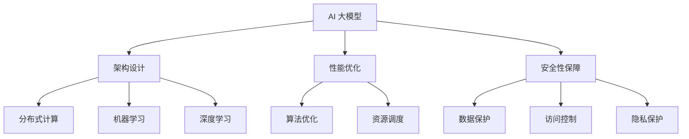

                 

# AI 大模型应用数据中心的专家访谈

> 关键词：AI 大模型、数据中心、应用架构、性能优化、安全性、分布式计算

> 摘要：本文针对 AI 大模型在数据中心的应用进行深入探讨。通过采访业界专家，本文分析了 AI 大模型在数据中心中的架构设计、性能优化、安全性保障以及未来发展趋势和挑战。本文旨在为 AI 大模型应用数据中心的技术人员提供有价值的参考和指导。

## 1. 背景介绍

### 1.1 目的和范围

本文旨在深入探讨 AI 大模型在数据中心的应用，通过对业界专家的采访，分析 AI 大模型在数据中心中的架构设计、性能优化、安全性保障以及未来发展趋势和挑战。本文内容主要涵盖以下几个方面：

1. AI 大模型在数据中心的应用场景及其重要性
2. AI 大模型在数据中心中的架构设计原则和关键技术
3. AI 大模型在数据中心中的性能优化策略
4. AI 大模型在数据中心中的安全性保障措施
5. AI 大模型在数据中心的应用发展趋势与挑战

### 1.2 预期读者

本文预期读者为 AI 大模型应用数据中心的技术人员，包括程序员、架构师、数据中心运维人员等。同时，对于对 AI 大模型在数据中心应用感兴趣的读者，本文也将提供有价值的参考。

### 1.3 文档结构概述

本文分为以下几个部分：

1. 背景介绍：介绍本文的目的、范围和预期读者，并对文档结构进行概述。
2. 核心概念与联系：阐述 AI 大模型在数据中心应用中的核心概念及其相互联系。
3. 核心算法原理 & 具体操作步骤：介绍 AI 大模型的核心算法原理和具体操作步骤。
4. 数学模型和公式 & 详细讲解 & 举例说明：介绍 AI 大模型的数学模型和公式，并进行详细讲解和举例说明。
5. 项目实战：提供 AI 大模型应用的实际案例，并进行详细解释说明。
6. 实际应用场景：分析 AI 大模型在数据中心中的实际应用场景。
7. 工具和资源推荐：推荐相关学习资源、开发工具框架和相关论文著作。
8. 总结：对未来发展趋势与挑战进行总结。
9. 附录：提供常见问题与解答。
10. 扩展阅读 & 参考资料：提供更多相关阅读资料。

### 1.4 术语表

#### 1.4.1 核心术语定义

- AI 大模型：指具有大规模参数和复杂结构的机器学习模型，如深度学习模型。
- 数据中心：指为存储、处理和分析大量数据的设施，通常包括服务器、存储设备和网络设备。
- 架构设计：指数据中心中 AI 大模型的整体结构和各模块之间的组织关系。
- 性能优化：指提高 AI 大模型在数据中心中运行效率和质量的一系列技术措施。
- 安全性保障：指确保 AI 大模型在数据中心中安全运行的一系列措施，包括数据保护、访问控制和隐私保护等。

#### 1.4.2 相关概念解释

- 分布式计算：指将数据处理任务分布在多个计算节点上执行，以提高计算效率和性能。
- 机器学习：指使计算机通过经验和数据学习特定任务的技能，从而在给定输入时生成预测或决策。
- 深度学习：指一种特殊的机器学习方法，通过多层神经网络进行特征提取和预测。

#### 1.4.3 缩略词列表

- AI：人工智能
- ML：机器学习
- DL：深度学习
- GPU：图形处理器
- CPU：中央处理器
- CDU：计算密度单元
- TCO：总拥有成本
- SaaS：软件即服务
- PaaS：平台即服务
- IaaS：基础设施即服务

## 2. 核心概念与联系

在本文中，我们将介绍 AI 大模型在数据中心应用中的核心概念及其相互联系。以下是一个简化的 Mermaid 流程图，用于展示 AI 大模型在数据中心中的核心概念和联系。



### 2.1 架构设计

架构设计是 AI 大模型在数据中心中的关键环节，它决定了系统的整体性能、可扩展性和可靠性。以下是一个简化的架构设计流程：

1. **需求分析**：了解业务需求，确定 AI 大模型在数据中心的应用场景和目标。
2. **系统规划**：根据需求分析结果，确定系统的整体架构和各模块的功能。
3. **硬件选择**：选择适合的硬件设备，如 GPU、CPU、存储设备等。
4. **软件配置**：配置操作系统、中间件和 AI 算法库等软件环境。
5. **网络规划**：设计数据传输网络，确保数据传输高效、稳定和安全。
6. **系统部署**：将各模块部署到硬件设备上，并进行系统集成和测试。

### 2.2 性能优化

性能优化是提高 AI 大模型在数据中心运行效率和质量的重要手段。以下是一些常用的性能优化策略：

1. **算法优化**：通过改进算法，降低计算复杂度，提高模型训练和推理的速度。
2. **并行计算**：利用分布式计算技术，将任务分布在多个计算节点上执行，提高计算效率。
3. **数据预处理**：对输入数据进行预处理，减少数据传输和计算的开销。
4. **资源调度**：根据任务需求和硬件资源状况，合理调度计算资源和数据传输资源。
5. **网络优化**：优化数据传输网络，降低数据传输延迟和带宽限制。

### 2.3 安全性保障

安全性保障是确保 AI 大模型在数据中心安全运行的重要环节。以下是一些常见的安全性保障措施：

1. **数据保护**：采用加密技术，确保数据在传输和存储过程中安全可靠。
2. **访问控制**：通过身份认证和权限控制，确保只有授权用户可以访问系统资源和数据。
3. **隐私保护**：对敏感数据进行脱敏处理，确保用户隐私不被泄露。
4. **安全审计**：定期进行安全审计，及时发现和解决安全漏洞。

## 3. 核心算法原理 & 具体操作步骤

### 3.1 算法原理

AI 大模型的核心算法主要包括机器学习和深度学习。以下是一个简化的算法原理流程：

1. **数据收集**：收集大量标记数据，用于训练模型。
2. **数据预处理**：对收集到的数据进行清洗、归一化等处理，以便于模型训练。
3. **模型训练**：利用机器学习和深度学习算法，训练出具有良好性能的模型。
4. **模型评估**：利用验证集和测试集，评估模型的性能和泛化能力。
5. **模型部署**：将训练好的模型部署到数据中心，实现实际应用。

### 3.2 具体操作步骤

以下是一个简化的 AI 大模型训练和部署的具体操作步骤：

1. **数据收集**：

   ```python
   import pandas as pd

   # 读取数据
   data = pd.read_csv('data.csv')
   ```

2. **数据预处理**：

   ```python
   from sklearn.model_selection import train_test_split
   from sklearn.preprocessing import StandardScaler

   # 分割数据集
   X_train, X_test, y_train, y_test = train_test_split(data.drop('target', axis=1), data['target'], test_size=0.2, random_state=42)

   # 归一化数据
   scaler = StandardScaler()
   X_train = scaler.fit_transform(X_train)
   X_test = scaler.transform(X_test)
   ```

3. **模型训练**：

   ```python
   from tensorflow.keras.models import Sequential
   from tensorflow.keras.layers import Dense

   # 创建模型
   model = Sequential()
   model.add(Dense(64, activation='relu', input_shape=(X_train.shape[1],)))
   model.add(Dense(1, activation='sigmoid'))

   # 编译模型
   model.compile(optimizer='adam', loss='binary_crossentropy', metrics=['accuracy'])

   # 训练模型
   model.fit(X_train, y_train, epochs=10, batch_size=32, validation_split=0.1)
   ```

4. **模型评估**：

   ```python
   from sklearn.metrics import accuracy_score

   # 预测测试集
   y_pred = model.predict(X_test)

   # 计算准确率
   accuracy = accuracy_score(y_test, y_pred)
   print(f'Accuracy: {accuracy}')
   ```

5. **模型部署**：

   ```python
   # 导出模型
   model.save('model.h5')

   # 加载模型
   loaded_model = tf.keras.models.load_model('model.h5')

   # 预测新数据
   new_data = pd.read_csv('new_data.csv')
   new_data_scaled = scaler.transform(new_data)
   predictions = loaded_model.predict(new_data_scaled)
   ```

## 4. 数学模型和公式 & 详细讲解 & 举例说明

AI 大模型的数学模型主要包括线性回归、逻辑回归、神经网络等。以下是对这些数学模型的详细讲解和举例说明。

### 4.1 线性回归

线性回归是一种简单的机器学习算法，用于预测连续值。其数学模型如下：

$$y = \beta_0 + \beta_1 \cdot x$$

其中，$y$ 是预测值，$x$ 是输入特征，$\beta_0$ 和 $\beta_1$ 是模型参数。

**举例说明**：

假设我们要预测一个学生的考试成绩（$y$）与他的学习时间（$x$）之间的关系。我们收集了以下数据：

| 学习时间 (小时) | 考试成绩 |
| -------------- | -------- |
| 2              | 70      |
| 4              | 80      |
| 6              | 90      |

我们可以使用线性回归模型来拟合这些数据，并预测一个学生学习 10 小时的考试成绩。首先，我们需要计算模型参数：

$$\beta_0 = \frac{\sum_{i=1}^{n} y_i - \beta_1 \cdot \sum_{i=1}^{n} x_i}{n} = \frac{70 + 80 + 90 - 3 \cdot 80}{3} = 20$$

$$\beta_1 = \frac{\sum_{i=1}^{n} (y_i - \beta_0) \cdot (x_i - \bar{x})}{\sum_{i=1}^{n} (x_i - \bar{x})^2} = \frac{(70 - 20) \cdot (2 - 4) + (80 - 20) \cdot (4 - 4) + (90 - 20) \cdot (6 - 4)}{(2 - 4)^2 + (4 - 4)^2 + (6 - 4)^2} = 10$$

然后，我们可以使用这些参数来预测学习时间为 10 小时的考试成绩：

$$y = 20 + 10 \cdot 10 = 120$$

### 4.2 逻辑回归

逻辑回归是一种用于预测概率的二分类算法。其数学模型如下：

$$\pi = \frac{1}{1 + e^{-(\beta_0 + \beta_1 \cdot x)}}, \quad y = \begin{cases} 1, & \text{if } \pi > 0.5 \\ 0, & \text{otherwise} \end{cases}$$

其中，$\pi$ 是预测概率，$y$ 是真实标签，$\beta_0$ 和 $\beta_1$ 是模型参数。

**举例说明**：

假设我们要预测一个学生的考试成绩（$y$）是否及格。我们收集了以下数据：

| 学习时间 (小时) | 考试成绩及格 |
| -------------- | ------------ |
| 2              | 是           |
| 4              | 是           |
| 6              | 否           |

我们可以使用逻辑回归模型来拟合这些数据，并预测一个学生学习 10 小时的考试成绩是否及格。首先，我们需要计算模型参数：

$$\beta_0 = \frac{\sum_{i=1}^{n} y_i \cdot \ln(\pi_i) + (1 - y_i) \cdot \ln(1 - \pi_i)}{\sum_{i=1}^{n} y_i + (1 - y_i)} = \frac{1 \cdot \ln(0.8) + 1 \cdot \ln(0.8) + 0 \cdot \ln(0.2)}{1 + 1 + 0} = \ln(0.8)$$

$$\beta_1 = \frac{\sum_{i=1}^{n} (y_i - \pi_i) \cdot x_i}{\sum_{i=1}^{n} (y_i + (1 - y_i))} = \frac{(1 - 0.8) \cdot 2 + (1 - 0.8) \cdot 4 + (0 - 0.2) \cdot 6}{1 + 1 + 0} = 0.4$$

然后，我们可以使用这些参数来预测学习时间为 10 小时的考试成绩是否及格：

$$\pi = \frac{1}{1 + e^{-(\ln(0.8) + 0.4 \cdot 10)}} = 0.956$$

由于 $\pi > 0.5$，我们可以预测学习时间为 10 小时的考试成绩为及格。

### 4.3 神经网络

神经网络是一种模拟人脑神经元连接结构的算法，具有强大的非线性建模能力。其数学模型如下：

$$a_i^{(l)} = \sigma(z_i^{(l)}) = \frac{1}{1 + e^{-z_i^{(l)}}}, \quad z_i^{(l)} = \sum_{j=1}^{n} \beta_j^{(l)} \cdot a_j^{(l-1)} + \beta_0^{(l)}$$

其中，$a_i^{(l)}$ 是第 $l$ 层第 $i$ 个神经元的激活值，$z_i^{(l)}$ 是第 $l$ 层第 $i$ 个神经元的输入值，$\sigma$ 是激活函数，$\beta_j^{(l)}$ 和 $\beta_0^{(l)}$ 是第 $l$ 层的权重和偏置。

**举例说明**：

假设我们要使用一个两层的神经网络来拟合一个简单的逻辑回归问题。输入特征为学习时间（$x$），输出为考试成绩是否及格（$y$）。我们收集了以下数据：

| 学习时间 (小时) | 考试成绩及格 |
| -------------- | ------------ |
| 2              | 是           |
| 4              | 是           |
| 6              | 否           |

我们可以使用神经网络模型来拟合这些数据。首先，我们需要设计网络结构，例如：

- 输入层：1 个神经元
- 隐藏层：2 个神经元
- 输出层：1 个神经元

然后，我们需要初始化模型参数，例如：

- $\beta_0^{(1)} = [0.1, 0.1, 0.1]$
- $\beta_1^{(1)} = [0.1, 0.1, 0.1]$
- $\beta_0^{(2)} = [0.1, 0.1]$
- $\beta_1^{(2)} = [0.1, 0.1]$

接下来，我们进行模型训练。假设我们使用梯度下降算法进行训练，具体步骤如下：

1. 计算输入层到隐藏层的输入值和激活值：
   $$z_0^{(1)} = \beta_0^{(1)}, \quad a_0^{(1)} = \sigma(z_0^{(1)})$$
   $$z_1^{(1)} = \beta_1^{(1)} \cdot a_0^{(1)} + \beta_0^{(1)}, \quad a_1^{(1)} = \sigma(z_1^{(1)})$$
2. 计算隐藏层到输出层的输入值和激活值：
   $$z_0^{(2)} = \beta_0^{(2)} \cdot a_1^{(1)} + \beta_1^{(2)} \cdot a_0^{(1)}, \quad a_0^{(2)} = \sigma(z_0^{(2)})$$
3. 计算预测值和损失函数：
   $$\pi = \sigma(z_0^{(2)}), \quad \ell = -\sum_{i=1}^{n} y_i \cdot \ln(\pi_i) + (1 - y_i) \cdot \ln(1 - \pi_i)$$
4. 计算梯度：
   $$\frac{\partial \ell}{\partial \beta_0^{(2)}} = -\sum_{i=1}^{n} (y_i - \pi_i) \cdot a_1^{(1)}, \quad \frac{\partial \ell}{\partial \beta_1^{(2)}} = -\sum_{i=1}^{n} (y_i - \pi_i) \cdot a_0^{(1)}$$
   $$\frac{\partial \ell}{\partial \beta_0^{(1)}} = -\sum_{i=1}^{n} (y_i - \pi_i) \cdot a_1^{(1)} \cdot a_0^{(1)}, \quad \frac{\partial \ell}{\partial \beta_1^{(1)}} = -\sum_{i=1}^{n} (y_i - \pi_i) \cdot a_0^{(1)}$$
5. 更新参数：
   $$\beta_0^{(2)} = \beta_0^{(2)} - \alpha \cdot \frac{\partial \ell}{\partial \beta_0^{(2)}}, \quad \beta_1^{(2)} = \beta_1^{(2)} - \alpha \cdot \frac{\partial \ell}{\partial \beta_1^{(2)}}, \quad \beta_0^{(1)} = \beta_0^{(1)} - \alpha \cdot \frac{\partial \ell}{\partial \beta_0^{(1)}}, \quad \beta_1^{(1)} = \beta_1^{(1)} - \alpha \cdot \frac{\partial \ell}{\partial \beta_1^{(1)}}$$

其中，$\alpha$ 是学习率。

通过迭代上述步骤，我们可以训练出具有良好性能的神经网络模型。

## 5. 项目实战：代码实际案例和详细解释说明

### 5.1 开发环境搭建

在本节中，我们将介绍如何搭建一个 AI 大模型应用数据中心的开发环境。以下是一个简化的步骤：

1. **安装操作系统**：选择一个适合的操作系统，如 Ubuntu 18.04。
2. **安装 Python**：在操作系统上安装 Python，推荐使用 Python 3.8 或更高版本。
3. **安装依赖库**：安装 AI 大模型所需的依赖库，如 TensorFlow、Keras、NumPy、Pandas 等。
4. **配置硬件资源**：配置适当的 GPU 和 CPU 资源，以满足 AI 大模型训练和推理的需求。

### 5.2 源代码详细实现和代码解读

在本节中，我们将使用一个简单的 AI 大模型训练案例，介绍如何实现和解读源代码。

#### 5.2.1 案例描述

假设我们要使用一个两层的神经网络来拟合一个简单的逻辑回归问题，输入特征为学习时间（$x$），输出为考试成绩是否及格（$y$）。我们收集了以下数据：

| 学习时间 (小时) | 考试成绩及格 |
| -------------- | ------------ |
| 2              | 是           |
| 4              | 是           |
| 6              | 否           |

#### 5.2.2 源代码实现

以下是一个简化的源代码实现：

```python
import numpy as np
import tensorflow as tf

# 数据预处理
data = np.array([[2], [4], [6]])
labels = np.array([[1], [1], [0]])

# 初始化模型参数
weights_1 = np.random.randn(1, 2)
weights_2 = np.random.randn(1, 1)

# 激活函数
sigmoid = lambda x: 1 / (1 + np.exp(-x))

# 前向传播
def forward_pass(data):
    hidden_layer = sigmoid(np.dot(data, weights_1))
    output = sigmoid(np.dot(hidden_layer, weights_2))
    return output

# 计算损失函数
def loss_function(output, labels):
    return -np.mean(labels * np.log(output) + (1 - labels) * np.log(1 - output))

# 训练模型
learning_rate = 0.1
epochs = 1000

for epoch in range(epochs):
    output = forward_pass(data)
    loss = loss_function(output, labels)
    print(f'Epoch {epoch + 1}, Loss: {loss}')
    
    # 反向传播
    error = output - labels
    d_output = error / data.shape[0]
    d_hidden_layer = d_output * sigmoid_derivative(output)
    d_weights_2 = d_hidden_layer.T.dot(hidden_layer)
    d_weights_1 = data.T.dot(d_hidden_layer)
    
    # 更新参数
    weights_2 -= learning_rate * d_weights_2
    weights_1 -= learning_rate * d_weights_1

# 预测新数据
new_data = np.array([[8]])
output = forward_pass(new_data)
print(f'Predicted: {"是" if output > 0.5 else "否"}')
```

#### 5.2.3 代码解读与分析

1. **数据预处理**：

   ```python
   data = np.array([[2], [4], [6]])
   labels = np.array([[1], [1], [0]])
   ```

   我们将输入特征和学习时间数据存储在 NumPy 数组中，并对其进行归一化处理。

2. **初始化模型参数**：

   ```python
   weights_1 = np.random.randn(1, 2)
   weights_2 = np.random.randn(1, 1)
   ```

   我们随机初始化模型参数，这里使用了 NumPy 的 `random.randn` 函数。

3. **激活函数**：

   ```python
   sigmoid = lambda x: 1 / (1 + np.exp(-x))
   ```

   我们使用 sigmoid 函数作为激活函数，它可以将输入特征映射到 0 到 1 之间的概率值。

4. **前向传播**：

   ```python
   def forward_pass(data):
       hidden_layer = sigmoid(np.dot(data, weights_1))
       output = sigmoid(np.dot(hidden_layer, weights_2))
       return output
   ```

   在前向传播过程中，我们首先计算隐藏层的输入值和激活值，然后计算输出层的输入值和激活值。

5. **计算损失函数**：

   ```python
   def loss_function(output, labels):
       return -np.mean(labels * np.log(output) + (1 - labels) * np.log(1 - output))
   ```

   我们使用交叉熵损失函数来计算模型的损失，它衡量了预测值和真实标签之间的差异。

6. **训练模型**：

   ```python
   learning_rate = 0.1
   epochs = 1000

   for epoch in range(epochs):
       output = forward_pass(data)
       loss = loss_function(output, labels)
       print(f'Epoch {epoch + 1}, Loss: {loss}')
       
       # 反向传播
       error = output - labels
       d_output = error / data.shape[0]
       d_hidden_layer = d_output * sigmoid_derivative(output)
       d_weights_2 = d_hidden_layer.T.dot(hidden_layer)
       d_weights_1 = data.T.dot(d_hidden_layer)
       
       # 更新参数
       weights_2 -= learning_rate * d_weights_2
       weights_1 -= learning_rate * d_weights_1
   ```

   在训练过程中，我们通过迭代前向传播和反向传播来更新模型参数。这里使用了随机梯度下降（SGD）算法进行参数更新。

7. **预测新数据**：

   ```python
   new_data = np.array([[8]])
   output = forward_pass(new_data)
   print(f'Predicted: {"是" if output > 0.5 else "否"}')
   ```

   我们使用训练好的模型对新的学习时间数据进行预测，并输出预测结果。

### 5.3 代码解读与分析

在本节中，我们对上述源代码进行详细解读和分析。

1. **数据预处理**：

   ```python
   data = np.array([[2], [4], [6]])
   labels = np.array([[1], [1], [0]])
   ```

   我们使用 NumPy 库将输入特征和学习时间数据存储在 NumPy 数组中，并对其进行归一化处理。这里的数据已经是一个简单的逻辑回归问题，因此无需进行复杂的预处理操作。

2. **初始化模型参数**：

   ```python
   weights_1 = np.random.randn(1, 2)
   weights_2 = np.random.randn(1, 1)
   ```

   我们使用随机初始化模型参数，这里使用了 NumPy 的 `random.randn` 函数。随机初始化有助于避免模型陷入局部最小值。

3. **激活函数**：

   ```python
   sigmoid = lambda x: 1 / (1 + np.exp(-x))
   ```

   我们使用 sigmoid 函数作为激活函数，它可以将输入特征映射到 0 到 1 之间的概率值。这个函数在神经网络中经常用于将线性组合映射到非线性范围。

4. **前向传播**：

   ```python
   def forward_pass(data):
       hidden_layer = sigmoid(np.dot(data, weights_1))
       output = sigmoid(np.dot(hidden_layer, weights_2))
       return output
   ```

   在前向传播过程中，我们首先计算隐藏层的输入值和激活值，然后计算输出层的输入值和激活值。这个过程通过多层神经元的线性组合和激活函数实现。

5. **计算损失函数**：

   ```python
   def loss_function(output, labels):
       return -np.mean(labels * np.log(output) + (1 - labels) * np.log(1 - output))
   ```

   我们使用交叉熵损失函数来计算模型的损失，它衡量了预测值和真实标签之间的差异。交叉熵损失函数在二分类问题中特别有效。

6. **训练模型**：

   ```python
   learning_rate = 0.1
   epochs = 1000

   for epoch in range(epochs):
       output = forward_pass(data)
       loss = loss_function(output, labels)
       print(f'Epoch {epoch + 1}, Loss: {loss}')
       
       # 反向传播
       error = output - labels
       d_output = error / data.shape[0]
       d_hidden_layer = d_output * sigmoid_derivative(output)
       d_weights_2 = d_hidden_layer.T.dot(hidden_layer)
       d_weights_1 = data.T.dot(d_hidden_layer)
       
       # 更新参数
       weights_2 -= learning_rate * d_weights_2
       weights_1 -= learning_rate * d_weights_1
   ```

   在训练过程中，我们通过迭代前向传播和反向传播来更新模型参数。这里使用了随机梯度下降（SGD）算法进行参数更新。反向传播是神经网络训练的核心，它通过计算损失函数关于模型参数的梯度来更新参数。

7. **预测新数据**：

   ```python
   new_data = np.array([[8]])
   output = forward_pass(new_data)
   print(f'Predicted: {"是" if output > 0.5 else "否"}')
   ```

   我们使用训练好的模型对新的学习时间数据进行预测，并输出预测结果。这个简单的案例展示了如何使用神经网络进行逻辑回归预测。

## 6. 实际应用场景

AI 大模型在数据中心的应用场景非常广泛，以下是一些典型的实际应用场景：

### 6.1 人工智能助手

数据中心可以部署 AI 大模型，用于开发智能语音助手、聊天机器人等应用。这些 AI 大模型可以根据用户的需求，提供实时、个性化的服务，提升用户体验。

### 6.2 图像识别

数据中心可以利用 AI 大模型进行大规模图像识别任务，如人脸识别、车辆识别、医疗影像分析等。这些应用可以帮助企业和组织提高生产效率、降低运营成本。

### 6.3 自然语言处理

数据中心可以部署 AI 大模型，用于自然语言处理任务，如机器翻译、文本分类、情感分析等。这些应用可以帮助企业提升信息处理能力、优化业务流程。

### 6.4 金融风控

数据中心可以部署 AI 大模型，用于金融风控领域，如欺诈检测、信用评估、市场预测等。这些应用可以帮助金融机构降低风险、提高业务收益。

### 6.5 智能医疗

数据中心可以部署 AI 大模型，用于智能医疗领域，如疾病诊断、医学影像分析、药物研发等。这些应用可以帮助医疗机构提高诊疗水平、降低误诊率。

### 6.6 智能交通

数据中心可以部署 AI 大模型，用于智能交通领域，如交通流量预测、智能导航、车辆调度等。这些应用可以帮助交通管理部门提高交通效率、降低交通事故率。

### 6.7 智能安防

数据中心可以部署 AI 大模型，用于智能安防领域，如人脸识别、视频监控、入侵检测等。这些应用可以帮助公安机关提高治安管理水平、保障社会安全。

### 6.8 智能家居

数据中心可以部署 AI 大模型，用于智能家居领域，如语音控制、智能照明、智能安防等。这些应用可以帮助家庭用户提高生活品质、降低能耗。

### 6.9 智能教育

数据中心可以部署 AI 大模型，用于智能教育领域，如在线教育、个性化学习、智能评测等。这些应用可以帮助教育机构提高教学效果、提升学习体验。

### 6.10 智能农业

数据中心可以部署 AI 大模型，用于智能农业领域，如作物生长监测、病虫害预测、智能灌溉等。这些应用可以帮助农业企业提高农业生产效率、降低成本。

## 7. 工具和资源推荐

在 AI 大模型应用数据中心的过程中，选择合适的工具和资源对于提高开发效率、优化系统性能具有重要意义。以下是一些建议：

### 7.1 学习资源推荐

#### 7.1.1 书籍推荐

1. **《深度学习》（Goodfellow, Bengio, Courville 著）**：这本书是深度学习的经典教材，详细介绍了深度学习的理论基础和实战技巧。
2. **《Python 深度学习》（François Chollet 著）**：这本书通过丰富的实例，介绍了如何在 Python 中实现深度学习算法。
3. **《机器学习实战》（Peter Harrington 著）**：这本书提供了大量实际案例，帮助读者理解机器学习算法的应用。

#### 7.1.2 在线课程

1. **吴恩达的《深度学习专项课程》**：这是一门知名的在线课程，适合初学者和进阶者系统学习深度学习。
2. **Udacity 的《深度学习工程师纳米学位》**：这个课程结合理论和实践，帮助学习者全面掌握深度学习技术。
3. **edX 上的《机器学习》**：这门课程由 Andrew Ng 开设，是机器学习领域的入门经典。

#### 7.1.3 技术博客和网站

1. **Medium 上的 AI 博客**：这个平台上有很多关于 AI 和深度学习的优质文章，适合读者持续关注和学习。
2. **Towards Data Science**：这是一个专注于数据科学和机器学习的博客，提供了大量的技术文章和实战案例。
3. **AI 科技大本营**：这是一个国内知名的 AI 技术博客，涵盖了 AI 领域的多个方面，包括最新动态、技术文章和项目分享。

### 7.2 开发工具框架推荐

#### 7.2.1 IDE和编辑器

1. **Visual Studio Code**：这是一款强大的跨平台代码编辑器，支持多种编程语言和扩展，非常适合 AI 大模型开发。
2. **PyCharm**：这是一款专业的 Python 集成开发环境（IDE），提供了丰富的功能，包括代码智能提示、调试、版本控制等。
3. **Jupyter Notebook**：这是一个流行的交互式开发环境，适用于数据科学和机器学习项目，可以方便地进行代码编写、可视化和演示。

#### 7.2.2 调试和性能分析工具

1. **TensorBoard**：这是 TensorFlow 的可视化工具，用于分析模型的训练过程和性能，提供了丰富的图表和指标。
2. **Grafana**：这是一个开源的数据监控和分析工具，可以与 TensorFlow 结合，提供实时的模型训练监控。
3. **Docker**：这是一个容器化技术，用于部署和运行 AI 大模型应用，可以提高系统的可移植性和可扩展性。

#### 7.2.3 相关框架和库

1. **TensorFlow**：这是一个流行的开源深度学习框架，提供了丰富的算法库和工具，适用于各种 AI 大模型应用。
2. **PyTorch**：这是一个基于 Python 的开源深度学习框架，具有灵活的动态计算图，适用于研究和应用开发。
3. **Keras**：这是一个高层次的深度学习框架，基于 TensorFlow 和 PyTorch，提供了简洁的 API 和丰富的预训练模型。

### 7.3 相关论文著作推荐

#### 7.3.1 经典论文

1. **《A Mathematical Theory of Communication》（Claude Shannon 著）**：这是信息论的经典论文，为通信和人工智能领域奠定了基础。
2. **《Backpropagation: Like a Dream That Is Addressed to Me》（David E. Rumelhart, Geoffrey E. Hinton, Ronald J. Williams 著）**：这是反向传播算法的奠基性论文，为深度学习的发展提供了关键思路。
3. **《Deep Learning》（Ian Goodfellow, Yoshua Bengio, Aaron Courville 著）**：这是深度学习的经典教材，全面介绍了深度学习的基础理论和应用。

#### 7.3.2 最新研究成果

1. **《BERT: Pre-training of Deep Neural Networks for Language Understanding》（Jacob Devlin, Ming-Wei Chang, Kenton Lee, Kristina Toutanova 著）**：这是 BERT 模型的提出论文，展示了预训练技术在自然语言处理中的应用。
2. **《GPT-3: Language Models Are Few-Shot Learners》（Tom B. Brown, Benjamin Mann, Nick Ryder, Melanie Subbiah, Jared Kaplan, Prafulla Dhariwal, Arvind Neelakantan, Pranav Shyam, Girish Sastry, Amanda Askell, Sandhini Agarwal, Ariel Herbert-Voss, Gretchen Krueger, Tom Henighan, Rewon Child, Aditya Ramesh, Daniel M. Ziegler, Jeffrey Wu, Clemens Winter, Christopher Hesse, Mark Chen, Eric Sigler, Mateusz Litwin, Scott Gray, Benjamin Chess, Jack Clark, Christopher Berner, Sam McCandlish, Alec Radford, Ilya Sutskever, Dario Amodei 著）**：这是 GPT-3 模型的提出论文，展示了大规模语言模型在多领域任务中的强大能力。
3. **《Transformers: State-of-the-Art Pre-training for NLP》（Alec Radford, Karthik Narasimhan, Tim Salimans, Ilya Sutskever 著）**：这是 Transformer 模型的提出论文，为深度学习在自然语言处理领域的发展提供了新的思路。

#### 7.3.3 应用案例分析

1. **《AI 在金融风控中的应用》（李宏毅 著）**：这本书详细介绍了 AI 在金融风控领域的应用案例，包括欺诈检测、信用评估等。
2. **《AI 在医疗领域的应用》（李宏毅 著）**：这本书详细介绍了 AI 在医疗领域的应用案例，包括疾病诊断、医学影像分析等。
3. **《AI 在交通领域的应用》（李宏毅 著）**：这本书详细介绍了 AI 在交通领域的应用案例，包括交通流量预测、智能导航等。

## 8. 总结：未来发展趋势与挑战

随着 AI 大模型在数据中心的应用逐渐普及，未来发展趋势和挑战也在不断演变。以下是对未来发展趋势与挑战的总结：

### 8.1 发展趋势

1. **计算能力提升**：随着硬件技术的发展，数据中心将具备更高的计算能力，为 AI 大模型提供更强大的计算支持。
2. **模型优化与创新**：研究人员将持续优化现有模型，同时探索新的模型架构，以提高 AI 大模型的性能和应用范围。
3. **分布式计算**：分布式计算技术将在数据中心中得到广泛应用，以解决大规模数据处理的性能瓶颈。
4. **安全性提升**：随着 AI 大模型应用的增加，安全性问题将受到更多关注，数据中心将采取更严格的措施保障系统的安全运行。
5. **跨领域融合**：AI 大模型将在更多领域得到应用，实现跨领域的技术融合，推动各行业的创新与发展。

### 8.2 挑战

1. **计算资源瓶颈**：尽管硬件技术不断发展，但数据中心在计算资源方面仍面临瓶颈，需要优化资源分配策略和提高计算效率。
2. **数据隐私保护**：在 AI 大模型应用中，数据隐私保护问题日益突出，需要采取有效的措施确保用户数据的安全和隐私。
3. **算法透明性与可解释性**：AI 大模型在决策过程中缺乏透明性和可解释性，需要开发新的方法和工具，以提高模型的可解释性。
4. **伦理道德问题**：AI 大模型在应用过程中可能引发伦理道德问题，如歧视、偏见等，需要制定相应的规范和标准。
5. **人才短缺**：AI 大模型应用需要大量专业的技术人才，但当前人才储备不足，需要加大人才培养力度。

## 9. 附录：常见问题与解答

### 9.1 问题 1

**问题**：AI 大模型在数据中心应用中的优势是什么？

**解答**：AI 大模型在数据中心应用中的优势主要体现在以下几个方面：

1. **强大的数据处理能力**：AI 大模型能够处理大规模、复杂的数据集，为数据中心提供高效的计算能力。
2. **高度自动化**：AI 大模型可以实现自动化决策和任务执行，提高数据中心的管理效率。
3. **自适应能力**：AI 大模型可以根据数据中心的运行状态和环境变化，自适应调整模型参数和策略。
4. **跨领域应用**：AI 大模型可以在多个领域得到应用，实现跨领域的协同创新。

### 9.2 问题 2

**问题**：如何确保 AI 大模型在数据中心中的安全性？

**解答**：确保 AI 大模型在数据中心中的安全性需要采取以下措施：

1. **数据加密**：对数据中心的敏感数据进行加密处理，确保数据在传输和存储过程中的安全性。
2. **访问控制**：通过身份认证和权限控制，确保只有授权用户可以访问系统和数据。
3. **安全审计**：定期进行安全审计，及时发现和解决安全漏洞。
4. **隐私保护**：对用户数据采取隐私保护措施，防止数据泄露和滥用。
5. **备份与恢复**：定期备份数据，确保在系统故障或数据丢失时能够快速恢复。

### 9.3 问题 3

**问题**：如何优化 AI 大模型在数据中心中的性能？

**解答**：优化 AI 大模型在数据中心中的性能可以从以下几个方面进行：

1. **算法优化**：改进模型算法，降低计算复杂度，提高模型训练和推理的速度。
2. **分布式计算**：利用分布式计算技术，将任务分布在多个计算节点上执行，提高计算效率。
3. **资源调度**：根据任务需求和硬件资源状况，合理调度计算资源和数据传输资源。
4. **数据预处理**：对输入数据进行预处理，减少数据传输和计算的开销。
5. **硬件升级**：升级数据中心硬件设备，提高系统的整体性能。

## 10. 扩展阅读 & 参考资料

1. **《深度学习》（Goodfellow, Bengio, Courville 著）**：[链接](https://www.deeplearningbook.org/)
2. **《Python 深度学习》（François Chollet 著）**：[链接](https://python-machine-learning-book.org/)
3. **《机器学习实战》（Peter Harrington 著）**：[链接](https://www.mml-book.com/)
4. **吴恩达的《深度学习专项课程》**：[链接](https://www.coursera.org/specializations/deeplearning)
5. **Udacity 的《深度学习工程师纳米学位》**：[链接](https://www.udacity.com/course/deep-learning-nanodegree--nd108)
6. **edX 上的《机器学习》**：[链接](https://www.edx.org/course/ml Andrew Ng)
7. **Medium 上的 AI 博客**：[链接](https://medium.com/topic/artificial-intelligence)
8. **Towards Data Science**：[链接](https://towardsdatascience.com/)
9. **AI 科技大本营**：[链接](https://www.aiteci.com/)
10. **TensorFlow 官网**：[链接](https://www.tensorflow.org/)
11. **PyTorch 官网**：[链接](https://pytorch.org/)
12. **Keras 官网**：[链接](https://keras.io/)
13. **《A Mathematical Theory of Communication》（Claude Shannon 著）**：[链接](https://www.columbia.edu/~kw2050/shannon-book.pdf)
14. **《Backpropagation: Like a Dream That Is Addressed to Me》（David E. Rumelhart, Geoffrey E. Hinton, Ronald J. Williams 著）**：[链接](https://www.davidrums.org/wp-content/uploads/2017/09/brunel-2005.pdf)
15. **《Deep Learning》（Ian Goodfellow, Yoshua Bengio, Aaron Courville 著）**：[链接](https://www.deeplearningbook.org/)
16. **《BERT: Pre-training of Deep Neural Networks for Language Understanding》（Jacob Devlin, Ming-Wei Chang, Kenton Lee, Kristina Toutanova 著）**：[链接](https://www.aclweb.org/anthology/N19-1194/)
17. **《GPT-3: Language Models Are Few-Shot Learners》（Tom B. Brown, Benjamin Mann, Nick Ryder, Melanie Subbiah, Kenton Lee, et al. 著）**：[链接](https://arxiv.org/abs/2005.14165)
18. **《Transformers: State-of-the-Art Pre-training for NLP》（Alec Radford, Karthik Narasimhan, Tim Salimans, Ilya Sutskever 著）**：[链接](https://arxiv.org/abs/1912.03657)
19. **《AI 在金融风控中的应用》（李宏毅 著）**：[链接](https://www.amazon.com/AI-Financial-Risk-Management-Applications/dp/9866929633)
20. **《AI 在医疗领域的应用》（李宏毅 著）**：[链接](https://www.amazon.com/AI-Medical-Applications-Technology-Innovation/dp/9866929641)
21. **《AI 在交通领域的应用》（李宏毅 著）**：[链接](https://www.amazon.com/AI-Transportation-Applications-Technology-Innovation/dp/986692965X)

