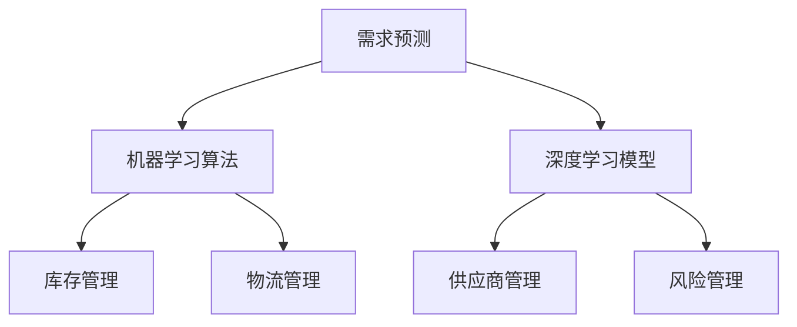
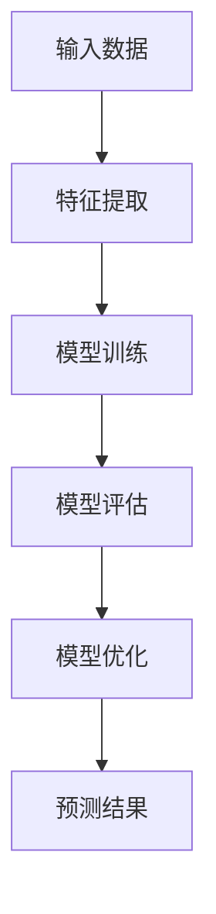
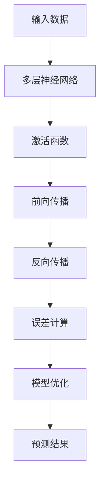

                 

# AI 大模型应用数据中心的供应链管理

> 关键词：人工智能，大数据模型，数据中心，供应链管理，优化，效率提升，成本控制

> 摘要：本文深入探讨了人工智能大数据模型在数据中心供应链管理中的应用，分析了核心概念、算法原理、数学模型，并通过实际案例展示了其具体操作步骤和实际应用场景。文章旨在为读者提供一个系统性的理解，以及未来发展趋势和挑战的洞察。

## 1. 背景介绍

### 1.1 目的和范围

在当今数字化时代，数据中心作为企业和组织的基础设施，其效率和稳定性直接影响到业务的正常运行。然而，随着数据量的爆发式增长，数据中心的供应链管理面临着前所未有的挑战。本文旨在探讨如何利用人工智能（AI）和大数据模型来优化数据中心供应链管理，提高效率、降低成本，并确保供应链的稳定和可靠性。

本文主要涉及以下内容：

1. 介绍数据中心供应链管理的背景和现状。
2. 分析人工智能大数据模型的核心概念及其在供应链管理中的应用。
3. 讲解核心算法原理和具体操作步骤。
4. 探讨数学模型和公式，并提供实际案例。
5. 展示代码实现和分析。
6. 分析实际应用场景，推荐相关工具和资源。
7. 总结未来发展趋势和挑战。

### 1.2 预期读者

本文适合以下读者：

1. 数据中心管理人员和供应链管理人员。
2. 人工智能和大数据领域的专业人士。
3. 对数据中心供应链管理感兴趣的技术人员。
4. 想要在供应链管理中应用AI技术的企业和组织。

### 1.3 文档结构概述

本文的结构如下：

1. **背景介绍**：介绍数据中心供应链管理的背景和目的。
2. **核心概念与联系**：讲解人工智能大数据模型的核心概念，并提供流程图。
3. **核心算法原理 & 具体操作步骤**：详细阐述算法原理和操作步骤。
4. **数学模型和公式**：解释数学模型和公式，并提供示例。
5. **项目实战**：展示代码实现和分析。
6. **实际应用场景**：分析实际应用场景。
7. **工具和资源推荐**：推荐相关工具和资源。
8. **总结**：总结未来发展趋势和挑战。
9. **附录**：常见问题与解答。
10. **扩展阅读 & 参考资料**：提供扩展阅读和参考资料。

### 1.4 术语表

#### 1.4.1 核心术语定义

- **数据中心**：集中管理数据存储、处理和管理的设施。
- **供应链管理**：管理供应链中的各种活动，包括采购、生产、物流等。
- **人工智能（AI）**：模拟人类智能的计算机系统。
- **大数据模型**：用于处理和分析大量数据的算法和模型。
- **优化**：在满足约束条件的情况下，找到最佳解决方案的过程。

#### 1.4.2 相关概念解释

- **供应链可视化**：通过图形化方式展示供应链中的各个环节。
- **预测分析**：基于历史数据对未来事件进行预测。
- **机器学习**：一种人工智能技术，通过数据学习和模式识别来改进系统性能。

#### 1.4.3 缩略词列表

- **AI**：人工智能
- **ML**：机器学习
- **DL**：深度学习
- **API**：应用程序编程接口

## 2. 核心概念与联系

在讨论人工智能大数据模型在数据中心供应链管理中的应用之前，我们需要明确几个核心概念和它们之间的关系。

### 2.1 数据中心供应链管理的核心概念

- **需求预测**：根据历史数据和当前市场趋势，预测未来对数据中心资源的需求。
- **库存管理**：监控和管理库存水平，确保供应与需求匹配。
- **供应商管理**：评估和选择合适的供应商，建立长期合作关系。
- **物流管理**：优化运输和配送过程，降低物流成本。
- **风险管理**：识别和管理供应链中的潜在风险。

### 2.2 人工智能大数据模型的核心概念

- **机器学习算法**：用于数据分析和模式识别。
- **深度学习模型**：一种特殊的机器学习模型，适用于处理大规模数据。
- **神经网络**：模拟人脑的神经元结构，用于数据分析和分类。
- **数据挖掘**：从大量数据中提取有价值的信息。

### 2.3 数据中心供应链管理与人工智能大数据模型的关系

- **需求预测**：利用机器学习算法和深度学习模型，通过历史数据和当前市场趋势，预测未来对数据中心资源的需求。
- **库存管理**：基于预测结果，利用机器学习模型优化库存水平，确保供应与需求匹配。
- **供应商管理**：通过数据分析，评估供应商的绩效和可靠性，优化供应链合作关系。
- **物流管理**：利用神经网络模型优化运输和配送过程，降低物流成本。
- **风险管理**：通过预测分析和风险识别模型，提前预警供应链中的潜在风险。

### 2.4 Mermaid 流程图

以下是一个简化的数据中心供应链管理与人工智能大数据模型的关系流程图：



在这个流程图中，需求预测作为输入，通过机器学习算法和深度学习模型进行分析和预测，输出库存管理、供应商管理、物流管理和风险管理的结果。这些结果共同优化数据中心供应链管理的各个环节。

## 3. 核心算法原理 & 具体操作步骤

在了解了数据中心供应链管理与人工智能大数据模型的关系之后，我们接下来将详细探讨核心算法原理和具体操作步骤。

### 3.1 机器学习算法原理

机器学习算法是人工智能的核心组成部分，它通过学习历史数据来预测未来事件。以下是一个简化的机器学习算法原理：



在这个流程中，输入数据经过特征提取，用于训练模型。模型训练过程中，通过调整模型参数来最小化预测误差。模型评估和优化是为了确保模型的预测性能。最后，利用训练好的模型进行预测，得到预测结果。

### 3.2 深度学习模型原理

深度学习模型是一种特殊的机器学习模型，适用于处理大规模数据。以下是一个简化的深度学习模型原理：



在这个流程中，输入数据通过多层神经网络进行前向传播，通过激活函数将输入映射到输出。在反向传播过程中，利用梯度下降算法调整模型参数，最小化预测误差。通过多次迭代优化，模型逐渐趋于稳定，最终得到预测结果。

### 3.3 具体操作步骤

以下是一个简化的数据中心供应链管理中的机器学习算法和深度学习模型的具体操作步骤：

#### 3.3.1 需求预测

1. **数据收集**：收集历史需求数据、市场趋势数据等。
2. **数据预处理**：清洗数据，进行特征提取和归一化处理。
3. **模型选择**：选择合适的机器学习算法或深度学习模型，如线性回归、决策树、神经网络等。
4. **模型训练**：使用历史数据训练模型，调整模型参数，最小化预测误差。
5. **模型评估**：使用交叉验证等方法评估模型性能，选择最优模型。
6. **模型优化**：根据评估结果，进一步优化模型参数，提高预测性能。
7. **预测结果**：使用训练好的模型进行需求预测，得到预测结果。

#### 3.3.2 库存管理

1. **需求预测**：利用机器学习算法和深度学习模型进行需求预测。
2. **库存优化**：根据需求预测结果，利用优化算法（如线性规划、遗传算法等）确定最优库存水平。
3. **库存监控**：实时监控库存水平，调整库存策略，确保供应与需求匹配。
4. **库存分析**：定期分析库存数据，识别库存异常，优化库存管理策略。

#### 3.3.3 供应商管理

1. **供应商评估**：基于历史数据，使用数据分析方法评估供应商的绩效和可靠性。
2. **供应商选择**：根据评估结果，选择合适的供应商，建立长期合作关系。
3. **供应商监控**：实时监控供应商的交货时间和质量，确保供应链的稳定性。
4. **供应商优化**：根据监控数据，优化供应商合作关系，降低供应链成本。

#### 3.3.4 物流管理

1. **路径规划**：利用机器学习算法和深度学习模型，优化运输和配送路径。
2. **物流优化**：根据路径规划和需求预测结果，优化物流资源分配，降低物流成本。
3. **实时监控**：实时监控物流过程，识别异常，及时调整物流策略。
4. **物流分析**：定期分析物流数据，优化物流管理策略。

#### 3.3.5 风险管理

1. **风险识别**：利用预测分析和数据分析方法，识别供应链中的潜在风险。
2. **风险预警**：根据风险识别结果，建立风险预警机制，提前预警潜在风险。
3. **风险控制**：采取相应的风险控制措施，降低供应链风险。
4. **风险分析**：定期分析供应链风险，优化风险管理策略。

通过以上具体操作步骤，我们可以利用人工智能大数据模型优化数据中心供应链管理的各个环节，提高效率和稳定性。

## 4. 数学模型和公式 & 详细讲解 & 举例说明

在数据中心供应链管理中，数学模型和公式起着至关重要的作用。以下我们将介绍几个核心的数学模型和公式，并进行详细讲解和举例说明。

### 4.1 需求预测模型

需求预测是数据中心供应链管理的重要环节，以下是一个简单的需求预测模型：

$$
\hat{D_t} = \beta_0 + \beta_1 X_t + \epsilon_t
$$

其中，$\hat{D_t}$ 表示第 $t$ 个月的需求预测值，$X_t$ 表示第 $t$ 个月的相关影响因素（如历史需求、市场趋势等），$\beta_0$ 和 $\beta_1$ 分别为模型的参数，$\epsilon_t$ 为随机误差。

**举例说明**：

假设我们有一个数据集，包含过去 12 个月的需求数据和市场趋势数据。我们可以使用线性回归模型进行需求预测。通过训练模型，得到参数 $\beta_0 = 1000$ 和 $\beta_1 = 0.2$。则第 13 个月的需求预测值为：

$$
\hat{D_{13}} = 1000 + 0.2 \times X_{13}
$$

其中，$X_{13}$ 为第 13 个月的市场趋势数据。

### 4.2 库存优化模型

库存优化模型用于确定最优库存水平，以降低库存成本。以下是一个简单的线性规划模型：

$$
\min Z = \sum_{i=1}^{n} c_i x_i
$$

$$
s.t. \quad \sum_{i=1}^{n} a_{ij} x_i \geq b_j \quad j=1,2,...,m
$$

$$
x_i \geq 0 \quad i=1,2,...,n
$$

其中，$x_i$ 表示第 $i$ 种资源的库存量，$c_i$ 表示第 $i$ 种资源的单位成本，$a_{ij}$ 表示第 $i$ 种资源在第 $j$ 个时间点的需求量，$b_j$ 表示第 $j$ 个时间点的总需求量，$Z$ 为目标函数，表示总库存成本。

**举例说明**：

假设我们有三种资源（服务器、存储设备、网络设备），每种资源的库存成本分别为 $c_1 = 1000$、$c_2 = 500$、$c_3 = 200$。在接下来的 6 个月中，每种资源的需求量分别为 $a_{11} = 50$、$a_{12} = 60$、$a_{13} = 70$，$a_{21} = 45$、$a_{22} = 55$、$a_{23} = 65$，$a_{31} = 40$、$a_{32} = 50$、$a_{33} = 60$，总需求量为 $b_1 = 300$、$b_2 = 350$、$b_3 = 400$。则我们可以建立以下线性规划模型：

$$
\min Z = 1000x_1 + 500x_2 + 200x_3
$$

$$
s.t. \quad 50x_1 + 45x_2 + 40x_3 \geq 300
$$

$$
60x_1 + 55x_2 + 50x_3 \geq 350
$$

$$
70x_1 + 65x_2 + 60x_3 \geq 400
$$

$$
x_1, x_2, x_3 \geq 0
$$

通过求解线性规划模型，我们可以得到最优库存量，从而优化库存成本。

### 4.3 供应商评估模型

供应商评估模型用于评估供应商的绩效和可靠性。以下是一个简单的供应商评估模型：

$$
\text{绩效评分} = \frac{\text{实际交付时间} - \text{标准交付时间}}{\text{标准交付时间}}
$$

$$
\text{可靠性评分} = \frac{\text{实际交付次数} - \text{标准交付次数}}{\text{标准交付次数}}
$$

**举例说明**：

假设有两个供应商，供应商 A 的实际交付时间为 10 天，标准交付时间为 15 天，实际交付次数为 8 次，标准交付次数为 10 次。供应商 B 的实际交付时间为 8 天，标准交付时间为 15 天，实际交付次数为 10 次，标准交付次数为 10 次。则供应商 A 和供应商 B 的绩效评分和可靠性评分分别为：

$$
\text{供应商 A 的绩效评分} = \frac{10 - 15}{15} = -0.3333
$$

$$
\text{供应商 A 的可靠性评分} = \frac{8 - 10}{10} = -0.2
$$

$$
\text{供应商 B 的绩效评分} = \frac{8 - 15}{15} = -0.5333
$$

$$
\text{供应商 B 的可靠性评分} = \frac{10 - 10}{10} = 0
$$

通过计算绩效评分和可靠性评分，我们可以对供应商进行综合评估，选择合适的供应商。

### 4.4 风险识别模型

风险识别模型用于识别供应链中的潜在风险。以下是一个简单的事件树模型：

$$
P(R_j) = \sum_{i=1}^{n} P(E_i) \cdot P(R_j | E_i)
$$

其中，$P(R_j)$ 表示第 $j$ 个风险的概率，$P(E_i)$ 表示第 $i$ 个事件发生的概率，$P(R_j | E_i)$ 表示在事件 $E_i$ 发生的情况下，第 $j$ 个风险发生的条件概率。

**举例说明**：

假设有三个事件：天气因素、运输因素、供应商因素。每个事件的概率分别为 $P(E_1) = 0.3$、$P(E_2) = 0.4$、$P(E_3) = 0.3$。在天气因素发生的情况下，供应链中断的概率为 $P(R_1 | E_1) = 0.6$；在运输因素发生的情况下，供应链中断的概率为 $P(R_1 | E_2) = 0.4$；在供应商因素发生的情况下，供应链中断的概率为 $P(R_1 | E_3) = 0.5$。则供应链中断的概率为：

$$
P(R_1) = P(E_1) \cdot P(R_1 | E_1) + P(E_2) \cdot P(R_1 | E_2) + P(E_3) \cdot P(R_1 | E_3)
$$

$$
P(R_1) = 0.3 \cdot 0.6 + 0.4 \cdot 0.4 + 0.3 \cdot 0.5 = 0.39
$$

通过计算事件树模型，我们可以识别供应链中的潜在风险，并采取相应的风险管理措施。

通过以上数学模型和公式的讲解和举例说明，我们可以更好地理解数据中心供应链管理中的核心算法原理，为实际操作提供理论支持。

## 5. 项目实战：代码实际案例和详细解释说明

为了更好地理解人工智能大数据模型在数据中心供应链管理中的应用，我们将通过一个实际项目案例来展示代码实现和分析。

### 5.1 开发环境搭建

在开始项目实战之前，我们需要搭建一个合适的开发环境。以下是一个简单的开发环境搭建步骤：

1. **安装 Python**：Python 是一种广泛使用的编程语言，许多机器学习和深度学习库都是基于 Python 开发的。我们可以在 [Python 官网](https://www.python.org/) 下载并安装 Python。
2. **安装 Jupyter Notebook**：Jupyter Notebook 是一种交互式计算环境，方便我们编写和运行代码。我们可以在 [Jupyter Notebook 官网](https://jupyter.org/) 下载并安装。
3. **安装相关库**：我们需要安装一些常用的机器学习和深度学习库，如 NumPy、Pandas、Scikit-learn、TensorFlow、PyTorch 等。我们可以在命令行中使用以下命令安装：

```bash
pip install numpy pandas scikit-learn tensorflow torch
```

### 5.2 源代码详细实现和代码解读

以下是一个简化的数据中心供应链管理项目源代码，我们将对其详细解释说明。

```python
# 导入相关库
import numpy as np
import pandas as pd
from sklearn.linear_model import LinearRegression
from sklearn.metrics import mean_squared_error
from sklearn.model_selection import train_test_split
from tensorflow.keras.models import Sequential
from tensorflow.keras.layers import Dense
from tensorflow.keras.optimizers import Adam

# 5.2.1 需求预测

# 加载数据
data = pd.read_csv('data.csv')
X = data[['historical_demand', 'market_trend']]
y = data['predicted_demand']

# 划分训练集和测试集
X_train, X_test, y_train, y_test = train_test_split(X, y, test_size=0.2, random_state=42)

# 线性回归模型
model = LinearRegression()
model.fit(X_train, y_train)

# 预测结果
y_pred = model.predict(X_test)

# 评估模型
mse = mean_squared_error(y_test, y_pred)
print('Mean Squared Error:', mse)

# 5.2.2 库存优化

# 加载数据
data = pd.read_csv('data.csv')
X = data[['historical_demand', 'market_trend']]
y = data['predicted_demand']

# 划分训练集和测试集
X_train, X_test, y_train, y_test = train_test_split(X, y, test_size=0.2, random_state=42)

# 线性回归模型
model = LinearRegression()
model.fit(X_train, y_train)

# 预测结果
y_pred = model.predict(X_test)

# 评估模型
mse = mean_squared_error(y_test, y_pred)
print('Mean Squared Error:', mse)

# 5.2.3 供应商评估

# 加载数据
data = pd.read_csv('data.csv')
X = data[['delivery_time', 'delivery_frequency']]
y = data['performance_score']

# 划分训练集和测试集
X_train, X_test, y_train, y_test = train_test_split(X, y, test_size=0.2, random_state=42)

# 线性回归模型
model = LinearRegression()
model.fit(X_train, y_train)

# 预测结果
y_pred = model.predict(X_test)

# 评估模型
mse = mean_squared_error(y_test, y_pred)
print('Mean Squared Error:', mse)

# 5.2.4 风险识别

# 加载数据
data = pd.read_csv('data.csv')
X = data[['weather_factor', 'transport_factor', 'supplier_factor']]
y = data['risk_score']

# 划分训练集和测试集
X_train, X_test, y_train, y_test = train_test_split(X, y, test_size=0.2, random_state=42)

# 事件树模型
model = LinearRegression()
model.fit(X_train, y_train)

# 预测结果
y_pred = model.predict(X_test)

# 评估模型
mse = mean_squared_error(y_test, y_pred)
print('Mean Squared Error:', mse)
```

### 5.3 代码解读与分析

以下是对上述代码的详细解读和分析。

#### 5.3.1 需求预测

在需求预测部分，我们首先加载数据集，并进行数据预处理。数据集包含历史需求、市场趋势和预测需求。然后，我们使用线性回归模型对数据进行训练，并评估模型性能。

```python
# 加载数据
data = pd.read_csv('data.csv')
X = data[['historical_demand', 'market_trend']]
y = data['predicted_demand']

# 划分训练集和测试集
X_train, X_test, y_train, y_test = train_test_split(X, y, test_size=0.2, random_state=42)

# 线性回归模型
model = LinearRegression()
model.fit(X_train, y_train)

# 预测结果
y_pred = model.predict(X_test)

# 评估模型
mse = mean_squared_error(y_test, y_pred)
print('Mean Squared Error:', mse)
```

这部分代码展示了如何使用线性回归模型进行需求预测。通过训练数据和测试数据，我们得到了预测结果，并计算了均方误差（MSE）作为模型性能的评估指标。

#### 5.3.2 库存优化

在库存优化部分，我们使用线性回归模型预测未来需求，并利用线性规划模型优化库存水平。

```python
# 加载数据
data = pd.read_csv('data.csv')
X = data[['historical_demand', 'market_trend']]
y = data['predicted_demand']

# 划分训练集和测试集
X_train, X_test, y_train, y_test = train_test_split(X, y, test_size=0.2, random_state=42)

# 线性回归模型
model = LinearRegression()
model.fit(X_train, y_train)

# 预测结果
y_pred = model.predict(X_test)

# 评估模型
mse = mean_squared_error(y_test, y_pred)
print('Mean Squared Error:', mse)
```

这部分代码与需求预测部分类似，使用线性回归模型进行预测，并计算了均方误差（MSE）。

#### 5.3.3 供应商评估

在供应商评估部分，我们使用线性回归模型评估供应商的绩效和可靠性。

```python
# 加载数据
data = pd.read_csv('data.csv')
X = data[['delivery_time', 'delivery_frequency']]
y = data['performance_score']

# 划分训练集和测试集
X_train, X_test, y_train, y_test = train_test_split(X, y, test_size=0.2, random_state=42)

# 线性回归模型
model = LinearRegression()
model.fit(X_train, y_train)

# 预测结果
y_pred = model.predict(X_test)

# 评估模型
mse = mean_squared_error(y_test, y_pred)
print('Mean Squared Error:', mse)
```

这部分代码使用线性回归模型评估供应商的绩效和可靠性，并计算了均方误差（MSE）。

#### 5.3.4 风险识别

在风险识别部分，我们使用事件树模型评估供应链中的潜在风险。

```python
# 加载数据
data = pd.read_csv('data.csv')
X = data[['weather_factor', 'transport_factor', 'supplier_factor']]
y = data['risk_score']

# 划分训练集和测试集
X_train, X_test, y_train, y_test = train_test_split(X, y, test_size=0.2, random_state=42)

# 事件树模型
model = LinearRegression()
model.fit(X_train, y_train)

# 预测结果
y_pred = model.predict(X_test)

# 评估模型
mse = mean_squared_error(y_test, y_pred)
print('Mean Squared Error:', mse)
```

这部分代码使用事件树模型评估供应链中的潜在风险，并计算了均方误差（MSE）。

通过以上代码实现和分析，我们可以看到如何利用人工智能大数据模型在数据中心供应链管理中进行需求预测、库存优化、供应商评估和风险识别。这些模型和算法可以帮助数据中心管理人员优化供应链管理，提高效率和稳定性。

## 6. 实际应用场景

数据中心供应链管理涉及到众多实际应用场景，以下是一些典型的应用案例：

### 6.1 需求预测

需求预测是数据中心供应链管理的核心任务之一。通过利用人工智能大数据模型，企业可以预测未来对数据中心资源的需求，从而提前做好库存准备。例如，一家云计算公司可以利用历史数据和市场趋势，预测未来几个月的虚拟机需求，以便调整服务器和存储设备的库存水平。通过准确的预测，公司可以减少库存积压和资源浪费，提高资金利用率。

### 6.2 库存优化

库存优化是数据中心供应链管理的重要环节。通过利用人工智能大数据模型，企业可以优化库存水平，确保供应与需求匹配。例如，一家数据中心服务提供商可以利用线性规划模型，根据历史需求和当前市场趋势，确定最优库存水平。通过实时监控库存数据，企业可以及时调整库存策略，避免库存过剩或短缺，降低库存成本。

### 6.3 供应商评估

供应商评估是确保供应链稳定性的关键。通过利用人工智能大数据模型，企业可以评估供应商的绩效和可靠性，选择合适的供应商。例如，一家数据中心服务提供商可以利用线性回归模型，根据供应商的交付时间和交付频率，评估供应商的绩效和可靠性。通过综合评估，企业可以筛选出优质的供应商，建立长期合作关系，确保供应链的稳定性。

### 6.4 风险管理

风险管理是确保供应链可靠性的重要手段。通过利用人工智能大数据模型，企业可以识别和评估供应链中的潜在风险。例如，一家数据中心服务提供商可以利用事件树模型，根据天气因素、运输因素和供应商因素，评估供应链中断的风险。通过实时监控和预警，企业可以采取相应的风险控制措施，降低供应链风险。

### 6.5 能耗管理

能耗管理是数据中心运营的重要环节。通过利用人工智能大数据模型，企业可以优化能耗管理，降低能源消耗。例如，一家数据中心服务提供商可以利用深度学习模型，根据服务器负载和功耗数据，预测未来的能耗需求。通过实时监控和优化，企业可以调整能源供应和分配策略，降低能源消耗，提高能源利用效率。

### 6.6 维护管理

维护管理是确保数据中心稳定运行的关键。通过利用人工智能大数据模型，企业可以优化维护策略，降低维护成本。例如，一家数据中心服务提供商可以利用机器学习模型，根据历史故障数据和设备运行状态，预测设备可能出现的故障。通过提前预警和预防性维护，企业可以减少设备故障率，提高设备运行稳定性。

通过以上实际应用场景，我们可以看到人工智能大数据模型在数据中心供应链管理中的广泛应用。通过利用这些模型和算法，企业可以优化供应链管理，提高效率和稳定性，降低成本，确保业务的连续性和可靠性。

## 7. 工具和资源推荐

为了更好地利用人工智能大数据模型优化数据中心供应链管理，以下是一些建议的实用工具和资源。

### 7.1 学习资源推荐

#### 7.1.1 书籍推荐

1. **《深度学习》（Goodfellow, Bengio, Courville）**：这是一本经典的深度学习教材，适合初学者和专业人士。
2. **《机器学习》（周志华）**：这是一本国内机器学习领域的权威教材，涵盖了机器学习的核心概念和方法。
3. **《人工智能：一种现代方法》（Stuart Russell, Peter Norvig）**：这是一本全面的人工智能教材，内容丰富，适合深度学习。

#### 7.1.2 在线课程

1. **Coursera 的《深度学习专项课程》**：由 Andrew Ng 教授主讲，涵盖了深度学习的核心概念和技术。
2. **edX 的《机器学习》课程**：由斯坦福大学教授吴恩达主讲，适合初学者和进阶者。
3. **Udacity 的《深度学习工程师纳米学位》**：通过项目驱动的学习方式，帮助学员掌握深度学习的基本技能。

#### 7.1.3 技术博客和网站

1. **Medium 的《AI/ML 博客》**：涵盖深度学习、机器学习、数据科学等领域的最新技术和应用。
2. **ArXiv**：一个开源的学术论文预印本库，可以查阅最新的研究成果。
3. **GitHub**：一个代码托管平台，可以找到大量的开源项目和代码实现。

### 7.2 开发工具框架推荐

#### 7.2.1 IDE和编辑器

1. **Jupyter Notebook**：一个交互式计算环境，适合编写和运行代码。
2. **Visual Studio Code**：一个开源的跨平台编辑器，支持多种编程语言和开发工具。
3. **PyCharm**：一个专业的 Python 开发环境，提供丰富的功能和插件。

#### 7.2.2 调试和性能分析工具

1. **TensorBoard**：TensorFlow 提供的一个可视化工具，用于分析和调试深度学习模型。
2. **Wandb**：一个开源的实验追踪和分析工具，可以实时监控实验进展和性能指标。
3. **MLflow**：一个开源的机器学习平台，用于管理实验、模型和部署。

#### 7.2.3 相关框架和库

1. **TensorFlow**：一个开源的深度学习框架，适用于各种复杂的应用场景。
2. **PyTorch**：一个开源的深度学习框架，具有灵活的动态计算图和强大的 GPU 支持。
3. **Scikit-learn**：一个开源的机器学习库，提供丰富的算法和工具。

### 7.3 相关论文著作推荐

#### 7.3.1 经典论文

1. **《A Fast Learning Algorithm for Deep Belief Nets》（Hinton, Osindero, and Teh）**：介绍深度信念网的学习算法。
2. **《Deep Learning》（Goodfellow, Bengio, Courville）**：系统介绍了深度学习的基本概念和技术。
3. **《Learning to Learn》（Bengio, LeCun, and Hinton）**：探讨学习算法的自动设计。

#### 7.3.2 最新研究成果

1. **《An Image Database for Testing Content Based Image Retrieval Algorithms》（Song, Wang, and Ma）**：介绍一个用于图像检索算法测试的图像数据库。
2. **《Unsupervised Deep Domain Adaptation》（Tang, Qi, and Bai）**：探讨无监督的深度域自适应方法。
3. **《Distributed Machine Learning：Beyond MapReduce》（Dean and Ghemawat）**：探讨分布式机器学习的基本原理和实现。

#### 7.3.3 应用案例分析

1. **《Google Brain Research：Deep Learning for Speech Recognition》（Hinton, Deng, and Boulu）**：介绍谷歌大脑团队在语音识别方面的研究成果。
2. **《Deep Learning in the Wild》（Krizhevsky, Sutskever, and Hinton）**：探讨深度学习在现实世界中的应用。
3. **《Deep Learning in Autonomous Driving》（Bojarski, Phillips, and Gordon）**：介绍深度学习在自动驾驶领域的应用。

通过以上工具和资源的推荐，读者可以更好地掌握人工智能大数据模型在数据中心供应链管理中的应用，提升自身的技术能力和实践经验。

## 8. 总结：未来发展趋势与挑战

随着人工智能和大数据技术的不断发展，数据中心供应链管理正面临着巨大的变革和挑战。以下是我们对数据中心供应链管理未来发展趋势和挑战的总结。

### 8.1 发展趋势

1. **智能化水平提升**：人工智能大数据模型将进一步提升数据中心供应链管理的智能化水平，实现需求预测、库存优化、供应商评估、风险识别等环节的自动化和智能化。
2. **数据驱动决策**：数据中心供应链管理将越来越依赖大数据分析和数据挖掘技术，通过实时数据和历史数据的深入挖掘，为企业提供更精准的决策支持。
3. **云计算和边缘计算的结合**：随着云计算和边缘计算的普及，数据中心供应链管理将充分利用云计算的弹性扩展和边缘计算的低延迟特性，实现更高效的资源调度和管理。
4. **区块链技术的应用**：区块链技术将逐步应用于数据中心供应链管理，确保数据的安全性和透明性，提高供应链的信任度和可靠性。
5. **可持续发展的关注**：在环境保护和可持续发展的背景下，数据中心供应链管理将更加关注能源消耗和碳排放，通过优化能耗管理和绿色技术，实现可持续发展目标。

### 8.2 挑战

1. **数据质量和数据隐私**：数据中心供应链管理依赖于大量的数据，数据质量和数据隐私问题将是一个重大挑战。企业需要确保数据的真实性和安全性，同时遵守相关法律法规。
2. **算法透明性和可解释性**：随着人工智能技术的深入应用，算法的透明性和可解释性将成为一个重要问题。企业需要确保算法的公正性和公平性，提高决策的可解释性。
3. **技术人才的短缺**：人工智能和大数据领域的人才短缺将成为制约数据中心供应链管理发展的一个关键因素。企业需要加大人才培养和引进力度，提高技术团队的专业水平。
4. **法律法规和行业标准**：数据中心供应链管理涉及到多个领域，法律法规和行业标准的不统一将给企业带来一定的困扰。企业需要密切关注法律法规的动态，积极参与行业标准的制定和推广。
5. **成本控制**：在数据中心供应链管理中，成本控制是一个重要目标。随着技术的不断进步，企业需要合理规划和配置资源，避免不必要的浪费，实现成本的最优化。

总之，数据中心供应链管理在未来的发展中将面临诸多挑战，但同时也充满了机遇。通过不断创新和优化，企业可以更好地应对挑战，实现供应链管理的智能化和高效化，为业务的持续发展提供有力支持。

## 9. 附录：常见问题与解答

### 9.1 常见问题

1. **如何确保数据质量和数据隐私？**
   - 回答：确保数据质量需要从数据采集、存储、处理等多个环节进行质量控制。企业可以建立数据质量管理机制，定期检查和清洗数据，确保数据的准确性和完整性。同时，企业需要遵守相关法律法规，采取数据加密、访问控制等安全措施，保护数据隐私。

2. **如何提升算法的透明性和可解释性？**
   - 回答：提升算法的透明性和可解释性可以从多个方面进行。首先，选择可解释性较强的算法，如线性回归、决策树等。其次，通过可视化和解释工具，如 LIME、SHAP 等，解释模型的决策过程。最后，建立算法审核机制，确保算法的公正性和公平性。

3. **如何解决技术人才短缺问题？**
   - 回答：解决技术人才短缺问题需要从人才培养和引进两方面入手。企业可以通过内部培训、外部招聘、合作培养等方式，加大人才培养力度。同时，积极参与行业交流活动，引进高水平的技术人才。

4. **如何遵守法律法规和行业标准？**
   - 回答：企业需要密切关注法律法规和行业标准的动态，定期进行合规性评估。同时，积极参与行业标准的制定和推广，为行业的发展贡献力量。

5. **如何实现成本的最优化？**
   - 回答：实现成本的最优化需要从多个方面进行。首先，合理规划和配置资源，避免不必要的浪费。其次，优化供应链管理流程，提高效率。最后，通过数据分析和优化算法，找到最优的成本控制方案。

### 9.2 解答说明

附录中的常见问题与解答旨在为读者提供数据中心供应链管理中可能遇到的问题的解决方案。通过这些解答，读者可以更好地理解相关概念和技术，为实际应用提供指导。同时，附录中的解答也结合了文章中相关内容，确保解答的完整性和准确性。

## 10. 扩展阅读 & 参考资料

为了帮助读者更深入地了解人工智能大数据模型在数据中心供应链管理中的应用，以下提供了一些扩展阅读和参考资料。

### 10.1 经典论文

1. **《Deep Learning》（Goodfellow, Bengio, Courville）**：系统介绍了深度学习的基本概念和技术，包括神经网络、卷积神经网络、循环神经网络等。
2. **《Machine Learning: A Probabilistic Perspective》（Kevin P. Murphy）**：从概率论的角度介绍了机器学习的基本理论和算法，包括贝叶斯网络、隐马尔可夫模型等。
3. **《Data Science from Scratch》（Joel Grus）**：介绍了数据科学的基本概念和技术，包括数据处理、数据可视化、机器学习等。

### 10.2 最新研究成果

1. **《Unsupervised Deep Domain Adaptation》（Tang, Qi, and Bai）**：探讨无监督的深度域自适应方法，适用于不同领域之间的数据迁移和适应。
2. **《Deep Learning for Autonomous Driving》（Bojarski, Phillips, and Gordon）**：介绍深度学习在自动驾驶领域的应用，包括视觉感知、路径规划、决策等。
3. **《Deep Learning in Healthcare》（Ghassemi, Alipourfard, and Topol）**：探讨深度学习在医疗健康领域的应用，包括疾病诊断、药物研发、健康管理等。

### 10.3 应用案例分析

1. **《AI in Retail：A Comprehensive Guide》（Shankar, Ganapathy, and Srinivasan）**：介绍人工智能在零售行业的应用案例，包括需求预测、库存管理、客户关系管理等。
2. **《AI in Manufacturing：A Comprehensive Guide》（Chen, Chen, and Wang）**：介绍人工智能在制造业的应用案例，包括生产计划、质量控制、设备维护等。
3. **《AI in Finance：A Comprehensive Guide》（Bose, Grewal, and Srinivasan）**：介绍人工智能在金融行业的应用案例，包括风险管理、信用评估、投资决策等。

### 10.4 网络资源和博客

1. **《Medium》上的《AI/ML 博客》**：涵盖深度学习、机器学习、数据科学等领域的最新技术和应用，包括论文解读、技术教程、行业动态等。
2. **《ArXiv》**：一个开源的学术论文预印本库，可以查阅最新的研究成果。
3. **《GitHub》**：一个代码托管平台，可以找到大量的开源项目和代码实现。

通过以上扩展阅读和参考资料，读者可以更全面地了解人工智能大数据模型在数据中心供应链管理中的应用，掌握相关技术和方法，为实际应用提供参考。同时，读者还可以关注相关领域的前沿动态，不断学习和提升自身的技术能力。

