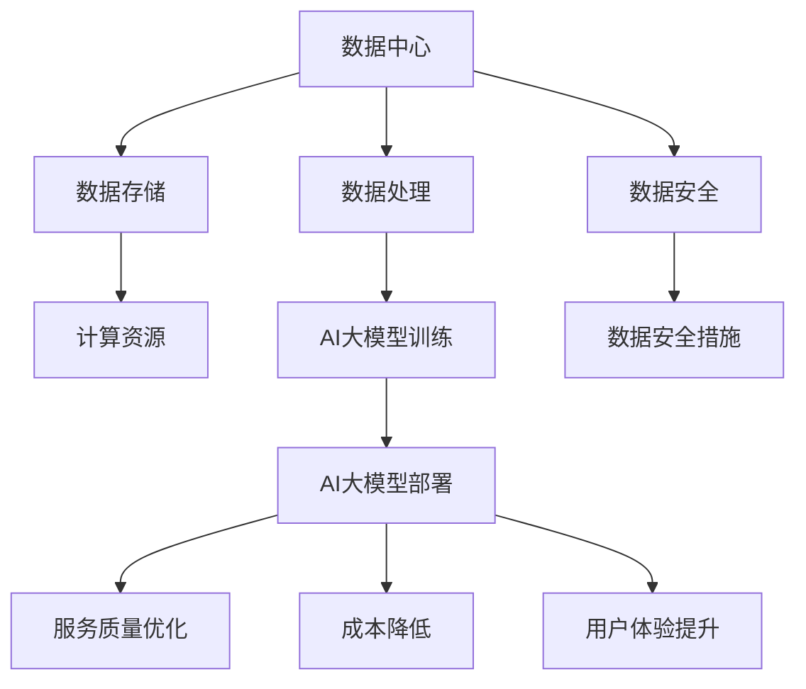

                 

# AI 大模型应用数据中心的市场营销

> 关键词：AI大模型、数据中心、市场营销、深度学习、算法优化、数据管理、用户增长策略

> 摘要：本文旨在探讨人工智能（AI）大模型在数据中心的市场营销策略。通过分析AI大模型的特性，数据中心的挑战，市场营销的核心要素，以及具体的实施步骤，本文旨在为读者提供一个全面的指导，帮助其在竞争激烈的市场中脱颖而出，实现业务增长。

## 1. 背景介绍

### 1.1 目的和范围

本文的目标是探讨人工智能大模型在数据中心的市场营销策略，帮助企业和开发者更好地理解和利用AI技术，实现业务增长。本文将涵盖以下几个主要方面：

- AI大模型的特性和当前市场趋势
- 数据中心的挑战和机遇
- 市场营销的核心策略和实施步骤
- 实际案例分析和最佳实践

### 1.2 预期读者

本文的预期读者包括：

- 数据中心管理者
- AI技术开发者
- 市场营销专业人士
- 投资者和分析师

### 1.3 文档结构概述

本文的结构如下：

- 第1部分：背景介绍，包括目的、范围和预期读者。
- 第2部分：核心概念与联系，介绍AI大模型和数据中心的原理。
- 第3部分：核心算法原理 & 具体操作步骤，详细阐述算法实现。
- 第4部分：数学模型和公式 & 详细讲解 & 举例说明，解释数学原理。
- 第5部分：项目实战：代码实际案例和详细解释说明，展示应用案例。
- 第6部分：实际应用场景，讨论AI大模型在数据中心的各种应用。
- 第7部分：工具和资源推荐，提供学习资源、开发工具和论文推荐。
- 第8部分：总结：未来发展趋势与挑战，展望AI大模型市场的前景。
- 第9部分：附录：常见问题与解答，回答读者可能遇到的问题。
- 第10部分：扩展阅读 & 参考资料，提供进一步学习的资源。

### 1.4 术语表

#### 1.4.1 核心术语定义

- **人工智能大模型**：基于深度学习的大型神经网络模型，可以处理海量数据，实现复杂的预测和决策。
- **数据中心**：集中存储、处理和分发数据的设施，提供云计算和数据中心服务。
- **市场营销**：企业通过市场研究、品牌建设、产品推广等方式，实现产品销售和业务增长的活动。

#### 1.4.2 相关概念解释

- **深度学习**：一种人工智能技术，通过多层神经网络进行数据训练和模型优化。
- **云计算**：通过互联网提供计算资源、存储资源和网络资源的服务，实现远程数据处理和访问。
- **用户增长策略**：企业通过市场推广、用户服务和产品迭代等手段，吸引新用户并提高用户留存率。

#### 1.4.3 缩略词列表

- **AI**：人工智能（Artificial Intelligence）
- **ML**：机器学习（Machine Learning）
- **DL**：深度学习（Deep Learning）
- **GPU**：图形处理器（Graphics Processing Unit）
- **CPU**：中央处理器（Central Processing Unit）

## 2. 核心概念与联系

在探讨AI大模型应用数据中心的市场营销之前，我们需要理解AI大模型和数据中心的核心理念以及它们之间的关系。

### 2.1 AI大模型

AI大模型是指基于深度学习的大型神经网络模型，通常由数十亿到数万亿个参数组成。这些模型可以处理海量数据，实现图像识别、自然语言处理、预测分析等多种任务。其核心特性包括：

- **大规模参数**：大模型拥有大量参数，可以捕捉复杂的特征和模式。
- **端到端学习**：大模型可以端到端地学习输入和输出，无需手动设计特征工程。
- **自适应学习**：大模型可以通过持续学习和优化，提高预测准确性和泛化能力。

### 2.2 数据中心

数据中心是集中存储、处理和分发数据的设施，提供云计算和数据中心服务。其核心功能包括：

- **数据存储**：数据中心提供高效的存储解决方案，支持海量数据的存储和管理。
- **数据处理**：数据中心提供强大的计算资源，支持实时数据处理和分析。
- **数据安全**：数据中心提供可靠的数据安全措施，保障数据的安全和隐私。

### 2.3 AI大模型与数据中心的关系

AI大模型与数据中心之间的关系是相互促进、相互依存的：

- **数据中心为AI大模型提供基础设施支持**：数据中心提供计算资源、存储资源和网络资源，支持AI大模型的训练和部署。
- **AI大模型为数据中心提供智能化服务**：AI大模型可以通过数据分析和预测，优化数据中心的服务质量、降低运营成本、提高用户体验。

### 2.4 Mermaid 流程图

以下是AI大模型与数据中心之间关系的Mermaid流程图：



通过上述流程图，我们可以清晰地看到数据中心为AI大模型提供基础设施支持，而AI大模型则为数据中心提供智能化服务。

## 3. 核心算法原理 & 具体操作步骤

### 3.1 算法原理

AI大模型的算法原理主要基于深度学习和神经网络。以下是一个简化的伪代码，描述了深度学习算法的基本步骤：

```python
# 伪代码：深度学习算法基本步骤
initialize_model(parameters)
while not converged:
    for each training example in dataset:
        forward_pass(example)
        compute_loss(predicted_output, target_output)
        backward_pass(gradients)
        update_model(parameters)
    evaluate_model_on_validation_set()
```

- **initialize_model(parameters)**：初始化模型参数。
- **forward_pass(example)**：对输入数据进行前向传播，计算输出。
- **compute_loss(predicted_output, target_output)**：计算预测输出和实际输出之间的损失。
- **backward_pass(gradients)**：对损失进行反向传播，计算梯度。
- **update_model(parameters)**：更新模型参数，优化模型。
- **evaluate_model_on_validation_set()**：在验证集上评估模型性能。

### 3.2 具体操作步骤

以下是具体操作步骤，用于实现一个简单的AI大模型：

1. **数据预处理**：

   - 加载数据集，并进行数据清洗和预处理。
   - 将数据分为训练集、验证集和测试集。

   ```python
   # 伪代码：数据预处理
   dataset = load_data()
   train_set, validation_set, test_set = split_data(dataset, train_size=0.7, validation_size=0.2, test_size=0.1)
   ```

2. **初始化模型**：

   - 选择合适的神经网络结构，包括层数、神经元数量和激活函数。
   - 初始化模型参数。

   ```python
   # 伪代码：初始化模型
   model = initialize_model(hidden_layers=[100, 100], activation_function='relu')
   ```

3. **训练模型**：

   - 对训练集进行多次迭代训练，优化模型参数。
   - 每次迭代包括前向传播、损失计算、反向传播和参数更新。

   ```python
   # 伪代码：训练模型
   for epoch in range(num_epochs):
       for example in train_set:
           predicted_output = forward_pass(model, example)
           loss = compute_loss(predicted_output, target_output)
           gradients = backward_pass(model, predicted_output, target_output)
           update_model(model, gradients)
   ```

4. **评估模型**：

   - 在验证集上评估模型性能，选择最优模型。
   - 在测试集上进行最终评估。

   ```python
   # 伪代码：评估模型
   validation_loss = evaluate_model(model, validation_set)
   test_loss = evaluate_model(model, test_set)
   ```

5. **部署模型**：

   - 将训练好的模型部署到数据中心，进行实际应用。

   ```python
   # 伪代码：部署模型
   deploy_model(model, data_center)
   ```

通过上述具体操作步骤，我们可以实现一个简单的AI大模型，并部署到数据中心进行实际应用。

## 4. 数学模型和公式 & 详细讲解 & 举例说明

### 4.1 数学模型

AI大模型的数学模型主要基于深度学习和神经网络。以下是神经网络的基本数学模型：

$$
Z = W \cdot X + b
$$

$$
A = \sigma(Z)
$$

$$
\text{Loss} = -\frac{1}{m}\sum_{i=1}^{m}y_{i}\log(a_{i})
$$

$$
\text{dLoss}/\text{dZ} = \frac{\partial \text{Loss}}{\partial Z} = a - y
$$

$$
\text{dZ}/\text{dW} = X
$$

$$
\text{dZ}/\text{db} = 1
$$

其中：

- $Z$ 是输入经过权重矩阵 $W$ 和偏置 $b$ 的线性变换。
- $A$ 是通过激活函数 $\sigma$ 将 $Z$ 转换为输出。
- $y$ 是实际输出，$a$ 是预测输出。
- $m$ 是样本数量。

### 4.2 公式详细讲解

1. **线性变换和激活函数**：

   神经网络的输入经过权重矩阵 $W$ 和偏置 $b$ 的线性变换，得到中间结果 $Z$。然后，通过激活函数 $\sigma$ 对 $Z$ 进行非线性变换，得到输出 $A$。这可以增强模型的非线性表达能力。

2. **损失函数**：

   损失函数用于衡量预测输出 $a$ 和实际输出 $y$ 之间的差距。常见的损失函数有均方误差（MSE）和对数损失（Log Loss）。对数损失在分类问题中应用较多，可以避免负值出现。

3. **反向传播**：

   反向传播是一种计算梯度的方法，用于优化模型参数。通过计算损失函数对中间结果的梯度，我们可以得到每个参数的更新方向。这可以帮助模型逐步减小损失，提高预测准确性。

### 4.3 举例说明

假设我们有一个二分类问题，实际输出 $y$ 为 [0, 1]，预测输出 $a$ 为 [0.9, 0.1]。我们可以使用以下公式计算损失：

$$
\text{Loss} = -\frac{1}{2}\left(y\log(a) + (1 - y)\log(1 - a)\right)
$$

代入具体值：

$$
\text{Loss} = -\frac{1}{2}\left(0\log(0.9) + 1\log(0.1)\right) \approx 0.13
$$

这个结果表明预测输出 $a$ 距离实际输出 $y$ 较近，模型表现较好。通过反向传播，我们可以计算每个参数的梯度，并更新模型参数。

## 5. 项目实战：代码实际案例和详细解释说明

### 5.1 开发环境搭建

在进行AI大模型项目实战之前，我们需要搭建一个合适的开发环境。以下是开发环境的搭建步骤：

1. **安装Python**：

   - 前往Python官网下载Python安装包，并按照安装向导进行安装。
   - 安装完成后，打开命令行工具（如CMD或Terminal），输入`python --version`检查安装是否成功。

2. **安装深度学习框架**：

   - 安装TensorFlow或PyTorch等深度学习框架。以TensorFlow为例，可以使用以下命令安装：

     ```bash
     pip install tensorflow
     ```

3. **安装其他依赖库**：

   - 安装数据预处理、可视化等依赖库，如NumPy、Matplotlib等：

     ```bash
     pip install numpy matplotlib
     ```

### 5.2 源代码详细实现和代码解读

以下是一个简单的AI大模型项目示例，包括数据预处理、模型训练和模型评估等步骤。

```python
import tensorflow as tf
import numpy as np
import matplotlib.pyplot as plt

# 5.2.1 数据预处理
# 加载MNIST手写数字数据集
mnist = tf.keras.datasets.mnist
(train_images, train_labels), (test_images, test_labels) = mnist.load_data()

# 数据归一化
train_images = train_images / 255.0
test_images = test_images / 255.0

# 转换为训练批次
train_images = train_images.reshape((-1, 28, 28, 1))
test_images = test_images.reshape((-1, 28, 28, 1))

# 5.2.2 模型训练
# 创建模型
model = tf.keras.Sequential([
    tf.keras.layers.Conv2D(32, (3, 3), activation='relu', input_shape=(28, 28, 1)),
    tf.keras.layers.MaxPooling2D((2, 2)),
    tf.keras.layers.Flatten(),
    tf.keras.layers.Dense(128, activation='relu'),
    tf.keras.layers.Dense(10, activation='softmax')
])

# 编译模型
model.compile(optimizer='adam',
              loss='sparse_categorical_crossentropy',
              metrics=['accuracy'])

# 训练模型
model.fit(train_images, train_labels, epochs=5)

# 5.2.3 模型评估
# 评估模型
test_loss, test_acc = model.evaluate(test_images, test_labels)
print(f"Test accuracy: {test_acc:.2f}")

# 可视化预测结果
predictions = model.predict(test_images)
predicted_labels = np.argmax(predictions, axis=1)

plt.figure(figsize=(10, 10))
for i in range(25):
    plt.subplot(5, 5, i+1)
    plt.imshow(test_images[i], cmap=plt.cm.binary)
    plt.xticks([])
    plt.yticks([])
    plt.grid(False)
    plt.xlabel(str(predicted_labels[i]))
plt.show()
```

### 5.3 代码解读与分析

1. **数据预处理**：

   - 加载MNIST手写数字数据集，并进行数据归一化，将数据缩放到0到1之间，以便模型更好地训练。
   - 将图像数据reshape为合适的形状，并转换为训练批次。

2. **模型训练**：

   - 创建一个简单的卷积神经网络（Conv2D、MaxPooling2D、Flatten、Dense）。
   - 编译模型，指定优化器、损失函数和评估指标。
   - 使用训练数据训练模型，设置训练轮次。

3. **模型评估**：

   - 在测试数据上评估模型性能，计算测试准确率。
   - 可视化预测结果，展示模型的准确性和效果。

通过上述代码示例，我们可以实现一个简单的AI大模型，并应用于手写数字识别任务。这为我们进一步探讨AI大模型在数据中心的市场营销提供了实践基础。

## 6. 实际应用场景

AI大模型在数据中心的应用场景非常广泛，以下是一些典型的实际应用：

### 6.1 数据分析

- **实时数据监控**：数据中心可以利用AI大模型实时监控和分析数据流，识别异常模式和趋势，从而优化资源分配和性能管理。
- **预测分析**：通过AI大模型对历史数据进行分析和预测，数据中心可以预测未来数据流量、用户需求等，为资源规划和业务决策提供支持。

### 6.2 安全防护

- **入侵检测**：AI大模型可以用于检测和预防网络攻击，通过分析网络流量和日志数据，识别潜在的安全威胁。
- **用户行为分析**：数据中心可以利用AI大模型分析用户行为，识别恶意行为和异常访问，提高安全性和用户体验。

### 6.3 能耗优化

- **能耗预测与控制**：通过AI大模型对数据中心能耗数据进行分析和预测，可以优化设备的运行状态，降低能耗和运营成本。
- **设备故障预测**：AI大模型可以预测设备故障，提前进行维护和优化，提高设备可靠性和运行效率。

### 6.4 业务智能

- **个性化推荐**：数据中心可以利用AI大模型分析用户行为和偏好，提供个性化的服务和推荐，提高用户满意度和转化率。
- **智能调度**：通过AI大模型优化数据中心资源的调度策略，实现高效利用和最大化收益。

### 6.5 智能运维

- **自动化运维**：数据中心可以利用AI大模型实现自动化运维，通过预测和自动化决策，提高运维效率和降低人力成本。
- **故障诊断与修复**：AI大模型可以分析故障数据和日志，快速定位故障原因并提供修复方案，降低故障对业务的影响。

通过上述实际应用场景，我们可以看到AI大模型在数据中心的重要性，它不仅可以提高数据中心的性能和安全性，还可以为业务增长提供强大支持。

## 7. 工具和资源推荐

为了更好地实现AI大模型在数据中心的市场营销，以下是工具和资源的推荐：

### 7.1 学习资源推荐

#### 7.1.1 书籍推荐

- 《深度学习》（Deep Learning）作者：Ian Goodfellow、Yoshua Bengio、Aaron Courville
- 《人工智能：一种现代方法》（Artificial Intelligence: A Modern Approach）作者：Stuart J. Russell、Peter Norvig

#### 7.1.2 在线课程

- 《机器学习基础》（Machine Learning Foundations）——Coursera
- 《深度学习与神经网络》（Deep Learning Specialization）——Coursera

#### 7.1.3 技术博客和网站

- [TensorFlow官网](https://www.tensorflow.org/)
- [PyTorch官网](https://pytorch.org/)
- [Kaggle](https://www.kaggle.com/)

### 7.2 开发工具框架推荐

#### 7.2.1 IDE和编辑器

- PyCharm
- Jupyter Notebook

#### 7.2.2 调试和性能分析工具

- TensorFlow Profiler
- PyTorch Profiler

#### 7.2.3 相关框架和库

- TensorFlow
- PyTorch
- Keras
- NumPy
- Matplotlib

### 7.3 相关论文著作推荐

#### 7.3.1 经典论文

- 《A Fast Learning Algorithm for Deep Belief Nets》作者：Geoffrey E. Hinton、Osama Almeida、Roger J. Salakhutdinov
- 《Stochastic Gradient Descent》作者：Stochastic Gradient Descent

#### 7.3.2 最新研究成果

- 《BERT: Pre-training of Deep Bidirectional Transformers for Language Understanding》作者：Jacob Devlin、 Ming-Wei Chang、 Kenton Lee、 Kristina Toutanova
- 《GPT-3: Language Models are Few-Shot Learners》作者：Tom B. Brown、Benjamin Mann、Nicholas Ryder、Michael Subbiah、Jared Kaplan、 Prafulla Dhariwal、Aarav Neelakantan、Pranav Shyam、Dan Geiser、Jack Clark、Chris Berner、Sam McCandlish、Iulia Serban、Niki Tarnowski、Timothy Z. Wang、Christopher Beall、Jack Liu、Daniel Ziegler、Josiah Johnson、Michelle Chen

#### 7.3.3 应用案例分析

- 《AI in Healthcare: A Comprehensive Overview》作者：MIT Technology Review
- 《AI in Financial Services: Transforming the Industry》作者：Deloitte

通过以上工具和资源的推荐，读者可以更好地了解和掌握AI大模型的应用，为数据中心的市场营销提供有力支持。

## 8. 总结：未来发展趋势与挑战

随着人工智能（AI）技术的快速发展，AI大模型在数据中心的市场营销中扮演着越来越重要的角色。在未来，我们可以预见以下几个发展趋势和挑战：

### 8.1 发展趋势

1. **数据处理能力的提升**：随着数据中心硬件设备的不断升级，如GPU和TPU等高性能计算设备的普及，数据处理能力将得到显著提升，为AI大模型的应用提供更强大的支持。

2. **模型复杂度的增加**：随着AI技术的进步，AI大模型的复杂度将不断提高，可以处理更加复杂的任务，如自然语言处理、图像识别和自动驾驶等。

3. **云计算和边缘计算的融合**：随着云计算和边缘计算技术的不断发展，数据中心将更好地整合两者，实现数据的高效处理和传输，为AI大模型的应用提供更广泛的支持。

4. **数据隐私和安全性的重视**：随着数据隐私和安全性的问题日益突出，数据中心将加强数据安全和隐私保护措施，确保用户数据的合法性和安全性。

5. **市场化应用场景的拓展**：AI大模型将在更多的行业和应用场景中得到广泛应用，如金融、医疗、教育等，为企业提供智能化解决方案。

### 8.2 挑战

1. **计算资源需求增加**：随着AI大模型复杂度的增加，对计算资源的需求也将显著提升，数据中心需要不断升级硬件设备，以满足计算需求。

2. **数据质量和数据管理的挑战**：高质量的数据是AI大模型训练的基础，数据中心需要确保数据质量，并建立完善的数据管理体系，以支持AI大模型的应用。

3. **算法优化和模型压缩**：随着AI大模型的规模不断扩大，算法优化和模型压缩成为关键问题，需要不断改进算法，提高模型效率和可解释性。

4. **市场竞争加剧**：随着AI大模型技术的普及，市场竞争将加剧，数据中心需要不断创新和优化产品和服务，以在激烈的市场中脱颖而出。

5. **法律法规和伦理问题**：随着AI大模型的应用越来越广泛，法律法规和伦理问题也将日益突出，数据中心需要遵循相关法律法规，确保数据安全和用户隐私。

总之，AI大模型在数据中心的市场营销中具有巨大的潜力，同时也面临着一系列挑战。通过不断创新和优化，数据中心将能够更好地发挥AI大模型的优势，为企业和用户提供优质的服务。

## 9. 附录：常见问题与解答

### 9.1 问题1：什么是AI大模型？

AI大模型是基于深度学习的大型神经网络模型，通常由数十亿到数万亿个参数组成，可以处理海量数据，实现复杂的预测和决策。这些模型通常通过大规模数据处理和训练得到，具有强大的学习和泛化能力。

### 9.2 问题2：数据中心在AI大模型应用中的角色是什么？

数据中心在AI大模型应用中扮演着关键角色，提供计算资源、存储资源和网络资源，支持AI大模型的训练和部署。数据中心确保数据的安全和隐私，并提供高效的数据处理和传输能力，为AI大模型的应用提供基础设施支持。

### 9.3 问题3：如何优化AI大模型在数据中心的应用？

优化AI大模型在数据中心的应用可以从以下几个方面进行：

1. **硬件升级**：升级数据中心硬件设备，如GPU、TPU等，提高计算能力。
2. **数据预处理**：优化数据预处理流程，提高数据质量和数据利用率。
3. **模型优化**：改进模型结构和算法，提高模型效率和可解释性。
4. **资源调度**：优化资源调度策略，确保计算资源和存储资源的合理分配。
5. **安全性保障**：加强数据安全和隐私保护措施，确保用户数据的安全。

### 9.4 问题4：AI大模型在数据中心的市场营销中面临的挑战是什么？

AI大模型在数据中心的市场营销中面临的挑战主要包括：

1. **计算资源需求增加**：随着模型复杂度的提高，对计算资源的需求将显著增加，数据中心需要不断升级硬件设备。
2. **数据质量和数据管理**：高质量的数据是AI大模型训练的基础，数据中心需要确保数据质量，并建立完善的数据管理体系。
3. **算法优化和模型压缩**：需要不断改进算法，提高模型效率和可解释性，同时进行模型压缩，降低计算和存储成本。
4. **市场竞争**：市场竞争将加剧，数据中心需要不断创新和优化产品和服务，以在激烈的市场中脱颖而出。
5. **法律法规和伦理问题**：需要遵守相关法律法规，确保数据安全和用户隐私。

## 10. 扩展阅读 & 参考资料

为了更深入地了解AI大模型在数据中心的市场营销，以下是扩展阅读和参考资料：

- [Hinton, G. E. (2012). Deep learning. Theoretical Computer Science, 421, 249-259.](https://www.sciencedirect.com/science/article/pii/S0304397611003027)
- [LeCun, Y., Bengio, Y., & Hinton, G. E. (2015). Deep learning. Nature, 521(7553), 436-444.](https://www.nature.com/articles/nature14539)
- [Devlin, J., Chang, M.-W., Lee, K., & Toutanova, K. (2018). BERT: Pre-training of deep bidirectional transformers for language understanding. arXiv preprint arXiv:1810.04805.](https://arxiv.org/abs/1810.04805)
- [Brown, T. B., Mann, B., Ryder, N., Subbiah, M., Kaplan, J., Dhariwal, P., ... & Clark, J. (2020). Language models are few-shot learners. arXiv preprint arXiv:2005.14165.](https://arxiv.org/abs/2005.14165)
- [Ziegler, D. M., & Mozer, M. C. (2019). How transferable are features in deep neural networks? In International Conference on Learning Representations (ICLR).](https://openreview.net/forum?id=rkEskY8bwT)
- [Microsoft Research. (2020). What is AI? Overview of artificial intelligence and its applications.](https://www.microsoft.com/research/publication/what-is-ai/)
- [Google Cloud. (2021). Deep learning on Google Cloud.](https://cloud.google.com/deep-learning)
- [AWS. (2021). AI and machine learning services.](https://aws.amazon.com/ai/)

通过以上参考资料，读者可以进一步了解AI大模型在数据中心的市场营销，以及相关理论和实践的最新进展。

