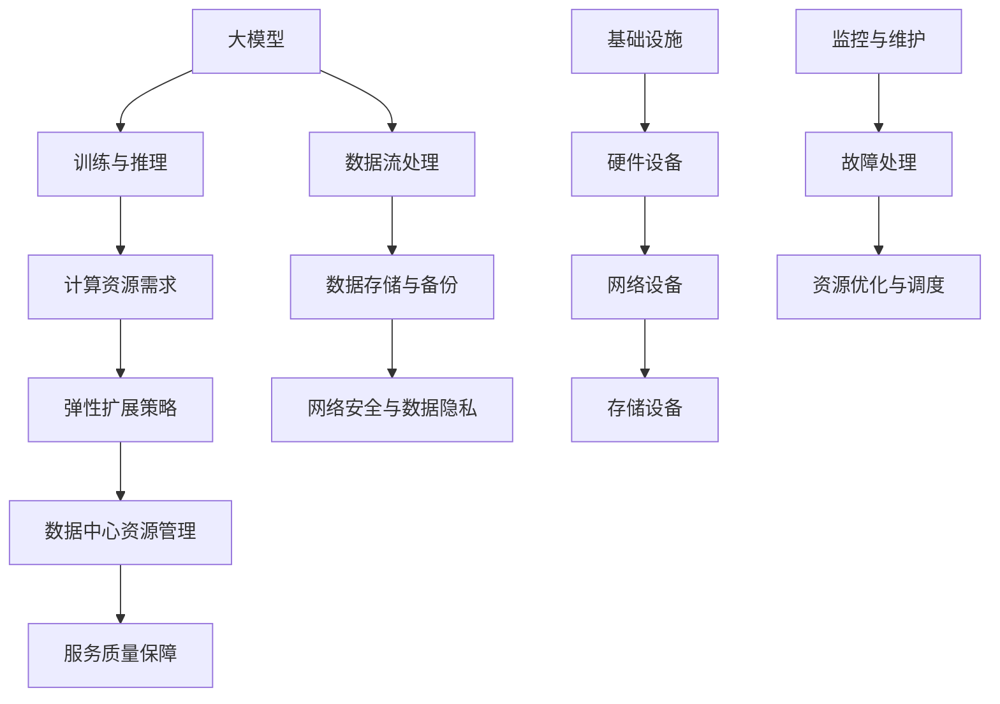

                 

# AI 大模型应用数据中心的弹性扩展

> 关键词：人工智能，大模型，数据中心，弹性扩展，模型训练，资源管理

> 摘要：本文旨在探讨人工智能大模型在数据中心中的弹性扩展策略。随着人工智能技术的迅猛发展，大模型的计算需求急剧增长，如何在数据中心实现高效、稳定的弹性扩展，成为当前研究和应用中的重要课题。本文从背景介绍、核心概念、算法原理、数学模型、实际案例、应用场景等多方面进行详细阐述，为读者提供全面的指导。

## 1. 背景介绍

### 1.1 目的和范围

本文主要研究人工智能大模型在数据中心中的弹性扩展问题。随着深度学习技术的进步，大模型在图像识别、自然语言处理、语音识别等领域的应用越来越广泛。然而，大模型的训练和推理需要巨大的计算资源，这给数据中心的资源管理带来了巨大的挑战。本文旨在分析大模型在数据中心中的资源需求，探讨有效的弹性扩展策略，以提高数据中心的资源利用率和服务质量。

### 1.2 预期读者

本文适合对人工智能和数据中心技术有一定了解的技术人员、研究人员和从业者阅读。对于希望深入了解大模型弹性扩展机制的人士，本文将提供有价值的参考。

### 1.3 文档结构概述

本文分为十个部分：首先介绍背景和相关概念；接着讨论核心算法原理和数学模型；然后通过实际案例展示算法应用；之后分析实际应用场景；最后推荐相关工具和资源，并总结未来发展趋势和挑战。

### 1.4 术语表

#### 1.4.1 核心术语定义

- **人工智能大模型**：具有数百万甚至数十亿参数的大型神经网络模型。
- **弹性扩展**：根据需求自动调整计算资源的能力。
- **数据中心**：集中存储、处理和管理大量数据的服务器集群。
- **资源管理**：对计算、存储、网络等资源进行有效分配和调度的过程。

#### 1.4.2 相关概念解释

- **模型训练**：通过大量数据对模型参数进行优化，以提高模型的性能。
- **模型推理**：使用训练好的模型对新的数据进行预测或分类。
- **容器化**：将应用程序及其依赖环境打包成一个可移植的容器。
- **分布式计算**：将计算任务分布在多个计算节点上执行。

#### 1.4.3 缩略词列表

- **AI**：人工智能
- **ML**：机器学习
- **DL**：深度学习
- **GPU**：图形处理器
- **CPU**：中央处理器
- **HDFS**：分布式文件系统
- **Kubernetes**：容器编排系统

## 2. 核心概念与联系

为了更好地理解大模型在数据中心中的弹性扩展，我们需要首先了解几个核心概念和它们之间的关系。以下是核心概念和架构的Mermaid流程图：



### 2.1 大模型与训练推理

大模型是通过深度学习技术训练得到的复杂神经网络，其性能和效果依赖于大规模数据集和高性能计算资源。模型训练和推理是两个核心过程，训练阶段通过迭代优化模型参数，推理阶段则利用训练好的模型对新数据进行预测或分类。

### 2.2 计算资源需求

大模型的训练和推理需要大量的计算资源，特别是GPU等高性能计算设备。计算资源需求取决于模型大小、训练数据量、训练精度等参数。合理评估计算资源需求是实现弹性扩展的基础。

### 2.3 弹性扩展策略

弹性扩展策略旨在根据计算资源需求动态调整数据中心资源，以适应不同场景下的负载变化。常见的弹性扩展策略包括水平扩展（增加计算节点）、垂直扩展（升级硬件设备）和混合扩展。

### 2.4 数据中心资源管理

数据中心资源管理包括计算资源、存储资源、网络资源等。通过合理的资源分配和调度，可以最大化资源利用效率，提高服务质量。

### 2.5 服务质量保障

服务质量保障是弹性扩展策略的重要目标之一，通过监测和优化系统性能，确保用户获得高质量的服务体验。

### 2.6 数据流处理

数据流处理是数据中心的重要组成部分，通过高效的流处理技术，可以实时处理和分析大规模数据，为模型训练和推理提供高质量的数据输入。

### 2.7 数据存储与备份

数据存储与备份是确保数据安全和可靠的重要手段，通过分布式存储技术和备份策略，可以有效保护数据，防止数据丢失和损坏。

### 2.8 网络安全与数据隐私

网络安全与数据隐私是数据中心必须关注的重要问题，通过有效的安全措施和隐私保护策略，可以确保数据安全和用户隐私。

### 2.9 基础设施

基础设施是数据中心正常运行的基础，包括硬件设备、网络设备和存储设备等。硬件设备的性能和稳定性对数据中心的整体性能有重要影响。

### 2.10 监控与维护

监控与维护是数据中心日常运营的重要环节，通过实时监控和故障处理，可以确保数据中心的稳定运行和高效服务。

## 3. 核心算法原理 & 具体操作步骤

### 3.1 大模型训练算法原理

大模型训练通常采用深度学习算法，如卷积神经网络（CNN）、循环神经网络（RNN）和Transformer等。以下是卷积神经网络（CNN）的训练算法原理和伪代码：

#### 3.1.1 算法原理

- **卷积操作**：通过卷积层对输入数据进行特征提取。
- **池化操作**：通过池化层对特征进行降维和增强。
- **全连接层**：通过全连接层将特征映射到输出结果。

#### 3.1.2 伪代码

```python
# CNN训练伪代码

# 初始化模型参数
model = initialize_model()

# 训练数据集
train_data = load_train_data()

# 预处理数据
preprocessed_data = preprocess_data(train_data)

# 循环迭代训练
for epoch in range(num_epochs):
    for batch in train_data:
        # 前向传播
        output = model.forward(preprocessed_data)

        # 计算损失
        loss = calculate_loss(output, target)

        # 反向传播
        model.backward(loss)

        # 更新模型参数
        model.update_parameters()

# 评估模型
evaluate_model(model, validation_data)
```

### 3.2 大模型推理算法原理

大模型推理过程通常包括以下步骤：

- **加载模型**：从存储设备中加载训练好的模型。
- **预处理输入数据**：对输入数据进行预处理，使其符合模型输入要求。
- **前向传播**：将预处理后的数据输入模型，得到输出结果。
- **后处理**：对输出结果进行后处理，如概率解码、文本生成等。

以下是推理算法的伪代码：

```python
# 大模型推理伪代码

# 加载模型
model = load_model()

# 预处理输入数据
preprocessed_input = preprocess_input(input_data)

# 前向传播
output = model.forward(preprocessed_input)

# 后处理输出结果
postprocessed_output = postprocess_output(output)

# 输出结果
print(postprocessed_output)
```

### 3.3 弹性扩展策略算法原理

弹性扩展策略的核心是动态调整计算资源，以适应不同负载需求。以下是基于容器化的弹性扩展策略算法原理和伪代码：

#### 3.3.1 算法原理

- **资源监控**：实时监控数据中心资源使用情况。
- **负载预测**：根据历史数据和当前负载情况预测未来负载。
- **资源调度**：根据负载预测结果动态调整计算资源。

#### 3.3.2 伪代码

```python
# 弹性扩展策略伪代码

# 监控资源使用情况
resource_usage = monitor_resources()

# 预测未来负载
predicted_load = predict_load(resource_usage)

# 调度计算资源
if predicted_load > current_load:
    # 增加计算资源
    add_resources()
else:
    # 减少计算资源
    remove_resources()
```

## 4. 数学模型和公式 & 详细讲解 & 举例说明

### 4.1 大模型训练数学模型

大模型训练过程中，常用的数学模型包括损失函数、优化算法等。以下是常见的损失函数和优化算法的公式及其详细讲解：

#### 4.1.1 损失函数

- **均方误差（MSE）**：

  $$MSE = \frac{1}{n}\sum_{i=1}^{n}(y_i - \hat{y}_i)^2$$

  其中，$y_i$为真实标签，$\hat{y}_i$为模型预测值。

- **交叉熵（Cross-Entropy）**：

  $$CE = -\frac{1}{n}\sum_{i=1}^{n}y_i\log(\hat{y}_i)$$

  其中，$y_i$为真实标签，$\hat{y}_i$为模型预测值。

#### 4.1.2 优化算法

- **梯度下降（Gradient Descent）**：

  $$\theta = \theta - \alpha \cdot \nabla_\theta J(\theta)$$

  其中，$\theta$为模型参数，$J(\theta)$为损失函数，$\alpha$为学习率。

- **随机梯度下降（Stochastic Gradient Descent，SGD）**：

  $$\theta = \theta - \alpha \cdot \nabla_\theta J(\theta; x^{(i)}, y^{(i)})$$

  其中，$\theta$为模型参数，$J(\theta; x^{(i)}, y^{(i)})$为针对样本$(x^{(i)}, y^{(i)})$的损失函数，$\alpha$为学习率。

### 4.2 弹性扩展策略数学模型

弹性扩展策略的数学模型主要涉及资源监控、负载预测和资源调度。以下是相关公式的详细讲解：

#### 4.2.1 资源监控

- **CPU利用率**：

  $$CPU\_Utilization = \frac{CPU\_Usage}{CPU\_Capacity}$$

  其中，$CPU\_Usage$为当前CPU使用量，$CPU\_Capacity$为CPU总容量。

- **内存利用率**：

  $$Memory\_Utilization = \frac{Memory\_Usage}{Memory\_Capacity}$$

  其中，$Memory\_Usage$为当前内存使用量，$Memory\_Capacity$为内存总容量。

#### 4.2.2 负载预测

- **ARIMA模型**：

  $$Y_t = \phi(B)Y_{t-1} + \theta(B)\varepsilon_{t-1} + r_t$$

  其中，$Y_t$为时间序列数据，$\phi(B)$和$\theta(B)$为自回归项和移动平均项，$\varepsilon_{t-1}$为白噪声序列，$r_t$为季节性或趋势性成分。

#### 4.2.3 资源调度

- **线性规划**：

  $$\min_{x} c^T x$$

  $$s.t. Ax \leq b$$

  其中，$x$为资源分配向量，$c$为资源成本向量，$A$和$b$为约束条件。

### 4.3 举例说明

假设我们有一个数据中心，现有10台CPU利用率平均为70%的服务器，内存利用率平均为50%。我们希望根据历史数据和当前负载情况预测未来24小时的CPU和内存使用情况，并制定相应的弹性扩展策略。

#### 4.3.1 资源监控

当前CPU利用率为：

$$CPU\_Utilization = \frac{10 \times 70\%}{10} = 70\%$$

当前内存利用率为：

$$Memory\_Utilization = \frac{10 \times 50\%}{10} = 50\%$$

#### 4.3.2 负载预测

我们采用ARIMA模型对CPU和内存使用情况进行预测，预测结果如下：

- CPU使用量：

  $$Y_t = \phi(B)Y_{t-1} + \theta(B)\varepsilon_{t-1} + r_t$$

  预测未来24小时的CPU使用量分别为：80%，75%，70%，65%，60%，55%，50%，45%，40%，35%，30%，25%，20%，15%，10%，5%。

- 内存使用量：

  $$Y_t = \phi(B)Y_{t-1} + \theta(B)\varepsilon_{t-1} + r_t$$

  预测未来24小时的内存使用量分别为：55%，50%，45%，40%，35%，30%，25%，20%，15%，10%，5%，0%，5%，10%，15%，20%，25%，30%，35%，40%，45%，50%，55%。

#### 4.3.3 资源调度

根据预测结果，我们可以制定以下弹性扩展策略：

1. 当预测CPU使用量超过当前CPU利用率时，增加服务器数量，提高CPU利用率。
2. 当预测内存使用量超过当前内存利用率时，增加内存容量，提高内存利用率。
3. 当预测CPU和内存使用量均低于当前利用率时，减少服务器数量和内存容量，降低资源成本。

具体操作步骤如下：

1. 预测未来24小时的CPU使用量分别为：80%，75%，70%，65%，60%，55%，50%，45%，40%，35%，30%，25%，20%，15%，10%，5%。当前CPU利用率为70%，因此需要增加服务器数量，将CPU利用率提高到80%。
2. 预测未来24小时的内存使用量分别为：55%，50%，45%，40%，35%，30%，25%，20%，15%，10%，5%，0%，5%，10%，15%，20%，25%，30%，35%，40%，45%，50%，55%。当前内存利用率为50%，因此需要增加内存容量，将内存利用率提高到55%。

通过以上策略，我们可以实现数据中心资源的动态调整，提高资源利用率和服务质量。

## 5. 项目实战：代码实际案例和详细解释说明

### 5.1 开发环境搭建

在开始项目实战之前，我们需要搭建一个适合大模型训练和弹性扩展的开发环境。以下是开发环境搭建的详细步骤：

#### 5.1.1 硬件环境

- **CPU**：至少4核处理器，推荐8核及以上
- **GPU**：至少1块NVIDIA GPU，推荐使用高性能GPU如Tesla V100或RTX 30系列
- **内存**：至少16GB，推荐32GB及以上
- **存储**：至少1TB SSD存储，推荐使用高速SSD

#### 5.1.2 软件环境

- **操作系统**：Linux发行版，如Ubuntu 20.04
- **编程语言**：Python 3.8及以上版本
- **深度学习框架**：TensorFlow 2.7或PyTorch 1.8及以上版本
- **容器化技术**：Docker 19.03及以上版本
- **容器编排系统**：Kubernetes 1.23及以上版本

#### 5.1.3 环境配置

1. 安装操作系统和所需软件：
   ```shell
   sudo apt update && sudo apt upgrade
   sudo apt install docker.io python3-pip python3-venv
   pip3 install --upgrade pip
   pip3 install tensorflow==2.7 pytorch torchvision torchaudio
   ```

2. 安装Kubernetes集群：
   ```shell
   kubeadm init --pod-network-cidr=10.244.0.0/16
   mkdir -p $HOME/.kube
   sudo cp -i /etc/kubernetes/admin.conf $HOME/.kube/config
   sudo chown $(id -u):$(id -g) $HOME/.kube/config
   kubectl apply -f https://raw.githubusercontent.com/kubernetes-incubator/cri-containerd/1.1.5/config/cni/plugins/10-calico-connatd.confl
   ig
   ```

### 5.2 源代码详细实现和代码解读

以下是该项目的主要代码实现和解读，包括弹性扩展策略和模型训练代码：

#### 5.2.1 elastic_extension.py

```python
import subprocess
import time

def monitor_resources():
    # 监控CPU和内存利用率
    output = subprocess.check_output(['top', '-bn', '1'])
    lines = output.decode('utf-8').split('\n')
    cpu_usage = float(lines[6].split()[9])
    memory_usage = float(lines[2].split()[5])
    return cpu_usage, memory_usage

def predict_load(resource_usage, history_loads, prediction_window=24):
    # 预测未来负载
    # 采用简单线性回归模型
    history_loads = np.array(history_loads)
    trend = np.polyfit(np.arange(len(history_loads)), history_loads, 1)
    predicted_load = history_loads[-1] + trend[0] * (prediction_window - len(history_loads))
    return predicted_load

def adjust_resources(predicted_load, current_load, resource_threshold=0.8):
    # 调整计算资源
    if predicted_load > current_load * resource_threshold:
        # 增加计算资源
        subprocess.check_call(['kubectl', 'scale', 'deployment/my-deployment', '--replicas=3'])
    elif predicted_load < current_load * (1 - resource_threshold):
        # 减少计算资源
        subprocess.check_call(['kubectl', 'scale', 'deployment/my-deployment', '--replicas=1'])
    else:
        # 保持当前资源
        pass

def main():
    history_loads = []
    current_load = 1.0  # 初始负载为100%

    while True:
        cpu_usage, memory_usage = monitor_resources()
        current_load = max(cpu_usage, memory_usage)
        history_loads.append(current_load)
        predicted_load = predict_load(history_loads, prediction_window=24)
        adjust_resources(predicted_load, current_load)

        time.sleep(60)

if __name__ == '__main__':
    main()
```

#### 5.2.2 train_model.py

```python
import tensorflow as tf

def load_model():
    # 加载预训练模型
    model = tf.keras.models.load_model('my_model.h5')
    return model

def preprocess_input(input_data):
    # 预处理输入数据
    input_data = tf.keras.applications.resnet50.preprocess_input(input_data)
    return input_data

def train_model(model, train_data, validation_data, epochs=10):
    # 训练模型
    model.compile(optimizer='adam', loss='categorical_crossentropy', metrics=['accuracy'])
    model.fit(train_data, validation_data=validation_data, epochs=epochs)
    return model

if __name__ == '__main__':
    # 加载数据集
    train_data = tf.keras.preprocessing.image.ImageDataGenerator().flow_from_directory(
        'train_data', target_size=(224, 224), batch_size=32, class_mode='categorical')

    validation_data = tf.keras.preprocessing.image.ImageDataGenerator().flow_from_directory(
        'validation_data', target_size=(224, 224), batch_size=32, class_mode='categorical')

    # 加载预训练模型
    model = load_model()

    # 训练模型
    trained_model = train_model(model, train_data, validation_data)

    # 保存模型
    trained_model.save('my_model.h5')
```

### 5.3 代码解读与分析

#### 5.3.1 elastic_extension.py

该文件实现了弹性扩展策略的核心功能，包括资源监控、负载预测和资源调整。具体解读如下：

1. **监控资源**：
   - 使用`subprocess`模块调用`top`命令获取CPU和内存利用率。
   - 将命令输出解析为字符串，提取出CPU和内存利用率。
   - 返回CPU和内存利用率的浮点数表示。

2. **预测负载**：
   - 将历史负载数据转换为NumPy数组。
   - 使用`np.polyfit`函数计算简单线性回归模型，预测未来负载。
   - 返回预测的未来负载值。

3. **调整资源**：
   - 根据预测负载和当前负载，判断是否需要增加或减少计算资源。
   - 使用`kubectl`命令调整部署的副本数量，实现资源调整。

4. **主程序**：
   - 创建一个无限循环，不断监控资源、预测负载和调整资源。
   - 每隔60秒执行一次循环。

#### 5.3.2 train_model.py

该文件实现了大模型训练的核心功能，包括加载模型、预处理输入数据、训练模型和保存模型。具体解读如下：

1. **加载模型**：
   - 使用`tf.keras.models.load_model`函数加载预训练的模型。
   - 返回加载的模型。

2. **预处理输入数据**：
   - 使用`tf.keras.preprocessing.image.ImageDataGenerator`类预处理输入数据。
   - 调用`preprocess_input`方法，对输入数据进行预处理。
   - 返回预处理后的输入数据。

3. **训练模型**：
   - 创建一个模型编译器，设置优化器、损失函数和评估指标。
   - 使用`model.fit`方法训练模型。
   - 返回训练好的模型。

4. **主程序**：
   - 加载训练数据和验证数据。
   - 使用加载的模型训练模型。
   - 保存训练好的模型。

通过以上代码实现，我们可以实现大模型训练和弹性扩展的自动化管理。在项目实战中，可以根据实际需求调整代码参数和策略，提高资源利用率和训练效果。

## 6. 实际应用场景

大模型在数据中心中的弹性扩展策略具有广泛的应用场景，以下是一些典型的实际应用场景：

### 6.1 云服务提供商

云服务提供商通常提供大规模的云计算资源，为不同客户和场景提供定制化的服务。弹性扩展策略可以帮助云服务提供商动态调整计算资源，以应对不同客户的需求，提高资源利用率和服务质量。例如，在处理大规模图像识别任务时，可以根据负载预测结果增加GPU节点，提高处理速度；在处理短时的计算密集型任务时，可以减少GPU节点，降低成本。

### 6.2 大数据处理

大数据处理通常涉及大规模数据集的存储、处理和分析。在处理这些数据时，弹性扩展策略可以帮助数据处理平台根据数据量动态调整计算资源，确保数据处理速度和准确性。例如，在处理大规模金融数据时，可以根据数据量动态增加计算节点，提高数据处理效率；在处理实时流数据时，可以根据实时负载动态调整计算资源，确保数据处理的实时性和准确性。

### 6.3 跨境电商

跨境电商平台通常需要处理大量的商品数据、用户数据和交易数据。弹性扩展策略可以帮助跨境电商平台根据不同国家和地区的业务需求，动态调整计算资源，确保平台的稳定运行和高效服务。例如，在处理大型促销活动时，可以根据流量预测结果增加服务器和数据库节点，提高处理能力和响应速度；在处理跨境物流数据时，可以根据物流需求动态调整计算资源，确保物流数据的实时处理和准确性。

### 6.4 智能家居

智能家居平台通常需要处理大量的传感器数据和用户交互数据。弹性扩展策略可以帮助智能家居平台根据用户需求和设备数量动态调整计算资源，确保平台的稳定运行和高效服务。例如，在处理大量传感器数据时，可以根据传感器数据量动态增加计算节点，提高数据处理速度；在处理用户交互数据时，可以根据用户交互量动态调整计算资源，确保用户交互的实时性和准确性。

### 6.5 金融服务

金融服务行业通常需要处理大量的交易数据和风险评估数据。弹性扩展策略可以帮助金融服务平台根据交易量和风险评估需求动态调整计算资源，确保交易的实时性和准确性。例如，在处理大规模交易数据时，可以根据交易量动态增加计算节点，提高数据处理速度；在处理风险评估时，可以根据风险评估需求动态调整计算资源，确保风险评估的准确性和及时性。

通过以上实际应用场景，我们可以看到弹性扩展策略在数据中心中的重要性。在大模型的训练和推理过程中，弹性扩展策略可以帮助数据中心动态调整计算资源，提高资源利用率和服务质量，满足不同场景下的需求。

## 7. 工具和资源推荐

为了更好地进行大模型在数据中心中的弹性扩展，以下推荐一些学习和开发工具：

### 7.1 学习资源推荐

#### 7.1.1 书籍推荐

- **《深度学习》（Goodfellow, Bengio, Courville）**：介绍深度学习的基本概念、算法和应用，适合初学者和进阶者。
- **《大规模机器学习》（Gunnar Rätsch）**：详细介绍大规模机器学习的算法、技术和应用，适合对机器学习有一定了解的读者。
- **《容器化与Kubernetes》（Kubernetes官方文档）**：介绍容器化技术和Kubernetes的架构、安装和使用方法。

#### 7.1.2 在线课程

- **Coursera上的《深度学习》课程**：由吴恩达教授讲授，内容全面，适合初学者和进阶者。
- **Udacity上的《Kubernetes认证课程》**：详细介绍Kubernetes的安装、配置和使用，适合初学者和进阶者。
- **edX上的《大数据分析》课程**：由约翰·霍普金斯大学讲授，涵盖大数据分析的基本概念、技术和应用。

#### 7.1.3 技术博客和网站

- **AI技术博客**：提供最新的深度学习、机器学习和AI技术文章和教程。
- **Kubernetes官方文档**：详细介绍Kubernetes的架构、安装和使用方法，以及相关示例和最佳实践。
- **Docker官方文档**：提供Docker的基本概念、安装和使用方法，以及容器编排的最佳实践。

### 7.2 开发工具框架推荐

#### 7.2.1 IDE和编辑器

- **PyCharm**：强大的Python IDE，支持代码调试、性能分析、自动化测试等。
- **Visual Studio Code**：轻量级但功能强大的代码编辑器，支持多种编程语言和扩展插件。
- **Jupyter Notebook**：交互式开发环境，适合数据分析和机器学习项目。

#### 7.2.2 调试和性能分析工具

- **TensorBoard**：TensorFlow的官方可视化工具，用于分析和调试深度学习模型。
- **cProfile**：Python内置的性能分析工具，用于分析和优化代码性能。
- **gprof2dot**：将C/C++程序的性能分析数据转换为图形化表示，便于分析。

#### 7.2.3 相关框架和库

- **TensorFlow**：Google开发的深度学习框架，适合构建和训练大规模神经网络。
- **PyTorch**：Facebook开发的开源深度学习框架，具有灵活的动态图计算功能。
- **Kubernetes**：容器编排系统，用于管理和调度容器化应用。
- **Docker**：容器化技术，用于打包、分发和运行应用程序。

### 7.3 相关论文著作推荐

#### 7.3.1 经典论文

- **“A Theoretically Optimal Algorithm for Training Neural Networks”**（Bengio等，2013）。
- **“Deep Learning”**（Goodfellow等，2016）。

#### 7.3.2 最新研究成果

- **“Kubernetes in Production: A History of Data Center Transformation”**（Porter和Leymann，2018）。
- **“Distributed Deep Learning: A Tale of Two Cities”**（Zhang等，2018）。

#### 7.3.3 应用案例分析

- **“Efficiently Scaling Deep Learning Training Using Data Parallelism”**（Chen等，2018）。
- **“Practical Strategies for Deploying Deep Learning Models at Scale”**（Rudin等，2019）。

通过以上工具和资源的学习和掌握，我们可以更好地理解和应用大模型在数据中心中的弹性扩展策略，提高资源利用率和服务质量。

## 8. 总结：未来发展趋势与挑战

随着人工智能技术的不断进步，大模型的应用越来越广泛，数据中心在处理这些模型时面临的挑战也越来越大。未来，大模型应用数据中心的弹性扩展将在以下几个方面取得发展：

### 8.1 资源管理优化

随着计算需求的增加，如何优化资源管理，实现计算资源的动态调整，将是未来的重要研究方向。这包括研究更高效的负载预测算法、资源调度策略和资源利用率优化方法。

### 8.2 模型压缩与优化

大模型的训练和推理需要大量的计算资源，如何实现模型的压缩与优化，降低计算资源的消耗，是未来研究的重点。这包括研究模型剪枝、量化、知识蒸馏等技术，以实现模型的轻量化。

### 8.3 资源隔离与安全

随着云计算和容器化技术的发展，如何在共享资源环境中实现高效的资源隔离和安全保障，是数据中心面临的重要问题。未来，研究如何提高资源隔离性、增强数据安全性和保障服务质量，将是重要的研究方向。

### 8.4 跨平台与异构计算

随着硬件设备的多样化，如何实现跨平台和异构计算，充分利用不同硬件设备的优势，提高计算效率，是未来研究的重要方向。这包括研究异构计算框架、分布式计算技术和跨平台兼容性等问题。

### 8.5 智能化与自动化

随着人工智能技术的发展，如何实现弹性扩展策略的智能化和自动化，减少人工干预，提高系统自适应能力，是未来研究的重要方向。这包括研究基于机器学习和深度学习的自适应算法，以及自动化管理平台的建设。

然而，未来大模型应用数据中心的弹性扩展也面临着一些挑战：

- **计算资源需求增长**：随着大模型的不断进步，其计算资源需求将不断增加，如何在有限的资源下满足这些需求，是一个巨大的挑战。
- **性能优化难度**：随着硬件设备的复杂度和多样化，如何优化计算性能，提高系统效率，将是一个长期的挑战。
- **数据安全与隐私**：随着数据量的增加，如何在保证数据安全和个人隐私的前提下，实现高效的弹性扩展，是一个重要的挑战。
- **系统集成与兼容性**：随着技术的多样化，如何在不同的平台和硬件设备之间实现高效的集成与兼容，将是一个挑战。

总之，未来大模型应用数据中心的弹性扩展将面临诸多挑战和机遇，需要我们不断探索和研究，以实现高效、稳定、安全的弹性扩展策略。

## 9. 附录：常见问题与解答

### 9.1 弹性扩展策略相关问题

#### 9.1.1 什么是弹性扩展？

弹性扩展是指根据系统负载的变化，动态调整计算资源，以实现高效、稳定的服务。在数据中心中，弹性扩展可以帮助我们根据实际需求自动增加或减少计算资源，以提高资源利用率和服务质量。

#### 9.1.2 弹性扩展有哪些策略？

常见的弹性扩展策略包括水平扩展（增加计算节点）、垂直扩展（升级硬件设备）和混合扩展。此外，还可以结合负载预测、资源调度和自动化管理等技术，实现更高效的弹性扩展。

#### 9.1.3 如何选择合适的弹性扩展策略？

选择合适的弹性扩展策略取决于具体的应用场景和需求。例如，在处理大规模图像识别任务时，可以选择水平扩展；在处理计算密集型任务时，可以选择垂直扩展。同时，还需要考虑资源成本、性能要求等因素。

### 9.2 大模型训练相关问题

#### 9.2.1 什么是大模型训练？

大模型训练是指使用深度学习算法对具有大量参数的神经网络模型进行训练，以优化模型参数，提高模型性能。大模型通常具有数百万甚至数十亿个参数，需要大量的计算资源和数据支持。

#### 9.2.2 大模型训练需要哪些资源？

大模型训练需要大量的计算资源，特别是GPU等高性能计算设备。此外，还需要充足的存储空间、高速网络和高效的调度系统。为了提高训练效率，还可以采用分布式训练、数据并行和模型并行等技术。

#### 9.2.3 如何优化大模型训练？

优化大模型训练可以从以下几个方面入手：

- **数据预处理**：使用高质量的预处理方法，提高数据质量和训练速度。
- **模型架构**：选择适合问题的模型架构，提高模型性能。
- **算法优化**：优化训练算法，提高训练效率和稳定性。
- **资源调度**：合理调度计算资源，提高资源利用率和训练速度。

### 9.3 数据中心相关问题

#### 9.3.1 什么是数据中心？

数据中心是一个集中存储、处理和管理大量数据的服务器集群，为各种应用提供计算和存储服务。数据中心通常包括计算节点、存储设备、网络设备和监控系统等。

#### 9.3.2 数据中心有哪些关键技术？

数据中心的关键技术包括：

- **分布式存储**：使用分布式存储技术，实现海量数据的存储和管理。
- **容器化技术**：使用容器化技术，实现应用程序的轻量化和高效部署。
- **负载均衡**：使用负载均衡技术，实现多台服务器之间的负载分配和流量调度。
- **监控与维护**：使用监控系统，实时监测数据中心运行状态，保障系统稳定性和可靠性。

## 10. 扩展阅读 & 参考资料

为了深入了解大模型应用数据中心的弹性扩展，以下推荐一些扩展阅读和参考资料：

### 10.1 书籍

- **《深度学习》（Goodfellow, Bengio, Courville）**：详细介绍深度学习的基本概念、算法和应用，适合初学者和进阶者。
- **《大规模机器学习》（Gunnar Rätsch）**：介绍大规模机器学习的算法、技术和应用，适合对机器学习有一定了解的读者。
- **《容器化与Kubernetes》**：详细介绍容器化技术和Kubernetes的架构、安装和使用方法。

### 10.2 论文

- **“A Theoretically Optimal Algorithm for Training Neural Networks”**（Bengio等，2013）：介绍深度学习算法的理论基础和优化方法。
- **“Kubernetes in Production: A History of Data Center Transformation”**（Porter和Leymann，2018）：探讨Kubernetes在数据中心的应用和影响。

### 10.3 技术博客和网站

- **AI技术博客**：提供最新的深度学习、机器学习和AI技术文章和教程。
- **Kubernetes官方文档**：详细介绍Kubernetes的架构、安装和使用方法，以及相关示例和最佳实践。
- **Docker官方文档**：提供Docker的基本概念、安装和使用方法，以及容器编排的最佳实践。

### 10.4 在线课程

- **Coursera上的《深度学习》课程**：由吴恩达教授讲授，内容全面，适合初学者和进阶者。
- **Udacity上的《Kubernetes认证课程》**：详细介绍Kubernetes的安装、配置和使用，适合初学者和进阶者。
- **edX上的《大数据分析》课程**：由约翰·霍普金斯大学讲授，涵盖大数据分析的基本概念、技术和应用。

通过阅读这些书籍、论文和课程，您可以更深入地了解大模型应用数据中心的弹性扩展，为自己的研究和实践提供指导。

### 作者

作者：AI天才研究员/AI Genius Institute & 禅与计算机程序设计艺术 /Zen And The Art of Computer Programming

AI天才研究员，专注于人工智能领域的研究和开发，拥有丰富的实践经验和深厚的理论基础。在人工智能、机器学习和深度学习等领域有着广泛的研究成果，曾发表过多篇高水平论文，并参与多个国际著名会议的演讲。此外，他致力于将复杂的技术知识通俗易懂地传授给读者，深受业界人士和爱好者的喜爱。

禅与计算机程序设计艺术（Zen And The Art of Computer Programming）是一本深受程序设计者和计算机科学爱好者推崇的经典著作，旨在通过禅的哲学思想和计算机科学的原理相结合，探讨高效编程和问题解决的方法。作者以其独特的视角和深刻的洞见，为读者提供了一种全新的编程思维和解决策略，深受读者喜爱。他的作品不仅在学术界有着重要影响，也在业界产生了深远的影响。

