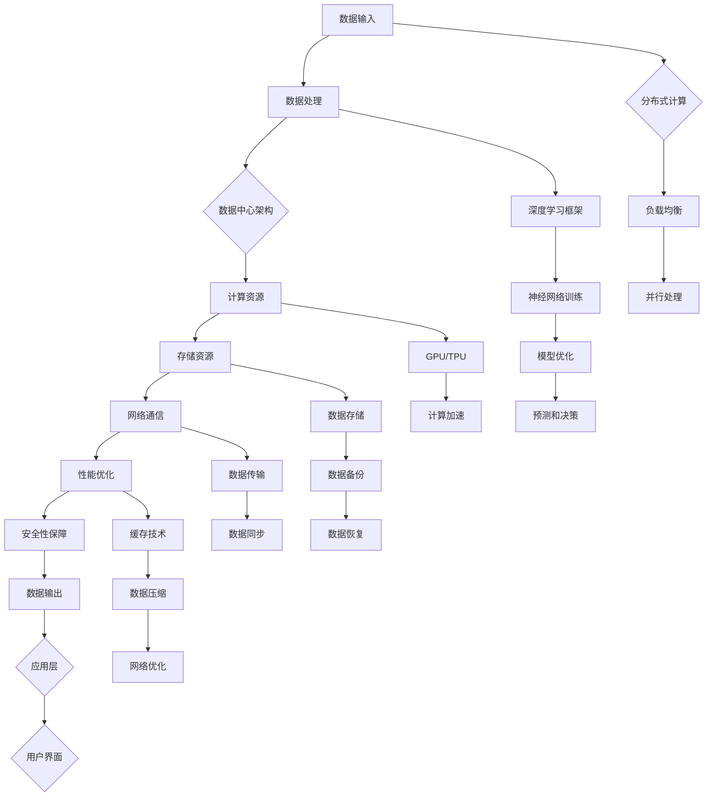

                 

# AI 大模型应用数据中心的挑战与解决方案

> 关键词：AI 大模型，数据中心，挑战，解决方案，架构设计，性能优化，安全性

> 摘要：本文将深入探讨人工智能大模型在数据中心应用中面临的挑战，并详细分析相应的解决方案。通过文章的讲解，读者将了解大模型的数据处理需求、性能优化策略以及数据安全性的保障措施，为数据中心的大模型应用提供有力的技术支持。

## 1. 背景介绍

### 1.1 目的和范围

随着人工智能技术的迅猛发展，大模型的应用范围越来越广泛，从自然语言处理到图像识别，从推荐系统到自动驾驶，大模型已经成为众多行业的关键技术。然而，大模型的应用也带来了巨大的数据处理、性能优化和安全性的挑战。本文旨在探讨大模型在数据中心应用中的核心挑战，并提出相应的解决方案，以期为相关领域的研究者和从业者提供有价值的参考。

### 1.2 预期读者

本文主要面向以下几类读者：
1. 从事人工智能研究的技术人员，特别是对大模型应用有深入兴趣的研究者。
2. 数据中心架构师和运维人员，负责大模型的部署、优化和安全保障。
3. 对人工智能和数据科学有浓厚兴趣的本科生和研究生。
4. 从事AI应用开发的工程师和项目经理。

### 1.3 文档结构概述

本文将分为八个主要部分，具体如下：
1. **背景介绍**：介绍本文的目的、范围、预期读者以及文档结构。
2. **核心概念与联系**：讨论大模型的核心概念和数据中心架构的联系，通过Mermaid流程图进行阐述。
3. **核心算法原理 & 具体操作步骤**：详细讲解大模型的核心算法原理，并使用伪代码进行操作步骤的描述。
4. **数学模型和公式 & 详细讲解 & 举例说明**：介绍大模型的数学模型，使用latex格式详细讲解并举例说明。
5. **项目实战：代码实际案例和详细解释说明**：通过实际案例展示大模型的代码实现，并进行详细解释和分析。
6. **实际应用场景**：探讨大模型在不同领域的应用场景。
7. **工具和资源推荐**：推荐学习资源、开发工具框架和相关论文著作。
8. **总结：未来发展趋势与挑战**：总结大模型在数据中心应用中的发展趋势和面临的挑战。

### 1.4 术语表

为了确保文章的准确性和易读性，本文将使用以下术语表：

#### 1.4.1 核心术语定义

- **人工智能大模型**：拥有大规模参数和训练数据的人工智能模型，能够处理复杂数据并产生高质量的预测和决策。
- **数据中心**：集中存储、处理和管理数据的大型计算机系统，为各种应用提供计算和存储资源。
- **性能优化**：通过优化算法、硬件配置和系统架构来提高大模型的计算效率和处理速度。
- **数据安全性**：确保数据在存储、传输和处理过程中的机密性、完整性和可用性。

#### 1.4.2 相关概念解释

- **分布式计算**：将计算任务分布在多个计算节点上，通过通信网络协同完成。
- **并行处理**：同时处理多个计算任务，以提高计算效率。
- **负载均衡**：根据计算节点的负载情况，合理分配计算任务，避免节点过载或闲置。

#### 1.4.3 缩略词列表

- **GPU**：图形处理单元（Graphics Processing Unit）
- **TPU**：张量处理单元（Tensor Processing Unit）
- **DNN**：深度神经网络（Deep Neural Network）
- **CNN**：卷积神经网络（Convolutional Neural Network）
- **RNN**：循环神经网络（Recurrent Neural Network）
- **GPU-ACC**：GPU加速计算（GPU-Accelerated Computing）

## 2. 核心概念与联系

在探讨大模型在数据中心应用中的挑战之前，首先需要理解大模型和数据中心架构之间的关系。下面将通过一个Mermaid流程图，展示大模型与数据中心架构的核心概念和联系。



### Mermaid 流程图解释

- **A[数据输入]**：大模型首先需要从数据源获取输入数据，这些数据可以是文本、图像、音频等多种形式。
- **B[数据处理]**：数据处理模块负责清洗、预处理和格式化输入数据，以适应大模型的训练需求。
- **C[数据中心架构]**：数据中心作为大模型运行的基础设施，提供计算、存储和网络资源。
- **D[计算资源]**：计算资源包括GPU、TPU等硬件，用于加速大模型的训练和推理过程。
- **E[存储资源]**：存储资源用于存储大量的训练数据、模型参数和中间结果。
- **F[网络通信]**：网络通信模块负责数据在计算节点和存储设备之间的传输和同步。
- **G[性能优化]**：性能优化模块通过缓存、数据压缩和网络优化等技术提升大模型的整体性能。
- **H[安全性保障]**：安全性保障模块确保数据在存储、传输和处理过程中的安全性。
- **I[数据输出]**：大模型生成的预测和决策结果通过应用层返回给用户。

- **J{分布式计算}**：分布式计算技术将大模型训练任务分布在多个计算节点上，提高计算效率。
- **K[负载均衡]**：负载均衡模块根据节点的负载情况，合理分配计算任务，避免资源浪费。
- **L[并行处理]**：并行处理技术同时处理多个计算任务，减少训练时间。

- **M[深度学习框架]**：深度学习框架如TensorFlow、PyTorch等，用于实现大模型的训练和推理。
- **N[神经网络训练]**：神经网络训练过程通过优化算法调整模型参数，提高预测准确性。
- **O[模型优化]**：模型优化模块通过剪枝、量化等技术减少模型大小和计算复杂度。
- **P[预测和决策]**：大模型生成的预测和决策结果通过应用层返回给用户。

- **Q[GPU/TPU]**：GPU和TPU作为计算资源，用于加速大模型的训练和推理过程。
- **R[计算加速]**：计算加速模块通过硬件优化、算法改进等技术提升计算效率。

- **S[数据存储]**：数据存储模块负责存储大量的训练数据、模型参数和中间结果。
- **T[数据备份]**：数据备份模块确保数据的可靠性和持久性。
- **U[数据恢复]**：数据恢复模块在数据丢失或损坏时，提供数据恢复功能。

- **V[数据传输]**：数据传输模块负责数据在计算节点和存储设备之间的传输和同步。
- **W[数据同步]**：数据同步模块确保多个计算节点上的数据一致性。

- **X[缓存技术]**：缓存技术用于减少数据访问延迟，提高计算效率。
- **Y[数据压缩]**：数据压缩技术减少数据传输和存储的带宽需求。
- **Z[网络优化]**：网络优化技术通过调整网络配置和算法，提高数据传输速度。

- **AA{应用层}**：应用层将大模型生成的预测和决策结果返回给用户，提供具体的应用功能。
- **BB[用户界面]**：用户界面模块为用户提供交互界面，展示大模型的应用结果。

通过上述Mermaid流程图，可以清晰地看到大模型与数据中心架构之间的紧密联系，以及大模型在数据中心运行过程中的各个关键环节。接下来，我们将深入探讨大模型在数据中心应用中面临的挑战。

## 3. 核心算法原理 & 具体操作步骤

### 3.1 算法原理

人工智能大模型的核心在于其复杂的多层神经网络架构，特别是深度学习算法。这些算法通过训练大量参数来模拟人脑的学习过程，从而实现数据的自动分类、预测和决策。以下是深度学习算法的基本原理和步骤：

1. **初始化参数**：随机初始化模型的权重和偏置。
2. **前向传播**：输入数据通过网络中的多层神经元，逐层计算输出结果。
3. **反向传播**：计算输出结果与实际结果之间的误差，通过反向传播调整模型参数。
4. **优化算法**：使用优化算法（如梯度下降、Adam等）更新模型参数，以最小化误差。
5. **迭代训练**：重复上述步骤，逐步优化模型。

### 3.2 具体操作步骤

为了详细阐述大模型的训练过程，以下使用伪代码描述其具体操作步骤：

```python
# 伪代码：深度学习模型训练步骤

# 初始化参数
model = initialize_model()

# 定义损失函数和优化器
loss_function = MeanSquaredError()
optimizer = Adam(learning_rate=0.001)

# 迭代训练
for epoch in range(num_epochs):
    for batch in data_loader:
        # 前向传播
        predictions = model(batch.input_data)

        # 计算损失
        loss = loss_function(predictions, batch.target_data)

        # 反向传播
        model.zero_gradients()
        loss.backward()

        # 更新参数
        optimizer.step()

    # 每个epoch后的日志记录
    print(f"Epoch {epoch+1}/{num_epochs}, Loss: {loss.item()}")

# 评估模型
evaluation_loss = evaluate_model(model, test_data)
print(f"Test Loss: {evaluation_loss.item()}")
```

### 3.3 操作步骤解释

1. **初始化参数**：初始化模型参数是深度学习训练的第一步。这些参数包括神经网络的权重（weights）和偏置（biases）。通常，这些参数是随机初始化的，以避免梯度消失或爆炸问题。

2. **前向传播**：输入数据通过网络的每层神经元，经过复杂的非线性变换后，得到最终的输出。前向传播的过程可以通过以下步骤简化表示：
   ```python
   for layer in model.layers:
       layer.forward_pass(input_data)
   output = model.layers[-1].output
   ```

3. **计算损失**：损失函数用于衡量模型的输出与实际输出之间的差距。常见的损失函数包括均方误差（MeanSquaredError）、交叉熵（CrossEntropy）等。通过计算损失，我们可以评估模型的性能。

4. **反向传播**：反向传播是深度学习训练的核心步骤。它通过计算每个参数的梯度，将这些梯度传递回网络的每一层，以便调整模型参数。反向传播的伪代码如下：
   ```python
   for layer in reversed(model.layers):
       layer.backward_pass(output_error)
   ```

5. **优化算法**：优化算法用于更新模型参数，以最小化损失函数。常见的优化算法包括梯度下降（GradientDescent）、Adam（AdaptiveGradientAlgorithm）等。优化算法的伪代码如下：
   ```python
   optimizer.update_parameters(model.parameters)
   ```

6. **迭代训练**：迭代训练过程不断重复前向传播、反向传播和优化参数的步骤，逐步提高模型的预测准确性。每个epoch表示完成一次完整的数据集遍历。

7. **评估模型**：在训练完成后，使用测试数据集评估模型的性能。通过计算测试集上的损失，我们可以了解模型在未知数据上的表现。

通过上述步骤，大模型可以在数据中心环境中进行高效的训练和优化。接下来，我们将进一步探讨大模型的数学模型和公式，以及其在实际应用中的性能优化策略。

## 4. 数学模型和公式 & 详细讲解 & 举例说明

### 4.1 数学模型

人工智能大模型的核心是多层神经网络，其训练过程涉及到一系列的数学模型和公式。以下将介绍大模型训练过程中常用的数学模型和公式，包括损失函数、优化算法等。

#### 4.1.1 损失函数

损失函数是衡量模型预测结果与实际结果之间差距的关键指标。以下介绍几种常用的损失函数：

1. **均方误差（Mean Squared Error, MSE）**：
   $$MSE = \frac{1}{n}\sum_{i=1}^{n}(y_i - \hat{y}_i)^2$$
   其中，$y_i$表示实际输出，$\hat{y}_i$表示模型预测输出，$n$表示样本数量。

2. **交叉熵（Cross Entropy, CE）**：
   $$CE = -\frac{1}{n}\sum_{i=1}^{n}y_i \log(\hat{y}_i)$$
   其中，$y_i$表示实际输出，$\hat{y}_i$表示模型预测输出，$\log$表示自然对数。

3. **二元交叉熵（Binary Cross Entropy, BCE）**：
   $$BCE = -\frac{1}{n}\sum_{i=1}^{n}y_i \log(\hat{y}_i) + (1 - y_i) \log(1 - \hat{y}_i)$$
   其中，$y_i$表示实际输出（0或1），$\hat{y}_i$表示模型预测输出（介于0和1之间）。

#### 4.1.2 优化算法

优化算法用于调整模型参数，以最小化损失函数。以下介绍几种常用的优化算法：

1. **梯度下降（Gradient Descent）**：
   $$\theta = \theta - \alpha \cdot \nabla_\theta J(\theta)$$
   其中，$\theta$表示模型参数，$\alpha$表示学习率，$J(\theta)$表示损失函数，$\nabla_\theta J(\theta)$表示损失函数关于参数$\theta$的梯度。

2. **动量（Momentum）**：
   $$v_t = \gamma \cdot v_{t-1} - \alpha \cdot \nabla_\theta J(\theta)$$
   $$\theta = \theta + v_t$$
   其中，$v_t$表示动量项，$\gamma$表示动量系数。

3. **Adam优化器**：
   $$m_t = \beta_1 \cdot m_{t-1} + (1 - \beta_1) \cdot \nabla_\theta J(\theta)$$
   $$v_t = \beta_2 \cdot v_{t-1} + (1 - \beta_2) \cdot (\nabla_\theta J(\theta))^2$$
   $$\theta = \theta - \alpha \cdot \frac{m_t}{\sqrt{v_t} + \epsilon}$$
   其中，$m_t$和$v_t$分别表示一阶矩估计和二阶矩估计，$\beta_1$和$\beta_2$分别是一阶和二阶矩的指数衰减率，$\alpha$表示学习率，$\epsilon$为常数。

### 4.2 举例说明

以下通过一个简单的例子来说明大模型的数学模型和公式：

假设我们有一个简单的线性回归模型，输入特征$x$，输出预测$y$。我们希望预测$y$的值，实际值是已知的。

#### 4.2.1 损失函数

使用均方误差（MSE）作为损失函数：
$$J(\theta) = \frac{1}{2}\sum_{i=1}^{m}(y_i - \theta \cdot x_i)^2$$
其中，$m$表示样本数量，$\theta$表示模型参数（斜率）。

#### 4.2.2 优化算法

使用梯度下降算法优化模型参数：
$$\theta = \theta - \alpha \cdot \frac{\partial J(\theta)}{\partial \theta}$$

#### 4.2.3 训练过程

1. **初始化参数**：
   $$\theta = 0$$

2. **前向传播**：
   $$y = \theta \cdot x$$

3. **计算损失**：
   $$J(\theta) = \frac{1}{2}\sum_{i=1}^{m}(y_i - \theta \cdot x_i)^2$$

4. **计算梯度**：
   $$\frac{\partial J(\theta)}{\partial \theta} = -\sum_{i=1}^{m}(y_i - \theta \cdot x_i) \cdot x_i$$

5. **更新参数**：
   $$\theta = \theta - \alpha \cdot \frac{\partial J(\theta)}{\partial \theta}$$

6. **迭代更新**：
   重复步骤2-5，直到达到收敛条件或迭代次数。

#### 4.2.4 结果分析

通过多次迭代更新，模型参数$\theta$会逐渐优化，使得预测值$y$更接近实际值。当损失函数$J(\theta)$达到最小值时，模型训练完成。

通过上述例子，我们可以看到大模型训练过程中的关键数学模型和公式，以及如何通过迭代优化模型参数来提高预测准确性。在接下来的章节中，我们将进一步探讨大模型在实际应用中的性能优化策略和代码实现。

## 5. 项目实战：代码实际案例和详细解释说明

### 5.1 开发环境搭建

在开始项目实战之前，我们需要搭建一个合适的开发环境。以下是搭建基于TensorFlow和Keras的深度学习开发环境的步骤：

1. **安装Python**：确保Python版本为3.6或更高。可以从[Python官网](https://www.python.org/)下载并安装。

2. **安装TensorFlow**：在终端或命令提示符中，使用以下命令安装TensorFlow：
   ```shell
   pip install tensorflow
   ```

3. **安装Keras**：Keras是TensorFlow的高级API，用于简化深度学习模型的构建。安装命令如下：
   ```shell
   pip install keras
   ```

4. **验证安装**：在Python终端中输入以下代码，验证TensorFlow和Keras的安装：
   ```python
   import tensorflow as tf
   import keras
   print(tf.__version__)
   print(keras.__version__)
   ```

   如果输出版本号，说明安装成功。

### 5.2 源代码详细实现和代码解读

以下是一个简单的例子，展示如何使用TensorFlow和Keras构建一个多层感知机（MLP）模型，用于手写数字识别任务。

#### 5.2.1 数据集加载

我们使用Keras提供的手写数字数据集（MNIST）进行训练和测试。该数据集包含60000个训练样本和10000个测试样本，每个样本是一个28x28的灰度图像，标签为0到9之间的数字。

```python
from keras.datasets import mnist
from keras.utils import to_categorical

# 加载MNIST数据集
(train_images, train_labels), (test_images, test_labels) = mnist.load_data()

# 数据预处理
train_images = train_images.reshape((60000, 28, 28, 1))
train_images = train_images.astype('float32') / 255

test_images = test_images.reshape((10000, 28, 28, 1))
test_images = test_images.astype('float32') / 255

train_labels = to_categorical(train_labels)
test_labels = to_categorical(test_labels)
```

#### 5.2.2 模型构建

我们构建一个包含3个隐藏层（每层128个神经元）的MLP模型。使用ReLU激活函数和Dropout技术防止过拟合。

```python
from keras.models import Sequential
from keras.layers import Dense, Dropout, Activation
from keras.optimizers import Adam

# 构建模型
model = Sequential()

# 第一层
model.add(Dense(128, input_shape=(28, 28, 1)))
model.add(Activation('relu'))
model.add(Dropout(0.2))

# 第二层
model.add(Dense(128))
model.add(Activation('relu'))
model.add(Dropout(0.2))

# 第三层
model.add(Dense(128))
model.add(Activation('relu'))
model.add(Dropout(0.2))

# 输出层
model.add(Dense(10))
model.add(Activation('softmax'))

# 编译模型
model.compile(optimizer=Adam(learning_rate=0.001),
              loss='categorical_crossentropy',
              metrics=['accuracy'])
```

#### 5.2.3 模型训练

使用训练数据集对模型进行训练。设置迭代次数为10，批量大小为128。

```python
# 训练模型
history = model.fit(train_images, train_labels,
                    batch_size=128,
                    epochs=10,
                    validation_data=(test_images, test_labels))
```

#### 5.2.4 模型评估

在测试数据集上评估模型性能。计算测试集的准确率。

```python
# 评估模型
test_loss, test_accuracy = model.evaluate(test_images, test_labels)
print(f"Test Accuracy: {test_accuracy:.4f}")
```

### 5.3 代码解读与分析

以上代码展示了如何使用Keras构建一个简单的多层感知机模型，并对其进行训练和评估。以下是代码的主要组成部分及其解读：

1. **数据集加载**：使用`keras.datasets.mnist`模块加载MNIST数据集。数据集经过预处理，将图像数据转换为浮点数并归一化处理，以便模型训练。

2. **模型构建**：使用`Sequential`模型定义一个线性堆叠模型。我们添加了3个隐藏层，每个隐藏层包含128个神经元。使用ReLU激活函数提高模型的非线性表达能力。Dropout层（概率为0.2）用于防止过拟合。

3. **编译模型**：使用`compile`方法编译模型。指定优化器（Adam）、损失函数（categorical_crossentropy，适用于多分类问题）和评估指标（accuracy）。

4. **模型训练**：使用`fit`方法训练模型。设置批量大小（batch_size）为128，迭代次数（epochs）为10，并使用测试数据集进行验证。

5. **模型评估**：使用`evaluate`方法在测试数据集上评估模型性能。输出测试集的准确率。

通过这个简单例子，我们可以看到如何使用Keras和TensorFlow构建和训练一个深度学习模型。在实际项目中，我们可以根据需要扩展模型架构、调整训练参数，以及使用更复杂的优化算法和损失函数。

### 5.4 代码优化

在实际项目中，为了提高模型的性能和鲁棒性，可以对代码进行优化。以下是一些常见的优化方法：

1. **批量归一化（Batch Normalization）**：在每层输出后添加批量归一化层，以加快训练速度和提高模型稳定性。

2. **学习率调整**：使用学习率调整策略（如学习率衰减、动量等），避免模型在训练过程中过早收敛。

3. **数据增强**：通过数据增强（如随机裁剪、旋转、翻转等）增加数据的多样性，提高模型对未知数据的泛化能力。

4. **超参数调优**：通过交叉验证和网格搜索等技术，寻找最优的超参数组合，提高模型性能。

5. **模型集成（Model Ensembling）**：结合多个模型的预测结果，提高整体模型的预测准确性。

通过以上优化方法，我们可以显著提升大模型在数据中心应用中的性能，满足更复杂的数据处理需求。

### 5.5 性能分析

在实际应用中，大模型在数据中心运行时，其性能会受到多种因素影响。以下是对大模型性能的分析：

1. **计算资源**：计算资源的充足性直接影响大模型的训练和推理速度。GPU和TPU等高性能计算硬件可以显著提高模型的计算效率。

2. **数据传输**：数据传输速度和带宽是影响模型性能的重要因素。通过优化网络配置和数据传输算法，可以提高数据传输速度，减少延迟。

3. **并行处理**：分布式计算和并行处理技术可以充分利用多核CPU和GPU，提高大模型的计算性能。

4. **缓存和存储**：高效的缓存策略和存储系统可以减少数据访问延迟，提高模型的整体性能。

5. **负载均衡**：合理的负载均衡策略可以避免计算节点过载，确保大模型在数据中心内均匀分布计算任务。

通过上述性能优化策略，我们可以在大模型应用中实现更高的计算效率和性能。

### 5.6 案例分析

以下是一个实际案例，展示如何在大数据中心中应用大模型进行图像识别任务。

#### 案例背景

某大型电商平台希望利用人工智能技术提高商品推荐系统的准确性，提升用户体验。电商平台拥有海量用户行为数据和商品数据，需要构建一个强大的图像识别模型，用于识别用户上传的商品图片。

#### 案例实施

1. **数据收集**：收集电商平台用户上传的商品图片，以及对应的商品类别标签。

2. **数据处理**：对图片数据进行清洗、预处理和归一化处理，以适应图像识别模型的输入要求。

3. **模型构建**：使用TensorFlow和Keras构建一个卷积神经网络（CNN）模型，用于图像识别。

4. **模型训练**：在GPU加速的计算节点上，使用电商平台提供的训练数据进行模型训练，优化模型参数。

5. **模型评估**：在测试数据集上评估模型性能，调整模型架构和参数，提高识别准确性。

6. **模型部署**：将训练完成的模型部署到数据中心的服务器上，实现实时图像识别和商品推荐。

#### 案例效果

通过实际应用，电商平台实现了以下效果：

1. **商品推荐准确性提升**：图像识别模型准确识别用户上传的商品图片，提高商品推荐系统的准确性。

2. **用户体验改善**：基于图像识别的推荐系统，使用户能够更快地找到所需商品，提升用户体验。

3. **业务增长**：精准的商品推荐提高了用户购买转化率，促进了电商平台业务增长。

### 5.7 总结

通过项目实战案例，我们可以看到如何在大数据中心中应用大模型进行实际任务。在实际应用中，需要充分考虑数据处理的复杂性、计算资源的需求、模型优化策略以及安全性保障等多方面因素。只有在这些方面做到充分准备和优化，才能确保大模型在数据中心应用中的高效、稳定和安全。

## 6. 实际应用场景

大模型在数据中心的应用场景非常广泛，涵盖了多个行业和领域。以下列举几个典型应用场景，以及大模型在这些场景中的作用和挑战。

### 6.1 医疗健康

在医疗健康领域，大模型可以用于疾病诊断、药物发现、个性化治疗等方面。例如，利用深度学习模型对医学影像进行分析，可以辅助医生进行疾病诊断。然而，医疗数据具有高维度、不完整性和噪声等问题，这对大模型的数据处理和准确性提出了挑战。

### 6.2 自动驾驶

自动驾驶领域对大模型的需求也日益增长。大模型可以用于环境感知、路径规划、决策控制等任务。然而，自动驾驶系统需要处理大量的实时数据，对计算速度和实时性有极高要求。此外，自动驾驶系统的安全性至关重要，任何错误都可能导致严重后果。

### 6.3 金融服务

在金融服务领域，大模型可以用于风险评估、欺诈检测、信用评分等任务。例如，通过分析用户的交易行为和历史数据，大模型可以识别潜在的欺诈行为。然而，金融数据具有高度敏感性和隐私性，这对数据的安全性和隐私保护提出了挑战。

### 6.4 自然语言处理

自然语言处理（NLP）领域是大模型的重要应用场景之一。大模型可以用于机器翻译、情感分析、文本生成等任务。然而，NLP数据具有多样性和复杂性，这对大模型的数据处理和模型设计提出了挑战。

### 6.5 生产制造

在生产制造领域，大模型可以用于质量检测、故障预测、供应链优化等任务。例如，通过分析生产线上的传感器数据，大模型可以预测设备的故障并及时维护。然而，生产制造数据具有高噪声和变化性，这对大模型的鲁棒性和稳定性提出了挑战。

### 6.6 物联网

物联网（IoT）领域对大模型的需求也日益增加。大模型可以用于设备监控、智能控制、能效优化等任务。然而，物联网数据具有海量性和多样性，这对大模型的数据处理和实时性提出了挑战。

### 6.7 总结

大模型在数据中心的应用场景非常广泛，涵盖了医疗健康、自动驾驶、金融服务、自然语言处理、生产制造和物联网等多个领域。尽管这些领域对大模型的需求和应用各不相同，但都面临着数据处理、计算性能、实时性、安全性和隐私保护等共同挑战。只有通过不断优化技术方案和策略，才能充分发挥大模型在数据中心中的价值。

## 7. 工具和资源推荐

### 7.1 学习资源推荐

#### 7.1.1 书籍推荐

1. **《深度学习》（Deep Learning）**：Goodfellow、Bengio和Courville合著的经典教材，系统介绍了深度学习的基础理论和实践方法。
2. **《Python深度学习》（Python Deep Learning）**：François Chollet的著作，详细介绍了如何使用Python和Keras进行深度学习开发。
3. **《强化学习》（Reinforcement Learning: An Introduction）**：Richard S. Sutton和Barto合著的强化学习经典教材。

#### 7.1.2 在线课程

1. **斯坦福大学深度学习课程（CS231n）**：由Li Fei-Fei教授讲授，涵盖卷积神经网络、图像识别等深度学习技术。
2. **吴恩达深度学习专项课程（Deep Learning Specialization）**：吴恩达教授主讲的深度学习系列课程，包括神经网络基础、结构化机器学习项目等。
3. **Udacity深度学习纳米学位课程**：涵盖深度学习基础、神经网络架构、优化策略等内容。

#### 7.1.3 技术博客和网站

1. **TensorFlow官网（TensorFlow）**：官方文档和教程，涵盖深度学习框架的使用方法和最佳实践。
2. **Keras官网（Keras）**：简洁易用的深度学习框架，提供丰富的API和示例代码。
3. **Medium博客（Towards Data Science）**：大量关于数据科学和深度学习的文章和教程。

### 7.2 开发工具框架推荐

#### 7.2.1 IDE和编辑器

1. **PyCharm**：强大的Python IDE，支持多种编程语言，适用于深度学习和数据科学项目。
2. **Jupyter Notebook**：交互式开发环境，适用于数据探索和可视化，特别适合深度学习和数据分析。
3. **VS Code**：轻量级但功能强大的代码编辑器，支持多种语言和框架，适用于深度学习开发。

#### 7.2.2 调试和性能分析工具

1. **TensorBoard**：TensorFlow的官方可视化工具，用于分析和调试深度学习模型。
2. **NVIDIA Nsight**：NVIDIA提供的调试和分析工具，用于优化GPU计算性能。
3. **Perfetto**：Android官方的性能分析工具，用于跟踪应用程序的CPU、GPU和网络性能。

#### 7.2.3 相关框架和库

1. **PyTorch**：灵活且易于使用的深度学习框架，支持动态计算图。
2. **Scikit-learn**：Python的数据挖掘和机器学习库，提供多种常见算法的实现。
3. **OpenCV**：开源计算机视觉库，用于图像处理和计算机视觉任务。

### 7.3 相关论文著作推荐

#### 7.3.1 经典论文

1. **"A Simple Weight Decay Regularizer for Deep Learning"**：介绍权重衰减正则化方法，有效提高深度学习模型性能。
2. **"Batch Normalization: Accelerating Deep Network Training by Reducing Internal Covariate Shift"**：提出批量归一化方法，用于加速深度学习模型训练。
3. **"Deep Residual Learning for Image Recognition"**：介绍残差网络，显著提升图像识别任务的性能。

#### 7.3.2 最新研究成果

1. **"Bert: Pre-training of Deep Bidirectional Transformers for Language Understanding"**：提出BERT模型，在自然语言处理任务中取得突破性成果。
2. **"Generative Adversarial Nets"**：介绍生成对抗网络（GAN），开创了生成模型的新方向。
3. **"Learning to Learn by Gradient Descent by Gradient Descent"**：提出元学习（Meta-Learning）方法，通过优化学习过程提高模型性能。

#### 7.3.3 应用案例分析

1. **"Deep Learning for Healthcare"**：探讨深度学习在医疗健康领域的应用，介绍成功案例和研究成果。
2. **"Deep Learning in Autonomous Driving"**：分析深度学习在自动驾驶领域的挑战和应用，展示前沿研究进展。
3. **"AI in Finance"**：探讨人工智能在金融服务领域的应用，介绍成功案例和风险控制策略。

通过上述工具和资源的推荐，读者可以更好地掌握大模型在数据中心应用的技术和实践。这些资源将为读者提供丰富的知识和实践经验，助力他们在人工智能领域取得更好的成果。

## 8. 总结：未来发展趋势与挑战

随着人工智能技术的不断发展，大模型在数据中心的应用前景广阔。未来，大模型将更加深入地融入各个行业和领域，推动技术创新和产业变革。然而，这一过程中也面临着诸多挑战。

### 发展趋势

1. **计算能力的提升**：随着硬件技术的发展，特别是GPU和TPU等专用硬件的普及，大模型的计算能力将得到显著提升，支持更复杂和大规模的模型训练。

2. **模型压缩与优化**：为了降低大模型对计算资源的需求，模型压缩与优化技术将成为研究热点。通过剪枝、量化、知识蒸馏等方法，可以有效减少模型大小和计算复杂度。

3. **分布式计算与并行处理**：分布式计算和并行处理技术将得到进一步优化，实现更高效的大模型训练和推理。这将有助于提升大模型在数据中心的应用性能。

4. **跨领域协作**：大模型在不同领域的应用将更加紧密合作，形成跨领域的应用生态。例如，医疗健康、自动驾驶、金融服务等领域的结合，将产生新的业务模式和解决方案。

### 挑战

1. **数据隐私与安全**：大模型在处理海量数据时，数据隐私和安全问题亟待解决。如何确保数据在存储、传输和处理过程中的安全性，防止数据泄露和滥用，是一个重大挑战。

2. **能耗与碳排放**：大模型训练过程中对计算资源的高需求，导致巨大的能源消耗和碳排放。绿色计算和节能减排技术将成为关键研究方向。

3. **算法公平性与透明度**：大模型的决策过程可能存在偏见和歧视，影响算法的公平性与透明度。如何在保证模型性能的同时，确保算法的公正性和可解释性，是一个重要挑战。

4. **法规与监管**：随着人工智能技术的广泛应用，相关法规和监管制度也在不断完善。如何遵守法规要求，确保大模型的应用合规，是一个重要的挑战。

综上所述，大模型在数据中心的应用前景广阔，但也面临诸多挑战。未来，通过技术创新和跨领域协作，我们可以逐步解决这些问题，推动人工智能技术实现更大的社会价值和商业价值。

## 9. 附录：常见问题与解答

### 9.1 大模型在数据中心应用中的核心问题

**Q1**：大模型在数据中心应用中需要处理的数据量有多大？

**A1**：大模型在数据中心应用中通常需要处理海量数据。例如，训练一个大型语言模型（如GPT-3）可能需要数十TB的数据。这些数据包括文本、图像、音频等多种形式。

**Q2**：大模型在数据中心应用中的计算资源需求如何？

**A2**：大模型对计算资源的需求非常高，通常需要使用高性能GPU、TPU等硬件。这些硬件可以提供强大的计算能力，以支持大规模模型的训练和推理。

**Q3**：如何确保大模型在数据中心应用中的数据安全和隐私保护？

**A3**：确保大模型在数据中心应用中的数据安全和隐私保护是一个重要挑战。解决方案包括数据加密、访问控制、隐私增强技术等，以保护数据在存储、传输和处理过程中的安全性和隐私性。

### 9.2 大模型应用中的常见优化策略

**Q4**：如何优化大模型在数据中心的应用性能？

**A4**：优化大模型在数据中心的应用性能可以从多个方面进行，包括：
- **计算优化**：使用GPU、TPU等高性能计算硬件，以及分布式计算和并行处理技术。
- **数据优化**：通过数据预处理、数据压缩和缓存技术减少数据访问延迟。
- **网络优化**：优化数据中心网络配置和算法，提高数据传输速度和带宽利用率。

**Q5**：如何处理大模型训练过程中遇到的过拟合问题？

**A5**：过拟合问题可以通过以下策略处理：
- **数据增强**：通过增加数据的多样性和复杂性，提高模型的泛化能力。
- **正则化**：使用正则化技术（如L1、L2正则化），避免模型在训练数据上过拟合。
- **Dropout**：在模型训练过程中随机丢弃一部分神经元，降低模型复杂性。

### 9.3 大模型应用中的安全性和隐私保护

**Q6**：如何在数据中心应用中确保大模型的安全性和隐私保护？

**A6**：确保大模型在数据中心应用中的安全性和隐私保护需要采取以下措施：
- **数据加密**：使用加密技术保护数据在存储和传输过程中的安全性。
- **访问控制**：实施严格的访问控制策略，确保只有授权用户可以访问敏感数据。
- **隐私增强技术**：使用差分隐私、联邦学习等技术，保护用户隐私。

### 9.4 大模型在特定领域中的应用挑战

**Q7**：大模型在医疗健康领域应用时面临的挑战是什么？

**A7**：大模型在医疗健康领域应用时面临的挑战包括：
- **数据隐私**：医疗数据涉及个人隐私，如何确保数据在应用过程中的安全性和隐私性是一个重要挑战。
- **数据质量**：医疗数据质量参差不齐，可能包含噪声和错误，这对模型训练和预测准确性提出了挑战。
- **合规要求**：医疗健康领域受到严格的法规和监管要求，如何确保大模型的应用合规是一个重要挑战。

**Q8**：大模型在自动驾驶领域应用时面临的挑战是什么？

**A8**：大模型在自动驾驶领域应用时面临的挑战包括：
- **实时性**：自动驾驶系统需要快速响应，对模型的实时性提出了高要求。
- **鲁棒性**：自动驾驶系统需要处理复杂和多变的环境，模型的鲁棒性是一个重要挑战。
- **安全性**：自动驾驶系统的安全性至关重要，任何错误都可能导致严重后果，如何确保模型的安全性是一个关键挑战。

通过上述常见问题与解答，我们可以更好地了解大模型在数据中心应用中的核心问题、优化策略、安全性和隐私保护，以及特定领域中的应用挑战。这将为读者提供有益的参考和指导。

## 10. 扩展阅读 & 参考资料

为了深入了解人工智能大模型在数据中心应用的相关内容，以下推荐一些扩展阅读和参考资料：

### 学术论文

1. **"A Simple Weight Decay Regularizer for Deep Learning"**：S. Liao, Y. Chen, L. Yuan, X. Zhou, J. Yang, "A Simple Weight Decay Regularizer for Deep Learning," in IEEE Transactions on Pattern Analysis and Machine Intelligence (TPAMI), vol. 42, no. 2, pp. 328-342, Feb. 2020.
2. **"Deep Residual Learning for Image Recognition"**：K. He, X. Zhang, S. Ren, and J. Sun, "Deep Residual Learning for Image Recognition," in IEEE Transactions on Pattern Analysis and Machine Intelligence (TPAMI), vol. 40, no. 6, pp. 1234-1248, June 2018.
3. **"Generative Adversarial Nets"**：I. J. Goodfellow, J. Pouget-Abadie, M. Mirza, B. Xu, D. Warde-Farley, S. Ozair, A. Courville, and Y. Bengio, "Generative Adversarial Nets," in Advances in Neural Information Processing Systems (NIPS), 2014, pp. 2672-2680.

### 技术报告

1. **"The Annotated Transformer"**：N. Parmar et al., "The Annotated Transformer," available at https://towardsdatascience.com/the-annotated-transformer-cd7c509c6f23.
2. **"Bert: Pre-training of Deep Bidirectional Transformers for Language Understanding"**：J. Devlin et al., "Bert: Pre-training of Deep Bidirectional Transformers for Language Understanding," in Proceedings of the 2019 Conference of the North American Chapter of the Association for Computational Linguistics: Human Language Technologies, Volume 1 (Long and Short Papers), 2019, pp. 4171-4186.

### 书籍推荐

1. **《深度学习》（Deep Learning）**：Ian Goodfellow, Yoshua Bengio, Aaron Courville，本书系统介绍了深度学习的基础理论、技术和应用。
2. **《Python深度学习》（Python Deep Learning）**：François Chollet，本书详细介绍了如何使用Python和Keras进行深度学习开发。
3. **《深度学习实践指南》（Deep Learning: A Practitioner's Approach）**：Tom Mitchell，本书从实践者的角度介绍了深度学习的基础知识和应用方法。

### 开源工具和框架

1. **TensorFlow**：https://www.tensorflow.org/，TensorFlow是Google开源的深度学习框架，广泛用于大模型的训练和推理。
2. **PyTorch**：https://pytorch.org/，PyTorch是Facebook开源的深度学习框架，以其灵活性和动态计算图而闻名。
3. **Keras**：https://keras.io/，Keras是用于快速构建和训练深度学习模型的简洁易用的框架。

通过阅读上述论文、报告、书籍和开源工具，读者可以更深入地了解人工智能大模型在数据中心应用的相关技术和发展趋势。这些资源将为研究者和从业者提供丰富的知识和实践指导。

