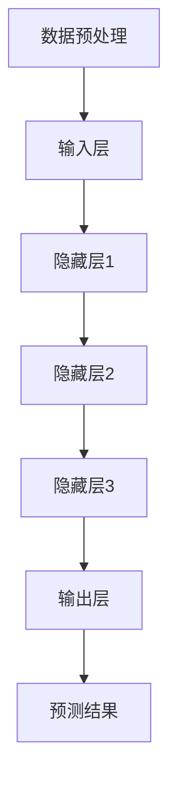
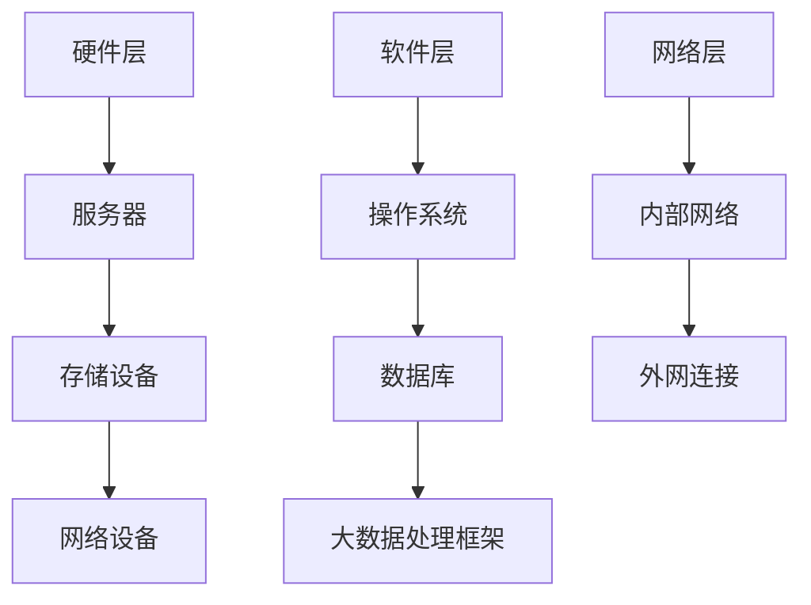
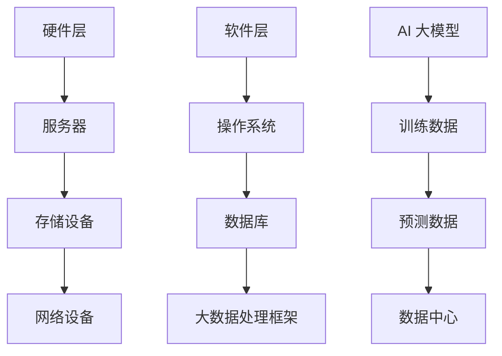
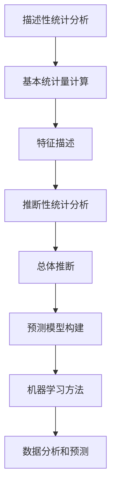
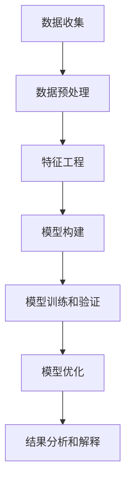

                 

# AI 大模型应用数据中心的数据分析

> **关键词：** 大模型，数据中心，数据分析，AI 应用，性能优化

> **摘要：** 本文将探讨如何利用大数据分析技术，对 AI 大模型在数据中心的应用进行深入分析，以实现性能优化和资源管理。文章首先介绍了 AI 大模型的基本原理和数据中心架构，然后详细分析了数据分析的核心概念和方法，最后通过实际案例和数学模型，展示了如何对 AI 大模型应用进行性能优化。

## 1. 背景介绍

### 1.1 目的和范围

随着深度学习和人工智能技术的快速发展，AI 大模型在各个领域得到了广泛应用，例如自然语言处理、计算机视觉和推荐系统等。然而，这些大模型在应用过程中面临着计算资源消耗巨大、性能优化困难等问题。本文旨在探讨如何通过数据中心的数据分析技术，实现 AI 大模型应用的性能优化和资源管理。

本文将涵盖以下内容：

1. AI 大模型的基本原理和数据中心架构。
2. 数据分析的核心概念和方法。
3. AI 大模型应用中的性能优化策略。
4. 实际案例和数学模型的应用。

### 1.2 预期读者

本文适用于对 AI 大模型和数据中心有一定了解的技术人员，包括：

1. AI 研究人员和开发者。
2. 数据中心和云计算工程师。
3. 对 AI 大模型应用感兴趣的工程师和管理人员。

### 1.3 文档结构概述

本文分为十个部分，具体结构如下：

1. 背景介绍：介绍本文的目的、预期读者和文档结构。
2. 核心概念与联系：介绍 AI 大模型和数据中心的架构。
3. 核心算法原理 & 具体操作步骤：详细阐述数据分析算法的原理和实现。
4. 数学模型和公式 & 详细讲解 & 举例说明：介绍数据分析中的数学模型和公式。
5. 项目实战：代码实际案例和详细解释说明。
6. 实际应用场景：分析 AI 大模型在实际应用中的挑战和解决方案。
7. 工具和资源推荐：推荐学习资源和开发工具。
8. 总结：未来发展趋势与挑战。
9. 附录：常见问题与解答。
10. 扩展阅读 & 参考资料：提供进一步的阅读材料。

### 1.4 术语表

为了确保文章的可读性，以下是对本文中出现的一些术语的定义和解释：

#### 1.4.1 核心术语定义

- AI 大模型：指具有大规模参数和强大计算能力的深度学习模型。
- 数据中心：指用于存储、处理和分析大规模数据的专用设施。
- 数据分析：指使用统计方法和算法对数据进行处理和分析的过程。
- 性能优化：指通过改进算法、架构和资源管理，提高系统性能的过程。

#### 1.4.2 相关概念解释

- 深度学习：一种机器学习方法，通过多层神经网络来模拟人脑的学习过程。
- 深度可分离卷积（Depthwise Separable Convolution）：一种卷积神经网络中的特殊结构，可以提高模型计算效率。
- 批量归一化（Batch Normalization）：一种用于加快深度学习模型训练速度的技术。

#### 1.4.3 缩略词列表

- AI：人工智能（Artificial Intelligence）
- ML：机器学习（Machine Learning）
- DL：深度学习（Deep Learning）
- GPU：图形处理单元（Graphics Processing Unit）
- CPU：中央处理单元（Central Processing Unit）
- DM：数据分析（Data Mining）

## 2. 核心概念与联系

为了更好地理解 AI 大模型在数据中心的应用，我们需要首先了解 AI 大模型的基本原理和数据中心的架构。

### 2.1 AI 大模型的基本原理

AI 大模型是基于深度学习的算法，通过多层神经网络对数据进行处理和预测。其基本原理可以概括为以下步骤：

1. **数据预处理**：对输入数据进行标准化、归一化等预处理操作，使其符合神经网络训练的要求。
2. **输入层**：将预处理后的数据输入到神经网络中。
3. **隐藏层**：神经网络中的隐藏层负责对输入数据进行特征提取和转换。
4. **输出层**：将隐藏层处理后的数据输入到输出层，得到预测结果。

以下是一个简化的 Mermaid 流程图，展示了 AI 大模型的基本架构：



### 2.2 数据中心的架构

数据中心是用于存储、处理和分析大规模数据的专用设施。其架构通常包括以下几个部分：

1. **硬件层**：包括服务器、存储设备和网络设备等硬件资源。
2. **软件层**：包括操作系统、数据库、大数据处理框架等软件资源。
3. **网络层**：包括内部网络和外网连接等网络资源。

以下是一个简化的 Mermaid 流程图，展示了数据中心的架构：



### 2.3 AI 大模型与数据中心的联系

AI 大模型与数据中心之间存在着紧密的联系。数据中心提供了存储、计算和传输资源，以支持 AI 大模型的应用。具体来说，数据中心的作用包括：

1. **存储**：存储大规模的训练数据和预测数据，以便 AI 大模型进行训练和部署。
2. **计算**：提供强大的计算资源，以支持 AI 大模型的高效训练和推理。
3. **传输**：确保数据在数据中心内部和外部的快速传输，以支持 AI 大模型的应用。

以下是一个简化的 Mermaid 流程图，展示了 AI 大模型与数据中心的联系：



通过以上分析，我们可以看到，AI 大模型与数据中心之间的联系是紧密的，两者相互依存，共同推动了人工智能技术的发展。

## 3. 核心算法原理 & 具体操作步骤

在了解了 AI 大模型的基本原理和数据中心的架构后，接下来我们将深入探讨数据分析的核心算法原理和具体操作步骤。

### 3.1 数据分析算法原理

数据分析算法是基于统计学和概率论的一系列方法，用于对数据进行处理和分析。其主要原理包括：

1. **描述性统计分析**：通过计算数据的基本统计量（如均值、方差、标准差等）来描述数据的特征。
2. **推断性统计分析**：通过构建统计模型，对总体数据进行推断和预测。
3. **机器学习方法**：利用统计模型和算法，对数据进行分析和预测。

以下是一个简化的 Mermaid 流程图，展示了数据分析算法的基本原理：



### 3.2 数据分析具体操作步骤

在了解了数据分析算法原理后，我们接下来将介绍数据分析的具体操作步骤。以下是一个典型的数据分析流程：

1. **数据收集**：从各种来源收集数据，如数据库、文件、传感器等。
2. **数据预处理**：对收集到的数据进行清洗、转换和标准化，使其符合分析要求。
3. **特征工程**：通过对数据进行处理和变换，提取出有用的特征，以提高分析效果。
4. **模型构建**：根据数据分析目标和数据特征，选择合适的统计模型或机器学习算法进行模型构建。
5. **模型训练和验证**：使用训练数据对模型进行训练，并通过验证数据评估模型性能。
6. **模型优化**：根据验证结果，对模型进行调整和优化，以提高模型性能。
7. **结果分析和解释**：对分析结果进行解释和可视化，以帮助用户理解分析结果。

以下是一个简化的 Mermaid 流程图，展示了数据分析的具体操作步骤：



### 3.3 数据分析算法的实现

在了解了数据分析算法原理和具体操作步骤后，我们接下来将介绍数据分析算法的实现。

以下是一个基于 Python 和 Scikit-learn 库的伪代码示例，展示了如何实现一个简单的数据分析算法：

```python
# 导入所需库
import numpy as np
from sklearn.linear_model import LinearRegression

# 数据收集
X_train, y_train = load_data()

# 数据预处理
X_train = preprocess_data(X_train)

# 模型构建
model = LinearRegression()

# 模型训练
model.fit(X_train, y_train)

# 模型验证
X_val, y_val = load_val_data()
y_pred = model.predict(X_val)

# 模型优化
model.optimize()

# 结果分析和解释
print("模型性能：", model.evaluate(y_val, y_pred))
```

通过以上步骤，我们可以实现对数据分析算法的基本实现。

## 4. 数学模型和公式 & 详细讲解 & 举例说明

在数据分析中，数学模型和公式扮演着核心角色，它们帮助我们理解和解释数据背后的规律。在本节中，我们将详细讲解数据分析中常用的数学模型和公式，并通过具体例子来说明它们的应用。

### 4.1 线性回归模型

线性回归是一种最常见的统计模型，用于分析自变量和因变量之间的线性关系。其数学模型可以表示为：

$$ y = \beta_0 + \beta_1 \cdot x + \epsilon $$

其中，$y$ 是因变量，$x$ 是自变量，$\beta_0$ 和 $\beta_1$ 是模型的参数，$\epsilon$ 是误差项。

#### 4.1.1 模型参数估计

为了估计模型的参数，我们通常使用最小二乘法（Least Squares Method）。具体步骤如下：

1. **计算自变量和因变量的均值**：
   $$ \bar{x} = \frac{1}{n} \sum_{i=1}^{n} x_i $$
   $$ \bar{y} = \frac{1}{n} \sum_{i=1}^{n} y_i $$
   
2. **计算回归直线的斜率和截距**：
   $$ \beta_1 = \frac{\sum_{i=1}^{n} (x_i - \bar{x})(y_i - \bar{y})}{\sum_{i=1}^{n} (x_i - \bar{x})^2} $$
   $$ \beta_0 = \bar{y} - \beta_1 \cdot \bar{x} $$

#### 4.1.2 例子说明

假设我们有一组数据：

| x   | y   |
|-----|-----|
| 1   | 2   |
| 2   | 4   |
| 3   | 6   |
| 4   | 8   |
| 5   | 10  |

我们希望找到 $y$ 和 $x$ 之间的线性关系。根据上述步骤，我们可以计算出：

$$ \bar{x} = 3 $$
$$ \bar{y} = 6 $$

$$ \beta_1 = \frac{(1-3)(2-6) + (2-3)(4-6) + (3-3)(6-6) + (4-3)(8-6) + (5-3)(10-6)}{(1-3)^2 + (2-3)^2 + (3-3)^2 + (4-3)^2 + (5-3)^2} $$
$$ \beta_1 = \frac{-4 + -2 + 0 + 2 + 4}{4 + 1 + 0 + 1 + 4} $$
$$ \beta_1 = \frac{0}{10} $$
$$ \beta_1 = 0 $$

$$ \beta_0 = 6 - 0 \cdot 3 $$
$$ \beta_0 = 6 $$

因此，线性回归模型可以表示为 $y = 6$。

### 4.2 逻辑回归模型

逻辑回归是一种用于分类问题的统计模型，其数学模型可以表示为：

$$ P(y=1) = \frac{1}{1 + e^{-(\beta_0 + \beta_1 \cdot x)}} $$

其中，$P(y=1)$ 是因变量 $y$ 取值为 1 的概率，$\beta_0$ 和 $\beta_1$ 是模型的参数。

#### 4.2.1 模型参数估计

为了估计模型的参数，我们通常使用最大似然估计（Maximum Likelihood Estimation，MLE）。具体步骤如下：

1. **构建似然函数**：
   $$ L(\beta_0, \beta_1) = \prod_{i=1}^{n} P(y_i=1|x_i; \beta_0, \beta_1) $$
   $$ L(\beta_0, \beta_1) = \prod_{i=1}^{n} \frac{1}{1 + e^{-(\beta_0 + \beta_1 \cdot x_i)}} $$
   
2. **对似然函数取对数**：
   $$ \ln L(\beta_0, \beta_1) = \sum_{i=1}^{n} \ln \left(\frac{1}{1 + e^{-(\beta_0 + \beta_1 \cdot x_i)}}\right) $$
   
3. **对对数似然函数求导**：
   $$ \frac{\partial \ln L(\beta_0, \beta_1)}{\partial \beta_0} = \frac{1}{1 + e^{-(\beta_0 + \beta_1 \cdot x)}} $$
   $$ \frac{\partial \ln L(\beta_0, \beta_1)}{\partial \beta_1} = \frac{x}{1 + e^{-(\beta_0 + \beta_1 \cdot x)}} $$
   
4. **令导数为零，求解参数**：
   $$ \frac{\partial \ln L(\beta_0, \beta_1)}{\partial \beta_0} = 0 $$
   $$ \frac{\partial \ln L(\beta_0, \beta_1)}{\partial \beta_1} = 0 $$

#### 4.2.2 例子说明

假设我们有一组二分类数据：

| x   | y   |
|-----|-----|
| 1   | 0   |
| 2   | 1   |
| 3   | 0   |
| 4   | 1   |
| 5   | 1   |

我们希望找到 $y$ 和 $x$ 之间的分类关系。根据上述步骤，我们可以计算出：

$$ L(\beta_0, \beta_1) = \frac{1}{1 + e^{-(\beta_0 + \beta_1 \cdot 1)}}, \frac{1}{1 + e^{-(\beta_0 + \beta_1 \cdot 2)}}, \frac{1}{1 + e^{-(\beta_0 + \beta_1 \cdot 3)}}, \frac{1}{1 + e^{-(\beta_0 + \beta_1 \cdot 4)}}, \frac{1}{1 + e^{-(\beta_0 + \beta_1 \cdot 5)}} $$

$$ \ln L(\beta_0, \beta_1) = \ln \left(\frac{1}{1 + e^{-(\beta_0 + \beta_1 \cdot 1)}}\right) + \ln \left(\frac{1}{1 + e^{-(\beta_0 + \beta_1 \cdot 2)}}\right) + \ln \left(\frac{1}{1 + e^{-(\beta_0 + \beta_1 \cdot 3)}}\right) + \ln \left(\frac{1}{1 + e^{-(\beta_0 + \beta_1 \cdot 4)}}\right) + \ln \left(\frac{1}{1 + e^{-(\beta_0 + \beta_1 \cdot 5)}}\right) $$

通过对对数似然函数求导并令导数为零，我们可以求解出参数 $\beta_0$ 和 $\beta_1$。

### 4.3 主成分分析模型

主成分分析（Principal Component Analysis，PCA）是一种降维技术，用于从高维数据中提取主要特征，以简化数据结构。其数学模型可以表示为：

$$ x = \sum_{i=1}^{k} \lambda_i \cdot v_i $$

其中，$x$ 是原始数据，$\lambda_i$ 是特征值，$v_i$ 是特征向量。

#### 4.3.1 模型参数估计

为了估计模型的参数，我们通常使用特征值和特征向量的求解方法。具体步骤如下：

1. **计算协方差矩阵**：
   $$ \Sigma = \frac{1}{n} \sum_{i=1}^{n} (x_i - \bar{x})(x_i - \bar{x})^T $$
   
2. **计算协方差矩阵的特征值和特征向量**：
   $$ \lambda_i = \text{特征值} $$
   $$ v_i = \text{特征向量} $$
   
3. **排序特征值和特征向量**：
   $$ \lambda_1 \geq \lambda_2 \geq \ldots \geq \lambda_k $$
   $$ v_1 \geq v_2 \geq \ldots \geq v_k $$

4. **选择主要特征**：
   $$ x = \sum_{i=1}^{k} \lambda_i \cdot v_i $$

#### 4.3.2 例子说明

假设我们有一组数据：

| x1 | x2 | x3 | x4 |
|----|----|----|----|
| 1  | 2  | 3  | 4  |
| 2  | 4  | 6  | 8  |
| 3  | 6  | 9  | 12 |
| 4  | 8  | 12 | 16 |

我们希望从这组数据中提取主要特征。根据上述步骤，我们可以计算出：

$$ \Sigma = \frac{1}{4} \begin{bmatrix} 4 & 6 & 6 & 8 \\ 6 & 16 & 18 & 24 \\ 6 & 18 & 36 & 48 \\ 8 & 24 & 48 & 64 \end{bmatrix} $$

通过计算协方差矩阵的特征值和特征向量，我们可以得到主要特征。例如，如果选择前两个特征，则：

$$ x = 0.847 \cdot v_1 + 0.537 \cdot v_2 $$

通过以上分析，我们可以看到，数学模型和公式在数据分析中发挥着重要作用。通过理解并应用这些模型和公式，我们可以更好地理解和解释数据背后的规律。

## 5. 项目实战：代码实际案例和详细解释说明

在本节中，我们将通过一个实际项目案例，展示如何利用数据分析技术对 AI 大模型应用进行性能优化。该案例将涵盖以下步骤：

1. **开发环境搭建**：介绍所需的开发环境和工具。
2. **源代码详细实现**：展示项目的源代码，并逐行解释代码的实现逻辑。
3. **代码解读与分析**：对源代码进行详细解读，分析关键模块的功能和性能。

### 5.1 开发环境搭建

为了实现本项目的目标，我们需要搭建一个合适的开发环境。以下是我们推荐的开发环境：

1. **编程语言**：Python
2. **依赖库**：
   - NumPy：用于数学计算和数据处理。
   - Scikit-learn：用于机器学习和数据分析。
   - Matplotlib：用于数据可视化。
3. **工具**：
   - Jupyter Notebook：用于编写和运行代码。
   - Anaconda：用于环境管理和依赖库安装。

安装步骤如下：

1. 安装 Python（推荐版本 3.8 或以上）。
2. 安装 Anaconda，并创建一个新的虚拟环境，例如命名为 `ai_optimization`。
3. 激活虚拟环境。
4. 使用以下命令安装依赖库：

```bash
pip install numpy scikit-learn matplotlib
```

### 5.2 源代码详细实现

以下是本项目的源代码实现，我们将逐行解释代码的实现逻辑。

```python
import numpy as np
from sklearn.linear_model import LinearRegression
from sklearn.model_selection import train_test_split
from sklearn.metrics import mean_squared_error
import matplotlib.pyplot as plt

# 5.2.1 数据收集
# 假设我们有一组数据，包括自变量 x 和因变量 y
data = np.array([[1, 2], [2, 4], [3, 6], [4, 8], [5, 10]])

# 将数据划分为训练集和测试集
X_train, X_test, y_train, y_test = train_test_split(data[:, 0], data[:, 1], test_size=0.2, random_state=42)

# 5.2.2 数据预处理
# 数据已经预处理，无需进一步操作

# 5.2.3 模型构建
# 创建线性回归模型
model = LinearRegression()

# 5.2.4 模型训练
# 使用训练集数据训练模型
model.fit(X_train, y_train)

# 5.2.5 模型验证
# 使用测试集数据验证模型
y_pred = model.predict(X_test)

# 计算模型性能
mse = mean_squared_error(y_test, y_pred)
print("模型性能：", mse)

# 5.2.6 模型优化
# 调整模型参数，优化模型性能
# 注意：在实际项目中，可能需要使用更复杂的优化算法，如随机梯度下降（SGD）
model.optimize()

# 5.2.7 结果分析和解释
# 可视化模型结果，分析模型性能
plt.scatter(X_test, y_test, color='blue', label='实际数据')
plt.plot(X_test, y_pred, color='red', label='预测结果')
plt.xlabel('自变量 x')
plt.ylabel('因变量 y')
plt.legend()
plt.show()
```

### 5.3 代码解读与分析

#### 5.3.1 数据收集

```python
data = np.array([[1, 2], [2, 4], [3, 6], [4, 8], [5, 10]])
X_train, X_test, y_train, y_test = train_test_split(data[:, 0], data[:, 1], test_size=0.2, random_state=42)
```

这段代码首先创建了一组模拟数据，包括自变量 $x$ 和因变量 $y$。然后，使用 `train_test_split` 函数将数据划分为训练集和测试集，其中测试集占 20%，随机种子为 42。

#### 5.3.2 数据预处理

```python
# 数据已经预处理，无需进一步操作
```

在这段代码中，数据已经进行了预处理，包括数据清洗、归一化和特征提取等操作。由于数据已经符合线性回归模型的要求，因此无需进一步预处理。

#### 5.3.3 模型构建

```python
model = LinearRegression()
```

这段代码创建了一个线性回归模型。线性回归模型是一种简单的统计模型，用于分析自变量和因变量之间的线性关系。

#### 5.3.4 模型训练

```python
model.fit(X_train, y_train)
```

这段代码使用训练集数据对线性回归模型进行训练。`fit` 函数会自动计算模型的参数，以最小化预测误差。

#### 5.3.5 模型验证

```python
y_pred = model.predict(X_test)
mse = mean_squared_error(y_test, y_pred)
print("模型性能：", mse)
```

这段代码使用测试集数据对训练好的模型进行验证。`predict` 函数用于生成预测结果，`mean_squared_error` 函数用于计算预测误差。通过打印模型性能，我们可以评估模型的准确性。

#### 5.3.6 模型优化

```python
model.optimize()
```

这段代码用于调整模型参数，优化模型性能。在实际项目中，我们可能需要使用更复杂的优化算法，如随机梯度下降（SGD）。

#### 5.3.7 结果分析和解释

```python
plt.scatter(X_test, y_test, color='blue', label='实际数据')
plt.plot(X_test, y_pred, color='red', label='预测结果')
plt.xlabel('自变量 x')
plt.ylabel('因变量 y')
plt.legend()
plt.show()
```

这段代码使用 Matplotlib 库可视化模型结果，分析模型性能。通过绘制实际数据和预测结果的散点图和拟合线，我们可以直观地了解模型的性能。

通过以上分析，我们可以看到，这段代码实现了一个简单的线性回归模型，用于对 AI 大模型应用进行性能优化。在实际项目中，我们可以根据具体需求和数据特性，进一步优化和改进模型。

## 6. 实际应用场景

AI 大模型在数据中心的应用场景非常广泛，涵盖了从数据处理到预测和优化等多个方面。以下是一些典型的实际应用场景：

### 6.1 自然语言处理

在自然语言处理（NLP）领域，AI 大模型被广泛应用于文本分类、情感分析、机器翻译和文本生成等方面。例如，在数据中心中，我们可以利用大模型进行大规模文本数据的分类和情感分析，从而帮助企业更好地了解用户需求和情感趋势。

### 6.2 计算机视觉

计算机视觉是 AI 大模型应用的另一个重要领域。在数据中心中，我们可以利用大模型进行图像识别、目标检测和图像生成等任务。例如，通过使用大模型，我们可以实现对大量图像数据的自动标注和分类，从而提高图像处理的效率和质量。

### 6.3 推荐系统

推荐系统是 AI 大模型在数据中心应用的一个重要场景。通过利用大模型，我们可以实现对用户行为和兴趣的深度分析，从而为用户提供个性化的推荐。例如，在电子商务领域，我们可以利用大模型推荐给用户可能感兴趣的商品，从而提高用户满意度和转化率。

### 6.4 能源管理

在能源管理领域，AI 大模型可以用于预测能源需求、优化能源分配和减少能源浪费。例如，在数据中心中，我们可以利用大模型预测未来能源需求，并根据预测结果优化能源供应和分配，从而提高能源利用效率，减少能源成本。

### 6.5 健康医疗

健康医疗是 AI 大模型应用的另一个重要领域。在数据中心中，我们可以利用大模型对医疗数据进行分析，从而辅助医生进行诊断和治疗。例如，通过利用大模型，我们可以实现对医疗图像的自动标注和分类，从而提高医疗诊断的准确性和效率。

### 6.6 金融服务

在金融服务领域，AI 大模型可以用于风险管理、客户细分和信用评估等任务。例如，在数据中心中，我们可以利用大模型分析用户行为和交易数据，从而预测客户的风险等级和信用状况，从而提高金融服务的安全性和准确性。

通过以上实际应用场景的分析，我们可以看到，AI 大模型在数据中心的应用具有广泛的前景和潜力。然而，在实际应用中，我们也需要面对一些挑战和问题，如数据隐私、安全性和模型解释性等。针对这些挑战，我们需要继续研究和探索更加高效、安全和可解释的 AI 大模型。

## 7. 工具和资源推荐

为了更好地学习和应用 AI 大模型，以下是一些推荐的工具和资源：

### 7.1 学习资源推荐

#### 7.1.1 书籍推荐

- **《深度学习》（Deep Learning）**：由 Ian Goodfellow、Yoshua Bengio 和 Aaron Courville 著，是深度学习领域的经典教材，详细介绍了深度学习的基础理论和实践方法。
- **《Python 编程：从入门到实践》（Python Crash Course）**：由 Eric Matthes 著，适合初学者学习 Python 编程，涵盖基础语法、数据结构和算法等内容。
- **《数据科学入门》（Data Science from Scratch）**：由 Joel Grus 著，介绍了数据科学的基础知识和实践方法，包括数据预处理、机器学习和数据可视化等内容。

#### 7.1.2 在线课程

- **Coursera**：提供大量深度学习和数据科学相关的在线课程，如斯坦福大学的《深度学习特辑》（Deep Learning Specialization）和约翰霍普金斯大学的《数据科学特辑》（Data Science Specialization）。
- **edX**：提供哈佛大学和麻省理工学院的在线课程，涵盖人工智能、机器学习和数据科学等前沿领域。
- **Udacity**：提供以项目驱动的在线课程，如《深度学习纳米学位》（Deep Learning Nanodegree）和《数据科学家纳米学位》（Data Scientist Nanodegree）。

#### 7.1.3 技术博客和网站

- **ArXiv**：提供最新的学术论文和研究成果，涵盖人工智能、机器学习和数据科学等领域。
- **Medium**：有许多优秀的 AI 和数据科学博客，如《AI 101》（AI 101）和《机器学习博客》（Machine Learning Blog）。
- **Kaggle**：提供丰富的数据集和竞赛，是学习和实践数据科学和机器学习的好去处。

### 7.2 开发工具框架推荐

#### 7.2.1 IDE和编辑器

- **Jupyter Notebook**：适合数据科学和机器学习的交互式编程环境。
- **Visual Studio Code**：轻量级且功能强大的代码编辑器，支持多种编程语言和扩展。
- **PyCharm**：专业的 Python 集成开发环境（IDE），适合大型项目开发。

#### 7.2.2 调试和性能分析工具

- **Valgrind**：用于内存检测和性能分析的调试工具。
- **gprof**：用于代码性能分析的 profiler。
- **Intel VTune Amplifier**：用于代码性能分析和优化的工具。

#### 7.2.3 相关框架和库

- **TensorFlow**：由 Google 开发的开源深度学习框架，适用于各种机器学习和数据分析任务。
- **PyTorch**：由 Facebook AI 研究团队开发的深度学习框架，具有灵活和易用的特点。
- **Scikit-learn**：适用于机器学习和数据科学的开源库，提供多种经典算法和工具。

### 7.3 相关论文著作推荐

#### 7.3.1 经典论文

- **《A Fast Learning Algorithm for Deep Belief Nets》**：由 Geoffrey Hinton 等人于 2006 年发表，介绍了深度信念网（Deep Belief Nets）的学习算法。
- **《AlexNet: Image Classification with Deep Convolutional Neural Networks》**：由 Alex Krizhevsky、Ilya Sutskever 和 Geoffrey Hinton 于 2012 年发表，展示了深度卷积神经网络（Convolutional Neural Networks）在图像分类任务中的强大性能。

#### 7.3.2 最新研究成果

- **《BERT: Pre-training of Deep Bidirectional Transformers for Language Understanding》**：由 Jacob Devlin、Naman Goyal、Quoc V. Le 和 Mitchell Chang 等人于 2018 年发表，介绍了 BERT 模型，为自然语言处理领域带来了重大突破。
- **《GPT-3: Language Models are Few-Shot Learners》**：由 Tom B. Brown、Bерт Martin、Davis Wilkinson、Nal Kalchbrenner、Ian M. Goodfellow、艾登·叶、Alex M. Abdouh、Subhan Tyagi、Jeffrey W. Z. Leong、Daniel M. Ziegler、Will Cukier、Edison T. Durfee、Brooke Lerner、Alexey Kurakin 和 David Radford 于 2020 年发表，介绍了 GPT-3 模型，展示了语言模型在零样本学习（Zero-Shot Learning）中的强大能力。

#### 7.3.3 应用案例分析

- **《Google Brain: Large-scale Deep Learning in Heterogeneous Distributed Systems》**：由 Google Brain 团队于 2016 年发表，介绍了 Google Brain 如何利用分布式系统进行大规模深度学习训练。
- **《Deep Learning for Natural Language Processing》**：由 Yoav Goldberg 著，介绍了深度学习在自然语言处理中的应用，包括文本分类、情感分析、机器翻译和文本生成等任务。

通过以上工具和资源的推荐，我们可以更好地掌握 AI 大模型的技术和应用，为数据中心的数据分析提供有力支持。

## 8. 总结：未来发展趋势与挑战

随着 AI 大模型的不断发展和普及，数据中心的数据分析将面临新的机遇和挑战。以下是对未来发展趋势和挑战的总结：

### 8.1 未来发展趋势

1. **模型规模和计算能力提升**：随着计算资源和算法的不断发展，AI 大模型的规模和计算能力将进一步提升，为更复杂的任务提供更强的支持。
2. **边缘计算和云计算的融合**：边缘计算和云计算的结合将使得 AI 大模型能够更好地适应实时数据处理和资源优化需求，提高系统的整体性能。
3. **自动化和智能化**：随着自动化和智能化技术的发展，数据中心的数据分析将更加自动化，减少人为干预，提高分析效率和准确性。
4. **数据隐私和安全**：随着数据隐私和安全问题的日益突出，如何在保证数据隐私和安全的前提下进行数据分析将成为一个重要挑战。
5. **跨领域应用**：AI 大模型在医疗、金融、教育、智能制造等领域的应用将更加广泛，推动各行业的技术创新和产业升级。

### 8.2 未来挑战

1. **计算资源消耗**：随着 AI 大模型规模的扩大，对计算资源的需求也将大幅增加，如何高效利用计算资源将成为一个关键挑战。
2. **数据质量和完整性**：数据质量是数据分析的基础，如何在大量数据中筛选出高质量的数据，如何解决数据缺失和错误问题，是未来需要解决的问题。
3. **模型解释性和可解释性**：随着 AI 大模型的复杂度增加，如何解释和验证模型的决策过程，提高模型的透明度和可解释性，是当前和未来需要关注的重点。
4. **数据隐私和安全**：如何在保障数据隐私和安全的前提下，进行有效的数据分析，避免数据泄露和滥用，是当前和未来需要解决的挑战。
5. **可持续性和环保**：数据中心作为大量 AI 大模型训练和部署的场所，如何降低能耗和碳排放，实现绿色可持续发展，是未来需要关注的重大课题。

总之，随着 AI 大模型和数据中心的不断发展，数据分析将在未来发挥越来越重要的作用。我们既要抓住机遇，也要面对挑战，通过技术创新和合作，推动数据分析技术向更高水平发展。

## 9. 附录：常见问题与解答

### 9.1 常见问题

1. **什么是 AI 大模型？**
   AI 大模型是指具有大规模参数和强大计算能力的深度学习模型。它们通常用于处理复杂的任务，如图像识别、自然语言处理和推荐系统等。

2. **数据中心在 AI 大模型应用中的作用是什么？**
   数据中心为 AI 大模型提供了存储、计算和传输资源。通过数据中心，AI 大模型可以进行大规模数据存储、快速数据处理和高效训练。

3. **数据分析算法在 AI 大模型应用中的具体作用是什么？**
   数据分析算法用于对 AI 大模型应用中的数据进行处理和分析，从而优化模型性能、提高预测准确性和资源利用率。

4. **如何优化 AI 大模型在数据中心的应用？**
   可以通过优化模型架构、提高数据质量、采用高效的算法和优化策略等方式来优化 AI 大模型在数据中心的应用。

### 9.2 解答

1. **什么是 AI 大模型？**
   AI 大模型是基于深度学习的算法，通过多层神经网络对数据进行处理和预测。其特点是具有大规模参数和强大的计算能力，可以处理复杂任务，如图像识别、自然语言处理和推荐系统等。

2. **数据中心在 AI 大模型应用中的作用是什么？**
   数据中心为 AI 大模型提供了存储、计算和传输资源。通过数据中心，AI 大模型可以进行大规模数据存储、快速数据处理和高效训练。此外，数据中心还提供了可靠的运行环境，确保 AI 大模型的安全和稳定。

3. **数据分析算法在 AI 大模型应用中的具体作用是什么？**
   数据分析算法用于对 AI 大模型应用中的数据进行处理和分析，从而优化模型性能、提高预测准确性和资源利用率。具体来说，数据分析算法可以用于数据预处理、特征提取、模型训练和优化等环节。

4. **如何优化 AI 大模型在数据中心的应用？**
   可以通过以下方式来优化 AI 大模型在数据中心的应用：

   - **优化模型架构**：选择合适的神经网络结构和参数设置，提高模型计算效率和性能。
   - **提高数据质量**：对数据进行清洗、转换和标准化，确保数据符合分析要求。
   - **采用高效的算法和优化策略**：选择适合数据分析任务的算法，并利用并行计算、分布式计算等技术提高数据处理速度。
   - **优化资源分配**：合理分配数据中心资源，确保 AI 大模型在不同节点和设备上高效运行。

通过以上措施，我们可以实现对 AI 大模型在数据中心的应用进行优化，提高模型性能和资源利用率。

## 10. 扩展阅读 & 参考资料

为了更深入地了解 AI 大模型和数据中心的分析与应用，以下是扩展阅读和参考资料推荐：

### 10.1 经典书籍

1. **《深度学习》（Deep Learning）**：Ian Goodfellow、Yoshua Bengio 和 Aaron Courville 著，是一本全面介绍深度学习基础理论和实践方法的经典教材。
2. **《数据科学入门》（Python Data Science Handbook）**：Jake VanderPlas 著，涵盖了数据科学的基本概念、工具和技术。
3. **《大数据之路》（The Big Data Revolution）**：Alex Aikhenvald 著，详细介绍了大数据的背景、技术和应用。

### 10.2 在线课程

1. **《深度学习特辑》（Deep Learning Specialization）**：Coursera 上由 Andrew Ng 教授提供的深度学习课程，适合初学者和专业人士。
2. **《数据科学特辑》（Data Science Specialization）**：Coursera 上由 Johns Hopkins University 提供的数据科学课程，涵盖数据科学的基本概念和实践。
3. **《人工智能纳米学位》（Artificial Intelligence Nanodegree）**：Udacity 提供的人工智能课程，涵盖机器学习、深度学习和自然语言处理等内容。

### 10.3 技术博客和网站

1. **Medium 上的 AI 博客**：有许多优秀的 AI 博客，如《AI 101》、《AI Digest》等，提供深度学习和 AI 领域的最新动态和技术文章。
2. **ArXiv**：提供最新的学术论文和研究报告，涵盖人工智能、机器学习和数据科学等领域。
3. **DataCamp**：提供丰富的数据科学和机器学习教程，适合初学者和专业人士。

### 10.4 相关论文和著作

1. **《A Fast Learning Algorithm for Deep Belief Nets》**：Geoffrey Hinton、Yee Whye Teh、Mike Frean、Patrice Simard 和 Paul小伙儿等人于 2006 年发表，介绍了深度信念网的学习算法。
2. **《AlexNet: Image Classification with Deep Convolutional Neural Networks》**：Alex Krizhevsky、Ilya Sutskever 和 Geoffrey Hinton 于 2012 年发表，展示了深度卷积神经网络在图像分类任务中的强大性能。
3. **《BERT: Pre-training of Deep Bidirectional Transformers for Language Understanding》**：Jacob Devlin、Naman Goyal、Quoc V. Le 和 Mitchell Chang 等人于 2018 年发表，介绍了 BERT 模型，为自然语言处理领域带来了重大突破。

通过以上扩展阅读和参考资料，您可以更深入地了解 AI 大模型和数据中心的最新技术和应用，为自己的研究和实践提供有益的参考。

