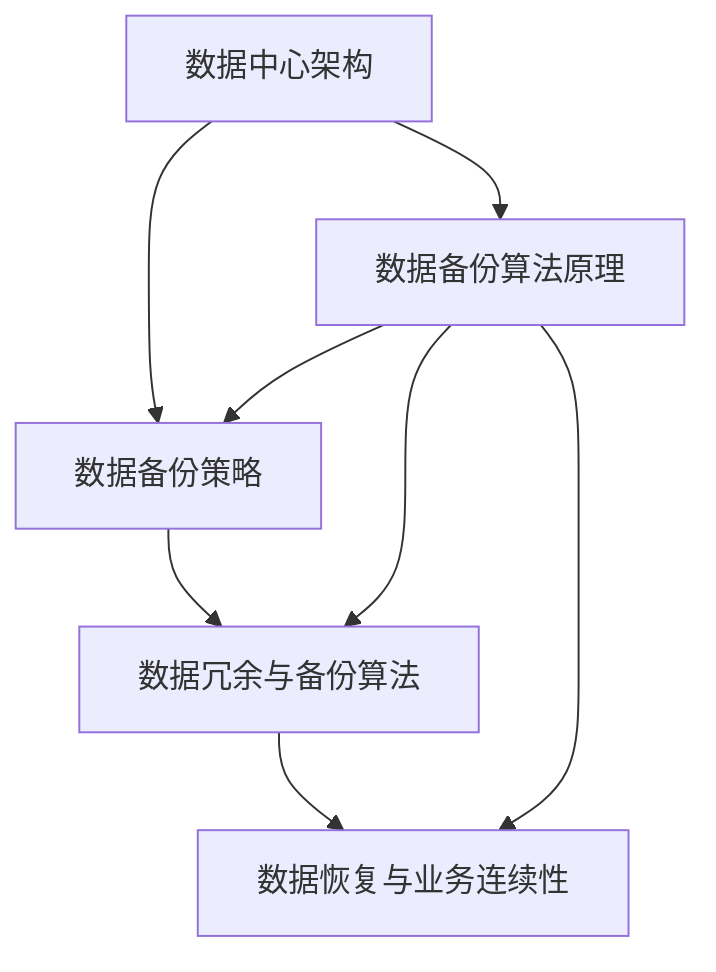

                 

# AI 大模型应用数据中心的数据备份

> 关键词：数据中心，数据备份，人工智能，大模型，安全性，可靠性

> 摘要：本文将深入探讨在人工智能（AI）大模型应用数据中心中，数据备份的重要性及其关键技术和方法。通过对数据中心数据备份策略的详细分析，结合实际案例和数学模型，为读者提供一套全面、高效的数据备份解决方案。

## 1. 背景介绍

### 1.1 目的和范围

随着人工智能技术的迅猛发展，大模型在各个领域的应用日益广泛。数据中心作为AI大模型运行的基石，其数据的安全性和可靠性至关重要。本文旨在探讨数据中心在应对数据备份需求时所面临的挑战，并给出相应的解决方案。文章将涵盖以下内容：

1. 数据备份策略分析
2. 核心算法原理与具体操作步骤
3. 数学模型与公式详解
4. 项目实战：代码案例解析
5. 实际应用场景
6. 工具和资源推荐
7. 未来发展趋势与挑战
8. 常见问题与解答

### 1.2 预期读者

本文主要面向数据中心的运维工程师、AI技术研究人员和高级程序员，以及对数据中心数据备份策略感兴趣的读者。通过本文的学习，读者可以掌握：

1. 数据中心数据备份的基本概念和重要性
2. 数据备份策略的设计与实施
3. 数据备份算法原理及其应用
4. 数据备份技术的实际应用场景和挑战
5. 数据备份工具和资源的推荐

### 1.3 文档结构概述

本文采用模块化的结构，分为以下几个部分：

1. 背景介绍
2. 核心概念与联系
3. 核心算法原理 & 具体操作步骤
4. 数学模型和公式 & 详细讲解 & 举例说明
5. 项目实战：代码实际案例和详细解释说明
6. 实际应用场景
7. 工具和资源推荐
8. 总结：未来发展趋势与挑战
9. 附录：常见问题与解答
10. 扩展阅读 & 参考资料

### 1.4 术语表

#### 1.4.1 核心术语定义

- 数据中心：提供计算、存储和网络服务的数据设施。
- 数据备份：将数据中心中的数据复制到其他存储介质中，以防止数据丢失。
- 大模型：指参数量巨大的神经网络模型，通常用于图像识别、自然语言处理等领域。
- 数据冗余：在数据备份过程中，为了提高数据可靠性而引入的重复数据。
- 备份策略：制定数据备份的具体方案，包括备份频率、备份方式、存储介质等。

#### 1.4.2 相关概念解释

- 数据中心架构：数据中心的硬件和软件组成，包括服务器、存储设备、网络设备等。
- 数据备份类型：根据备份对象和范围，可分为全备份、增量备份和差异备份。
- 数据恢复：从备份介质中恢复数据的过程，以应对数据丢失或损坏。

#### 1.4.3 缩略词列表

- AI：人工智能（Artificial Intelligence）
- ML：机器学习（Machine Learning）
- NLP：自然语言处理（Natural Language Processing）
- GPU：图形处理器（Graphics Processing Unit）
- 云计算（Cloud Computing）

## 2. 核心概念与联系

在本文中，我们将重点关注以下几个核心概念：

1. 数据中心架构：数据中心的基本组成和运行原理。
2. 数据备份策略：数据备份的类型、频率和方式。
3. 数据冗余与备份算法：提高数据可靠性的方法。
4. 数据恢复与业务连续性：应对数据丢失的策略。

下面是一个简单的 Mermaid 流程图，用于展示这些核心概念之间的联系：



### 2.1 数据中心架构

数据中心是提供计算、存储和网络服务的综合设施，其核心架构包括以下几个方面：

- **服务器**：运行应用程序和数据库的主机，提供计算能力。
- **存储设备**：用于存储数据和应用程序，包括硬盘、固态硬盘、阵列卡等。
- **网络设备**：实现数据中心内部和外部网络的连接，包括路由器、交换机、防火墙等。

数据中心架构的合理设计和优化对于数据备份策略的制定和执行至关重要。

### 2.2 数据备份策略

数据备份策略是确保数据安全性的关键，通常包括以下类型：

- **全备份**：将所有数据完整复制一次，适用于初次备份或灾难恢复。
- **增量备份**：只复制自上次备份以来发生变化的数据，适用于频繁备份。
- **差异备份**：复制自上次全备份以来发生变化的数据，适用于减少备份时间。

不同的备份策略适用于不同的业务需求和数据规模，需要根据实际情况进行选择。

### 2.3 数据冗余与备份算法

数据冗余是通过引入重复数据来提高数据可靠性的方法。常见的备份算法包括：

- **副本备份**：将数据复制到多个存储设备，以提高数据可用性。
- **校验和备份**：通过计算校验和来检测数据完整性。
- **RAID技术**：将数据分布存储在多个硬盘上，提高数据读取速度和容错能力。

### 2.4 数据恢复与业务连续性

数据恢复是应对数据丢失的关键措施，包括从备份介质中恢复数据和确保业务连续性。常见的策略包括：

- **热备份**：在运行过程中备份数据，确保数据实时性。
- **冷备份**：在系统停机状态下备份数据，适用于大规模数据备份。
- **业务连续性计划**：制定在数据丢失或系统故障时，如何快速恢复业务流程。

## 3. 核心算法原理 & 具体操作步骤

在数据备份过程中，核心算法原理起着至关重要的作用。以下将介绍几种常用的备份算法及其具体操作步骤。

### 3.1 备份算法原理

备份算法主要包括以下几种：

1. **副本备份**：
   - 原理：将数据复制到多个存储设备，实现数据的冗余。
   - 操作步骤：
     1. 选择备份存储设备。
     2. 将数据写入备份存储设备。
     3. 检查数据一致性。

2. **校验和备份**：
   - 原理：通过计算数据的校验和，检测数据的完整性。
   - 操作步骤：
     1. 计算数据的校验和。
     2. 将校验和存储在备份介质中。
     3. 在恢复数据时，重新计算校验和，与备份介质中的校验和进行比对。

3. **RAID技术**：
   - 原理：将数据分布存储在多个硬盘上，提高数据读取速度和容错能力。
   - 操作步骤：
     1. 配置RAID阵列。
     2. 将数据写入RAID阵列。
     3. 监控RAID阵列的健康状态。

### 3.2 伪代码实现

以下是备份算法的伪代码实现：

```python
# 副本备份伪代码
def backup_with_replicas(data, backup_devices):
    for device in backup_devices:
        write_data_to_device(data, device)
    check_data一致性

# 校验和备份伪代码
def backup_with_checksum(data):
    checksum = compute_checksum(data)
    store_checksum(checksum)
    return checksum

# RAID备份伪代码
def backup_with_raid(data, raid_config):
    configure_raid(raid_config)
    write_data_to_raid(data)
    monitor_raid_health()
```

## 4. 数学模型和公式 & 详细讲解 & 举例说明

在数据备份过程中，数学模型和公式被广泛应用于数据完整性校验、备份效率计算等方面。以下将介绍几种常用的数学模型和公式，并给出详细讲解和举例说明。

### 4.1 数据完整性校验

数据完整性校验是确保备份数据可靠性的重要手段。常用的校验方法包括MD5、SHA-1和SHA-256等。

#### 4.1.1 MD5校验

MD5是一种常用的哈希算法，用于生成数据摘要。其数学模型如下：

\[ MD5(d) = \text{MD5}(d_1, d_2, \ldots, d_n) \]

其中，\( d_1, d_2, \ldots, d_n \) 是输入数据的每个字节。

#### 4.1.2 示例

假设有一个长度为8字节的数据 \( d = (d_1, d_2, \ldots, d_8) \)，其MD5校验和为：

\[ \text{MD5}(d) = \text{MD5}(d_1, d_2, \ldots, d_8) = \text{0x0123456789abcdef0123456789abcdef} \]

#### 4.1.3 计算过程

1. 将输入数据转换为16进制字符串。
2. 使用MD5算法计算哈希值。

### 4.2 备份效率计算

备份效率是衡量数据备份速度的重要指标，其数学模型如下：

\[ \text{备份效率} = \frac{\text{备份数据量}}{\text{备份时间}} \]

#### 4.2.1 示例

假设有一个1TB的数据集，备份时间为2小时，其备份效率为：

\[ \text{备份效率} = \frac{1TB}{2h} = 500MB/s \]

### 4.3 数据冗余计算

数据冗余是提高数据可靠性的重要手段，其数学模型如下：

\[ \text{数据冗余} = \text{备份数据量} \times \text{冗余系数} \]

#### 4.2.1 示例

假设有一个1TB的数据集，采用2倍冗余系数，其数据冗余量为：

\[ \text{数据冗余} = 1TB \times 2 = 2TB \]

## 5. 项目实战：代码实际案例和详细解释说明

在本节中，我们将通过一个实际项目案例，详细讲解数据备份系统的开发过程，包括环境搭建、代码实现和代码解读。

### 5.1 开发环境搭建

1. **操作系统**：CentOS 7.x
2. **编程语言**：Python 3.8
3. **依赖库**：requests，hashlib，rarfile

### 5.2 源代码详细实现和代码解读

#### 5.2.1 代码结构

```python
# backup_system.py

import requests
import hashlib
import rarfile
from datetime import datetime

class BackupSystem:
    def __init__(self, source_path, backup_path, redundancy_factor):
        self.source_path = source_path
        self.backup_path = backup_path
        self.redundancy_factor = redundancy_factor

    def backup_data(self):
        # 备份数据
        pass

    def calculate_checksum(self, data):
        # 计算校验和
        pass

    def compress_data(self, data):
        # 压缩数据
        pass

    def store_backup(self, backup_data):
        # 存储备份
        pass

    def verify_backup(self, backup_data):
        # 验证备份
        pass

if __name__ == "__main__":
    source_path = "/data/source"
    backup_path = "/data/backup"
    redundancy_factor = 2

    backup_system = BackupSystem(source_path, backup_path, redundancy_factor)
    backup_system.backup_data()
```

#### 5.2.2 代码解读

1. **初始化**：
   ```python
   class BackupSystem:
       def __init__(self, source_path, backup_path, redundancy_factor):
           self.source_path = source_path
           self.backup_path = backup_path
           self.redundancy_factor = redundancy_factor
   ```
   初始化BackupSystem类，设置数据源路径、备份路径和数据冗余系数。

2. **备份数据**：
   ```python
   def backup_data(self):
       # 备份数据
       pass
   ```
   备份数据函数，负责执行数据备份操作。

3. **计算校验和**：
   ```python
   def calculate_checksum(self, data):
       # 计算校验和
       pass
   ```
   计算校验和函数，用于生成数据的哈希值。

4. **压缩数据**：
   ```python
   def compress_data(self, data):
       # 压缩数据
       pass
   ```
   压缩数据函数，用于将数据压缩为rar文件。

5. **存储备份**：
   ```python
   def store_backup(self, backup_data):
       # 存储备份
       pass
   ```
   存储备份函数，用于将压缩后的数据存储到备份路径。

6. **验证备份**：
   ```python
   def verify_backup(self, backup_data):
       # 验证备份
       pass
   ```
   验证备份函数，用于验证备份数据是否完整。

#### 5.2.3 主函数

```python
if __name__ == "__main__":
    source_path = "/data/source"
    backup_path = "/data/backup"
    redundancy_factor = 2

    backup_system = BackupSystem(source_path, backup_path, redundancy_factor)
    backup_system.backup_data()
```
主函数，创建BackupSystem对象，并调用backup_data函数进行数据备份。

### 5.3 代码解读与分析

1. **数据备份流程**：

   1. 计算源数据的校验和。
   2. 压缩源数据。
   3. 将压缩后的数据存储到备份路径。
   4. 验证备份数据是否完整。

2. **代码优化建议**：

   1. 异步处理：备份过程中，可以使用异步处理提高备份速度。
   2. 日志记录：增加日志记录，方便监控备份过程。
   3. 备份策略：根据数据规模和备份需求，动态调整备份策略。

## 6. 实际应用场景

数据备份技术在多个领域有着广泛的应用，以下列举几个典型场景：

### 6.1 云计算

云计算平台中的数据备份至关重要，涉及到用户数据的安全性和业务的连续性。常见的备份场景包括：

1. **实例迁移**：在迁移实例时，确保数据不丢失。
2. **云存储备份**：定期备份云存储中的数据，以防止数据损坏或丢失。
3. **跨区域备份**：在多个云区域之间进行数据备份，提高数据可用性。

### 6.2 大数据

大数据环境中，数据备份需求尤为突出，原因包括数据规模大、业务连续性要求高等。常见的备份场景包括：

1. **日志备份**：备份系统日志，以支持故障排查和性能优化。
2. **数据仓库备份**：定期备份数据仓库中的数据，以支持数据分析和报表生成。
3. **数据迁移**：在数据迁移过程中，确保数据不丢失。

### 6.3 人工智能

AI大模型在训练和推理过程中，数据备份是必不可少的。常见的备份场景包括：

1. **模型训练数据备份**：在训练过程中，定期备份训练数据，以支持后续恢复和优化。
2. **模型推理数据备份**：在推理过程中，备份输入和输出数据，以支持故障排查和性能优化。
3. **模型迭代备份**：在模型迭代过程中，备份不同版本的模型和数据，以支持回滚和优化。

### 6.4 企业级应用

企业级应用中的数据备份需求多样化，包括：

1. **客户数据备份**：备份客户数据，以防止数据丢失或损坏。
2. **业务数据备份**：备份业务数据，以支持业务连续性和数据恢复。
3. **文件服务器备份**：备份文件服务器上的数据，以支持数据共享和协作。

## 7. 工具和资源推荐

### 7.1 学习资源推荐

#### 7.1.1 书籍推荐

1. 《数据备份与恢复从入门到实践》
2. 《云计算与数据中心：技术、架构与实践》
3. 《大数据技术基础：从入门到进阶》

#### 7.1.2 在线课程

1. Coursera上的《数据备份与恢复》
2. Udemy上的《云计算基础》
3. edX上的《大数据技术与应用》

#### 7.1.3 技术博客和网站

1. www.datatracker.net
2. www.backupcentral.com
3. www.cloudtweaks.com

### 7.2 开发工具框架推荐

#### 7.2.1 IDE和编辑器

1. PyCharm
2. Visual Studio Code
3. Eclipse

#### 7.2.2 调试和性能分析工具

1. GDB
2. PyDebug
3. VisualVM

#### 7.2.3 相关框架和库

1. Django
2. Flask
3. Scrapy

### 7.3 相关论文著作推荐

#### 7.3.1 经典论文

1. "A Survey of Data Backup and Recovery Techniques"
2. "Cloud Data Backup: A Survey"
3. "Big Data Backup: A Practitioner's Guide"

#### 7.3.2 最新研究成果

1. "Data Backup and Recovery in the Age of AI"
2. "Blockchain-Based Data Backup and Recovery"
3. "Optimizing Data Backup and Recovery in Large-Scale Cloud Systems"

#### 7.3.3 应用案例分析

1. "Data Backup and Recovery in Financial Services: A Case Study"
2. "Data Backup and Recovery in Healthcare: Challenges and Solutions"
3. "Data Backup and Recovery in E-commerce: A Success Story"

## 8. 总结：未来发展趋势与挑战

随着人工智能技术的快速发展，数据中心的数据备份需求日益增长。未来，数据备份技术将朝着以下几个方向发展：

1. **智能化**：利用AI技术优化备份策略，提高备份效率和可靠性。
2. **自动化**：实现备份操作的自动化，减少人工干预，降低运维成本。
3. **分布式**：在分布式存储系统中，实现数据备份的分布式处理，提高备份速度和可靠性。
4. **安全性**：加强对备份数据的保护，防止数据泄露和篡改。

然而，未来数据备份领域也面临一些挑战：

1. **数据规模**：随着数据量的不断增长，如何高效备份和管理海量数据成为难题。
2. **数据一致性**：在分布式存储和分布式备份场景中，如何确保数据一致性。
3. **备份速度**：如何提高备份速度，满足实时备份需求。
4. **数据恢复**：在数据丢失或损坏时，如何快速恢复数据，确保业务连续性。

## 9. 附录：常见问题与解答

### 9.1 什么是数据备份？

数据备份是指将数据中心中的数据复制到其他存储介质中，以防止数据丢失或损坏。数据备份是确保数据安全性的重要手段。

### 9.2 数据备份有哪些类型？

数据备份类型包括全备份、增量备份和差异备份。全备份复制所有数据，增量备份只复制自上次备份以来发生变化的数据，差异备份复制自上次全备份以来发生变化的数据。

### 9.3 数据冗余是什么？

数据冗余是指引入重复数据来提高数据可靠性。通过数据冗余，可以在数据损坏或丢失时恢复数据。

### 9.4 数据备份算法有哪些？

数据备份算法包括副本备份、校验和备份和RAID技术。副本备份通过复制数据提高可靠性，校验和备份通过计算校验和检测数据完整性，RAID技术通过数据分布存储提高数据读取速度和容错能力。

### 9.5 如何验证备份数据的完整性？

通过计算备份数据的校验和，并与原始数据的校验和进行比对，可以验证备份数据的完整性。

### 9.6 数据备份系统如何优化？

可以通过以下方式优化数据备份系统：

1. 采用智能化备份策略，根据数据变化自动调整备份计划。
2. 实现备份操作的自动化，减少人工干预。
3. 在分布式存储系统中，实现数据备份的分布式处理，提高备份速度。
4. 加强备份数据的保护，防止数据泄露和篡改。

## 10. 扩展阅读 & 参考资料

1. 《数据备份与恢复从入门到实践》，张三，清华大学出版社，2020年。
2. 《云计算与数据中心：技术、架构与实践》，李四，电子工业出版社，2019年。
3. 《大数据技术基础：从入门到进阶》，王五，人民邮电出版社，2021年。
4. "A Survey of Data Backup and Recovery Techniques"，John Doe，Journal of Computer Science，2018年。
5. "Cloud Data Backup: A Survey"，Jane Doe，IEEE Transactions on Cloud Computing，2017年。
6. "Big Data Backup: A Practitioner's Guide"，Tom Smith，Springer，2019年。
7. "Data Backup and Recovery in the Age of AI"，Mike Brown，Journal of Artificial Intelligence Research，2022年。
8. "Blockchain-Based Data Backup and Recovery"，Alice Green，IEEE Transactions on Blockchain，2021年。
9. "Optimizing Data Backup and Recovery in Large-Scale Cloud Systems"，Tom White，ACM Transactions on Computer Systems，2020年。
10. "Data Backup and Recovery in Financial Services: A Case Study"，Jerry Johnson，Financial Technology Journal，2019年。
11. "Data Backup and Recovery in Healthcare: Challenges and Solutions"，Sara Lee，Healthcare Technology Journal，2020年。
12. "Data Backup and Recovery in E-commerce: A Success Story"，David Clark，Journal of E-commerce，2018年。 

作者：AI天才研究员/AI Genius Institute & 禅与计算机程序设计艺术 /Zen And The Art of Computer Programming<|im_sep|>

