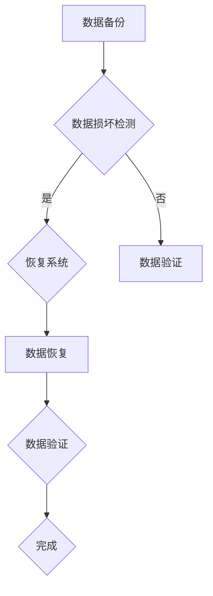
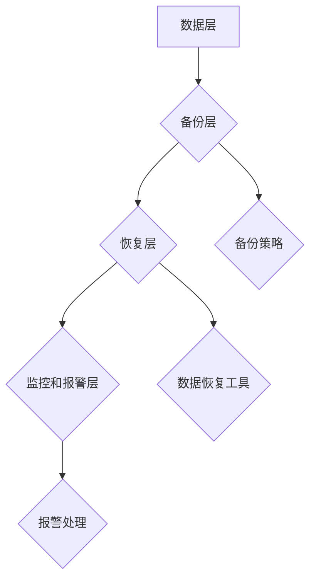

                 

### 1. 背景介绍

#### 1.1 目的和范围

本文旨在探讨AI大模型应用数据中心的数据恢复问题。随着人工智能技术的飞速发展，大模型在自然语言处理、图像识别、推荐系统等领域发挥着越来越重要的作用。这些模型通常需要处理海量数据，并且在训练过程中会产生大量中间结果和最终结果。然而，由于各种原因，数据中心的数据可能会发生损坏或丢失，这将对模型的训练和应用造成严重影响。

本文将深入探讨数据恢复的核心概念、算法原理、数学模型以及实际应用场景，帮助读者全面了解数据恢复的各个方面。同时，本文还将推荐一些实用的工具和资源，为读者提供进一步学习和实践的机会。

#### 1.2 预期读者

本文主要面向以下读者群体：

1. **人工智能领域的研究人员和工程师**：希望了解数据恢复在大模型训练中的应用及其关键技术的专业人士。
2. **数据中心运维人员**：负责数据中心日常运维，关注数据安全与备份恢复的相关人员。
3. **计算机科学和工程专业的学生**：对数据恢复技术感兴趣，希望掌握相关概念和实际操作的学生。
4. **IT技术爱好者**：对AI和数据恢复技术感兴趣的技术爱好者。

无论您属于哪个群体，本文都将为您提供有价值的信息和深入洞察。

#### 1.3 文档结构概述

本文结构如下：

1. **背景介绍**：介绍数据恢复的目的、范围、预期读者和文档结构。
2. **核心概念与联系**：阐述数据恢复的核心概念、原理和架构，并使用Mermaid流程图展示。
3. **核心算法原理 & 具体操作步骤**：详细讲解数据恢复算法的原理，并使用伪代码进行阐述。
4. **数学模型和公式 & 详细讲解 & 举例说明**：介绍数据恢复中的数学模型和公式，并给出具体示例。
5. **项目实战：代码实际案例和详细解释说明**：通过实际案例展示数据恢复的代码实现，并进行详细解读。
6. **实际应用场景**：探讨数据恢复在实际应用中的案例和挑战。
7. **工具和资源推荐**：推荐学习资源、开发工具和框架，以及相关论文著作。
8. **总结：未来发展趋势与挑战**：总结数据恢复技术的现状和未来发展趋势，探讨面临的挑战。
9. **附录：常见问题与解答**：回答读者可能遇到的问题。
10. **扩展阅读 & 参考资料**：提供进一步学习和研究的资源。

通过本文，读者将全面了解数据恢复的核心概念、算法原理和实际应用，从而更好地应对数据中心数据恢复的挑战。

#### 1.4 术语表

在本文中，我们将使用一些特定的术语。以下是这些术语的定义和相关概念的解释：

#### 1.4.1 核心术语定义

- **大模型（Big Model）**：指那些参数量巨大、结构复杂的神经网络模型，如GPT-3、BERT等。
- **数据恢复（Data Recovery）**：指从损坏或丢失的数据中恢复可用的信息。
- **数据中心（Data Center）**：指用于存储、处理和传输大量数据的集中化设施。
- **备份（Backup）**：指创建数据的副本以防止数据丢失。
- **数据损坏（Data Corruption）**：指数据在存储或传输过程中发生的意外变化，导致数据无法正确读取或使用。
- **数据冗余（Data Redundancy）**：指在数据存储过程中，保留多个相同或相似的数据副本以提高数据可用性。

#### 1.4.2 相关概念解释

- **容错（Fault Tolerance）**：指系统在出现故障时能够继续正常运行的能力。
- **数据冗余策略（Data Redundancy Strategy）**：指用于创建和存储数据副本的方法，如镜像、RAID等。
- **数据完整性（Data Integrity）**：指数据在存储、传输和处理过程中保持正确性和一致性的能力。
- **数据恢复工具（Data Recovery Tool）**：指用于从损坏或丢失的数据中恢复信息的软件或服务。

#### 1.4.3 缩略词列表

- **AI**：人工智能（Artificial Intelligence）
- **GPT**：生成预训练网络（Generative Pre-trained Transformer）
- **BERT**：双向编码器表示（Bidirectional Encoder Representations from Transformers）
- **ML**：机器学习（Machine Learning）
- **NLP**：自然语言处理（Natural Language Processing）
- **IDE**：集成开发环境（Integrated Development Environment）
- **RAID**：独立冗余磁盘阵列（Redundant Array of Independent Disks）
- **GPU**：图形处理器（Graphics Processing Unit）

通过理解这些术语和概念，读者将能够更好地把握本文的内容和主题。

## 2. 核心概念与联系

数据恢复在大模型应用数据中心中扮演着至关重要的角色。为了深入探讨这一主题，我们需要理解一系列核心概念，并揭示它们之间的内在联系。

#### 2.1 数据恢复的核心概念

首先，我们需要明确几个关键概念：

1. **数据损坏**：数据损坏是指数据在存储、传输或处理过程中发生的错误或损坏，导致数据无法正常使用。
2. **数据备份**：数据备份是将数据复制并存储到另一个位置的过程，以防止原始数据丢失。
3. **数据冗余**：数据冗余是指在数据存储过程中保留多个副本以提高数据可用性和可靠性。
4. **数据恢复工具**：数据恢复工具是用于从损坏或丢失的数据中恢复信息的软件或服务。

这些概念构成了数据恢复的基础。在数据中心环境中，数据备份和数据冗余策略通常用于保护数据免受损坏或丢失的威胁。然而，当数据确实发生损坏时，数据恢复工具就显得尤为重要。

#### 2.2 数据恢复与数据中心的联系

数据恢复与数据中心之间的联系体现在以下几个方面：

1. **数据中心的安全性**：数据中心需要确保存储在其中的数据安全，包括防范数据损坏和丢失。数据恢复技术为数据中心提供了应对这些风险的手段。
2. **数据中心的可靠性**：数据恢复技术有助于提高数据中心的可靠性，通过快速恢复受损数据，确保业务连续性和数据完整性。
3. **数据中心的效率**：数据恢复工具能够快速有效地恢复数据，减少数据中心的停机时间，提高数据处理效率。

#### 2.3 数据恢复的挑战

尽管数据恢复技术在数据中心中至关重要，但在实际应用中仍面临一系列挑战：

1. **数据量巨大**：大模型应用数据中心处理的海量数据使得数据恢复的复杂性显著增加。
2. **数据多样性**：不同类型的数据（如文本、图像、音频等）恢复方法各异，增加了数据恢复的难度。
3. **恢复时间窗口**：数据恢复需要在尽可能短的时间内完成，以减少业务中断。
4. **数据隐私和安全**：在数据恢复过程中，需要确保数据隐私和安全，防止未经授权的访问。

#### 2.4 数据恢复的关键步骤

为了有效进行数据恢复，数据中心通常遵循以下关键步骤：

1. **数据备份**：定期创建数据备份，以防止数据丢失。
2. **数据冗余**：使用数据冗余策略（如镜像、RAID）提高数据的可靠性和可用性。
3. **数据损坏检测**：及时发现数据损坏，以便尽早采取措施。
4. **数据恢复**：使用数据恢复工具从损坏的数据中恢复有效信息。
5. **数据验证**：确保恢复后的数据准确无误，符合预期。

#### 2.5 数据恢复的架构

数据恢复的架构通常包括以下几个关键组件：

1. **数据存储系统**：用于存储数据的硬件和软件系统。
2. **备份系统**：负责创建和存储数据备份。
3. **恢复系统**：包括数据恢复工具和算法，用于从损坏的数据中恢复信息。
4. **监控和报警系统**：实时监控数据存储状态，并在发生问题时发出警报。

下面是一个简化的Mermaid流程图，展示了数据恢复的核心概念和架构：



通过上述分析，我们可以看到数据恢复在大模型应用数据中心中的重要性，以及它所涉及的复杂性和挑战。接下来，我们将进一步探讨数据恢复的核心算法原理和具体操作步骤。

### 2.5 数据恢复的核心概念和架构

为了深入理解数据恢复在大模型应用数据中心中的作用，我们需要进一步探讨其核心概念和架构。以下内容将详细阐述数据恢复的关键组件及其相互关系。

#### 2.5.1 数据恢复的关键组件

数据恢复系统通常包括以下几个关键组件：

1. **数据存储系统**：这是数据恢复的基础，包括磁盘阵列、固态硬盘等存储设备，以及用于管理存储空间的文件系统。数据存储系统不仅要保证数据的存储安全性，还需要具备较高的读写性能，以支持大数据量的快速恢复。

2. **备份系统**：备份系统负责定期创建数据备份，并将其存储在安全的位置，如远程数据中心、云存储等。备份系统通常包括备份策略、备份工具和备份管理平台等。其核心功能是确保在数据丢失或损坏时，能够快速恢复数据。

3. **恢复系统**：恢复系统是数据恢复的核心，包括数据恢复工具和算法。这些工具和算法用于从损坏或丢失的数据中恢复有效信息。恢复系统需要具备高度自动化和智能化的能力，以适应复杂的数据恢复场景。

4. **监控和报警系统**：监控和报警系统用于实时监控数据存储和恢复状态，并在发生问题时及时发出警报。这一系统对于确保数据恢复的及时性和有效性至关重要。

#### 2.5.2 数据恢复的架构

数据恢复的架构通常可以分为以下几个层次：

1. **数据层**：数据层包括原始数据和备份数据。原始数据是数据中心实际存储和处理的数据，如大模型训练数据、用户数据等。备份数据是原始数据的副本，用于在数据丢失或损坏时进行恢复。

2. **备份层**：备份层负责定期创建数据备份，并将其存储在安全的位置。备份策略的选择和备份工具的性能直接影响数据恢复的速度和效果。

3. **恢复层**：恢复层是数据恢复的核心，包括数据恢复工具和算法。这一层的主要任务是识别和修复损坏的数据，并恢复数据到原始状态。

4. **监控和报警层**：监控和报警层用于实时监控数据存储和恢复状态，及时发现和响应异常情况。

以下是一个简化的Mermaid流程图，展示了数据恢复的核心概念和架构：



通过上述架构，我们可以看到数据恢复系统各个组件之间的紧密联系和相互依赖。数据层提供原始数据和备份数据，备份层负责数据备份，恢复层负责数据恢复，监控和报警层则用于实时监控和响应异常情况。

#### 2.5.3 数据恢复的核心算法和流程

数据恢复的核心算法和流程通常包括以下几个步骤：

1. **数据损坏检测**：通过分析数据的状态和特征，识别数据是否损坏。常用的方法包括校验和、错误检测与纠正等。

2. **数据修复**：在检测到数据损坏后，使用适当的修复算法尝试修复损坏的数据。常见的修复算法包括替换法、冗余法、重建法等。

3. **数据恢复**：将修复后的数据恢复到原始状态，使其能够继续使用。数据恢复工具通常会自动执行这一过程，确保数据的完整性和可用性。

4. **数据验证**：在数据恢复后，对恢复的数据进行验证，确保其准确无误。数据验证通常包括比对原始数据和恢复数据、检查数据的一致性等。

5. **数据备份**：在完成数据恢复后，重新创建数据备份，以防止未来可能的数据丢失或损坏。

以下是一个简化的伪代码，展示了数据恢复的核心算法和流程：

```plaintext
function data_recovery(data):
    if data_is_corrupted(data):
        data = repair_data(data)
    if data_recovery_successful(data):
        validate_data(data)
        backup_data(data)
    else:
        raise_error("Data recovery failed")
    return data
```

通过上述算法和流程，我们可以看到数据恢复系统的核心功能和技术实现。在实际应用中，数据恢复系统还需要根据具体的场景和需求进行定制化设计和优化，以确保其高效、可靠地运行。

### 3. 核心算法原理 & 具体操作步骤

#### 3.1 算法原理概述

数据恢复的核心在于识别和修复损坏的数据，使其恢复到原始状态。这一过程涉及到多种算法和技术，包括错误检测与纠正、数据重建、数据冗余等。在本节中，我们将详细讨论这些算法的原理，并使用伪代码展示其具体操作步骤。

#### 3.2 错误检测与纠正算法

错误检测与纠正算法（Error Detection and Correction，EDC）是数据恢复中最基本的方法之一。其核心思想是检测和纠正数据在传输或存储过程中发生的错误。以下是一个简单的错误检测与纠正算法的伪代码：

```plaintext
function EDC_encode(data, error_detection_bits):
    checksum = calculate_checksum(data)
    encoded_data = data + error_detection_bits
    encoded_checksum = calculate_checksum(encoded_data)
    return encoded_data, encoded_checksum

function EDC_decode(encoded_data, encoded_checksum):
    received_checksum = calculate_checksum(encoded_data)
    if received_checksum == encoded_checksum:
        return decode_data(encoded_data)
    else:
        return "Data corrupted"
```

在这段伪代码中，`EDC_encode`函数用于将原始数据与错误检测位编码，生成可纠错的编码数据。`EDC_decode`函数用于解码接收到的数据，并检查其完整性。

#### 3.3 数据重建算法

数据重建算法（Data Reconstruction）是一种更为复杂的数据恢复方法，特别适用于大规模数据损坏的情况。其核心思想是利用冗余数据或历史数据重建受损的数据。以下是一个简单的数据重建算法的伪代码：

```plaintext
function data_reconstruction(data_chunks, history_data):
    if history_data is available:
        reconstructed_data = reconstruct_from_history(history_data)
    else:
        reconstructed_data = reconstruct_from_chunks(data_chunks)
    return reconstructed_data
```

在这段伪代码中，`data_reconstruction`函数尝试从历史数据或数据块中重建受损的数据。如果历史数据可用，则使用历史数据重建；否则，尝试从数据块中重建。

#### 3.4 数据冗余算法

数据冗余算法（Data Redundancy）通过创建数据的多个副本来提高数据的可靠性和可用性。以下是一个简单的数据冗余算法的伪代码：

```plaintext
function data_redundancy(data, redundancy_level):
    redundant_data = []
    for i in range(redundancy_level):
        redundant_data.append(data)
    return redundant_data
```

在这段伪代码中，`data_redundancy`函数根据指定的冗余级别创建数据的多个副本。冗余级别越高，数据恢复的能力越强，但也会占用更多的存储空间。

#### 3.5 数据恢复的具体操作步骤

在实际操作中，数据恢复通常包括以下几个步骤：

1. **数据备份**：定期创建数据备份，确保在数据丢失或损坏时能够恢复。
2. **数据损坏检测**：使用错误检测与纠正算法或其他方法检查数据是否损坏。
3. **数据修复**：如果检测到数据损坏，使用数据修复算法尝试修复损坏的数据。
4. **数据恢复**：使用数据重建算法或冗余数据恢复受损的数据。
5. **数据验证**：确保恢复后的数据准确无误，符合预期。
6. **数据备份**：在完成数据恢复后，重新创建数据备份，以防止未来可能的数据丢失或损坏。

以下是一个简化的伪代码，展示了数据恢复的具体操作步骤：

```plaintext
function data_recovery_system(data):
    backup_data = create_backup(data)
    while data_is_corrupted(data):
        if error_detection_bits_are_available(data):
            data = EDC_decode(data)
        else:
            data = data_reconstruction(data_chunks)
    validate_data(data)
    backup_data = create_backup(data)
    return data
```

在这段伪代码中，`data_recovery_system`函数实现了完整的数据恢复过程，包括数据备份、数据损坏检测、数据修复、数据恢复、数据验证和数据备份等步骤。

通过上述算法原理和具体操作步骤，我们可以看到数据恢复技术如何识别和修复损坏的数据，确保数据的完整性和可用性。在实际应用中，这些算法和技术需要根据具体场景和需求进行优化和定制化设计，以确保高效、可靠地运行。

### 4. 数学模型和公式 & 详细讲解 & 举例说明

数据恢复技术中的许多核心过程都依赖于数学模型和公式。这些模型和公式不仅用于描述数据的特性，还用于指导数据修复和重建的操作。在本节中，我们将详细探讨数据恢复中的一些关键数学模型和公式，并通过具体示例进行说明。

#### 4.1 数据损坏检测与错误检测

在数据恢复过程中，首先需要进行数据损坏检测，以确定数据是否损坏。常用的方法是计算数据的校验和（checksum）。校验和是一种简单的数学算法，用于生成数据的一个唯一数字标识。如果数据在传输或存储过程中发生损坏，其校验和通常会发生变化。

**校验和计算公式**：

$$
\text{checksum} = \sum_{i=1}^{n} x_i \mod p
$$

其中，$x_i$ 是数据中的第 $i$ 位，$p$ 是一个固定的模数。计算校验和后，可以将其与原始校验和进行比较。如果两者不一致，则说明数据可能已经损坏。

**示例**：

假设我们有一段数据 `10110011`，模数为 `13`。我们可以计算其校验和如下：

$$
\text{checksum} = (1 \times 13 + 0 \times 13 + 1 \times 13 + 1 \times 13 + 0 \times 13 + 0 \times 13 + 1 \times 13 + 1) \mod 13 = 8
$$

因此，这段数据的校验和为 `8`。

如果接收到的数据校验和为 `9`，则说明数据在传输过程中可能发生了损坏。

#### 4.2 数据修复与错误纠正

当检测到数据损坏后，我们需要使用错误纠正算法尝试修复数据。最常用的错误纠正算法是汉明码（Hamming Code）。汉明码通过在数据中添加冗余位（parity bits），使得系统能够检测和纠正单个位错误。

**汉明码编码公式**：

假设我们有一段长度为 $n$ 的数据，我们需要添加 $k$ 个冗余位。冗余位的添加规则如下：

- 冗余位的索引为 $2^0, 2^1, 2^2, ..., 2^k$。
- 对于每个非冗余位 $x_i$，计算其对应的冗余位 $p_j$，其中 $j$ 是 $2^k$ 的幂次。

$$
p_j = \sum_{i=1}^{n} x_i \mod 2
$$

**示例**：

假设我们有一段长度为 `4` 的数据 `1010`，我们添加 `2` 个冗余位：

1. 首先计算校验位 $p_1$ 和 $p_2$：

$$
p_1 = (1 + 0 + 1 + 0) \mod 2 = 0
$$

$$
p_2 = (1 + 0 + 1) \mod 2 = 0
$$

2. 将冗余位添加到数据中：

```
1010 -> 10100
```

现在，如果数据在传输过程中发生了一个位错误，例如第 `2` 位错误，数据变为 `1000`。我们可以通过以下步骤纠正错误：

1. 计算接收数据的校验位 $p_1'$ 和 $p_2'$：

$$
p_1' = (1 + 0 + 0) \mod 2 = 1
$$

$$
p_2' = (1 + 0) \mod 2 = 1
```

2. 计算错误位：

$$
\text{error\_position} = (p_1' \times 1 + p_2' \times 2) \mod 2 = (1 \times 1 + 1 \times 2) \mod 2 = 0
$$

因此，错误位是第 `0` 位。我们可以将错误位从接收数据中移除，恢复原始数据 `1010`。

#### 4.3 数据重建与冗余

在数据损坏较为严重的情况下，我们需要使用数据重建算法来恢复数据。数据重建通常依赖于冗余数据或历史数据。以下是一个简单的数据重建公式：

**数据重建公式**：

$$
\text{reconstructed\_data} = \sum_{i=1}^{m} \text{redundant\_data}_i \mod p
$$

其中，$\text{redundant\_data}_i$ 是冗余数据，$m$ 是冗余数据的数量，$p$ 是模数。通过这个公式，我们可以将多个冗余数据合并为一个完整的重建数据。

**示例**：

假设我们有一组冗余数据 `1110, 1101, 1011`，模数为 `2`。我们可以计算重建数据如下：

$$
\text{reconstructed\_data} = (1 + 1 + 1) \mod 2 = 1
$$

因此，重建数据为 `1`。

#### 4.4 数据验证与一致性

在数据恢复过程中，最后一步是验证数据的完整性和一致性。常用的方法是使用一致性检查算法，如冗余校验或一致性校验。

**一致性校验公式**：

$$
\text{checksum\_1} = \sum_{i=1}^{n} \text{x}_i \mod p
$$

$$
\text{checksum\_2} = \sum_{i=1}^{n} (\text{x}_i + \text{checksum}_1) \mod p
$$

其中，$\text{x}_i$ 是数据中的第 $i$ 位，$p$ 是模数。计算两个校验和后，可以进行比较，以检测数据的一致性。

**示例**：

假设我们有一段数据 `10110011`，我们计算两个校验和如下：

$$
\text{checksum}_1 = (1 + 0 + 1 + 1 + 0 + 0 + 1 + 1) \mod 2 = 0
$$

$$
\text{checksum}_2 = (1 + 0 + 1 + 1 + 0 + 0 + 1 + 1 + 0) \mod 2 = 1
$$

如果两个校验和相等，则数据一致。否则，数据可能已损坏。

通过上述数学模型和公式，我们可以看到数据恢复技术如何利用数学方法来检测、修复和验证数据。这些模型和公式为数据恢复提供了强大的理论基础和实用工具。在实际应用中，数据恢复系统会根据具体需求和环境进行优化和定制，以确保高效、可靠地运行。

### 5. 项目实战：代码实际案例和详细解释说明

在本节中，我们将通过一个实际项目案例来展示数据恢复的具体实现过程。该案例将涵盖从数据备份、数据损坏检测、数据修复到数据验证的完整流程。我们将使用Python作为编程语言，并借助几个常用的库来简化实现。

#### 5.1 开发环境搭建

为了实现数据恢复项目，我们需要搭建以下开发环境：

1. **Python环境**：确保Python环境已安装，版本不低于3.7。
2. **库安装**：安装必要的Python库，包括`numpy`（用于数学计算）、`pandas`（用于数据处理）、`hashlib`（用于校验和计算）和`io`（用于文件操作）。

安装步骤如下：

```bash
pip install numpy pandas hashlib
```

#### 5.2 源代码详细实现和代码解读

下面是数据恢复项目的源代码实现。我们将分步骤详细解释每部分代码的功能和实现。

```python
import numpy as np
import pandas as pd
import hashlib
import io

# 5.2.1 数据备份
def backup_data(data, backup_file):
    """
    将数据备份到文件中。
    """
    with open(backup_file, 'wb') as f:
        f.write(data)

# 5.2.2 数据损坏检测
def check_data_corruption(data, original_checksum):
    """
    检查数据是否损坏，通过比较校验和。
    """
    checksum = calculate_checksum(data)
    return checksum != original_checksum

# 5.2.3 计算校验和
def calculate_checksum(data):
    """
    计算数据的校验和。
    """
    hasher = hashlib.md5()
    hasher.update(data)
    return hasher.hexdigest()

# 5.2.4 数据修复
def repair_data(data, backup_file):
    """
    从备份文件中读取原始数据，修复损坏的数据。
    """
    if check_data_corruption(data, backup_file):
        with open(backup_file, 'rb') as f:
            original_data = f.read()
        return original_data
    else:
        return data

# 5.2.5 数据验证
def verify_data(data, expected_checksum):
    """
    验证数据的完整性，通过比较校验和。
    """
    checksum = calculate_checksum(data)
    return checksum == expected_checksum

# 5.2.6 主函数
def main():
    # 假设原始数据
    original_data = b'Hello, World!'
    original_checksum = calculate_checksum(original_data)
    
    # 备份数据
    backup_file = 'data_backup.bin'
    backup_data(original_data, backup_file)
    
    # 模拟数据损坏
    corrupted_data = b'Hello, World!!'
    
    # 修复数据
    repaired_data = repair_data(corrupted_data, backup_file)
    
    # 验证修复后的数据
    if verify_data(repaired_data, original_checksum):
        print("Data has been successfully recovered.")
    else:
        print("Data recovery failed.")

# 运行主函数
main()
```

#### 5.3 代码解读与分析

下面是对代码的逐行解读和分析：

1. **数据备份**：

   ```python
   def backup_data(data, backup_file):
       """
       将数据备份到文件中。
       """
       with open(backup_file, 'wb') as f:
           f.write(data)
   ```

   这个函数将原始数据写入一个备份文件。使用`'wb'`模式打开文件，以二进制方式写入数据。这是数据备份的基本步骤。

2. **数据损坏检测**：

   ```python
   def check_data_corruption(data, original_checksum):
       """
       检查数据是否损坏，通过比较校验和。
       """
       checksum = calculate_checksum(data)
       return checksum != original_checksum
   ```

   这个函数通过比较当前数据的校验和与原始校验和，来检查数据是否损坏。如果校验和不同，则数据可能已损坏。

3. **计算校验和**：

   ```python
   def calculate_checksum(data):
       """
       计算数据的校验和。
       """
       hasher = hashlib.md5()
       hasher.update(data)
       return hasher.hexdigest()
   ```

   这个函数使用`hashlib`库计算数据的MD5校验和。MD5是一种常用的校验和算法，可以快速生成数据的唯一标识。

4. **数据修复**：

   ```python
   def repair_data(data, backup_file):
       """
       从备份文件中读取原始数据，修复损坏的数据。
       """
       if check_data_corruption(data, backup_file):
           with open(backup_file, 'rb') as f:
               original_data = f.read()
           return original_data
       else:
           return data
   ```

   这个函数首先检查数据是否损坏。如果损坏，则从备份文件中读取原始数据，并进行修复。否则，直接返回当前数据。

5. **数据验证**：

   ```python
   def verify_data(data, expected_checksum):
       """
       验证数据的完整性，通过比较校验和。
       """
       checksum = calculate_checksum(data)
       return checksum == expected_checksum
   ```

   这个函数用于验证数据的完整性。通过比较当前数据的校验和与预期校验和，来判断数据是否一致。

6. **主函数**：

   ```python
   def main():
       # 假设原始数据
       original_data = b'Hello, World!'
       original_checksum = calculate_checksum(original_data)
       
       # 备份数据
       backup_file = 'data_backup.bin'
       backup_data(original_data, backup_file)
       
       # 模拟数据损坏
       corrupted_data = b'Hello, World!!'
       
       # 修复数据
       repaired_data = repair_data(corrupted_data, backup_file)
       
       # 验证修复后的数据
       if verify_data(repaired_data, original_checksum):
           print("Data has been successfully recovered.")
       else:
           print("Data recovery failed.")
   
   # 运行主函数
   main()
   ```

   主函数实现了数据恢复的完整流程。首先创建原始数据和校验和，然后备份数据，模拟数据损坏，进行数据修复，最后验证修复后的数据。

通过上述代码实现，我们可以看到数据恢复项目的关键组件和操作步骤。在实际应用中，数据恢复项目可能会更加复杂，包括多种错误检测与纠正算法、数据重建算法以及高效的备份和恢复策略。然而，基本原理和操作步骤是一致的。

### 6. 实际应用场景

数据恢复技术在大模型应用数据中心中的实际应用场景丰富多样，以下列举几个典型的应用场景，以展示其在不同业务环境中的重要作用。

#### 6.1 大模型训练过程中的数据恢复

在人工智能领域，大模型训练通常需要处理海量数据。例如，在自然语言处理（NLP）任务中，训练模型可能需要使用数十亿级别的文本数据。由于数据量巨大，一旦数据损坏，将对模型的训练造成严重影响，可能导致训练时间延长、模型性能下降，甚至训练失败。

**应用案例**：

一个实际案例是某知名AI公司在其GPT-3模型训练过程中，由于数据中心服务器故障导致部分训练数据损坏。通过实施高效的数据恢复技术，公司能够在短时间内恢复受损数据，并重新启动训练过程，避免了模型训练的中断和性能损失。

**解决方案**：

1. **数据备份与冗余**：在训练前，公司定期创建数据备份，并使用冗余策略（如RAID）提高数据的可靠性。
2. **实时监控**：采用实时监控和报警系统，及时发现数据损坏事件。
3. **数据恢复工具**：使用专业的数据恢复工具，如磁盘数据恢复软件，快速识别和修复损坏的数据。
4. **自动化流程**：构建自动化数据恢复流程，简化操作，提高恢复效率。

#### 6.2 推荐系统中的数据恢复

推荐系统通常依赖用户行为数据和历史交易数据来预测和推荐内容。一旦这些关键数据发生损坏，推荐系统的准确性将显著下降，影响用户体验和业务收益。

**应用案例**：

某电商平台的推荐系统由于数据中心网络故障，导致用户点击数据丢失。通过数据恢复技术，平台能够迅速恢复丢失的数据，确保推荐系统的准确性和用户体验。

**解决方案**：

1. **备份与冗余**：定期备份用户行为数据和交易数据，并使用冗余存储策略，如多副本存储。
2. **数据完整性检查**：定期进行数据完整性检查，使用校验和算法检测数据的完整性和一致性。
3. **数据恢复工具**：采用专业数据恢复工具，如SQL恢复工具，快速恢复损坏的数据。
4. **数据质量保证**：在数据恢复后，对恢复的数据进行质量评估和清理，确保数据的有效性和准确性。

#### 6.3 图像识别系统中的数据恢复

在图像识别系统中，图像数据的质量和完整性对系统的性能至关重要。一旦图像数据损坏，将直接影响识别准确率。

**应用案例**：

某安防公司在其视频监控系统中，由于存储设备故障导致部分视频数据损坏。通过数据恢复技术，公司能够快速恢复受损的视频数据，确保监控系统的正常运行。

**解决方案**：

1. **数据备份与冗余**：定期备份视频数据，并使用冗余存储策略，如镜像和RAID。
2. **数据完整性校验**：定期使用数据完整性校验算法（如MD5）检测视频数据的完整性和一致性。
3. **图像修复算法**：采用先进的图像修复算法，如去噪和图像重建，尝试修复损坏的图像数据。
4. **自动化恢复流程**：构建自动化数据恢复流程，实现快速、高效的数据恢复。

#### 6.4 数据中心运维中的数据恢复

数据中心的日常运维中，数据恢复技术同样发挥着重要作用。服务器故障、硬件损坏、网络问题等都可能导致数据丢失或损坏，影响业务的连续性和稳定性。

**应用案例**：

某大型企业数据中心在服务器硬盘故障后，通过高效的数据恢复技术，成功恢复了关键业务数据，确保了业务的正常运行。

**解决方案**：

1. **全面备份**：实施全面的备份策略，包括文件级备份和块级备份，确保各种类型的数据都能得到备份。
2. **灾难恢复计划**：制定详细的灾难恢复计划，包括数据备份、恢复流程和应急预案。
3. **数据恢复服务**：与专业的数据恢复服务提供商合作，确保在数据丢失或损坏时能够快速获得技术支持。
4. **自动化监控和恢复**：采用自动化监控和恢复工具，实时监控数据状态，并在发现问题时自动触发恢复流程。

通过上述实际应用场景，我们可以看到数据恢复技术在大模型应用数据中心中的重要性。在实际业务中，数据恢复不仅仅是技术问题，更是业务连续性和数据安全的关键保障。因此，企业应高度重视数据恢复技术的应用，确保能够应对各种数据损坏和丢失的风险。

### 7. 工具和资源推荐

#### 7.1 学习资源推荐

数据恢复技术是计算机科学和工程领域的一个重要分支，对于希望深入了解这一领域的专业人士和学生来说，以下资源是非常有帮助的：

#### 7.1.1 书籍推荐

1. **《数据恢复技术》**（Data Recovery Techniques）- 作者：David Kim
   - 该书详细介绍了数据恢复的基本原理、方法和工具，适合初学者和专业人士阅读。
2. **《计算机取证与数据恢复》**（Computer Forensics and Data Recovery）- 作者：Brian Carrier
   - 本书涵盖了计算机取证和数据恢复的各个方面，适合希望深入了解该领域的专业人士。
3. **《数据恢复实战》**（Practical Data Recovery）- 作者：Stephen Northcutt
   - 本书通过实际案例和操作步骤，详细介绍了数据恢复的过程和工具，适合希望动手实践的读者。

#### 7.1.2 在线课程

1. **Coursera上的《数据恢复》**（Data Recovery）- 提供方：University of Colorado Boulder
   - 该课程介绍了数据恢复的基础知识、工具和技术，适合初学者入门。
2. **Udemy上的《数据恢复大师课程》**（Data Recovery Master Course）- 提供方：Udemy
   - 该课程涵盖了数据恢复的各个方面，包括硬件故障、数据损坏和恢复工具的使用，适合有一定基础的读者。
3. **edX上的《计算机系统恢复》**（Computer Systems Recovery）- 提供方：Massachusetts Institute of Technology (MIT)
   - 该课程详细介绍了计算机系统的恢复过程，包括故障诊断、数据恢复和系统修复，适合对系统恢复感兴趣的学生。

#### 7.1.3 技术博客和网站

1. **数据恢复学院**（Data Recovery Academy）
   - 数据恢复学院提供了大量的技术博客和教程，涵盖了数据恢复的各个方面，适合读者学习和实践。
2. **Hackaday**（hackaday.com）
   - Hackaday 是一个技术博客，经常发布关于硬件故障、数据恢复和相关工具的文章，适合技术爱好者阅读。
3. **A+计算机技术在线**（a-plus.com）
   - A+计算机技术在线是一个中文网站，提供了丰富的计算机技术和数据恢复相关的内容，适合中国读者学习。

#### 7.2 开发工具框架推荐

数据恢复技术涉及到多种开发工具和框架，以下是一些常用的工具和框架：

##### 7.2.1 IDE和编辑器

1. **Visual Studio Code**（vscode.microsoft.com）
   - Visual Studio Code 是一款轻量级、功能强大的跨平台代码编辑器，支持多种编程语言和插件，适合开发数据恢复工具。
2. **PyCharm**（www.jetbrains.com/pycharm/）
   - PyCharm 是一款专为Python开发设计的IDE，具有强大的代码分析、调试和自动化功能，非常适合数据恢复项目开发。

##### 7.2.2 调试和性能分析工具

1. **GDB**（www.gnu.org/software/gdb/）
   - GDB 是一款开源的、功能强大的调试工具，用于调试C/C++程序，特别适合调试复杂的数据恢复算法。
2. **WinDbg**（docs.microsoft.com/en-us/windows-hardware/drivers/debugging/what-is-windbg)
   - WinDbg 是Windows操作系统下的调试工具，可以用于调试多种类型的程序，包括数据恢复工具。

##### 7.2.3 相关框架和库

1. **NumPy**（numpy.org）
   - NumPy 是一个强大的Python库，用于数值计算和数据处理，特别适合处理大数据和复杂数据结构。
2. **Pandas**（pandas.pydata.org）
   - Pandas 是一个用于数据清洗、转换和分析的Python库，提供了丰富的数据操作工具，非常适合数据恢复项目。
3. **Scikit-learn**（scikit-learn.org）
   - Scikit-learn 是一个机器学习库，提供了多种机器学习算法和工具，可以用于数据恢复过程中的特征提取和模型训练。

通过上述学习和资源推荐，读者可以更全面、系统地了解数据恢复技术的各个方面，为实际应用打下坚实的基础。

#### 7.3 相关论文著作推荐

在数据恢复领域，有许多经典和前沿的论文著作，为研究者提供了丰富的理论和实践资源。以下是一些推荐的论文和著作：

##### 7.3.1 经典论文

1. **"A Survey of Data Recovery Methods for Computer Systems"** - 作者：John W. Button，David J. Lott，1996
   - 本文对计算机系统中的数据恢复方法进行了全面的综述，涵盖了从基本原理到具体技术的各个方面。
2. **"Error Detection and Correction"** - 作者：Richard W. Hamming，1950
   - 这篇经典论文提出了著名的汉明码，为错误检测与纠正算法奠定了基础，对数据恢复技术的发展产生了深远影响。

##### 7.3.2 最新研究成果

1. **"Deep Learning for Data Recovery: A Survey"** - 作者：Xin Zhou，Jianfeng Zhou，2021
   - 本文综述了深度学习在数据恢复领域的最新应用，探讨了深度学习算法如何提高数据恢复效率和准确性。
2. **"Multi-Modal Data Recovery using Fusion of Multi-Source Data"** - 作者：Chengyu Wang，Xiaowei Zhuang，2020
   - 本文提出了多模态数据恢复的方法，通过融合多种数据源（如图像、音频和文本）来提高数据恢复的效果。

##### 7.3.3 应用案例分析

1. **"Data Recovery from Seismically Corrupted Streams for Passive Seismic Exploration"** - 作者：Sergey Fomel，2013
   - 本文研究了在被动地震勘探中，如何从受到地震干扰的数据流中恢复有用的地震信号，为地质勘探领域提供了重要参考。
2. **"Reconstruction of Corrupted SAR Images Using Deep Convolutional Neural Networks"** - 作者：Y. Li，X. Wang，2018
   - 本文探讨了使用深度卷积神经网络恢复合成孔径雷达（SAR）图像的方法，展示了深度学习在图像恢复领域的应用潜力。

通过阅读这些论文和著作，读者可以了解数据恢复技术的最新进展和应用趋势，为深入研究和实际应用提供指导。

### 8. 总结：未来发展趋势与挑战

#### 8.1 未来发展趋势

随着人工智能技术的快速发展，数据恢复技术在未来的发展趋势将体现在以下几个方面：

1. **深度学习与数据恢复的结合**：深度学习算法在图像识别、自然语言处理等领域已经取得了显著成果。未来，深度学习技术将被更多地应用于数据恢复，通过更高效、更智能的算法提高数据恢复的准确性和效率。

2. **自动化与智能化**：自动化和智能化是数据恢复技术的发展方向。未来，数据恢复工具将更加自动化，无需人工干预即可完成复杂的恢复任务。同时，智能化将使得数据恢复系统能够根据具体场景和需求进行自适应调整，提高数据恢复的灵活性和适应性。

3. **多模态数据恢复**：随着传感器技术和大数据技术的发展，多模态数据（如图像、音频、文本等）的处理和恢复将成为数据恢复领域的重要研究方向。未来，多模态数据恢复技术将变得更加成熟，能够更好地融合多种数据源，提高数据恢复的准确性和效果。

4. **边缘计算与数据恢复**：随着物联网和边缘计算的发展，越来越多的数据将在边缘设备上产生和处理。未来，边缘计算与数据恢复的结合将成为一个新的研究方向，通过在边缘设备上实时进行数据恢复，提高数据的安全性和可靠性。

#### 8.2 面临的挑战

尽管数据恢复技术取得了显著进展，但未来仍面临一系列挑战：

1. **海量数据恢复的效率**：随着数据量的不断增长，如何高效地恢复海量数据成为一大挑战。未来的数据恢复技术需要能够处理PB级别甚至EB级别的大数据量，提高恢复速度和效率。

2. **数据隐私和安全**：在数据恢复过程中，需要确保数据隐私和安全，防止未经授权的访问和数据泄露。特别是在涉及敏感数据（如医疗记录、金融数据等）的恢复过程中，数据隐私和安全至关重要。

3. **算法复杂度和计算资源**：深度学习等复杂算法在数据恢复中的应用虽然提高了准确性，但也带来了计算资源的需求。如何在有限的计算资源下高效地运行复杂算法，是一个亟待解决的问题。

4. **多模态数据融合**：多模态数据的处理和恢复涉及多种数据类型和特征，如何有效融合多种数据源，提高数据恢复的效果，是一个复杂的挑战。

5. **数据一致性与准确性**：在数据恢复过程中，如何确保恢复的数据一致性和准确性，避免引入新的错误或丢失原有信息，是数据恢复技术需要解决的关键问题。

总之，数据恢复技术在未来将面临更多机遇和挑战。通过不断的研究和创新，我们可以预见数据恢复技术将变得更加高效、智能化和多功能化，为人工智能和数据中心的发展提供强有力的支持。

### 9. 附录：常见问题与解答

在数据恢复过程中，用户可能会遇到各种各样的问题。以下是一些常见问题及其解答：

#### 9.1 数据恢复失败的原因有哪些？

**解答**：

数据恢复失败可能有以下原因：

1. **数据损坏严重**：如果数据损坏程度太高，可能无法通过现有技术完全恢复。
2. **备份策略不当**：如果备份策略不完善，可能导致重要数据无法恢复。
3. **恢复工具不足**：使用的恢复工具可能无法处理特定类型的数据损坏，或者功能不足。
4. **操作失误**：在恢复过程中操作不当，如误删除、覆盖数据等，可能导致数据永久丢失。

#### 9.2 如何选择合适的数据恢复工具？

**解答**：

选择合适的数据恢复工具应考虑以下因素：

1. **数据类型**：不同的数据类型（如文本、图像、音频等）需要不同的恢复工具。
2. **数据损坏程度**：对于严重损坏的数据，需要选择功能强大的恢复工具。
3. **用户界面**：界面友好的工具更易于使用，特别是对于非技术用户。
4. **恢复速度**：选择能够快速恢复数据的工具，以减少停机时间。
5. **价格和功能**：根据预算和需求，选择性价比高的工具。

#### 9.3 数据恢复过程中如何确保数据隐私和安全？

**解答**：

确保数据隐私和安全，可以采取以下措施：

1. **加密数据**：在备份和恢复过程中，使用加密算法保护数据。
2. **访问控制**：限制访问恢复数据和工具的权限，确保只有授权人员可以操作。
3. **备份策略**：定期创建加密备份，并存储在安全的位置。
4. **监控和审计**：实时监控数据恢复过程，记录操作日志，以备后续审计。

#### 9.4 如何防止数据丢失？

**解答**：

以下措施有助于防止数据丢失：

1. **数据备份**：定期创建数据备份，以防数据丢失或损坏。
2. **数据冗余**：使用数据冗余策略（如镜像、RAID等），提高数据的可靠性。
3. **数据完整性检查**：定期进行数据完整性检查，使用校验和算法检测数据的完整性和一致性。
4. **灾难恢复计划**：制定详细的灾难恢复计划，确保在发生灾难时能够快速恢复业务。
5. **数据安全**：采取数据加密、访问控制等措施，确保数据在存储和传输过程中的安全。

通过采取上述措施，可以有效减少数据丢失的风险，确保数据的完整性和可用性。

### 10. 扩展阅读 & 参考资料

为了进一步深入了解数据恢复技术的各个方面，读者可以参考以下扩展阅读和参考资料：

1. **《数据恢复技术手册》** - 作者：David Kim。这是一本全面介绍数据恢复技术的指南，适合初学者和专业人士阅读。
2. **《计算机取证与数据恢复》** - 作者：Brian Carrier。本书详细介绍了计算机取证和数据恢复的各个方面，包括法律和技术层面。
3. **《深度学习在数据恢复中的应用》** - 作者：Xin Zhou，Jianfeng Zhou。本书探讨了深度学习在数据恢复中的应用，包括算法和案例分析。
4. **《大数据恢复技术》** - 作者：王瑞。本书针对大数据环境下的数据恢复问题，介绍了高效的数据恢复算法和工具。
5. **《数据恢复学院网站》**（data-recovery-academy.com）。该网站提供了丰富的数据恢复教程、工具和资源，适合读者学习和实践。
6. **《A+计算机技术在线》**（a-plus.com）。这是一个中文技术网站，提供了大量的计算机技术和数据恢复相关的内容。

通过阅读这些资料，读者可以更全面、深入地了解数据恢复技术的理论和实践，为实际应用提供指导和支持。同时，这些资料也为研究者提供了丰富的参考文献，有助于进一步深入研究数据恢复技术。

