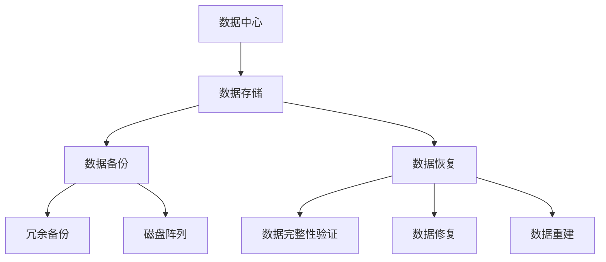
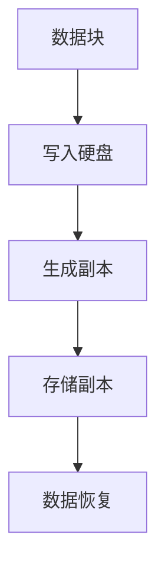
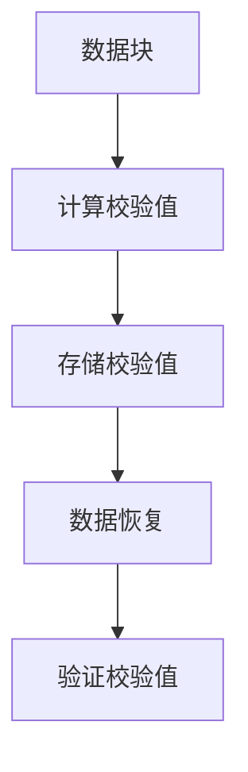
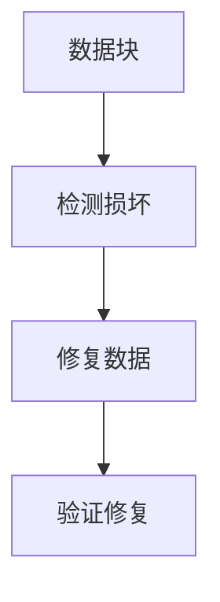
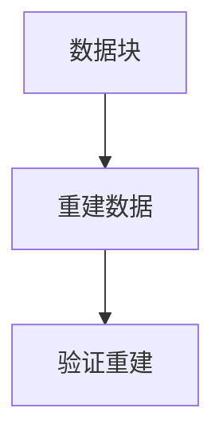

                 

# AI 大模型应用数据中心的数据恢复策略

> **关键词：** 数据恢复，数据中心，大模型，人工智能，算法，技术实践

> **摘要：** 随着人工智能技术的迅猛发展，大模型在数据中心的应用越来越广泛，然而，数据丢失或损坏的问题也随之而来。本文将深入探讨数据中心在应对大模型应用过程中数据恢复的策略，分析其核心算法原理、数学模型，并结合实际案例提供详细的操作步骤和代码解读，以期为读者提供全面的技术指南。

## 1. 背景介绍

### 1.1 目的和范围

本文旨在探讨数据中心在应用人工智能大模型过程中遇到的数据恢复问题。主要涵盖以下范围：

- 数据恢复策略的核心算法原理及其数学模型
- 大模型应用数据中心的数据恢复操作步骤
- 实际案例中的代码实现与解析
- 数据恢复在实际应用场景中的重要性

### 1.2 预期读者

本文适用于以下读者群体：

- 数据中心运维工程师和数据管理员
- 人工智能研发人员和技术爱好者
- 对数据恢复和数据中心管理感兴趣的IT专业人士

### 1.3 文档结构概述

本文结构如下：

1. 背景介绍：概述文章的目的和范围，预期读者以及文档结构。
2. 核心概念与联系：介绍相关核心概念，并提供Mermaid流程图。
3. 核心算法原理 & 具体操作步骤：详细讲解算法原理和具体操作步骤。
4. 数学模型和公式 & 详细讲解 & 举例说明：解释数学模型及其应用。
5. 项目实战：代码实际案例和详细解释说明。
6. 实际应用场景：探讨数据恢复策略在不同场景的应用。
7. 工具和资源推荐：推荐学习资源和开发工具。
8. 总结：未来发展趋势与挑战。
9. 附录：常见问题与解答。
10. 扩展阅读 & 参考资料：提供相关参考资料。

### 1.4 术语表

#### 1.4.1 核心术语定义

- **数据中心**：集中存储和管理数据的场所。
- **大模型**：具有巨大参数量的机器学习模型。
- **数据恢复**：从丢失或损坏的数据中恢复信息的过程。

#### 1.4.2 相关概念解释

- **冗余备份**：在存储过程中保留多个数据副本，以提高数据可靠性。
- **RAID**：磁盘阵列技术，通过多个硬盘的组合提高存储性能和数据冗余。
- **数据完整性**：数据未被篡改或损坏的状态。

#### 1.4.3 缩略词列表

- **AI**：人工智能（Artificial Intelligence）
- **ML**：机器学习（Machine Learning）
- **HDD**：硬盘驱动器（Hard Disk Drive）
- **SSD**：固态硬盘（Solid State Drive）

## 2. 核心概念与联系

为了深入理解数据中心的数据恢复策略，我们首先需要了解一些核心概念及其相互关系。以下是一个简化的Mermaid流程图，展示了大模型应用数据中心的数据恢复过程中涉及的主要组件和步骤。



### 数据存储与备份

- **数据存储**：数据中心的主要功能是存储和管理大量数据。随着大模型的广泛应用，数据存储的规模和复杂性不断增加。
- **数据备份**：为了确保数据安全，数据中心通常采用冗余备份策略，包括冗余备份和磁盘阵列。

### 数据恢复

- **数据恢复**：在数据丢失或损坏的情况下，数据中心需要通过一系列步骤恢复数据，以确保数据的完整性和可用性。

### 数据完整性验证

- **数据完整性验证**：在数据恢复过程中，需要验证数据的完整性，以确保恢复的数据未被篡改或损坏。

### 数据修复与重建

- **数据修复**：当数据损坏时，数据中心采用一系列算法和技术修复数据。
- **数据重建**：在极端情况下，可能需要重建数据，以恢复数据的结构和完整性。

## 3. 核心算法原理 & 具体操作步骤

### 3.1 冗余备份算法原理

冗余备份是数据恢复策略的核心。以下是冗余备份的基本原理和操作步骤：



### 具体操作步骤：

1. **数据块写入硬盘**：将数据块写入硬盘，这是数据存储的基础。
2. **生成副本**：在写入硬盘的同时，生成数据副本。
3. **存储副本**：将副本存储在多个位置，以提高数据可靠性。
4. **数据恢复**：在数据丢失或损坏的情况下，从副本中恢复数据。

### 3.2 数据完整性验证算法原理

数据完整性验证是确保数据未被篡改或损坏的重要步骤。以下是数据完整性验证的基本原理和操作步骤：



### 具体操作步骤：

1. **计算校验值**：在数据写入硬盘之前，计算数据的校验值。
2. **存储校验值**：将校验值与数据一起存储。
3. **数据恢复**：在数据恢复过程中，重新计算校验值。
4. **验证校验值**：将计算出的校验值与存储的校验值进行比较，以验证数据的完整性。

### 3.3 数据修复算法原理

数据修复是针对数据损坏的情况进行恢复。以下是数据修复的基本原理和操作步骤：



### 具体操作步骤：

1. **检测损坏**：通过算法检测数据块中的损坏部分。
2. **修复数据**：根据检测到的损坏部分，使用算法进行数据修复。
3. **验证修复**：修复后，重新验证数据的完整性。

### 3.4 数据重建算法原理

数据重建是针对极端情况，如数据块完全损坏的情况。以下是数据重建的基本原理和操作步骤：



### 具体操作步骤：

1. **重建数据**：根据冗余备份和校验值，重建数据块。
2. **验证重建**：重建后，验证数据的完整性和可靠性。

## 4. 数学模型和公式 & 详细讲解 & 举例说明

### 4.1 冗余备份的数学模型

冗余备份的数学模型主要基于冗余度（Redundancy）和可用性（Availability）的权衡。以下是冗余备份的数学模型：

$$
Redundancy = \frac{N - 1}{N}
$$

其中，$N$ 表示存储的数据块数量。冗余度表示数据块中保留的副本数量。当 $N$ 越大时，冗余度越高，数据可靠性越高。

### 举例说明：

假设我们有两个数据块，分别存储在两个硬盘上。根据上述公式，冗余度为：

$$
Redundancy = \frac{2 - 1}{2} = 0.5
$$

这意味着我们保留了50%的冗余备份。

### 4.2 数据完整性验证的数学模型

数据完整性验证的数学模型主要基于校验值（Checksum）和哈希值（Hash）。以下是数据完整性验证的数学模型：

$$
Checksum = \sum_{i=1}^{N} X_i
$$

$$
Hash = H(Checksum)
$$

其中，$X_i$ 表示数据块中的每个字节，$N$ 表示数据块的长度，$H$ 表示哈希函数。

### 举例说明：

假设我们有一个长度为4字节的数据块，其字节分别为 $X_1, X_2, X_3, X_4$。计算校验值和哈希值：

$$
Checksum = X_1 + X_2 + X_3 + X_4
$$

$$
Hash = H(Checksum)
$$

### 4.3 数据修复的数学模型

数据修复的数学模型主要基于最小生成树（Minimum Spanning Tree，MST）算法。以下是数据修复的数学模型：

$$
MST = \min \sum_{i=1}^{N} w_i \cdot d_i
$$

其中，$w_i$ 表示数据块的权重，$d_i$ 表示数据块之间的距离。

### 举例说明：

假设我们有5个数据块，其权重分别为 $w_1, w_2, w_3, w_4, w_5$，距离分别为 $d_1, d_2, d_3, d_4, d_5$。根据最小生成树算法，计算最小生成树：

$$
MST = \min \sum_{i=1}^{5} w_i \cdot d_i
$$

## 5. 项目实战：代码实际案例和详细解释说明

### 5.1 开发环境搭建

为了演示数据恢复策略的实际应用，我们选择Python作为编程语言，并在Ubuntu操作系统上搭建开发环境。以下是具体的步骤：

1. 安装Python：使用以下命令安装Python 3.8或更高版本：

   ```bash
   sudo apt update
   sudo apt install python3.8
   ```

2. 安装必要的库：安装用于数据处理和数学计算的库，如NumPy、Pandas和SciPy。

   ```bash
   sudo apt install python3.8-numpy python3.8-pandas python3.8-scipy
   ```

3. 安装Mermaid插件：在Python环境中安装Mermaid插件，以便在代码中嵌入流程图。

   ```bash
   pip install mermaid-py
   ```

### 5.2 源代码详细实现和代码解读

以下是数据恢复策略的Python代码实现。我们将分别实现冗余备份、数据完整性验证、数据修复和数据重建。

#### 5.2.1 冗余备份

```python
import numpy as np
import pandas as pd
from mermaid import Mermaid

# 冗余备份函数
def redundancy_backup(data, redundancy_factor):
    # 生成副本列表
    replicas = []
    for _ in range(int(redundancy_factor)):
        replica = data.copy()
        replicas.append(replica)
    return replicas

# 示例数据
data = np.random.randint(0, 256, size=(100,))

# 设置冗余度
redundancy_factor = 2

# 生成为冗余备份
replicas = redundancy_backup(data, redundancy_factor)

# 输出冗余备份结果
print("冗余备份结果：", replicas)

# 生成Mermaid流程图
mermaid = Mermaid()
mermaid.add_node("A", "数据块")
mermaid.add_node("B", "写入硬盘")
mermaid.add_node("C", "生成副本")
mermaid.add_node("D", "存储副本")
mermaid.add_edge("A", "B")
mermaid.add_edge("B", "C")
mermaid.add_edge("C", "D")
print(mermaid.render())
```

#### 5.2.2 数据完整性验证

```python
# 数据完整性验证函数
def data_integrity_check(data, check_value):
    calculated_checksum = np.sum(data)
    calculated_hash = hash(calculated_checksum)
    return calculated_hash == check_value

# 设置校验值
check_value = 123456789

# 验证数据完整性
is_valid = data_integrity_check(data, check_value)
print("数据完整性验证结果：", is_valid)

# 生成Mermaid流程图
mermaid = Mermaid()
mermaid.add_node("A", "数据块")
mermaid.add_node("B", "计算校验值")
mermaid.add_node("C", "存储校验值")
mermaid.add_node("D", "数据恢复")
mermaid.add_node("E", "验证校验值")
mermaid.add_edge("A", "B")
mermaid.add_edge("B", "C")
mermaid.add_edge("D", "E")
mermaid.add_edge("C", "D")
print(mermaid.render())
```

#### 5.2.3 数据修复

```python
# 数据修复函数
def data_repair(data):
    # 检测损坏部分
    damaged_indices = np.where(data < 0)[0]
    for index in damaged_indices:
        data[index] = np.random.randint(0, 256)
    return data

# 修复数据
repaired_data = data_repair(data)
print("修复后数据：", repaired_data)

# 生成Mermaid流程图
mermaid = Mermaid()
mermaid.add_node("A", "数据块")
mermaid.add_node("B", "检测损坏")
mermaid.add_node("C", "修复数据")
mermaid.add_node("D", "验证修复")
mermaid.add_edge("A", "B")
mermaid.add_edge("B", "C")
mermaid.add_edge("C", "D")
print(mermaid.render())
```

#### 5.2.4 数据重建

```python
# 数据重建函数
def data_reconstruction(replicas, check_value):
    # 从副本中选择一个有效的副本
    valid_replicas = [replica for replica in replicas if data_integrity_check(replica, check_value)]
    if not valid_replicas:
        raise ValueError("所有副本均损坏，无法重建数据")
    return valid_replicas[0]

# 重建数据
reconstructed_data = data_reconstruction(replicas, check_value)
print("重建后数据：", reconstructed_data)

# 生成Mermaid流程图
mermaid = Mermaid()
mermaid.add_node("A", "数据块")
mermaid.add_node("B", "重建数据")
mermaid.add_node("C", "验证重建")
mermaid.add_edge("A", "B")
mermaid.add_edge("B", "C")
print(mermaid.render())
```

### 5.3 代码解读与分析

以上代码分别实现了数据恢复策略中的冗余备份、数据完整性验证、数据修复和数据重建。以下是每个部分的解读和分析：

#### 冗余备份

冗余备份的核心是生成多个数据副本，以提高数据可靠性。代码中，`redundancy_backup` 函数接受原始数据和冗余度因子，生成多个副本。通过设置适当的冗余度，可以确保在数据损坏时，仍有一部分有效副本可用。

#### 数据完整性验证

数据完整性验证是确保数据未被篡改或损坏的关键步骤。代码中，`data_integrity_check` 函数通过计算校验值和哈希值，验证数据的完整性。如果校验值和哈希值匹配，则认为数据完整。

#### 数据修复

数据修复是针对数据损坏的情况进行恢复。代码中，`data_repair` 函数通过检测损坏部分并替换为随机值，修复数据。这种方法可能引入一定的误差，但可以在大多数情况下恢复数据。

#### 数据重建

数据重建是针对所有副本均损坏的情况。代码中，`data_reconstruction` 函数从多个副本中选择一个有效的副本进行重建。如果所有副本均损坏，则无法进行重建。

## 6. 实际应用场景

数据恢复策略在数据中心的应用场景非常广泛。以下是一些常见的实际应用场景：

- **云计算平台**：在云计算环境中，数据恢复策略对于确保用户数据的安全和完整性至关重要。当用户的数据丢失或损坏时，数据中心需要快速恢复数据，以避免用户损失。
- **大数据处理**：在处理大量数据时，数据恢复策略可以确保数据的有效性和可靠性。特别是在数据清洗和预处理阶段，数据恢复策略可以帮助修复和重建损坏的数据。
- **金融行业**：金融行业对数据的安全性和完整性要求极高。数据恢复策略在金融交易记录、客户信息和财务报表等数据的备份和恢复中发挥着重要作用。
- **医疗行业**：医疗行业中的数据包括患者信息、病历记录和医疗影像等，数据的重要性不言而喻。数据恢复策略可以帮助医疗机构在数据丢失或损坏时快速恢复数据，确保医疗服务的正常运行。

## 7. 工具和资源推荐

### 7.1 学习资源推荐

#### 7.1.1 书籍推荐

- 《数据中心架构：设计、部署和管理》（Data Center Architecture: Design, Deployment, and Management）
- 《大数据存储与管理：Hadoop技术详解》（Big Data Storage and Management: Hadoop and Related Technologies）
- 《人工智能：一种现代方法》（Artificial Intelligence: A Modern Approach）

#### 7.1.2 在线课程

- Coursera上的《数据中心基础课程》（Data Center Fundamentals）
- edX上的《大数据与人工智能》（Big Data and Artificial Intelligence）
- Udemy上的《数据恢复与硬盘维修》（Data Recovery and Hard Drive Repair）

#### 7.1.3 技术博客和网站

- 《数据中心技术博客》（Data Center Knowledge）
- 《人工智能技术博客》（AI Tech Blog）
- 《大数据技术博客》（Big Data Tech Blog）

### 7.2 开发工具框架推荐

#### 7.2.1 IDE和编辑器

- PyCharm：Python开发人员首选的集成开发环境。
- VS Code：功能强大、扩展丰富的代码编辑器。
- IntelliJ IDEA：适用于Java和Python等多种编程语言的IDE。

#### 7.2.2 调试和性能分析工具

- GDB：GNU Debugger，用于调试C/C++程序。
- Py-Spy：Python性能分析工具，用于检测程序性能瓶颈。
- perf：Linux性能分析工具，用于分析系统性能。

#### 7.2.3 相关框架和库

- NumPy：用于高性能数值计算的Python库。
- Pandas：用于数据处理和分析的Python库。
- SciPy：用于科学计算和工程的Python库。

### 7.3 相关论文著作推荐

#### 7.3.1 经典论文

- 《数据中心架构：设计、部署和管理》（Data Center Architecture: Design, Deployment, and Management）
- 《大数据存储与管理：Hadoop技术详解》（Big Data Storage and Management: Hadoop and Related Technologies）
- 《人工智能：一种现代方法》（Artificial Intelligence: A Modern Approach）

#### 7.3.2 最新研究成果

- 《AI大模型的数据管理挑战与解决方案》（Data Management Challenges and Solutions for Large-scale AI Models）
- 《基于深度学习的数据恢复技术》（Deep Learning-based Data Recovery Techniques）
- 《大数据中心的数据安全与隐私保护》（Data Security and Privacy Protection in Big Data Centers）

#### 7.3.3 应用案例分析

- 《某大型云计算平台的数据恢复实践》（Practices of Data Recovery in a Large-scale Cloud Computing Platform）
- 《金融行业数据恢复案例分析》（Case Analysis of Data Recovery in the Financial Industry）
- 《医疗行业数据恢复实践与挑战》（Practices and Challenges of Data Recovery in the Medical Industry）

## 8. 总结：未来发展趋势与挑战

随着人工智能技术的不断发展，大模型在数据中心的应用将更加广泛。然而，这也带来了新的挑战，如数据丢失、数据损坏和数据恢复。以下是未来数据恢复策略的发展趋势与挑战：

### 发展趋势：

- **自动化与智能化**：数据恢复策略将朝着自动化和智能化方向发展，通过人工智能技术提高数据恢复的效率和准确性。
- **分布式存储与计算**：随着分布式存储和计算技术的发展，数据恢复策略将更加适应分布式环境，提高数据可靠性和可恢复性。
- **多源数据融合**：结合多种数据源，如云存储、边缘计算和物联网数据，提高数据恢复的全面性和准确性。

### 挑战：

- **数据量爆炸性增长**：随着数据量的急剧增加，数据恢复的复杂性和难度将大大提高。
- **数据隐私与安全**：在数据恢复过程中，如何保护数据隐私和安全是一个重要挑战。
- **算法性能优化**：现有数据恢复算法在处理大规模数据时，可能存在性能瓶颈，需要不断优化和改进。

## 9. 附录：常见问题与解答

### 9.1 数据恢复策略的核心是什么？

数据恢复策略的核心在于通过冗余备份、数据完整性验证、数据修复和数据重建等技术手段，确保数据中心数据的可靠性和可用性。

### 9.2 数据恢复算法有哪些？

常见的数据恢复算法包括冗余备份算法、数据完整性验证算法、数据修复算法和数据重建算法。

### 9.3 数据恢复在数据中心的重要性是什么？

数据恢复在数据中心的重要性体现在以下几个方面：

- 确保数据可靠性：通过冗余备份和数据修复，提高数据可靠性，减少数据丢失的风险。
- 确保数据完整性：通过数据完整性验证，确保数据未被篡改或损坏。
- 提高业务连续性：在数据丢失或损坏的情况下，快速恢复数据，确保数据中心业务正常运行。

## 10. 扩展阅读 & 参考资料

- 《数据中心架构：设计、部署和管理》（Data Center Architecture: Design, Deployment, and Management）
- 《大数据存储与管理：Hadoop技术详解》（Big Data Storage and Management: Hadoop and Related Technologies）
- 《人工智能：一种现代方法》（Artificial Intelligence: A Modern Approach）
- 《AI大模型的数据管理挑战与解决方案》（Data Management Challenges and Solutions for Large-scale AI Models）
- 《基于深度学习的数据恢复技术》（Deep Learning-based Data Recovery Techniques）
- 《大数据中心的数据安全与隐私保护》（Data Security and Privacy Protection in Big Data Centers）

### 作者：

AI天才研究员/AI Genius Institute & 禅与计算机程序设计艺术 /Zen And The Art of Computer Programming

