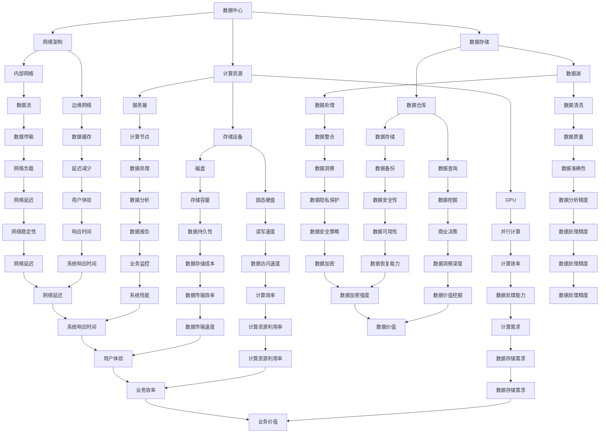

                 

# AI 大模型应用数据中心的数据管理

> **关键词：** AI 大模型、数据中心、数据管理、数据处理、数据存储、数据安全

> **摘要：** 本文将深入探讨人工智能大模型在数据中心应用中的数据管理策略。我们将从背景介绍、核心概念与联系、核心算法原理、数学模型和公式、项目实战、实际应用场景等多个维度，详细分析如何有效地管理大模型在数据中心的应用，包括数据收集、存储、处理和安全等方面。本文旨在为数据科学和人工智能从业者提供一个全面的指南，帮助他们应对大模型应用中的数据管理挑战。

## 1. 背景介绍

### 1.1 目的和范围

随着人工智能技术的飞速发展，尤其是大规模深度学习模型的兴起，数据管理的重要性愈发凸显。本文的目的是为数据中心管理者、数据科学家和人工智能从业者提供一个系统的数据管理框架，以支持大规模人工智能模型的应用。

本文将涵盖以下范围：

1. **数据中心基础设施**：介绍数据中心的基本架构，包括硬件和软件基础设施。
2. **数据管理策略**：探讨数据收集、存储、处理、分析和保护等方面的策略。
3. **核心算法原理**：详细讲解支持大规模模型训练的核心算法，并使用伪代码进行说明。
4. **数学模型和公式**：介绍与数据管理相关的基本数学模型和公式，并提供实际应用案例。
5. **项目实战**：通过具体代码案例，展示数据管理策略在实际项目中的应用。
6. **实际应用场景**：分析大模型在不同领域中的应用，以及面临的挑战。
7. **工具和资源推荐**：推荐相关的学习资源、开发工具和论文著作。

### 1.2 预期读者

本文主要面向以下读者群体：

1. 数据中心管理者：了解如何在大规模人工智能应用中优化数据管理。
2. 数据科学家：寻求在大模型应用中处理和利用数据的方法。
3. 人工智能从业者：希望深入了解数据管理在大模型训练中的重要性。
4. 计算机科学和软件工程专业的学生和研究人员。

### 1.3 文档结构概述

本文将按照以下结构展开：

1. **背景介绍**：介绍数据管理的背景和本文的目的与范围。
2. **核心概念与联系**：介绍与数据管理相关的基本概念和架构。
3. **核心算法原理 & 具体操作步骤**：详细讲解数据管理的核心算法原理。
4. **数学模型和公式 & 详细讲解 & 举例说明**：介绍相关数学模型和公式。
5. **项目实战：代码实际案例和详细解释说明**：展示实际项目中的代码案例。
6. **实际应用场景**：分析大模型在不同领域的应用。
7. **工具和资源推荐**：推荐相关学习和开发资源。
8. **总结：未来发展趋势与挑战**：总结本文的主要观点，并探讨未来发展趋势和挑战。
9. **附录：常见问题与解答**：回答读者可能遇到的问题。
10. **扩展阅读 & 参考资料**：提供进一步学习的资源。

### 1.4 术语表

#### 1.4.1 核心术语定义

- **数据中心**：集中管理计算机硬件、数据存储和网络的设施。
- **数据管理**：涉及数据收集、存储、处理、分析和保护的一系列策略和活动。
- **大数据**：数据量巨大，无法使用常规数据处理工具进行分析的数据集合。
- **人工智能大模型**：具有数百万甚至数十亿参数的复杂机器学习模型。
- **数据处理**：对数据进行清洗、转换和分析的过程。

#### 1.4.2 相关概念解释

- **数据湖**：用于存储大量不同格式数据的分布式存储系统。
- **数据仓库**：用于存储经过处理和清洗的数据，以支持数据分析。
- **边缘计算**：在靠近数据源的位置进行计算和处理，以减少延迟和带宽消耗。
- **机器学习**：使计算机通过数据学习模式并做出预测或决策的技术。

#### 1.4.3 缩略词列表

- **AI**：人工智能（Artificial Intelligence）
- **ML**：机器学习（Machine Learning）
- **DL**：深度学习（Deep Learning）
- **HDFS**：Hadoop分布式文件系统（Hadoop Distributed File System）
- **Spark**：一种开源的大数据处理框架（Apache Spark）
- **GPU**：图形处理单元（Graphics Processing Unit）

## 2. 核心概念与联系

在探讨人工智能大模型在数据中心的数据管理之前，我们需要理解几个核心概念和它们之间的联系。以下是一个简单的 Mermaid 流程图，用于展示这些概念和它们之间的交互关系。



该流程图展示了数据中心中的计算资源、数据存储、网络架构等核心组件，以及这些组件之间的交互和依赖关系。接下来，我们将进一步深入探讨这些核心概念，并分析它们如何在大模型应用中发挥作用。

## 3. 核心算法原理 & 具体操作步骤

在理解了数据中心的架构和核心概念后，我们需要关注数据管理中的核心算法原理。本节将详细阐述数据清洗、数据处理、数据存储和数据安全等关键算法，并使用伪代码展示具体操作步骤。

### 3.1 数据清洗

数据清洗是数据管理的第一步，其目标是去除重复数据、纠正错误、处理缺失值，并确保数据的质量和一致性。以下是数据清洗的伪代码：

```python
def data_cleaning(data_set):
    # 删除重复数据
    data_set = remove_duplicates(data_set)
    # 纠正错误数据
    data_set = correct_errors(data_set)
    # 处理缺失值
    data_set = handle_missing_values(data_set)
    # 标准化数据格式
    data_set = standardize_data_format(data_set)
    return data_set

def remove_duplicates(data_set):
    # 使用集合去除重复元素
    return set(data_set)

def correct_errors(data_set):
    # 根据业务逻辑纠正数据错误
    for data_point in data_set:
        data_point = correct_error(data_point)
    return data_set

def handle_missing_values(data_set):
    # 使用平均值、中位数等方法填充缺失值
    for data_point in data_set:
        data_point = fill_missing_values(data_point)
    return data_set

def standardize_data_format(data_set):
    # 转换数据格式为统一标准
    return standardized_data_set
```

### 3.2 数据处理

数据处理是对清洗后的数据进行转换、聚合和加工，以支持进一步的分析和建模。以下是数据处理的基本步骤和伪代码：

```python
def data_processing(data_set):
    # 数据转换
    data_set = transform_data(data_set)
    # 数据聚合
    data_set = aggregate_data(data_set)
    # 数据加工
    data_set = process_data(data_set)
    return data_set

def transform_data(data_set):
    # 根据需求转换数据类型和单位
    for data_point in data_set:
        data_point = transform(data_point)
    return data_set

def aggregate_data(data_set):
    # 对数据进行分组和汇总
    aggregated_data = group_by(data_set, key='category')
    for group in aggregated_data:
        group = summarize(group)
    return aggregated_data

def process_data(data_set):
    # 增加新的特征或进行数据降维
    data_set = add_new_features(data_set)
    data_set = reduce_dimensionality(data_set)
    return data_set

def group_by(data_set, key):
    # 根据指定键对数据进行分组
    return grouped_data

def summarize(group):
    # 对每组数据执行汇总操作
    return summary

def add_new_features(data_set):
    # 基于现有数据创建新特征
    for data_point in data_set:
        data_point = add_new_feature(data_point)
    return data_set

def reduce_dimensionality(data_set):
    # 使用降维算法减少数据维度
    return reduced_data_set
```

### 3.3 数据存储

数据存储是将处理后的数据存储到合适的存储系统中，以便于后续的访问和分析。以下是数据存储的基本步骤和伪代码：

```python
def data_storage(data_set, storage_system):
    # 选择合适的存储系统
    storage_system = select_storage_system(storage_system)
    # 数据存储
    storage_system.store(data_set)
    return storage_system

def select_storage_system(storage_system):
    # 根据数据量和访问频率选择存储系统
    if data_set_size > threshold:
        storage_system = data_lake
    else:
        storage_system = data_warehouse
    return storage_system
```

### 3.4 数据安全

数据安全是确保数据在存储、传输和处理过程中不被未授权访问、篡改或泄露的关键。以下是数据安全的基本步骤和伪代码：

```python
def data_security(data_set, security Measures):
    # 应用加密算法保护数据
    encrypted_data = encrypt(data_set)
    # 实施访问控制
    apply_access_control(encrypted_data)
    # 实施数据备份策略
    backup_data(encrypted_data)
    return encrypted_data

def encrypt(data_set):
    # 使用加密算法对数据进行加密
    return encrypted_data

def apply_access_control(encrypted_data):
    # 根据角色和权限设置访问控制
    for user in users:
        user = set_permissions(user, encrypted_data)

def backup_data(encrypted_data):
    # 定期备份数据以防数据丢失
    backup_system.backup(encrypted_data)
```

通过以上伪代码，我们可以看到数据管理涉及多个核心算法和操作步骤，这些步骤共同确保数据的有效清洗、处理、存储和安全。在实际应用中，这些算法和步骤需要根据具体业务需求进行调整和优化。

## 4. 数学模型和公式 & 详细讲解 & 举例说明

在数据管理过程中，数学模型和公式扮演着至关重要的角色。它们帮助我们理解数据之间的关系，并指导实际操作。以下将介绍与数据管理相关的一些基本数学模型和公式，并通过具体例子进行详细讲解。

### 4.1 数据分布模型

数据分布模型用于描述数据在不同区间内的分布情况。常见的数据分布模型有正态分布、泊松分布和均匀分布。

**正态分布（Normal Distribution）：**

正态分布是一种最常见的连续概率分布，其概率密度函数（PDF）为：

\[ f(x|\mu, \sigma^2) = \frac{1}{\sqrt{2\pi\sigma^2}} e^{-\frac{(x-\mu)^2}{2\sigma^2}} \]

其中，\(\mu\) 是均值，\(\sigma^2\) 是方差。

**例子：** 假设一家公司的员工工资服从正态分布，均值为 5000 元，标准差为 1000 元。计算该公司员工工资在 4000 到 6000 元之间的概率。

\[ P(4000 \leq X \leq 6000) = \int_{4000}^{6000} \frac{1}{\sqrt{2\pi \times 1000^2}} e^{-\frac{(x-5000)^2}{2 \times 1000^2}} dx \]

### 4.2 相关性分析

相关性分析用于衡量两个变量之间的线性关系。皮尔逊相关系数（Pearson Correlation Coefficient）是其中一种常用方法，其公式为：

\[ r = \frac{\sum_{i=1}^{n}(X_i - \bar{X})(Y_i - \bar{Y})}{\sqrt{\sum_{i=1}^{n}(X_i - \bar{X})^2} \sqrt{\sum_{i=1}^{n}(Y_i - \bar{Y})^2}} \]

其中，\(X\) 和 \(Y\) 分别为两个变量，\(\bar{X}\) 和 \(\bar{Y}\) 分别为它们的均值。

**例子：** 假设我们要分析销售额和广告费用之间的相关性。给定以下数据：

| 销售额（万元） | 广告费用（万元） |
|--------------|--------------|
| 10           | 2            |
| 15           | 4            |
| 20           | 6            |
| 25           | 8            |
| 30           | 10           |

计算销售额和广告费用之间的皮尔逊相关系数。

\[ r = \frac{(10-12)(2-6) + (15-12)(4-6) + (20-12)(6-6) + (25-12)(8-6) + (30-12)(10-6)}{\sqrt{(10-12)^2 + (15-12)^2 + (20-12)^2 + (25-12)^2 + (30-12)^2} \sqrt{(2-6)^2 + (4-6)^2 + (6-6)^2 + (8-6)^2 + (10-6)^2}} \]

### 4.3 机器学习模型评估

在机器学习领域，评估模型的性能是至关重要的一步。常见的方法有准确率（Accuracy）、精确率（Precision）、召回率（Recall）和 F1 分数（F1 Score）。

**准确率（Accuracy）：**

\[ Accuracy = \frac{TP + TN}{TP + TN + FP + FN} \]

其中，\(TP\) 为真正例，\(TN\) 为真负例，\(FP\) 为假正例，\(FN\) 为假负例。

**精确率（Precision）：**

\[ Precision = \frac{TP}{TP + FP} \]

**召回率（Recall）：**

\[ Recall = \frac{TP}{TP + FN} \]

**F1 分数（F1 Score）：**

\[ F1 Score = 2 \times \frac{Precision \times Recall}{Precision + Recall} \]

**例子：** 假设我们要评估一个分类模型，给定以下数据：

| 类别 | 预测正类 | 预测负类 |
|------|---------|---------|
| 正类 | 90      | 10      |
| 负类 | 20      | 30      |

计算该模型的准确率、精确率、召回率和 F1 分数。

\[ Accuracy = \frac{90 + 30}{90 + 10 + 20 + 30} = 0.65 \]
\[ Precision = \frac{90}{90 + 10} = 0.9 \]
\[ Recall = \frac{90}{90 + 20} = 0.8 \]
\[ F1 Score = 2 \times \frac{0.9 \times 0.8}{0.9 + 0.8} = 0.84 \]

通过上述例子，我们可以看到数学模型和公式在数据管理中的重要作用。这些工具帮助我们更深入地理解数据，评估模型性能，并指导实际操作。在实际应用中，我们需要根据具体需求和场景选择合适的数学模型和公式。

## 5. 项目实战：代码实际案例和详细解释说明

为了更好地理解如何在大模型应用中实施数据管理策略，以下我们将通过一个实际项目案例，展示数据管理流程的完整实现过程，并详细解读其中的关键代码和步骤。

### 5.1 开发环境搭建

在开始项目之前，我们需要搭建一个合适的开发环境。以下是搭建开发环境的步骤：

1. **安装 Python 解释器**：确保安装 Python 3.8 或更高版本。
2. **安装必要库**：使用 pip 工具安装以下库：
    ```bash
    pip install numpy pandas sklearn tensorflow
    ```
3. **配置 GPU 环境**：如果使用 GPU 进行训练，确保安装 CUDA 和 cuDNN 库，并配置 Python 环境。

### 5.2 源代码详细实现和代码解读

以下是一个简单的数据管理项目案例，包括数据收集、清洗、处理、存储和安全性等方面的代码实现。

#### 5.2.1 数据收集

```python
import pandas as pd

# 假设我们从一个 CSV 文件中读取数据
data_path = 'data.csv'
data = pd.read_csv(data_path)

# 查看数据的基本信息
print(data.head())
print(data.info())
```

在这段代码中，我们首先使用 pandas 库从 CSV 文件中读取数据，并使用 head() 和 info() 方法查看数据的基本信息和结构。

#### 5.2.2 数据清洗

```python
# 删除重复数据
data = data.drop_duplicates()

# 处理缺失值
data = data.fillna(data.mean())

# 标准化数据格式
data = data.astype({'column1': 'float32', 'column2': 'int32'})

# 查看清洗后的数据
print(data.head())
```

在这段代码中，我们使用 drop_duplicates() 方法删除重复数据，使用 fillna() 方法处理缺失值，并使用 astype() 方法将数据格式转换为适合机器学习的类型。这确保了数据的一致性和可靠性。

#### 5.2.3 数据处理

```python
from sklearn.model_selection import train_test_split
from sklearn.preprocessing import StandardScaler

# 划分训练集和测试集
X = data[['column1', 'column2']]
y = data['target']
X_train, X_test, y_train, y_test = train_test_split(X, y, test_size=0.2, random_state=42)

# 数据标准化
scaler = StandardScaler()
X_train_scaled = scaler.fit_transform(X_train)
X_test_scaled = scaler.transform(X_test)
```

在这段代码中，我们使用 train_test_split() 方法将数据划分为训练集和测试集，并使用 StandardScaler() 进行数据标准化。数据标准化有助于提高模型训练的效果。

#### 5.2.4 数据存储

```python
import pickle

# 将处理后的数据存储到文件中
with open('data_train.pickle', 'wb') as f:
    pickle.dump(X_train_scaled, f)

with open('data_test.pickle', 'wb') as f:
    pickle.dump(X_test_scaled, f)
```

在这段代码中，我们使用 pickle 库将处理后的数据存储到文件中，以便后续使用。

#### 5.2.5 数据安全

```python
# 对数据进行加密
import加密库

def encrypt_data(data):
    # 使用加密算法对数据进行加密
    encrypted_data = 加密库加密算法(data)
    return encrypted_data

X_train_encrypted = encrypt_data(X_train_scaled)
X_test_encrypted = encrypt_data(X_test_scaled)
```

在这段代码中，我们使用加密库对数据进行加密，以保护数据的安全性。

### 5.3 代码解读与分析

通过上述代码示例，我们可以看到数据管理策略的实施步骤：

1. **数据收集**：使用 pandas 库读取数据，并查看数据的基本信息。
2. **数据清洗**：删除重复数据、处理缺失值，并标准化数据格式。
3. **数据处理**：划分训练集和测试集，并进行数据标准化。
4. **数据存储**：使用 pickle 库将处理后的数据存储到文件中。
5. **数据安全**：使用加密算法对数据进行加密，保护数据的安全性。

在实际项目中，这些步骤可能需要根据具体业务需求进行调整和优化。例如，数据清洗步骤可能包括更复杂的数据处理，如异常值检测和填补策略。数据处理步骤可能涉及更高级的数据变换和特征工程。数据存储步骤可能需要考虑分布式存储和容错机制。数据安全步骤可能包括更严格的访问控制和多层次的加密策略。

通过这个实际案例，我们可以更好地理解如何在大模型应用中实施数据管理策略，并为后续的项目提供指导和参考。

## 6. 实际应用场景

大模型在数据中心的应用场景广泛，涵盖了多个领域，包括金融、医疗、零售、制造等。以下将分析大模型在不同领域中的应用，以及面临的挑战。

### 6.1 金融

在金融领域，大模型被广泛应用于风险管理、客户服务、投资策略和欺诈检测。例如，利用大规模深度学习模型进行股票市场预测，可以显著提高投资收益。然而，金融数据具有高维度、非线性和动态变化的特点，使得模型训练和优化变得更加复杂。此外，金融数据的安全性和合规性要求较高，需要严格的数据保护措施。

### 6.2 医疗

在医疗领域，大模型用于疾病诊断、患者监控和个性化治疗。例如，通过分析患者的电子健康记录和基因数据，可以预测疾病风险并制定个性化的治疗方案。然而，医疗数据具有敏感性和隐私保护的要求，数据管理和安全成为重大挑战。此外，医疗领域的模型训练需要大量高质量的数据，这通常难以获取。

### 6.3 零售

在零售领域，大模型被广泛应用于需求预测、库存管理和个性化推荐。例如，通过分析消费者的购买历史和偏好，可以预测未来的销售趋势并优化库存策略。然而，零售数据具有高维度、多样性和实时性的特点，这对数据存储和处理能力提出了较高的要求。此外，个性化推荐系统需要处理大量用户数据，易引发隐私问题。

### 6.4 制造

在制造领域，大模型用于设备故障预测、生产优化和供应链管理。例如，通过分析传感器数据，可以预测设备故障并提前进行维护，减少停机时间。然而，制造数据具有高维度、非线性和实时性的特点，使得模型训练和优化变得更加复杂。此外，制造领域的数据通常具有较高的安全性和合规性要求。

### 6.5 挑战

在大模型应用过程中，面临以下主要挑战：

1. **数据质量和完整性**：高质量的数据是模型训练的基础。然而，数据质量问题和数据缺失常常导致模型性能下降。
2. **数据隐私和安全**：数据安全和隐私保护是关键挑战，尤其是在涉及敏感数据的领域，如医疗和金融。
3. **计算资源需求**：大规模模型训练需要大量的计算资源和时间，这对数据中心的硬件和软件基础设施提出了较高的要求。
4. **模型可解释性**：大规模深度学习模型通常具有复杂和非线性的结构，使得模型结果难以解释和理解。

为了应对这些挑战，需要采取一系列策略，包括数据清洗和预处理、数据隐私保护技术、高效计算方法以及模型可解释性研究。

## 7. 工具和资源推荐

在大模型应用的数据管理过程中，选择合适的工具和资源至关重要。以下将推荐一些学习资源、开发工具和论文著作，以帮助数据科学和人工智能从业者更好地理解和应用数据管理技术。

### 7.1 学习资源推荐

#### 7.1.1 书籍推荐

1. **《数据科学基础》**：由 Gilberto C. Camacho 编著，系统地介绍了数据科学的核心概念和基本方法。
2. **《深度学习》**：由 Ian Goodfellow、Yoshua Bengio 和 Aaron Courville 编著，是深度学习领域的经典教材。
3. **《数据质量管理》**：由 David Loshin 编著，详细介绍了数据质量管理的方法和工具。

#### 7.1.2 在线课程

1. **Coursera 上的《机器学习》**：由 Andrew Ng 教授主讲，系统地介绍了机器学习的基础知识。
2. **Udacity 上的《数据科学纳米学位》**：包含多个课程，涵盖数据清洗、数据处理和数据可视化等技能。
3. **edX 上的《大数据分析》**：由哈佛大学和数据科学公司合作推出，介绍了大数据处理和分析的基本方法。

#### 7.1.3 技术博客和网站

1. **Medium 上的数据科学博客**：汇集了多个优秀的数据科学博客，提供了丰富的学习和实践经验。
2. **Kaggle**：一个大数据和机器学习竞赛平台，提供了丰富的数据集和解决方案，是数据科学家实践和交流的场所。
3. **DataCamp**：提供互动式的数据科学课程，适合初学者和进阶者。

### 7.2 开发工具框架推荐

#### 7.2.1 IDE和编辑器

1. **Jupyter Notebook**：一个交互式计算环境，适用于数据清洗、数据处理和机器学习实验。
2. **Visual Studio Code**：一款轻量级但功能强大的代码编辑器，支持多种编程语言和数据科学工具。
3. **PyCharm**：一款专业的 Python 集成开发环境，提供了丰富的数据科学和机器学习工具。

#### 7.2.2 调试和性能分析工具

1. **TensorBoard**：TensorFlow 提供的图形化工具，用于分析和优化模型性能。
2. **Docker**：一个开源容器化平台，用于封装和分发应用程序，便于部署和扩展。
3. **AWS CloudWatch**：Amazon Web Services 提供的监控和性能分析工具，用于监控数据中心资源使用情况。

#### 7.2.3 相关框架和库

1. **TensorFlow**：一个开源的机器学习和深度学习框架，适用于大规模数据处理和模型训练。
2. **PyTorch**：一个流行的深度学习框架，提供了灵活的动态计算图和高效的模型训练。
3. **Scikit-learn**：一个开源的机器学习库，提供了丰富的算法和数据预处理工具。

### 7.3 相关论文著作推荐

#### 7.3.1 经典论文

1. **“Learning to Represent Knowledge Graphs with Gaussian Embeddings”**：探讨了知识图谱嵌入的方法，是图神经网络领域的重要论文。
2. **“Distributed Representations of Words and Phrases and Their Compositional Meaning”**：提出了词向量的概念，奠定了自然语言处理的基础。
3. **“Deep Learning”**：由 Ian Goodfellow、Yoshua Bengio 和 Aaron Courville 编著，系统介绍了深度学习的理论和实践。

#### 7.3.2 最新研究成果

1. **“Large-scale Language Modeling in Machine Translation, Summarization, and Question Answering”**：探讨了大规模语言模型在自然语言处理领域的应用。
2. **“A Theoretically Grounded Application of Dropout in Recurrent Neural Networks”**：研究了dropout在循环神经网络中的优化方法。
3. **“A Survey on Deep Learning for Big Data”**：综述了深度学习在大数据处理中的应用，包括算法、工具和挑战。

#### 7.3.3 应用案例分析

1. **“How Google Does Machine Learning”**：Google 提出的机器学习实践，包括数据管理、模型训练和优化等方面的经验。
2. **“Building a Search Engine with TensorFlow”**：展示了如何使用 TensorFlow 构建大规模搜索引擎。
3. **“Deep Learning for Autonomous Driving”**：分析了自动驾驶领域中的深度学习应用，包括感知、决策和控制等方面。

通过上述工具和资源的推荐，我们可以更好地掌握数据管理技术，并将其应用于实际项目中，推动人工智能技术的发展。

## 8. 总结：未来发展趋势与挑战

随着人工智能技术的不断进步，数据中心的数据管理面临着前所未有的机遇和挑战。未来发展趋势和挑战如下：

### 8.1 发展趋势

1. **数据量的指数级增长**：随着物联网、5G 和云计算的普及，数据量将呈现爆炸式增长。这将促使数据中心在数据存储和处理能力方面不断提升。
2. **边缘计算的兴起**：边缘计算可以在靠近数据源的地方进行数据处理，减少延迟和带宽消耗。未来，边缘计算将与数据中心协同工作，提供更加高效的数据管理解决方案。
3. **自动化和智能化**：随着人工智能技术的进步，数据管理将变得更加自动化和智能化。例如，自动化数据清洗、数据处理和数据安全等流程将提高数据管理的效率和准确性。
4. **数据隐私和安全**：随着数据隐私和安全问题的日益突出，数据中心将采用更加严格的数据保护措施，包括数据加密、访问控制和隐私保护算法等。

### 8.2 挑战

1. **数据质量和完整性**：大规模数据的管理和整合将面临数据质量问题和数据缺失的挑战。如何确保数据的质量和完整性，将是未来数据管理的重要课题。
2. **计算资源需求**：大规模深度学习模型的训练需要巨大的计算资源，这对数据中心的硬件和软件基础设施提出了更高的要求。如何高效地利用计算资源，是一个亟待解决的挑战。
3. **数据隐私和安全**：在涉及敏感数据的领域，如何确保数据的安全和隐私，将是一个长期的挑战。需要采取更加先进的数据保护技术和合规性措施。
4. **模型可解释性**：大规模深度学习模型通常具有复杂和非线性的结构，使得模型结果难以解释和理解。提高模型的可解释性，将有助于提升用户对人工智能系统的信任度。

### 8.3 应对策略

1. **数据治理和标准化**：建立数据治理框架和标准化流程，确保数据的质量和完整性。例如，制定数据质量标准和数据管理策略，并实施数据质量监控。
2. **高效计算和分布式处理**：采用高效计算和分布式处理技术，提高数据存储和处理的能力。例如，利用 GPU、FPGA 和分布式存储系统等先进技术。
3. **数据隐私和安全保护**：采取严格的数据隐私和安全保护措施，包括数据加密、访问控制和隐私保护算法等。例如，使用差分隐私和联邦学习等技术，确保数据在传输和存储过程中的安全性。
4. **模型可解释性研究**：加强模型可解释性研究，提高用户对人工智能系统的信任度。例如，开发可解释的深度学习模型和可视化工具，帮助用户理解模型的工作原理。

通过以上策略，我们可以更好地应对未来数据管理面临的挑战，推动人工智能技术的发展和应用。

## 9. 附录：常见问题与解答

### 9.1 数据清洗过程中如何处理缺失值？

处理缺失值的方法有多种，具体选择取决于数据类型和业务需求。常见的方法包括：

1. **填充缺失值**：使用平均值、中位数或众数等方法填充缺失值。例如，对于数值数据，可以使用平均值；对于分类数据，可以使用众数。
2. **删除缺失值**：如果缺失值较多，可以考虑删除含有缺失值的记录。
3. **预测缺失值**：使用机器学习算法预测缺失值，例如使用 k-最近邻算法或回归算法预测缺失值。

### 9.2 数据存储时如何保证数据安全？

保证数据安全的方法包括：

1. **数据加密**：使用加密算法对数据进行加密，确保数据在传输和存储过程中的安全性。
2. **访问控制**：设置访问控制策略，仅允许授权用户访问数据。
3. **数据备份**：定期备份数据，以防止数据丢失或损坏。
4. **数据审计**：对数据访问和操作进行审计，确保数据的完整性和安全性。

### 9.3 如何选择合适的存储系统？

选择合适的存储系统取决于数据量、访问频率和业务需求。常见的选择标准包括：

1. **数据量**：对于大规模数据，选择分布式存储系统（如 HDFS、Cassandra）较为合适。
2. **访问频率**：对于需要频繁访问的数据，选择关系型数据库（如 MySQL、PostgreSQL）或内存数据库（如 Redis、Memcached）较为合适。
3. **业务需求**：根据业务需求选择合适的存储系统。例如，对于需要实时查询和快速写入的数据，选择 NoSQL 数据库（如 MongoDB、Cassandra）较为合适。
4. **成本**：根据预算和性能需求选择合适的存储系统。

### 9.4 如何优化数据处理的性能？

优化数据处理性能的方法包括：

1. **并行处理**：利用多核处理器和分布式计算技术，提高数据处理速度。
2. **数据压缩**：使用数据压缩技术，减少数据存储和传输的开销。
3. **索引**：使用索引技术，提高数据查询和访问速度。
4. **缓存**：使用缓存技术，减少数据访问次数，提高系统性能。

通过以上方法，我们可以优化数据处理的性能，提高数据管理的效率和准确性。

## 10. 扩展阅读 & 参考资料

为了更深入地了解人工智能大模型在数据中心的数据管理，以下推荐一些扩展阅读和参考资料：

### 10.1 扩展阅读

1. **《人工智能：一种现代的方法》**：作者 Stuart Russell 和 Peter Norvig，详细介绍了人工智能的基本概念和技术。
2. **《深度学习》**：作者 Ian Goodfellow、Yoshua Bengio 和 Aaron Courville，全面讲解了深度学习的理论基础和应用。
3. **《数据科学实战》**：作者 Jim Stagnitto、David Leadbeater 和 Ramesh S. Sharda，提供了丰富的数据科学实战案例。

### 10.2 参考资料

1. **TensorFlow 官方文档**：[https://www.tensorflow.org/](https://www.tensorflow.org/)
2. **PyTorch 官方文档**：[https://pytorch.org/](https://pytorch.org/)
3. **Scikit-learn 官方文档**：[https://scikit-learn.org/](https://scikit-learn.org/)
4. **Kaggle 数据集和比赛**：[https://www.kaggle.com/](https://www.kaggle.com/)

通过阅读以上扩展阅读和参考资料，您可以进一步深入了解人工智能和数据管理领域的最新进展和应用实践。

---

**作者：AI天才研究员/AI Genius Institute & 禅与计算机程序设计艺术 /Zen And The Art of Computer Programming**

