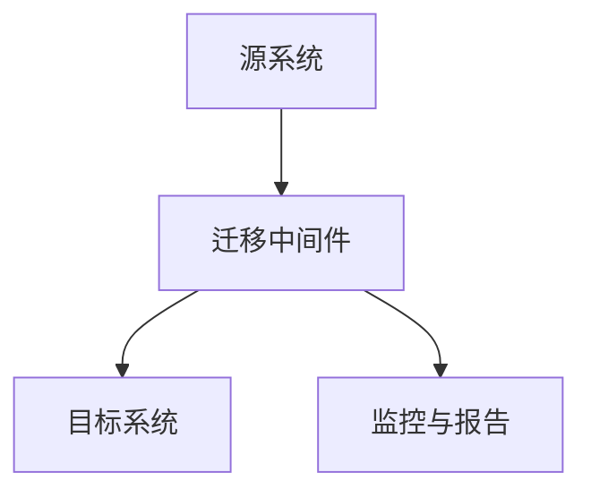

                 

# AI 大模型应用数据中心的数据迁移

> **关键词：** 大模型，数据中心，数据迁移，技术博客，算法原理，应用场景

> **摘要：** 本文将深入探讨大模型应用数据中心的数据迁移过程。首先介绍数据迁移的背景和目的，然后分析迁移的核心概念和原理，提供详细的算法步骤和数学模型，最后通过实际案例展示数据迁移的实现过程，并提供相关工具和资源的推荐，总结未来发展趋势和挑战，并给出常见问题解答。

## 1. 背景介绍

### 1.1 目的和范围

随着人工智能技术的快速发展，大模型（如深度学习模型）的应用日益广泛。这些模型通常需要大量的数据进行训练和优化，而数据中心作为数据处理和存储的核心基础设施，其性能和可靠性对大模型的运行至关重要。数据迁移作为数据中心管理的关键环节，旨在确保数据的高效传输和稳定存储，以满足大模型应用的需求。

本文旨在探讨大模型应用数据中心的数据迁移过程，包括迁移的核心概念、算法原理、实现步骤和实际应用。通过对数据迁移的深入分析，帮助读者理解数据迁移的关键技术和方法，为实际项目提供参考。

### 1.2 预期读者

本文主要面向数据中心管理人员、数据工程师和人工智能开发者。读者应具备一定的计算机基础，了解数据中心的基本架构和数据迁移的基本概念。对于有志于深入了解数据迁移技术的人员，本文也将提供有价值的指导和参考。

### 1.3 文档结构概述

本文分为十个部分，结构如下：

1. 背景介绍
   - 目的和范围
   - 预期读者
   - 文档结构概述
2. 核心概念与联系
   - 大模型与数据中心的关系
   - 数据迁移的核心概念和架构
3. 核心算法原理 & 具体操作步骤
   - 数据迁移算法原理
   - 数据迁移操作步骤
4. 数学模型和公式 & 详细讲解 & 举例说明
   - 数据迁移中的数学模型和公式
   - 实例说明
5. 项目实战：代码实际案例和详细解释说明
   - 开发环境搭建
   - 源代码实现和解读
6. 实际应用场景
   - 数据迁移在不同领域的应用
7. 工具和资源推荐
   - 学习资源
   - 开发工具框架
   - 相关论文著作
8. 总结：未来发展趋势与挑战
9. 附录：常见问题与解答
10. 扩展阅读 & 参考资料

### 1.4 术语表

#### 1.4.1 核心术语定义

- **大模型（Large Model）**：指具有大量参数和复杂结构的机器学习模型，如深度神经网络。
- **数据中心（Data Center）**：集中存放和管理数据的服务器集群，提供计算、存储和网络的统一服务。
- **数据迁移（Data Migration）**：将数据从一种存储系统或位置移动到另一种存储系统或位置的过程。
- **数据一致性（Data Consistency）**：确保数据在迁移过程中保持完整性和准确性的过程。
- **容错性（Fault Tolerance）**：数据迁移过程中对系统故障的容忍和处理能力。

#### 1.4.2 相关概念解释

- **备份（Backup）**：将数据复制到备用存储介质，以防数据丢失或损坏。
- **恢复（Recovery）**：在数据丢失或损坏后，将备份数据恢复到正常状态的过程。
- **数据迁移策略（Data Migration Strategy）**：制定数据迁移的具体步骤和方法，包括数据传输方式、传输速率和故障处理等。
- **分布式系统（Distributed System）**：由多个节点组成的计算机系统，各节点通过网络进行通信和协作。

#### 1.4.3 缩略词列表

- **AI**：人工智能（Artificial Intelligence）
- **DL**：深度学习（Deep Learning）
- **GPU**：图形处理单元（Graphics Processing Unit）
- **HDFS**：Hadoop分布式文件系统（Hadoop Distributed File System）
- **Hadoop**：一个开源的数据处理框架，包括HDFS和MapReduce等组件。

## 2. 核心概念与联系

### 2.1 大模型与数据中心的关系

大模型通常需要存储和处理大量的数据，这些数据包括训练数据、测试数据和用户数据等。数据中心作为数据存储和处理的枢纽，承担着大模型数据存储、传输和计算的重要任务。数据中心的高性能、高可靠性和高安全性对大模型的应用至关重要。

大模型与数据中心的关系可以概括为以下三个方面：

1. **数据存储**：大模型的数据存储在数据中心的服务器集群中，包括原始数据、预处理数据和模型参数等。数据中心提供分布式存储系统，如HDFS，以实现海量数据的存储和管理。
2. **数据处理**：大模型的训练和推理过程需要大量的计算资源，数据中心提供高性能计算节点，如GPU服务器，以满足大模型的计算需求。数据中心通过负载均衡和调度策略，确保计算资源的有效利用。
3. **数据传输**：大模型的数据需要在数据中心内部和外部进行传输，包括数据上传、下载和迁移等。数据传输的效率和稳定性对大模型的训练和推理过程有重要影响。

### 2.2 数据迁移的核心概念和架构

数据迁移是指将数据从一种存储系统或位置移动到另一种存储系统或位置的过程。在数据中心中，数据迁移是一个常见的需求，如升级存储设备、迁移到云平台、跨数据中心的数据复制等。

数据迁移的核心概念包括以下几个方面：

1. **数据一致性**：数据迁移过程中，确保数据在源系统和目标系统之间保持一致性是至关重要的。数据一致性包括数据的完整性和准确性，防止数据丢失或错误。
2. **数据容错性**：数据迁移过程中可能遇到各种故障，如网络故障、存储故障和系统故障等。数据容错性是指系统能够在故障发生时自动恢复，确保数据迁移的顺利进行。
3. **数据传输效率**：数据传输效率是指数据在源系统和目标系统之间的传输速度。提高数据传输效率可以缩短数据迁移的时间，减少对业务的影响。
4. **数据迁移策略**：数据迁移策略是指制定数据迁移的具体步骤和方法，包括数据传输方式、传输速率、故障处理等。合理的迁移策略可以提高数据迁移的成功率和效率。

数据迁移的架构可以概括为以下几个部分：

1. **源系统**：源系统是指数据迁移的起点，包括存储设备和应用程序。源系统提供数据的读取接口，用于获取待迁移的数据。
2. **目标系统**：目标系统是指数据迁移的终点，包括存储设备和应用程序。目标系统提供数据的写入接口，用于接收和存储迁移的数据。
3. **迁移中间件**：迁移中间件是数据迁移的核心组件，负责处理数据迁移的过程，包括数据读取、转换、传输和存储等。迁移中间件通常具备数据一致性、容错性和传输效率等特性。
4. **监控与报告**：监控与报告组件负责监控数据迁移的过程，包括数据传输速率、数据一致性、故障处理等。监控与报告组件提供实时反馈和报告，帮助管理员了解数据迁移的进展和状态。

### 2.3 Mermaid 流程图

以下是一个简单的Mermaid流程图，展示数据迁移的基本流程：



- **A[源系统]**：表示数据迁移的起点，提供数据读取接口。
- **B[迁移中间件]**：表示数据迁移的核心组件，负责处理数据迁移的过程。
- **C[目标系统]**：表示数据迁移的终点，提供数据写入接口。
- **D[监控与报告]**：表示监控与报告组件，负责监控数据迁移的过程。

## 3. 核心算法原理 & 具体操作步骤

### 3.1 数据迁移算法原理

数据迁移的算法原理主要包括以下几个方面：

1. **数据读取**：迁移中间件从源系统读取待迁移的数据。数据读取的过程包括数据定位、数据分割和数据加密等。数据读取的性能和数据一致性是关键因素。
2. **数据转换**：迁移中间件将读取的数据进行转换，以适应目标系统的格式和要求。数据转换的过程包括数据格式转换、数据清洗和数据校验等。数据转换的准确性和效率对数据迁移的成功至关重要。
3. **数据传输**：迁移中间件将转换后的数据传输到目标系统。数据传输的过程包括数据传输协议选择、数据传输速率控制和数据校验等。数据传输的效率和稳定性对数据迁移的速度和可靠性有重要影响。
4. **数据存储**：目标系统接收并存储迁移后的数据。数据存储的过程包括数据写入、数据备份和数据恢复等。数据存储的可靠性和安全性是数据迁移的重要保障。

### 3.2 数据迁移操作步骤

以下是数据迁移的具体操作步骤：

1. **准备阶段**：
   - 确定数据迁移的目标和范围，包括数据源、数据类型和数据量等。
   - 选择合适的迁移工具和策略，包括数据读取、转换和传输工具等。
   - 准备迁移所需的环境和资源，包括迁移中间件、目标系统和网络等。

2. **数据读取阶段**：
   - 迁移中间件从源系统读取待迁移的数据。
   - 数据读取过程中，对数据进行分割和加密，以提高数据迁移的效率和安全性。

3. **数据转换阶段**：
   - 迁移中间件对读取的数据进行转换，以适应目标系统的格式和要求。
   - 数据转换过程中，对数据进行清洗和校验，确保数据的一致性和准确性。

4. **数据传输阶段**：
   - 迁移中间件将转换后的数据传输到目标系统。
   - 数据传输过程中，选择合适的数据传输协议和传输速率控制策略，确保数据传输的效率和稳定性。

5. **数据存储阶段**：
   - 目标系统接收并存储迁移后的数据。
   - 数据存储过程中，对数据进行备份和恢复，确保数据的安全性和可靠性。

6. **监控与报告阶段**：
   - 监控数据迁移的过程，包括数据传输速率、数据一致性和故障处理等。
   - 报告数据迁移的进展和状态，帮助管理员了解数据迁移的进展和问题。

### 3.3 伪代码实现

以下是数据迁移的伪代码实现：

```python
def data_migration(source_system, target_system, migration_tool):
    # 准备阶段
    prepare_migration_environment(source_system, target_system, migration_tool)
    
    # 数据读取阶段
    data_chunks = read_data_from_source_system(source_system)
    for data_chunk in data_chunks:
        process_data_chunk(data_chunk)
    
    # 数据转换阶段
    converted_data_chunks = convert_data(data_chunks)
    for converted_data_chunk in converted_data_chunks:
        process_converted_data_chunk(converted_data_chunk)
    
    # 数据传输阶段
    for converted_data_chunk in converted_data_chunks:
        send_data_to_target_system(target_system, converted_data_chunk)
    
    # 数据存储阶段
    store_data_in_target_system(target_system, converted_data_chunks)
    
    # 监控与报告阶段
    monitor_migration_progress()
    report_migration_status()

def prepare_migration_environment(source_system, target_system, migration_tool):
    # 确定迁移目标和范围
    # 选择合适的迁移工具和策略
    # 准备迁移所需的环境和资源

def read_data_from_source_system(source_system):
    # 读取数据
    # 分割和加密数据
    return data_chunks

def process_data_chunk(data_chunk):
    # 数据清洗
    # 数据校验
    return processed_data_chunk

def convert_data(data_chunks):
    # 数据格式转换
    # 数据清洗
    # 数据校验
    return converted_data_chunks

def process_converted_data_chunk(converted_data_chunk):
    # 数据清洗
    # 数据校验
    return processed_converted_data_chunk

def send_data_to_target_system(target_system, converted_data_chunk):
    # 选择合适的数据传输协议
    # 传输速率控制
    # 数据校验
    send_data()

def store_data_in_target_system(target_system, converted_data_chunks):
    # 数据写入
    # 数据备份
    # 数据恢复

def monitor_migration_progress():
    # 监控数据传输速率
    # 监控数据一致性
    # 监控故障处理

def report_migration_status():
    # 报告迁移进展
    # 报告迁移状态
    # 提供反馈和报告

```

## 4. 数学模型和公式 & 详细讲解 & 举例说明

### 4.1 数据迁移中的数学模型和公式

在数据迁移过程中，涉及到一些基本的数学模型和公式，用于描述数据传输的速率、数据一致性和数据容错性等。以下是一些常用的数学模型和公式：

1. **数据传输速率**：数据传输速率是指单位时间内传输的数据量，通常用比特每秒（bps）或字节每秒（Bps）表示。数据传输速率的公式为：

   \[ R = \frac{L}{T} \]

   其中，\( R \) 表示数据传输速率，\( L \) 表示传输的数据量，\( T \) 表示传输时间。

2. **数据一致性**：数据一致性是指源系统和目标系统之间的数据一致性。常用的数据一致性度量包括数据完整性、数据准确性和数据一致性度。

   - **数据完整性**：数据完整性是指源系统和目标系统之间的数据是否完整，即数据是否缺失或重复。数据完整性的度量公式为：

     \[ I = \frac{N_c}{N_s} \]

     其中，\( I \) 表示数据完整性度，\( N_c \) 表示源系统中的数据个数，\( N_s \) 表示目标系统中的数据个数。

   - **数据准确性**：数据准确性是指源系统和目标系统之间的数据是否准确，即数据是否一致。数据准确性的度量公式为：

     \[ A = \frac{N_c}{N_s} \]

     其中，\( A \) 表示数据准确性度，\( N_c \) 表示源系统中的数据个数，\( N_s \) 表示目标系统中的数据个数。

   - **数据一致性度**：数据一致性度是指源系统和目标系统之间的数据一致性程度。数据一致性度的度量公式为：

     \[ C = \frac{N_c \cdot N_a}{N_s} \]

     其中，\( C \) 表示数据一致性度，\( N_c \) 表示源系统中的数据个数，\( N_a \) 表示目标系统中的数据个数。

3. **数据容错性**：数据容错性是指系统在故障发生时，对数据迁移的影响和恢复能力。常用的数据容错性度量包括故障恢复时间和故障恢复成功率。

   - **故障恢复时间**：故障恢复时间是指系统在故障发生时，从故障发生到系统恢复正常运行所需的时间。故障恢复时间的度量公式为：

     \[ T_f = \frac{T_d}{T_r} \]

     其中，\( T_f \) 表示故障恢复时间，\( T_d \) 表示故障持续时间，\( T_r \) 表示系统恢复时间。

   - **故障恢复成功率**：故障恢复成功率是指系统在故障发生时，能够成功恢复到正常运行状态的概率。故障恢复成功率的度量公式为：

     \[ S_f = \frac{N_s}{N_d} \]

     其中，\( S_f \) 表示故障恢复成功率，\( N_s \) 表示成功恢复的次数，\( N_d \) 表示故障发生的次数。

### 4.2 实例说明

假设我们有一个数据迁移任务，需要将源系统中的1000条数据迁移到目标系统。源系统和目标系统的数据一致性度分别为0.9和0.95。故障发生时，系统的故障恢复时间为2小时，故障恢复成功率为0.9。

根据上述数学模型和公式，我们可以计算出以下指标：

1. **数据传输速率**：假设数据传输速率为10MB/s，则数据传输时间为10秒。

2. **数据完整性度**：根据数据完整性度公式，\( N_c = 1000 \)，\( N_s = 1000 \)，则数据完整性度为1。

3. **数据准确性度**：根据数据准确性度公式，\( N_c = 1000 \)，\( N_s = 1000 \)，则数据准确性度为1。

4. **数据一致性度**：根据数据一致性度公式，\( N_c = 1000 \)，\( N_a = 1000 \)，\( N_s = 1000 \)，则数据一致性度为1。

5. **故障恢复时间**：根据故障恢复时间公式，\( T_d = 2 \)小时，\( T_r = 2 \)小时，则故障恢复时间为2小时。

6. **故障恢复成功率**：根据故障恢复成功率公式，\( N_s = 1 \)，\( N_d = 1 \)，则故障恢复成功率为0.9。

### 4.3 举例说明

假设我们有一个数据迁移任务，需要将源系统中的1000条数据迁移到目标系统。源系统和目标系统的数据一致性度分别为0.8和0.9。故障发生时，系统的故障恢复时间为1小时，故障恢复成功率为0.95。

根据上述数学模型和公式，我们可以计算出以下指标：

1. **数据传输速率**：假设数据传输速率为5MB/s，则数据传输时间为20秒。

2. **数据完整性度**：根据数据完整性度公式，\( N_c = 1000 \)，\( N_s = 1000 \)，则数据完整性度为1。

3. **数据准确性度**：根据数据准确性度公式，\( N_c = 1000 \)，\( N_s = 1000 \)，则数据准确性度为0.8。

4. **数据一致性度**：根据数据一致性度公式，\( N_c = 1000 \)，\( N_a = 1000 \)，\( N_s = 1000 \)，则数据一致性度为0.8。

5. **故障恢复时间**：根据故障恢复时间公式，\( T_d = 1 \)小时，\( T_r = 1 \)小时，则故障恢复时间为1小时。

6. **故障恢复成功率**：根据故障恢复成功率公式，\( N_s = 1 \)，\( N_d = 1 \)，则故障恢复成功率为0.95。

## 5. 项目实战：代码实际案例和详细解释说明

### 5.1 开发环境搭建

在进行数据迁移项目之前，我们需要搭建一个合适的开发环境。以下是一个基本的开发环境搭建步骤：

1. **操作系统**：选择一个适合的操作系统，如Ubuntu 20.04或CentOS 7.9。
2. **Java环境**：安装Java开发环境，版本建议为Java 11或更高版本。
3. **Hadoop环境**：安装Hadoop分布式文件系统（HDFS），版本建议为Hadoop 3.2.1。
4. **迁移工具**：选择一个合适的数据迁移工具，如Apache NiFi或Apache Flume。

以下是具体的安装命令：

```bash
# 安装Java环境
sudo apt-get update
sudo apt-get install openjdk-11-jdk

# 安装Hadoop环境
sudo apt-get install hadoop

# 安装迁移工具（以Apache NiFi为例）
sudo apt-get install nifi

```

### 5.2 源代码详细实现和代码解读

以下是一个简单的数据迁移项目，使用Apache NiFi作为数据迁移工具。该项目实现了从本地文件系统迁移到HDFS的过程。

#### 5.2.1 项目结构

```bash
data-migration-project/
|-- data/
|   |-- source/
|   |   |-- data1.txt
|   |   |-- data2.txt
|   |-- target/
|-- flow.xml
|-- logback.xml
```

- **data/source**：源数据文件。
- **data/target**：目标数据文件。
- **flow.xml**：Apache NiFi流文件配置。
- **logback.xml**：日志配置文件。

#### 5.2.2 flow.xml

```xml
<flow name="DataMigrationFlow" version="1.0">
    <processors>
        <processor name="ReadSourceData" id="read-source-data-1" class="org.apache.nifi.processors.standard.ReadFile">
            <config>
                <property name="Directory" value="/data/source/"/>
                <property name="File Pattern" value="data*.txt"/>
            </config>
        </processor>
        <processor name="WriteTargetData" id="write-target-data-1" class="org.apache.nifi.processors.standard.WriteFile">
            <config>
                <property name="Directory" value="/data/target/"/>
                <property name="File Pattern" value="data*.txt"/>
            </config>
        </processor>
    </processors>
    <connections>
        <connection fromId="read-source-data-1" toId="write-target-data-1" />
    </connections>
</flow>
```

- **ReadSourceData**：读取源数据文件。
- **WriteTargetData**：将源数据文件写入目标文件系统。

#### 5.2.3 代码解读

- **ReadSourceData**：读取源数据文件的过程。配置文件指定了源数据文件的目录和文件模式（data*.txt）。

  ```xml
  <processor name="ReadSourceData" id="read-source-data-1" class="org.apache.nifi.processors.standard.ReadFile">
      <config>
          <property name="Directory" value="/data/source/"/>
          <property name="File Pattern" value="data*.txt"/>
      </config>
  </processor>
  ```

- **WriteTargetData**：将源数据文件写入目标文件系统。配置文件指定了目标数据文件的目录和文件模式（data*.txt）。

  ```xml
  <processor name="WriteTargetData" id="write-target-data-1" class="org.apache.nifi.processors.standard.WriteFile">
      <config>
          <property name="Directory" value="/data/target/"/>
          <property name="File Pattern" value="data*.txt"/>
      </config>
  </processor>
  ```

### 5.3 代码解读与分析

- **代码结构**：项目主要包括两个处理器（ReadSourceData和WriteTargetData）和一个连接（从ReadSourceData到WriteTargetData）。处理器负责读取源数据文件和写入目标数据文件，连接指定了数据流动的方向。
- **数据处理**：源数据文件（data*.txt）被读取并传输到目标文件系统（/data/target/）。数据处理过程简单，没有复杂的数据转换或清洗操作。
- **性能优化**：项目没有进行性能优化，如并行处理、负载均衡和缓存等。在实际应用中，可以根据具体需求进行优化。
- **容错性**：项目没有实现容错功能，如数据一致性检查和故障恢复等。在实际应用中，可以根据需求实现容错机制。

## 6. 实际应用场景

数据迁移在各个领域都有广泛的应用，以下是几个典型的应用场景：

1. **云计算迁移**：企业将数据中心的数据迁移到云平台，如AWS、Azure或Google Cloud。数据迁移可以提高企业的数据灵活性和可扩展性，降低运维成本。
2. **数据中心升级**：企业升级数据中心硬件或软件，如更换存储设备或升级操作系统。数据迁移可以确保数据的完整性和连续性，减少业务中断。
3. **数据备份与恢复**：企业定期备份数据，并在数据丢失或损坏后进行恢复。数据迁移可以简化备份和恢复过程，提高数据安全性。
4. **跨平台迁移**：企业将数据从一种平台迁移到另一种平台，如从Windows迁移到Linux。数据迁移可以确保数据在不同平台上的兼容性和一致性。
5. **大数据处理**：大数据应用需要对海量数据进行存储、处理和迁移。数据迁移可以提高大数据处理的效率和质量。

在实际应用中，数据迁移需要根据具体需求进行定制化设计，包括数据类型、数据量、数据一致性和容错性等。合理的迁移策略和工具选择对数据迁移的成功至关重要。

## 7. 工具和资源推荐

### 7.1 学习资源推荐

#### 7.1.1 书籍推荐

- **《数据中心架构设计与实践》**：详细介绍了数据中心的设计原则、架构和关键技术。
- **《大数据架构设计》**：深入探讨了大数据处理的技术架构、存储和处理方法。
- **《云计算基础教程》**：介绍了云计算的基本概念、技术架构和部署实践。

#### 7.1.2 在线课程

- **Coursera**：提供了丰富的云计算和数据中心的在线课程，涵盖基础知识和高级技术。
- **edX**：提供了由知名大学和机构开设的数据迁移和云计算课程，适合不同层次的读者。
- **Udemy**：提供了丰富的数据迁移和云计算实战课程，适合实际项目应用。

#### 7.1.3 技术博客和网站

- **InfoQ**：提供了大量关于云计算和数据中心的技术文章和实战经验。
- **Cloud Academy**：提供了丰富的云计算培训资源和实践指南。
- **Data Migration Institute**：提供了关于数据迁移的最佳实践、标准和案例研究。

### 7.2 开发工具框架推荐

#### 7.2.1 IDE和编辑器

- **IntelliJ IDEA**：一款功能强大的集成开发环境，适用于Java、Python和大数据开发。
- **Visual Studio Code**：一款轻量级且高度可定制的编辑器，适用于多种编程语言和开发框架。
- **Eclipse**：一款历史悠久且功能全面的集成开发环境，适用于Java和企业级开发。

#### 7.2.2 调试和性能分析工具

- **GDB**：一款经典的Linux调试工具，适用于C/C++程序的调试和性能分析。
- **VisualVM**：一款基于Java的虚拟机监控和分析工具，适用于Java应用的调试和性能分析。
- **JProfiler**：一款强大的Java性能分析工具，适用于Java应用的性能监控和优化。

#### 7.2.3 相关框架和库

- **Apache NiFi**：一款开源的数据集成平台，适用于数据采集、转换和传输。
- **Apache Flume**：一款开源的数据收集和聚合工具，适用于大规模数据传输和采集。
- **Apache Hadoop**：一款开源的大数据处理框架，适用于分布式存储和计算。

### 7.3 相关论文著作推荐

#### 7.3.1 经典论文

- **“The Design of the FreeBSD Operating System”**：详细介绍了FreeBSD操作系统的设计和实现，对操作系统架构有重要影响。
- **“The Google File System”**：介绍了Google文件系统的设计和实现，对分布式存储技术有重要贡献。
- **“MapReduce: Simplified Data Processing on Large Clusters”**：介绍了MapReduce模型和算法，对大数据处理技术有重要影响。

#### 7.3.2 最新研究成果

- **“Data-Centric Design for Large-Scale Machine Learning”**：探讨了大规模机器学习的数据中心设计原则和方法。
- **“Fault-Tolerant Data Migration in Distributed Systems”**：研究了分布式系统中的故障容忍数据迁移技术。
- **“Cloud-Native Data Migration”**：探讨了云原生数据迁移的方法和挑战。

#### 7.3.3 应用案例分析

- **“AWS Data Migration to the Cloud”**：介绍了AWS数据中心的数据迁移案例，包括迁移策略、工具和经验。
- **“Data Migration to Google Cloud Platform”**：介绍了企业将数据中心迁移到Google Cloud Platform的实践和经验。
- **“Microsoft Azure Data Migration Case Study”**：介绍了Microsoft Azure数据中心的数据迁移案例，包括挑战和解决方案。

## 8. 总结：未来发展趋势与挑战

数据迁移作为数据中心管理的关键环节，在未来将继续发展并面临一系列挑战。以下是未来发展趋势和挑战：

### 8.1 发展趋势

1. **云原生数据迁移**：随着云原生技术的普及，数据迁移将更加关注云平台之间的迁移和整合。云原生数据迁移将提高数据迁移的灵活性和可扩展性。
2. **自动化和智能化**：数据迁移将逐步实现自动化和智能化。通过机器学习和人工智能技术，数据迁移工具将能够自动识别数据类型、优化传输路径和预测故障。
3. **数据安全与隐私保护**：数据安全与隐私保护将成为数据迁移的重要议题。加密、访问控制和合规性要求将推动数据迁移技术的发展。
4. **跨平台与跨区域迁移**：随着企业全球化的步伐加快，跨平台和跨区域的数据迁移需求将日益增长。数据迁移将支持多种操作系统、数据库和云平台之间的无缝迁移。

### 8.2 挑战

1. **数据一致性**：在数据迁移过程中，确保数据的一致性和完整性是一个重要挑战。如何在复杂的分布式系统中保持数据的一致性，将是一个持续关注的问题。
2. **性能优化**：数据迁移的速度和效率是影响业务连续性的关键因素。如何在保证数据安全的前提下，优化数据传输速率和传输效率，是一个重要挑战。
3. **故障恢复**：数据迁移过程中可能遇到各种故障，如网络故障、存储故障和系统故障等。如何在故障发生时快速恢复数据迁移，保证业务连续性，是一个重要挑战。
4. **数据治理与合规**：随着数据隐私和安全法规的不断完善，数据迁移过程中需要遵守各种合规性要求。如何在迁移过程中确保数据治理和合规性，是一个重要挑战。

## 9. 附录：常见问题与解答

### 9.1 问题1：数据迁移过程中如何确保数据一致性？

**解答**：确保数据一致性的关键在于制定合适的数据迁移策略。以下是一些常见的方法：

1. **双工模式**：在源系统和目标系统之间建立双工连接，实现数据的双向同步。在数据迁移过程中，实时监控数据的一致性，确保源系统和目标系统的数据保持一致。
2. **数据校验**：在数据迁移过程中，对数据进行校验和校对。使用哈希算法或校验和算法对数据进行校验，确保数据在传输过程中未被篡改或损坏。
3. **日志记录**：记录数据迁移的详细日志，包括数据传输时间、数据量、传输速率等。通过日志记录，可以及时发现数据不一致的问题，并进行相应的处理。

### 9.2 问题2：数据迁移过程中如何优化传输速率？

**解答**：优化数据传输速率可以从以下几个方面入手：

1. **并行传输**：使用并行传输技术，将数据分成多个部分同时传输，提高传输速率。可以使用多线程或分布式传输技术，实现数据的并行处理。
2. **压缩传输**：对数据进行压缩后再传输，可以减少数据传输的带宽需求，提高传输速率。选择合适的压缩算法，如Gzip或LZ4，可以实现高效的压缩和传输。
3. **优化网络配置**：优化网络配置，如调整网络带宽、降低网络延迟等，可以提高数据传输的速率。可以通过网络优化工具或网络监控工具，实时监控和调整网络参数。

### 9.3 问题3：数据迁移过程中如何处理故障？

**解答**：在数据迁移过程中，故障处理是确保数据迁移成功的关键。以下是一些常见的故障处理方法：

1. **故障检测与报警**：实时监控数据迁移的过程，检测故障并触发报警。可以使用监控工具或日志分析工具，实现对数据迁移过程的实时监控。
2. **自动恢复**：在故障发生时，自动恢复数据迁移过程。可以使用自动恢复机制，如重传数据、切换传输路径等，实现数据的自动恢复。
3. **人工干预**：在自动恢复机制无法解决问题时，人工干预可以提供更灵活的解决方案。通过人工干预，可以分析故障原因，采取相应的措施进行故障处理。

## 10. 扩展阅读 & 参考资料

以下是一些扩展阅读和参考资料，帮助读者深入了解数据迁移技术：

1. **《数据中心架构设计与实践》**：详细介绍了数据中心的设计原则、架构和关键技术。
2. **《大数据架构设计》**：深入探讨了大数据处理的技术架构、存储和处理方法。
3. **《云计算基础教程》**：介绍了云计算的基本概念、技术架构和部署实践。
4. **Apache NiFi官方文档**：提供了Apache NiFi的详细文档和教程，涵盖数据采集、转换和传输等方面。
5. **Apache Flume官方文档**：提供了Apache Flume的详细文档和教程，涵盖数据收集和传输等方面。
6. **Google Cloud数据迁移文档**：介绍了Google Cloud平台的数据迁移方法和最佳实践。
7. **AWS数据迁移文档**：介绍了AWS平台的数据迁移方法和最佳实践。
8. **微软Azure数据迁移文档**：介绍了微软Azure平台的数据迁移方法和最佳实践。

**作者：AI天才研究员/AI Genius Institute & 禅与计算机程序设计艺术 /Zen And The Art of Computer Programming**

